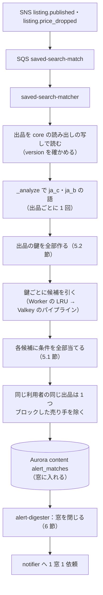

# Saved searches and alerts: Mercari

保存した検索と新着の通知。保存した検索の条件と正規化、照合の鍵の選び方、自前の逆索引の置き場所、照合の Worker（`saved-search-matcher`）、値下げで条件に入った出品の当て直し、まとめの窓と上限、送る前の見える範囲の確かめ、取りこぼしの確かめ（参照の実装との比べ）を決める。

前提となる決定は次のとおり。

- 保存した検索の照合は OpenSearch の percolator ではなく、自前の逆索引で行う。照合の鍵（カテゴリ × ブランド、ブランド、カテゴリ、語の主な語幹）ごとに保存した検索の ID の一覧を content の表に持ち、Valkey に写す。新しい出品・値下げの事象で、出品の鍵から候補を引き、条件を全部当てる（[ADR-0008](../decisions/0008-search-engine-and-index.md)）
- 送る前に `listingVisible()` を通す（[ADR-0007](../decisions/0007-single-tenant-and-party-visibility.md)）
- 一致の定義は検索と共有する `match_v1` の語の一致（[search-and-discovery.md](search-and-discovery.md) の 5.1 節、[ADR-0018](../decisions/0018-search-index-layout-and-japanese-analysis.md)）
- 保存した検索は本人だけのデータ（ADR-0007）。保存した検索の語をログに出さない（[AGENTS.md](../../AGENTS.md)）

この文書で決めたことは次の ADR にある。

| ADR | 決定 |
| --- | --- |
| [0022](../decisions/0022-saved-search-match-keys-and-inverted-index.md) | 保存した検索ごとに、取りうる照合の鍵のうち出品の流量の見込みが最も小さい鍵の組（ブランドが複数なら各ブランドの鍵）を 1 つ選ぶ。語の鍵は問い合わせの語の B の単位の語のうち最もまれなもの。出品は全欄の C と B の単位の語、祖先のカテゴリ、ブランドから鍵を全部出す。逆索引の正本は Aurora content、Valkey には鍵ごとに分けた hash（1 つ 2,000 件まで）に条件を詰めて置き、Worker のメモリーにバージョンつきでキャッシュする。毎晩 200 件の出品で全件の素直な照合と比べ、取りこぼし 0 を確かめる |
| [0023](../decisions/0023-saved-search-alert-windows-and-caps.md) | 一致は利用者ごとの 180 秒の窓でまとめ、窓ごとにプッシュ 1 通にする。1 人 1 日のプッシュは 20 通まで、超えた分はアプリの中の一覧だけ。同じ利用者と出品の組は 7 日に 1 回。窓を閉じる時に出品の状態と `listingVisible()` を確かめる。値下げは、前の価格で条件の外、新しい価格で条件の中の保存した検索だけに当てる |

## 1. 範囲

- 扱う：保存した検索の条件・上限・正規化、照合の鍵、逆索引の正本と写し、照合の Worker、新しい出品と値下げの事象の扱い、まとめの窓、上限、重複の除き、送る前の確かめ、アプリの中の新着の一覧、取りこぼしの確かめ。
- 扱わない：
  - 通知の配信（プッシュ・メールの送信、端末のトークン、配信の設定、全体の速さの上限）（`notifications.md`）。この文書は 1 つの窓につき 1 つの依頼を作るところまで。
  - いいねした出品の値下げの通知（`notifications.md`）。値下げの事象の受け方は共通にする（5.4 節）。
  - 検索の問い合わせと解析器（[search-and-discovery.md](search-and-discovery.md)）。

## 2. 事実（確かめたこと）

| 項目 | 事実 | この設計 |
| --- | --- | --- |
| 本家の保存した検索の上限・通知の間隔 | 1 人 30 件は [intent.md](../intent.md) の MVP の範囲。本家の通知の間隔とまとめ方は公式の資料で確かめられなかった（**未検証**） | 30 件。180 秒の窓（6 節） |
| 本家の保存した検索のプッシュ | 該当の新規の出品がリアルタイムで通知され、設定の後 30 日だけ有効。通知はアプリにだけ届く（[ヘルプの記事 239](https://help.jp.mercari.com/guide/articles/239/)） | プッシュの有効を 30 日にする（4.1 節）。本家に寄せる |

2026-10-10 に確認。

## 3. 要件

| 要件 | 値 | 出どころ |
| --- | --- | --- |
| 通知の速さ | 出品の公開・値下げから、保存した検索の新着のプッシュの依頼まで p95 5 分 | NFR-008 |
| 取りこぼし | 照合の結果が、全保存した検索に条件を素直に当てた結果と同じ（取りこぼし 0、余り 0） | [quality.md](../quality.md) の 2.2.1 節 E、E6 の合否（夜間の比べが 7 日続けて緑） |
| fan-out | 広い条件の保存した検索 100 万と新しい出品 50 件/秒で、1 人 1 窓 1 通、1 日の上限を超えない | 同 I |
| 見える範囲 | 措置・売り切れ・停止の出品、ブロックした相手の出品を送らない | ADR-0007、NFR-016 |
| 規模 | S1 で保存した検索 2,000 万、新しい出品 30 万件/日 | [architecture/README.md](README.md) の 2 節 |

## 4. 保存した検索

### 4.1 条件

| 項目 | 上限 |
| --- | --- |
| 語 `q` | 50 文字、`ja_c` で分けて 8 語まで |
| カテゴリ | 1 つ（どの階層でも） |
| ブランド | 5 つまで |
| 価格 | 下限・上限 |
| 状態 | 6 段の複数 |
| 配送料の負担、配送の方法 | 任意 |
| 販売の状態 | 販売中だけ（保存した検索では変えられない） |

- 語・カテゴリ・ブランドのどれも持たない保存した検索（価格だけなど）は保存できない。鍵が作れず、全出品に一致しうるため。
- 1 人 30 件（[intent.md](../intent.md)）。保存した検索ごとにプッシュの入・切を持つ。
- プッシュは入れてから 30 日だけ有効（`push_enabled_until`。本家に寄せる）。過ぎたらアプリの中の一覧だけに入れ、利用者が入れ直せば 30 日延びる。期限の 3 日前に、アプリの中のお知らせで知らせる。
- 名前は自動で付ける（語とカテゴリの名前から）。利用者が変えてよい。

### 4.2 正規化

保存の時に、`saved-search-api`（`search-api` の中の関数）が次を作り、条件と一緒に保存する。

1. `q` を OpenSearch の `_analyze` で `ja_c` と `ja_b` にかけ、語の集合 `q_terms_c`（C の単位）と、各語の B の単位の分け方 `q_terms_b` を得る。解析器は索引と同じもの（`listings` の別名の今の索引）を使う。
2. ブランドの ID は `merged_into` で写した後の ID にする。カテゴリの ID は後継に写す。
3. `analyzer_version`（索引のスキーマの番号と辞書のバージョン）を保存する。索引の作り直しで解析器が変わったら、全保存した検索を作り直しのジョブで解析し直す（7.3 節）。
4. 正規化した条件のハッシュ（`cond_hash`）で、同じ利用者の同じ条件の重複を拒む。

## 5. 照合（ADR-0022）

### 5.1 一致の定義

保存した検索 s と出品 L について、次のすべてを満たすとき一致する（`match_v1` の語の一致。2-gram の一致は使わない）。

- L の `status` が `on_sale`。
- s のカテゴリが L の `category_path` にある（指定のあるとき）。
- L の `brand_id` が s のブランドのどれか（指定のあるとき）。
- 価格・状態・配送の条件をすべて満たす。
- `q_terms_c` のどの語 q も、L の C の単位の語の集合 D にあるか、q の B の単位の語がすべて L の B の単位の語の集合 E にある（[search-and-discovery.md](search-and-discovery.md) の 5.1 節）。
- s が有効になった時刻（`active_from`）より後に、L が公開された（または値下げされた）。

### 5.2 照合の鍵

| 鍵 | 形 | 保存した検索の側で使うとき |
| --- | --- | --- |
| カテゴリ × ブランド | `cb:{category_id}:{brand_id}` | カテゴリとブランドを持つ。ブランドごとに 1 つ |
| ブランド | `b:{brand_id}` | ブランドを持ち、カテゴリを持たない |
| カテゴリ | `c:{category_id}` | カテゴリを持ち、ブランドを持たない |
| 語 | `t:{語}` | 語を持つ。語の鍵は `q_terms_b` の全部の語のうち最もまれな 1 つ |

**出品の側の鍵**：出品 L は、次の鍵を全部出す。

- `cb:{a}:{brand}`（祖先の各カテゴリ a。3 つ）、`b:{brand}`（ブランドがあるとき）、`c:{a}`（3 つ）。
- `t:{w}`：全欄（題名、ブランドの文字、カテゴリの名前、説明）の `ja_c` と `ja_b` の語の和の全部。平均 180 語前後の見込み。

**語の鍵で取りこぼさない理由**：s の語の鍵 `t:x` の x は、ある語 q の B の単位の語の 1 つ。L が s に一致するなら、q ∈ D か、q の B の単位の語がすべて E にある。前者なら、L の q を含む欄を `ja_b` で分けた語に x が入る（同じ文字の列を B の単位で分けるので）。後者なら x ∈ E。どちらでも L は `t:x` を出す。カテゴリ・ブランドの鍵は、L の祖先とブランドを全部出すので明らか。この性質は PROP-SS-001 で確かめる。

**鍵の選び方**：保存した検索の取りうる鍵の組（ブランドの鍵の組、カテゴリの鍵、各語の鍵）のうち、出品の流量の見込み（鍵ごとの 1 日の出品の数。直近 7 日の平均を日次で `ss_key_rates` に集計）の和が最も小さい組を 1 つ選ぶ。

- 例：s =（カテゴリ 1203、ブランド 88・91、語「未開封」）。取りうる組は {`cb:1203:88`, `cb:1203:91`}（流量 150 + 40 = 190/日）、{`t:未開封`}（4,000/日）。前者を選ぶ。
- 流量の見込みが変わっても正しさは変わらない（どの鍵でも取りこぼさない）。月に 1 回、全保存した検索の鍵を選び直す。

### 5.3 逆索引の置き場所

- **正本**：Aurora content の `saved_searches`（本人だけ。FORCE RLS）と `saved_search_keys`（`match_key`、`ss_id`、`user_id`、`packed`、`keys_version`、`updated_at`）。`saved_search_keys` は `saved-search-matcher` のサービスの役割だけが読む。
- **写し**：Valkey の `ss:k:{key}:{shard}`（hash。`ss_id` → 詰めた条件 `packed`）。`packed` は条件を MessagePack で詰めたもの（平均 100 バイト）。語は文字のまま持たず、索引の語の 64 ビットのハッシュで持つ（Valkey の中の文字を減らし、語の比べを数の比べにする）。
- **分け方**：1 つの鍵の件数が 2,000 を超えたら、分ける数（`ss:ks:{key}`、1・2・4・…・64）を倍にし、`ss_id` のハッシュで振り直す。
- **バージョン**：鍵ごとに `ss:kv:{key}`（整数）を持ち、変更のたびに 1 上げる。Worker はメモリーの LRU（1 GB）に鍵の中身をバージョンつきで持ち、バージョンが同じなら Valkey から読まない。
- **書き込み**：保存・変更・削除は content の 1 つのトランザクションで `saved_searches`・`saved_search_keys`・outbox（`saved_search.changed`）を書く。`ss-index-writer`（`saved-search-matcher` の中の消費者）が Valkey を直し、終わった時刻を `active_from` に書く。
- **量（S1）**：2,000 万件 × 平均 1.3 鍵 × 100 バイト ≒ 2.6 GB と鍵の分の余り。Valkey の 1 つのシャードの組に収まる（`capacity.md` で確かめる）。

### 5.4 照合の流れ

- **値下げ**：`listing.price_dropped`（前の価格 p₀、新しい価格 p₁）では、価格の条件が p₀ で外れ、p₁ で入る候補だけを一致にする。価格の条件のない保存した検索は、公開の時にすでに当たっているので、値下げでは当てない。通知の文は「値下げで条件に入った」にする。いいねした出品の値下げの通知は `notifications.md` が同じ事象を別の待ち行列で受ける。
- 照合は出品ごとに冪等（`alert_matches` の一意 `(user_id, listing_id, reason)`）。事象の重複・再処理で一致は増えない。

### 5.5 量の見積もり（S1：新しい出品 30 万件/日、保存した検索 2,000 万）

**1 件の出品の例**：題名「【未開封】ワイヤレスイヤホン 第3世代」、カテゴリ 家電(7) > オーディオ(71) > イヤホン(1203)、ブランド 88、価格 9,800 円、状態 `new_unused`、説明 300 文字。

| 鍵 | 件数（見込み） | 条件を当てた後の一致 |
| --- | --- | --- |
| `cb:1203:88` | 4,200 | 1,150（価格の上限 9,800 以上、状態の条件） |
| `cb:71:88` | 600 | 70 |
| `cb:7:88` | 150 | 12 |
| `b:88` | 9,000 | 40（ブランドだけで、カテゴリを持たない保存した検索。多くは別の品の語を持ち、外れる） |
| `c:1203` | 2,500 | 6（ブランドなし・語なしで、カテゴリと価格だけ） |
| `c:71`、`c:7` | 1,100 | 2 |
| `t:*`（180 語） | 9,500 | 4 |
| 計 | 27,050 | 約 1,280 |

- 候補の 27,050 件に条件を当てる。1 件 1.5µs（TypeScript で詰めた条件を数で比べる）で 41ms の CPU。
- 1 日の候補の数：保存した検索ごとの鍵の流量の和として見る。中央の値 40 件/日、平均 400 件/日（広い条件の長い裾）と見込むと、2,000 万 × 400 = 80 億件/日、平均 9.3 万件/秒、夕方の山（平均の 3 倍）で 28 万件/秒。CPU は山で 0.5 vCPU 分。Worker は Valkey からの読み出し（山で 1 秒 28 MB）が主な費用で、LRU で減らす。
- 1 日の一致：平均 1 出品 7 件と見込み、210 万件/日。窓のまとめ（平均 1 窓 2.5 件）で 84 万窓、上限の後のプッシュ 70 万通/日前後（見込み）。`saved-search-matcher-poc` で、合成の保存した検索の分布（広い条件の割合を変えて）で確かめる。
- 広すぎる保存した検索（選んだ鍵の流量が 3,000 件/日を超える）は、保存の画面で「新着が多すぎます。条件を足すと通知が届きやすくなります」と出す。保存は拒まない。

## 6. まとめと上限（ADR-0023）

### 6.1 窓

- 利用者ごとに、最初の一致で 180 秒の窓を開く（`ops.saved_search_digest_minutes` の既定 3。運用で伸ばす口は [notifications.md](notifications.md) の失敗の扱いと共有する）。窓の間の一致を集め、窓を閉じる時に 1 つの通知の依頼にする。
- `alert-digester` は 10 秒ごとに、閉じる時刻を過ぎた窓を拾う（`FOR UPDATE SKIP LOCKED`）。
- 依頼の中身：保存した検索ごとの新着の数と、各 3 件までの出品の ID。文は `notifications.md` が組む（例：「イヤホン 未開封 に新着 3 件ほか 2 件の条件」）。

**時間の予算（公開からプッシュの依頼まで）**

| 区間 | 値 |
| --- | --- |
| 公開から事象（relay、SNS、SQS） | p95 1.5 秒 |
| 照合 | p95 3 秒 |
| 窓 | 最長 180 秒（窓の中の位置で 0〜180 秒） |
| 窓を拾う | 最長 10 秒 |
| 送る前の確かめと依頼 | p95 2 秒 |
| 計 | 最悪 197 秒、p95 3.3 分前後。NFR-008 の 5 分の中 |

- 窓の 180 秒は、NFR-008 の 5 分を、出品の公開から数えても守れる範囲で最も長い値にした。統合の工程で、[architecture/README.md](README.md) の 1.3 節 E と [notifications.md](notifications.md) をこの 3 分に揃え、NFR-008 を出品の公開・値下げの commit から数えると決めた（README の 3 節）。
- 依頼の後、`notifier` が静かな時間（既定 23:00〜9:00）と `engagement` の 1 人 1 日 30 通の上限を当てる（[ADR-0064](../decisions/0064-fanout-batching-quiet-hours-and-caps.md)）。静かな時間で止めた間は NFR-008 の数えから外す（notifications.md と同じ）。

### 6.2 上限

| 上限 | 値 | 超えたとき |
| --- | --- | --- |
| 1 人 1 日のプッシュ（保存した検索） | 20 通（`alerts.max_push_per_day`、日本時間の 0 時に戻す） | アプリの中の一覧だけに入れる。その日の最後のプッシュに「今日はこれ以上通知しません」と添える |
| 1 窓の出品 | 保存した検索ごとに 3 件を出し、残りは数だけ | - |
| 同じ利用者と出品 | 7 日に 1 回（公開と値下げで別の理由でも 1 回） | 2 回目は窓に入れない |
| 1 つの出品から作る一致 | 10 万件 | 超えたら警告し、超えた分を次の Worker の実行に回す（捨てない） |

- 利用者の配信の設定（保存した検索の通知の切、静かな時間）と `engagement` の級の上限（1 日 30 通）は、[notifications.md](notifications.md) が依頼を受けた後に効かせる（ADR-0064）。この文書の上限（保存した検索だけで 20 通）は、その前に効く。通知の種類は `saved_search.digest`。

### 6.3 送る前の確かめ

- 窓を閉じる時に、各出品を core の `status` と `listingVisible(viewer, listing)`（文脈 `notification`）で確かめる。`on_sale` でない・`hidden` の出品は依頼から除く（除いた数を数える）。
- 1 件も残らなければ依頼を作らない。
- 保存した検索が窓の間に消された・プッシュを切られたら、その分を除く。

### 6.4 アプリの中の新着の一覧

- `alert_matches` を利用者ごとに 7 日・500 件まで持ち、「保存した検索の新着」の画面に出す。上限で送らなかった一致も入る。
- 一覧を出す時にも 6.3 節の確かめをする。
- おすすめの候補 B（[search-and-discovery.md](search-and-discovery.md) の 7.3 節）は、この一覧の直近 24 時間を使う。

## 7. 取りこぼしの確かめ

### 7.1 参照の実装

- `saved-search-ref`：保存した検索の全件に、5.1 節の条件を素直に当てる（鍵を使わない）。出品の語は同じ `_analyze` の結果を使う。
- PR と夜間の性質ベーステストで、`saved-search-matcher` の一致と比べる（PROP-SS-001）。

### 7.2 本番の比べ（毎晩）

- その日の公開の出品から 200 件を無作為に選び、その時点の全保存した検索（content の読み出しの写しの断面）に `saved-search-ref` を当てる。2,000 万 × 200 = 40 億回の判定で、8 vCPU で 15 分程度の見込み。
- `alert_matches`（上限で送らなかった分を含む。一致はすべて記録する）と比べ、取りこぼし・余りを数える。目標は 0。1 件でもあれば SEV3 として調べ、縮めた例を回帰テストに足す。
- 比べは保存した検索の条件と出品の ID だけで行い、語を記録に出さない。

### 7.3 解析器の変更

- 索引の作り直しで解析器・辞書が変わると、保存した検索の `q_terms` と出品の語がずれる。作り直しの別名の切り替えと同じ時刻に、全保存した検索を新しい解析器で解析し直す（作り直しの前に新しい解析器で計算して `saved_search_keys` の次のバージョンを作り、切り替えでバージョンを変える）。
- 切り替えの前後 1 日は、7.2 節の比べを 1,000 件に増やす。

## 8. 失敗と回復

| 事象 | 影響 | 扱い |
| --- | --- | --- |
| Valkey の喪失 | 候補を引けない | 照合を止め（SQS に溜める）、`saved_search_keys` から作り直す（2,600 万行、5 万行/秒で 9 分）。作り直しの印（`ss:ready:{gen}`）が立ってから再開。取りこぼしでなく遅れにする |
| `saved-search-matcher` の遅れ | 通知が遅れる | 最古の年齢 60 秒で警告、タスクを増やす。5 分を超えた一致は窓に入れずにアプリの中の一覧だけに入れる（遅い通知を出さない） |
| `ss-index-writer` の遅れ | 新しい保存した検索が効かない | `active_from` が付くまで「準備中」と出す。定義（5.1 節）で、有効の前の出品は当たらない |
| `_analyze` の失敗 | 出品の語が作れない | 再試行。続けば事象を再試行の待ち行列に戻す。語の鍵を飛ばした一部だけの照合をしない |
| 広い保存した検索の嵐 | 1 出品の一致が多い | 6.2 節の上限。照合は続ける |
| 送る前の確かめの Valkey の喪失 | `listingVisible()` の写しがない | core の出品と措置を直接読む（遅いが正しい） |
| `notifier` の停止 | 依頼が溜まる | 依頼は SQS に溜まる。5 分を超えたものは `notifications.md` の規則で捨てるか送る |

## 9. 上限

| 対象 | 値 |
| --- | --- |
| 保存した検索 | 1 人 30 件、語 50 文字・8 語、ブランド 5 |
| 鍵の hash | 1 つ 2,000 件、分ける数 64 まで |
| 窓 | 180 秒 |
| プッシュ | 1 人 1 日 20 通 |
| 同じ利用者と出品 | 7 日に 1 回 |
| アプリの中の一覧 | 7 日・500 件 |
| 保存・変更の速さ | 1 人 1 分 10 回 |

## 10. data-model への項目

| 置き場所 | 中身 | 節 |
| --- | --- | --- |
| Aurora content `saved_searches`（`ss_id`（UUIDv7）、`user_id`、`name`、`q`、`q_terms_c`、`q_terms_b`、`category_id`、`brand_ids`、`price_min`、`price_max`、`conditions`、`shipping_payer`、`shipping_methods`、`push_enabled`、`push_enabled_until`、`cond_hash`、`analyzer_version`、`chosen_keys`、`active_from`、`created_at`、`updated_at`）。FORCE RLS。一意 `(user_id, cond_hash)` | 保存した検索の正本 | 4 |
| Aurora content `saved_search_keys`（`match_key`、`ss_id`、`user_id`、`packed`、`keys_version`、`updated_at`）。主キー `(keys_version, match_key, ss_id)`、索引 `(keys_version, ss_id)`（`key` は SQL の予約語なので `match_key`。[data-model.md](data-model.md) の D-13）。サービスの役割だけ | 逆索引の正本 | 5.3 |
| Aurora content `ss_key_rates`（`match_key`、`listings_per_day`、`window_end`） | 鍵の流量 | 5.2 |
| Aurora content `alert_matches`（`user_id`、`listing_id`、`ss_id`、`reason`（`published`・`price_dropped`）、`matched_at`、`window_id`、`sent`、`suppressed_reason`）。一意 `(user_id, listing_id, reason)`。FORCE RLS（本人）とサービスの役割。7 日 | 一致 | 5.4、6.4 |
| Aurora content `alert_windows`（`window_id`、`user_id`、`opens_at`、`closes_at`、`state`、`push_count_day`） | 窓 | 6.1 |
| Valkey `ss:k:{key}:{shard}`、`ss:ks:{key}`、`ss:kv:{key}`、`ss:ready:{gen}` | 写し | 5.3 |
| SQS `saved-search-match`。outbox の話題 `saved_search.changed`、`alert.digest_requested` | 事象 | 5.4、6.1 |
| AppConfig `ops.saved_search_digest_minutes`、`alerts.max_push_per_day` | 窓と上限 | 6 |

## 11. テストと性質

| ID | 性質・試験 |
| --- | --- |
| PROP-SS-001 | 任意の保存した検索の集合と出品で、`saved-search-matcher` の一致は `saved-search-ref` の一致と同じ（取りこぼし 0、余り 0）。鍵の選び方を変えても同じ（[quality.md](../quality.md) の 2.2.1 節 E） |
| PROP-SS-002 | 出品の側の鍵の集合は、その出品に一致しうるすべての保存した検索の選んだ鍵を含む（5.2 節の理由の機械の確かめ） |
| PROP-SS-003 | 任意の事象の重複と再処理で、`alert_matches` の行は増えない |
| PROP-SS-004 | 任意の一致の列で、1 人 1 窓のプッシュは 1 通以下、1 日 20 通以下、同じ利用者と出品は 7 日に 1 回以下 |
| PROP-SS-005 | 窓を閉じる時に `on_sale` でない・`hidden` の出品は、依頼に含まれない |
| PROP-SS-006 | 値下げの事象で一致するのは、前の価格で価格の条件の外、新しい価格で中の保存した検索だけ |
| PROP-SS-007 | 鍵の hash を分け直す（1 → 64）間に照合しても、候補の集合は変わらない |
| 夜間の比べ | 7.2 節の比べが 7 日続けて取りこぼし 0（E6 の合否） |
| 負荷 | 広い条件の保存した検索 100 万と新しい出品 50 件/秒で、照合の遅れ p95 3 秒、1 人 1 窓 1 通（同 I） |
| 仮想の時計 | 窓の開閉、日の境の上限の戻し、7 日の重複の除き |

## 12. Story の候補

| Epic | Story | 中身 |
| --- | --- | --- |
| E6 | `saved-search-matcher-poc` | 合成の分布で、鍵の流量、候補の数、一致の数、通知の量、Valkey の量を測る（5.5 節） |
| E6 | `saved-searches` | 保存、正規化、上限、重複、`active_from`（4 節） |
| E6 | `saved-search-matcher` | 鍵の選び方、逆索引、写し、Worker、値下げ、参照の実装（5 節、7.1 節） |
| E6 | `saved-search-digests` | 窓、上限、送る前の確かめ、アプリの中の一覧（6 節） |
| E6 | `saved-search-recall-audit` | 毎晩の比べ、解析器の変更の手順（7.2・7.3 節） |

## 13. 未解決の問い

### 決定（2026-10-10、既定案）

- **照合の鍵**：流量の最も小さい鍵の組を 1 つ選ぶ。語の鍵は B の単位の最もまれな語。出品は全欄の C と B の語を出す（ADR-0022）。
- **一致**：`match_v1` の語の一致だけ。2-gram は使わない。
- **逆索引**：正本は Aurora content、写しは Valkey の分けた hash、Worker の LRU（ADR-0022）。
- **窓**：180 秒、1 窓 1 通、1 日 20 通、7 日に 1 回（ADR-0023）。
- **値下げ**：条件に新しく入ったときだけ。

### 持ち越し

| 問い | いつ・どう決めるか |
| --- | --- |
| 1 日 20 通の上限と 180 秒の値 | E6 の前の `saved-search-matcher-poc` と、S1 の通知の解除の率を見て PM が見直す |
| 候補の数・Valkey の量の見込み（平均 400 件/日の流量） | `saved-search-matcher-poc` で合成の分布を使って測る |
| 2-gram の一致を保存した検索にも使うか（辞書にない語の取りこぼし） | S1 の運用で、検索では出るが保存した検索で当たらない出品の割合を見て決める |
| 保存した検索の語をおすすめ・分析に使う範囲 | 法務の確認待ち（L5） |
