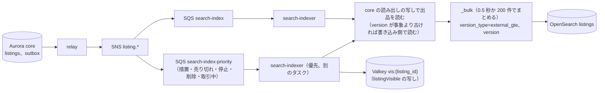

# Search and discovery: Mercari

検索と発見。出品の索引の形、日本語の解析（Sudachi と 2-gram）、索引への反映と出品から検索に出るまでの時間、問い合わせの組み立てと一致の定義、絞り込みと集計、並べ替えと自前の順位の式、売れた品の検索、いいねと閲覧の履歴、基本のおすすめ、`listingVisible()` の写しでの絞り込みを決める。

前提となる決定は次のとおり。

- 検索は Amazon OpenSearch Service に、販売中・取引中・売り切れの出品を 1 つの論理の索引で入れ、`status` で分ける。既定の検索は販売中だけ。題名・説明は Sudachi の B と C の単位、ICU の正規化、かな・カナの揃え、題名の 2-gram の欄で引く。出品のバージョンを外部のバージョンにする。措置・売り切れ・停止は別の待ち行列で先に流す。順位は自前の決めた式（BM25 × 新しさ × いいね × 売り手の評価の段 × 写真の質）（[ADR-0008](../decisions/0008-search-engine-and-index.md)）
- 検索の結果は、索引の写しで絞り、返す前に Valkey の `listingVisible()` の写しでもう一度通す（[ADR-0007](../decisions/0007-single-tenant-and-party-visibility.md)）
- ML の順位とおすすめは MVP の後。MVP のおすすめは規則と決めた式（[ADR-0010](../decisions/0010-ml-boundary-for-pricing-and-recommendations.md)）
- 出品の状態とバージョンは [listings-and-photos.md](listings-and-photos.md) の 4 節（[ADR-0011](../decisions/0011-listing-state-machine-and-versions.md)）

この文書で決めたことは次の ADR にある。

| ADR | 決定 |
| --- | --- |
| [0018](../decisions/0018-search-index-layout-and-japanese-analysis.md) | 索引 `listings_v<n>`（別名 `listings`）は S1 で主シャード 8・写し 1。題名は Sudachi の C の単位の欄・B の単位の子の欄・2-gram の子の欄を持ち、2-gram の欄だけひらがなをカタカナに揃える。ブランドは別名を展開した `brand_text` で持つ。書き込みは `version_type=external_gte` と出品の `version`。売れた品は 365 日で消す。一致の定義 `match_v1`（語は全部の欄をまたいで全部を含む、または題名の 2-gram の 75%）を検索と保存した検索で共有する |
| [0019](../decisions/0019-ranking-formula-v1.md) | 「おすすめ順」は `ranking_v1`：BM25 の点 × 新しさ（半減 72 時間、下限 0.5）× いいね（1 + 0.15·ln(1+いいね)、いいね 1,000 で頭打ち）× 売り手の段（0.8〜1.05）× 写真の質（0.9〜1.0）。上位 1,000 件だけを式で並べ直す。同じ点は出品の ID の降順。式はバージョンで出し、フラグで切り替えない |
| [0020](../decisions/0020-likes-history-and-rule-recommendations.md) | いいねは content の本人の表と、出品のいいねの数の 10 秒ごとのまとめた加算で持つ。閲覧の履歴は 1 人 200 件・90 日で、使わない設定を持つ。おすすめは閲覧・いいねのカテゴリ × ブランドの新着、保存した検索の新着、カテゴリの人気の 3 つの候補を、決めた式で並べ、1 売り手 3 件までにする |

## 1. 範囲

- 扱う：索引の置き場所・形・欄、解析器、索引への反映（`search-indexer`）と優先の待ち行列、作り直し、一致の定義、問い合わせの組み立て、絞り込みと集計、並べ替え、順位の式、売れた品の検索、ページの深さ、見える範囲の絞り込み、いいね、閲覧の履歴、基本のおすすめ。
- 扱わない：
  - 保存した検索の照合（[saved-searches-and-alerts.md](saved-searches-and-alerts.md)）。この文書は共有する一致の定義 `match_v1` を決める。
  - ブランドの正規化と辞書（[categories-brands-and-pricing-suggestions.md](categories-brands-and-pricing-suggestions.md) の 5 節）。
  - `listingVisible()` の決定表の全体（ADR-0007）。この文書は検索の経路での使い方を決める。
  - OpenSearch のドメインの大きさ・ノードの種類（`capacity.md`、`infrastructure.md`）。この文書は見込みだけを書く。
  - ML の順位とおすすめ（MVP の後）。

## 2. 事実（確かめたこと）

いずれも 2026-10-10 に確認。

| 項目 | 事実 | この設計 |
| --- | --- | --- |
| Sudachi のプラグイン | Amazon OpenSearch Service は Sudachi を任意のプラグインとして持ち、日本語に勧めている。ICU と kuromoji はすべてのドメインに入っている。Sudachi の辞書の付け直しは次の blue/green のデプロイまで反映しない（[Plugins by engine version](https://docs.aws.amazon.com/opensearch-service/latest/developerguide/supported-plugins.html)） | 辞書の更新は新しい索引への作り直しで行う（4.5 節） |
| Sudachi の部品の名前 | トークナイザー `sudachi_tokenizer`（`split_mode` は A・B・C、既定 C）、フィルター `sudachi_split`（`search`・`extended`）、`sudachi_normalizedform`、`sudachi_part_of_speech`、`sudachi_ja_stop`、`sudachi_readingform`、`sudachi_baseform`（[elasticsearch-sudachi](https://github.com/WorksApplications/elasticsearch-sudachi)） | 4.3 節 |
| 本家の検索の基盤、既定の並べ替え | Elasticsearch とする採用の募集だけで確かめた（**未検証**）。既定の並べ替えは**未検証** | OpenSearch。既定は新しい順（ADR-0008） |

## 3. 要件

| 要件 | 値 | 出どころ |
| --- | --- | --- |
| 出品から検索まで | 公開・編集・停止が結果に出るまで p95 10 秒・p99 60 秒。措置・売り切れは p99 60 秒 | NFR-001 |
| 検索の速さ | 絞り込みと集計を含めて p95 200ms・p99 500ms。売れた品も同じ | NFR-010 |
| 可用性 | 検索 月間 99.9% | NFR-007 |
| 措置の反映 | 措置から検索・おすすめから消えるまで p99 60 秒 | NFR-016 |
| 見える範囲 | `listingVisible()` が `hidden` の出品が結果に 0 件 | [quality.md](../quality.md) の 2.2.1 節 G |
| 規模 | S1 で検索の最大 3,000 件/秒、新しい出品 30 万件/日 | [architecture/README.md](README.md) の 2 節 |

## 4. 索引（ADR-0018）

### 4.1 置き場所と形

- **ドメイン**：東京の 3 AZ、専用のマスター 3。出品の索引と写真のハッシュの索引（[listings-and-photos.md](listings-and-photos.md) の 5.4 節）を同じドメインに置く。
- **索引**：`listings_v<スキーマの番号>` と別名 `listings`。文書は出品ごとに 1 つ。ID は `listing_id`。
- **件数の見込み（S1）**：販売中・取引中 3,000 万。売れた品は 10 万件/日 × 365 日 ≒ 3,650 万。計 7,000 万件前後（[architecture/README.md](README.md) の 2 節。統合の工程で README の 1.5 億をこの値に直した）。
- **大きさの見込み**：文書あたり索引の後で 2 KB（2-gram の欄を含む）として、7,000 万件で 140 GB（主）。主シャード 8（1 シャード 18 GB 前後。40 GB 以下を保つ）、写し 1。S2 の 2.8 億件で 560 GB になり、販売中と売れた品の索引に分ける（[ADR-0074](../decisions/0074-stage-up-criteria-and-split-plan.md)）。`search-index-poc` で測って直す。
- **振り分け**：`_routing` を使わない（検索は全出品をまたぐ）。
- **S2**：販売中と売れた品を別の索引（`listings_active`、`listings_sold`）に分け、売れた品は写し 1・シャードを大きく持つ（ADR-0008）。別名の付け方は同じ。

### 4.2 欄

| 欄 | 型・解析 | 用途 |
| --- | --- | --- |
| `listing_id` | keyword | ID、同じ点の並べ |
| `seller_id` | keyword | ブロックの除外、1 売り手の上限 |
| `status` | keyword（`on_sale`・`trading`・`sold`） | 既定は `on_sale` |
| `vis` | keyword（`ok`・`hidden`） | 見える範囲の写し（`listingVisible()` の文脈に依らない部分：出品の措置、売り手の停止・退会）。`hidden` は索引から消すまでの間の印 |
| `mod_flags` | keyword の配列 | 措置の要約（価格の提案の標本から除く） |
| `title` | text（`ja_c`）＋子の欄 `title.b`（`ja_b`）、`title.bigram`（`ja_bigram`） | 検索 |
| `description` | text（`ja_c`） | 検索（低い重み） |
| `brand_id` | keyword | 絞り込み、集計 |
| `brand_text` | text（`brand_norm`：`normalizeBrandText` と同じ規則の正規化の後、keyword の分け方）＋子の欄 `brand_text.ja`（`ja_c`） | ブランドの名前の検索。正式な名前と全別名を展開して入れる |
| `category_id` | keyword | 3 階層目 |
| `category_path` | keyword の配列 | 全祖先の ID（後継に写した後） |
| `category_names` | text（`ja_c`） | カテゴリの名前での検索 |
| `price` | integer | 絞り込み、並べ替え |
| `condition` | keyword | 絞り込み |
| `shipping_payer`、`shipping_method`、`ship_days` | keyword | 絞り込み |
| `published_at`、`sold_at` | date | 並べ替え、新しさ |
| `like_count` | integer | 順位 |
| `seller_tier` | keyword（`new`・`standard`・`trusted`・`low`） | 順位（[ratings-and-reputation.md](ratings-and-reputation.md) の 5 節） |
| `photo_quality` | half_float | 順位 |
| `thumb` | keyword（索引しない） | 結果の表示の写真の ID |
| `version` | long | 外部のバージョン |

- `description` は 1,000 文字までなので全文を入れる。`_source` は `description` を除いて持つ（結果の表示に説明は使わない。大きさを減らす）。

### 4.3 日本語の解析

```text
char_filter : icu_normalizer（nfkc_cf）、long_vowel_map（「〜」「～」「－」を「ー」に）、zero_width_strip
ja_c        : sudachi_tokenizer（split_mode: C、辞書：標準のフル辞書＋本システムのフリマの語の追加辞書）
              → sudachi_normalizedform → sudachi_part_of_speech（助詞・助動詞・記号を除く）→ sudachi_ja_stop → lowercase
ja_b        : 同じ。ただし split_mode: B
ja_bigram   : icu_normalizer → icu_transform（Hiragana-Katakana）→ ngram（2〜2、文字と数字だけ）→ lowercase
brand_norm  : normalizeBrandText と同じ規則（ICU と自前の対応表で組む）→ keyword
問い合わせ  : 同じ解析器。入力は 100 文字まで。query_string を使わない（利用者の入力を演算子として解釈しない）
```

- 例 1：題名「ワイヤレスイヤホン 第3世代 未開封」
  - `ja_c`：「ワイヤレスイヤホン」が C の単位で 1 語になる見込み（辞書による。`search-index-poc` で確かめる）。`ja_b` では「ワイヤレス」「イヤホン」。
  - 問い合わせ「イヤホン ワイヤレス」は `ja_b` で 2 語とも一致する。問い合わせ「ワイヤレスイヤホン」は `ja_c` で一致する。
- 例 2：題名「ｶﾞﾝﾌﾟﾗ　ＨＧ　ｻﾞｸ」と問い合わせ「がんぷら ざく」
  - NFKC で「ガンプラ HG ザク」。問い合わせの「がんぷら」は `ja_c` では一致しないことがある（ひらがなの語として分かれる）が、`ja_bigram` でかなをカタカナに揃え、「ガン」「ンプ」「プラ」が一致する。
- 追加辞書は、カタログの担当が持つ（新しい作品名・型番の語。ブランドの名前は入れない。[categories-brands-and-pricing-suggestions.md](categories-brands-and-pricing-suggestions.md) の 2 節）。更新は四半期に 1 回まで、新しい索引への作り直しで出す。

### 4.4 反映と、出品から検索に出るまでの時間



- `search-indexer` は事象の中身を使わず、出品を読み直して文書を作る。事象が欠けても、次の事象で正しい形になる。
- `external_gte` にする理由：いいねの数の更新（7.1 節）で、同じ `version` の文書を書き直したい。`version` が小さい古い事象は拒まれる。同じ `version` の書き直しは、中身が同じか、いいねの数だけ新しい。
- 措置・売り切れ・停止・削除は、優先の待ち行列で流し、`vis:{listing_id}` を先に書き、その後に索引を書く。検索の結果は返す前に `vis` を見るので、索引の反映を待たずに消える（5.4 節）。
- `refresh_interval` は 1 秒。

**時間の予算（公開から検索に出るまで、p95）**

| 区間 | p95 |
| --- | --- |
| core の commit から relay が outbox を読む | 1.0 秒 |
| SNS → SQS | 0.3 秒 |
| `search-indexer` の受け取りとまとめ | 0.5 秒 |
| 出品の読み直し | 0.1 秒 |
| `_bulk` | 0.6 秒 |
| refresh | 1.0 秒 |
| 計 | 3.5 秒（NFR-001 の 10 秒に 6.5 秒の余り。内部の目標を 5 秒にする） |

- 合成の監視：見張りの出品を 1 分ごとに公開・停止し、検索に出る・消えるまでを測る（NFR-001 の SLI）。
- 待ち行列の最古の年齢が 5 秒（通常）・10 秒（優先）を 3 分続けたら警告する。

### 4.5 作り直しと売れた品の保持

1. 新しい索引 `listings_v<n+1>` を作る（新しい解析器・欄・辞書）。
2. `search-indexer` を両方に書くようにする。
3. core の出品（`on_sale`・`trading`、売れてから 365 日以内の `sold`）を `listing_id` の範囲ごとに読み、新しい索引に入れる（`reindex_jobs` に範囲ごとの印）。
4. 状態ごとの件数と、1 万件の抜き取りの文書の中身を比べ、合えば別名を移す。
5. 7 日の後に古い索引を消す。

- 売れた品は `sold_at` から 365 日で、日次のジョブ（`delete_by_query`）で消す。保持の日数は `search.sold_retention_days` に置く。
- カタログの設定の公開（カテゴリの移動・廃止、ブランドの別名の変更）は、影響する出品だけを読み直して入れる（`catalog.published` の差分から出品を引く）。

## 5. 検索

### 5.1 一致の定義 `match_v1`

検索と保存した検索（[saved-searches-and-alerts.md](saved-searches-and-alerts.md)）で同じ定義を使う。

- 問い合わせの語：問い合わせを `ja_c` で分けた語（正規化した形）の集合 Q。
- 出品の語：`title`・`brand_text.ja`・`category_names`・`description` の `ja_c` の語の和の集合 D、`title.b` と `brand_text` の語の和の集合 E。
- **語の一致**：Q のすべての語 q について、q ∈ D か、q を `ja_b` で分けた語がすべて E にある。
- **2-gram の一致**：問い合わせを `ja_bigram` で分けた 2-gram のうち 75% 以上（切り上げ）が、題名の 2-gram にある。
- 検索の一致は「語の一致 または 2-gram の一致」。保存した検索の一致は「語の一致」だけで、2-gram の一致を使わない（通知は確かさを優先する。保存した検索の結果は検索の結果の部分集合になる）。

### 5.2 問い合わせの組み立て

`packages/search` の `searchListings(ctx, query)` だけが OpenSearch の問い合わせを作る。`ctx` は閲覧者（ブロックの一覧）、時刻、`ranking_version` を持つ。

```json
{
  "query": {
    "bool": {
      "filter": [
        { "term": { "status": "on_sale" } },
        { "term": { "vis": "ok" } },
        { "terms": { "category_path": ["<絞り込み>"] } },
        { "range": { "price": { "gte": 3000, "lte": 10000 } } }
      ],
      "must_not": [ { "terms": { "seller_id": ["<閲覧者のブロックの一覧>"] } } ],
      "must": [ { "bool": { "should": [
        { "multi_match": { "query": "<q>", "type": "cross_fields", "operator": "and",
          "fields": ["title^3", "title.b^2", "brand_text.ja^3", "category_names^1.5", "description^0.5"] } },
        { "term": { "brand_text": { "value": "<q の正規化がブランドの別名に一致したとき>", "boost": 5 } } },
        { "match": { "title.bigram": { "query": "<q>", "minimum_should_match": "75%", "boost": 0.5 } } }
      ], "minimum_should_match": 1 } } ]
    }
  },
  "sort": [ { "published_at": "desc" }, { "listing_id": "desc" } ],
  "size": 33, "track_total_hits": 10000
}
```

- `cross_fields` と `operator: and` で、語は欄をまたいで全部を含む（`match_v1` の語の一致）。`title.b` を含めて、C の単位の語が B の単位に分かれた場合も拾う。
- 「おすすめ順」は `sort` を `_score` にし、5.5 節の `rescore` を付ける。
- 問い合わせの語がなく、カテゴリ・ブランドだけで見るとき（一覧）は `must` を `match_all` にする。
- 1 ページ 30 件。`size` は 30 に、見える範囲で落ちる分の 10% を足して 33（5.4 節）。

### 5.3 絞り込みと集計

| 絞り込み | 欄 | 上限 |
| --- | --- | --- |
| カテゴリ | `category_path` | 1 つ（どの階層でも） |
| ブランド | `brand_id` | 10 |
| 価格 | `price` | 300〜9,999,999 の範囲 |
| 状態 | `condition` | 6 段の複数 |
| 配送料の負担 | `shipping_payer` | - |
| 配送の方法 | `shipping_method` | 複数 |
| 販売の状態 | `status`：`on_sale`（既定）、`sold`（売り切れ。`trading` と `sold`） | - |

- 集計は、次の階層のカテゴリ（上位 30）、ブランド（上位 20）、価格の帯（〜1,000、〜3,000、〜5,000、〜10,000、〜30,000、〜100,000、それ以上）、状態、配送料の負担。選んだ絞り込みの自分の条件を外した数を `post_filter` で出す。
- 件数は 1 万件まで正確に数え、それ以上は「1 万件以上」と出す（`track_total_hits: 10000`）。集計の数は「おおよそ」と表示する（見える範囲の最後の絞り込みは集計に効かないため）。
- 並べ替え：`newest`（既定。`published_at` の降順）、`price_asc`、`price_desc`、`recommended`（5.5 節）、`likes`（いいねの数の降順）。売れた品の検索の既定は `sold_at` の降順。

### 5.4 見える範囲と深さ

- 索引の欄の `status`・`vis` で絞った後、返す前に各件を `vis:{listing_id}`（Valkey）で確かめ、`listingVisible()`（`packages/visibility`）を閲覧者と文脈 `search` で呼ぶ。`hidden` は捨て、捨てた数を数える（SLI。目標は索引の反映が追いついた後の 0）。
- 捨てた分は 33 件の余りで埋める。余りでも足りないときは、そのページは 30 件より少なくてよい（次のページの開始は `search_after` で正しく続く）。
- Valkey が使えないときは、索引の `vis` だけで返し、購入は core の状態で必ず確かめる（ADR-0007）。
- **見張りの出品**：`sentinel` の印を持つ出品は、`sentinel` の印を持つ閲覧者のときだけ `visible` で、それ以外の閲覧者には `hidden`（`listingVisible()` の措置の行の次の行。索引の `vis` にも `sentinel` を写し、検索の段で外す）。統合の工程で [observability.md](observability.md) の 4 節の提案を採った（[ADR-0007](../decisions/0007-single-tenant-and-party-visibility.md) の注記）。
- ページの深さ：`newest`・価格・`likes` は `search_after` で 3,000 件（100 ページ）まで。`recommended` は 1,000 件まで。それより先は「条件を絞ってください」と出す。

### 5.5 順位の式 `ranking_v1`（ADR-0019）

```
score = text × fresh × pop × seller × photo

text   = 5.2 節の問い合わせの BM25 の点（語のない一覧のときは 1）
fresh  = 0.5 + 0.5 × exp(−ln 2 × age_hours / 72)          … 公開から 72 時間で 0.75、下限 0.5
pop    = 1 + 0.15 × ln(1 + min(like_count, 1000))          … 1.0〜2.04
seller = { new: 0.95, standard: 1.0, trusted: 1.05, low: 0.8 }[seller_tier]
photo  = 0.9 + 0.1 × photo_quality                          … 0.91〜1.0
同じ点は listing_id の降順（UUIDv7 なので新しい順）
```

- 実装：問い合わせの段は BM25（と語のない一覧は `published_at` の降順）で上位を取り、`rescore`（`window_size: 1000`、`script_score`、`score_mode: multiply` の形で式の残りを掛ける）で並べ直す。式は Painless のスクリプトに書き、`ranking_version` の名前で保存したスクリプトとして出す。
- `age_hours` は `ctx` の時刻から計算する（索引の時刻ではない）。
- 式と重みはコードのバージョンとして出す。重みを変えるときは `ranking_v2` を作り、影の評価（本番の問い合わせで両方を計算し、上位 30 件の重なりとクリック・いいねの率を比べる）を 7 日回してから切り替える。フラグで経路ごとに切り替えない。

**例：問い合わせ「ワイヤレスイヤホン」の 2 件**

| | 出品 A | 出品 B |
| --- | --- | --- |
| BM25 | 12.0 | 14.0 |
| 公開から | 6 時間 | 120 時間 |
| いいね | 3 | 40 |
| 売り手の段 | `standard` | `trusted` |
| 写真の質 | 0.8 | 0.9 |
| fresh | 0.5 + 0.5 × exp(−0.6931 × 6/72) = 0.5 + 0.5 × 0.9439 = 0.9719 | 0.5 + 0.5 × exp(−0.6931 × 120/72) = 0.5 + 0.5 × 0.3150 = 0.6575 |
| pop | 1 + 0.15 × ln 4 = 1.2079 | 1 + 0.15 × ln 41 = 1.5570 |
| seller | 1.0 | 1.05 |
| photo | 0.98 | 0.99 |
| score | 12.0 × 0.9719 × 1.2079 × 1.0 × 0.98 ≒ **13.81** | 14.0 × 0.6575 × 1.5570 × 1.05 × 0.99 ≒ **14.90** |

- B が上に来る。B が A と同じ 6 時間の公開なら score は 22.0 で、差はさらに開く。A が公開から 30 時間でいいね 3 のままなら、fresh は 0.8746 で score は 12.42 に下がる。
- 新しさの下限 0.5 は、売れ残りの良い出品が一覧の底に沈みすぎないためにある。新しさだけで見たい買い手は `newest` を使う。

### 5.6 売れた品の検索

- 同じ索引で `status` を `trading`・`sold` にする。価格は売れた価格（出品の最後の価格）。並べ替えの既定は `sold_at` の降順。
- ログインした利用者だけが使える。ログインしていない要求には 401 を返し、販売中の検索だけを出す。売れた品の価格の一覧は相場のデータとして持ち出しの価値が最も高く、電話番号で確かめたアカウントごとの速さの上限で絞る（統合の工程で [security.md](security.md) の 3.3 節の提案を採った。[ADR-0008](../decisions/0008-search-engine-and-index.md) の注記）。
- 結果から購入の操作を出さない（`visible_readonly`）。
- 価格の提案の標本も同じ文書を読む（[categories-brands-and-pricing-suggestions.md](categories-brands-and-pricing-suggestions.md) の 6 節）。

## 6. 予測の入力と語の候補

- MVP は、入力の途中の候補をブランドの別名とカテゴリの名前だけから出す（カタログの設定の写しで、`search-api` のメモリーの中の前方一致）。利用者の検索の語の記録から候補を作らない（個人の検索の語が他の利用者に出ないため。閲覧の履歴の利用は法務の L5 の後）。

## 7. いいね・閲覧の履歴・おすすめ（ADR-0020）

### 7.1 いいね

- content の `likes`（`user_id`、`listing_id`、`created_at`、主キー `(user_id, listing_id)`）。本人だけの表（FORCE RLS）。いいねの一覧は本人だけが見る。
- 出品のいいねの数は、`like.added`・`like.removed` の事象を `like-counter`（`search-indexer` の中の消費者）が 10 秒ごとに出品ごとにまとめ、core の `listings.like_count` を加算で直す。数は目安で、日次の照合（`likes` の数え直し）で直す。
- 索引のいいねの数は、前に入れた値から 10% 以上か 5 以上動いた出品だけを、15 分ごとに読み直して書く（`external_gte`、同じ `version`）。
- 1 人のいいねは 5,000 件まで。いいねした出品の値下げの通知は `notifications.md`。

### 7.2 閲覧の履歴

- content の `view_history`（`user_id`、`listing_id`、`viewed_at`）。本人だけの表。1 人 200 件（古いものから消す）、90 日。
- 設定で「閲覧の履歴をおすすめに使わない」を選べる。選んだ利用者には 7.3 節の候補 A を作らない。履歴の利用の範囲は法務の確認待ち（L5）。

### 7.3 おすすめ（規則）

| 候補 | 作り方 | 最大 |
| --- | --- | --- |
| A：好みの新着 | 直近 20 件の閲覧といいねから、（3 階層目のカテゴリ、ブランド）の組を、閲覧 1・いいね 3 の重みと 7 日の半減で数え、上位 3 組の 48 時間以内の新着 | 各組 30 |
| B：保存した検索の新着 | 保存した検索の直近 24 時間の一致（[saved-searches-and-alerts.md](saved-searches-and-alerts.md) の 6.4 節） | 30 |
| C：人気 | 候補 A の組の 2 階層目のカテゴリ（なければ全体）で、直近 24 時間のいいねの増えた数の上位 | 30 |

```
rec_score = 0.5 × affinity + 0.3 × fresh + 0.2 × pop24
affinity = 組の重み ÷ 最大の組の重み（B は 1.0、C は 0.3）
fresh    = 5.5 節と同じ
pop24    = min(1, ln(1 + 24 時間のいいねの増え) / ln(101))
```

- 並べた後、1 売り手 3 件まで、1 つの組 40% まで。見た出品と自分の出品を除く。`listingVisible()` を文脈 `recommendation` で通す。
- ログインしていない利用者と、履歴のない利用者には C だけを出す（全体の人気）。
- 計算は要求の時に `search-api` が行い、利用者ごとに 10 分キャッシュする（Valkey）。

## 8. 失敗と回復

| 事象 | 影響 | 扱い |
| --- | --- | --- |
| OpenSearch の 1 ノードの喪失 | 写しで続く | 自動で戻る。黄の状態が 30 分を超えたら警告 |
| OpenSearch の全体の停止 | 検索が止まる | 検索の画面に「一時的に検索できない」。出品・購入は止めない。復旧の後、止まった間の事象を SQS から流す（SQS の保持 4 日） |
| `search-indexer` の遅れ | 新しい出品が出ない | 最古の年齢で警告、タスクを増やす。優先の待ち行列は別のタスクで、通常の遅れの影響を受けない |
| 事象の欠け | 文書が古い | 日次の照合：core の `listings` の `(listing_id, version, status)` と索引を 1/7 ずつ比べ、違えば読み直して入れる |
| Valkey の喪失 | 最後の見える範囲の確かめが効かない | 索引の `vis` で返す。購入は core で拒む。優先の事象を流し直して `vis` を作り直す |
| 解析器の誤り（辞書の更新で取りこぼし） | 引けない語 | 作り直しの前の試験のベクトル（11 節）で止める。出した後なら別名を古い索引に戻す（7 日残す） |
| 人気の問い合わせの集中 | 遅れ | 同じ問い合わせ（正規化した語と絞り込み、ブロックの一覧のない匿名）の結果を 10 秒キャッシュする |

## 9. 上限

| 対象 | 値 |
| --- | --- |
| 問い合わせの語 | 100 文字 |
| 1 ページ | 30 件 |
| 深さ | 3,000 件（`recommended` は 1,000） |
| 絞り込み | ブランド 10、状態 6、カテゴリ 1 |
| 集計 | カテゴリ 30、ブランド 20 |
| いいね | 1 人 5,000 件 |
| 閲覧の履歴 | 1 人 200 件、90 日 |
| 検索の速さの上限 | 1 人 1 分 120 回（`security.md` の速さの上限と合わせる） |
| 売れた品の保持 | 365 日 |

## 10. data-model への項目

| 置き場所 | 中身 | 節 |
| --- | --- | --- |
| OpenSearch `listings_v<n>`（別名 `listings`） | 4.2 節の欄 | 4 |
| Aurora content `likes`（`user_id`、`listing_id`、`created_at`）。FORCE RLS | いいね | 7.1 |
| Aurora content `view_history`（`user_id`、`listing_id`、`viewed_at`）、`user_discovery_settings`（`user_id`、`use_history`） | 閲覧の履歴 | 7.2 |
| Aurora core `listings.like_count`（listings-and-photos の表の列） | いいねの数 | 7.1 |
| Aurora core `reindex_jobs`（`job_id`、`target_index`、`range_from`、`range_to`、`state`、`count`） | 作り直し | 4.5 |
| Valkey `vis:{listing_id}`（`status`、`mod`、`seller_state`、`version`）、`rec:{user_id}`（10 分）、`sq:{hash}`（10 秒） | 写しとキャッシュ | 4.4、5.4、7.3 |
| SQS `search-index`、`search-index-priority`。outbox の話題 `like.added`・`like.removed`・`listing.viewed`（本人の履歴だけ） | 事象 | 4.4、7 |
| OpenSearch の保存したスクリプト `ranking_v1` | 順位の式 | 5.5 |
| AppConfig `search.sold_retention_days` | 保持 | 4.5 |

## 11. テストと性質

| ID | 性質・試験 |
| --- | --- |
| PROP-SRCH-001 | 任意の出品の事象（作成、編集、値下げ、措置、売り切れ、取り消しの戻し、いいねの数の更新）を重複と順序の入れ替えで流しても、最後の索引の文書は core の最後の内容と一致する（[quality.md](../quality.md) の 2.2.1 節 E） |
| PROP-SRCH-002 | 措置・売り切れ・停止の事象の後、仮想の時計で 60 秒以内に、検索の結果に出ない（`vis` と索引の両方を止めた場合を含む） |
| PROP-SRCH-003 | 任意の問い合わせと閲覧者で、結果に `listingVisible()` が `hidden` の出品とブロックした売り手の出品が 0 件 |
| PROP-SRCH-004 | `match_v1` の語の一致を満たす出品は、検索の結果（`newest`、深さの範囲の中）に必ず含まれる（参照の実装：語の集合での素直な判定） |
| PROP-SRCH-005 | `ranking_v1` の点は、いいねの数・写真の質・売り手の段について単調に増え、年齢について単調に減る。同じ点の並びは `listing_id` の降順で決まる |
| PROP-SRCH-006 | 並べ替えは絞り込みの結果を変えない（並べ替えの前と後の集合が同じ。ADR-0010 の部分集合の性質） |
| PROP-SRCH-007 | 任意の閲覧者で、`sentinel` の出品は `sentinel` の閲覧者の結果にだけ出る。ログインしていない閲覧者の結果に `trading`・`sold` の出品が出ない（統合の工程で足した） |
| 試験のベクトル | 全角・半角、かな・カナ、長音、ブランドの英字とカナ、旧字、絵文字を含む題名で、決めた語から決めた出品が引けること（QA が期待する値を持つ）。5.5 節の例の点 |
| 負荷 | 検索 3,000 件/秒（S1）で p95 200ms・p99 500ms、出品 30 万件/日の反映を同時に（NFR-010） |
| 外からの見張り | 公開から検索に出るまで、停止から消えるまで（NFR-001） |

## 12. Story の候補

| Epic | Story | 中身 |
| --- | --- | --- |
| E5 | `search-index-poc` | Sudachi の辞書と分割、2-gram、大きさ、`photo_hashes` の引き方（4.1〜4.3 節） |
| E5 | `search-index-and-indexer` | 索引、`external_gte`、優先の待ち行列、作り直し、照合（4.4〜4.5 節） |
| E5 | `search-query-and-filters` | `match_v1`、問い合わせ、絞り込み、集計、深さ（5.1〜5.4 節） |
| E5 | `sold-listings-search` | 売れた品の検索、保持（5.6 節） |
| E5 | `ranking-formula-v1` | `ranking_v1`、影の評価の枠（5.5 節） |
| E5 | `likes-and-history` | いいね、いいねの数、閲覧の履歴と設定（7.1・7.2 節）。履歴の利用は法務：L5 |
| E5 | `basic-recommendations` | 規則のおすすめ（7.3 節） |
| E5 | `listing-visible-snapshot` | `vis` の写しと検索の後の確かめ（5.4 節） |

## 13. 未解決の問い

### 決定（2026-10-10、既定案）

- **索引**：1 つの論理の索引、主シャード 8・写し 1、売れた品 365 日（ADR-0018）。
- **解析**：`ja_c`・`ja_b`・`ja_bigram`。かなの揃えは 2-gram の欄だけ。ブランドは展開した `brand_text`。
- **書き込み**：`external_gte` と出品の `version`。
- **一致**：`match_v1`。検索は語か 2-gram、保存した検索は語だけ。
- **順位**：`ranking_v1`（ADR-0019）。既定の並べ替えは新しい順。
- **いいね・履歴・おすすめ**：ADR-0020。

### 持ち越し

| 問い | いつ・どう決めるか |
| --- | --- |
| C の単位と B の単位の分割の結果、追加辞書の中身、2-gram の 75% の値 | E5 の前の `search-index-poc` で、試験のベクトルの取りこぼしと余計な一致を測って Dev と QA が決める |
| 閲覧の履歴と検索の語をおすすめに使う範囲（L5） | 法務の確認待ち。E5 の `likes-and-history` の spec の承認の前 |
| `ranking_v1` の重み（72 時間、0.15、段の係数） | S1 の運用の 1 か月で、影の評価とクリック・いいねの率を見て見直す（`ranking_v2`） |
| 予測の入力に利用者の検索の語を使うか | 法務の L5 の後に PM が決める |
