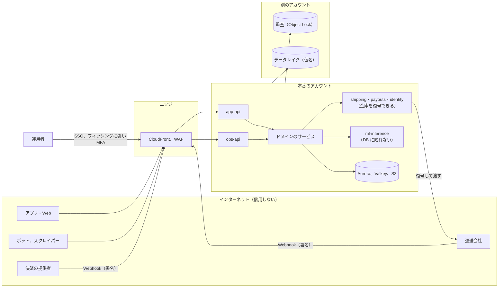
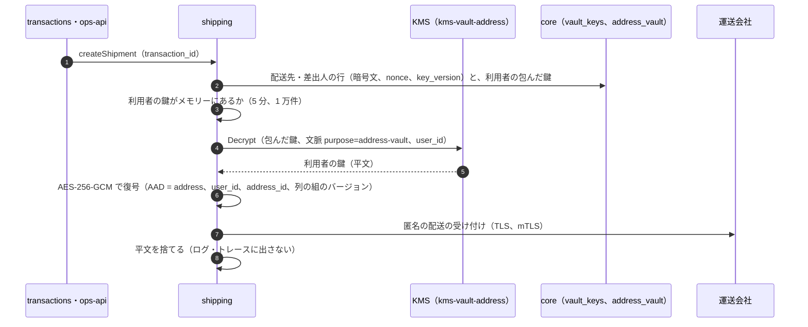

# Security: Mercari

安全の設計を横断して決める。目標と信頼境界、脅威モデル（売上金を狙う乗っ取り、偽の発送、スクレイピング、住所の漏れ、メッセージでのフィッシング、振込の不正、住所の金庫への内部の者のアクセス）、データの区分、暗号化と鍵の配置（住所の金庫の封筒の暗号化）、運用者のアクセスと監査、データの寿命（法務の L5）、カード情報の範囲、脆弱性と供給網、インシデントへの対応を扱う。

前提となる決定は次のとおり。

- 住所は `shipping` の金庫に KMS の鍵での封筒の暗号化で置き、復号は `shipping` の役割だけ（[ADR-0006](../decisions/0006-shipping-orchestration-via-carriers.md)）
- 本人の表の FORCE RLS、2 者の RLS、`listingVisible()`、運用者は案件に結び付く JIT の権限（[ADR-0007](../decisions/0007-single-tenant-and-party-visibility.md)）
- カード番号に触れない（[ADR-0005](../decisions/0005-payments-via-providers-and-capture-at-purchase.md)）
- 措置は記録してから効かせる。ML は信号（[ADR-0009](../decisions/0009-trust-and-safety-pipeline-boundary.md)）
- ログイン、セッション、大事な操作の強い確認と 72 時間の振込の待ち（[ADR-0066](../decisions/0066-sign-in-sessions-and-devices.md)、[ADR-0067](../decisions/0067-account-takeover-step-up-and-payout-holds.md)）

この文書で決めたことは次の ADR にある。

| ADR | 決定 |
| --- | --- |
| [0069](../decisions/0069-key-layout-and-vault-envelope-encryption.md) | KMS の鍵を用途ごとに分ける（クラスタの保存、住所の金庫、口座、本人の連絡先、本人確認、監査、データレイク、秘密）。住所の金庫と口座は、利用者ごとのデータの鍵（AES-256-GCM）を用途の KMS の鍵で包み、行ごとに追加の認証データ（利用者、行、列の組）を付ける。KMS の暗号化の文脈に用途と利用者を入れ、復号の権限は `shipping`（住所）と `payouts`（口座）の役割だけに置く。人の役割に復号の権限を置かない。消去は利用者のデータの鍵の破棄で行う。金庫の鍵は複数のリージョンの鍵にして大阪で使えるようにする |
| [0070](../decisions/0070-operator-access-vault-reveal-and-audit.md) | 運用者は案件に結び付く 2 時間の JIT の権限で見る。住所・口座の番号・本人確認の記録は「見せる」操作の種類に分け、2 人目の承認と、1 回の操作で 1 件だけ、運用者ごとの 1 日の上限（20 件）を置く。見せる処理は `ops-api` から持ち主のサービス（`shipping`・`payouts`・`identity`）を呼び、運用者の端末に平文を残さない。本番の DB への人の接続は、2 人の承認の break-glass の読み出しだけで、金庫の復号の権限を持たない。監査の事象は操作と同じトランザクションで書き、流れごとのハッシュの鎖で別のアカウントの S3 Object Lock に写す |
| [0071](../decisions/0071-data-classes-and-lifecycle.md) | データを 9 つの区分（秘密、金庫、2 者、本人、公開、お金、監査、運用、分析）に分け、区分ごとに置き場所・暗号化・ログに出してよいか・保持の既定を 1 つの表で持つ。保持の値は本システムの既定で、法務の L5（と L2・L8）の結論で置き換える。消す処理は区分ごとの `retention-sweeper` が行い、大きな表は月の区切りで落とす。データレイクには金庫と 2 者の本文を入れず、利用者の ID はレイク専用の鍵の HMAC にする |

ログインと端末は [accounts-and-devices.md](accounts-and-devices.md)、不正の規則と審査は [trust-and-safety.md](trust-and-safety.md)、ネットワークと egress は [infrastructure.md](infrastructure.md)、計装の規則は [observability.md](observability.md) にある。

## 1. 目標と前提

| 目標 | 値 | 出どころ |
| --- | --- | --- |
| 住所の秘匿 | 相手に住所・氏名・電話番号が出た事象 0 | NFR-014、K7 |
| 本人・2 者のデータの分離 | 他の利用者に出た事象 0 | NFR-014 |
| 内部の者の覗き | 理由と監査のない住所・口座・本人確認の閲覧 0 | [intent.md](../intent.md) の守るべき振る舞い |
| 利用者のデータをログに出さない | ログの走査で、住所・氏名・電話番号・メールアドレス・口座の番号・カード番号の形の検出 0 | [quality.md](../quality.md) の 2.2.1 節 G |
| 鍵の漏えいの範囲 | 1 つの部品の侵害で復号できる範囲を、その部品の用途に限る | 本システムの既定 |
| 監査 | 運用者の操作の記録の欠け 0、改ざんを検出できる | [quality.md](../quality.md) の 5 節 E16 |
| 脆弱性 | E18 の外部のペンテストで High 以上 0 | [quality.md](../quality.md) の 5 節 E18 |

## 2. 信頼境界

| 境界 | 越えるもの | 守り |
| --- | --- | --- |
| インターネット → `app-api` | 利用者の要求、ボット | WAF、速さの上限、セッション（[accounts-and-devices.md](accounts-and-devices.md) の 5 節）、`actor_id` はセッションからだけ |
| 提供者・運送会社 → 本システム | Webhook | 署名の検証、inbox、照会で確かめる（[ADR-0005](../decisions/0005-payments-via-providers-and-capture-at-purchase.md)、[ADR-0006](../decisions/0006-shipping-orchestration-via-carriers.md)） |
| サービス → 金庫 | 住所・口座・連絡先の平文 | 用途ごとの KMS の鍵と暗号化の文脈、役割ごとの復号の権限（5 節） |
| 本システム → 運送会社・銀行 | 住所、口座 | egress の許可の一覧と mTLS（[infrastructure.md](infrastructure.md) の 2.4 節）。運送会社への渡し方の整理は法務の確認待ち（L5） |
| 運用者 → 本番 | 人の操作 | JIT の権限、見せる操作の承認、監査（6 節） |
| 本番 → 別のアカウント | 監査、仮名のデータ | 書くだけの権限、Object Lock、仮名（6.4・7 節） |
| サービス → `ml-inference` | 出品の題名・説明・写真の参照、価格 | `ml-inference` は DB と金庫に触れず、住所・メッセージの本文を受けない（[infrastructure.md](infrastructure.md) の 5 節） |

## 3. 脅威モデル

| # | 脅威 | 入口 | 影響 | 主な守り |
| --- | --- | --- | --- | --- |
| T1 | 売上金を狙う乗っ取り | SMS のコードの詐取、SIM の乗っ取り、番号の再利用、端末の盗難 | 売上金・残高の振込、残高での購入、信用の悪用 | パスキー、端末の鍵、強い確認、72 時間の振込の待ち（3.1 節） |
| T2 | 偽の発送 | 引き受けのない発送の通知、偽の追跡の番号 | 代金の詐取、買い手の損 | 匿名の配送は運送会社の引き受けが条件、預かり（3.2 節） |
| T3 | スクレイピング | 検索、出品の詳細、売れた品の検索、プロフィール | 相場のデータの持ち出し、偽の出品の素材、負荷 | WAF の Bot Control、速さの上限、ページの深さ（3.3 節） |
| T4 | 住所の漏れ | 画面・API・通知・メッセージ・ログ・運用の画面・データレイク | 個人の安全 | 金庫、漏れの経路の表、ログの走査（3.4 節） |
| T5 | メッセージでのフィッシング | 取引のメッセージ・コメントのリンク、偽の事務局 | 乗っ取り、外の取引への誘導 | リンクを押せる形にしない、送り元の印、SMS の形（3.5 節） |
| T6 | 振込の不正 | 乗っ取り、盗んだカードで買って売上金を作る（現金化）、運び屋の口座 | 本システムの損、犯罪収益の移転（法務の L2） | 預かり、振込の待ち、口座の HMAC、T&S の規則（3.6 節） |
| T7 | 住所の金庫への内部の者のアクセス | 運用の画面、本番の DB、鍵 | 大量の住所の持ち出し | 人に復号の権限なし、見せる操作の承認と上限、監査（3.7 節、6 節） |
| T8 | カード情報の漏れ | 本システムのサーバー・ログ | 加盟店の義務の違反 | カード番号を受けない（8 節） |
| T9 | 他の利用者の取引・本人のデータの漏れ | RLS の誤り、キャッシュの鍵、エラーの応答 | NFR-014 の違反 | FORCE RLS、2 者の RLS、`listingVisible()`、応答の監査（[ADR-0007](../decisions/0007-single-tenant-and-party-visibility.md)） |
| T10 | 外への送信からの SSRF | 運送会社・提供者の応答の URL、画像の取得 | 中の機械・メタデータの取得 | egress の許可の一覧、IMDSv2（[infrastructure.md](infrastructure.md) の 2.4 節） |
| T11 | 供給網 | 依存のライブラリ、ML のモデルの重み、ビルドの経路 | すべて | 依存の許可の一覧、SBOM、署名（9 節） |
| T12 | 人気の出品のボットの購入 | 自動の購入、連打 | 転売、他の買い手の不利 | 先着の印、WAF、T&S の規則（[runbooks/](../runbooks/README.md) の 5.1 節） |

### 3.1 T1：売上金を狙う乗っ取り

- 乗っ取りの価値は、着金した振込でしか現金にならない。守りの中心を「振込の前」に置く：大事な操作の強い確認と 72 時間の待ち（[ADR-0067](../decisions/0067-account-takeover-step-up-and-payout-holds.md)）、待ちの始まりの全経路の通知、「これは私ではない」。
- パスキーのアカウントは SMS だけでは新しい端末に入れない（[ADR-0066](../decisions/0066-sign-in-sessions-and-devices.md)）。パスキーの登録を、最初の売上の時と口座の登録の時に強く勧める。
- 盗んだ更新のトークンは、端末の鍵なしでは使えない。
- 残高での購入（品を買って転売する）は、新しい端末の最初の 24 時間の 1 万円以上に強い確認を求める。

### 3.2 T2：偽の発送

- 代金は受取評価（か自動の完了）まで預かる（[ADR-0003](../decisions/0003-escrow-and-double-entry-ledger.md)）。売り手に渡るのは取引の完了の後だけ。
- 匿名の配送は、運送会社の `accepted` の事象がなければ `shipped` にならない（[ADR-0006](../decisions/0006-shipping-orchestration-via-carriers.md)）。
- 匿名でない配送は、追跡の番号を照会で確かめられないとき、`shipped` に信用の印を付ける。印の付いた取引が自動の完了で売上金になる前に、T&S の規則が人の審査に回せるようにする（規則は [trust-and-safety.md](trust-and-safety.md)、期限の扱いは [transactions-and-state-machine.md](transactions-and-state-machine.md) と合意する）。
- 運送会社の Webhook は署名を確かめ、運送会社が送り元の IP を公開していればエッジでも絞る（**未検証**：運送会社の API の能力は選定の Story で確かめる）。

### 3.3 T3：スクレイピング

| 経路 | 守り |
| --- | --- |
| 検索、売れた品の検索 | WAF の Bot Control（共通）、IP ごと 1 分 120 件、ログインの利用者ごと 1 分 120 件（[search-and-discovery.md](search-and-discovery.md) の上限と同じ）。売れた品の検索はログインを求める案を [search-and-discovery.md](search-and-discovery.md) に出す |
| 出品の詳細、プロフィール | IP ごと 1 分 300 件。ID は UUIDv7 で、連番で辿れない |
| 写真 | 公開の CDN。元の大きさの写真は配らない（[listings-and-photos.md](listings-and-photos.md)） |
| API の全般 | `X-<Brand>-Client` と端末の証明の信号。ブラウザーでないクライアントの多い IP の種類（データセンター）にチャレンジ |

- 値は本システムの初期の値で、E5 の後の計測で直す。正しい利用者の誤ったブロックの率を見張る（[observability.md](observability.md) の 6 節）。

### 3.4 T4：住所の漏れ

- 住所・氏名・電話番号は金庫の封筒の暗号化の列にだけ置く（5.3 節）。相手に見せる表（`transactions`・`shipments` の 2 者の列）に置かない。
- 運送会社の受け付けで返る送り状の情報（ラベルの画像など）に住所が入るときは、`shipping` が売り手に見せる前に住所の部分を出さない形（QR と番号だけ）を選ぶ。運送会社の API の能力は**未検証**。
- 漏れの経路の表（[quality.md](../quality.md) の 2.2.1 節 G）を全経路で回す。通知の中身は許可の一覧の型（[ADR-0063](../decisions/0063-notification-kinds-lanes-and-payload.md)）。
- ログ・トレース・エラーの報告は属性の許可の一覧（[observability.md](observability.md) の 2 節）。住所の型の値はロガーに渡せない（型で禁止）。

### 3.5 T5：メッセージでのフィッシング

- 取引のメッセージ・コメントの URL は、押せるリンクにしない（本システムのドメインを除く）。外の連絡先・URL の検出は悪用の絞り込み（[messaging-and-comments.md](messaging-and-comments.md)。範囲は法務の確認待ち：L11）。
- 運用からの連絡は、アプリの中の事務局の印の付いた経路だけで出す。利用者どうしのメッセージにその印は出ない。
- 本システムの SMS は、コードと、ドメインに結び付いた最後の行（`@<brand>.<domain> #123456`）だけを書き、リンクを入れない（端末の自動の入力が、本システムのドメインでだけ働く）。
- 本システムのメールは、ログインの鍵を含むリンクを入れない（[notifications.md](notifications.md) の 5 節）。DMARC を `p=reject` まで上げる。
- 通知の中身に、メッセージの本文を入れない（[ADR-0063](../decisions/0063-notification-kinds-lanes-and-payload.md)）。

### 3.6 T6：振込の不正

- 代金は預かり、売上金になるのは取引の完了の後。チャージバックは売上金から回収する（[ADR-0005](../decisions/0005-payments-via-providers-and-capture-at-purchase.md)）。
- 振込の口座は `bank_account_hmac`（口座の番号と支店の HMAC）で引ける。同じ口座が複数のアカウントに登録されたら、T&S の信号にする。
- 口座の名義と本人の名前の照合（銀行の API で口座の名義を確かめられるか）は**未検証**。[payouts-and-points.md](payouts-and-points.md) で選定と合わせて決める。
- 疑わしい取引の届出の基準と手順は法務の確認待ち（L2）。T&S の案件の種類として持つ。

### 3.7 T7：住所の金庫への内部の者のアクセス

- 人の IAM の役割（Identity Center の権限のセット）には、`kms-vault-address`・`kms-vault-bank`・`kms-identity-pii`・`kms-kyc` の `kms:Decrypt` を置かない。plan のポリシー検査で拒む（[infrastructure.md](infrastructure.md) の 6 節）。
- 本番の DB に人が入るのは break-glass だけで、金庫の列は暗号文しか見えない。
- 運用の画面の「見せる」操作は、案件・理由・2 人目の承認・1 日の上限・監査を通る（6 節）。運用者ごとの見せた数を毎週見る。
- `shipping` のタスクの中に平文の利用者の鍵が 5 分あり、タスクの侵害で、その間に扱った利用者の住所が読める。タスクには ECS Exec を許さない（本番）。

## 4. データの区分

ADR-0071。詳しい保持の値は 7 節。

| 区分 | 例 | 置き場所 | 暗号化 | ログ・トレースに出してよいか |
| --- | --- | --- | --- | --- |
| S 秘密 | KMS で包んだ鍵、提供者の API の鍵、APNs の鍵、HMAC の鍵 | Secrets Manager、包んだ形で DB | KMS | 出さない |
| V 金庫 | 住所、氏名、電話番号、メールアドレス、生年月日、口座の番号、本人確認の結果と確認した属性 | core（`address_vault`・`accounts` の `*_enc`、本人確認の表）、ledger（`bank_accounts`） | 封筒の暗号化（5.3 節）＋保存時の暗号化 | 出さない（ID だけ） |
| P 2 者 | 取引、取引のメッセージ、配送の状態、紛争 | core、content | 保存時の暗号化 | ID・状態・理由のコードだけ |
| O 本人 | いいね、閲覧の履歴、検索の履歴、保存した検索、通知、セッション、端末 | content、core | 保存時の暗号化 | ID と数だけ。検索の語は出さない |
| U 公開 | 出品、写真、商品のコメント、公開のプロフィール、評価の集計 | core、content、S3、OpenSearch | 保存時の暗号化 | ID だけ（本文を出さない） |
| F お金 | 仕訳、口座の残高、振込、照合の結果 | ledger | 保存時の暗号化 | ID と金額 |
| A 監査 | 監査の事象、措置の記録 | 各クラスタ、log-archive の S3 | 保存時の暗号化、Object Lock | — |
| M 運用 | ログ、メトリクス、トレース | CloudWatch、AMP、X-Ray | 保存時の暗号化 | — |
| L 分析 | 仮名にした事象 | data のアカウントの S3 | `kms-lake` | — |

## 5. 暗号化と鍵（ADR-0069）

### 5.1 転送中

- 外：TLS 1.2 以上、HSTS（`includeSubDomains`）。アプリは本システムの API の証明書の公開鍵の固定（ピン）をしない（証明書の交換の事故を避ける）。
- 中：サービスの間は TLS（ACM の私的な CA）。Aurora は `rds.force_ssl = 1`、Valkey と OpenSearch も TLS。
- 銀行・運送会社：TLS と、相手が求めれば mTLS とクライアントの証明書（[infrastructure.md](infrastructure.md) の 2.4 節）。

### 5.2 KMS の鍵の配置

| 鍵 | 用途 | `kms:Decrypt` を持つ役割 | 複数のリージョン |
| --- | --- | --- | --- |
| `kms-core`、`kms-ledger`、`kms-content` | Aurora の保存時の暗号化、スナップショット | RDS（サービスの権限） | 大阪に別の鍵（Global Database の二次は大阪の鍵） |
| `kms-vault-address` | 住所の金庫の利用者の鍵を包む | `shipping` のタスクの役割だけ | 複数のリージョンの鍵（大阪の写し） |
| `kms-vault-bank` | 口座の番号の利用者の鍵を包む | `payouts` のタスクの役割だけ | 同上 |
| `kms-identity-pii` | 電話番号・メールアドレス・生年月日の列の鍵を包む | `identity` のタスクの役割だけ | 同上 |
| `kms-kyc` | 本人確認の結果と確認した属性の列（書類と顔の画像は本システムに置かない。[ADR-0057](../decisions/0057-identity-data-minimization-and-retention.md)） | `identity` の本人確認の Worker だけ | 同上 |
| `kms-audit` | 監査の写し（log-archive） | 監査の照合のジョブ（読みだけ） | 同上 |
| `kms-lake` | データレイク | data のアカウントの分析の役割 | 東京だけ |
| `kms-secrets` | Secrets Manager | 各サービス（自分の秘密だけ） | 同上 |
| `kms-ops-exports` | 運用の書き出し（法務の照会への回答など） | 書き出しのジョブ | 東京だけ |

- 鍵の政策で、`kms:Decrypt` に暗号化の文脈の条件（`kms:EncryptionContext:purpose`）を付ける。`shipping` の役割でも、`purpose = address-vault` 以外の文脈では復号できない。
- KMS の鍵は年 1 回の自動の交換を有効にする。鍵の削除の予約と無効化は SCP で break-glass の外に禁止する（[infrastructure.md](infrastructure.md) の 1 節）。
- 写真は公開のデータなので、S3 の既定の暗号化（SSE-S3）にする。元の写真（位置情報を消す前）は `kms-core` の SSE-KMS（[listings-and-photos.md](listings-and-photos.md)）。

### 5.3 住所の金庫の封筒の暗号化

| 要素 | 形 |
| --- | --- |
| 利用者の鍵 | 利用者ごと・金庫ごと（住所、口座、連絡先）に 1 つの 256 ビットの鍵。`vault_keys` に包んだ形で置く（`user_id`、`vault`、`key_version`、`wrapped_key`、`kms_key_arn`、`created_at`、`destroyed_at`） |
| 行の暗号 | AES-256-GCM。nonce は行ごとに 96 ビットの乱数。暗号文・nonce・`key_version` を同じ行に置く |
| 追加の認証データ | `vault`、`user_id`、`row_id`、列の組のバージョン。行を別の利用者の行へ写しても復号できない |
| 平文の鍵のキャッシュ | 持ち主のサービスのタスクのメモリーだけ。5 分、1 万件。ディスク・Valkey に置かない |
| 取引の写し | 購入の時に配送先と差出人を `shipment_addresses` に写し、それぞれの利用者の鍵で暗号化する。復号は `openAddress(purpose, subject)` の 1 つの関数と目的のコードだけ（[shipping-integrations.md](shipping-integrations.md) の 7 節、[ADR-0044](../decisions/0044-address-vault-snapshots-and-access.md)）。保持の期間の後に行を消す（7 節） |

- **消去**：退会（[ADR-0068](../decisions/0068-account-deletion-and-minors.md)）と住所の削除で、`vault_keys` の包んだ鍵の行を消す（`destroyed_at` を残す）。暗号文は読めなくなる。Aurora の自動のバックアップ（35 日）に包んだ鍵が残るので、完全に読めなくなるのはバックアップの保持の後である。この 35 日を退会の説明に書く。
- **大阪**：`kms-vault-*` は複数のリージョンの鍵にし、大阪の写しの鍵で同じ包んだ鍵を開けられる。大阪の `shipping` の役割にだけ復号の権限を置く。

### 5.4 引くための HMAC

| 列 | 鍵 | 用途 |
| --- | --- | --- |
| `phone_hmac` | `identity` の HMAC の鍵 | 1 番号 1 アカウント、再登録の制限 |
| `email_hmac` | 同上 | 重複の検査、止めた宛先（`email_suppressions`） |
| `bank_account_hmac` | `payouts` の HMAC の鍵 | 同じ口座の多くのアカウントの検出 |
| レイクの利用者の ID | `kms-lake` で包んだレイクの鍵（年ごとに替える） | 分析の仮名（7.3 節） |

- HMAC の鍵は Secrets Manager に置き、交換は新旧の 2 つで両方を引く期間を置く。

### 5.5 秘密

- 提供者・運送会社・銀行・SMS・APNs・FCM の鍵は Secrets Manager。90 日で回す（提供者が許す範囲で）。
- アプリの中に秘密を置かない。決済の提供者の公開の鍵だけを置く。

## 6. 運用者のアクセスと監査（ADR-0070）

### 6.1 権限の種類

| 種類 | 中身 | 持てる役 | 承認 |
| --- | --- | --- | --- |
| `case.view` | 案件の取引・配送の状態・出品・措置 | CS、T&S、財務 | 案件の担当で自動 |
| `case.view_messages` | 通報・紛争の取引のメッセージ（通報のあったものに限る） | CS、T&S | 案件の担当で自動。範囲は法務の確認待ち（L11） |
| `vault.reveal_address` | 1 件の配送先・差出人を見せる | CS のリーダー、T&S のリーダー | 2 人目（別のリーダー）の承認 |
| `vault.reveal_bank` | 口座の番号の全桁 | 財務 | 2 人目の承認。通常は下 4 桁だけ |
| `kyc.view` | 本人確認の結果と確認した属性（書類の画像は提供者の画面で見る） | 本人確認の担当 | 2 人目の承認 |
| `ledger.adjust` | 打ち消しの仕訳、補償の仕訳 | 財務 | 2 人の承認（[runbooks/](../runbooks/README.md) の 4 節） |
| `legal.respond` | 開示の請求・照会への回答の書き出し | 法務の担当 | 法務の責任者の承認（法務の L6・L7） |

- JIT の権限は `ops-api` が、案件に結び付けて 2 時間で発行する。理由のコードと、短い自由文を求める。自由文は監査の事象の中に暗号化して置き、アプリのログに出さない。
- 運用者のログインは IAM Identity Center の SSO と、フィッシングに強い MFA（セキュリティキーかパスキー）。運用の画面はエッジで社の出口の IP に絞る（[infrastructure.md](infrastructure.md) の 3 節）。

### 6.2 見せる操作

- 見せる操作は、`ops-api` が持ち主のサービス（`shipping.revealAddress`、`payouts.revealBankAccount`、`identity.viewKyc`）を、運用者の権限の証（署名つき、5 分）とともに呼ぶ。持ち主のサービスが権限の証を確かめ、1 件だけ復号して返す。住所は `shipping` の中で `openAddress` の目的のコード `ops_reveal` を通る（[ADR-0044](../decisions/0044-address-vault-snapshots-and-access.md)）。
- 運用の画面は、見せた値を、運用者の ID を透かしに入れた画面で出し、コピーの操作を記録する。画面を閉じると消す。運用者の端末のキャッシュに残さない（`Cache-Control: no-store`）。
- 1 回の操作で 1 件。運用者ごとに 1 日 20 件まで。上限を超える依頼（捜査機関の照会での多くの件数）は、`legal.respond` の書き出しの手順を通す。
- 見せた数は運用者ごとに毎週集計し、セキュリティの担当が確かめる。

### 6.3 本番の DB と基盤への人のアクセス

- 平常は、人は本番の DB・ECS のタスク・S3 に入らない。
- break-glass：Identity Center の別の権限のセット（読み出しの DB の役割と、ECS のタスクの一覧だけ）を、2 人の承認で 4 時間だけ付ける。SSM Session Manager の記録を log-archive に残す。金庫の復号の権限は break-glass にも含めない。
- 書き込みの修正は、手の SQL ではなく、レビューを通したデータの修正のスクリプト（冪等、案件の ID 付き）を CI から流す。台帳はスクリプトでも書かない（打ち消しの仕訳だけ。[ADR-0003](../decisions/0003-escrow-and-double-entry-ledger.md)）。

### 6.4 監査の事象

- 監査の事象は、操作と同じトランザクションで、その表のあるクラスタの `audit_events` に書く（`ops-api` の操作、見せる操作、権限の発行、措置、`legal.*` の変更、手の仕訳、break-glass）。
- `relay` が `audit_events` を読み、流れ（クラスタ × 種類）ごとに `prev_hash` の鎖を付けて、log-archive のアカウントの S3（Object Lock のコンプライアンスのモード）に 5 分ごとに書く。
- 日次の照合のジョブが、鎖の続きと、DB と S3 の件数を照らし、欠けと改ざんを呼び出しにする。
- 保持の既定は 7 年（本システムの値。法務の確認待ち：L5・L2）。

## 7. データの寿命（ADR-0071）

### 7.1 保持の既定

どの値も本システムの既定で、**法務の確認待ち（L5。本人確認は L2、会計は L8）**。結論で置き換える。

| データ | 区分 | 既定の保持 | 消し方 |
| --- | --- | --- | --- |
| 住所の金庫の住所 | V | 利用者が消すか退会まで | 行の削除、退会は鍵の破棄 |
| 配送の受け付けに使った住所（`shipment_addresses`） | V | 取引の終わりから 180 日 | 行の削除 |
| 電話番号・メールの平文 | V | 退会まで | 鍵の破棄 |
| `phone_hmac`（退会の後） | V | 1 年（`suspended` のアカウントは T&S の規則の期間） | 行の削除 |
| 本人確認の結果と確認した属性 | V | 法務の確認待ち（L2・L5）。結論まで消さない。書類と顔の画像は本システムに置かない（[ADR-0057](../decisions/0057-identity-data-minimization-and-retention.md)） | `legal.kyc_*` の期間の後に鍵の破棄と提供者の削除 |
| 口座の番号 | V | 口座の削除・退会まで | 鍵の破棄 |
| 取引のメッセージ | P | 取引の終わりから 2 年 | 月の区切りで落とす |
| 取引・配送の状態・紛争 | P | 10 年（お金の記録と同じ） | 仮名にして残す |
| 閲覧の履歴 | O | 180 日 | 月の区切りで落とす |
| 検索の履歴（本人に見せるもの） | O | 90 日 | 同上 |
| 通知（お知らせの一覧） | O | 90 日 | 同上 |
| セッション、端末の記録 | O | 失効から 1 年 | 行の削除 |
| 売れた出品と写真 | U | 売れてから 1 年（[search-and-discovery.md](search-and-discovery.md) の値に従う） | 索引から外し、写真を消す |
| 仕訳、振込、照合 | F | 10 年 | 残す（期間の後に別の保管へ） |
| 監査の事象、措置の記録 | A | 7 年 | Object Lock の期限 |
| アプリのログ | M | 30 日（CloudWatch）、その後 1 年（S3） | ライフサイクル |
| トレース | M | 30 日 | 同上 |
| データレイクの仮名の事象 | L | 2 年 | パーティションの削除 |

### 7.2 消す処理

- `retention-sweeper` のジョブが、区分ごとの規則を日次で当てる。大きな表（`notifications`、`notification_sends`、`browsing_history`、`transaction_messages`）は月の区切り（PostgreSQL の宣言の区切り）にし、区切りを落とす。
- 消した件数と、期限を過ぎて残る件数を指標にする（[observability.md](observability.md) の 3 節）。期限の 7 日を過ぎた残りはチケット。
- 法令の照会・紛争・措置の対象の行は「保全」の印を付け、印の間は消さない（印の付け外しは `legal.respond` の権限と監査）。

### 7.3 データレイク

- outbox の事象の写しを、`data-lake-baseline` の処理で、金庫（V）の欄と 2 者（P）の本文を落とし、利用者の ID をレイクの鍵の HMAC に置き換えてから入れる。
- 検索の語は、利用者の HMAC と組で 1 年だけ置き、集計（相場、検索の改善）だけに使う。閲覧の履歴の利用の範囲は法務の確認待ち（L5）。
- レイクから個人を指す元の ID へ戻す表は持たない。退会した利用者の事象は、レイクの鍵の年の替わりで結び付かなくなる。

## 8. カード情報の範囲

- カード番号は、決済の提供者のホストした入力部品（アプリの SDK、Web の iframe）で受ける。本システムのサーバー・ログ・DB・トレースに、カード番号とセキュリティコードが入る経路を作らない（[ADR-0005](../decisions/0005-payments-via-providers-and-capture-at-purchase.md)）。
- Web の購入の画面は、提供者の iframe を読むページになるので、そのページのスクリプトの改ざんの守り（CSP、Subresource Integrity、第三者のスクリプトを置かない）を持つ。PCI DSS の自己の評価の種類（どの SAQ に当たるか）は提供者の部品の形で変わるので、E8 の `payment-provider-selection` で確かめる（**未検証**）。
- ログの走査で、カード番号の形（Luhn の検査に通る 13〜19 桁）を検出したら呼び出しにする。

## 9. 脆弱性の管理と供給網

| 対象 | 方法 | 頻度 |
| --- | --- | --- |
| 依存（npm、PyPI） | 許可の一覧、固定、SBOM、既知の脆弱性の走査（CI） | PR、毎日 |
| コンテナのイメージ | Inspector の走査、署名（[delivery.md](delivery.md) の 3 節） | ビルド、毎日 |
| ML のモデルの重み | 出どころの一覧（本家と関係のない公開の汎用のモデルと自前の学習だけ。[ADR-0001](../decisions/0001-platform-and-stack.md)）、ハッシュと署名 | モデルの出すたび |
| アプリ（iOS・Android） | 静的の検査、依存の走査、難読化はしない（解析の妨げより、秘密を置かない） | リリースの列車ごと |
| 外部のペンテスト | 購入、台帳、住所の金庫、運用の画面、ログイン | E18 と年 1 回 |
| 脆弱性の報告の窓口 | `security.txt` と窓口 | 常時 |

- High 以上の脆弱性は 7 日、Critical は 48 時間で直す（本システムの値）。

## 10. インシデントへの対応

- 種類：住所・本人のデータの漏れ（SEV1 の候補）、乗っ取りの波、振込の不正、鍵の漏えいの疑い、内部の者の不正。
- 住所の漏れの疑いは `privacy-leak-response.md`（[runbooks/](../runbooks/README.md) の 4 節）で、経路を止め、範囲を監査の事象と漏れの経路の表で調べる。漏えい等の報告と本人への通知の要否と期限は法務の判断（法務の確認待ち：L5）。
- 鍵の漏えいの疑い：持ち主のサービスの役割の資格を失効させ、タスクを入れ替える。`kms-vault-*` の鍵の新しいバージョンで、利用者の鍵を包み直す（利用者の鍵そのものの交換は、全行の再暗号化が要るので、漏えいの範囲で判断する）。
- 乗っ取りの波：`fraud-surge.md`。新しい口座への振込を止める判断は Ops の責任者と T&S の責任者。

## 11. data-model への項目

| 置き場所 | 中身 | 鍵・索引 | 節 |
| --- | --- | --- | --- |
| core：`vault_keys` | `user_id`、`vault`（`address`・`identity_pii`）、`key_version`、`wrapped_key`、`kms_key_arn`、`created_at`、`destroyed_at`。本人の FORCE RLS（サービスの役割の許可リスト：`shipping`・`identity`） | `(user_id, vault, key_version)` | 5.3 |
| ledger：`vault_keys` | 同上（`vault = bank`）。`payouts` だけ | 同上 | 5.3 |
| core：`address_vault` に足す列 | `ciphertext`、`nonce`、`key_version`、`aad_version` | — | 5.3 |
| core：`shipment_addresses`（[shipping-integrations.md](shipping-integrations.md) が持つ。ADR-0044） | 暗号の列は 5.3 節の形。保持は 7.1 節 | — | 5.3、7.1 |
| 各クラスタ：`audit_events` | `id`、`stream`、`actor`（運用者・サービス）、`action`、`target`、`case_id`、`reason_code`、`reason_enc`、`grant_id`、`created_at` | `(stream, id)` | 6.4 |
| core：`ops_grants` | JIT の権限：運用者、種類、案件、承認者、発行・期限・取り消し | `(operator_id, expires_at)` | 6.1 |
| core：`ops_reveals` | 見せた記録：運用者、種類、対象、案件、時刻（数の上限の判定） | `(operator_id, created_at)` | 6.2 |
| 各クラスタ：`legal_holds` | 保全の印：対象、理由、付けた人、期限 | `(target_type, target_id)` | 7.2 |
| S3（log-archive） | `audit/<stream>/<yyyy>/<mm>/<dd>/` の鎖つきの束（Object Lock） | — | 6.4 |
| Secrets Manager | HMAC の鍵（`phone`、`email`、`bank_account`）、レイクの鍵 | — | 5.4 |

## 12. テストと性質

| ID（草案） | 内容 | テスト |
| --- | --- | --- |
| PROP-SEC-001 | 金庫の行を別の利用者・別の行へ写した暗号文は復号できない（追加の認証データ） | 性質ベース |
| PROP-SEC-002 | `vault_keys` の鍵を破棄した利用者の行は、どの役割でも復号できない | 結合（LocalStack の KMS） |
| PROP-SEC-003 | 監査の鎖：任意の事象の列で、1 件の欠け・入れ替え・書き換えを日次の照合が検出する | 性質ベース |
| — | IAM の検査：`kms-vault-*`・`kms-identity-pii`・`kms-kyc` の `kms:Decrypt` が、持ち主のサービスの役割にだけあり、人の権限のセットにない | plan のポリシー検査（CI） |
| — | 見せる操作：承認のない依頼、期限の切れた権限の証、別の案件の対象、21 件目は拒む | 表駆動 |
| — | 漏れの経路の表の全行（[quality.md](../quality.md) の 2.2.1 節 G） | 結合・E2E |
| — | ログの走査：住所・氏名・電話番号・メール・口座・カード番号の形の検出 0（合成の利用者で全経路を流す） | 夜間 |
| — | 保持：期限を過ぎた行が `retention-sweeper` の 1 回の後に残らない（保全の印を除く） | 仮想の時計 |
| — | E18 の外部のペンテスト | 購入、台帳、住所、運用の画面、ログイン |

## 13. Story の候補

| Epic | Story | 中身 |
| --- | --- | --- |
| E1 | `kms-key-layout` | 5.2 節（ADR-0069）。鍵の政策と暗号化の文脈の条件、plan の検査 |
| E1 | `audit-log-and-ops-shell` | 6 節（ADR-0070）。監査の鎖、JIT の権限 |
| E1 | `data-lake-baseline` | 7.3 節 |
| E11 | `address-vault` | 5.3 節。利用者の鍵、取引の写し |
| E16 | `ops-reveal-flows` | 6.2 節。見せる操作の承認と上限 |
| E2 | `account-deletion`（[accounts-and-devices.md](accounts-and-devices.md) と共同） | 鍵の破棄 |
| E18 | `retention-sweeper` | 7.2 節（ADR-0071）。値は法務：L5 |
| E18 | `pentest-external` | 9 節 |

## 14. 未解決の問い

### 決定（2026-10-10、既定案）

- **鍵**：用途ごとの KMS の鍵、利用者ごとのデータの鍵、暗号化の文脈の条件、人に復号の権限なし、複数のリージョンの鍵（ADR-0069）。
- **運用者**：案件の JIT 2 時間、見せる操作の 2 人目の承認と 1 日 20 件、break-glass の読み出しだけ（ADR-0070）。
- **監査**：同じトランザクションで書き、ハッシュの鎖で Object Lock へ（ADR-0070）。
- **区分と保持**：9 区分、保持は既定値（ADR-0071）。
- **スクレイピング**：WAF と速さの上限。売れた品の検索のログインは search-and-discovery の領域に提案。

### 持ち越し

| 問い | いつ・どう決めるか |
| --- | --- |
| 保持の期間（7.1 節の全行）、退会の後の扱い | **法務の確認待ち：L5**（本人確認は L2、会計は L8） |
| 運送会社へ住所を渡すことの整理 | **法務の確認待ち：L5** |
| 運用者がメッセージの本文を見る条件 | **法務の確認待ち：L11** |
| 漏えい等の報告の手順 | **法務の確認待ち：L5** |
| 疑わしい取引の届出 | **法務の確認待ち：L2** |
| 運送会社の送り状に住所を出さない形、Webhook の送り元の IP | E11 の `carrier-selection`（**未検証**） |
| 口座の名義の照合の API | E10 の `bank-partner-selection`（**未検証**） |
| PCI DSS の自己の評価の種類 | E8 の `payment-provider-selection`（**未検証**） |

## 出典

いずれも 2026-10-10 に確認。

- AWS, [Amazon Aurora storage](https://docs.aws.amazon.com/AmazonRDS/latest/AuroraUserGuide/Aurora.Overview.StorageReliability.html)：クラスタのボリュームは 1 つのリージョンの 3 つの AZ に写しを持つ
- W3C, [Web Authentication Level 3](https://www.w3.org/TR/webauthn-3/)
- WICG, [Origin-bound one-time codes delivered via SMS](https://wicg.github.io/sms-one-time-codes/)（SMS の最後の行の形）
- PCI Security Standards Council, [PCI DSS](https://www.pcisecuritystandards.org/)（自己の評価の種類の当てはめは**未検証**）
