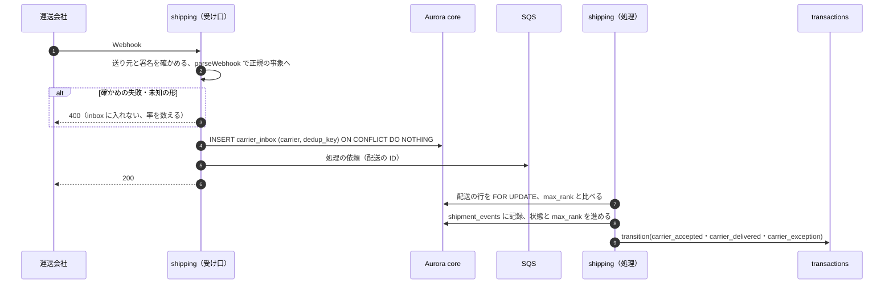
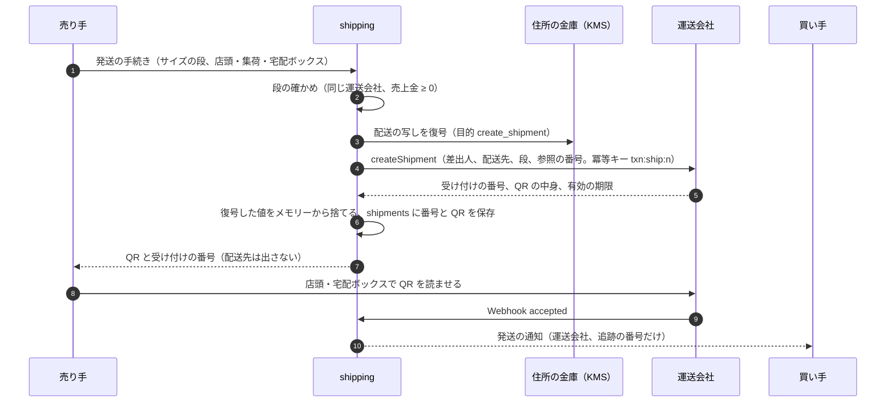

# Shipping Integrations: Mercari

配送を決める。配送の方法とサイズの段と料金の表、運送会社のアダプター、匿名の配送の受け付けと QR、配送の状態と事象の順位、Webhook の inbox と照会、取引への事象の渡し方、発送の時のサイズの変更、住所の金庫と運送会社への渡し方（法務の確認待ち L5）、匿名でない配送、配送の事故を扱う。

前提となる決定は次のとおり。

- 配送は運送会社の API を包むアダプターで扱い、匿名の配送の受け付け・QR・追跡・状態の Webhook を自前で指揮する。住所は `shipping` の金庫に封筒の暗号化で置き、相手に出さない。運送会社の事象は順位で前にだけ進める（[ADR-0006](../decisions/0006-shipping-orchestration-via-carriers.md)）
- 取引の遷移は遷移の関数と DT-TXN-001 だけが書く（[transactions-and-state-machine.md](transactions-and-state-machine.md)）
- 送料は売り手の売上金から差し引く。表のバージョンを取引に記録する（[ADR-0003](../decisions/0003-escrow-and-double-entry-ledger.md)、[ledger-and-proceeds.md](ledger-and-proceeds.md) の 5.1 節）
- 本人だけの表は FORCE RLS、取引の表は 2 者の RLS、運用者は JIT の権限（[ADR-0007](../decisions/0007-single-tenant-and-party-visibility.md)）

この文書で決めたことは次の ADR にある。

| ADR | 決定 |
| --- | --- |
| [0042](../decisions/0042-carrier-event-ranking-and-implied-acceptance.md) | 運送会社の事象を 5 段の順位と 5 つの例外に写し、配送の行の `max_rank` より高い事象だけで進める。順位 1 以上の事象は引き受けを含むとみなし、取引には `carrier_accepted` を先に渡す。照会は受け付けと引き受けの後 6 時間ごと、自動の完了の 24 時間前にも 1 回。取り消しの後の引き受けは例外として運用へ |
| [0043](../decisions/0043-shipping-rate-tables-and-size-tiers.md) | 配送の方法を「運送会社 × サイズの段」のコードで持ち、料金はバージョンの付いた表で取引の作成の時に固定する。発送の時は同じ運送会社の段の中で変えられ、差し引くのは実際の段の料金。売上金が負になる段は選べない。MVP の料金は運送会社との契約の値をそのまま使う |
| [0044](../decisions/0044-address-vault-snapshots-and-access.md) | 購入の時に配送先と差出人を配送ごとの写し（`shipment_addresses`）にし、以後の住所録の変更から切り離す。復号は `openAddress(purpose, subject)` の 1 つの関数だけが、5 つの目的のコードで行い、すべて監査に残す。写しは取引の終わりから 180 日で消し、保全の印があれば残す（期間は法務の確認待ち L5） |

## 1. 範囲

- 扱う：
  - 配送の方法、サイズの段、料金の表とバージョン
  - 運送会社のアダプターの契約（受け付け、取り消し、照会、Webhook）
  - 匿名の配送の受け付け、QR・番号、再発行
  - 配送の状態、事象の順位、例外、取引への事象
  - Webhook の inbox、照会のジョブ
  - 発送の時のサイズの変更
  - 住所録、配送ごとの写し、復号の権限、消し方（法務の確認待ち L5）
  - 匿名でない配送（追跡の番号の入力、着払い）
  - 配送の事故（紛失、破損、差出人への戻り）と運送会社への請求
  - 返送（紛争の判断の後）
  - 運送会社の選定の条件
- 扱わない：
  - 取引の状態と期限（[transactions-and-state-machine.md](transactions-and-state-machine.md)）
  - 送料の仕訳と運送会社の請求の照合（[ledger-and-proceeds.md](ledger-and-proceeds.md) の 9 節の E4）
  - 紛争の判断と補償（[disputes-and-customer-support.md](disputes-and-customer-support.md)）
  - 住所の書き込みの検出（メッセージ。messaging-and-comments の領域）
  - 鍵の管理の全体（security の領域）

## 2. 要件

| 要件 | 目標 | NFR |
| --- | --- | --- |
| 配送の状態の速さ | 運送会社の事象から取引の状態の反映まで p95 60 秒 | NFR-013 |
| 後ろに戻らない | どんな順序・重複でも、配送の順位と取引の状態は下がらない | NFR-013 |
| 偽の発送なし | 匿名の配送で、運送会社の事象（順位 1 以上）のない取引は `shipped` にならない | ADR-0006 |
| 住所の秘匿 | 匿名の配送で、相手に住所・氏名・電話番号が出た事象 0 | NFR-014、K7 |
| 収束 | Webhook がすべて欠けても、照会で 24 時間以内に最後の状態に収束する | [quality.md](../quality.md) の 2.2.1 節 D |
| 可用性 | 発送の手続き（受け付けと QR） 月間 99.95%（購入と取引に含める）。1 社の障害でその社の方法だけを隠す | NFR-007 |

## 3. 本家の形（確かめたこと）

[公式のコラム（送料と発送方法の一覧）](https://jp-news.mercari.com/contents/954)（2026-02-17、料金は 2026 年 1 月時点。2026-10-10 に確認。コラムは掲載当時の内容と断っている）による。

| 本家の配送の商品 | 運送会社 | 方法 | 大きさ・重さ | 料金（税込） |
| --- | --- | --- | --- | --- |
| らくらく〜便 | ヤマト運輸 | ネコポス | 3 辺の合計 60cm 以内（長辺 34cm 以内）、厚さ 3cm 以内、1kg 以内 | 210 円 |
| 同 | 同 | 宅急便コンパクト | 専用の箱（薄型 24.8 × 34cm、箱型 20 × 25 × 5cm） | 450 円 ＋ 箱 70 円 |
| 同 | 同 | 宅急便 | 60〜200 サイズ、2〜30kg | 750〜2,500 円（サイズごと） |
| ゆうゆう〜便 | 日本郵便 | ゆうパケットポスト mini | 専用の封筒（21.1 × 16.8cm）、2kg 以内 | 160 円 ＋ 封筒 20 円 |
| 同 | 同 | ゆうパケットポスト | 専用の箱（32.7 × 22.8 × 3cm）か、3 辺の合計 60cm 以内（長辺 34cm 以内）、2kg 以内 | 215 円 |
| 同 | 同 | ゆうパケット | 34 × 23 × 厚さ 3cm 以内、1kg 以内 | 230 円 |
| 同 | 同 | ゆうパケットプラス | 専用の箱（24 × 17 × 7cm）、2kg 以内 | 455 円 ＋ 箱 65 円 |
| 同 | 同 | ゆうパック | 60〜170 サイズ、25kg 以内 | 750〜1,900 円（サイズごと） |

- 専用の配送の商品は匿名の配送に対応する。それ以外の方法では匿名の配送を使えない。専用の商品から他の方法に変えると匿名でなくなり、2024 年 9 月から、その変更には売り手の本人確認が要る（同コラム）。
- 宅急便とゆうパックのサイズの段ごとの料金、運送会社との接続の方式（API の形、QR の作り方）、QR の有効の期間は確かめられなかった（**未検証**）。

## 4. 配送の方法とサイズの段（[ADR-0043](../decisions/0043-shipping-rate-tables-and-size-tiers.md)）

### 4.1 方法のコード

配送の方法は「運送会社 × サイズの段」のコードで持つ。運送会社の名前は相手先の名前として使い、本システムの配送の商品の名前は `<Brand>便` にする（リポジトリ共通の [ADR-0006](../../../../docs/decisions/0006-brand-neutral-identifiers.md)）。

| コード | 商品の名前 | 匿名 | 段の種類 | 大きさ・重さの上限 | 追跡 |
| --- | --- | --- | --- | --- | --- |
| `ymt.post_flat` | `<Brand>便`（運送会社 A） | ○ | 小さな平たい物 | 3 節のネコポス | ○ |
| `ymt.compact` | 同 | ○ | 専用の箱 | 3 節の宅急便コンパクト | ○ |
| `ymt.box_60` … `ymt.box_200` | 同 | ○ | 箱（サイズ 60・80・100・120・140・160・180・200） | 3 辺の合計、重さはサイズごと | ○ |
| `jp.post_mini` | `<Brand>便`（運送会社 B） | ○ | 専用の封筒 | 3 節のゆうパケットポスト mini | ○ |
| `jp.post_box` | 同 | ○ | 専用の箱かシール | 3 節のゆうパケットポスト | ○ |
| `jp.packet` | 同 | ○ | 小さな平たい物 | 3 節のゆうパケット | ○ |
| `jp.packet_plus` | 同 | ○ | 専用の箱 | 3 節のゆうパケットプラス | ○ |
| `jp.parcel_60` … `jp.parcel_170` | 同 | ○ | 箱（サイズ 60〜170） | 3 辺の合計、25kg 以内 | ○ |
| `other.tracked` | 匿名でない（追跡あり） | × | 売り手が運送会社と直接 | — | 番号の入力 |
| `other.cod` | 匿名でない（着払い） | × | 売り手が運送会社と直接、買い手が受け取りで払う | — | 番号の入力 |

- 運送会社 A・B は、MVP の想定ではヤマト運輸と日本郵便（intent の Affected users。契約と API の能力は未確認）。コードの接頭辞は運送会社の短い名前で、契約の後に確定する。

### 4.2 料金の表

- `shipping_rate_tables (version, effective_from)` と `shipping_rates (version, method_code, price_yen, materials_yen, size_limits)`。取引は作成の時の表のバージョンを記録する。
- MVP の `price_yen` は、運送会社との契約の 1 個あたりの値をそのまま使う（差し引く額 = 運送会社に払う額）。運送会社の数量の割引の戻しは、財務が台帳の外の取引として扱う。料金の値は契約で決まる（3 節の本家の値は参考で、本システムの値ではない）。
- 専用の箱・封筒の代金（`materials_yen`）は、売り手が店頭で運送会社に直接払う形を既定にし、台帳に載せない（運送会社の契約で変わりうる）。
- 表の変更は PM・財務の承認で、新しいバージョンとして出す（[runbooks/](../runbooks/README.md) の 2 節）。

### 4.3 出品と発送の時

- 出品の時、売り手は方法のコードを選ぶ（listings-and-photos の領域）。`price − sales_fee − price_yen ≥ 0` を満たすコードだけを出す（[ADR-0034](../decisions/0034-chart-of-accounts-journal-types-and-fee-rounding.md)）。
- 発送の手続きの時、売り手は **同じ運送会社の段の中で** サイズを変えられる。差し引くのは、取引の作成の時の表のバージョンでの、実際の段の料金。売上金が負になる段は選べない。
- 運送会社を変える（A → B）・匿名でない方法に変えるには、買い手の同意（取引のメッセージ）と売り手の本人確認を要する（本家に寄せる）。匿名でない方法に変えたら、相手の住所を出す前に双方の同意を取る（9 節）。

| 例：価格 2,000 円、手数料 200 円 | 出品の時 `ymt.box_60`（料金 750 円とする） | 発送の時 `ymt.box_80`（料金 950 円とする） |
| --- | --- | --- |
| 売上金 | 2,000 − 200 − 750 = 1,050 | 2,000 − 200 − 950 = 850 |
| 発送の時に `ymt.box_200`（料金 2,500 円とする） | — | 2,000 − 200 − 2,500 = −700 → 選べない |

- 料金の値（750・950・2,500）は例である。

## 5. 配送の状態と事象（[ADR-0042](../decisions/0042-carrier-event-ranking-and-implied-acceptance.md)）

### 5.1 状態と順位

| 正規の事象 | 順位 | 配送の状態 | 取引への事象 |
| --- | --- | --- | --- |
| `label_created`（受け付け、QR の発行） | 0 | `label_issued` | — |
| `accepted`（運送会社の引き受け） | 1 | `accepted` | `carrier_accepted` |
| `in_transit` | 2 | `in_transit` | — |
| `out_for_delivery` | 3 | `out_for_delivery` | — |
| `delivered` | 4 | `delivered` | `carrier_delivered` |

| 例外の事象 | 配送の状態 | 取引への事象 |
| --- | --- | --- |
| `held_at_office`（持ち戻り、営業所の留め置き） | そのまま（印を付ける） | —（買い手に受け取りを促す） |
| `returned_to_sender` | `exception` | `carrier_exception` |
| `lost` | `exception` | `carrier_exception` |
| `damaged` | `exception` | `carrier_exception` |
| `refused`（受け取りの拒否） | `exception` | `carrier_exception` |

- 配送の行の `max_rank` より高い順位の事象だけで状態を進める。同じ・低い順位は `shipment_events` に記録だけして捨てる。
- **順位 1 以上の事象は引き受けを含む**：`max_rank` が 0 のときに順位 2〜4 の事象が来たら、`accepted` を補って（`implied = true`）から進め、取引には `carrier_accepted` を先に、続けて必要なら `carrier_delivered` を渡す。[ADR-0006](../decisions/0006-shipping-orchestration-via-carriers.md) の「`accepted` のない匿名の配送は `shipped` にならない」は、「順位 1 以上の運送会社の事象のない配送は `shipped` にならない」と読む。売り手の操作だけでは補わない。
- 例外の事象は順位の外で、`max_rank` に関わらず記録し、運用の待ち行列に入れる。`delivered` の後の `lost` は記録だけにし、取引には渡さない（運用が確かめる）。

### 5.2 Webhook の inbox

- 重複の鍵 `dedup_key`：運送会社の事象の ID があればそれ、なければ `(追跡の番号, 正規の事象, 運送会社の時刻)`。
- 処理は配送の ID ごとに 1 つずつ（配送の行のロック）。取引への遷移は、配送の行の更新のコミットの後に、冪等キー `<carrier_inbox_id>` で呼ぶ。遷移の失敗（`version_conflict` など）は再試行する。
- 速さ：Webhook → inbox → SQS → 処理 → 遷移で p95 10 秒ほど（本システムの見込み）。NFR-013 の 60 秒に余裕を持たせる。

### 5.3 例：順序の入れ替えと重複

前提：匿名の配送、取引は `paid`。運送会社の通知が遅れて届く。

| 受け取り | 事象（運送会社の時刻） | `max_rank` の前 | 処理 | 取引 |
| --- | --- | --- | --- | --- |
| 10/12 18:05 | `label_created`（10/12 17:00） | — | 0 にする | `paid` |
| 10/13 09:10 | `in_transit`（10/13 08:00） | 0 | `accepted` を補い（時刻は 10/13 08:00）、2 にする | `carrier_accepted` → `shipped`（`auto_receive_at` 10/22 13:00） |
| 10/13 09:11 | `accepted`（10/12 17:40） | 2 | 低いので記録だけ | 変わらない。`auto_receive_at` を早めない |
| 10/14 11:30 | `delivered`（10/14 11:20） | 2 | 4 にする | `carrier_delivered` → `delivered` |
| 10/14 11:31 | `delivered`（同じ） | 4 | 重複の鍵で inbox に入らない | — |
| 10/14 15:00 | `out_for_delivery`（10/14 09:00） | 4 | 低いので記録だけ | — |

- 補った `accepted` の時刻は、補いのもとの事象の時刻（10/13 08:00）にする。後から本物の `accepted`（10/12 17:40）が届いても、期限を前に動かさない（[ADR-0025](../decisions/0025-transaction-decision-table-and-deadline-pause.md)）。画面の発送の日は本物の時刻で直してよい。

### 5.4 照会のジョブ

| 配送の状態 | 照会の予定 |
| --- | --- |
| `label_issued` | 受け付けの後 6 時間ごと（QR の有効の期間まで） |
| `accepted`〜`out_for_delivery` | 引き受けの後 6 時間ごと |
| 取引の `auto_receive_at` の 24 時間前 | 1 回（配達済みを取りこぼしていないか、例外がないか） |
| `delivered`・`exception`・取り消し | 止める |
| 引き受けから 30 日 | 止め、運用の待ち行列へ |

- 照会の結果は Webhook と同じ処理（5.2 節の手順 5 から）に入れる。
- 照会の量：S1 で進行中の配送はおよそ 50 万件（1 日 9 万件 × 5〜6 日）。6 時間ごとで 1 日 200 万回、1 秒 23 回ほど。S3 で 1 秒 350 回ほど。運送会社の上限と費用は capacity の領域で見積もる。Webhook のある運送会社は、照会を 12 時間ごとに伸ばしてよい（運送会社ごとの設定）。

## 6. 匿名の配送の受け付けと QR

### 6.1 流れ

- 受け付けの冪等キーは `<transaction_id>:ship:<attempt>`（[ADR-0006](../decisions/0006-shipping-orchestration-via-carriers.md)）。サイズの変更・QR の期限切れで受け付けをやり直すときは、前の受け付けを `cancelShipment` で取り消してから `attempt` を 1 つ上げる。前の取り消しが失敗したら、やり直さず運用へ。
- QR と受け付けの番号は、売り手だけが読める列（`shipments` の売り手の側の列。2 者の RLS に加えて主体の確かめ）に置く。買い手には運送会社と追跡の番号だけを出す。
- QR の有効の期間は運送会社の値（**未検証**）。期限の 24 時間前と期限の後に売り手に通知し、期限の後は手続きのやり直しを促す。
- 取引が `cancel_requested` の間も QR は使える。取引が `cancelled` になったら、`label_issued` の受け付けを `cancelShipment` で取り消す。

### 6.2 取り消しの後の引き受け

- 取り消し（`cancelled`）の後に `accepted` 以上の事象が来たら（取り消しと持ち込みの競合）、取引には渡さず（DT-TXN-001 の行 1 で何もしない）、配送を `exception`（`shipped_after_cancel`）にして運用の待ち行列に入れる。運用は運送会社に戻しを頼むか、買い手に受け取ってもらい、返送か返金の取り直しを決める（[disputes-and-customer-support.md](disputes-and-customer-support.md) の 6 節）。

## 7. 住所の金庫（[ADR-0044](../decisions/0044-address-vault-snapshots-and-access.md)）

鍵の配置と封筒の暗号化の形は security の領域で決めた（[security.md](security.md) の 5.3 節、[ADR-0069](../decisions/0069-key-layout-and-vault-envelope-encryption.md)）。ここでは、配送が住所をどこに写し、誰が何の目的で復号し、いつ消すかを決める。

### 7.1 置き場所

| 置き場所 | 中身 | 鍵 | RLS | 持つ期間 |
| --- | --- | --- | --- | --- |
| `address_vault`（core。[ADR-0006](../decisions/0006-shipping-orchestration-via-carriers.md) の金庫） | 利用者の住所録（郵便番号、都道府県、市区町村、番地、建物、氏名、電話番号）。1 人 20 件まで | 利用者ごと・金庫ごとの鍵（`vault_keys`、`kms-vault-address` で包む） | 本人 | 利用者が消すか退会まで（[security.md](security.md) の 7.1 節） |
| `shipment_addresses`（core） | 配送ごとの差出人と配送先の写し | 同じ利用者の鍵（差出人は売り手の鍵、配送先は買い手の鍵） | なし（`shipping` の役割だけが読む表） | 取引の終わりから 180 日で行を消す（同上。法務の確認待ち L5） |

- 購入の時、買い手が選んだ配送先と、売り手の差出人の住所を `shipment_addresses` に写す。取引の後に住所録を直しても、配送の宛先と返送の宛先は変わらない。写しは `shipping` の役割が `transaction.created` を受けて作る（購入の応答の速さに入れない）。
- 平文は `shipping` のプロセスのメモリーの中だけで、要求ごとに捨てる。利用者の鍵の平文のキャッシュは 5 分・1 万件（ADR-0069）。ログ・トレース・エラー・データレイクに出さない（AGENTS.md）。
- 紛争・法令の照会の保全（`legal_hold`）がある取引の写しは、180 日を過ぎても消さない。保全を解いた日から数え直す。

### 7.2 復号の目的

復号は `packages/shipping` の 1 つの関数 `openAddress(purpose, subject)` だけが行う。目的のコードのない復号はない。

| 目的のコード | 誰が | いつ | 渡す先 |
| --- | --- | --- | --- |
| `create_shipment` | `shipping` の役割 | 受け付け | 運送会社の API だけ |
| `return_shipment` | `shipping` の役割 | 返送の受け付け | 運送会社の API だけ |
| `owner_view` | 本人（app-api → shipping） | 住所録の画面 | 本人の端末だけ |
| `reveal_to_counterparty` | `shipping` の役割 | 匿名でない配送で、双方が同意し、売り手の本人確認が済んだ後 | 売り手の取引の画面（9 節） |
| `ops_reveal` | 運用者（`vault.reveal_address`、2 人目の承認、1 回 1 件、1 日 20 件まで） | 配送の事故、法令の照会 | 運用の画面（`shipping.revealAddress`。[security.md](security.md) の 6.2 節、[ADR-0070](../decisions/0070-operator-access-vault-reveal-and-audit.md)） |

- KMS の `Decrypt` の権限は `shipping` のタスクの役割だけ（ADR-0069）。`ops-api` は権限の証を付けて `shipping` を呼ぶ。
- 復号のたびに、目的・主体・配送・取引・案件の ID を監査の事象（`audit_events`）に書く。値は書かない。
- 通常の CS の権限（`case.view`）では住所を見られない（[ADR-0007](../decisions/0007-single-tenant-and-party-visibility.md)）。

### 7.3 漏れの経路

| 経路 | 出さないもの | 確かめ |
| --- | --- | --- |
| 取引の画面・API（相手） | 住所、氏名、電話番号、都道府県 | 応答の型に住所の項目がない（契約の試験） |
| 発送の手続きの画面（売り手） | 配送先 | 同上 |
| 通知（プッシュ、メール） | 住所、相手の本名 | 通知の型の検査 |
| 運送会社の Webhook の記録 | 運送会社が送る住所の欄 | `parseWebhook` が正規の事象に住所を写さない。生の本文は住所の欄を落としてから S3 に置く |
| ログ・トレース | すべて | ログの検査（[quality.md](../quality.md) の 2.2.1 節 G） |

- 運送会社への渡し方（委託か第三者提供か）と、写しの保存の期間は **法務の確認待ち（L5）**。E11 の `carrier-adapters` の spec は、確認まで承認しない。

## 8. 配送の事故と返送

| 事象 | 扱い |
| --- | --- |
| `lost`・`damaged` | 取引は `disputed`（DT-TXN-001 の行 29）。運用が運送会社に事故の申し出をし、運送会社の補償の結果と、本システムの補償（[disputes-and-customer-support.md](disputes-and-customer-support.md) の 7 節）を決める |
| `returned_to_sender`・`refused` | 同じく `disputed`。品が売り手に戻ったかを運送会社の照会で確かめてから、運用が返金（`cancel_refund`）を決める |
| `held_at_office` | 買い手に受け取りを促す通知。保管の期限（運送会社の値）を過ぎて戻れば `returned_to_sender` |
| 引き受けから 30 日で配達済みがない | 運用の待ち行列（紛失の疑い） |

- **返送**：紛争の判断で返品が決まったら、`shipping` は差出人と配送先を入れ替えた写し（方向 `return`）で、同じ運送会社の匿名の配送を受け付ける。送料の負担は運用の判断（既定は売り手）。返送の配送は元の取引に結び付き、取引は `disputed` のまま。返送の `delivered` の後に、運用が `cancel_refund` を決める。
- 運送会社への事故の請求の額は、`shipping_claims` の表に持ち、運送会社からの入金は台帳の `compensation_expense` を戻す形で記録する（[ledger-and-proceeds.md](ledger-and-proceeds.md) の 4.3 節の型 16 の逆。財務と決める）。

## 9. 匿名でない配送

- `other.tracked`：売り手が運送会社と直接に送り、追跡の番号を入れる（DT-TXN-001 の行 16）。`shipping` は番号の形を運送会社ごとの規則で確かめ、照会の API があれば `accepted` 以上を確かめる。確かめられなければ `shipped` にして信用の印（`unverified_tracking`）を付け、T&S の規則の入力にする（[ADR-0006](../decisions/0006-shipping-orchestration-via-carriers.md)）。
- `other.cod`：着払い。送料は台帳に載らない（[ledger-and-proceeds.md](ledger-and-proceeds.md) の 5.1 節）。
- 匿名でない配送では、売り手に買い手の住所と氏名が要る。双方が取引の画面で同意し、売り手の本人確認が済んでから、`reveal_to_counterparty` で売り手の取引の画面に出す。出した記録を残す。メッセージに住所を書かせない（悪用の絞り込みが止める。messaging-and-comments の領域）。

## 10. 運送会社の選定の条件

| 条件 | 理由 |
| --- | --- |
| 匿名の配送の受け付けの API（差出人・配送先を本システムから渡し、QR・番号を返す） | 6 節 |
| 引き受けの前の取り消し | 6.1 節 |
| 追跡の照会の API（受け付けの番号で） | 5.4 節 |
| 状態の Webhook（署名か送り元の確かめ、事象の ID） | 5.2 節 |
| 事故（紛失、破損）の申し出の手順 | 8 節 |
| 請求の明細（受け付けの番号ごと） | 照合の E4 |
| 住所の扱いの契約（目的の外で使わない、保存の期間） | 法務の確認待ち L5 |

- 契約の前は、能力を確かめられない（[ADR-0006](../decisions/0006-shipping-orchestration-via-carriers.md)）。E11 の `carrier-selection` で確かめる。

## 11. 障害のときの振る舞い

| 障害 | 影響 | 振る舞い |
| --- | --- | --- |
| 運送会社の受け付けの API の停止 | 発送の手続きができない | `ops.carrier_enabled.<carrier>` で、その運送会社の方法を出品・発送の画面から隠す。発送の期限が近い取引は、運用が `ops_hold` で期限を止める判断をする（`carrier-outage.md`） |
| Webhook の欠け | 状態が遅れる | 照会のジョブで収束 |
| 照会の API の停止 | 収束が遅れる | 再開で照会し直す。自動の完了は期限で進む（配達済みは受取評価の代わりにしない） |
| 未知の状態の事象 | 写せない | inbox に入れず、率でアラート。写しの表を直してから照会で取り直す |
| KMS の停止 | 受け付けができない | 発送の手続きを 503。期限の延長は運用の判断 |
| 取り消しと持ち込みの競合 | 取り消しの後の引き受け | 6.2 節 |

## 12. 上限

| 対象 | 値 |
| --- | --- |
| 住所録 | 1 人 20 件 |
| 受け付けのやり直し | 1 取引 5 回 |
| 照会の間隔 | 6 時間（Webhook のある運送会社は 12 時間まで伸ばせる） |
| 照会を止める | 引き受けから 30 日 |
| 配送ごとの写しを消す | 取引の終わりから 180 日（法務の確認待ち L5） |
| Webhook の本文 | 64 KB |
| 1 配送の事象の記録 | 200 件 |

## 13. data-model への項目

| 表・置き場 | 中身 | 主キー・索引 | 節 |
| --- | --- | --- | --- |
| `shipping_rate_tables`・`shipping_rates`（core、設定） | バージョン、方法のコード、料金、資材の代金、大きさ・重さの上限、匿名の可否 | `(version, method_code)` | 4.2 |
| `shipments`（core、2 者の RLS） | 取引、方向（`forward`・`return`）、方法のコード、試行の番号、状態、`max_rank`、運送会社、受け付けの番号、追跡の番号、QR の中身と期限（売り手だけ）、`implied_accept`、引き受けの時刻、次の照会の時刻、例外の種類 | `id`、一意 `(transaction_id, direction, attempt)`、`(carrier, tracking_no)`、`(next_poll_at)` | 5、6 |
| `shipment_events`（core、追記だけ） | 正規の事象、順位、運送会社の時刻、受け取った時刻、採否（進めた・低い・重複・例外）、出所（Webhook・照会） | `(shipment_id, seq)` | 5 |
| `carrier_inbox`（core） | 運送会社、重複の鍵、受け取った時刻、処理の状態、住所の欄を落とした本文の S3 の参照 | 一意 `(carrier, dedup_key)` | 5.2 |
| `address_vault`（core、本人の RLS。鍵の列は [security.md](security.md) の 5.3 節） | 封筒の暗号化の列（住所、氏名、電話番号）、`key_version`、既定の印 | `(owner_id, id)` | 7.1 |
| `shipment_addresses`（core、`shipping` の役割だけ。security の領域と共有） | 配送ごとの差出人・配送先の暗号文、`legal_hold`、`expires_at` | `(transaction_id)`、`expires_at` | 7.1 |
| `shipping_claims`（core） | 配送、事故の種類、請求の額、運送会社の結果 | `id` | 8 |
| S3 | `shipping/inbox/<carrier>/<yyyy>/<mm>/<dd>/<id>.json`（住所の欄を落とした本文） | — | 5.2 |
| outbox の事象 | `shipment.label_issued`、`shipment.accepted`、`shipment.delivered`、`shipment.exception` | — | 5 |
| KMS | `kms-vault-address`（Decrypt は `shipping` の役割だけ。ADR-0069） | — | 7 |

## 14. テスト

- **PROP-SHP-001（前にだけ進む）**：`carrier-sim` の任意の事象の列（重複 0〜5 回、遅れ 0〜48 時間、順序の入れ替え、欠け、署名の誤り、未知の状態）で、配送の `max_rank` と取引の状態の順位は単調に増える（[quality.md](../quality.md) の 2.2.1 節 D）。
- **PROP-SHP-002（偽の発送なし）**：匿名の配送で、順位 1 以上の運送会社の事象がない取引は `shipped` にならない。売り手の操作だけで `shipped` にならない。
- **PROP-SHP-003（収束）**：Webhook がすべて欠けても、照会で仮想の時計の 24 時間以内に最後の状態に収束する。
- **PROP-SHP-004（受取評価の代わりにしない）**：配達済みの事象だけで `received` にならない。
- **PROP-SHP-005（期限を早めない）**：遅れた `accepted` で `auto_receive_at` が前に動かない。
- **PROP-SHP-006（売上金 ≥ 0）**：任意の価格と段の組み合わせで、選べる段の売上金は 0 以上。
- **表駆動**：5.1 節の写し（運送会社ごとの生の状態 → 正規の事象）、4.1 節の方法、7.2 節の目的と権限。
- **漏れの経路**：7.3 節の全行（同 G）。IAM の検査（`Decrypt` は `shipping` だけ）。
- **競合の場面**：配達済みの Webhook と受取評価が同時、引き受けの Webhook と申し出の同意が同時（6.2 節）、自動の完了の期限と `lost` が同時。

## 15. Story の候補

| Epic | Story | 中身 |
| --- | --- | --- |
| E11 | `carrier-selection` | 10 節 |
| E11 | `shipping-methods-and-rates` | 4 節（ADR-0043。PROP-SHP-006） |
| E11 | `address-vault` | 7 節（ADR-0044） |
| E11 | `carrier-adapters` | 6 節。運送会社への渡し方は法務：L5 |
| E11 | `tracking-webhooks-and-polling` | 5 節（ADR-0042。PROP-SHP-001〜005） |
| E11 | `non-anonymous-shipping` | 9 節 |
| E11 | `carrier-sim` | 14 節の場面 |
| E11 | `shipping-incidents` | 8 節 |

## 16. 未解決の問い

### 決定

2026-10-10 の既定案。

- **事象の順位と補い**：5 段、5 つの例外、順位 1 以上は引き受けを含む（ADR-0042）。
- **照会**：6 時間ごと、自動の完了の 24 時間前に 1 回、30 日で止める（ADR-0042）。
- **料金の表**：方法のコード、バージョン、発送の時は同じ運送会社の段の中で変える、売上金が負の段は選べない、MVP は契約の値をそのまま（ADR-0043）。
- **住所**：住所録と配送ごとの写し、目的のコードつきの 1 つの関数での復号、180 日で写しを消す（ADR-0044。鍵は ADR-0069）。
- **返送**：入れ替えた写しで同じ運送会社の匿名の配送。

### 持ち越し

| 問い | いつ・どう決めるか |
| --- | --- |
| 運送会社の API の能力、QR の有効の期間、照会の上限、請求の明細 | E11 の `carrier-selection` |
| 運送会社への住所の渡し方、写しの保存の期間 | 法務の確認待ち（L5） |
| 送料の取引の整理と消費税 | 法務の確認待ち（L8） |
| 宅急便・ゆうパックのサイズごとの料金 | 運送会社との契約（本家の値は**未検証**） |
| 運送会社の数量の割引の戻しを台帳に載せるか | 財務 |
| 照会の量と費用（S3 で 1 秒 350 回） | capacity の領域 |
