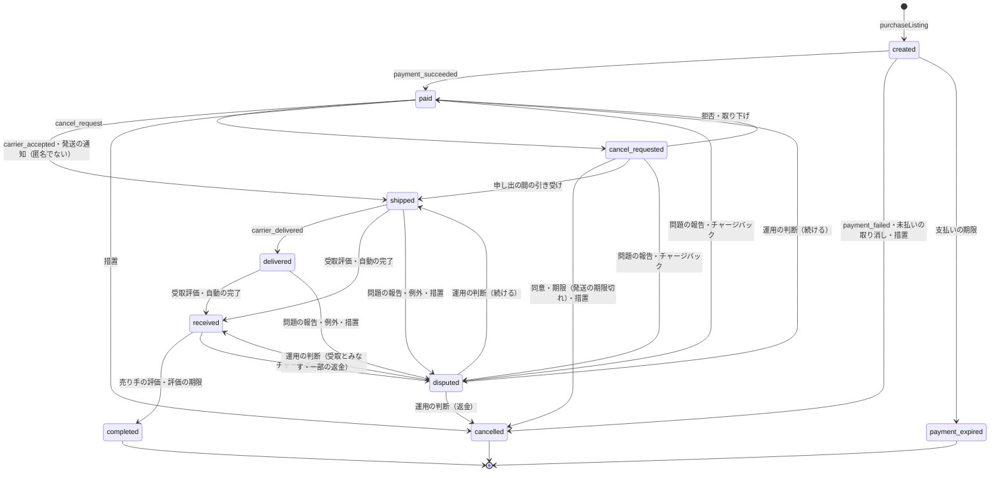
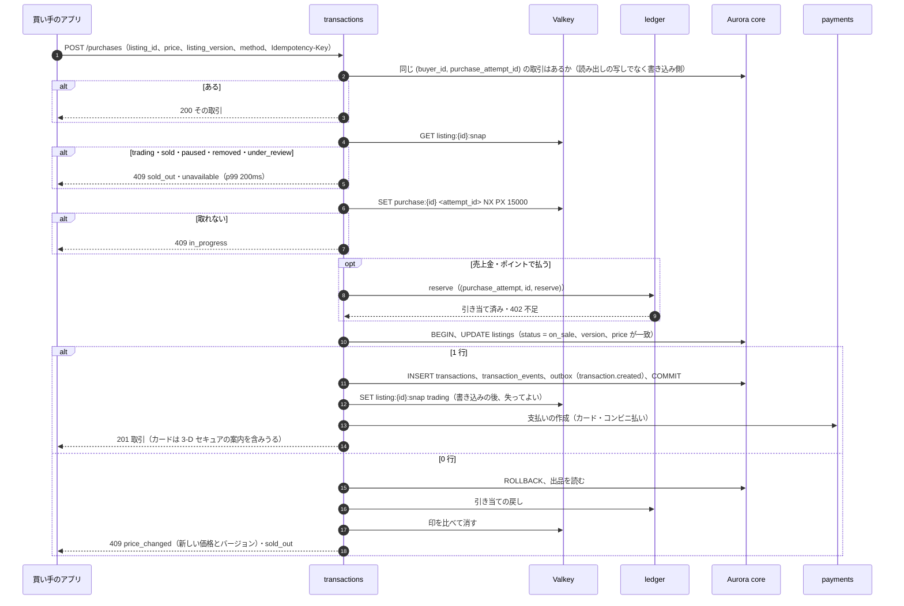

# Transactions and State Machine: Mercari

取引を決める。`purchaseListing`、人気の出品の受け入れ、取引の状態と遷移の決定表 DT-TXN-001、期限と期限の処理、紛争と運用の保留での停止、キャンセル、受取評価と評価の受け渡し、価格の変更と値下げ交渉、出品と取引の照合を扱う。

前提となる決定は次のとおり。

- 購入は `purchaseListing` の 1 つの関数と、core の 1 つのトランザクション（出品の条件つきの更新と、取引の部分一意の索引）で決める。Valkey の先着の印は流量を絞るだけ。期限は取引の行の列と 1 分ごとの処理で動かし、紛争で止める（[ADR-0002](../decisions/0002-transaction-state-machine-and-single-purchase.md)）
- お金は状態の遷移の outbox から `ledger` が動かす。`completed` は release、`cancelled`（支払いの後）は refund の 1 回だけ（[ADR-0003](../decisions/0003-escrow-and-double-entry-ledger.md)。仕訳は [ledger-and-proceeds.md](ledger-and-proceeds.md)）
- カードは購入の時に売上を確定する（[ADR-0005](../decisions/0005-payments-via-providers-and-capture-at-purchase.md)。支払いの流れは [payments-and-escrow.md](payments-and-escrow.md)）
- 運送会社の事象は `shipping` が順位で前にだけ進め、取引には `carrier_accepted`・`carrier_delivered`・`carrier_exception` だけを渡す（[ADR-0006](../decisions/0006-shipping-orchestration-via-carriers.md)。[shipping-integrations.md](shipping-integrations.md)）
- 取引の表は買い手と売り手の 2 者の RLS（[ADR-0007](../decisions/0007-single-tenant-and-party-visibility.md)）

この文書で決めたことは次の ADR にある。

| ADR | 決定 |
| --- | --- |
| [0025](../decisions/0025-transaction-decision-table-and-deadline-pause.md) | DT-TXN-001 を 38 行で確定する。期限は 5 つの列と `next_deadline_at` で持ち、紛争・運用の保留の間は止め、再開で止めた時間だけ全部の期限をずらす。期限を前に動かす変更はしない |
| [0026](../decisions/0026-hot-listing-purchase-admission.md) | 人気の出品の購入は、Valkey の出品の写しの確かめ → 先着の印 → DB の順に絞る。印は取引の取り消しで比べて消す。Valkey がないときは出品ごと・タスクごとの同時実行 4 と `lock_timeout` 200ms で DB を守る。勝った試行だけが残高を引き当てる |
| [0027](../decisions/0027-cancellation-rules-and-listing-restoration.md) | キャンセルは発送の前だけ、申し出と同意で行う。発送の期限切れの申し出は売り手が拒めず、2 日で自動で取り消す。発送の後の取り消しは紛争の運用の判断だけ。取り消しの後の出品は、発送の前なら販売中、発送の後なら停止に戻す |

## 1. 範囲

- 扱う：
  - `purchaseListing`（通常、売上金・ポイント、値下げの後の購入）と、購入の冪等
  - 人気の出品の受け入れ（先着の印、写し、同時実行の上限）
  - 取引の状態、遷移の関数、決定表 DT-TXN-001
  - 期限の列、`deadline-runner`、紛争・運用の保留での停止と再開
  - キャンセル（未払いの取り消し、申し出と同意、発送の期限切れ）
  - 受取評価と売り手の評価からの完了（評価の中身と集計は ratings-and-reputation の領域）
  - 価格の変更とコメントでの値下げ交渉（コメントそのものは messaging-and-comments の領域）
  - 出品と取引の照合
  - 購入の確認の画面の枠（法務の確認待ち L3）
  - オファー（MVP の後）の形の見通し
- 扱わない：
  - 支払いの手段と提供者の結果（[payments-and-escrow.md](payments-and-escrow.md)）
  - 仕訳と売上金（[ledger-and-proceeds.md](ledger-and-proceeds.md)）。ここでは outbox の事象の型だけを決める
  - 運送会社の事象の順位、QR、住所（[shipping-integrations.md](shipping-integrations.md)）
  - 紛争の案件、SLA、運用の介入の手順（[disputes-and-customer-support.md](disputes-and-customer-support.md)）。ここでは紛争が取引に与える遷移だけを決める
  - 出品の状態の全体（listings-and-photos の領域）。ここでは取引が書く `trading`・`sold`・`on_sale`・`paused` への変更だけを決める

## 2. 要件

| 要件 | 目標 | NFR |
| --- | --- | --- |
| 二重の販売なし | 1 つの出品の進行中の取引（`cancelled`・`payment_expired` 以外）は 0 か 1。Valkey の停止、DB のフェイルオーバーでも | NFR-003、K1 |
| 表示した価格で売る | 取引の価格 = 要求の `price` = 購入の時の出品の価格 | intent の「守るべき振る舞い」 |
| 購入の速さ | 確定 p99 800ms（提供者の時間を除く）。人気の出品の負けの応答 p99 200ms（Valkey の停止の間は 1 秒） | NFR-002、K4 |
| 取引の操作 | 発送の通知、受取評価、評価、キャンセルの操作 p99 500ms | NFR-002 |
| 期限 | 期限の時刻から遷移まで p99 1 分。紛争・保留の間は働かない。期限より前に働かない | NFR-012、K8 |
| 状態は後ろに戻らない | 運送会社の事象の重複・順序の入れ替えで、取引の状態の順位が下がらない | NFR-013 |
| 可用性 | 購入と取引 月間 99.95% | NFR-007、K9 |
| 完了から売上金 | `completed` から release の仕訳まで p99 1 分（outbox の遅れを含む） | NFR-006 |

## 3. 本家の形（確かめたこと）

- 支払いの期限は購入の手続きから 3 日（購入日を含む 3 日目の 23:59:59）。受取評価も事務局への問い合わせもなければ、発送の通知の 9 日後の 13 時以降に自動で取引が完了する。支払いの期限を過ぎても進まないとき、取引のメッセージに 24 時間返事がないときに、キャンセルを考えるよう案内している（[ヘルプの記事 61sell](https://help.jp.mercari.com/guide/articles/61sell/)、2026-10-10 に確認）。
- 問い合わせが自動の完了を止めることは同じ記事から読める。止めた後の期限の延び方は書いていない（**未検証**）。
- 発送の期限を過ぎたときの規則、キャンセルの後の出品の扱い、売り手が評価しないときの完了の時刻、購入の守り方の内部は、公式の資料で確かめられなかった（**未検証**）。本システムの値を使う。

## 4. 状態と事象

### 4.1 状態



- [ADR-0002](../decisions/0002-transaction-state-machine-and-single-purchase.md) の図に、次を足した（[ADR-0025](../decisions/0025-transaction-decision-table-and-deadline-pause.md)）：`cancel_requested` からの紛争と引き受け、`received` からのチャージバック、措置による取り消し、運送会社の例外。
- `disputed` は入った時の状態を `resume_state` に持ち、「続ける」の判断でそこに戻る。
- 状態の順位（後ろに戻らないことの確かめに使う）：`created` 0 < `paid` 1 < `shipped` 2 < `delivered` 3 < `received` 4 < `completed` 5。`cancel_requested`・`disputed` は順位を持たず、`resume_state` の順位で数える。`disputed` → `paid` などの戻りは `resume_state` への戻りだけを許す。

### 4.2 事象

| 事象 | 主体 | 出す所 | 引数 |
| --- | --- | --- | --- |
| `payment_succeeded`・`payment_failed` | system | `payments`（照会で確かめた結果） | 試行の ID |
| `buyer_cancel_unpaid` | 買い手 | 画面 | — |
| `deadline` | system | `deadline-runner` | 期限の列の名前 |
| `carrier_accepted`・`carrier_delivered`・`carrier_exception` | system | `shipping` | 配送の ID、事象の時刻、例外の種類 |
| `seller_ship_notice` | 売り手 | 画面（匿名でない配送） | 追跡の番号、確かめの結果 |
| `buyer_receipt` | 買い手 | 画面 | 評価（良い・普通・残念）と本文の参照 |
| `seller_rating` | 売り手 | 画面 | 評価 |
| `cancel_request`・`cancel_accept`・`cancel_reject`・`cancel_withdraw` | 買い手・売り手 | 画面 | 理由のコード |
| `problem_report` | 買い手・売り手 | 画面 | 紛争の種類（[disputes-and-customer-support.md](disputes-and-customer-support.md) の 4 節） |
| `chargeback_opened` | system | `payments` | チャージバックの ID |
| `moderation_cancel` | 運用者（T&S） | `trust-safety` | `moderation_actions` の ID |
| `ops_hold`・`ops_release` | 運用者 | `ops-api` | 案件の ID、理由 |
| `ops_resolve` | 運用者 | `ops-api` | 案件の ID、結論（`continue`・`treat_received`・`cancel_refund`・`partial_refund`）、一部の返金の額 |

- 運用者の事象は、案件に結び付けた JIT の権限と理由のコードを持つ（[ADR-0007](../decisions/0007-single-tenant-and-party-visibility.md)、security の領域）。運用の画面にも、遷移の関数を通らない取引の書き換えはない。

## 5. 購入（`purchaseListing`）

### 5.1 手順



```sql
-- inside one core transaction (READ COMMITTED)
SET LOCAL lock_timeout = '200ms';
SET LOCAL statement_timeout = '2s';
UPDATE listings
   SET status = 'trading', version = version + 1, updated_at = now()
 WHERE id = $listing_id AND status = 'on_sale'
   AND version = $seen_version AND price = $seen_price
   AND seller_id <> $buyer_id
RETURNING seller_id, price, shipping_method_code, shipping_payer, ship_days_code, version;
-- 1 row:
INSERT INTO transactions (id, listing_id, buyer_id, seller_id, purchase_attempt_id,
       price, fee_table_version, shipping_rate_table_version, shipping_method_code,
       shipping_payer, payment_method, state, version, payment_due_at, next_deadline_at, ...)
VALUES (uuidv7(), ...,'created', 1, $due, $due, ...);
INSERT INTO transaction_events (...);   -- event 'purchase', actor buyer
INSERT INTO outbox (...);               -- transaction.created
```

```sql
CREATE UNIQUE INDEX transactions_one_active_per_listing
  ON transactions (listing_id) WHERE state NOT IN ('cancelled', 'payment_expired');
CREATE UNIQUE INDEX transactions_purchase_attempt
  ON transactions (buyer_id, purchase_attempt_id);
```

- 上の `UPDATE listings` は、出品の遷移の関数 `transitionListing()` の `on_sale → trading`（DT-LST-001 の行 6）の実装で、同じ core のトランザクションの中で呼ぶ（[ADR-0011](../decisions/0011-listing-state-machine-and-versions.md)）。取引の遷移が出品を変えるとき（6.3 節）も同じ関数を呼ぶ。
- 部分一意の索引は `completed` を含む。売れた出品は二度と売れない。再出品は新しい `listing_id` を作る（listings-and-photos の領域）。
- 負けた試行は DB に行を書かない。同じ `Idempotency-Key` の再送は、同じ判定をもう一度して同じ 409 を返す（結果が同じなので冪等）。勝った試行だけが `transactions.purchase_attempt_id` に残る。
- 売上金・ポイントの引き当ては、印を取った試行だけが行う。負けた数千の試行は ledger に触れない（[ADR-0026](../decisions/0026-hot-listing-purchase-admission.md)）。
- 取引の行は、手数料の表と送料の表のバージョンを記録する（[ADR-0003](../decisions/0003-escrow-and-double-entry-ledger.md)）。
- 自分の出品は買えない（`seller_id <> $buyer_id`）。ブロックの関係は購入の前に `listingVisible()` の写しで確かめ、`hidden` なら 404 にする（[ADR-0007](../decisions/0007-single-tenant-and-party-visibility.md)）。
- `ops.purchase_enabled` が偽（全体・カテゴリ・出品）なら、Valkey の前に 503 `purchase_paused` を返す。

### 5.2 ロックの順

- 出品の行と取引の行の両方に触れる関数（`purchaseListing`、取引の取り消し、完了）は、必ず **出品 → 取引** の順にロックする。遷移の関数は、取引の `listing_id`（変わらない）で先に `SELECT ... FROM listings WHERE id = $1 FOR UPDATE` を取ってから取引の行を取る。出品を書かない遷移（`paid` → `shipped` など）は取引の行だけを取る。
- 出品の編集（価格の変更、停止）は出品の行だけを取る。出品の編集と取引の遷移は、出品の行のロックで直列になる。デッドロックは順序で起きない。

### 5.3 例：1 つの出品に 5,000 件/秒

前提（[quality.md](../quality.md) の 2.2.1 節 H の S1 の模型）：限定品、価格 12,000 円、出品の直後の 1 秒に 5,000 件。うち 30% は同じ利用者の連打、10% は古い価格。カード、提供者の応答 300ms〜3 秒、失敗 5%。`transactions` のタスクは 12。

| 時刻 | 起きること | DB に届く数 |
| --- | --- | --- |
| t=0 | 出品の公開（version 1、`on_sale`）。Valkey の写し `listing:{id}:snap = on_sale v1 12000` | — |
| 0〜0.012 秒 | 最初の 60 件ほどが写しを見て `SET NX` を試す。最初の 1 件（試行 A）が印を取る。残りは 409 `in_progress` | 0 |
| 0.012〜0.030 秒 | A が `UPDATE` 1 行、取引の挿入、コミット（行のロックの保持 3ms ほど）。写しを `trading v2` にする | 1 |
| 0.030〜1 秒 | 残り 4,900 件ほどは写しの `trading` で即座に 409 `sold_out`。連打の 1,500 件は app-api の同じ `Idempotency-Key` の合流で、先の応答を待つだけ | 0 |
| t=0.4 | 提供者の応答。カードの確定に成功 → `payment_succeeded` → `paid` | — |

- Valkey の操作は 1 件あたり 2 回（`GET` と `SET NX`）で、1 秒 1 万回ほど。1 つのシャードで足りる。
- **決済の失敗（5%）の場合**：t=3 秒に `payment_failed` → `cancelled`。同じトランザクションで出品を `on_sale`、version 3 に戻す。コミットの後に、印を比べて消す（値が A のときだけ消す Lua）。写しを `on_sale v3` にする。画面に v1 を持つ買い手の再送は `409 price_changed`（バージョンの違い）になり、アプリは新しいバージョンを読んで出し直す。ここから 2 回目の取り合いになる。印を 15 秒の期限まで残すと、売れない 12 秒が生じるので、取り消しで消す（[ADR-0026](../decisions/0026-hot-listing-purchase-admission.md)）。
- **Valkey の停止の場合**：写しと印を飛ばし、出品ごと・タスクごとのセマフォ（4）を通す。DB に同時に届くのは 12 × 4 = 48 件まで。セマフォを 100ms 待てない試行は 409 `busy`（`Retry-After: 1`）。48 件は出品の行のロックで並び、A のコミットの後に PostgreSQL が `WHERE` を最新の行で評価し直して 0 行になる。1 件の DB の時間は 5〜25ms。出品の行の処理はおよそ 2,000 件/秒で、その外は 409 `busy` になる。負けの応答は p99 1 秒以内、DB の接続は 48 本まで。二重の販売は索引が止める。
- **DB のフェイルオーバーの場合**：コミットの前の試行は失敗し、アプリは同じ `Idempotency-Key` で再送する。コミットの後で応答を失った試行は、再送で手順 1 が取引を見つけて返す。

### 5.4 価格の変更と値下げ交渉

- 売り手は `on_sale` の出品だけ価格を変えられる。変更は `UPDATE listings SET price = $new, version = version + 1 WHERE id = $1 AND status = 'on_sale' AND version = $v` で、outbox に `listing.price_changed`（下げたら `listing.price_dropped` も）を書く。
- 値下げ交渉は商品のコメントで行い、合意の後に売り手が価格を変える。本システムは交渉の合意を記録しない（MVP）。
- 価格の変更と購入が同時に来たら、出品の行のロックで一方が先になる。

| 順 | 結果 |
| --- | --- |
| 購入が先 | 取引は古い価格で作られる。価格の変更は `status = 'on_sale'` に合わず 0 行 → 409 `listing_trading` を売り手に返す |
| 変更が先 | 購入は `version`・`price` に合わず 0 行 → 409 `price_changed`（新しい価格と version）。買い手は確認の画面で新しい価格を見てから買い直す |

- 値下げの後の購入も `purchaseListing` を通す。値下げの通知は、いいねした利用者に 1 出品 24 時間に 1 回まで（notifications の領域）。
- 価格の変更の範囲と上限（1 出品 1 日 10 回）は listings-and-photos の領域の値に従う（[listings-and-photos.md](listings-and-photos.md) の 4.4 節）。

### 5.5 購入の確認の画面（法務の確認待ち L3）

- 確認の画面は、価格、送料の負担、配送の方法、支払いの方法と手数料、支払いの期限、キャンセルの条件、売り手の表示（事業者の印があればその表示の欄）を出す。出す事項と文言は **法務の確認待ち（L3。最終確認の画面の規定が C2C の購入に当たるか）** で、確定は `purchase-confirmation-screen` の spec で行う。
- 本システムは、画面に出した `price`・`listing_version`・手数料の表のバージョンを購入の要求に持たせ、5.1 節で一致を確かめる。画面の内容と取引の内容が違う取引は作らない。

## 6. 遷移の関数と決定表

### 6.1 遷移の関数

```
transition(transaction_id, event, actor, expected_version?) -> {state, version, effects[]}
```

1. 遷移が出品に触れうるなら出品の行を `FOR UPDATE`（5.2 節）。
2. 取引の行を `FOR UPDATE`。
3. DT-TXN-001 を上から評価し、最初に一致した行を使う。
4. 状態・期限の列・`version + 1` を更新し、`transaction_events` に 1 行（事象、主体、理由のコード、前と後の状態、決定表の行の番号）を足し、行の効果（出品の変更、outbox）を同じトランザクションで書く。
5. outbox の事象：`transaction.created`・`paid`・`shipped`・`delivered`・`received`・`completed`・`cancelled`・`payment_expired`・`disputed`・`dispute_resolved`・`cancel_requested`。お金の事象（`paid`・`completed`・`cancelled`・`dispute_resolved` の一部の返金）は `ledger` が消費する。

- 外部の操作の冪等：画面の操作は `Idempotency-Key` を持ち、`transaction_events (transaction_id, idempotency_key)` の一意の制約で 2 回目は前の結果を返す。`payments`・`shipping` の事象はそれぞれの inbox の ID を冪等キーにする。

### 6.2 DT-TXN-001

上から評価し、最初に一致した行を採用する（[ADR-0025](../decisions/0025-transaction-decision-table-and-deadline-pause.md)）。「止める」は 7.3 節の停止、「ずらす」は再開。

| # | 今の状態 | 事象 | 条件 | → 次の状態 | 効果 |
| --- | --- | --- | --- | --- | --- |
| 1 | `completed`・`cancelled`・`payment_expired` | どれでも | — | そのまま | 200 で今の状態。遅れた入金・チャージバックは `payments` が別に扱う |
| 2 | どれでも | どれでも | `expected_version` があり、違う | そのまま | 409 `version_conflict` |
| 3 | 終わっていない | `ops_hold` | `on_hold = false` | そのまま | `on_hold = true`、止める |
| 4 | 終わっていない | `ops_release` | `on_hold = true` | そのまま | `on_hold = false`、ずらす（`disputed` の間はずらさない） |
| 5 | どれでも | `deadline` | `on_hold = true` か `disputed` | そのまま | 何もしない（runner は拾わないが、競合の守り） |
| 6 | どれでも | `deadline` | その期限の列が `now()` より後 | そのまま | 何もしない（ずらした後の古い起動） |
| 7 | `created` | `payment_succeeded` | — | `paid` | `ship_due_at` を設定 |
| 8 | `created` | `payment_failed` | — | `cancelled` | 出品を `on_sale`、印を消す |
| 9 | `created` | `buyer_cancel_unpaid` | コンビニ払い | `cancelled` | 支払いの番号の取り消しを依頼、出品を `on_sale` |
| 10 | `created` | `deadline`（`payment_due_at`） | 照会で成功 | `paid` | 行 7 と同じ |
| 11 | `created` | `deadline`（`payment_due_at`） | 照会で未払い、番号の取り消しに成功 | `payment_expired` | 出品を `on_sale` |
| 12 | `created` | `deadline`（`payment_due_at`） | 照会の結果が不明 | そのまま | `next_deadline_at = now() + 5 分`。1 時間を超えたらチケット |
| 13 | `created`・`paid`・`cancel_requested` | `moderation_cancel` | — | `cancelled` | 番号の取り消しか refund。出品は措置の状態のまま |
| 14 | `paid` | `deadline`（`ship_due_at`） | — | そのまま | `ship_overdue = true`、買い手に通知 |
| 15 | `paid` | `carrier_accepted` | — | `shipped` | `auto_receive_at` を設定 |
| 16 | `paid` | `seller_ship_notice` | 匿名でない配送 | `shipped` | `auto_receive_at` を設定。確かめられない追跡の番号は信用の印（[ADR-0006](../decisions/0006-shipping-orchestration-via-carriers.md)） |
| 17 | `paid` | `seller_ship_notice` | 匿名の配送 | そのまま | 422 `carrier_acceptance_required` |
| 18 | `paid` | `cancel_request` | 理由 `ship_overdue` で、主体が買い手で、`ship_overdue = true` | `cancel_requested` | `cancel_response_due_at`、売り手は拒めない |
| 19 | `paid` | `cancel_request` | 理由が `ship_overdue` でない | `cancel_requested` | `cancel_response_due_at` |
| 20 | `paid`・`cancel_requested`・`shipped`・`delivered` | `problem_report` | 主体が買い手か売り手 | `disputed` | `resume_state` を記録、止める、案件を開く |
| 21 | `paid`・`cancel_requested`・`shipped`・`delivered`・`received` | `chargeback_opened` | — | `disputed` | 同上（理由 `chargeback`） |
| 22 | `cancel_requested` | `cancel_accept` | 主体が申し出の相手 | `cancelled` | refund、配送の受け付けの取り消し、出品を戻す（[ADR-0027](../decisions/0027-cancellation-rules-and-listing-restoration.md)） |
| 23 | `cancel_requested` | `cancel_reject` | 主体が相手で、理由が `ship_overdue` でない | `paid` | 申し出を閉じる |
| 24 | `cancel_requested` | `cancel_withdraw` | 主体が申し出た人 | `paid` | 申し出を閉じる |
| 25 | `cancel_requested` | `carrier_accepted`・`seller_ship_notice`（匿名でない） | — | `shipped` | 申し出を `superseded_by_shipment` で閉じる、`auto_receive_at` |
| 26 | `cancel_requested` | `deadline`（`cancel_response_due_at`） | 理由 `ship_overdue` | `cancelled` | refund、出品を戻す |
| 27 | `cancel_requested` | `deadline`（`cancel_response_due_at`） | それ以外 | そのまま | 運用の待ち行列に案件（`cancel_no_response`）。期限を消す |
| 28 | `shipped` | `carrier_delivered` | — | `delivered` | 買い手に受取評価を促す |
| 29 | `shipped`・`delivered` | `carrier_exception` | 紛失・破損・差出人への戻り | `disputed` | 主体 `system`、案件を開く |
| 30 | `shipped`・`delivered` | `moderation_cancel` | — | `disputed` | 運用が返金か続けるかを決める |
| 31 | `shipped`・`delivered` | `buyer_receipt` | 主体が買い手 | `received` | `seller_rating_due_at`、評価を記録 |
| 32 | `shipped`・`delivered` | `deadline`（`auto_receive_at`） | — | `received` | 主体 `system`、`seller_rating_due_at` |
| 33 | `received` | `seller_rating` | 主体が売り手 | `completed` | 出品を `sold`、release |
| 34 | `received` | `deadline`（`seller_rating_due_at`） | — | `completed` | 同上（売り手の評価なし） |
| 35 | `disputed` | `ops_resolve` | 結論 `continue` | `resume_state` | ずらす、案件を閉じる |
| 36 | `disputed` | `ops_resolve` | 結論 `treat_received` か `partial_refund`（0 < 額 < 代金） | `received` | `refund_amount` を記録（完了で settle）、`seller_rating_due_at` |
| 37 | `disputed` | `ops_resolve` | 結論 `cancel_refund` | `cancelled` | refund、出品を戻す |
| 38 | どれでも | 上のどれにも当たらない | — | そのまま | 422（理由のコード） |

- [ADR-0002](../decisions/0002-transaction-state-machine-and-single-purchase.md) の草案の 17 行との対応：草案の行 1・2・3・4・5・6・7・8・9・10・11・12・13・14・15・16・17 は、それぞれ上の行 1・2・5・7・8・10・11・15〜17・20・19・22・26・28・31・32・33〜34・38 に当たる。意味を変えた行はない。足したのは、保留、照会の不明、措置、発送の期限の印、発送の期限切れの申し出、拒否と取り下げ、申し出の間の引き受け、例外、チャージバック、運用の判断の 4 つの結論である。
- `received` から `problem_report` は受けない。受取評価の後の問題は、問い合わせと補償で扱う（[disputes-and-customer-support.md](disputes-and-customer-support.md) の 8 節）。
- `shipping` は古い事象を捨てるので、`delivered` の後の `carrier_accepted` はここに来ない。来ても行 38 で 422 になり、状態は戻らない。

### 6.3 遷移と出品

| 遷移 | 出品 |
| --- | --- |
| `purchaseListing` | `on_sale` → `trading` |
| `cancelled`・`payment_expired`（発送の前） | `trading` → `on_sale`（version + 1）。出品が措置で `removed`・`under_review` なら変えない |
| `cancelled`（発送の後。行 37） | `trading` → `paused`（version + 1）。品が売り手の手元にあるとは限らないので、売り手が確かめてから再開する（[ADR-0027](../decisions/0027-cancellation-rules-and-listing-restoration.md)） |
| `completed` | `trading` → `sold` |

- 発送の後の取り消しで `trading` → `paused` にする行は、DT-LST-001（[listings-and-photos.md](listings-and-photos.md) の 4.2 節）の草案にまだない（草案の行 7 は `trading` → `on_sale` だけ）。listings-and-photos の領域のレビューで、「取引の取り消し（発送の後）→ `paused`」の行を足す（[ADR-0027](../decisions/0027-cancellation-rules-and-listing-restoration.md)）。

## 7. 期限

### 7.1 期限の表

| 列 | 設定する時 | 既定値 | 期限で起きること（DT-TXN-001） |
| --- | --- | --- | --- |
| `payment_due_at`（コンビニ払い） | `created` | 購入日（日本時間）を含む 3 日目の 23:59:59（本家に寄せる） | 行 10〜12 |
| `payment_due_at`（カード） | `created` | 作成から 30 分（本システムの値） | 行 10〜12 |
| `ship_due_at` | `paid` | 支払いの日（日本時間）＋売り手の選んだ発送までの日数の上限 の翌日の 23:59:59（本システムの値） | 行 14 |
| `cancel_response_due_at` | `cancel_requested` | 申し出から 48 時間（本システムの値） | 行 26・27 |
| `auto_receive_at` | `shipped` | 発送の日（日本時間）の 9 日後の 13:00:00（本家に寄せる） | 行 32 |
| `seller_rating_due_at` | `received` | 受取評価から 72 時間（本システムの値。本家は**未検証**） | 行 34 |

- 発送までの日数の選択は `1-2`・`2-3`・`4-7`（日。listings-and-photos の領域）。上限はそれぞれ 2・3・7 日。
- 「発送の日」は、運送会社の引き受けの事象の時刻（`occurred_at`）を使う。ただし、受け取った時刻より 48 時間を超えて前の時刻は受け取った時刻に置き換える（運送会社の時計の誤りと、遅れた事象で期限が早まりすぎないため）。
- 期限の計算は `packages/transactions/deadlines` の 1 つの関数だけが行う。日本時間で計算し、UTC で保存する。

```
next_deadline_at = min(その状態で生きている期限の列)
  created           : payment_due_at
  paid              : ship_due_at（ship_overdue = false の間）
  cancel_requested  : cancel_response_due_at
  shipped・delivered : auto_receive_at
  received          : seller_rating_due_at
  disputed・on_hold  : NULL（止めている）
```

### 7.2 `deadline-runner`

```sql
-- every minute; N workers in parallel, each loops until fewer than 100 rows
SELECT id FROM transactions
 WHERE next_deadline_at <= now()
   AND on_hold = false AND state NOT IN ('completed','cancelled','payment_expired','disputed')
 ORDER BY next_deadline_at
 LIMIT 100 FOR UPDATE SKIP LOCKED;
-- then, per row, in its own transaction: transition(id, deadline(<column>), system)
```

- 索引：`CREATE INDEX transactions_due ON transactions (next_deadline_at) WHERE next_deadline_at IS NOT NULL`。
- 拾う所と遷移を別のトランザクションにする。拾いのロックは遷移の関数が取り直すので、拾った後に利用者の操作が先に遷移させても、行 6 か状態の違いで何もしない。
- S1 の量：期限の遷移は取引 1 件あたり 2〜3 回で、1 日 25 万件ほど。13:00 の自動の完了は、9 日前の 1 日分の発送のうち受取評価のないものが、13:00:00 に一度に来る（S1 で 1 日 9 万件の発送の 3 分の 1 として 3 万件ほど。本システムの見込み）。1 回 100 件、ワーカー 4 で 1 秒 100 件の遷移なら 5 分で掃けるが、NFR-012 の 1 分を超える。**13:00 の山だけ、ワーカーを 30 にし、12:59 に事前に起こす**（1 秒 750 件で 40 秒）。分け方は capacity の領域で確かめる。
- 遅れの SLI：遷移の時刻 − 期限の時刻を全件で記録する（[runbooks/](../runbooks/README.md) の期限の遅れ）。

### 7.3 止めると、ずらす

- **止める**（行 3・20・21・29・30）：`paused_at = now()`、`next_deadline_at = NULL`。期限の列はそのまま残す。
- **ずらす**（行 4・35）：`d = now() − paused_at`。生きている期限の列すべてに `d` を足し、`paused_seconds += d`、`paused_at = NULL`、`next_deadline_at` を計算し直す。
- 期限を前に動かす変更はしない。遅れた事象（引き受けの時刻が前の時刻で届く）で `auto_receive_at` を早めない。
- 紛争の中で `ops_hold` が来たら、`on_hold` を立てるだけで `paused_at` は紛争の時刻を保つ。両方が解けたとき（`disputed` を抜け、`on_hold = false`）に 1 回だけずらす。

### 7.4 例：コンビニ払いから自動の完了まで

| 時刻（日本時間） | 事象 | 状態 | 期限 |
| --- | --- | --- | --- |
| 10/10（土）21:30 | 購入（コンビニ払い） | `created` | `payment_due_at` 10/12 23:59:59 |
| 10/11 10:00 | 入金の Webhook → 照会で成功 | `paid` | 発送までの日数 `1-2` → `ship_due_at` 10/14 23:59:59（10/11 + 2 日の翌日） |
| 10/12 17:40 | 運送会社の引き受け | `shipped` | `auto_receive_at` 10/21 13:00:00 |
| 10/18 09:00 | 買い手が問題の報告（届かない） | `disputed` | 止める（残り 3 日 4 時間） |
| 10/20 15:00 | 運用の判断 `continue`（配達の遅れと確かめた） | `shipped` | `d` = 2 日 6 時間 → `auto_receive_at` 10/23 19:00:00 |
| 10/21 11:00 | 配達済み | `delivered` | 同じ |
| 10/23 19:00:40 | 期限（受取評価なし） | `received` | `seller_rating_due_at` 10/26 19:00:40 |
| 10/24 08:00 | 売り手の評価 | `completed` | — release |

- 支払いの期限の境：10/12 23:59:58 の入金は行 10 か行 7 で `paid`。照会の後に番号を取り消せた 10/13 00:00:30 の処理は行 11 で `payment_expired`。取り消しの後に提供者が入金を知らせたら、取引は戻さず、全額を返す（[payments-and-escrow.md](payments-and-escrow.md) の 6.3 節）。
- 自動の完了の境：12:59:59 には働かず、13:00:00〜13:01:00 の間に働く。

## 8. キャンセル

[ADR-0027](../decisions/0027-cancellation-rules-and-listing-restoration.md) で決めた。

| 時点 | 誰が | 方法 | 結果 |
| --- | --- | --- | --- |
| `created`（コンビニ払いの未払い） | 買い手 | `buyer_cancel_unpaid`（即時） | `cancelled`、出品を `on_sale` |
| `created`（未払い） | 売り手 | できない（支払いの期限を待つ） | — |
| `paid`（発送の期限の前） | 買い手・売り手 | 申し出 → 相手の同意 | 同意で `cancelled`、拒否・取り下げで `paid`、48 時間で応答がなければ運用へ |
| `paid`（`ship_overdue`） | 買い手 | 申し出（理由 `ship_overdue`） | 売り手は拒めない。48 時間の内に引き受けがなければ自動で `cancelled` |
| `shipped` 以降 | — | 申し出はできない。問題の報告（紛争）だけ | 運用の判断 |

- 申し出の間も、売り手は発送できる。引き受けが来たら申し出は閉じる（行 25）。
- 売り手の都合の取り消しの数は、売り手の信用の信号として `trust-safety` に送る（trust-and-safety の領域）。
- キャンセルの理由のコード：`ship_overdue`、`mutual`、`buyer_mistake`、`seller_out_of_stock`、`other`。理由の本文は取引のメッセージに書き、取引の行には持たない。

## 9. 受取評価と評価

- 受取評価（行 31）は、買い手の評価（良い・普通・残念）を必ず含む。評価の本文と集計は ratings-and-reputation の領域で持ち、ここは `transaction_events` に評価の ID を残すだけ。
- 配達済み（`delivered`）は受取評価の代わりにしない（[ADR-0002](../decisions/0002-transaction-state-machine-and-single-purchase.md)、[ADR-0006](../decisions/0006-shipping-orchestration-via-carriers.md)）。
- 売り手の評価（行 33）で完了。評価の期限（行 34）で、売り手の評価なしで完了。評価なしで完了した取引の売り手は、その後に評価できない（本システムの値）。
- 自動の完了（行 32）の取引では、買い手の評価は「なし」で記録する（評価の数に入れない。ratings-and-reputation の領域で確かめる）。

## 10. 出品と取引の照合

`listing-transaction-reconciler`（5 分ごと。人気の出品・大型の企画の日は 1 分ごと）。読み出しの写しで、`REPEATABLE READ` の 1 つのスナップショットの中で比べる。

| # | 比べるもの | 外れたとき |
| --- | --- | --- |
| R1 | 出品ごとの進行中の取引の数 ≤ 1（索引があるので 0 のはず） | page（SEV1 の候補）。`ops.purchase_enabled` でその出品を止める |
| R2 | `trading` の出品に、進行中の取引がちょうど 1 つ | page |
| R3 | `on_sale` の出品に、進行中の取引がない | page |
| R4 | `sold` の出品に `completed` の取引がある。`completed` の取引の出品は `sold` | ticket |
| R5 | 取引の価格 = 取引の作成の `transaction_events` に記録した出品の価格 | page |
| R6 | 期限の列が生きているのに `next_deadline_at` が NULL（`disputed`・保留を除く） | ticket（期限の取りこぼしの疑い） |

- R1〜R3・R5 は同じトランザクションで書くので、外れは実装の誤りを意味する。直しは遷移の関数（運用の介入）でだけ行う。行を手で書き換えない（[runbooks/](../runbooks/README.md) の `double-sale.md`）。

## 11. オファー（MVP の後）

- 決まった形のオファー（価格の提示と期限つきの承諾）は E19 以降。承諾の後、出品を特定の買い手に取り置く。
- 形の見通し：承諾で出品を `reserved_for_offer`（買い手 ID、期限 24 時間）にし、`purchaseListing` の条件を `status = 'on_sale' OR (status = 'reserved_for_offer' AND reserved_buyer_id = $buyer)` に広げる。購入の経路は増やさない。ADR は着手の時に、この領域の残りの番号（0028・0029）で起票する。

## 12. 障害のときの振る舞い

| 障害 | 影響 | 振る舞い |
| --- | --- | --- |
| Valkey の停止 | 写しと印がない | セマフォ（4）と `lock_timeout` で DB を守る。二重の販売なし。負けの応答 p99 1 秒（5.3 節） |
| Aurora の書き込みの交代 | 購入・遷移のトランザクションが戻る | 冪等キーで再送。コミット済みなら手順 1 で返す |
| `deadline-runner` の停止 | 期限が働かない | 再開で溜まった取引を全部拾う。遅れの SLI で page（p99 10 分） |
| `payments` の停止 | `created` から進まない | 支払いの期限の処理（行 12）は照会の不明で 5 分ごとに待つ。期限の後に照会できてから決める |
| `shipping` の事象の遅れ | `shipped` が遅れる | 照会のジョブで収束（[shipping-integrations.md](shipping-integrations.md) の 5.4 節）。`ship_overdue` の申し出は、引き受けの事象で閉じる |
| `ledger` の消費者の停止 | 売上金が出ない | 取引の状態は進む。取引と台帳の照合が 15 分で欠けを見つけ、事象を出し直す（[ledger-and-proceeds.md](ledger-and-proceeds.md) の 9 節） |
| 長いトランザクション | 出品の行のロックを持ち続ける | `statement_timeout` 2 秒、`idle_in_transaction_session_timeout` 5 秒 |

## 13. 上限

| 対象 | 値 |
| --- | --- |
| 購入の先着の印 | 15 秒（取り消しで比べて消す） |
| 出品ごと・タスクごとの同時実行（Valkey の停止の時） | 4（`hot-listing-purchase-poc` で見直す） |
| セマフォの待ち | 100ms |
| 購入のトランザクションの `lock_timeout`・`statement_timeout` | 200ms・2 秒 |
| 1 人の進行中の購入（未払いのコンビニ払い） | 2 件（[payments-and-escrow.md](payments-and-escrow.md) の 6.2 節） |
| 価格の変更 | 1 出品 1 日 10 回（[listings-and-photos.md](listings-and-photos.md) の 4.4 節） |
| `deadline-runner` | 1 分ごと、100 件ずつ、ワーカー 4（13:00 の前後は 30） |
| 照会の不明のときの支払いの期限の再試行 | 5 分ごと、1 時間でチケット |
| キャンセルの申し出 | 1 取引 3 回まで（取り下げ・拒否の後の繰り返しを止める） |
| 取引の事象の行の保持 | 取引の完了から 7 年（法務の確認待ち。会計と L7 の保存の期間に合わせる） |

## 14. data-model への項目

| 表・置き場 | 中身 | 主キー・索引 | 節 |
| --- | --- | --- | --- |
| `transactions`（core、2 者の RLS） | 出品、買い手、売り手、購入の試行の ID、価格、手数料の表と送料の表のバージョン、配送の方法と負担、支払いの方法、状態、`resume_state`、`version`、期限の 6 列、`next_deadline_at`、`on_hold`、`paused_at`、`paused_seconds`、`ship_overdue`、`refund_amount`、`shipped_at`、`received_at` | `id`。部分一意 `(listing_id) WHERE state NOT IN ('cancelled','payment_expired')`、一意 `(buyer_id, purchase_attempt_id)`、`(next_deadline_at) WHERE next_deadline_at IS NOT NULL`、`(seller_id, state)`、`(buyer_id, state)` | 5、6、7 |
| `transaction_events`（core、2 者の RLS、追記だけ） | 事象、主体の種類と ID、理由のコード、前と後の状態、決定表の行、冪等キー、案件の ID、作成の時の出品の価格 | `(transaction_id, seq)`、一意 `(transaction_id, idempotency_key)` | 6.1 |
| `cancel_requests`（core、2 者の RLS） | 申し出た人、理由のコード、状態（`open`・`accepted`・`rejected`・`withdrawn`・`expired`・`superseded_by_shipment`）、期限 | `(transaction_id, request_no)` | 8 |
| `listings` の列（listings-and-photos の領域が持つ） | `status` に `trading`・`sold`・`paused`、`version`、`price` | — | 5、6.3 |
| outbox の事象 | `transaction.*`（6.1 節の一覧） | — | 6.1 |
| Valkey | `listing:{id}:snap`（状態、バージョン、価格。outbox で更新、60 秒以内）、`purchase:{listing_id}`（印、15 秒） | 失ってよい | 5.3 |
| `reconciliation_runs`（core） | 照合の種類、時刻、外れの件数と ID | `(kind, run_at)` | 10 |

## 15. テスト

- **PROP-TXN-001（二重の販売なし）**：任意の並行の操作（購入、価格の変更、停止、措置、決済の成功・失敗・時間切れ、期限、キャンセル）で、1 つの出品の進行中の取引は常に 0 か 1。Valkey の有無を切り替える（[quality.md](../quality.md) の 2.2.1 節 A）。
- **PROP-TXN-002（表示した価格）**：取引の価格 = 要求の `price` = 作成の時の出品の価格。
- **PROP-TXN-003（出品と取引の一致）**：各トランザクションの後に 10 節の R1〜R5。
- **PROP-TXN-004（冪等）**：同じ購入の試行の ID・同じ操作の冪等キーから、取引・事象は 1 つ。
- **PROP-TXN-005（後ろに戻らない）**：任意の事象の列で、状態の順位（4.1 節）は `disputed` からの `resume_state` への戻りを除いて単調に増える。
- **PROP-TXN-006（期限は前に働かない）**：任意の事象と時刻の列で、期限の遷移は（ずらした後の）期限の時刻より前に起きない。`disputed`・`on_hold` の間に期限の遷移はない。
- **PROP-TXN-007（受取評価を経る）**：`completed` の取引は必ず行 31 か 32 か 36 を経ている。`delivered` だけで `received` にならない。
- **PROP-TXN-008（参照との一致）**：`txn-ref`（1 つのロックで直列）に同じ操作の列を流したときと、成功する購入の数と最後の状態が一致する。
- **表駆動**：DT-TXN-001 の全 38 行、7.1 節の期限の表、6.3 節の出品の表。
- **仮想の時計**（`clock-sim`、同 C）：7.4 節の例、23:59:59 と 13:00 の境、月末・年末、紛争の停止と再開（3 日の紛争で期限が 3 日延びる）、保留と紛争の重なり、`deadline-runner` の 2 時間の停止。
- **負荷**：5.3 節の場面（5,000 件/秒、Valkey あり・なし、決済の失敗 5%）で、二重の販売 0、負けの応答 p99 200ms（Valkey なしは 1 秒）、DB の接続 70% 以下（同 H）。

## 16. Story の候補

| Epic | Story | 中身 |
| --- | --- | --- |
| E7 | `hot-listing-purchase-poc` | 5.3 節の見込み（セマフォ 4、`lock_timeout`、写しの更新の遅れ）を測る |
| E7 | `purchase-listing` | 5 節（ADR-0026。PROP-TXN-001・002・004） |
| E7 | `transaction-state-machine` | 4・6 節（ADR-0025。表駆動） |
| E7 | `transaction-deadlines` | 7 節（ADR-0025。PROP-TXN-006、仮想の時計） |
| E7 | `cancellations` | 8 節（ADR-0027） |
| E7 | `receipt-and-ratings-handoff` | 9 節（PROP-TXN-007） |
| E7 | `price-change-and-negotiation` | 5.4 節 |
| E7 | `listing-transaction-reconciler` | 10 節（PROP-TXN-003） |
| E7 | `purchase-confirmation-screen` | 5.5 節。法務：L3 |
| E7 | `txn-reference-and-props` | 15 節（PROP-TXN-001〜008、`txn-ref`） |
| E7 | `load-generator` | 5.3 節の場面 |

## 17. 未解決の問い

### 決定

2026-10-10 の既定案。

- **決定表**：DT-TXN-001 を 38 行で確定（ADR-0025）。
- **止めると、ずらす**：止めた時間だけ全部の期限を後ろへずらす。前に動かさない（ADR-0025）。
- **人気の出品**：写し → 印 → DB。印は取り消しで消す。Valkey の停止の時はセマフォ 4（ADR-0026）。
- **キャンセル**：発送の前だけ。発送の期限切れの申し出は拒めず 48 時間で自動。発送の後は紛争だけ（ADR-0027）。
- **取り消しの後の出品**：発送の前は販売中、発送の後は停止（ADR-0027）。
- **評価の期限**：受取評価から 72 時間。
- **13:00 の山**：ワーカーを事前に増やす。

### 持ち越し

| 問い | いつ・どう決めるか |
| --- | --- |
| セマフォの値（4）、`lock_timeout`、写しの更新の遅れ | E7 の前の `hot-listing-purchase-poc` |
| 13:00 の山のワーカーの数と、出品の分け方（S3） | capacity の領域 |
| 購入の確認の画面に出す事項 | 法務の確認待ち（L3） |
| 取引の事象の保存の期間 | 法務の確認待ち（L7）と security の領域 |
| 本家の発送の期限の規則、キャンセルの後の出品の扱い、売り手の評価の期限 | 公式の資料で確かめられなかった（**未検証**）。本システムの値を使う |
| 本家との違い（取り消しの後の出品の停止、評価の期限 72 時間）を [README.md](README.md) の 1.4 節に足すこと | この領域の文書のレビューで Dev が足す |
