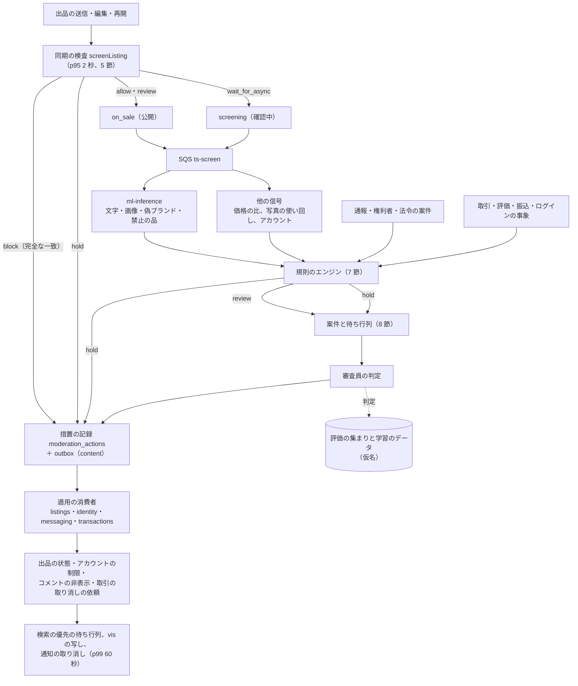
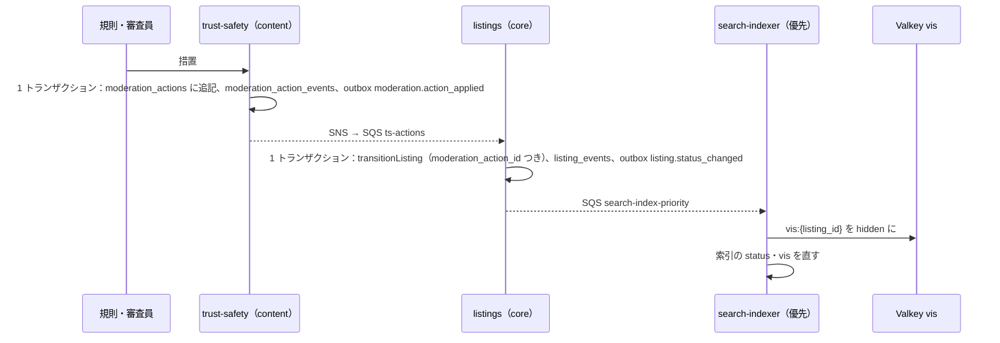

# Trust and safety: Mercari

トラスト＆セーフティ。同期の検査、分類器の信号、規則のエンジンと規則の言語、通報と審査の待ち行列、措置の記録と効かせ方、異議、偽ブランド・禁止の品・盗品（法務の L6・L10）、分類器の評価の集まり、不正（乗っ取り、偽の発送、チャージバック、売上金の現金化）、法令の窓口（情報流通プラットフォーム対処法 L9、取引デジタルプラットフォーム消費者保護法の要請 L7）を決める。

前提となる決定は次のとおり。

- T&S は、同期の検査 → 公開 → 非同期の分類器 → 規則のエンジン → 人の審査 → 措置の記録の段に分ける。分類器は点（0〜1）と理由のコードとモデルのバージョンだけを出す。規則だけで効かせてよいのは、出品の `hold` と、禁止のハッシュ・禁止の語の完全な一致の `block` まで。アカウントの停止、売上金の保留、進行中の取引の取り消しは人の審査を通す。規則はバージョンを持つ宣言の形で、影の評価と T&S の責任者の承認を通す（[ADR-0009](../decisions/0009-trust-and-safety-pipeline-boundary.md)）
- 出品の状態の遷移は `transitionListing()` だけが書く（[ADR-0011](../decisions/0011-listing-state-machine-and-versions.md)）。措置は `listingVisible()` を通じて検索・おすすめ・通知に効く（[ADR-0007](../decisions/0007-single-tenant-and-party-visibility.md)）
- 取引の取り消しと返金は取引の遷移の関数と台帳が行う（[ADR-0002](../decisions/0002-transaction-state-machine-and-single-purchase.md)、[ADR-0003](../decisions/0003-escrow-and-double-entry-ledger.md)）
- 分類器は Python の `ml-inference` で、自前で学習する。本家のデータ・モデルを使わない（[ADR-0001](../decisions/0001-platform-and-stack.md)、[リポジトリ共通の ADR-0007](../../../../docs/decisions/0007-no-reuse-of-original-implementation.md)）
- 評価の集まりは権利者と合意した素材と生成した素材だけで作る（[quality.md](../quality.md) の 2.2.1 節 F）

この文書で決めたことは次の ADR にある。

| ADR | 決定 |
| --- | --- |
| [0051](../decisions/0051-rules-engine-declarative-tables.md) | 規則は、開発リポジトリの `ts-rules/` に置く YAML の宣言（条件は比べ・and・or・not・in だけの小さな式）で書き、`rules_version` の束として出す。全部の有効な規則を評価し、結果は `block` > `hold` > `review` > `allow` の重い順で 1 つにまとめる。`block` を返せるのは、条件が完全な一致の事実（ハッシュの距離 0、禁止の語の完全な一致、禁止のカテゴリ）だけでできた規則に限り、束を作る時に検査する。新しい・変えた規則は 7 日の影の評価と、審査の判定との一致の確かめと、T&S の責任者の承認の後に有効にする。評価に使った事実の写し（ID と数だけ）を残す |
| [0052](../decisions/0052-review-cases-queues-and-appeals.md) | 通報・規則の `review`・`hold` は、対象と方針のコードの組ごとに 1 つの案件にまとめる。優先度は重さ × 露出 × 確かさ × 待ち時間の積で、待ち行列は偽ブランドの疑いの高い `hold`（p95 4 時間）、その他の `hold` と通報（p95 24 時間）、法令の案件（期限は `legal.*`）に分ける。アカウントの停止・売上金の保留・取引の取り消しの措置は 2 人の承認。異議は措置から 30 日以内に出せ、元の判断者と別の審査員が p95 7 日で判定する |
| [0053](../decisions/0053-counterfeit-detection-signals-and-brand-profiles.md) | 偽ブランドは、ブランドごとの危険の段（`counterfeit_risk`）と、文字の点・画像の点・価格の比（出品の価格 ÷ 売れた品の中央の値）・写真の使い回し・売り手の履歴の組み合わせを規則で判定する。危険の高いブランドの新しいアカウントの高額の出品は公開の前に分類器を待つ。権利者は確かめた窓口から通報と見分け方の資料を出せるが、措置は審査員が決める。閾値は評価の集まりで保留の判定の再現率 90%・適合率 80% を満たすように決め、満たさないモデル・規則は出さない |
| [0054](../decisions/0054-photo-hash-block-list.md) | 禁止のハッシュの一覧は、審査員が措置で確かめた写真の pHash と dHash を、範囲（全体・ブランド）と `block` の可否つきで登録する。同期の検査は一覧をメモリーに持ち、8 ビットずつ 8 つの帯の索引で距離 7 以下を必ず引く。両方の距離 0 かつ `block` 可の登録だけが `block`、pHash の距離 1〜6 は `hold` の信号にする。一覧の追加・取り消しも措置の記録に結ぶ |

## 1. 範囲

- 扱う：
  - 同期の検査の契約と中身、禁止の語の辞書、禁止のハッシュの一覧、公開の前に待つ規則
  - 信号の種類と分類器の出し方、規則のエンジン、規則の言語、影の評価、承認
  - 通報の受け付け、案件、優先度、待ち行列、審査の画面、2 人の承認
  - 措置の種類、記録、効かせ方、反映の時間、異議
  - 偽ブランド（ブランドの危険の段、権利者の窓口）、禁止の品（L10）、盗品（L6）の枠組み
  - 分類器の評価の集まりと出す前の確かめ
  - 不正の兆し（乗っ取り、偽の発送、チャージバック、売上金の現金化）と規則
  - 法令の案件（削除の申し出 L9、利用の停止等の要請 L7）の受け付けと期限の枠組み
- 扱わない：
  - 出品の状態の機械（[listings-and-photos.md](listings-and-photos.md)）、知覚ハッシュの計算と使い回しの索引（同 5.3・5.4 節）
  - 取引の取り消し・返金・売上金の保留の実行（`transactions-and-state-machine.md`、`disputes-and-customer-support.md`、`ledger-and-proceeds.md`）
  - 開示の請求（L7 第 5 条）と捜査機関の照会（L6）の手順（`disputes-and-customer-support.md`）
  - 運用者の権限と監査ログの仕組み（`security.md`）、端末の兆しの記録（`accounts-and-devices.md`）
  - メッセージ・コメントの悪用の絞り込み（[messaging-and-comments.md](messaging-and-comments.md) の 5 節）。この文書は辞書と信号を受け持つ

## 2. 事実（確かめたこと）

いずれも 2026-10-10 に確認。

| 項目 | 事実 | この設計 |
| --- | --- | --- |
| 本家の偽ブランドの対策 | 権利者との協力、機械学習での疑わしい出品の抽出、鑑定の拠点を持つと報じられている（報道だけ。**未検証**。[intent.md](../intent.md) の出典） | 自前の分類器と規則、権利者の窓口（11.1 節）。鑑定は MVP の後 |
| 取引デジタルプラットフォーム消費者保護法 | 努力義務（第 3 条）、利用の停止等の要請（第 4 条）、販売業者等の情報の開示の請求（第 5 条）を定める（[日本法令外国語訳データベースの概要](https://www.japaneselawtranslation.go.jp/en/outlines/view/34)。[intent.md](../intent.md) の出典） | 本システムへの当てはめは法務の確認待ち（L7）。要請の受け付けの枠組みだけを作る（14 節） |
| 情報流通プラットフォーム対処法 | 大規模特定電気通信役務提供者への当てはめは法務の確認待ち（L9）。X の題材の [trust-and-safety](../../../x/docs/architecture/trust-and-safety.md) の 10.1 節に同じ法の枠組みがある | 申し出の窓口と期限の計算の枠組みを作る（14 節） |
| 本家の禁止の品の一覧 | この設計では写さない。範囲は法務の確認待ち（L10） | 自前の一覧（11.2 節） |

## 3. 要件

| 要件 | 値 | 出どころ |
| --- | --- | --- |
| 同期の検査 | p95 2 秒 | NFR-009 |
| 非同期の分類器と規則 | 公開の事象から判定まで p95 60 秒 | NFR-009 |
| 偽ブランドの判定 | 評価の集まりで `hold` の判定の再現率 90% 以上・適合率 80% 以上（主なブランド 50。ブランドごとの再現率 80% 以上） | NFR-009、K6 |
| 禁止の品 | 種類の判定の再現率 95% 以上 | NFR-009 |
| 審査 | 通報・保留から判定まで p95 24 時間。偽ブランドの疑いの高いものは p95 4 時間 | NFR-009 |
| 確かめた偽ブランドの削除 | p95 24 時間 | K6 |
| 措置の反映 | 措置から検索・おすすめ・通知・購入の拒否まで p99 60 秒 | NFR-016 |
| 記録 | 措置はすべて根拠（信号、規則のバージョン、審査員）と主体を書いてから効く | ADR-0009 |

## 4. 全体の流れ



**例：偽ブランドの疑いの出品が公開から保留になるまで**

| 時刻 | 出来事 |
| --- | --- |
| t = 0 | 売り手 U（アカウント 120 日、取引 14 件、`standard`）が、危険の段 `high` のブランド B のバッグを 12,000 円で出す。同期の検査：禁止の語なし、禁止のハッシュの一致なし、カテゴリの制限なし。公開の前に待つ規則（7.3 節の R-CF-030）は、アカウントが 7 日を超えるので当たらない → `allow`。`on_sale` |
| t ≈ 4 秒 | 検索の索引に入る |
| t ≈ 2〜30 秒 | 信号：`cf_text` 0.72、`cf_image` 0.64、価格の提案の段 1（バッグ、B、`nearly_unused`）の p50 85,000 円で `price_ratio` = 12,000 / 85,000 = 0.141（n = 64）、写真の使い回しなし |
| t ≈ 31 秒 | 規則：R-CF-010 は `cf_image` ≥ 0.85 が偽、（`price_ratio` ≤ 0.35 かつ `cf_text` ≥ 0.6）が真 → `hold`、待ち行列 `counterfeit_high`。R-CF-020 は `review`。重い順で `hold` |
| t ≈ 32 秒 | 措置の記録（`listing_hold`、主体 `rule:R-CF-010@v3`、信号の写し）と outbox |
| t ≈ 35 秒 | `listings` が `under_review`（`resume_to = on_sale`）にし、優先の待ち行列で `vis` を直す。検索から消える。購入は core の状態で拒む |
| t ≈ 2 時間 | 審査員（偽ブランドの担当）が、ブランドの資料と写真で偽ブランドと判定 → `listing_remove`（措置の行）、売り手への `account_listing_limit` の提案を 2 人の承認へ |
| t ≈ 2 時間 1 分 | 出品が `removed`。写真の配信を止める。写真のハッシュを禁止の一覧に登録（`block` 可は審査員が選ぶ。ADR-0054） |

## 5. 同期の検査

### 5.1 契約

`trust-safety` の `screenListing(snapshot)`。[listings-and-photos.md](listings-and-photos.md) の 6.1 節が呼ぶ。

- 入力：出品の項目（題名、説明、カテゴリ、ブランド、価格、状態）、写真の pHash・dHash、売り手の ID、操作（`publish`・`edit`・`resume`）。
- 出力：`outcome`（`allow`・`review`・`wait_for_async`・`hold`・`block`）、理由のコードの一覧、`rules_version`、評価の ID。
- 段：
  1. アカウントの状態：停止、`no_listing` の制限、出品の数の上限（措置の `account_listing_limit`）→ 拒む（出品の操作のエラー。措置ではない）。
  2. カテゴリの制限（[categories-brands-and-pricing-suggestions.md](categories-brands-and-pricing-suggestions.md) の 4.6 節）：`prohibited` → `block`、`requires_review` → `wait_for_async`、`requires_kyc` で水準が足りない → 拒む。
  3. 禁止の語（5.2 節）。
  4. 禁止のハッシュ（5.3 節）。
  5. 同期の段の規則（7 節の `applies_to: listing_sync`。公開の前に待つ規則を含む）。
- 全部をメモリーの中の辞書・一覧・規則で行い、外部の呼び出しはアカウントの状態の読み出し（Valkey の写し、なければ core）だけ。p95 50ms の見込みで、2 秒の予算に余る。

### 5.2 禁止の語の辞書

- `ts_terms`：`term`（正規化した後の文字）、`term_class`（禁止の品の種類のコード、偽ブランドの言い回し、外部の取引への誘導、侮辱）、`match_mode`（`exact_block`・`signal`）、`state`（`shadow`・`active`）、`version`。
- 正規化は [messaging-and-comments.md](messaging-and-comments.md) の 5.2 節の 1〜3（NFKC、ゼロ幅の除き、かなをカタカナに）と、空白の除きを同じ関数で行う。
- 照合は Aho–Corasick（全部の語を 1 つの自動機械に）。S1 で 2 万語、題名と説明で 1ms 以下。
- `exact_block` は、4 文字以上で、普通の文に出ない語に限る（例：法令で売れない薬物の名前の正式な表記）。登録は T&S の責任者の承認。`exact_block` の一致は完全な一致として `block` にしてよい（ADR-0009）。
- `signal` の一致は理由のコードとして規則に渡す（`review`・`hold` の材料）。
- 辞書はメッセージ・コメントの絞り込み（`prohibited_term`、`harassment`、外部の支払いの語）と共有する。

### 5.3 禁止のハッシュの一覧（ADR-0054）

- `ts_photo_blocklist`：`entry_id`、`phash`、`dhash`、`scope`（`global`・`brand:{brand_id}`）、`block_allowed`、`source_action_id`（登録のもとの措置）、`state`、`created_at`。
- 登録：審査員が措置（`listing_remove`）の時に、その出品の写真から選んで登録する。`block_allowed` は、写真そのものが禁止の品・偽ブランドの証拠になる場合（ロゴの偽物の接写など）だけ、審査員が選ぶ。売り手の背景・部屋の写真は登録しない。
- 引き方：一覧をメモリーに持ち、pHash を 8 ビットずつ 8 つの帯に分けた索引を作る（帯の値 → 項目の一覧）。8 つの帯のどれかが同じ項目を引き、pHash と dHash の距離を数える。8 つに分けると、距離 7 以下の 2 つは少なくとも 1 つの帯が同じになる（鳩の巣）ので、距離 6 以下を必ず引ける。
- 量：S1 で一覧 100 万件までを見込む。1 つの帯の値あたり平均 3,900 件、8 つの帯で約 3.1 万件の比べ。1 枚 0.3ms 前後（TypeScript で 32 ビットの半分ずつの popcount）。
- 結果：

| 一致 | 結果 |
| --- | --- |
| pHash と dHash の両方の距離 0、`block_allowed`、範囲に当たる | `block`（完全な一致） |
| pHash の距離 1〜6、範囲に当たる | 信号 `photo_blocklist_near`（規則で `hold`） |
| pHash の距離 0 だが dHash の距離 1 以上 | 信号 `photo_blocklist_near` |

- 一覧の更新は `ts_photo_blocklist` の変更の事象で全 `trust-safety` のタスクに配り、各タスクが索引を作り直す（差分の追加）。取り消し（異議が認められた措置のもとの登録）も同じ。

### 5.4 公開の前に待つ

- 規則（`applies_to: listing_sync`）が `wait_for_async` を返すと、出品は `screening` になり、非同期の段の結果で `on_sale`・`under_review` に進む。
- 待つ時間の上限は 5 分。5 分で非同期の段が終わらなければ、`review` の案件を作り、出品は `screening` のまま審査を待つ（公開に倒さない）。売り手には「確認中。最長 24 時間」と出す。

## 6. 信号

| 信号 | 出すところ | 値 | 備考 |
| --- | --- | --- | --- |
| `cf_text` | `ml-inference`（文字の分類器） | 0〜1、ブランドの ID | 偽ブランドの言い回し |
| `cf_image` | `ml-inference`（画像の分類器） | 0〜1、ブランドの ID | ロゴ・型の特徴。写真は `medium` を最大 4 枚 |
| `prohibited_text`・`prohibited_image` | `ml-inference` | 種類のコードごとの 0〜1 | 禁止の品の種類（11.2 節） |
| `price_ratio` | `trust-safety`（価格の提案の値を読む） | 比、段、n | [categories-brands-and-pricing-suggestions.md](categories-brands-and-pricing-suggestions.md) の 6.6 節 |
| `photo_reuse` | `listings`（[listings-and-photos.md](listings-and-photos.md) の 5.4 節） | 相手の出品・売り手、距離 | 自分の再出品を除く |
| `photo_blocklist_near` | 同期の検査（5.3 節） | 項目、距離 | - |
| `term_signal` | 同期の検査（5.2 節） | 語の種類のコード | - |
| アカウントの事実 | `identity`・`accounts` | 年齢（日）、本人確認の水準、完了の取引の数、売り手の段、90 日の措置の数、端末の危険の点 | 端末の危険の点と `fraud_signals` の事象は [accounts-and-devices.md](accounts-and-devices.md) |
| 評価の兆し | [ratings-and-reputation.md](ratings-and-reputation.md) の 6.1 節 | 真偽と数 | - |
| 外部の取引の兆し | [messaging-and-comments.md](messaging-and-comments.md) の 5 節 | 種類と回数 | 本文を含まない |
| 不正の兆し | 13 節 | 種類と数 | - |

- 分類器の出力は、点・理由のコード・モデルのバージョンだけ。分類器は出品・アカウントの状態を変えない（ADR-0009）。
- `ml-inference` の推論：文字は日本語の文の表現（汎用の事前学習のモデル。ライセンスを確かめて使う）と自前の分類の頭。画像は汎用の画像の特徴の抽出と、ブランドごとの自前の頭。S1 は CPU、S2 から画像を GPU にするか決める（[ADR-0001](../decisions/0001-platform-and-stack.md)）。
- 1 出品の推論の予算：待ち行列 p95 10 秒、文字 0.2 秒、画像 4 枚で 3 秒（CPU）、規則 1 秒。計 p95 15 秒前後で、NFR-009 の 60 秒に余る。
- 信号は `ts_signals` に、出品・アカウントごとに最新の値と履歴（90 日）で持つ。学習のデータにはデータレイクの仮名の写しを使う。

## 7. 規則のエンジン（ADR-0051）

### 7.1 規則の言語

```yaml
id: R-CF-010
version: 3
state: active            # shadow・active・retired
applies_to: [listing_async]
policy: counterfeit
when:
  all:
    - brand.counterfeit_risk == "high"
    - any:
        - signal.cf_image >= 0.85
        - all:
            - signal.price_ratio <= 0.35
            - signal.price_ratio_n >= 20
            - signal.cf_text >= 0.60
then:
  outcome: hold
  queue: counterfeit_high
  reason: cf_composite
```

- `when` は、事実の名前（`listing.*`、`seller.*`、`brand.*`、`signal.*`、`event.*`）と定数の比べ（`==`・`!=`・`<`・`<=`・`>`・`>=`・`in`・`exists`）と `all`・`any`・`not` だけ。繰り返し・関数の定義・外部の呼び出しを持たない（評価の時間を一定にし、結果を説明できるようにする）。
- `then.outcome` は `allow`・`review`・`hold`・`block`・`wait_for_async`（同期の段だけ）。アカウントへの措置は `suggest`（審査員への提案）としてだけ書け、自動では効かない。
- `applies_to`：`listing_sync`、`listing_async`、`report`、`txn_event`、`rating_published`、`payout_request`、`login`、`message_signal`。
- **束を作る時の検査**：
  - `outcome: block` の規則は、`when` の事実が完全な一致の事実（`signal.photo_blocklist_exact`、`signal.term_exact_block`、`listing.category_prohibited`）だけでできていなければならない。違えば束を作れない。
  - 規則の ID とバージョンは重ならない。消した規則は `retired` で残す。
  - 全部の規則に、表駆動テストの行（当たる例と当たらない例）が 1 つ以上ある。

### 7.2 評価とまとめ方

- 事象ごとに、`applies_to` が合う `active` の規則を全部評価する。当たった規則の `outcome` を重い順（`block` > `hold` > `wait_for_async` > `review` > `allow`）で 1 つにまとめる。当たらなければ `allow`。
- 同じ重さの規則が複数当たれば、全部の理由を記録し、待ち行列は優先度の高いほう（8.2 節）を使う。
- `shadow` の規則も評価し、結果を `rule_evaluations` に記録するが、まとめに入れない。
- 記録：`rule_evaluations` に、評価の ID、対象、`rules_version`、当たった規則と結果、使った事実の写し（ID、点、数。本文と住所を含まない）。同じ事実と同じ `rules_version` なら同じ結果になる（再現できる）。
- 評価は p95 1 秒（ADR-0009）。規則 500 本で 1ms 前後の見込み。

### 7.3 規則の例（`rules_version` の最初の束の草案）

| ID | 段 | 条件 | 結果 |
| --- | --- | --- | --- |
| R-PH-001 | `listing_sync` | 禁止のハッシュの完全な一致（5.3 節） | `block` |
| R-TM-001 | `listing_sync` | 禁止の語の `exact_block` の一致 | `block` |
| R-CT-001 | `listing_sync` | カテゴリが `prohibited` | `block` |
| R-CF-030 | `listing_sync` | ブランドの危険 `high` かつ売り手のアカウント 7 日未満かつ価格 30,000 円以上 | `wait_for_async` |
| R-PH-010 | `listing_sync`・`listing_async` | `photo_blocklist_near` の距離 1〜6 | `hold`（待ち行列 `prohibited`） |
| R-CF-010 | `listing_async` | 7.1 節 | `hold`（`counterfeit_high`） |
| R-CF-020 | `listing_async` | ブランドの危険 `high` かつ `cf_image` が 0.60 以上 0.85 未満 | `review`（`counterfeit`） |
| R-PO-010 | `listing_async` | `price_ratio` ≤ 0.20 かつ n ≥ 20 かつブランドがある | `review`（`counterfeit`） |
| R-PR-010 | `listing_async` | 禁止の品の種類の点が 0.90 以上 | `hold`（`prohibited`） |
| R-PR-020 | `listing_async` | 禁止の品の種類の点が 0.60 以上 0.90 未満 | `review`（`prohibited`） |
| R-RU-010 | `listing_async` | `photo_reuse` の距離 3 以下、相手の出品が 30 日以内、売り手のアカウント 30 日未満 | `review`（`photo_theft`） |
| R-RP-010 | `report` | 確かめた権利者の通報 | `hold`（`counterfeit_high`） |
| R-RP-020 | `report` | 別々の通報者 3 人以上（24 時間）、同じ方針 | `review`（優先度を上げる） |
| R-RA-010 | `rating_published` | [ratings-and-reputation.md](ratings-and-reputation.md) の 6.2 節 | `review`（`rating_manipulation`） |
| R-FR-010 | `payout_request` | 13 節の乗っ取りの兆し | `review`（`fraud`）と、振込の前の再認証の依頼 |

- 閾値（0.85、0.60、0.35、0.20、0.90）は、評価の集まり（12 節）で NFR-009 を満たすように `counterfeit-classifier-poc` で決める。この表の値は始めの置き値。

### 7.4 影の評価と承認

1. 規則の変更は開発リポジトリの PR で出す（YAML と表駆動テストの行）。
2. 束を作り、`shadow` で本番に出す。7 日の間、結果だけを記録する。
3. 確かめ：結果の量（`hold`・`review` の増減）、無作為の 200 件の抜き取りを審査員が判定し、規則の結果との一致の率（`hold` の適合率 80% 以上を目安）、待ち行列の量の増え（1.5 倍を超えるなら Ops と合意。[quality.md](../quality.md) の 2.2.1 節 F）。
4. T&S の責任者（人）が承認し、`active` にする。承認の記録（誰が、いつ、どの確かめで）を `ts_rule_approvals` に残す。エージェントは草案を作るが承認しない。
5. 緊急（新しい手口の偽ブランドの急増）では、`review` を返す規則に限り、影の評価を 24 時間に縮めてよい。`hold` は縮めない。

## 8. 通報と審査（ADR-0052）

### 8.1 受け付け

- 利用者の通報：対象（出品、コメント、取引のメッセージ、利用者、評価）、理由のコード、任意の文（300 文字）。ログインした利用者だけ。1 人 1 日 50 件。
- 証拠の写し（`report_evidence`）：通報の時の出品の写し（項目、写真の参照）。メッセージは対象と前後 10 件（[messaging-and-comments.md](messaging-and-comments.md) の 5.6 節。範囲は L11 の結論で直す）。T&S の鍵で暗号化する。
- 権利者の通報（11.1 節）と、法令の案件（14 節）は別の入口で受け、同じ案件の仕組みに乗せる。

### 8.2 案件と優先度

- 通報・規則の `review`・`hold` は、（対象、方針のコード）の組で開いた案件 1 つにまとめる。後から来た通報・信号は案件に足す。
- 優先度：

```
priority = severity × exposure × confidence × age
severity   = { counterfeit_high: 1.0, prohibited_dangerous: 1.0, stolen: 0.9, fraud: 0.9,
               counterfeit: 0.7, prohibited: 0.7, photo_theft: 0.5, offplatform: 0.5,
               rating_manipulation: 0.4, harassment: 0.4, other: 0.2 }[policy]
exposure   = (1 + log10(1 + 直近 24 時間の閲覧の数)) × { on_sale: 1.5, trading: 2.0, それ以外: 1.0 }
confidence = max(規則の信号の最大の点, 通報者の信頼, 0.3)
             通報者の信頼 = (過去の通報で措置に至った数 + 1) / (過去の通報の数 + 2)、確かめた権利者は 0.9
age        = 1 + 待った時間（時間）/ 24
```

**例**：偽ブランドの疑いの `hold` の出品（`counterfeit_high`、閲覧 99、`under_review` なので状態の係数 1.0、点 0.72、待ち 1 時間）の priority = 1.0 × (1 + log10 100) × 1.0 × 0.72 × (1 + 1/24) = 1.0 × 3 × 0.72 × 1.042 ≒ 2.25。普通の通報（`harassment`、閲覧 9、`on_sale`、通報者の信頼 0.5、待ち 10 時間）は 0.4 × (1 + 1) × 1.5 × 0.5 × 1.417 ≒ 0.85。前者を先に見る。

| 待ち行列 | 入るもの | 目標 |
| --- | --- | --- |
| `counterfeit_high` | 偽ブランドの疑いの高い `hold`、確かめた権利者の通報 | p95 4 時間 |
| `prohibited` | 禁止の品の `hold`・`review` | p95 24 時間（危険な品 `prohibited_dangerous` は 4 時間） |
| `counterfeit` | 偽ブランドの `review` | p95 24 時間 |
| `general` | 通報、写真の盗用、外部の取引、評価の操作 | p95 24 時間 |
| `fraud` | 不正の兆し | p95 24 時間（振込の前の確かめは 4 時間） |
| `appeals` | 異議 | p95 7 日 |
| `legal` | 法令の案件 | `legal.*` の期限（14 節） |

- 期限の 2 時間前に届かない案件は、当番の審査の責任者に知らせる。
- 審査の量の見込み（S1）：`hold`・`review` が新しい出品の 1%（3,000 件/日）、通報の案件 5,000 件/日、異議 300 件/日。1 件 1.5 分で 1 日 210 時間の審査。8 時間の勤務で 27 人分と、偏りの余り。`capacity.md` に入れる（見込み）。

### 8.3 審査の画面

- 案件ごとに、対象の写し、信号と理由のコード、当たった規則とバージョン、ブランドの資料（11.1 節）、売り手の履歴（措置、評価の段、本人確認の水準）を出す。住所・口座は出さない（別の権限。ADR-0007）。
- 判定：`no_violation`（措置なし。`hold` なら戻す）、`remove`、`restore`、`escalate`（上の審査員へ）、アカウントへの措置の提案。
- 2 人の承認：`account_suspend`、`account_no_purchase`、売上金の保留の依頼、取引の取り消しの依頼は、別の審査員の承認で効く。
- 判定は評価の集まりと学習のデータに戻す（仮名にして、データレイクへ）。
- 審査員の判定の一致：毎週、各審査員の判定から 2% を別の審査員が見直し、一致の率を出す。

## 9. 措置

### 9.1 種類

| 種類 | 対象 | 効果 | 主体 |
| --- | --- | --- | --- |
| `listing_hold` | 出品 | `under_review` | 規則・審査員 |
| `listing_remove` | 出品 | `removed`、写真の配信の停止 | 審査員。規則は完全な一致の `block` だけ |
| `listing_restore` | 出品 | `resume_to`・`paused` に戻す | 審査員 |
| `comment_remove`・`message_remove` | コメント・メッセージ | `removed`（本文を見せない） | 審査員 |
| `rating_exclude` | 評価の一覧 | 集計と一覧から外す | 審査員 |
| `account_listing_limit` | アカウント | 公開中の出品の上限（例 10） | 審査員 |
| `account_no_listing`・`account_no_purchase` | アカウント | 出品・購入を止める | 審査員（`no_purchase` は 2 人） |
| `account_suspend` | アカウント | ログインの後の操作を止める（取引の続きと売上金の振込の申請を除く） | 2 人 |
| `proceeds_hold_request` | 売上金 | `ledger-and-proceeds.md`・`disputes-and-customer-support.md` に保留を依頼 | 2 人 |
| `transaction_cancel_request` | 取引 | `disputes-and-customer-support.md` に取り消しと返金を依頼 | 2 人 |
| `photo_blocklist_add` | 写真のハッシュ | 5.3 節の一覧に登録 | 審査員 |

### 9.2 記録と効かせ方



- 措置の記録は content、出品の状態は core にあり、別のクラスタなので 1 つのトランザクションにできない。ADR-0009 のとおり、措置の記録と outbox を 1 つのトランザクションで書き、その後に各サービスの適用の消費者が、自分のクラスタの 1 つのトランザクションで状態の変更・記録・outbox を書く。適用は `moderation_action_id` で冪等。
- 状態の変更の行には必ず `moderation_action_id` があり、T&S の理由の状態の変更で行のないものは起きない（PROP-TS-001）。
- 適用の消費者が 30 秒で適用しなければ警告し、照合（5 分ごと：効いているはずの措置と、出品・アカウントの状態の比べ）で直す。

**反映の時間の予算（p99）**

| 区間 | p99 |
| --- | --- |
| 措置の commit から relay | 3 秒 |
| `listings` の適用 | 5 秒 |
| 優先の待ち行列から `vis` | 5 秒 |
| 索引 | 5 秒 |
| 計 | 18 秒（NFR-016 の 60 秒の中）。購入の拒否は `listings` の適用の時点（8 秒）から |

- 取引中（`trading`）の出品の `listing_remove` は、出品を `removed` にし、取引の取り消しは `transaction_cancel_request` で紛争の側が行う（2 人の承認）。偽ブランドと確かめた取引は取り消して返金する（ADR-0009 の「引き受けるコスト」）。

### 9.3 利用者への知らせ

- 措置を受けた利用者に、対象、種類、方針のコード、異議の出し方を知らせる（アプリの中のお知らせ）。規則の中身・閾値は知らせない。
- 通報者には、案件が閉じたことだけを知らせる（措置の中身は知らせない）。

## 10. 異議

- 措置から 30 日以内に、措置を受けた利用者が出せる。1 つの措置に 1 回。
- 元の判断者（審査員か規則）と別の審査員が判定する。p95 7 日。
- 認めたら、元の措置を取り消す行（`moderation_action_events` の `reversed`）と、戻す措置（`listing_restore` など）を書く。禁止のハッシュの一覧のもとの登録も取り消す。
- 異議の率と、認めた率を、規則・審査員ごとに見る（誤りの目安）。

## 11. 偽ブランド・禁止の品・盗品

### 11.1 偽ブランド（ADR-0053）

- **ブランドの危険の段**：`brand_risk_profiles`（`brand_id`、`counterfeit_risk`（`high`・`normal`）、見分けの資料の参照、価格の下限の目安、担当の審査員の組）。`high` は、偽ブランドの措置の数・権利者の申し出・評価の集まりのブランドから T&S の責任者が決める。S1 の始めは主なブランド 50 を `high` にする（[quality.md](../quality.md) の 2.2.1 節 F）。
- **権利者の窓口**（`rights-holder-portal`）：
  - 権利者は、権利を確かめた（登録の書類と担当者の確認。手順は法務の L9 と合わせる）アカウントで、出品の通報と、見分け方の資料（本物と偽物の特徴、型番、価格の目安）を出せる。
  - 確かめた権利者の通報は、通報者の信頼 0.9 で `counterfeit_high` に入る（R-RP-010）。権利者は出品を直接消せない。措置は審査員が決める。
  - 資料は審査の画面と、評価の集まりの素材（権利者と合意した範囲）に使う。
- **信号の組み合わせ**：7.3 節の R-CF-010・020・030、R-PO-010、R-RU-010。
- **買われた後**：措置の前に買われた偽ブランドの取引は、紛争の側で取り消し・返金する。売り手のアカウントの措置を提案する。

### 11.2 禁止の品（枠組み。法務の確認待ち L10）

- 種類のコードの一覧 `ts_prohibited_classes`（`code`、説明、`dangerous`（危険な品か）、検出（語、分類器の頭、カテゴリ）、既定の待ち行列）。
- どの品を禁止・制限にするか（医薬品・医療機器、酒類、たばこ、チケット、武器、生き物、海賊版、個人情報の入った品など）は、法務の確認待ち（[intent.md](../intent.md) の L10）。結論の後に、種類の一覧、カテゴリの制限（[categories-brands-and-pricing-suggestions.md](categories-brands-and-pricing-suggestions.md) の 4.6 節）、禁止の語、分類器の頭を揃えて入れる。
- 結論の前は、開発の環境の仮の一覧で作り、本番の一覧が空なら GA の判定（E18）を通さない。

### 11.3 盗品（枠組み。法務の確認待ち L6）

- 警察からの盗品の通知（品触れなど）と照会への対応、記録の保存、古物の扱いの整理は法務の確認待ち（[intent.md](../intent.md) の L6）。照会の手順は `disputes-and-customer-support.md`。
- この文書は、通知を受けたときの照合の枠組みを持つ：
  - 通知の中身（品の種類、型番・製造番号、特徴の語、写真があればハッシュ）を法令の案件（`legal_cases` の `stolen_goods_notice`）として受ける。
  - 販売中・取引中・直近 90 日の売れた品を、検索（型番・特徴の語）と写真のハッシュで引き、候補を `stolen` の待ち行列の案件にする。
  - 審査員が `listing_hold`（取引中なら紛争の側へ）を判定する。記録の保存の期間は L6 の結論の後に `legal.*` に入れる。

## 12. 評価の集まり

[quality.md](../quality.md) の 2.2.1 節 F を、この領域の値で具体にする。

| 集まり | 中身（`evalset_version` 1 の目標） | 素材 |
| --- | --- | --- |
| `cf-brand-50` | 主なブランド 50 × 正（偽ブランド）200・負（本物と、似た別の品）400 = 3 万件 | 権利者と合意した見本、審査で確かめた出品（同意の範囲、仮名）、生成した素材 |
| `prohibited` | 禁止の品の種類ごとに正 300・負 600 | 生成した素材と、公開の資料から作った文 |
| `photo-distort` | 1,000 枚の生成した写真の歪み（品質、縮小、切り抜き、明るさ）の組 | 生成した写真だけ |
| `fairness` | 売り手の段（新しいアカウント、本人確認の有無）ごとの負の出品 | 生成した素材 |

- **測り方**：規則の束と分類器を合わせた `hold` の判定で、再現率・適合率を出す。正 1 万件で再現率 90% の 95% 信頼区間は ±0.6 ポイント、ブランドごと（正 200）では ±4.2 ポイント。ブランドごとの基準（再現率 80% 以上）は区間の下限で判定する。
- **出す前の門**：新しいモデル・規則の束は、NFR-009 の基準を全部満たし、前のバージョンの集まりでも後退しないこと（`evalset_version` の古いバージョンも測り続ける）。影の評価 7 日（7.4 節）。満たさないものは出さない。
- **公平さ**：売り手の段ごとの誤った `hold` の率の比が 1.5 を超えたら出さない（新しいアカウントを不当に止めない）。
- 集まりの素材に、本家・他のサービスから取り出したもの、実在の利用者の出品（同意の外）、実在のブランドの偽物の写真（権利者と合意したものを除く）を入れない。

## 13. 不正

| 手口 | 兆し | 規則の結果 |
| --- | --- | --- |
| 乗っ取り | 新しい端末でのログイン、電話番号の変更、口座の変更、振込の申請が 24 時間の中に続く。端末の危険の点。`accounts-and-devices.md` が `fraud_signals` の事象で渡す | 強い確認と 72 時間の振込の待ちは、本人の操作に結び付く決まった規則として [accounts-and-devices.md](accounts-and-devices.md) が持つ（[ADR-0067](../decisions/0067-account-takeover-step-up-and-payout-holds.md)。措置ではない）。この文書の規則は振込の申請に `review`（`fraud`、4 時間）を作るだけ。売上金の保留・`locked` は審査員の判定（保留は 2 人の承認） |
| 偽の発送 | 匿名でない配送で、追跡の番号が運送会社の照会で見つからない・72 時間動かない。同じ番号を複数の取引に使う | `review`。取引の扱いは紛争の側（`disputes-and-customer-support.md`）。匿名の配送は引き受けがなければ発送にならない（ADR-0006） |
| チャージバック | 買い手のチャージバックの事象（`payments-and-escrow.md`）、90 日の数 | 2 件目から `review`（買い手のアカウント） |
| 売上金の現金化 | 同じ組の往復の取引、最低の価格の繰り返し（評価の兆しと共通）、作ってすぐの高額の売上と振込 | `review` |
| 大量のアカウント | 同じ端末・同じ本人確認の指紋（[identity-verification.md](identity-verification.md) の 6.3 節）の複数のアカウント | `review` |

- 不正の規則も 7 節の同じ言語と承認の手順で出す。犯罪収益移転防止法の疑わしい取引の届出（L2）に当たる判断は、この規則で決めない。届出の手順と基準は法務の確認待ち（[identity-verification.md](identity-verification.md) の 9 節）。

## 14. 法令の窓口（法務の確認待ち）

| 案件の種類 | 法令 | この設計 |
| --- | --- | --- |
| `takedown_request` | 情報流通プラットフォーム対処法（L9） | 申し出の窓口（Web のフォーム）、受け付けの時刻、対象、申出者の連絡先（暗号化）。期限・通知・判断の基準は `legal.takedown_*` |
| `platform_request` | 取引デジタルプラットフォーム消費者保護法の利用の停止等の要請（L7 第 4 条） | 行政からの要請の受け付け、対象の出品、期限は `legal.platform_request_*` |
| `stolen_goods_notice` | 古物営業法（L6） | 11.3 節 |

- 法令の案件は `legal_cases` に持ち、受け付けの時刻から期限（`due_at`）を計算し、48 時間前・24 時間前に警告する（X の題材の [ADR-0041](../../../x/docs/decisions/0041-legal-requests-and-transparency.md) の考え方）。期限の値・判断の基準・通知の文は `legal.*` に置き、法務の確認の後に決める。
- 判断は審査員と法務の担当の 2 人。措置は 9 節の同じ記録に、根拠 `legal_case:{id}` で書く。
- 開示の請求（L7 第 5 条）と捜査機関の照会（L6）は `disputes-and-customer-support.md` が受ける。
- 透明性の報告（L9 で求められる場合）のために、措置・通報・案件を日次でデータレイクに集計する。公表の形は L9 の結論の後。

## 15. 失敗と回復

| 事象 | 影響 | 扱い |
| --- | --- | --- |
| `trust-safety` の停止 | 同期の検査が返らない | 出品は `screening` で待つ（閉じる側。[listings-and-photos.md](listings-and-photos.md) の 6.1 節）。復旧の後に溜まった出品を順に検査 |
| `ml-inference` の停止・遅れ | 信号が欠ける | 規則は欠けた信号を `exists` で見る。`wait_for_async` の出品は 5 分で審査の案件へ。公開済みの出品は信号なしで規則を回し、復旧の後に `ts-screen` を流し直す |
| 規則の誤り（`hold` の急増） | 正しい出品が止まる | `hold` の量が 1 時間の平均の 3 倍を超えたら警告。当番の T&S の責任者が規則を `retired` にする（承認の記録つき）。止めた出品は規則の ID で引いて、審査で戻す |
| 分類器の点の分布の変化 | 見逃し・誤検出 | 日次で点の分布（ブランドごと）の変化を見る（ADR-0009）。閾値を超えたら影の評価の結果と比べて調べる |
| 措置の適用の遅れ | 措置した出品が見える・買える | 30 秒で警告。5 分ごとの照合で直す |
| 審査の待ちの積み上がり | 目標を超える | 優先度で上から見る。`counterfeit_high` の超過は当番を呼ぶ。応援の手順は runbooks（[runbooks/](../runbooks/README.md)） |
| 禁止のハッシュの一覧の配りの失敗 | 新しい登録が効かない | 各タスクは一覧のバージョンを 1 分ごとに確かめ、古ければ全部を読み直す |

## 16. 上限

| 対象 | 値 |
| --- | --- |
| 規則 | 有効 500 本、1 本の条件 50 項まで |
| 禁止の語 | 5 万語 |
| 禁止のハッシュ | 100 万件（超えたら帯の索引を 16 に分け直す） |
| 通報 | 1 人 1 日 50 件、文 300 文字 |
| 異議 | 1 措置 1 回、30 日以内 |
| 公開の前に待つ | 5 分 |
| 案件に足す通報 | 1 案件 1,000 件（それ以上は数だけ） |

## 17. data-model への項目

| 置き場所 | 中身 | 節 |
| --- | --- | --- |
| Aurora content `moderation_actions`（`action_id`（UUIDv7）、`target_kind`（`listing`・`comment`・`message`・`rating`・`account`・`photo_hash`）、`target_id`、`kind`、`params`（JSON）、`policy_code`、`basis_kind`（`rule`・`review`・`legal_case`・`appeal`）、`basis_ref`、`decided_by_kind`（`rule`・`human`）、`decided_by`、`approved_by`、`rules_version`、`evaluation_id`、`case_id`、`state`、`created_at`）。追記だけ | 措置の正本 | 9 |
| Aurora content `moderation_action_events`（`action_id`、`seq`、`event`（`applied`・`approved`・`reversed`）、`actor`、`reason_code`、`created_at`） | 措置の状態 | 9、10 |
| Aurora content `rule_evaluations`（`evaluation_id`、`target_kind`、`target_id`、`applies_to`、`rules_version`、`matched`（JSON：規則の ID・バージョン・結果、影かどうか）、`facts`（JSON：ID・点・数）、`outcome`、`created_at`）。90 日 | 規則の評価 | 7.2 |
| Aurora content `ts_signals`（`target_kind`、`target_id`、`signal`、`value`、`reason_codes`、`model_version`、`created_at`） | 信号 | 6 |
| Aurora content `ts_rule_bundles`（`rules_version`、`git_sha`、`state`、`created_at`）、`ts_rule_approvals`（`rule_id`、`version`、`approved_by`、`shadow_from`、`shadow_to`、`sample_agreement`、`queue_delta`、`approved_at`） | 規則のバージョンと承認 | 7.4 |
| Aurora content `ts_terms`、`ts_photo_blocklist`、`ts_prohibited_classes`、`brand_risk_profiles` | 辞書と一覧 | 5.2、5.3、11 |
| Aurora content `reports`（`report_id`、`reporter_id`、`target_kind`、`target_id`、`reason_code`、`note`、`case_id`、`source`（`user`・`rights_holder`）、`created_at`）、`report_evidence`（`evidence_id`、`case_id`、`kind`、`payload_ct`、`captured_at`） | 通報と証拠 | 8.1 |
| Aurora content `moderation_cases`（`case_id`、`target_kind`、`target_id`、`policy_code`、`queue`、`priority`、`state`、`assignee`、`due_at`、`decided_at`、`outcome`）、`appeals`（`appeal_id`、`action_id`、`appellant_id`、`statement`、`state`、`reviewer`、`outcome`、`created_at`、`decided_at`） | 案件と異議 | 8.2、10 |
| Aurora content `rights_holders`（`rights_holder_id`、`brand_ids`、`verified_at`、`contacts_ct`）、`rights_holder_documents`（`doc_id`、`brand_id`、`s3_key`、`usage_scope`） | 権利者 | 11.1 |
| Aurora content `legal_cases`（`case_id`、`kind`、`requester_ct`、`targets`、`received_at`、`due_at`、`deadline_rule_version`、`state`、`decision`、`decided_at`） | 法令の案件 | 14 |
| SQS `ts-screen`、`ts-actions`。outbox の話題 `moderation.action_applied`・`moderation.action_reversed`・`ts.case_opened` | 事象 | 4、9 |
| AppConfig `legal.takedown_*`、`legal.platform_request_*`、`legal.stolen_goods_*` | 法令の値 | 11.3、14 |

- `report_evidence`・`legal_cases`・`rights_holders` の連絡先は T&S と法務の役割だけが読める。読み出しは監査ログに理由（案件の ID）とともに残す（`security.md`）。

## 18. テストと性質

| ID | 性質・試験 |
| --- | --- |
| PROP-TS-001 | 任意の措置・取り消しの列で、T&S の理由の出品・アカウントの状態の変更には、必ず効いている `moderation_actions` の行がある。行のない変更は起きない（ADR-0009） |
| PROP-TS-002 | 規則の主体の措置は `listing_hold` と、完全な一致の `listing_remove` だけ。束の検査が、完全な一致でない条件の `block` を拒む |
| PROP-TS-003 | 同じ事実と同じ `rules_version` の評価は、同じ結果を返す（記録した事実で再評価して一致） |
| PROP-TS-004 | `shadow` の規則は、どんな事実でも結果のまとめを変えない |
| PROP-TS-005 | 措置の後、仮想の時計で 60 秒以内に、検索・おすすめ・通知の候補から消え、購入が拒まれる（NFR-016、[quality.md](../quality.md) の 2.2.1 節 E・G） |
| PROP-TS-006 | 異議の担当は、元の判断者と同じでない。2 人の承認の措置は、承認者が判断者と別 |
| PROP-TS-007 | 禁止のハッシュの一覧で、距離 6 以下の項目は帯の索引で必ず引ける（全件の比べとの一致） |
| PROP-TS-008 | 措置の適用は冪等。同じ `moderation_action_id` の事象を何度受けても、出品の状態の変更は 1 回 |
| 評価の集まり | 12 節の門（NFR-009）。モデル・規則の変更の PR と週次 |
| 表駆動 | 7.3 節の全規則の当たる例・当たらない例。8.2 節の優先度の例 |
| 影の評価 | 7.4 節の手順の結合の試験（記録だけで措置が出ないこと） |
| 結合 | 4 節の例の流れ（公開 → 信号 → `hold` → 審査 → `remove` → 写真の停止、一覧への登録） |

## 19. Story の候補

| Epic | Story | 中身 |
| --- | --- | --- |
| E14 | `counterfeit-classifier-poc` | 最初の分類器、評価の集まりの最初のバージョン、閾値、写真のハッシュの閾値（12 節、7.3 節） |
| E14 | `sync-screening` | `screenListing`、禁止の語、禁止のハッシュの一覧、公開の前に待つ（5 節） |
| E14 | `rules-engine` | 規則の言語、束の検査、評価とまとめ、記録、影の評価、承認（7 節） |
| E14 | `moderation-actions` | 措置の種類、記録、適用の消費者、照合、利用者への知らせ（9 節） |
| E14 | `review-queues-and-console` | 案件、優先度、待ち行列、審査の画面、2 人の承認（8 節） |
| E14 | `appeals` | 異議（10 節） |
| E14 | `text-and-image-classifiers` | `ml-inference` の文字と画像の分類器、信号（6 節） |
| E14 | `counterfeit-evalset` | 評価の集まりと評価の枠、公平さ（12 節） |
| E14 | `prohibited-items-policy` | 禁止の品の種類の一覧と規則（11.2 節）。範囲は法務：L10 |
| E14 | `stolen-goods-handling` | 盗品の通知の照合（11.3 節）。法務：L6 |
| E14 | `rights-holder-portal` | 権利者の確かめ、通報、資料（11.1 節） |
| E14 | `user-reports` | 通報の入口と証拠（8.1 節） |
| E14 | `fraud-signals` | 不正の兆しと規則（13 節） |
| E14 | `legal-notices-intake` | 削除の申し出・停止の要請の受け付けと期限（14 節）。法務：L7・L9 |

## 20. 未解決の問い

### 決定（2026-10-10、既定案）

- **規則の言語**：YAML の宣言、小さな式、束の検査、重い順のまとめ、7 日の影の評価、T&S の責任者の承認（ADR-0051）。
- **案件と待ち行列**：対象と方針の組で 1 案件、優先度の積、4 時間と 24 時間の待ち行列、2 人の承認、異議 30 日・p95 7 日（ADR-0052）。
- **偽ブランド**：ブランドの危険の段と信号の組み合わせ、公開の前に待つ規則、権利者は通報と資料だけ（ADR-0053）。
- **禁止のハッシュ**：審査員が登録、両方の距離 0 で `block`、距離 1〜6 で `hold` の信号、8 つの帯の索引（ADR-0054）。
- **措置の適用**：措置の記録と outbox を content で、適用は各サービスの消費者が自分のクラスタで（ADR-0009 の段のとおり）。

### 持ち越し

| 問い | いつ・どう決めるか |
| --- | --- |
| 禁止・制限の品の範囲と、見つけたときの扱い（L10） | 法務の確認待ち。E14 の `prohibited-items-policy` の spec の承認の前 |
| 盗品の通知・照会・記録の保存（L6） | 法務の確認待ち。E14 の `stolen-goods-handling` の spec の承認の前 |
| 削除の申し出の期限・通知・基準、透明性の報告（L9） | 法務の確認待ち。E14 の `legal-notices-intake` の承認の前と GA の判定 |
| 利用の停止等の要請への対応（L7） | 法務の確認待ち。同上 |
| 通報の証拠のメッセージの写しの範囲（L11） | 法務の確認待ち（[messaging-and-comments.md](messaging-and-comments.md) の 5.5 節） |
| 分類器と規則の閾値、写真のハッシュの閾値 | E14 の前の `counterfeit-classifier-poc` で Dev と QA が決める |
| 審査の体制（人数、委託するか、権利者の資料を委託先に見せてよいか） | E14 の前に PM と Ops が決める。委託するなら法務の L5 の確認に含める |
| 措置・通報・案件・証拠の保持の期間 | 法務の確認待ち（L5・L6・L9） |
| 鑑定の拠点 | MVP の後の Epic |
