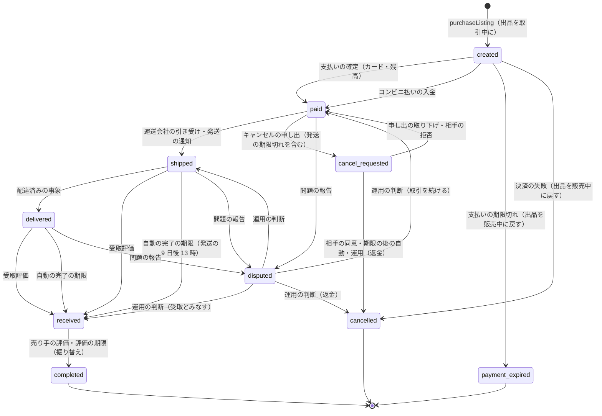

# ADR-0002: 取引を明示のステートマシンにし、購入を `purchaseListing` の 1 つの関数と 1 つのトランザクション（出品の条件つきの更新と、部分一意の索引）に集める。期限は DB の列と 1 分ごとの処理で動かし、紛争で止める

## Context

フリマの取引は、1 つの出品（一品）を 1 人の買い手に売り、支払い・発送・配達・受取評価・評価・売上金への振り替えまで、数日から数週間続く。次を守る（NFR-002、NFR-003、NFR-012）。

- 1 つの出品の進行中の取引は 0 か 1。人気の出品に 1 秒数千の購入が集まっても 1。
- 取引の価格は、買い手が購入の画面で見た価格と一致する。
- 期限（支払い、発送、受取評価の自動の完了、評価）は、時刻から 1 分以内に働き、紛争の間は止まる。

難しさは次のとおり。

- 購入の経路が複数ある（カード、コンビニ払い、売上金・ポイント）。
- 売り手は購入の直前に価格を変えうる（値下げ交渉の後の値下げ）。
- 決済の失敗・期限切れで取引が取り消され、出品が販売中に戻り、また買われる。
- 期限は日をまたぎ、デプロイ・障害・DB のフェイルオーバーを越えて働かなければならない。
- 運送会社・決済の提供者・運用者・買い手・売り手の操作が、同じ取引に同時に来る。

本家は、支払いの期限を購入日を含む 3 日目の 23:59:59、受取評価がなければ発送の通知の 9 日後の 13 時以降に自動で完了とする（[ヘルプの記事 61sell](https://help.jp.mercari.com/guide/articles/61sell/)、2026-10-10 に確認）。購入の守り方の内部は公開されていない（**未検証**）。

## Options

購入の守り方：

1. **DB の条件つきの更新と部分一意の索引を正本にし、Valkey の先着の印を前に置く**
2. Valkey の原子的な操作（Lua）を正本にし、DB へは後で書く
3. 出品ごとの待ち行列（SQS FIFO の出品の ID のグループ）で直列にする

期限：

- a. **取引の行の期限の列と、1 分ごとの期限の処理**
- b. 遅延のキュー（SQS の遅延、EventBridge Scheduler）に期限ごとの予定を置く
- c. プロセスのメモリーのタイマー

## Decision

1 と a を採用する。

### 購入（`purchaseListing`）

- 入力：`listing_id`、見た `price`、見た `listing_version`、支払いの方法、購入の試行の ID（`Idempotency-Key`）。
- 段：
  1. 同じ試行の ID の取引があれば、それを返す（冪等）。
  2. Valkey の `SET purchase:{listing_id} <attempt_id> NX PX 15000` を試す。取れなければ、Valkey の出品の写しで状態を見て、すぐに `409 sold_out` か `409 in_progress` を返す。Valkey が使えなければ、出品ごとの同時実行の上限（`transactions` のタスクの中のセマフォ、既定 4）を通して DB へ進む。
  3. 売上金・ポイントで払うときは、`ledger` に買い手の残高の引き当て（冪等キー `(purchase_attempt, <id>, reserve)`）を依頼する。足りなければ 402。
  4. core の 1 つのトランザクションで、`UPDATE listings SET status = 'trading', version = version + 1 WHERE id = $1 AND status = 'on_sale' AND version = $2 AND price = $3 RETURNING ...`。1 行なら `transactions` を挿入し、`transaction_events` と outbox（`transaction.created`）を書く。
  5. 0 行なら、出品を読み、価格・バージョンの違い（`409 price_changed` と新しい価格）か売り切れを返す。3 の引き当てを戻す。
- 部分一意の索引：`CREATE UNIQUE INDEX ON transactions (listing_id) WHERE state NOT IN ('cancelled', 'payment_expired')`。条件つきの更新を誤って外しても、二重の取引は挿入できない。
- Valkey の印は、取引の作成で消さず、期限（15 秒）で消える。印は正しさに関わらない。

> 2026-10-10 の注記：印は取引の作成では消さないが、取引の取り消し（`cancelled`・`payment_expired`）のコミットの後に、値が自分の試行の ID のときだけ消す形にした。15 秒を待つと、決済の失敗の後に 12 秒ほど誰も買えないため（[ADR-0026](0026-hot-listing-purchase-admission.md)）。Valkey の前に出品の写しを読み、販売中でなければ印を試さない。Valkey がないときの同時実行 4 は、`lock_timeout` 200ms と、`transactions` のタスクの最大 12（1 出品 48 件まで）と組にした。

### 状態

- 状態の遷移は `packages/transactions` の 1 つの遷移の関数 `transition(transaction_id, event, actor, expected_version)` だけが書く。行を `SELECT ... FOR UPDATE` で取り、決定表で遷移を決め、`transaction_events` に行（理由のコード、主体）を足し、outbox を書く。
- `cancelled`・`payment_expired` への遷移は、同じトランザクションで出品を `on_sale` に戻す（出品が `removed` なら戻さない）。`completed` への遷移で出品を `sold` にする。

> 2026-10-10 の注記：発送の後の取り消し（紛争の運用の判断）では、出品を `on_sale` でなく `paused` に戻す。品が売り手の手元にあるとは限らないため（[ADR-0027](0027-cancellation-rules-and-listing-restoration.md)）。出品の決定表 DT-LST-001 の行 7a で表す（[listings-and-photos.md](../architecture/listings-and-photos.md) の 4.2 節）。決定表 DT-TXN-001 は 38 行で確定した（[ADR-0025](0025-transaction-decision-table-and-deadline-pause.md)）。売り手の評価の期限（3 日 = 72 時間）は本システムの値で、本家は受取評価の翌日以降に自動で完了する（[ヘルプの記事 115](https://help.jp.mercari.com/guide/articles/115/)、2026-10-10 に確認。本家との意図した違い）。

- 配達済み（`delivered`）は受取評価の代わりにしない。受取評価は買い手の操作か、自動の完了の期限だけで起きる。
- お金は状態の遷移の outbox から `ledger` が動かす（[ADR-0003](0003-escrow-and-double-entry-ledger.md)）。`completed` は release、`cancelled` は refund の 1 回だけの仕訳になる。

### 期限

| 期限の列 | 設定する時 | 既定値 | 期限で起きること |
| --- | --- | --- | --- |
| `payment_due_at` | `created`（コンビニ払い） | 購入日を含む 3 日目の 23:59:59（本家に寄せる） | `payment_expired`。提供者の支払いの番号を取り消す |
| `payment_due_at` | `created`（カード） | 30 分（本システムの値） | 提供者に照会し、未確定なら `cancelled` |
| `ship_due_at` | `paid` | 売り手の選んだ発送までの日数の最終日の翌日の 23:59:59（本システムの値） | 買い手にキャンセルの申し出を許す。自動ではキャンセルしない |
| `cancel_response_due_at` | `cancel_requested` | 申し出から 2 日（本システムの値） | 発送の期限切れによる申し出なら `cancelled`。それ以外は運用の待ち行列へ |
| `auto_receive_at` | `shipped` | 発送の 9 日後の 13:00（本家に寄せる） | `received`（主体は `system`） |
| `seller_rating_due_at` | `received` | 受取評価から 3 日（本システムの値） | `completed`（売り手の評価なし） |

- 時刻は日本時間（`Asia/Tokyo`）で計算し、UTC で保存する。夏時間はないが、計算は 1 つの関数（`packages/transactions/deadlines`）に置く。
- `deadline-runner` が 1 分ごとに、`next_deadline_at <= now()` で、`on_hold = false` の取引を、索引で拾う（`FOR UPDATE SKIP LOCKED`、100 件ずつ）。各取引で遷移の関数を呼ぶ。期限の事象も、他の事象と同じ決定表を通る。
- **紛争と運用の保留**：`disputed` と、運用の保留（`on_hold = true`）の間は期限を止める。止めた時間（`paused_seconds`）を足して、再開の時に期限を延ばす。
- 期限の処理が止まっても、再開で溜まった取引をすべて拾う。期限の時刻から処理までの遅れを SLI にする（NFR-012）。

### 決定表（DT-TXN-001 の草案）

上から順に評価し、最初に一致した行を採用する。確定した表は transactions-and-state-machine の領域の spec に書く。

| # | 今の状態 | 事象 | 条件 | → 次の状態 |
| --- | --- | --- | --- | --- |
| 1 | 終わった状態（`completed`・`cancelled`・`payment_expired`） | どれでも | - | そのまま（何もしない、200 で今の状態を返す） |
| 2 | どれでも | どれでも | `expected_version` が違う | そのまま（409） |
| 3 | `disputed` | 期限 | - | そのまま（期限は止まっている） |
| 4 | `created` | 支払いの確定 | 提供者の照会で成功 | `paid` |
| 5 | `created` | 決済の失敗 | - | `cancelled` |
| 6 | `created` | 期限 | 提供者の照会で成功 | `paid` |
| 7 | `created` | 期限 | それ以外 | `payment_expired` |
| 8 | `paid` | 発送の通知・引き受け | 匿名の配送なら運送会社の引き受けがある | `shipped` |
| 9 | `paid`・`shipped`・`delivered` | 問題の報告 | - | `disputed` |
| 10 | `paid` | キャンセルの申し出 | - | `cancel_requested` |
| 11 | `cancel_requested` | 相手の同意 | - | `cancelled` |
| 12 | `cancel_requested` | 期限 | 発送の期限切れによる申し出 | `cancelled` |
| 13 | `shipped` | 配達済み | - | `delivered` |
| 14 | `shipped`・`delivered` | 受取評価 | 主体は買い手 | `received` |
| 15 | `shipped`・`delivered` | 期限 | `auto_receive_at` を過ぎた | `received` |
| 16 | `received` | 売り手の評価・期限 | - | `completed` |
| 17 | どれでも | 上のどれにも当たらない | - | そのまま（422、理由のコード） |

- 運送会社の古い事象（`delivered` の後の「輸送中」）は、`shipping` が順位で捨てるので、ここには来ない（[ADR-0006](0006-shipping-orchestration-via-carriers.md)）。
- 運用の介入（`disputed` からの判断）は、運用者の主体と理由のコードを持つ事象として、同じ表を通る。

### 他の案を選ばなかった理由

- **2（Valkey を正本）**：Valkey のフェイルオーバーで書き込みを失うと、二重に売る。DB へ後で書く間に取引の行がなく、支払いと結べない。
- **3（出品ごとの待ち行列）**：S3 で 3 億の出品にグループが散り、平時の購入にも待ち行列の遅れが乗る。人気の出品では列が伸び、負けた買い手に結果を返すのが遅い。
- **b（遅延のキュー）**：期限の延長（紛争の停止）と取り消しのたびに予定を作り直す。予定と DB の食い違いの照合が別に要る。SQS の遅延は 15 分までで、日の単位の期限に使えない。
- **c（メモリー）**：デプロイと障害で失う。

## Consequences

- 良くなること：
  - 二重の販売を、DB の条件つきの更新と一意の索引の 2 段で止められる。経路の数に依らない。
  - 期限が DB にあり、障害・デプロイを越えて働く。紛争の停止と延長が 1 つの列の更新で済む。
  - 状態の遷移が 1 つの関数と決定表に集まり、表駆動テストで全行を試せる。
- 引き受けるコスト：
  - 人気の出品で、決済の失敗の後に出品が販売中に戻ると、もう一度取り合いになる。戻すときに出品のバージョンを上げ、古い画面からの購入を 409 にする。
  - `deadline-runner` の索引と 1 分ごとの処理が、S3 で 1 分あたり数千件を拾う。分け方は capacity の領域で決める。
  - core を S3 で分けるとき、出品と取引を同じ分け先に置く必要がある（分け方の鍵は `listing_id`）。

## Confirmation

- 性質ベーステスト：任意の数の並行の購入（価格の変更、出品の停止、決済の失敗、期限、取り消しを混ぜる）で、1 つの出品の進行中の取引は常に 0 か 1。取引の価格は、購入の時の出品の価格と一致する（[quality.md](../quality.md) の 2.2.1 節 A）。
- 表駆動テスト：DT-TXN-001 の全行。
- 仮想の時計の試験：期限の全種類、日の境、13 時の境、紛争の停止と再開、期限の処理の停止と再開（同 C）。
- 本番：出品と取引の照合（5 分ごと）で二重の販売 0、期限の遅れの SLI（[runbooks/](../runbooks/README.md)）。
