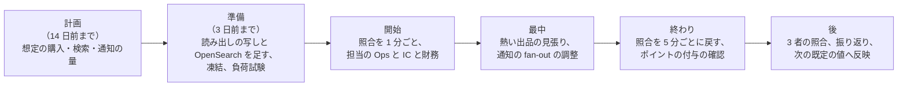

# Runbooks: Mercari

Ops が持つ運用の文書。品質の判定基準は [quality.md](../quality.md) の 4 節にある。SLI の計測とアラートの条件の実装は observability の領域（まだない）で書く。**SLO の値とアラートの一覧の正本はこの文書** で、値を変えるときは、この文書を先に変える。

この題材は、利用者どうしのお金と品を運ぶ。止まれば、売れるはずの品が売れず、預かったお金が動かない。二重の販売と、お金の誤りは、止まるより悪い。人気の出品と大型の企画の日の運用は 5 節にまとめる。

## 1. SLI と SLO

| SLI | 良いイベント（数える場所） | SLO（S1） | 許容範囲を外れたときの扱い | 品質の判定に使う |
| --- | --- | --- | --- | --- |
| 購入と取引の可用性 | 購入・取引の操作の要求のうち、5xx・時間切れでないもの（売り切れ・価格の違い・残高の不足の 409・402 は除く）（ALB、`transactions`） | **月間 99.95%**（NFR-007） | 1 時間のバーンレート 14.4 倍・6 時間で 6 倍で呼び出し、3 日で 1 倍でチケット。エラーバジェットを使い切ったら、修正以外のデプロイを止める | |
| 購入の速さ | `purchaseListing` が 800ms 以内（提供者の時間を除く） | **p99 800ms**（NFR-002） | p99 が 2 秒を 5 分超えたら呼び出し | |
| 負けの応答の速さ | 人気の出品で負けた要求が 200ms 以内 | **p99 200ms**（NFR-002） | p99 が 1 秒を 5 分超えたらチケット | |
| 検索と出品の可用性 | 検索・出品の要求のうち、5xx・時間切れでないもの | **月間 99.9%**（NFR-007） | バーンレート | |
| 検索の速さ | 検索が 200ms 以内 | **p95 200ms**（NFR-010） | p95 が 500ms を 15 分超えたらチケット、1 秒で呼び出し | |
| 出品から検索まで | 見張りの出品の公開から検索に出るまで | **p95 10 秒・p99 60 秒**（NFR-001） | p99 が 5 分を超えたら呼び出し | ○ |
| 二重の販売 | 出品と取引の照合の不一致 | **0**（NFR-003、K1） | 1 件で呼び出し（SEV1 の候補）。その出品の購入を止める | ○ |
| 振り替えの一回性 | 取引と台帳の照合（重複、両方、15 分超の欠け） | **0**（NFR-005、K3） | 重複・両方は 1 件で呼び出し（SEV1 の候補）。欠けは 1 件でチケット、10 件で呼び出し | ○ |
| 台帳の不変条件 | 釣り合い、和 0、決着した預かりの 0、残高の行と仕訳の和 | **0**（NFR-004、K2） | 1 件で呼び出し（SEV1 の候補）。振込を止める | ○ |
| 3 者の照合 | 3 営業日を過ぎた説明のつかない差 | **0 円**（NFR-004） | 1 件でチケット（財務） | ○ |
| 売上金の反映 | 取引の完了から売上金の仕訳まで 1 分以内 | **p99 1 分**（NFR-006） | p99 が 10 分を超えたら呼び出し | |
| 期限の遅れ | 期限の時刻から遷移まで 1 分以内 | **p99 1 分**（NFR-012、K8） | p99 が 10 分を超えたら呼び出し | ○ |
| 配送の状態の反映 | 運送会社の事象から取引の状態まで 60 秒以内 | **p95 60 秒**（NFR-013） | p95 が 10 分を 30 分超えたらチケット。運送会社ごとに見る | |
| 取引の通知 | 事象からプッシュの依頼まで 10 秒以内 | **p95 10 秒**（NFR-008） | p95 が 1 分を 10 分超えたらチケット | |
| 値下げ・新着の通知 | 事象から通知の依頼まで 5 分以内 | **p95 5 分**（NFR-008） | p95 が 30 分を超えたらチケット | |
| 措置の反映 | 措置から検索・通知・購入の拒否まで 60 秒以内 | **p99 60 秒**（NFR-016） | p99 が 5 分を超えたら呼び出し | ○ |
| 見える範囲 | 見える範囲の監査の不一致 | **0**（NFR-014、K7） | 1 件で呼び出し（SEV1 の候補） | ○ |
| 審査の待ち時間 | 通報・保留から判定まで | **p95 24 時間（偽ブランドの疑いの高いもの 4 時間）**（NFR-009） | 待ち行列の古さが基準の 2 倍でチケット | ○ |

- SLO の窓は 30 日の移動の窓（報告は暦の月）。エラーバジェットを使い切ったら、信頼性の作業を機能より先にする。デプロイの前に残りを確かめる。
- **数えないもの**：売り切れ、価格の違い、残高の不足、提供者の拒否（カードの拒否）、ボットとして拒んだ要求、速さの上限の 429。ただし率の急な上がりは、本システムの食い違いの兆候として見る。見張りの利用者は SLO の計算から除き、別に見る。
- 「品質の判定に使う」に○がある指標は、QA が品質の判定基準に使う（[quality.md](../quality.md) の 4.1 節）。定義を変えるときは QA と合意する。
- 復旧の目標：AZ の障害は RPO 0・RTO 5 分。リージョンの障害は RPO 1 分・RTO 1 時間（NFR-011）。
- 本家のサービスの SLA は、公式の資料で確かめなかった（**未検証**）。

## 2. 上限と容量のパラメーター

値の正本は、各 ADR と領域の文書（まだないものは [architecture/README.md](../architecture/README.md) の 6 節の決定）にある。Ops が運用で変えてよいのは、下の「運用で変えるもの」だけで、変えたら記録を残す。

| 対象 | 値 | 正本 | 運用で変えるもの |
| --- | --- | --- | --- |
| 購入の先着の印 | 15 秒 | [ADR-0002](../decisions/0002-transaction-state-machine-and-single-purchase.md) | — |
| 出品ごとの購入の同時実行（Valkey の停止の時） | 4 | 同上（`hot-listing-purchase-poc` で見直す） | — |
| 期限の既定値 | 支払い（コンビニ）3 日目の 23:59:59、自動の完了 発送の 9 日後 13:00、評価 3 日、キャンセルの応答 2 日 | 同上 | — |
| 期限の処理 | 1 分ごと、100 件ずつ | 同上 | 並列の数 |
| 取引と台帳の照合 | 5 分ごと。欠けは 15 分でアラート | [ADR-0003](../decisions/0003-escrow-and-double-entry-ledger.md) | 大型の企画の日は 1 分ごと |
| 手数料の表、送料の表 | バージョンの付いた設定（既定 10%） | [ADR-0003](../decisions/0003-escrow-and-double-entry-ledger.md)、[ADR-0006](../decisions/0006-shipping-orchestration-via-carriers.md) | — （変更は PM・財務の承認） |
| 売上金の期限・失効・残高への移し替え・ポイントへの交換 | 本番は無効 | [ADR-0004](../decisions/0004-proceeds-model-under-payment-services-act.md) | — （`legal.*`。法務・財務の承認） |
| 振込の手数料 | 1 回 200 円 | payouts-and-points の領域 | — |
| 提供者の照会の予定 | 5 秒、30 秒、2 分、5 分、30 分ごとに 24 時間 | [ADR-0005](../decisions/0005-payments-via-providers-and-capture-at-purchase.md) | — |
| 運送会社の照会 | 受け付け・引き受けの後 6 時間ごと | [ADR-0006](../decisions/0006-shipping-orchestration-via-carriers.md) | 運送会社ごとの間隔（運送会社の上限の中で） |
| 非同期の分類器 | p95 60 秒 | [ADR-0009](../decisions/0009-trust-and-safety-pipeline-boundary.md) | 公開の前に待つ規則の対象（T&S の責任者と合意） |
| 保存した検索 | 1 人 30 件、まとめの窓 15 分 | saved-searches-and-alerts の領域 | `ops.saved_search_digest_minutes`（伸ばすだけ） |
| 値下げの通知 | 1 出品 24 時間に 1 回 | notifications の領域 | — |
| 購入の受け付け | — | — | `ops.purchase_enabled`（全体・カテゴリ・出品ごとに止めるだけ） |
| 振込の実行 | — | — | `ops.payouts_enabled`（止めるだけ） |
| 運送会社の受け付け | — | — | `ops.carrier_enabled.<carrier>`（運送会社ごとに止めるだけ。止めると、その配送の方法を出品・発送の画面から隠す） |
| 通知の送信 | — | — | `ops.fanout_enabled`（値下げ・新着の fan-out だけを止める。取引の通知は止めない） |

## 3. リリースとロールバック

- **デプロイとリリースを分ける。** デプロイは Ops が承認し、リリース（フラグを広げる）は PM が判断する。未完成の振る舞いは `release.*` のフラグの裏に置く。`release.*` は 100% の後 30 日で消す。
- **お金・取引の状態・期限の規則をフラグにしない。** 取引の遷移、期限の計算、仕訳の型、手数料の計算の変更は、コードのバージョンとして出し、本番の照合の指標で見る。
- **`legal.*` は別の手順。** `legal.*` の値の変更は、法務・財務の承認の記録を添えて、平日の昼に Ops が適用する。適用の前後で台帳の照合を回す。
- **段階のデプロイ**：検証 → 見張りの利用者だけ（`canary` の経路）→ 本番の 5% → 25% → 100%。各段で 30 分、自動のロールバックの条件を見る。
- **自動のロールバックの条件**：購入の 5xx、購入の p99、出品と取引の照合の不一致、取引と台帳の照合の重複・両方、台帳の不変条件、期限の遅れ、措置の反映の遅れ、検索の 5xx。
- **デプロイの順**：マイグレーション（広げる段だけ）→ Worker（`relay`、`deadline-runner`、`reconcilers`、消費者）→ ドメインのサービス（`ledger` は最後に単独で）→ `app-api`・`ops-api` → Web の資産。アプリは週 1 回の列車でストアに出す（delivery の領域）。
- **ロールバック**：まずフラグで戻す。次に 1 つ前のイメージ（マイグレーションは広げる段だけなので、前のバージョンが今の DB で動く）。縮める段の後は前へ戻さない。
- **ML のモデルと T&S の規則**：影の評価の後に、出品の 5% → 100% で出す。戻しは 1 つ前のモデル・規則のバージョンへの切り替え（デプロイなし）。
- 本番へのデプロイは Ops が承認する（作成者と別の人）。

### 3.1 デプロイの時間帯と凍結

| 対象 | 時間帯 | 凍結（修正だけ） |
| --- | --- | --- |
| 検索、出品、メッセージ、通知、アプリの資産 | 平日 10〜17 時 | 金曜 15 時以降、日本の祝日の前日、年末年始、エラーバジェットを使い切っている間 |
| 取引、決済、台帳、振込、配送 | 平日 10〜15 時 | 同上。加えて、予定した大型の企画の日の前後 48 時間、月末と月初の 2 営業日（振込と照合の山） |
| T&S の規則、ML のモデル | 平日 10〜16 時 | 同上。大型の企画の日の前後 24 時間 |
| Terraform（ネットワーク、DB、OpenSearch） | 平日 10〜16 時。Ops の承認 | 同上 |

- 上の時間帯と凍結は本システムの既定である。本家の運用の値ではない。

## 4. アラートと手順

個別の手順は、まだない。各 Epic の実装に合わせて [templates/runbook.md](../../../../docs/templates/runbook.md) から作る。「作る Story」の列は、そのアラートの計測と手順を作る [roadmap.md](../roadmap.md) の Story である。手順の文書は、その Story の完了の条件に含める（E18 の `runbooks-e18` でまとめて確かめる）。

| アラート（重さ） | 手順（予定のファイル名） | 作る Story |
| --- | --- | --- |
| 購入の SLO のバーンレート、購入の遅れ（page） | `purchase-degraded.md`（カテゴリ・出品ごとの購入の停止を含む） | `purchase-listing`、`slo-dashboards-alerts` |
| 二重の販売（page、SEV1 の候補） | `double-sale.md`（出品の購入の停止、片方の取引の取り消しと返金の判断、利用者への連絡） | `listing-transaction-reconciler` |
| 振り替えの重複・両方（page、SEV1 の候補）、欠け | `ledger-settlement-mismatch.md`（振込の停止、打ち消しの仕訳の承認の手順） | `txn-ledger-reconciler` |
| 台帳の不変条件の違反（page、SEV1 の候補） | `ledger-invariant-breach.md`（振込と売上金での購入の停止） | `ledger-core` |
| 3 者の照合の差（ticket） | `three-way-reconciliation.md`（仮勘定の確かめ、財務への引き継ぎ） | `three-way-reconciliation` |
| 期限の遅れ（page） | `deadline-runner-lag.md`（期限の処理の再開、溜まった取引の確認） | `transaction-deadlines` |
| 決済の提供者の障害（失敗の率・時間切れの急増。page） | `payment-provider-outage.md`（手段の一時の非表示、照会の確認） | `payment-adapter-contract` |
| 運送会社の障害・状態の滞り | `carrier-outage.md`（配送の方法の一時の非表示、照会の間隔、期限の延長の判断） | `tracking-webhooks-and-polling` |
| 振込の失敗の急増、銀行の障害 | `payout-failures.md` | `payouts` |
| 措置の反映の遅れ、検索の索引の遅れ（page） | `moderation-propagation-lag.md`（索引の優先の待ち行列の確認、作り直し） | `moderation-actions`、`search-index-and-indexer` |
| 見える範囲・住所の漏れの疑い（page、SEV1 の候補） | `privacy-leak-response.md`（経路の停止、影響の範囲、漏えい等の報告の判断は法務：L5） | `address-vault`、`listing-visible-snapshot` |
| 偽ブランド・禁止の品の急増、審査の待ち行列の滞り | `ts-surge.md`（公開の前に待つ規則の対象を広げる、審査の人の追加） | `review-queues-and-console` |
| 乗っ取り・不正の兆しの急増 | `fraud-surge.md`（再確認の強化、振込の保留の規則） | `fraud-signals` |
| 通知の遅れ・失敗の増加 | `notification-delivery.md`（fan-out の停止を含む） | `notifier-and-preferences` |
| Aurora Global Database の遅延（`AuroraGlobalDBRPOLag` 10 秒が 5 分。page）、リージョンの障害 | `disaster-recovery.md` | `osaka-warm-standby`、`dr-failover-drill` |
| 開示の請求・捜査機関からの照会 | `legal-request.md`（法務の L6・L7 の後に確定） | `disclosure-requests`、`law-enforcement-requests` |
| デプロイ中の自動ロールバック | `deploy-and-rollback.md` | `ci-pipeline-baseline` |

- すべてのアラートは、対応する手順の URL を注釈に持つ（CI で検査する）。
- 手順を作るまでは、`incident-response.md`（E1 で最初に作る）の一般の手順で対応する。利用者への障害の知らせは、お知らせと状況のページで行う（文言は法務の確認の後）。
- お金の障害（二重の販売、振り替え、台帳）は、財務の担当を必ず呼ぶ。手の仕訳は、財務の承認と 2 人の確認の後に、打ち消しの仕訳だけで行う。

## 5. 人気の出品と大型の企画の日の運用

### 5.1 人気の出品

限定品・人気のブランドの出品は、出た直後の 1 秒に購入が集まる。予定はできないので、自動で見つけて守る。

- **見つけ方**：出品の詳細の閲覧が 1 分 1,000 を超えた出品、または購入の先着の印の取り合い（`SET NX` の失敗）が 1 秒 100 を超えた出品を「熱い出品」として記録する。
- **自動の守り**：熱い出品の Valkey の出品の写しの更新を優先し、負けの応答を写しから返す。DB の接続の使用率が 70% を超えたら、熱い出品の購入の要求を出品ごとの同時実行の上限で絞る（既定 4）。
- **見るもの**：購入の p99、負けの応答の p99、DB の接続の使用率と行のロックの待ち、出品と取引の照合（熱い出品は 1 分ごと）、決済の失敗の後の出品の戻しの数。
- **止める条件**：出品と取引の照合の不一致が 1 件でも出たら、`ops.purchase_enabled` でその出品の購入を止め、`double-sale.md` に従う。
- **転売・ボット**：同じ端末・電話番号・配送先からの連打、自動の購入の兆しは、WAF の規則と T&S の規則（`fraud-signals`）で絞る。

### 5.2 大型の企画の日

ポイントの還元などの大型の企画は、予定して運用する。

| いつ | 作業 | 持ち主 |
| --- | --- | --- |
| 14 日前まで | 企画の内容（期間、ポイントの付与の規則、対象のカテゴリ）と、想定の量（購入、検索、通知）を PM から受け取る。ポイントの付与の規則は法務の L4 の確認を経ていること | PM、Ops |
| 3 日前まで | Aurora の読み出しの写し、OpenSearch のデータノード、Fargate の最小の数を足す。運送会社と決済の提供者に量を知らせる。縮めた規模の負荷試験（quality.md の 2.2.1 節 H の大型の企画の日の場面） | Ops |
| 前日 | 凍結（3.1 節）。見張りの購入。ダッシュボードの確認。担当の Ops・IC・財務を決める | Ops |
| 開始 | 照合（出品と取引、取引と台帳）を 1 分ごとにする。値下げ・新着の fan-out の量を見る | Ops |
| 最中 | 熱い出品の見張り（5.1 節）。通知の遅れが p95 30 分を超えたら、`ops.saved_search_digest_minutes` を伸ばす。取引の通知は止めない | Ops |
| 終わり | 照合を 5 分ごとに戻す。ポイントの付与の仕訳の数と、企画の規則の計算を照らす | Ops、財務 |
| 後（3 営業日） | 3 者の照合。振り返り（購入の最大、熱い出品の数、SLI の消費、通知の量）。次の企画の既定の値へ反映 | Ops、財務、PM |

### 5.3 止める条件

次のどれかで、Ops は購入（全体・カテゴリ・出品）か振込を止め、利用者に知らせる。

- 出品と取引の照合の不一致（二重の販売の疑い）。
- 取引と台帳の照合の重複・両方、または台帳の不変条件の違反。
- 決済の提供者の失敗が続き、照会でも結果が確かめられない取引が増え続ける。

## 6. 定期作業

| 作業 | 頻度 | 持ち主 |
| --- | --- | --- |
| 出品と取引・取引と台帳の照合の結果の確認 | 毎日（自動は 5 分ごと） | Ops |
| 3 者の照合と仮勘定の確認 | 毎営業日 | 財務、Ops |
| 期限の遅れの分布の確認 | 毎週 | Ops |
| 審査の待ち行列の古さと、措置の取り消しの率の確認 | 毎週 | T&S、QA |
| 分類器の評価の集まりの結果と、点の分布の変化の確認 | 毎週 | T&S、QA |
| 運送会社ごとの状態の滞りの確認 | 毎週 | Ops |
| 利用者の資金の種類ごとの合計の確認（保全の基準は法務の L1 の後） | 毎日 | 財務 |
| 依存・OpenSearch・ML の枠組みのセキュリティの更新の確認 | 毎週 | Ops、Dev |
| DR の訓練（大阪への切り替え） | 半年ごと | Ops |
| 費用の見直し（取引あたり・MAU あたりの原価、索引の大きさ、写真の保管） | 毎月 | Ops、PM |
