# Data model: Notion

データモデルの入口。**全テーブルの定義の正は、この文書と [data-model/](data-model/) の各ファイルにある。** 領域ごとの文書（[block-model.md](block-model.md) など）は振る舞いと理由を書き、表の列・制約・索引はここに集める。両者が食い違ったら作業を止め、両方を直す。実装の変更（`changes/`）でマイグレーションを書くときは、ここを先に直す。

この文書には規約、全体の ER 図、テーブルの一覧、横断の不変条件を置く。テーブルごとの定義（列、型、NULL、既定、制約、索引と用途、テナント、保持、規模）と領域ごとの ER 図は、次のファイルにある。

| ファイル | 領域 | 主なテーブル |
| --- | --- | --- |
| [data-model/global.md](data-model/global.md) | アカウント、ワークスペース、振り分け | `accounts`、`workspaces`、`shard_map`、`public_integrations`、`mcp_tokens` |
| [data-model/blocks.md](data-model/blocks.md) | ブロック・ページ・中身 | `blocks`、`page_snapshots`、`files` |
| [data-model/collaboration.md](data-model/collaboration.md) | 共同編集（トランザクション、ページの seq、CRDT） | `page_seqs`、`page_ops`、`block_text_states`、`text_slices`、`device_cursors`、`sync_conflicts` |
| [data-model/databases.md](data-model/databases.md) | データベース（データソース、ビュー、索引、リレーション、ロールアップ） | `data_sources`、`views`、`dbx_rows`、`dbx_values`、`relation_edges` |
| [data-model/permissions.md](data-model/permissions.md) | メンバー・権限・共有 | `members`、`teamspaces`、`page_acls`、`page_acl_entries`、`workspace_acl_versions`、`published_sites` |
| [data-model/comments-and-notifications.md](data-model/comments-and-notifications.md) | コメント・メンション・通知 | `discussions`、`comments`、`reminders`、`inbox_items` |
| [data-model/api-and-integrations.md](data-model/api-and-integrations.md) | 公開 API・連携・Webhook・MCP・インポートとエクスポート | `integrations`、`api_tokens`、`webhook_deliveries`、`mcp_grants` |
| [data-model/search.md](data-model/search.md) | 検索の索引（OpenSearch） | 文書 `pages`、権限キー |
| [data-model/operations.md](data-model/operations.md) | outbox・削除・監査・濫用・上限・マイグレーション | `outbox`、`deletion_jobs`、`audit_events`、`relay_leases` |
| [data-model/stores.md](data-model/stores.md) | DB の外（Valkey、S3、データレイク、プロセスの中のキャッシュ） | チャンネル、キー、バケット |
| [data-model/client.md](data-model/client.md) | クライアントのローカルの保存（SQLite、OPFS） | `records`、`transaction_queue`、`offline_pages` |

前提の決定：

- すべてはブロック（[ADR-0002](../decisions/0002-everything-is-a-block.md)）
- ワークスペースで RLS と論理シャード（[ADR-0003](../decisions/0003-workspace-sharding.md)）、論理シャードは PostgreSQL のスキーマ（[ADR-0027](../decisions/0027-shard-router.md)）
- 変更はトランザクションとページごとの `seq`（[ADR-0005](../decisions/0005-transactions-as-unit-of-change.md)）
- テナントの中のデータは `member_id` を参照し、`account_id` を参照しない（[ADR-0021](../decisions/0021-accounts-members-guests-and-teamspaces.md)）
- 権限は ACL を持つ最も近い祖先から決め、`acl_version` でキャッシュする（[ADR-0004](../decisions/0004-inherited-page-permissions.md)、[ADR-0018](../decisions/0018-permission-levels-and-inheritance.md)、[ADR-0019](../decisions/0019-workspace-acl-version-cache.md)）

## 1. 規約

### 1.1 名前

**テーブル名は、複数形の snake_case にする（2026-09-27 に決定）**（例：`blocks`、`members`、`dbx_values`）。この規約は、サーバー（`global`・`shardNNN`・`cluster_local`）とクライアント（[data-model/client.md](data-model/client.md)）の全テーブルに当てる。

- 集合そのものを表す名詞は、そのままにする：`outbox`、`shard_map`、`search_cluster_map`、`migration_ledger`、`transaction_queue`、`meta`。
- 数えない名詞は、そのままにする：`page_general_access`。
- テーブル名でない識別子は、単数のままにする：`parent_type` の値（`block`、`data_source`）、レコードの種類（`record_type`）、イベントの名前（`data_source.created`）、API のオブジェクトの名前。
- 本家の表の名前（`block`、`collection`、`offline_page` など）を出典として書くときは、本家の名前のまま書く。本家の内部の名前を、このシステムの識別子に使わない（[リポジトリ共通の ADR-0006](../../../../docs/decisions/0006-brand-neutral-identifiers.md)）。
- accepted の ADR の本文に残る単数の名前（`dbx_row`、`relation_edge`、`record` など）は、この規約の複数形と読む。各 ADR に注記を付けた。

列の名前：

| 形 | 使い方 | 例 |
| --- | --- | --- |
| `id` | その表の主キーの ID | `blocks.id` |
| `{名詞}_id` | 他の表の ID | `page_id`、`member_id` |
| `{動詞}_at` | 時刻（timestamptz） | `created_at`、`trashed_at`、`revoked_at` |
| `{動詞}_by` | その操作をしたメンバー（`members.id`） | `created_by`、`granted_by` |
| `{名詞}_ids` | ID の配列（uuid[]） | `private_page_ids`、`actor_ids` |
| `kind` / `type` / `state` / `status` | 列挙。text と CHECK で表す（PostgreSQL の enum 型は使わない。値の追加をマイグレーションの expand だけで済ませるため） | `members.kind`、`deletion_jobs.state` |
| `{名詞}_hash` / `{名詞}_encrypted` | 秘密のハッシュ、KMS で暗号化した値（1.8 節） | `secret_hash`、`verification_token_encrypted` |

### 1.2 ID と論理シャード

- **ID は UUIDv7**（[block-model.md](block-model.md) の 6 節）。UUIDv7 の時刻の部分は、並びや作成時刻の判断に使わない（`created_at` を使う）。
- **クライアントが作る ID**：トランザクションの操作で作るレコード。`blocks`、`data_sources`、`views`、`discussions`、`comments`、`tx_id`、`device_id`。オフラインで作り、確定の前から参照するため。ワークスペースの中で衝突したら、トランザクションを拒否する。
- **サーバーが作る ID**：それ以外のすべて。**`workspaces.id` は必ずサーバーが作る**（偏った ID で 1 つのシャードに寄せられるのを防ぐ。[ADR-0027](../decisions/0027-shard-router.md)）。
- **論理シャード**：`logical_shard = (workspace_id の末尾 64 ビットを符号なし整数とみなした値) mod 480`。スキーマ名は `shard` と 3 桁の番号（`shard000`〜`shard479`）。この関数と 480 は変えない。作成時に計算した値を `global.workspaces.logical_shard` に控え、ルーターが照合する。
- **物理クラスタ**：`global.shard_map (region, logical_shard) → cluster_id, state` で引く（[data-model/global.md](data-model/global.md)）。
- **連番**：ページの中の `seq`（`page_seqs`）と、端末ごとの `tx_counter` だけを持つ。DB のシーケンスは `outbox.id` だけに使う（論理レプリケーションで複製されないため。[ADR-0028](../decisions/0028-zero-downtime-resharding.md)）。

### 1.3 置き場所

| 置き場所 | 何を置くか | 規則 |
| --- | --- | --- |
| Aurora の `global` スキーマ | ワークスペースをまたぐものだけ：アカウントと認証、ワークスペースの一覧と所在、所属の目録、シャードの割り当て、マイグレーションの台帳、プラン、公開の連携の定義、OAuth の認可コード、MCP のトークン、アカウントの通知の設定、ワークスペースに属さない監査 | RLS なし。専用のモジュールだけが触れる。S2 で独立したクラスタに移す |
| Aurora の `shard000`〜`shard479` | ブロックと、ブロックから外部キーでたどれるもののすべて（本家と同じ方針。[Herding elephants](https://www.notion.com/blog/sharding-postgres-at-notion)） | 全スキーマに同じテーブルの一式。RLS あり |
| Aurora の `cluster_local` スキーマ | 物理クラスタに属するもの：Relay のリース（`relay_leases`） | 物理クラスタごと。論理レプリケーションの対象外 |
| Valkey | 配信のバス（pub/sub）、在席、クエリの結果のキャッシュ、レート制限 | 失ってよい。[data-model/stores.md](data-model/stores.md) |
| S3 | ファイル、スナップショットの本体、インポート・エクスポート、監査のアーカイブ、データレイク | キーを `ws/{workspace_id}/` で始める。[data-model/stores.md](data-model/stores.md) |
| OpenSearch | ページ単位の検索の文書（別名 `pages`） | 作り直せる写し。[data-model/search.md](data-model/search.md) |
| クライアントの SQLite（OPFS） | レコードの写し、未確定のトランザクション、オフラインのページ | アカウントごとのファイル。[data-model/client.md](data-model/client.md) |

- `global` からシャードへ、シャードから `global` へは外部キーを張らない。ID で論理的に参照する。
- 1 つのトランザクションは 1 つのワークスペース、つまり 1 つのシャードで閉じる。`global` とシャードの両方を書く処理（所属の目録、OAuth のトークン）は、片方を正本にし、もう片方を outbox か手順の順序で合わせる（[data-model/global.md](data-model/global.md)）。

S1 の配置：

```
Aurora の物理クラスタ（S1 は 1 つ）
 ├─ global                       … ワークスペースをまたぐもの（RLS なし。専用のモジュールだけが触れる）
 ├─ cluster_local                … この物理クラスタの Relay のリース
 └─ shard000 〜 shard479         … 論理シャード。同じテーブルの一式（RLS あり）
```

### 1.4 テナントと RLS、DB ロール

シャードのテーブルの規則（Slack の [ADR-0009](../../../slack/docs/decisions/0009-pooled-tenancy-with-rls.md) と同じ）：

- 全テーブルが `workspace_id uuid NOT NULL` を持ち、主キー・外部キーは `workspace_id` を含む複合キーにする。別のワークスペースの行を参照する外部キーは作れない。
- `ENABLE`・`FORCE ROW LEVEL SECURITY` とポリシーを、テーブルの作成と同じマイグレーションで付ける。

```sql
ALTER TABLE shard042.blocks ENABLE ROW LEVEL SECURITY;
ALTER TABLE shard042.blocks FORCE ROW LEVEL SECURITY;
CREATE POLICY tenant ON shard042.blocks TO app
  USING (workspace_id = current_setting('app.workspace_id')::uuid)
  WITH CHECK (workspace_id = current_setting('app.workspace_id')::uuid);
```

- 索引は `workspace_id` を先頭に置く。例外は下の `sweeper` と `relay` が使う索引と、`dbx_values` の GIN（`data_source_id` を先頭）だけ。
- 論理レプリケーション（再シャーディング、CDC、リージョンの移動）のため、全テーブルに主キーを持たせる。主キーに `workspace_id` を含めるので、行フィルタのレプリカ識別子の条件も満たす（[infrastructure.md](infrastructure.md) の 11 節）。

DB ロール：

| ロール | 使う人 | 権限 |
| --- | --- | --- |
| `migrator` | マイグレーション | 所有者。`schema_migrations` を読み書きする |
| `app` | API・Worker・MCP・公開の描画 | RLS の対象。`BYPASSRLS` を持たない。既定の `search_path` は空。`audit_events`・`platform_audit_events` には `INSERT` だけ |
| `relay` | Relay | `outbox` の読み取りと `cluster_local.relay_leases` の読み書きだけ。`outbox` のポリシーは `relay` に全行を許す |
| `sweeper` | 期限で拾う Worker と運用の道具（2026-09-28 に追加） | 次の表と索引だけを、ワークスペースをまたいで読み、`state` を更新する：`reminders`、`notification_pending_emails`、`webhook_deliveries`、`deletion_jobs`、`abuse_reports`、期限切れの掃除（`page_acl_entries`・`idempotency_keys`・`sync_conflicts` など）。中身の処理は、拾った `workspace_id` でルーターを通し、`app` で行う |
| `replicator` | 再シャーディング、CDC | 論理レプリケーション |

- `sweeper` のポリシーは、対象の表にだけ `USING (true)` を付ける。ブロック・コメントなどの中身の表には付けない。
- `schema_migrations` はテナントのデータではないので `workspace_id` と RLS を持たない。`app` からは見えない。

### 1.5 時刻

- 時刻はすべて `timestamptz`（UTC で保存）で、サーバーの時刻にする。クライアントの時刻は信用しない（オフラインの編集で狂いうる）。
- クライアントの時刻を残すときは `client_` を付けて分ける（`page_ops.client_created_at`）。並びと判断には使わない。
- 並びの正はページの `seq`（`page_ops.committed_at` は表示用）。
- 利用者のタイムゾーンは IANA の名前で持つ（`accounts.time_zone`、`reminders.tz`）。
- 行の作成・更新は `created_at`・`updated_at`（と `created_by`・`updated_by`）。追記だけの表（`audit_events`、`page_ops`）は `occurred_at`・`committed_at` を 1 つだけ持つ。

### 1.6 論理削除とゴミ箱

| 表 | 論理削除の形 | 物理削除 |
| --- | --- | --- |
| `blocks`（ページ） | ゴミ箱の根に `trashed_at`（30 日）→ `purged_at`（30 日、運用者だけが戻せる） | `deletion_jobs` の `page_purge` が部分木と関連の行（スナップショット、操作のログ、ファイル、コメント、通知、索引）を消す。バックアップに最長 35 日（[ADR-0022](../decisions/0022-trash-history-and-deletion-retention.md)） |
| `blocks`（ページ以外） | `alive = false` | 履歴の日数の後に日次の Worker が消す |
| `data_sources`・`views` | `alive = false` | 親のブロックの物理削除と一緒 |
| `comments` | `deleted_at`（本文を消す） | ページの物理削除と一緒 |
| トークン・同意・招待 | `revoked_at`、`expires_at` | 30 日後に消す |
| `members` | `deactivated_at`（無効化）、`anonymized_at`（アカウントの削除） | ワークスペースの削除と一緒。作成者などの参照を壊さないため、行は残す |
| `workspaces`（global） | `status = pending_deletion`（30 日の猶予） | `deletion_jobs` の `workspace_delete` がシャードの行を `workspace_id` で消し、S3 のプレフィックスと検索の文書を消す |

- ゴミ箱の根の子孫は行を書き換えない。祖先の鎖に `trashed_at` のあるページがあれば、ゴミ箱の中とみなす。
- 外部キーの `ON DELETE CASCADE` は、ページの物理削除で子の表（`page_snapshots`、`discussions` など）を消すためだけに使う。論理削除では何も消さない。

### 1.7 主キー・外部キー・パーティション

- 主キーは `(workspace_id, id)` か、`workspace_id` を先頭にした自然なキー（`(workspace_id, page_id, principal)` など）。
- 外部キーは、シャードの中で `workspace_id` を含めて張る。張らないのは次の場合だけで、それぞれの表に理由を書く：配列（`blocks.content`）、種類で参照先が変わる列（`blocks.parent_id`）、`global` への参照、パーティションの表、物理削除の順序を Worker が決める列。
- 時間でパーティションを切る表と粒度（既定案。E8 の負荷試験で確かめる）：

| 表 | 鍵 | 粒度 | 捨て方 |
| --- | --- | --- | --- |
| `page_ops` | `committed_at` | 週 | 30 日を過ぎたら `DROP`（スナップショットに含まれることを確かめてから） |
| `outbox` | `created_at` | 日 | 送り終えて 2 日たったら `DROP` |
| `sync_conflicts` | `created_at` | 週 | 30 日で `DROP` |
| `webhook_deliveries` | `created_at` | 週 | 30 日で `DROP` |
| `inbox_items` | `created_at` | 月 | 180 日で `DROP` |
| `audit_events`、`platform_audit_events` | `occurred_at` | 月 | 365 日で `DROP`（アーカイブは 2 年） |

- **パーティションの表の主キーは、パーティションの鍵を含める**（PostgreSQL の制約）。そのため `(workspace_id, page_id, seq)` のような一意は DB では表せず、採番の仕組み（`page_seqs` の行ロック）で保証する。
- 粒度は、480 のスキーマ × パーティションの数でカタログが大きくなりすぎないように選んだ（日ごとの 30 日は 1 万 4,400 の表になるため、`page_ops` は週にした）。

### 1.8 暗号化と秘密

- 保存時は、Aurora・S3・ElastiCache・SQS・バックアップを、データの種類ごとの KMS のカスタマー管理キーで暗号化する（[security.md](security.md) の 5 節）。
- トークン・セッション・招待・認可コード・API の秘密は、SHA-256 のハッシュだけを持ち、定数時間で比べる。
- 平文に戻す必要がある秘密（Webhook の `verification_token`、MFA の秘密、push の `auth`）は、アプリで KMS のエンベロープ暗号化をして `bytea` の `_encrypted` 列に持つ。
- 本文・タイトルを写す列を、通知・監査・Webhook・outbox（`page.committed` の `ops` を除く）に持たない。ID を持ち、読むたびに判定関数を通す。
- クライアントのローカルの保存は、S1 では独自の暗号化をしない（[security.md](security.md) の 11 節）。

### 1.9 JSON 列と上限

- 形が種類ごとに変わる値（`blocks.properties`・`format`、`data_sources.schema`、`views.config`）は `jsonb` に持つ。形は TypeScript の型と JSON Schema で定め、クライアントとサーバーで同じパッケージを使う。
- 大きさ・数の上限（ブロックの 256KB、子の 10,000、スキーマの 1.5MB、行の 25 万など）は、CHECK ではなくトランザクションの検証で確かめる。配列の長さなど、行の中で決まる単純な上限だけを CHECK にする。
- `jsonb` の中に索引を張らない。問い合わせが要る値は、型付きの列（`dbx_values`）に写す。

### 1.10 マイグレーション

- マイグレーションは 1 シャード分の変更として書き、群れ（G0〜G3）の順に 480 のスキーマへ当てる。expand / contract で行う（[ADR-0031](../decisions/0031-migration-rollout-by-shard-groups.md)）。
- 再シャーディングの間は凍結する（[ADR-0028](../decisions/0028-zero-downtime-resharding.md)）。
- 列挙の値の追加（`kind` など）は CHECK の差し替えで行い、アプリが新しい値を書くのは全シャードに当たってから（デプロイの関門）。

## 2. 全体の ER 図

主な表と、領域をまたぐ関係だけを描く。列は主キーと主な参照だけにした。各領域の ER 図は、上の表の各ファイルにある。

```mermaid
erDiagram
  accounts ||--o{ account_workspaces : "所属の目録（写し）"
  workspaces ||--o{ account_workspaces : "所属の目録（写し）"
  shard_map ||--o{ workspaces : "logical_shard で所在"
  accounts ||--o{ members : "account_id（論理参照）"
  members ||--o{ teamspace_members : "参加"
  teamspaces ||--o{ teamspace_members : "メンバー"
  members ||--o{ group_members : "所属"
  groups ||--o{ group_members : "メンバー"
  teamspaces ||--o{ blocks : "最上位のページ"
  members ||--o{ blocks : "プライベートの最上位のページ"
  blocks ||--o{ blocks : "親と子"
  blocks ||--o{ page_seqs : "ページごとの seq"
  page_seqs ||--o{ page_ops : "操作のログ"
  blocks ||--o{ block_text_states : "テキストの CRDT"
  blocks ||--o{ data_sources : "database ブロック"
  data_sources ||--o{ blocks : "行のページ"
  data_sources ||--o{ views : "ビュー"
  data_sources ||--o{ dbx_rows : "問い合わせの索引"
  dbx_rows ||--o{ dbx_values : "値の索引"
  blocks ||--o{ relation_edges : "リレーションの辺"
  blocks ||--o{ page_acls : "ACL を持つページ"
  page_acls ||--o{ page_acl_entries : "項目"
  workspace_acl_versions ||--o{ page_acls : "変更でバージョンを上げる"
  blocks ||--o{ discussions : "コメントのスレッド"
  discussions ||--|{ comments : "コメント"
  members ||--o{ inbox_items : "受信箱"
  members ||--o{ integrations : "bot のメンバー"
  integrations ||--o{ api_tokens : "トークン"
  blocks ||--o{ files : "添付"
  page_seqs ||--o{ outbox : "配信のイベント"
  members ||--o{ audit_events : "監査"

  accounts {
    uuid id PK "global"
    text email UK "ログイン"
  }
  workspaces {
    uuid id PK "global"
    int logical_shard "0 から 479"
  }
  account_workspaces {
    uuid account_id PK "global"
    uuid workspace_id PK "global"
  }
  shard_map {
    text region PK "global"
    int logical_shard PK "global"
    text cluster_id "物理クラスタ"
  }
  members {
    uuid workspace_id PK "shard"
    uuid id PK "人か bot"
    uuid account_id "global の accounts"
  }
  teamspaces {
    uuid workspace_id PK "shard"
    uuid id PK "チームスペース"
  }
  teamspace_members {
    uuid workspace_id PK "shard"
    uuid teamspace_id PK "チームスペース"
    uuid member_id PK "メンバー"
  }
  groups {
    uuid workspace_id PK "shard"
    uuid id PK "グループ"
  }
  group_members {
    uuid workspace_id PK "shard"
    uuid group_id PK "グループ"
    uuid member_id PK "メンバー"
  }
  blocks {
    uuid workspace_id PK "shard"
    uuid id PK "ブロック"
    text parent_type "teamspace member block data_source"
    uuid parent_id "親"
    uuid page_id "最も近いページ"
  }
  page_seqs {
    uuid workspace_id PK "shard"
    uuid page_id PK "ページ"
    bigint last_seq "seq"
  }
  page_ops {
    uuid workspace_id PK "shard"
    uuid page_id PK "ページ"
    bigint seq PK "連番"
  }
  block_text_states {
    uuid workspace_id PK "shard"
    uuid block_id PK "ブロック"
    text field PK "欄"
  }
  data_sources {
    uuid workspace_id PK "shard"
    uuid id PK "データソース"
  }
  views {
    uuid workspace_id PK "shard"
    uuid id PK "ビュー"
  }
  dbx_rows {
    uuid workspace_id PK "shard"
    uuid data_source_id PK "データソース"
    uuid row_id PK "行"
  }
  dbx_values {
    uuid workspace_id PK "shard"
    text property_id PK "プロパティ"
    uuid row_id PK "行"
  }
  relation_edges {
    uuid workspace_id PK "shard"
    uuid from_row_id PK "A 側"
    uuid to_row_id PK "B 側"
  }
  page_acls {
    uuid workspace_id PK "shard"
    uuid page_id PK "ページ"
  }
  page_acl_entries {
    uuid workspace_id PK "shard"
    uuid page_id PK "ページ"
    text principal PK "主体"
  }
  workspace_acl_versions {
    uuid workspace_id PK "shard"
    bigint acl_version "権限のバージョン"
  }
  discussions {
    uuid workspace_id PK "shard"
    uuid id PK "スレッド"
  }
  comments {
    uuid workspace_id PK "shard"
    uuid id PK "コメント"
  }
  inbox_items {
    uuid workspace_id PK "shard"
    uuid member_id PK "受け手"
    uuid id PK "項目"
  }
  integrations {
    uuid workspace_id PK "shard"
    uuid id PK "連携"
  }
  api_tokens {
    uuid workspace_id PK "shard"
    uuid id PK "トークン"
  }
  files {
    uuid workspace_id PK "shard"
    uuid id PK "ファイル"
  }
  outbox {
    bigint id PK "shard"
    text event_type "イベント"
  }
  audit_events {
    uuid workspace_id PK "shard"
    uuid id PK "監査"
  }
```



## 3. テーブルの一覧

「置き場所」の `G` は `global`、`S` は各シャード（`shardNNN`）、`C` は `cluster_local`、`L` はクライアントの SQLite。規模は S1 の見積もり（未計測。E8 の負荷試験で置き換える）。

| テーブル | 置き場所 | 目的 | 規模（S1） | 定義 | 正の領域の文書 |
| --- | --- | --- | --- | --- | --- |
| `accounts` | G | ログインする人 | 10 万 | [global.md](data-model/global.md) | [permissions-and-sharing.md](permissions-and-sharing.md) の 2.1 節 |
| `auth_identities` | G | ログインの手段 | 15 万 | 同上 | 同上 |
| `sessions` | G | セッション | 30 万 | 同上 | 同上 |
| `verifications`、`two_factors`、`passkeys` | G | 確認のコード、MFA、パスキー | 小 | 同上 | 同上 |
| `workspaces` | G | ワークスペースの一覧と所在 | 2 万 | 同上 | [ADR-0027](../decisions/0027-shard-router.md) |
| `account_workspaces` | G | 所属の目録（`members` の写し） | 15 万 | 同上 | この文書（2026-09-28） |
| `plans` | G | プランと権利 | 4 | 同上 | [permissions-and-sharing.md](permissions-and-sharing.md) の 2.3 節 |
| `shard_map` | G | 論理シャード → 物理クラスタ | 480 | 同上 | [ADR-0027](../decisions/0027-shard-router.md) |
| `shard_groups` | G | マイグレーションの群れ | 480 | 同上 | [ADR-0031](../decisions/0031-migration-rollout-by-shard-groups.md) |
| `migration_ledger` | G | 適用の台帳 | 480 | 同上 | 同上 |
| `search_cluster_map` | G | 論理シャード → 検索のドメイン（S2） | 0 | 同上 | [search.md](search.md) の 9.2 節 |
| `site_subdomains` | G | 公開サイトのサブドメイン | 数千 | 同上 | [permissions-and-sharing.md](permissions-and-sharing.md) の 8 節 |
| `public_integrations` | G | 公開の連携の定義 | 数百 | 同上 | [api-and-integrations.md](api-and-integrations.md) の 3.1 節 |
| `oauth_authorization_codes` | G | OAuth の認可コード | 数千 | 同上 | 同上の 3.1・8 節 |
| `mcp_tokens` | G | MCP のトークン | 数万 | 同上 | 同上の 8・12 節 |
| `account_notification_settings` | G | アカウントの通知の設定 | 10 万 | 同上 | [comments-and-notifications.md](comments-and-notifications.md) の 5.6 節 |
| `push_subscriptions` | G | push の宛先 | 15 万 | 同上 | 同上の 5.5 節 |
| `email_suppressions` | G | 送信を止めた宛先 | 数千 | 同上 | 同上の 5.4 節 |
| `platform_audit_events` | G | ワークスペースに属さない監査 | 3,600 万 | 同上 | [security.md](security.md) の 6 節 |
| `blocks` | S | すべてのブロック | 10 億（約 1 TB） | [blocks.md](data-model/blocks.md) | [block-model.md](block-model.md) の 2・11 節 |
| `page_snapshots` | S | 履歴のバージョンの目録 | 1 億 | 同上 | 同上の 8 節 |
| `files` | S | アップロードしたファイル | 5,000 万 | 同上 | 同上の 3 節、[infrastructure.md](infrastructure.md) の 5 節 |
| `page_seqs` | S | ページの `seq` の採番 | 5,000 万 | [collaboration.md](data-model/collaboration.md) | [collaboration.md](collaboration.md) の 7 節 |
| `page_ops` | S | 操作のログ | 26 億（30 日） | 同上 | 同上の 7・8 節 |
| `block_text_states` | S | テキストの CRDT の状態 | 7 億 | 同上 | 同上の 5 節 |
| `text_slices` | S | テキストの範囲 → 持ち主 | 8 億 | 同上 | 同上の 5.3 節 |
| `device_cursors` | S | 端末ごとの適用済みの連番 | 30 万 | 同上 | 同上の 4 節 |
| `sync_conflicts` | S | 衝突の記録 | 数百万 | 同上 | 同上の 6・11.5 節 |
| `data_sources` | S | データソース | 100 万 | [databases.md](data-model/databases.md) | [databases.md](databases.md) の 2 節 |
| `views` | S | ビュー | 200 万 | 同上 | 同上の 4 節 |
| `view_member_overrides` | S | 自分だけのフィルタ・並べ替え | 数十万 | 同上 | 同上の 4 節 |
| `dbx_rows` | S | 問い合わせの索引（行） | 1,000 万 | 同上 | 同上の 3.1 節 |
| `dbx_values` | S | 問い合わせの索引（値） | 2 億 | 同上 | 同上の 3.1 節 |
| `dbx_view_orders` | S | ビューの手動の並び | 数百万 | 同上 | 同上の 2 節 |
| `relation_edges` | S | リレーションの辺 | 2,000 万 | 同上 | 同上の 6 節 |
| `members` | S | メンバー（人・ゲスト・bot） | 15 万 | [permissions.md](data-model/permissions.md) | [permissions-and-sharing.md](permissions-and-sharing.md) の 2 節 |
| `groups`、`group_members` | S | グループ | 数十万 | 同上 | 同上の 2.4 節 |
| `teamspaces`、`teamspace_members` | S | チームスペース | 数十万 | 同上 | 同上の 3 節 |
| `favorites` | S | お気に入り | 数十万 | 同上 | この文書（2026-09-28） |
| `invitations` | S | 招待 | 数万 | 同上 | この文書（2026-09-28） |
| `guest_requests` | S | ゲストの追加の申請 | 数千 | 同上 | [permissions-and-sharing.md](permissions-and-sharing.md) の 2.3 節 |
| `page_acls`、`page_acl_entries` | S | ACL | 500 万、1,500 万 | 同上 | 同上の 4.3 節 |
| `page_general_access` | S | 一般アクセス | 300 万 | 同上 | 同上の 4.3・7 節 |
| `workspace_acl_versions` | S | 権限のバージョン | 2 万 | 同上 | 同上の 5 節 |
| `workspace_settings` | S | ワークスペースの設定 | 2 万 | 同上 | この文書（2026-09-28） |
| `workspace_security_policies` | S | セキュリティの方針 | 2 万以下 | 同上 | [permissions-and-sharing.md](permissions-and-sharing.md) の 10 節 |
| `published_sites` | S | 公開サイト | 数十万 | 同上 | 同上の 8 節 |
| `discussions`、`comments`、`comment_reactions` | S | コメント | 2,000 万、5,000 万、1,000 万 | [comments-and-notifications.md](data-model/comments-and-notifications.md) | [comments-and-notifications.md](comments-and-notifications.md) の 2 節 |
| `mentions`、`backlinks` | S | メンション、バックリンク | 5,000 万、3,000 万 | 同上 | 同上の 3 節 |
| `reminders` | S | リマインダー | 数百万 | 同上 | 同上の 4 節 |
| `page_subscriptions` | S | ページの購読 | 1 億 | 同上 | 同上の 5.1 節 |
| `inbox_items` | S | 受信箱 | 3.6 億 | 同上 | 同上の 5.3 節 |
| `notification_pending_emails` | S | メールの送信待ち | 数十万 | 同上 | 同上の 5.4 節 |
| `page_activities` | S | 更新の欄の要約 | 2 億 | 同上 | 同上の 6.1 節 |
| `integrations`、`integration_installations` | S | 内部の連携、公開の連携のインストール | 数千、数万 | [api-and-integrations.md](data-model/api-and-integrations.md) | [api-and-integrations.md](api-and-integrations.md) の 3・12 節 |
| `api_tokens` | S | API のトークン | 数万 | 同上 | 同上 |
| `webhook_subscriptions`、`webhook_deliveries` | S | Webhook | 数千、1 億（30 日） | 同上 | 同上の 6・12 節 |
| `idempotency_keys` | S | 冪等性のキー | 数百万 | 同上 | 同上の 4.2 節 |
| `mcp_grants` | S | MCP の同意と許可 | 数万 | 同上 | 同上の 8・12 節 |
| `import_jobs`、`export_jobs` | S | ジョブ | 数十万 | 同上 | 同上の 7・12 節 |
| `outbox` | S | 配信とジョブのイベント | 3 億（3 日） | [operations.md](data-model/operations.md) | [collaboration.md](collaboration.md) の 7.3 節 |
| `deletion_jobs` | S | 削除の進み具合 | 数百万 | 同上 | [security.md](security.md) の 7 節 |
| `audit_events` | S | 監査ログ | 7,300 万（365 日） | 同上 | 同上の 6 節 |
| `abuse_reports` | S | 通報 | 数万 | 同上 | 同上の 8 節 |
| `rate_limit_overrides` | S | 上限の上書き | 数百 | 同上 | [capacity.md](capacity.md) の 3.5 節 |
| `schema_migrations` | S | 当てたマイグレーション | 数百 | 同上 | [ADR-0031](../decisions/0031-migration-rollout-by-shard-groups.md) |
| `relay_leases` | C | Relay のリース | 480 | 同上 | [collaboration.md](collaboration.md) の 7.3 節 |
| `records` | L | レコードの写し | 端末あたり 500MB 目安 | [client.md](data-model/client.md) | [editor.md](editor.md) の 10 節 |
| `text_states` | L | テキストの CRDT の状態 | 同上 | 同上 | 同上 |
| `transaction_queue` | L | 未確定のトランザクション | 5 万操作まで | 同上 | 同上、[collaboration.md](collaboration.md) の 11 節 |
| `offline_pages`、`offline_actions` | L | オフラインのページと理由 | 2,000 ページまで | 同上 | 同上 |
| `failed_changes` | L | 送れなかった変更 | 小 | 同上 | [collaboration.md](collaboration.md) の 10.1 節 |
| `recent_pages` | L | 最近開いたページ | 小 | 同上 | この文書（2026-09-28） |
| `meta` | L | スキーマのバージョンなど | 数行 | 同上 | [editor.md](editor.md) の 10 節 |

数：サーバーのテーブルは 78（`global` 21、シャード 56、`cluster_local` 1）、クライアントのテーブルは 8。ER 図は 12（全体 1、領域 11）。

## 4. 横断の不変条件

サーバーはトランザクションを確定する前に検査し、破れたら拒否する（木の不変条件は 1 つでも破れたらトランザクション全体を拒否する）。性質ベーステストの ID（`PROP-...`）は、各 Epic の `spec.md` で振る（[quality.md](../quality.md)）。

### 4.1 ページの木（T1〜T8）

正は [block-model.md](block-model.md) の 5 節。対象は `alive` が真のブロック。

| # | 不変条件 | 表と列 | 守り方 |
| --- | --- | --- | --- |
| T1 | 親は 1 つ。`parent_type = block` のブロックは、親の `content` にちょうど 1 回だけ現れる。行（`parent_type = data_source`）はどの `content` にも現れない | `blocks.parent_id`・`content` | トランザクションの検証 |
| T2 | `content` に同じ ID が 2 回現れない。`content` の各 ID の `parent_id` はそのブロック | `blocks.content` | 同上 |
| T3 | 循環がない。`parent_id` をたどると（行は `data_source` → `database` ブロックを経て）`teamspace` か `member` に着く | `blocks.parent_type`・`parent_id`、`data_sources.database_block_id` | 新しい親の祖先の鎖に動かすブロックがないこと |
| T4 | 親と子は同じワークスペース | 全表の `workspace_id` | 複合キーと RLS。1 トランザクション 1 ワークスペース |
| T5 | 子を持てない種類の `content` は空 | `blocks.type`・`content` | トランザクションの検証 |
| T6 | `page_id` は自分を含む最も近い `page` | `blocks.page_id` | ページをまたぐ移動で部分木を書き換える |
| T7 | 同期ブロックの参照は子を持たず、自分の元の部分木の中になく、入れ子にならない | `blocks.synced_from` | トランザクションの検証、CHECK（`synced_from` は `synced_block` だけ） |
| T8 | ゴミ箱の根と削除済みのブロックは、どの `content` にも現れない。`parent_id` は復元先として残す | `blocks.trashed_at`・`alive` | 同上 |

最上位の並び（T1 と同じ考え方。この文書で足した）：

- `parent_type = teamspace` のページは、そのチームスペースの `teamspaces.page_ids` にちょうど 1 回だけ現れる。
- `parent_type = member` のページは、その持ち主の `members.private_page_ids` にちょうど 1 回だけ現れる。
- ゴミ箱の根はどちらにも現れない。

### 4.2 順序と冪等

- **ページの `seq`**：1 ページの変更は、`page_seqs` の行ロックで直列になり、`seq` は 1 ずつ隙間なく増える。`page_ops (page_id, seq)` はページの中で一意（[ADR-0005](../decisions/0005-transactions-as-unit-of-change.md)、[collaboration.md](collaboration.md) の 7 節）。
- **複数のページ**：トランザクションが触れた各ページで `seq` を 1 つ進め、ロックは `page_id` の順に取る。
- **データソース・ビュー・コメント**：`database` ブロックを置いたページ（`page_id` の列）、コメントの付いたページの `seq` を消費する。
- **冪等**：`(workspace_id, device_id)` の `max_tx_counter` 以下のトランザクションは、適用済みとして成功を返す（`device_cursors`）。
- **LWW はサーバーの到着順**：`prop.set` の勝ち負けは `seq` の順で決まる。負けた値は `sync_conflicts` に残す（[ADR-0011](../decisions/0011-structural-and-property-conflict-rules.md)）。
- **outbox**：変更と同じトランザクションで積み、論理シャードごとに 1 つの Relay が `id` の順に送る。ページの中の順序は保たれる。
- **検索のバージョン**：文書の `index_version` はページの `seq`。古いバージョンで新しいバージョンを上書きしない。

### 4.3 データベース

- **行は `content` にない**：行は `blocks`（`type = page`、`parent_type = data_source`）で、どの `content` にも入れない。行の集合は `dbx_rows` で列挙し、`dbx_rows (workspace_id, row_id)` の一意で、親のデータソースがちょうど 1 つであることを表す（[ADR-0014](../decisions/0014-database-query-index.md)）。
- **索引は同期の写し**：`dbx_rows`・`dbx_values` は変更と同じ DB のトランザクションで書く。正本（`blocks.properties`、`relation_edges`）との差分を整合の検査で数え、0 を保つ。数式・ロールアップの実体化した値は、行をまたぐものだけ非同期（p99 5 秒）。
- **リレーションは 1 本の辺**：両方向のリレーションの A 側に B があることと、B 側に A があることは同値。ワークスペースをまたぐ辺は、複合の外部キーで作れない（[ADR-0016](../decisions/0016-relation-edges-as-single-source.md)）。
- **読めない行を数えない**：ロールアップ・リレーションをたどる数式・グループの件数は、見る人が読める行だけで計算する。実体化した値を使えるのは、`data_sources.restricted_row_count = 0` でデータソースを読めるときだけ（[ADR-0017](../decisions/0017-rollups-over-readable-rows-only.md)）。

### 4.4 権限

- **判定は 1 つの関数**：中身を返す経路は `can(actor, action, block)` を通す。表の上では、`blocks.page_id` → 最も近い `page_acls` を持つ祖先（自身を含む）→ なければ最上位（`teamspaces` か `members`）の暗黙の ACL（[ADR-0004](../decisions/0004-inherited-page-permissions.md)、[ADR-0018](../decisions/0018-permission-levels-and-inheritance.md)）。
- **ACL のバージョン**：[permissions-and-sharing.md](permissions-and-sharing.md) の 5.2 節の変更は、同じトランザクションで `workspace_acl_versions.acl_version` を 1 上げ、outbox に `acl.changed` を積む。キャッシュのキーは必ず `acl_version` を含む（[ADR-0019](../decisions/0019-workspace-acl-version-cache.md)）。
- **一般アクセスは ACL の一部**：`page_general_access` の行は、同じページの `page_acls` の行があるときだけ置ける（外部キー）。
- **主体のキーの形**：`page_acl_entries.principal`、検索の `access_keys`、判定の `keys(actor)` は同じ文字列の形（`user:`・`group:`・`team:`・`ws:`・`bot:`・`public`）。ゲストは `user:` だけを持つ。
- **テナントの中は `member_id`**：`account_id` を持つのは `members` だけ。
- **写しを持たない**：通知・監査・Webhook の表は、タイトル・本文の写しを持たない（1.8 節）。

### 4.5 テナント

- 全シャードのテーブルが `workspace_id` と RLS を持つ（例外は 1.4 節の `schema_migrations`）。任意の 2 ワークスペースで、一方のコンテキストで他方の行が読めない（[ADR-0003](../decisions/0003-workspace-sharding.md) の Confirmation）。
- TypeScript と SQL の論理シャードの計算が一致し、`global.workspaces.logical_shard` と一致する（[ADR-0027](../decisions/0027-shard-router.md)）。

## 5. テナントのコンテキスト

```
Request ─▶ 認証（global のセッションから account を得る）
        ─▶ パスの workspace_slug・workspace_id、またはトークンの {id} から workspace_id を得る
        ─▶ shard-router：logical_shard → shard_map → 物理クラスタ → 接続
            BEGIN; SET LOCAL search_path = shardNNN;
                   SET LOCAL app.workspace_id = …; SET LOCAL app.member_id = …
        ─▶ members から member を解決する（なければ 404）。同じ読み取りで acl_version を得る
        ─▶ ハンドラー（以降のクエリはすべて RLS の下）
        ─▶ COMMIT
```

- Worker は、ジョブが持つ `workspace_id` でルーターを通してから処理する。`sweeper` で拾った行も同じ。
- 公開 API はパスにワークスペースを含めず、トークンの `{id}` に埋めた `workspace_id` から解決する（[api-and-integrations.md](api-and-integrations.md) の 3.1 節）。招待の受け入れも同じ（招待のトークンに `workspace_id` を埋める）。
- 公開サイトの描画サービスは、ホスト名のサブドメインを `global.site_subdomains` で引いて `workspace_id` を得る。
- 認可に `global.account_workspaces` を使わない。認可は必ずシャードの `members` で行う。

## 6. 2026-09-28 の整理

データモデルを 1 つの正にまとめたときに決めたことと、領域の文書を直したところ。決定の理由は [README.md](README.md) の「決定（2026-09-28、データモデル）」にある。

決めたこと（既定案）：

- プライベートの領域の最上位のページは `parent_type = member`、`parent_id = 持ち主の member_id` にした（`workspace` をやめた）。
- ワークスペースをまたいで期限の行を拾う DB ロール `sweeper` を足した。
- `global` に `account_workspaces`（所属の目録、写し）、`site_subdomains`、`plans`、`oauth_authorization_codes`、`mcp_tokens`、`account_notification_settings`、`push_subscriptions`、`email_suppressions`、`platform_audit_events` を置いた。
- シャードに `favorites`、`invitations`、`workspace_settings`、`dbx_view_orders` を置き、クライアントに `recent_pages` を置いた。
- `relation_edges` に `from_data_source_id` を足した。
- ビューの手動の並びは、アンカーの操作からサーバーが振る鍵（`dbx_view_orders.order_key`）で持つ。
- パーティションの粒度と、主キーにパーティションの鍵を含める規則を決めた（1.7 節）。
- Relay のリースを `cluster_local` スキーマに置き、送り終えた位置（`last_sent_id`）を持たせた。
- 公開の連携の主体のキーは `bot:{installation_id}` にした（内部の連携は `bot:{integration_id}`）。
- クエリの結果のキャッシュ（`query_id`）を Valkey に置き、行の変更をデータソースのページのチャンネルにも送る。
- SQS に `db-recompute` と `directory-sync` を足した。

直した領域の文書：

- [block-model.md](block-model.md)：`parent_type` の値（2 節）、T3（5 節）、スナップショットの S3 のキー（8 節）、RecordStore のキー（12 節）。
- [collaboration.md](collaboration.md)：7 節の `page_seq`・`block`・`block_text_state` を複数形の表の名前に。
- [comments-and-notifications.md](comments-and-notifications.md)：6.1 節の `page_activity` を `page_activities` に。
- [databases.md](databases.md)：2 節の手動の並びを ADR-0012 の形に、6 節の `relation_edges` に `from_data_source_id`。
- [permissions-and-sharing.md](permissions-and-sharing.md)：3.2 節のプライベートの領域の親、10 節の表の一覧。
- [editor.md](editor.md)：10 節の `records` のキーと `text_states` のキー、`recent_pages`。
- [security.md](security.md)：6 節のアカウントの操作の記録先を `platform_audit_events` に。
- [api-and-integrations.md](api-and-integrations.md)：12 節の MCP のトークンと認可コードの置き場所、公開の連携の主体のキー。
- [capacity.md](capacity.md)：2.6 節のキューに `db-recompute` と `directory-sync`。
- [infrastructure.md](infrastructure.md)：3.1 節の `global` の一覧と `cluster_local`。

## 7. 未整理の点

- **列の型と制約の細部**：この文書は設計の正で、実装の DDL ではない。各 Epic の `spec.md` でマイグレーションを書くときに、ここを直してから DDL にする。
- **規模の数値**：行数と大きさは見積もり。E8 の負荷試験（k6）と、S1 の実データで置き換える。
- **パーティションの粒度**：480 のスキーマでのカタログの大きさと VACUUM の負荷を、E8 で確かめる。
- **課金の表**：`plans` の外（契約、請求、支払い）は MVP の範囲外で定義していない。
- **ログイン時の招待の一覧**：まだアカウントのない人やログインした人に、届いている招待を一覧で見せるには、`global` にメールアドレスの索引が要る。MVP は招待のメールのリンクだけで受け入れ、一覧は持たない。
- **チームスペースの所有者と検索**：所有者が自分の入っていない ACL のページを、検索で見つけられない（安全側の既知の制限。[data-model/search.md](data-model/search.md)）。本家の振る舞いを確かめてから、キーを足すかを決める。
- **`restricted_member`（E10）**：`members.role` の CHECK に値を足す。主体のキーの形は変えない。
- **データベースのテンプレート**：MVP に含めない（[databases.md](databases.md) の 9 節）。入れるときに `data_sources` に紐づく表を足す。
- **法務の確認待ち**：アカウントの削除でのプライベートのページ、監査のアーカイブと通報の保持期間は、[intent.md](../intent.md) の L1〜L3 の結論で見直す。
