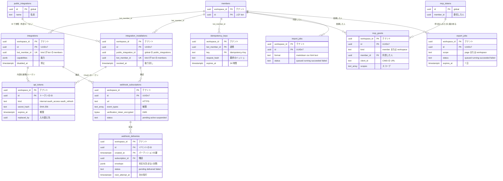

# Data model: 公開 API・連携・Webhook・MCP・インポートとエクスポート

連携とトークン、Webhook、冪等性、MCP の同意、インポート・エクスポートのジョブ。各シャード（`shardNNN`）に置く。公開の連携の定義、OAuth の認可コード、MCP のトークンは `global`（[global.md](global.md)）にある。

- 最小の定義の出どころは [api-and-integrations.md](../api-and-integrations.md) の 12 節。この文書で列の型・制約・索引を足した。
- トークンと秘密は平文で持たない。ハッシュ（SHA-256）で持ち、定数時間で比べる。署名に使う `verification_token` だけは KMS で暗号化して持つ（1 節の暗号化）。
- 公開 API のトークン `<brand>_int_{id}_{secret}` の `{id}` は `workspace_id` とトークンの ID から作る。API はトークンの形から `workspace_id` を得てシャードへ振り分け、`api_tokens` を主キーで引く（`global` に索引を持たない）。

## ER 図



## integrations

- 目的：内部の連携（ワークスペースの所有者が作る）。主体は `bot:{integration_id}`、メンバーの行は `kind = bot`。
- 正：[api-and-integrations.md](../api-and-integrations.md) の 3・12 節、[ADR-0024](../../decisions/0024-integration-access-model.md)
- acl_version：能力の変更と停止で上げる。
- 規模（S1）：数千行

| 列 | 型 | NULL | 既定 | 説明 |
| --- | --- | --- | --- | --- |
| `workspace_id` | uuid | NO | | |
| `id` | uuid | NO | | UUIDv7 |
| `name` | text | NO | | |
| `bot_member_id` | uuid | NO | | `members.id`（`kind = bot`） |
| `capabilities` | jsonb | NO | | `{"read_content":true,"update_content":true,"insert_content":true,"read_comments":true,"insert_comments":false,"user_info":"no_email"}` |
| `created_by` | uuid | NO | | 所有者 |
| `created_at` | timestamptz | NO | `now()` | |
| `disabled_at` | timestamptz | YES | | |

- PK `(workspace_id, id)`。UK `(workspace_id, bot_member_id)`。FK `(workspace_id, bot_member_id)` → `members`。

## integration_installations

- 目的：公開の連携のインストール。認可の画面で作り、選んだページの ACL に `bot:{installation_id}` を入れる。
- 正：同上
- 主体のキー：公開の連携も `bot:{id}` の形にし、`id` にはインストールの ID を使う（ワークスペースごとに別の主体にするため）。
- acl_version：取り消しで上げる。
- 規模（S1）：数万行

| 列 | 型 | NULL | 既定 | 説明 |
| --- | --- | --- | --- | --- |
| `workspace_id` | uuid | NO | | |
| `id` | uuid | NO | | UUIDv7 |
| `public_integration_id` | uuid | NO | | `global.public_integrations.id`（外部キーなし） |
| `bot_member_id` | uuid | NO | | |
| `capabilities` | jsonb | NO | | 認可した能力 |
| `installed_by` | uuid | NO | | |
| `installed_at` | timestamptz | NO | `now()` | |
| `revoked_at` | timestamptz | YES | | |

- PK `(workspace_id, id)`。UK `(workspace_id, bot_member_id)`、`(workspace_id, public_integration_id) WHERE revoked_at IS NULL`。FK → `members`。

## api_tokens

- 目的：内部の連携のトークンと、公開の連携のアクセス・リフレッシュトークン。個人のアクセストークンは MVP に入れない。
- 正：[api-and-integrations.md](../api-and-integrations.md) の 3.1・12 節
- acl_version：取り消しで上げる。
- 保持・削除：期限切れ・取り消しの 30 日後に消す。
- 規模（S1）：数万行

| 列 | 型 | NULL | 既定 | 説明 |
| --- | --- | --- | --- | --- |
| `workspace_id` | uuid | NO | | |
| `id` | uuid | NO | | トークンの `{id}` に埋める ID |
| `kind` | text | NO | | `internal` / `oauth_access`（1 時間）/ `oauth_refresh`（90 日、使うたびに入れ替える） |
| `integration_id` | uuid | YES | | `kind = internal` のとき |
| `installation_id` | uuid | YES | | OAuth のとき |
| `bot_member_id` | uuid | NO | | 主体 |
| `secret_hash` | bytea | NO | | SHA-256 |
| `expires_at` | timestamptz | YES | | `internal` は NULL（無期限） |
| `last_used_at` | timestamptz | YES | | 1 分に 1 回まで更新する |
| `revoked_at` | timestamptz | YES | | |
| `replaced_by` | uuid | YES | | リフレッシュトークンの入れ替え先 |
| `created_at` | timestamptz | NO | `now()` | |

- PK `(workspace_id, id)`。FK `(workspace_id, integration_id)` → `integrations`、`(workspace_id, installation_id)` → `integration_installations`。
- CHECK `kind IN (...)`、`num_nonnulls(integration_id, installation_id) = 1`、`(kind = 'internal') = (integration_id IS NOT NULL)`。
- 索引 `(workspace_id, integration_id)`、`(workspace_id, installation_id)`：取り消しと一覧。

## webhook_subscriptions

- 目的：Webhook の購読。確認のトークンを入れて有効にする。
- 正：[api-and-integrations.md](../api-and-integrations.md) の 6・12 節、[ADR-0025](../../decisions/0025-webhook-delivery.md)
- 保持・削除：連携の削除で消す。停止は `suspended`。
- 規模（S1）：数千行

| 列 | 型 | NULL | 既定 | 説明 |
| --- | --- | --- | --- | --- |
| `workspace_id` | uuid | NO | | |
| `id` | uuid | NO | | UUIDv7 |
| `integration_id` | uuid | YES | | |
| `installation_id` | uuid | YES | | |
| `url` | text | NO | | HTTPS だけ |
| `event_types` | text[] | NO | | `page.created` など |
| `verification_token_encrypted` | bytea | NO | | KMS で暗号化。署名の HMAC の鍵 |
| `status` | text | NO | `'pending'` | `pending` / `active` / `suspended` |
| `failing_since` | timestamptz | YES | | 3 日続けて失敗したら停止 |
| `created_at` | timestamptz | NO | `now()` | |

- PK `(workspace_id, id)`。CHECK `num_nonnulls(integration_id, installation_id) = 1`、`url LIKE 'https://%'`。
- 索引 `(workspace_id, status)`：イベントの宛先の選択。`(workspace_id, integration_id)`：連携の設定の画面。

## webhook_deliveries

- 目的：配送の記録と再試行の状態。本文を含まない封筒を持つ。
- パーティション：`created_at` の週ごと。30 日を過ぎたパーティションを `DROP` する。
- 再試行の取り出し：`sweeper` が `(next_attempt_at)` で拾い、`webhook-delivery` のキューへ入れる。
- 規模（S1）：30 日で約 1 億行（50 件/秒のピークの見積もり）

| 列 | 型 | NULL | 既定 | 説明 |
| --- | --- | --- | --- | --- |
| `workspace_id` | uuid | NO | | |
| `id` | uuid | NO | | イベントの `id`（受け手の重複除去） |
| `created_at` | timestamptz | NO | `now()` | |
| `subscription_id` | uuid | NO | | |
| `event_type` | text | NO | | |
| `entity_id` | uuid | NO | | |
| `envelope` | jsonb | NO | | 下の封筒 |
| `attempt_number` | int | NO | `0` | 最大 8 |
| `next_attempt_at` | timestamptz | YES | | |
| `status` | text | NO | `'pending'` | `pending` / `delivered` / `failed` / `dropped`（配送の時点で読めない） |
| `last_status_code` | int | YES | | |

- PK `(workspace_id, id, created_at)`。
- 索引 `(workspace_id, subscription_id, created_at)`：配送の履歴。`(next_attempt_at) WHERE status = 'pending'`（`sweeper` の例外）。

封筒（`envelope`）：

```jsonc
{
  "id": "0192…",                        // イベントの ID
  "timestamp": "2026-09-28T01:23:45Z",
  "workspace_id": "0192…",
  "subscription_id": "0192…",
  "integration_id": "0192…",
  "type": "page.content_updated",
  "authors": [{ "id": "0192…", "type": "person" }],
  "entity": { "id": "0192…", "type": "page" },
  "data": { "parent": { "id": "…", "type": "page" }, "updated_blocks": [{ "id": "…" }] },
  "attempt_number": 1
}
```

## idempotency_keys

- 目的：`POST` の `Idempotency-Key` と応答。24 時間同じ応答を返す（本システムの独自の拡張）。
- 保持・削除：`expires_at` を過ぎた行を 1 時間ごとに消す。
- 規模（S1）：数百万行

| 列 | 型 | NULL | 既定 | 説明 |
| --- | --- | --- | --- | --- |
| `workspace_id` | uuid | NO | | |
| `bot_member_id` | uuid | NO | | |
| `key` | text | NO | | 255 文字まで |
| `request_hash` | bytea | NO | | 同じ鍵で違う要求なら 422 |
| `response_status` | int | NO | | |
| `response_body` | jsonb | NO | | |
| `created_at` | timestamptz | NO | `now()` | |
| `expires_at` | timestamptz | NO | | |

- PK `(workspace_id, bot_member_id, key)`。索引 `(workspace_id, expires_at)`。

## mcp_grants

- 目的：MCP の同意（`member`：利用者の同意）と、ワークスペースの管理者の許可（`workspace`：クライアント・書き込みの許可）。MCP のサーバーは呼び出しのたびにこれを確かめる。トークンは `global.mcp_tokens`。
- 正：[api-and-integrations.md](../api-and-integrations.md) の 8・12 節、[ADR-0026](../../decisions/0026-remote-mcp-server.md)
- 保持・削除：取り消しの 30 日後に消す。取り消したら、`global.mcp_tokens` の該当のトークンも取り消す。
- 規模（S1）：数万行

| 列 | 型 | NULL | 既定 | 説明 |
| --- | --- | --- | --- | --- |
| `workspace_id` | uuid | NO | | |
| `id` | uuid | NO | | UUIDv7 |
| `kind` | text | NO | | `member` / `workspace` |
| `member_id` | uuid | YES | | `kind = member` のとき |
| `client_id` | text | NO | | CIMD の URL。`workspace` では `*` で「すべて」を表す |
| `scopes` | text[] | NO | | `content:read` / `content:write` / `comments:read` / `comments:write` / `users:read` |
| `granted_by` | uuid | NO | | |
| `granted_at` | timestamptz | NO | `now()` | |
| `revoked_at` | timestamptz | YES | | |

- PK `(workspace_id, id)`。CHECK `(kind = 'member') = (member_id IS NOT NULL)`。
- UK `(workspace_id, member_id, client_id) WHERE kind = 'member' AND revoked_at IS NULL`。
- 索引 `(workspace_id, client_id)`：管理者の許可の確認。

## import_jobs、export_jobs

- 目的：インポート・エクスポートのジョブの状態と再実行。実行は SQS の `import-export` のキューで渡し、Worker は表を走査して拾わない。
- 正：[api-and-integrations.md](../api-and-integrations.md) の 7・12 節
- 保持・削除：終了の 30 日後に消す。エクスポートの成果物は S3 のライフサイクルで 7 日。
- 規模（S1）：数十万行

`import_jobs`：

| 列 | 型 | NULL | 既定 | 説明 |
| --- | --- | --- | --- | --- |
| `workspace_id` | uuid | NO | | |
| `id` | uuid | NO | | UUIDv7 |
| `requested_by` | uuid | NO | | 作るページの権限の主体 |
| `format` | text | NO | | `markdown` / `csv` / `html` / `text` |
| `parent_page_id` | uuid | NO | | |
| `upload_s3_key` | text | NO | | `ws/{workspace_id}/imports/{id}/…` |
| `status` | text | NO | `'queued'` | `queued` / `running` / `succeeded` / `failed` |
| `progress` | jsonb | NO | `'{}'` | 書いたブロックの数など。再実行の続きの位置 |
| `created_root_page_ids` | uuid[] | NO | `'{}'` | 失敗したときにゴミ箱へ移すページ |
| `error` | text | YES | | |
| `created_at` | timestamptz | NO | `now()` | |
| `finished_at` | timestamptz | YES | | |

`export_jobs`：

| 列 | 型 | NULL | 既定 | 説明 |
| --- | --- | --- | --- | --- |
| `workspace_id` | uuid | NO | | |
| `id` | uuid | NO | | UUIDv7 |
| `requested_by` | uuid | NO | | 実行する人の権限で書き出す |
| `scope` | text | NO | | `page` / `workspace` |
| `root_page_id` | uuid | YES | | `scope = page` のとき |
| `format` | text | NO | | `markdown_csv` / `html` / `pdf` |
| `include_comments` | boolean | NO | `false` | |
| `status` | text | NO | `'queued'` | 同上 |
| `result_s3_key` | text | YES | | `ws/{workspace_id}/exports/{id}.zip` |
| `expires_at` | timestamptz | YES | | 完了から 7 日 |
| `error` | text | YES | | |
| `created_at` | timestamptz | NO | `now()` | |
| `finished_at` | timestamptz | YES | | |

- 両方とも PK `(workspace_id, id)`。CHECK `status IN (...)`。`export_jobs` は `(scope = 'page') = (root_page_id IS NOT NULL)`。
- 索引 `(workspace_id, requested_by, created_at)`：自分のジョブの一覧。`export_jobs (workspace_id, status)`：論理シャードごとの同時実行（2）の数え上げ。
