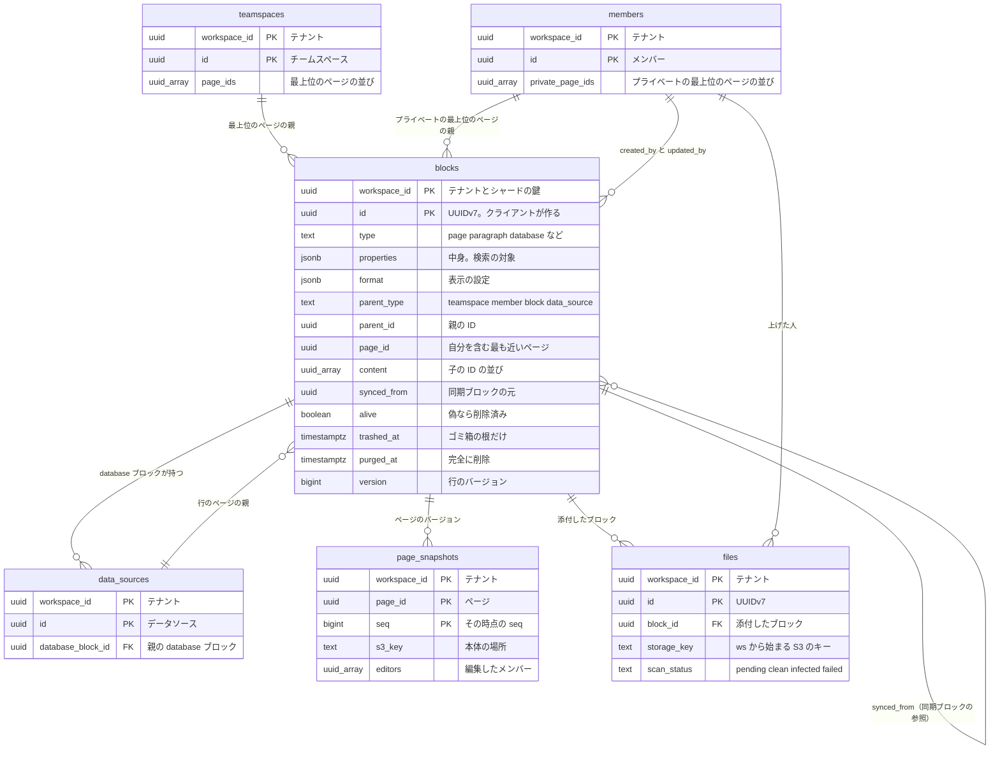

# Data model: ブロック・ページ・中身

ブロックの表と、ページに付く履歴・ファイル。各シャード（`shardNNN`）に置く。規約は [data-model.md](../data-model.md) の 1 節、木の不変条件は同じ文書の 4 節にある。

## ER 図

## blocks

- 目的：すべてのブロック。ページ、データベースの行、`database` ブロックを含む（[ADR-0002](../../decisions/0002-everything-is-a-block.md)）。
- 正：[block-model.md](../block-model.md) の 2・3・5・11 節、[databases.md](../databases.md) の 2 節
- テナント・RLS：`workspace_id` のポリシー（1 節）。
- 保持・削除：ページ以外の削除は `alive = false`。ページはゴミ箱（`trashed_at`）→ 完全に削除（`purged_at`）→ 物理削除（`deletion_jobs` の `page_purge`）。ページ以外の削除済みの行は、履歴の保持期間の後に日次の Worker が消す（[block-model.md](../block-model.md) の 9 節、[ADR-0022](../../decisions/0022-trash-history-and-deletion-retention.md)）。
- 保存の設定：`fillfactor = 80`（[capacity.md](../capacity.md) の 3.1 節）。
- 規模（S1）：10 億行、索引込みで約 1 TB（1 行 約 1 KB の見積もり。未計測）

| 列 | 型 | NULL | 既定 | 説明 |
| --- | --- | --- | --- | --- |
| `workspace_id` | uuid | NO | | テナントとシャードの鍵 |
| `id` | uuid | NO | | UUIDv7。クライアントが作る（[block-model.md](../block-model.md) の 6 節） |
| `type` | text | NO | | ブロックの種類（[block-model.md](../block-model.md) の 3 節）。`linked_database` を含む |
| `properties` | jsonb | NO | `'{}'` | 中身。リッチテキスト（`title`）、`checked`、`source` など。行のページはプロパティ ID をキーに値を持つ（リレーション・ロールアップ・数式を除く）。`database` ブロックは `title`、`data_source_ids`、`view_ids` を持つ |
| `format` | jsonb | NO | `'{}'` | 表示の設定（色、アイコン、幅、`toggleable`、ページの `locked` など）。検索の索引の対象外 |
| `parent_type` | text | NO | | `teamspace` / `member` / `block` / `data_source`（2026-09-28 に `workspace` を `member` に改めた。[README.md](../README.md) の決定） |
| `parent_id` | uuid | NO | | 親の ID。`teamspace` はチームスペース、`member` はプライベートの領域の持ち主、`block` は親のブロック、`data_source` はデータソース |
| `page_id` | uuid | NO | | 自分を含む最も近い `page`。ページ自身なら自分の ID（T6） |
| `content` | uuid[] | NO | `'{}'` | 子の ID の並び。行のページはどの `content` にも入らない（T1） |
| `synced_from` | uuid | YES | | 同期ブロックの参照のときだけ、元の ID |
| `alive` | boolean | NO | `true` | 偽なら削除済み |
| `trashed_at` | timestamptz | YES | | ゴミ箱の根にだけ付ける |
| `trashed_by` | uuid | YES | | `members.id` |
| `purged_at` | timestamptz | YES | | 完全に削除の段階に入った時刻 |
| `created_at` | timestamptz | NO | | サーバーの時刻 |
| `created_by` | uuid | NO | | `members.id`（人・連携） |
| `updated_at` | timestamptz | NO | | サーバーの確定の時刻 |
| `updated_by` | uuid | NO | | `members.id` |
| `version` | bigint | NO | `1` | 更新ごとに 1 増やす。クライアントのキャッシュの鮮度 |

- PK `(workspace_id, id)`。
- FK：`(workspace_id, created_by)`・`(workspace_id, updated_by)`・`(workspace_id, trashed_by)` → `members(workspace_id, id)`。`parent_id`・`content`・`page_id`・`synced_from` は、種類で参照先が変わるか配列なので外部キーを張らず、トランザクションの検証（T1〜T8）で保証する。
- CHECK：
  - `parent_type IN ('teamspace','member','block','data_source')`
  - `parent_type <> 'data_source' OR type = 'page'`（行はページだけ）
  - `parent_type NOT IN ('teamspace','member') OR type = 'page'`（最上位はページだけ）
  - `synced_from IS NULL OR type = 'synced_block'`
  - `purged_at IS NULL OR trashed_at IS NOT NULL`
  - `trashed_at IS NULL OR type = 'page'`
  - `trashed_at IS NULL OR trashed_by IS NOT NULL`
  - `cardinality(content) <= 10000`（[block-model.md](../block-model.md) の 10 節）

| 索引 | 用途のクエリ |
| --- | --- |
| `(workspace_id, page_id)` | ページを開く：ページの中のブロックを 1 回で読む |
| `(workspace_id, parent_id)` | 祖先の鎖（権限の判定の再帰 CTE）、子の列挙、移動と復元 |
| `(workspace_id, synced_from) WHERE synced_from IS NOT NULL` | 同期ブロックの元を指す参照の一覧 |
| `(workspace_id, trashed_at) WHERE trashed_at IS NOT NULL` | ゴミ箱の一覧と、30 日を過ぎた根の検出 |
| `(workspace_id, purged_at) WHERE purged_at IS NOT NULL` | 物理削除の対象（`deletion_jobs` の作成） |

- `properties` と `format` の合計 256KB、リッチテキストの長さなどの上限は、CHECK ではなくトランザクションの検証で確かめる（[block-model.md](../block-model.md) の 10 節）。
- `properties` に索引を張らない。データベースの問い合わせは `dbx_*` で行う（[databases.md](../databases.md) の 3 節）。
- ブロックの値の形（リッチテキストの正規化、`source`、種類ごとの属性）は [block-model.md](../block-model.md) の 3・4 節、[ADR-0006](../../decisions/0006-rich-text-as-normalized-spans.md)。

## page_snapshots

- 目的：ページの履歴のバージョンの目録。本体は S3（gzip の JSON）。
- 正：[block-model.md](../block-model.md) の 8 節
- 保持・削除：ワークスペースの履歴の日数（MVP は 30 日。プランで 7・30・90 日・無期限）を過ぎたバージョンを、日次の Worker が S3 と一緒に消す（`deletion_jobs` の `history_expire`。[ADR-0022](../../decisions/0022-trash-history-and-deletion-retention.md)）。
- 規模（S1）：約 1 億行（1 日に更新されるページ 300 万 × 30 日の見積もり）。S3 は約 20 TB（1 バージョン 平均 200 KB の見積もり）

| 列 | 型 | NULL | 既定 | 説明 |
| --- | --- | --- | --- | --- |
| `workspace_id` | uuid | NO | | |
| `page_id` | uuid | NO | | `blocks.id`（`type = page`） |
| `seq` | bigint | NO | | 作成時のページの `seq` |
| `created_at` | timestamptz | NO | `now()` | |
| `editors` | uuid[] | NO | `'{}'` | 前のバージョンからこのバージョンまでに編集したメンバー |
| `s3_key` | text | NO | | `ws/{workspace_id}/pages/{page_id}/snapshots/{seq}.json.gz` |
| `size` | int | NO | | 圧縮後のバイト数 |
| `block_count` | int | NO | | バージョンに含むブロックの数 |

- PK `(workspace_id, page_id, seq)`。
- FK `(workspace_id, page_id)` → `blocks(workspace_id, id)` ON DELETE CASCADE。
- 索引 `(workspace_id, created_at)`：保持期間を過ぎたバージョンの検出。一覧は PK の範囲で読む（新しい順）。

## files

- 目的：アップロードしたファイル（画像、添付、アイコン・カバー、コメントの添付、公開 API の `file_uploads`）の記録。本体は S3。
- 正：[block-model.md](../block-model.md) の 3 節、[infrastructure.md](../infrastructure.md) の 5 節、[security.md](../security.md) の 3.6 節
- 流れ：署名付き URL でクライアントが S3 へ上げる → `file-events` のキューで Worker がスキャンとサムネイルを作る → `scan_status = clean` になったら配る。ブロックは `properties.source = {"type":"file","file_id":...}` で指す。
- 保持・削除：属するブロック・コメントの物理削除で消す。どこからも指されないまま 24 時間たった `pending` と `uploaded` の行は、S3 と一緒に消す。
- 規模（S1）：5,000 万行、S3 は約 50 TB（見積もり）

| 列 | 型 | NULL | 既定 | 説明 |
| --- | --- | --- | --- | --- |
| `workspace_id` | uuid | NO | | |
| `id` | uuid | NO | | UUIDv7 |
| `uploaded_by` | uuid | NO | | `members.id`（人・連携） |
| `origin` | text | NO | | `editor` / `api` / `import` / `comment` |
| `block_id` | uuid | YES | | 付いているブロック。コメントの添付は NULL |
| `comment_id` | uuid | YES | | 付いているコメント |
| `storage_key` | text | NO | | `ws/{workspace_id}/files/{id}` |
| `name` | text | NO | | 元のファイル名 |
| `content_type` | text | NO | | 検査した MIME |
| `size` | bigint | NO | | バイト数 |
| `sha256` | bytea | YES | | 上げ終わった後に計算 |
| `status` | text | NO | `'pending'` | `pending`（上げ中）/ `uploaded` / `attached` / `deleted` |
| `scan_status` | text | NO | `'pending'` | `pending` / `clean` / `infected` / `failed` |
| `created_at` | timestamptz | NO | `now()` | |
| `attached_at` | timestamptz | YES | | |
| `deleted_at` | timestamptz | YES | | |

- PK `(workspace_id, id)`。
- FK `(workspace_id, uploaded_by)` → `members`。`block_id`・`comment_id` は外部キーを張らない（ブロックの物理削除の順序を Worker が決めるため。[security.md](../security.md) の 7 節）。
- CHECK `status IN (...)`、`scan_status IN (...)`、`size <= 5368709120`（5 GB。インポートの ZIP の上限）、`NOT (block_id IS NOT NULL AND comment_id IS NOT NULL)`。
- UK `(workspace_id, storage_key)`。

| 索引 | 用途のクエリ |
| --- | --- |
| `(workspace_id, block_id) WHERE block_id IS NOT NULL` | ブロックの物理削除で、付いているファイルを消す |
| `(workspace_id, status, created_at) WHERE status IN ('pending','uploaded')` | 使われなかった上げかけのファイルの掃除 |
