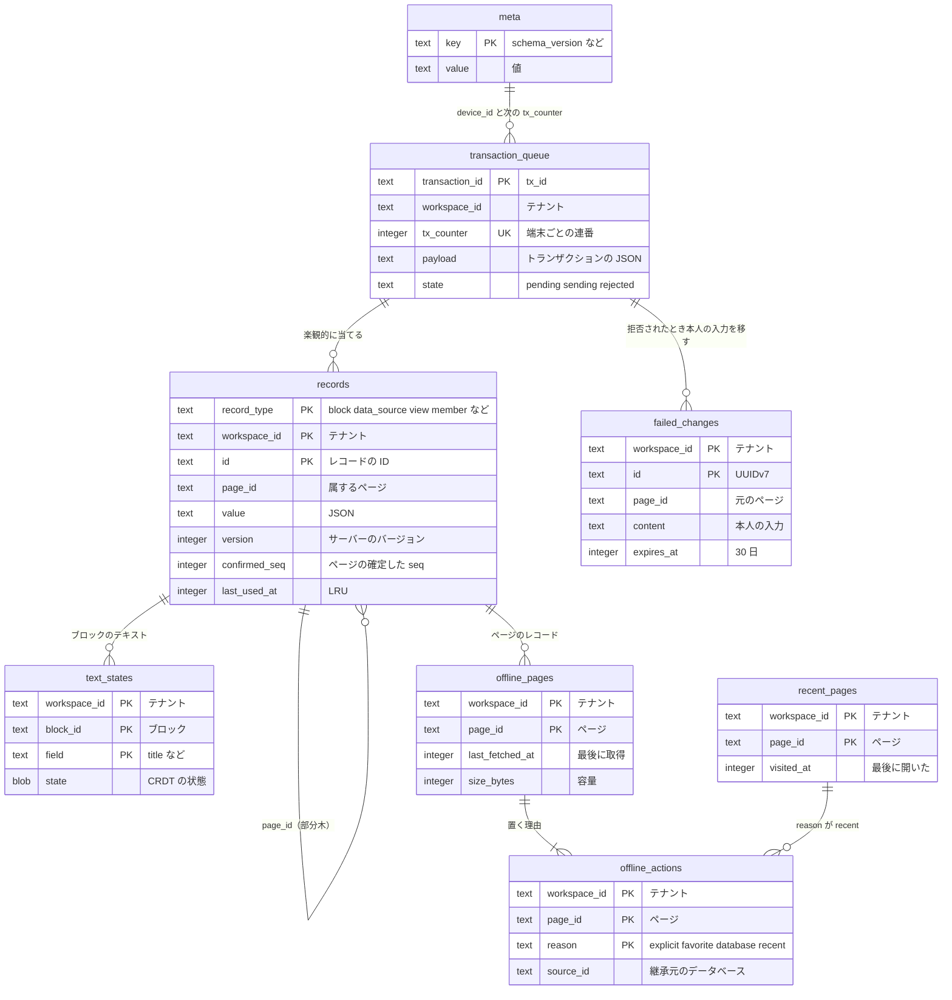

# Data model: クライアントのローカルの保存（SQLite・OPFS）

ブラウザとデスクトップの SQLite（WASM、`opfs-sahpool`）。アカウントごとに 1 つのファイルにし、ログアウトで消す。書くのは Web Locks で選んだ 1 つのタブの専用ワーカーだけ（[ADR-0008](../../decisions/0008-sqlite-wasm-opfs-local-store.md)、[ADR-0013](../../decisions/0013-offline-availability-policy.md)、[ADR-0032](../../decisions/0032-desktop-uses-wasm-sqlite-in-s1.md)）。

- 名前と形の正は [editor.md](../editor.md) の 10 節と [collaboration.md](../collaboration.md) の 11 節。この文書で列と索引を足した。
- サーバーの写しで、正本はサーバー。消えても API から取り直して動く。例外は `transaction_queue` と `failed_changes` で、消えると未送信の入力が失われる（画面で警告する）。
- キーに `workspace_id` を含める。1 つのファイルに、アカウントが属する複数のワークスペースの写しが入る。
- 独自の暗号化はしない（S1。[security.md](../security.md) の 11 節）。
- スキーマのバージョンは `meta` の `schema_version`。バージョンが上がったら、写しの表は作り直し、`transaction_queue` と `failed_changes` だけを移す。

## ER 図

SQLite の型は `TEXT`・`INTEGER`・`BLOB`。UUID は文字列、時刻は UNIX ミリ秒の整数で持つ。

## records

- 目的：レコードの写し（RecordCache）。ブロック、データソース、ビュー、メンバー、チームスペース、ディスカッション、コメント。
- 追い出し：オフラインのページの部分木と、`transaction_queue` が参照するレコードを除いて LRU で追い出す。総量は 500MB を目安にする（[editor.md](../editor.md) の 10 節）。

| 列 | 型 | NULL | 説明 |
| --- | --- | --- | --- |
| `record_type` | TEXT | NO | `block` / `data_source` / `view` / `member` / `teamspace` / `discussion` / `comment`（2026-09-28 に、SQL の予約語の `table` から改名） |
| `workspace_id` | TEXT | NO | |
| `id` | TEXT | NO | |
| `page_id` | TEXT | YES | 属するページ。権限を失ったページの部分木を消すときに使う |
| `value` | TEXT | NO | サーバーの値（JSON） |
| `version` | INTEGER | NO | サーバーの `version`。手元以下の値は捨てる |
| `confirmed_seq` | INTEGER | YES | `record_type = block` かつページのとき、そのページの確定した `seq` |
| `last_used_at` | INTEGER | NO | LRU |

- PK `(record_type, workspace_id, id)`。索引 `(workspace_id, page_id)`：ページの部分木の読み込みと削除。`(last_used_at)`：追い出し。

## text_states

| 列 | 型 | NULL | 説明 |
| --- | --- | --- | --- |
| `workspace_id` | TEXT | NO | |
| `block_id` | TEXT | NO | |
| `field` | TEXT | NO | サーバーの `block_text_states.field` と同じ |
| `state` | BLOB | NO | `packages/text-crdt` の直列化の形（サーバーと同じ） |
| `updated_at` | INTEGER | NO | |

- PK `(workspace_id, block_id, field)`。

## transaction_queue

- 目的：送信前・確定前のトランザクション（FIFO）。追い出さない。量の上限は 1 ワークスペースあたり 5 万操作・50MB（[collaboration.md](../collaboration.md) の 11.4 節）。

| 列 | 型 | NULL | 説明 |
| --- | --- | --- | --- |
| `transaction_id` | TEXT | NO | `tx_id`（UUIDv7） |
| `workspace_id` | TEXT | NO | |
| `tx_counter` | INTEGER | NO | 端末ごとの連番。`meta.next_tx_counter` から振る |
| `payload` | TEXT | NO | [collaboration.md](collaboration.md) のトランザクションの形 |
| `created_at` | INTEGER | NO | |
| `attempts` | INTEGER | NO | 試行の回数 |
| `state` | TEXT | NO | `pending` / `sending` / `rejected`（`failed_changes` へ移す前） |

- PK `(transaction_id)`。UK `(tx_counter)`。索引 `(workspace_id, tx_counter)`：送る順。

## offline_pages、offline_actions

- 目的：オフラインで使うページと、置く理由。最後の理由が消えたときだけページを外す（本家の形に倣う）。上限は、ワークスペースごとに 2,000 ページ・合計 1GB。

`offline_pages`：

| 列 | 型 | NULL | 説明 |
| --- | --- | --- | --- |
| `workspace_id` | TEXT | NO | |
| `page_id` | TEXT | NO | |
| `last_fetched_at` | INTEGER | YES | 最後に取得した時刻 |
| `size_bytes` | INTEGER | NO | ファイルの写しを含む容量 |

- PK `(workspace_id, page_id)`。

`offline_actions`：

| 列 | 型 | NULL | 説明 |
| --- | --- | --- | --- |
| `workspace_id` | TEXT | NO | |
| `page_id` | TEXT | NO | |
| `reason` | TEXT | NO | `explicit` / `favorite` / `database`（最初のビューの先頭 50 行）/ `recent`（直近 30 日の 50 ページ） |
| `source_id` | TEXT | NO | `database` のときはデータベースのページの ID、それ以外は空文字 |
| `created_at` | INTEGER | NO | |

- PK `(workspace_id, page_id, reason, source_id)`。索引 `(workspace_id, reason, created_at)`：上限を超えたとき、`recent` を古い順に外す。

## failed_changes

- 目的：拒否されたトランザクションから取り出した、本人の入力と作ったブロック。30 日で消える（[collaboration.md](../collaboration.md) の 10.1 節）。

| 列 | 型 | NULL | 説明 |
| --- | --- | --- | --- |
| `workspace_id` | TEXT | NO | |
| `id` | TEXT | NO | UUIDv7 |
| `page_id` | TEXT | YES | 元のページ |
| `reason` | TEXT | NO | `forbidden` / `not_found` / `invalid` |
| `content` | TEXT | NO | 本人が入力したテキストと作ったブロック（JSON） |
| `created_at` | INTEGER | NO | |
| `expires_at` | INTEGER | NO | 30 日後 |

- PK `(workspace_id, id)`。索引 `(expires_at)`。

## recent_pages

- 目的：最近開いたページ。クイック検索の空の入力、検索の加点（最大 50 件）、オフラインの理由 `recent` の元。サーバーには閲覧の履歴を持たない（[search.md](../search.md) の 7・12 節）。2026-09-28 に最小の定義を置いた。

| 列 | 型 | NULL | 説明 |
| --- | --- | --- | --- |
| `workspace_id` | TEXT | NO | |
| `page_id` | TEXT | NO | |
| `visited_at` | INTEGER | NO | |

- PK `(workspace_id, page_id)`。索引 `(workspace_id, visited_at)`。30 日を過ぎた行を消す。

## meta

| キー | 値 |
| --- | --- |
| `schema_version` | ローカルのスキーマのバージョン |
| `device_id` | この保存の `device_id`（UUIDv7。サーバーの `device_cursors` の鍵） |
| `next_tx_counter` | 次に振る `tx_counter` |
| `total_bytes` | 総量 |
| `account_id` | 持ち主のアカウント（別のアカウントの待ち行列を送らない検査） |

- PK `(key)`。
