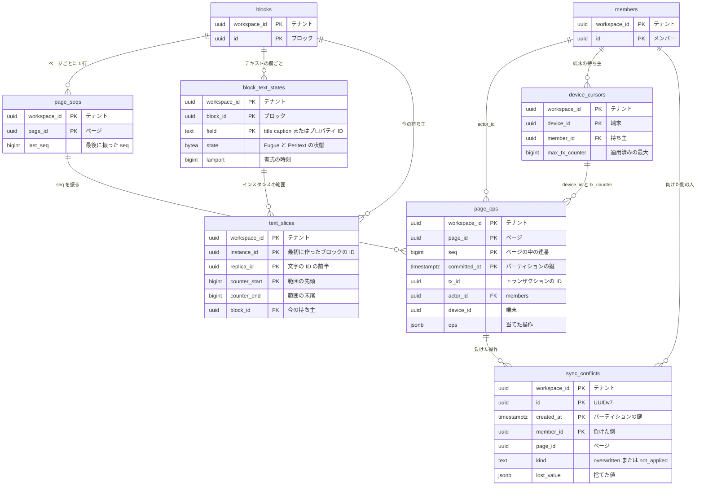

# Data model: 共同編集（トランザクション・ページの seq・CRDT）

変更の受け付けと順序付け、テキストの CRDT、冪等、衝突の記録。各シャード（`shardNNN`）に置く。配信の `outbox` は [operations.md](operations.md)、端末の側は [client.md](client.md) にある。

## ER 図



## page_seqs

- 目的：ページごとの `seq` の採番。この行のロックが、ページの書き込みの直列化になる。ブロックの行（大きい JSON）と分け、更新の多い小さな行にする。
- 正：[collaboration.md](../collaboration.md) の 7 節、[ADR-0005](../../decisions/0005-transactions-as-unit-of-change.md)
- `seq` を消費する変更：ページの中のブロック、そのページに置いた `database` ブロックのデータソースとビュー（`data_sources.page_id`・`views.page_id`）、ページのディスカッションとコメント。
- 保存の設定：`fillfactor = 70`、`autovacuum_vacuum_scale_factor = 0.01`（[capacity.md](../capacity.md) の 3.1 節）。
- 保持・削除：ページの物理削除で消す。
- 規模（S1）：5,000 万行（ページの数）

| 列 | 型 | NULL | 既定 | 説明 |
| --- | --- | --- | --- | --- |
| `workspace_id` | uuid | NO | | |
| `page_id` | uuid | NO | | `blocks.id`（`type = page`） |
| `last_seq` | bigint | NO | `0` | 最後に振った `seq` |
| `updated_at` | timestamptz | NO | `now()` | |

- PK `(workspace_id, page_id)`。FK `(workspace_id, page_id)` → `blocks(workspace_id, id)`。
- 採番：`UPDATE page_seqs SET last_seq = last_seq + 1 ... RETURNING last_seq`。複数のページに触れるトランザクションは、`page_id` の順にロックを取る（デッドロックを避ける）。
- ページのブロックを作るトランザクションで、同じ行を作る。

## page_ops

- 目的：操作のログ。再接続時の差分の取得（`GET /pages/{id}/ops?after_seq=N`）、スナップショットの作成、更新の欄の元。
- 正：[collaboration.md](../collaboration.md) の 7・8・12 節
- パーティション：`committed_at` の週ごとの範囲。30 日を過ぎたパーティションを、スナップショットに含まれることを確かめてから `DROP` する（[block-model.md](../block-model.md) の 8 節）。
- 規模（S1）：30 日で約 26 億行、約 250 GB（[capacity.md](../capacity.md) の 1.2 節）

| 列 | 型 | NULL | 既定 | 説明 |
| --- | --- | --- | --- | --- |
| `workspace_id` | uuid | NO | | |
| `page_id` | uuid | NO | | |
| `seq` | bigint | NO | | ページの中の連番 |
| `committed_at` | timestamptz | NO | `now()` | サーバーの確定の時刻。履歴の並びの鍵 |
| `tx_id` | uuid | NO | | トランザクションの ID（クライアントが作る）。複数のページに触れたら、各ページの行が同じ値を持つ |
| `actor_id` | uuid | NO | | `members.id`（人・連携） |
| `device_id` | uuid | YES | | 端末。API・Worker の変更は NULL |
| `tx_counter` | bigint | YES | | 端末ごとの連番 |
| `via` | text | NO | `'editor'` | `editor` / `api` / `mcp` / `import` / `system` |
| `via_client` | text | YES | | `via = mcp` のときのクライアント名。「〇〇（AI エージェント）経由」の表示（[api-and-integrations.md](../api-and-integrations.md) の 8.1 節） |
| `ops` | jsonb | NO | | このページに当てた操作（下の「トランザクションと操作の形」。当てなかった操作には印を付ける） |
| `client_created_at` | timestamptz | YES | | クライアントの作成時刻。表示用で、並びには使わない |

- PK `(workspace_id, page_id, seq, committed_at)`。パーティションの鍵を PK に含める必要があるため、`(workspace_id, page_id, seq)` の一意は DB でなく `page_seqs` の採番で保証する（1 節）。
- 索引：PK が差分の取得（`page_id` と `seq > N`）に使える。パーティションを刈れないので、全パーティション（5〜6 個）を引く。
- `(workspace_id, tx_id)`：取り消しと、衝突の記録からの参照。

## block_text_states

- 目的：ブロックのテキストの CRDT の状態（Fugue の列＋Peritext の書式、墓標の run）。読み取り用に展開したリッチテキストは `blocks.properties` にあり、同じトランザクションで書く。
- 正：[collaboration.md](../collaboration.md) の 5 節、[ADR-0010](../../decisions/0010-text-crdt-with-server-ordered-structure.md)
- 保持・削除：ブロックの物理削除で消す。墓標は消さない。
- 規模（S1）：約 7 億行（テキストを持つブロック）、約 0.5 TB（見積もり。未計測）。1 行が 1MB を超えたら警告の指標

| 列 | 型 | NULL | 既定 | 説明 |
| --- | --- | --- | --- | --- |
| `workspace_id` | uuid | NO | | |
| `block_id` | uuid | NO | | `blocks.id` |
| `field` | text | NO | | `title` / `caption` / 行のページのテキストのプロパティ ID |
| `page_id` | uuid | NO | | `blocks.page_id` の写し。ページの一括の読み込み用 |
| `state` | bytea | NO | | `packages/text-crdt` の直列化の形（run ごとに `(instance_id, replica_id, counter)` の範囲と文字、墓標、書式の印） |
| `format_version` | smallint | NO | `1` | 直列化の形のバージョン |
| `lamport` | bigint | NO | `0` | 書式の排他的な値の比較に使う Lamport の時刻の最大 |
| `size` | int | NO | | `state` のバイト数（指標） |
| `updated_at` | timestamptz | NO | `now()` | |

- PK `(workspace_id, block_id, field)`。FK `(workspace_id, block_id)` → `blocks(workspace_id, id)` ON DELETE CASCADE。
- 索引 `(workspace_id, page_id)`：ページを開くときに、ページの全ブロックの状態を 1 回で読む。

## text_slices

- 目的：「テキストのインスタンスと文字の ID の範囲 → 今それを持つブロック」の索引。分割・結合の後に届いたテキストの操作を、今の持ち主のブロックへ当てる。
- 正：[collaboration.md](../collaboration.md) の 5.3 節
- 保持・削除：持ち主のブロックの物理削除で消す。
- 規模（S1）：約 8 億行（テキストを持つブロック＋分割の数。見積もり）

| 列 | 型 | NULL | 既定 | 説明 |
| --- | --- | --- | --- | --- |
| `workspace_id` | uuid | NO | | |
| `instance_id` | uuid | NO | | テキストのインスタンス。最初に作ったブロックの ID |
| `replica_id` | uuid | NO | | 文字の ID `(replica_id, counter)` の前半 |
| `counter_start` | bigint | NO | | 範囲の先頭（含む） |
| `counter_end` | bigint | NO | | 範囲の末尾（含む） |
| `block_id` | uuid | NO | | 今の持ち主 |
| `field` | text | NO | `'title'` | 持ち主の欄 |
| `updated_at` | timestamptz | NO | `now()` | |

- PK `(workspace_id, instance_id, replica_id, counter_start)`。
- FK `(workspace_id, block_id)` → `blocks(workspace_id, id)` ON DELETE CASCADE。
- CHECK `counter_end >= counter_start`。同じインスタンス・レプリカの範囲が重ならないことは、分割・結合の検証で保証する。
- 索引 `(workspace_id, block_id)`：ブロックが持つ範囲の一覧（結合・削除）。範囲の検索は PK の `counter_start <= c` の最大で引く。

## device_cursors

- 目的：端末ごとに適用済みの `tx_counter` の最大値。同じトランザクションの再送を、適用済みとして成功で返す（冪等）。
- 正：[collaboration.md](../collaboration.md) の 4・14 節
- 保持・削除：期間では消さない（何日オフラインでも重複して当たらないため）。メンバーの削除とワークスペースの削除で消す。
- 規模（S1）：約 30 万行

| 列 | 型 | NULL | 既定 | 説明 |
| --- | --- | --- | --- | --- |
| `workspace_id` | uuid | NO | | |
| `device_id` | uuid | NO | | 端末（アカウントのローカルの保存ごと）がはじめに作る UUIDv7 |
| `member_id` | uuid | NO | | 持ち主。別のメンバーの `device_id` での送信は拒否する |
| `max_tx_counter` | bigint | NO | `0` | 適用済みの最大 |
| `updated_at` | timestamptz | NO | `now()` | |

- PK `(workspace_id, device_id)`。FK `(workspace_id, member_id)` → `members(workspace_id, id)`。
- 索引 `(workspace_id, member_id)`：メンバーの無効化での片付け。

## sync_conflicts

- 目的：上書きされた値と、当てなかった操作の記録。負けた側に見せ、戻せるようにする。
- 正：[collaboration.md](../collaboration.md) の 6・11.5 節、[ADR-0011](../../decisions/0011-structural-and-property-conflict-rules.md)
- パーティション：`created_at` の週ごと。30 日を過ぎたパーティションを `DROP` する。
- 規模（S1）：30 日で数百万行（見積もり）

| 列 | 型 | NULL | 既定 | 説明 |
| --- | --- | --- | --- | --- |
| `workspace_id` | uuid | NO | | |
| `id` | uuid | NO | | UUIDv7 |
| `created_at` | timestamptz | NO | `now()` | |
| `member_id` | uuid | NO | | 負けた側（値を上書きされた、または操作を当てられなかった人） |
| `page_id` | uuid | NO | | 表示するページ |
| `tx_id` | uuid | NO | | 負けた操作のトランザクション |
| `op_index` | int | NO | | トランザクションの中の位置 |
| `kind` | text | NO | | `overwritten`（LWW で上書き）/ `not_applied`（当てなかった） |
| `reason` | text | NO | | `lww` / `cycle` / `deleted_parent` / `schema_mismatch` / `anchor_missing` など |
| `record_type` | text | NO | | `block` / `data_source` / `view` / `discussion` / `comment` |
| `record_id` | uuid | NO | | |
| `path` | text[] | YES | | `prop.set` の `path` |
| `lost_value` | jsonb | YES | | 捨てた値。戻すときに使う |
| `winning_seq` | bigint | YES | | 勝った変更の `seq` |
| `resolved_at` | timestamptz | YES | | 本人が戻した・閉じた |

- PK `(workspace_id, id, created_at)`。FK `(workspace_id, member_id)` → `members`。
- CHECK `kind IN ('overwritten','not_applied')`。
- 索引 `(workspace_id, member_id, page_id, created_at) WHERE resolved_at IS NULL`：ページを開いたときの「重なった変更 n 件」。

## トランザクションと操作の形

クライアントが送り（WebSocket か `POST /transactions`）、端末の `transaction_queue` に置く形。公開 API・MCP・インポートの書き込みも、この形に変換して同じ関数で当てる（[collaboration.md](../collaboration.md) の 4 節、[ADR-0005](../../decisions/0005-transactions-as-unit-of-change.md)）。

```jsonc
{
  "id": "0192f0e1-...",               // tx_id。UUIDv7。クライアントが作る
  "workspace_id": "0192...",
  "device_id": "0192...",
  "tx_counter": 1842,                  // 端末ごとの連番。device_cursors と比べる
  "client_created_at": "2026-09-28T01:23:45.678Z",
  "ops": [
    { "op": "block.insert", "id": "…", "parent": { "type": "block", "id": "…" },
      "after": "…", "before": "…", "type": "paragraph", "props": { "properties": {}, "format": {} } },
    { "op": "text.insert", "record": { "type": "block", "id": "…", "field": "title" },
      "instance": "…", "left": { "replica": "…", "counter": 41 }, "chars": "明日", "replica": "…", "counter_start": 90 },
    { "op": "prop.set", "record": { "type": "block", "id": "…" }, "path": ["format", "color"],
      "value": "red", "base_version": 17 },
    { "op": "prop.add", "record": { "type": "block", "id": "row-A" }, "path": ["properties", "prop_rel1"],
      "item": { "row_id": "row-B" }, "after": null }
  ]
}
```

| 操作 | 対象のレコード | 保存先 |
| --- | --- | --- |
| `block.insert` / `block.move` / `block.delete` / `block.restore` | `block` | `blocks`、`page_seqs`、`text_slices`（作成） |
| `prop.set` | `block`・`data_source`・`view`・`discussion`・`comment` | 各表の列か `properties`・`format`・`schema`・`config` の `path` |
| `prop.add` / `prop.remove` | 複数値のプロパティ。リレーションは `relation_edges` | `blocks.properties`、`relation_edges`、`dbx_values` |
| `text.insert` / `text.delete` / `text.mark` | ブロックのテキスト、ページのタイトル、テキストのプロパティ（コメントの本文は作者だけが直すので `prop.set` で置き換える） | `block_text_states`、`blocks.properties` |
| `text.split` / `text.join` | 段落の分割・結合 | `text_slices`、`blocks` |
| `record.create` / `record.delete` | `data_source`・`view`・`discussion`・`comment`・`comment_reaction` | 各表 |

- 1 トランザクションは操作 1,000・本体 500KB まで（[block-model.md](../block-model.md) の 10 節）。
- 応答は `{ "tx_id", "pages": [{ "page_id", "seq" }], "conflicts": [{ "op_index", "kind", "reason" }] }`。拒否は ADR-0005 の「まとめて拒否」（権限、不正な値、木の不変条件）。
- `page_ops.ops` には、サーバーが当てた形（アンカーを解決した位置、当てなかった操作の印）を、ページごとに分けて書く。
