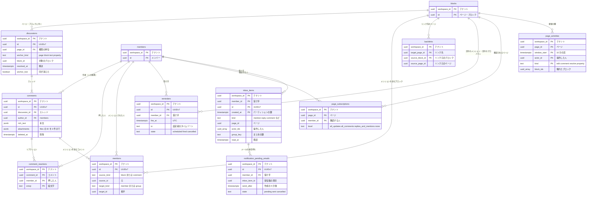

# Data model: コメント・メンション・通知

コメントとディスカッション、メンション、バックリンク、リマインダー、購読、受信箱、メールの送信待ち、ページの更新の欄。各シャード（`shardNNN`）に置く。アカウントの通知の設定と push の宛先は `global`（[global.md](global.md)）にある。

- コメントはブロックにしない。権限は、コメントが付いたページで判定する（[comments-and-notifications.md](../comments-and-notifications.md) の 2.1 節、[ADR-0004](../../decisions/0004-inherited-page-permissions.md)）。
- コメントの操作はページのトランザクションの操作で、ページの `seq` を消費する（同じ文書の 2.2 節）。`discussions`・`comments`・`comment_reactions` の ID はクライアントが作る（オフラインで書けるため）。
- 通知の表（`inbox_items`・`notification_pending_emails`）は ID と種類だけを持ち、タイトルや本文の写しを持たない（同じ文書の 5.2 節）。

## ER 図

## discussions

- 目的：コメントのスレッド。ページ全体・ブロック・テキストの範囲・データベースのプロパティ（MVP の後）に付く。テキストの範囲は、ブロックのリッチテキストの `marks.comments` に `discussion_id` の印として置く。
- 正：[comments-and-notifications.md](../comments-and-notifications.md) の 2 節
- 保持・削除：ブロック・ページを削除しても消さない（ゴミ箱からの復元で戻る）。ページの物理削除で消す。
- 規模（S1）：約 2,000 万行（見積もり）

| 列 | 型 | NULL | 既定 | 説明 |
| --- | --- | --- | --- | --- |
| `workspace_id` | uuid | NO | | |
| `id` | uuid | NO | | UUIDv7。クライアントが作る |
| `page_id` | uuid | NO | | 権限の単位のページ（行のプロパティのときは行のページ） |
| `anchor_kind` | text | NO | | `page` / `block` / `text` / `property` |
| `block_id` | uuid | YES | | `block`・`text` のとき |
| `property_id` | text | YES | | `property` のとき |
| `resolved_at` | timestamptz | YES | | |
| `resolved_by` | uuid | YES | | |
| `anchor_lost` | boolean | NO | `false` | 印のあるテキストがすべて消えた |
| `created_at` / `created_by` | timestamptz / uuid | NO | | |

- PK `(workspace_id, id)`。FK `(workspace_id, page_id)` → `blocks` ON DELETE CASCADE、`created_by`・`resolved_by` → `members`。
- CHECK `anchor_kind IN (...)`、`anchor_kind NOT IN ('block','text') OR block_id IS NOT NULL`、`anchor_kind <> 'property' OR property_id IS NOT NULL`。
- 索引 `(workspace_id, page_id, resolved_at)`：ページのコメントの一覧（未解決・解決済みの絞り込み）。`(workspace_id, block_id) WHERE block_id IS NOT NULL`：ブロックに付いたスレッド。

## comments

- 目的：コメントの本文。作者は人か連携。
- 正：[comments-and-notifications.md](../comments-and-notifications.md) の 2 節
- 保持・削除：削除は `deleted_at`（本文を消す）。ページの物理削除で行を消す。
- 規模（S1）：約 5,000 万行（見積もり）

| 列 | 型 | NULL | 既定 | 説明 |
| --- | --- | --- | --- | --- |
| `workspace_id` | uuid | NO | | |
| `id` | uuid | NO | | UUIDv7。クライアントが作る |
| `discussion_id` | uuid | NO | | |
| `page_id` | uuid | NO | | `discussions.page_id` の写し（権限の判定と削除） |
| `author_id` | uuid | NO | | `members.id`（人か bot） |
| `rich_text` | jsonb | NO | | [block-model.md](../block-model.md) の 4 節の形。削除で `[]` |
| `attachments` | jsonb | NO | `'[]'` | `files.id` の配列。3 件まで |
| `created_at` | timestamptz | NO | | |
| `edited_at` | timestamptz | YES | | |
| `deleted_at` | timestamptz | YES | | |
| `version` | bigint | NO | `1` | |

- PK `(workspace_id, id)`。FK `(workspace_id, discussion_id)` → `discussions` ON DELETE CASCADE、`(workspace_id, author_id)` → `members`。
- CHECK `jsonb_array_length(attachments) <= 3`。
- 索引 `(workspace_id, discussion_id, created_at)`：スレッドの表示。`(workspace_id, author_id, created_at)`：コメントの一覧の人での絞り込み。

## comment_reactions

- 目的：コメントへのリアクション。
- 規模（S1）：約 1,000 万行

| 列 | 型 | NULL | 既定 | 説明 |
| --- | --- | --- | --- | --- |
| `workspace_id` | uuid | NO | | |
| `comment_id` | uuid | NO | | |
| `member_id` | uuid | NO | | |
| `emoji` | text | NO | | 絵文字の短い名前か文字 |
| `created_at` | timestamptz | NO | `now()` | |

- PK `(workspace_id, comment_id, member_id, emoji)`。FK → `comments` ON DELETE CASCADE、`members`。

## mentions

- 目的：人・グループのメンションの記録。新しく増えたメンションにだけ通知し、消えたメンションの未読の通知を取り消す。
- 正：[comments-and-notifications.md](../comments-and-notifications.md) の 3 節
- 更新：メンションを含むブロック・コメントを変えたトランザクションで、差分を書く。
- 保持・削除：元のブロック・コメントの物理削除で消す。
- 規模（S1）：約 5,000 万行（見積もり）

| 列 | 型 | NULL | 既定 | 説明 |
| --- | --- | --- | --- | --- |
| `workspace_id` | uuid | NO | | |
| `id` | uuid | NO | | UUIDv7 |
| `source_kind` | text | NO | | `block` / `comment` |
| `source_id` | uuid | NO | | ブロックかコメントの ID |
| `page_id` | uuid | NO | | 元のページ（受け手が読めるかの判定） |
| `target_kind` | text | NO | | `member` / `group` |
| `target_id` | uuid | NO | | |
| `created_by` | uuid | NO | | |
| `created_at` | timestamptz | NO | `now()` | |

- PK `(workspace_id, id)`。UK `(workspace_id, source_id, target_kind, target_id)`。
- CHECK `source_kind IN ('block','comment')`、`target_kind IN ('member','group')`。
- 索引 `(workspace_id, target_id, created_at)`：自分へのメンションの一覧。

## backlinks

- 目的：ページのメンション・リンクのバックリンク。元のページを読める分だけを返す。
- 正：[comments-and-notifications.md](../comments-and-notifications.md) の 3 節
- 更新：メンションを含むブロックの変更のトランザクションで書く。
- 規模（S1）：約 3,000 万行（見積もり）

| 列 | 型 | NULL | 既定 | 説明 |
| --- | --- | --- | --- | --- |
| `workspace_id` | uuid | NO | | |
| `target_page_id` | uuid | NO | | リンク先のページ |
| `source_block_id` | uuid | NO | | リンク元のブロック |
| `source_page_id` | uuid | NO | | リンク元のページ |
| `created_at` | timestamptz | NO | `now()` | |

- PK `(workspace_id, target_page_id, source_block_id)`。FK `(workspace_id, source_block_id)` → `blocks` ON DELETE CASCADE。リンク先には外部キーを張らない（削除済みのページへのリンクも残す）。
- 索引 `(workspace_id, source_block_id)`：ブロックの変更で、そのブロックの行を入れ替える。

## reminders

- 目的：日付のメンション（`@remind`）と日付のプロパティのリマインダー。
- 正：[comments-and-notifications.md](../comments-and-notifications.md) の 4 節
- 発火：論理シャードごとのスケジューラーが、1 分ごとに `fire_at <= now()` の行を `FOR UPDATE SKIP LOCKED` で取る。ワークスペースをまたいで読むので、`sweeper` のロールで読む（[data-model.md](../data-model.md) の 1.4 節）。
- 保持・削除：発火・取り消しの 30 日後に消す。
- 規模（S1）：数百万行

| 列 | 型 | NULL | 既定 | 説明 |
| --- | --- | --- | --- | --- |
| `workspace_id` | uuid | NO | | |
| `id` | uuid | NO | | UUIDv7 |
| `source_kind` | text | NO | | `mention` / `property` |
| `block_id` | uuid | YES | | `mention` のとき、メンションを含むブロック |
| `page_id` | uuid | NO | | 権限の判定に使うページ（`property` のときは行） |
| `property_id` | text | YES | | `property` のとき |
| `member_id` | uuid | NO | | 受け手 |
| `fire_at` | timestamptz | NO | | UTC |
| `tz` | text | NO | | 設定した時点の設定者のタイムゾーン。夏時間でも壁時計の時刻を保つ |
| `state` | text | NO | `'scheduled'` | `scheduled` / `fired` / `cancelled` |
| `created_by` | uuid | NO | | |
| `created_at` | timestamptz | NO | `now()` | |
| `fired_at` | timestamptz | YES | | |

- PK `(workspace_id, id)`。FK `(workspace_id, member_id)` → `members`。
- CHECK `source_kind IN (...)`、`(source_kind = 'mention') = (block_id IS NOT NULL)`、`(source_kind = 'property') = (property_id IS NOT NULL)`、`state IN (...)`。

| 索引 | 用途のクエリ |
| --- | --- |
| `(fire_at) WHERE state = 'scheduled'` | スケジューラーの取り出し（`sweeper`。`workspace_id` を先頭にしない例外） |
| `(workspace_id, block_id) WHERE block_id IS NOT NULL` | ブロックの変更・削除での更新と取り消し |
| `(workspace_id, page_id, property_id) WHERE property_id IS NOT NULL` | 日付のプロパティの変更 |

## page_subscriptions

- 目的：ページの購読の水準。
- 正：[comments-and-notifications.md](../comments-and-notifications.md) の 5.1・5.6 節
- 既定：ページを作った人、メンションされた人、コメントした人を `replies_and_mentions` で自動に作る（`source = auto`）。
- 規模（S1）：約 1 億行（見積もり）

| 列 | 型 | NULL | 既定 | 説明 |
| --- | --- | --- | --- | --- |
| `workspace_id` | uuid | NO | | |
| `page_id` | uuid | NO | | |
| `member_id` | uuid | NO | | |
| `level` | text | NO | | `all_updates` / `all_comments` / `replies_and_mentions` / `none` |
| `source` | text | NO | `'auto'` | `auto` / `manual` |
| `updated_at` | timestamptz | NO | `now()` | |

- PK `(workspace_id, page_id, member_id)`。FK → `blocks` ON DELETE CASCADE、`members` ON DELETE CASCADE。
- 索引：PK が「ページを購読している人」を引く。`(workspace_id, member_id)`：メンバーの削除での片付け。

## inbox_items

- 目的：受信箱の項目。ID と種類だけを持ち、表示のたびに判定関数を通して中身を読む。
- 正：[comments-and-notifications.md](../comments-and-notifications.md) の 5.3 節
- パーティション：`created_at` の月ごと。180 日を過ぎたパーティションを `DROP` する。
- 規模（S1）：約 3.6 億行（同じ文書の 8 節）

| 列 | 型 | NULL | 既定 | 説明 |
| --- | --- | --- | --- | --- |
| `workspace_id` | uuid | NO | | |
| `member_id` | uuid | NO | | 受け手 |
| `id` | uuid | NO | | UUIDv7 |
| `created_at` | timestamptz | NO | `now()` | パーティションの鍵 |
| `kind` | text | NO | | `mention` / `reply` / `comment` / `page_update` / `property_assigned` / `invitation` / `reminder` |
| `page_id` | uuid | NO | | |
| `block_id` | uuid | YES | | |
| `discussion_id` | uuid | YES | | |
| `comment_id` | uuid | YES | | |
| `actor_ids` | uuid[] | NO | `'{}'` | 操作した人（まとめで足す） |
| `group_key` | text | NO | | ページ・種類・時間の窓（ページの変更は 1 時間、コメントはディスカッションごと） |
| `updated_at` | timestamptz | NO | `now()` | まとめで更新 |
| `read_at` | timestamptz | YES | | |
| `archived_at` | timestamptz | YES | | |

- PK `(workspace_id, member_id, id, created_at)`。FK は張らない（パーティションの表で、参照先の物理削除の順序を Worker が決めるため）。
- 索引 `(workspace_id, member_id, created_at DESC) WHERE archived_at IS NULL`：受信箱の表示。`(workspace_id, member_id, group_key)`：まとめ先の検索（窓の中の最新だけ）。`(workspace_id, page_id)`：ページの物理削除での片付け。

## notification_pending_emails

- 目的：メールの送信待ち。受信箱の項目が 5 分たっても既読にならず、在席していなければ送る。
- 正：[comments-and-notifications.md](../comments-and-notifications.md) の 5・5.4 節
- 取り出し：1 分ごとに、ワークスペースをまたいで `send_after <= now()` を `sweeper` で取り、受け手ごとに 1 通にまとめる。
- 保持・削除：送信・取り消しの 7 日後に消す。
- 規模（S1）：数十万行

| 列 | 型 | NULL | 既定 | 説明 |
| --- | --- | --- | --- | --- |
| `workspace_id` | uuid | NO | | |
| `id` | uuid | NO | | UUIDv7 |
| `member_id` | uuid | NO | | 受け手 |
| `inbox_item_id` | uuid | NO | | |
| `send_after` | timestamptz | NO | | 作成の 5 分後 |
| `state` | text | NO | `'pending'` | `pending` / `sent` / `cancelled`（既読・判定で読めない） |
| `created_at` | timestamptz | NO | `now()` | |
| `sent_at` | timestamptz | YES | | |

- PK `(workspace_id, id)`。FK `(workspace_id, member_id)` → `members`。
- 索引 `(send_after) WHERE state = 'pending'`（`sweeper` の例外）。`(workspace_id, member_id, state)`：まとめ。

## page_activities

- 目的：ページの「更新」の欄の要約（人と 10 分の窓）。操作のログから Worker が作り、ログが消えた後も残す。
- 正：[comments-and-notifications.md](../comments-and-notifications.md) の 6.1 節
- 保持・削除：ページの履歴と同じ日数（`workspace_settings.history_days`）。ページの物理削除で消す。
- 規模（S1）：約 2 億行（見積もり）

| 列 | 型 | NULL | 既定 | 説明 |
| --- | --- | --- | --- | --- |
| `workspace_id` | uuid | NO | | |
| `page_id` | uuid | NO | | |
| `window_start` | timestamptz | NO | | 10 分の窓の始まり |
| `actor_id` | uuid | NO | | |
| `kind` | text | NO | | `edit` / `comment` / `resolve` / `property` |
| `via` | text | NO | `'editor'` | `page_ops.via` の写し（「AI エージェント経由」の表示） |
| `block_ids` | uuid[] | NO | `'{}'` | 触れたブロック（上限 100） |
| `counts` | jsonb | NO | `'{}'` | `{"edited": 3, "added": 1}` など |

- PK `(workspace_id, page_id, window_start, actor_id, kind)`。
- 索引：PK の先頭 `(workspace_id, page_id)` を `window_start` の新しい順に読む。`(workspace_id, window_start)`：保持期間を過ぎた行の削除。
