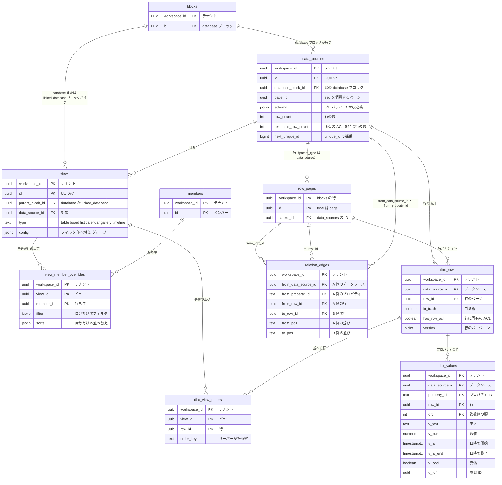

# Data model: データベース（データソース・ビュー・索引・リレーション・ロールアップ）

データベースの定義と、問い合わせの索引の表。各シャード（`shardNNN`）に置く。行はブロック（`blocks` の `type = page`、`parent_type = data_source`）で、[blocks.md](blocks.md) にある。

- 正本は、行の `blocks.properties` と `relation_edges`。`dbx_*` は問い合わせのための写しで、変更と同じ DB のトランザクションで更新する（[ADR-0014](../../decisions/0014-database-query-index.md)）。
- ロールアップ・数式は専用の表を持たない。結果を `dbx_values` に実体化する（[ADR-0015](../../decisions/0015-formula-evaluation-model.md)、[ADR-0017](../../decisions/0017-rollups-over-readable-rows-only.md)）。
- `dbx_*` は整合の検査のジョブが定期的に正本と突き合わせ、ずれたら作り直す（[databases.md](../databases.md) の 3.1 節）。
- `pg_trgm` と `btree_gin` の拡張を使う。拡張は `global` と同じく DB 全体に 1 回入れる。

## ER 図

`row_pages` は、`blocks` のうち行のページを分けて描いたもので、別の表ではない。

## data_sources

- 目的：データソース（スキーマと行の集合）。ブロックではない。`database` ブロックが 1 つ以上（上限 20）を持つ。
- 正：[databases.md](../databases.md) の 2・2.1・11 節
- 変更：ブロックと同じトランザクション・配信に乗る。`seq` は `page_id`（`database` ブロックを置いたページ）のものを消費する。`database` ブロックを別のページへ移したら、同じトランザクションで `page_id` を書き換える。
- 保持・削除：`alive = false` で削除。親の `database` ブロックのページの物理削除で、行・索引と一緒に消す。
- 規模（S1）：約 100 万行（見積もり）

| 列 | 型 | NULL | 既定 | 説明 |
| --- | --- | --- | --- | --- |
| `workspace_id` | uuid | NO | | |
| `id` | uuid | NO | | UUIDv7。クライアントが作る |
| `database_block_id` | uuid | NO | | 親の `database` ブロック |
| `page_id` | uuid | NO | | `database` ブロックの `page_id` の写し |
| `name` | text | NO | `''` | |
| `schema` | jsonb | NO | `'{}'` | プロパティ ID → `{name, type, config}`。`title` の ID は固定の `title`。リレーションは `config.target_data_source_id`・`config.dual_property_id`・`config.limit`（`one` / `none`）を持つ |
| `deleted_properties` | jsonb | NO | `'{}'` | 論理削除したプロパティ（戻せる） |
| `row_count` | int | NO | `0` | 行の数（ゴミ箱を除く）。上限 25 万の検査に使う |
| `restricted_row_count` | int | NO | `0` | 行に固有の ACL を持つ行の数。0 なら行ごとの権限の判定を省く |
| `next_unique_id` | bigint | NO | `1` | `unique_id` の次の値。この行のロックで採番する |
| `alive` | boolean | NO | `true` | |
| `created_at` / `created_by` | timestamptz / uuid | NO | | |
| `updated_at` / `updated_by` | timestamptz / uuid | NO | | |
| `version` | bigint | NO | `1` | |

- PK `(workspace_id, id)`。FK `(workspace_id, database_block_id)` → `blocks(workspace_id, id)`、`created_by`・`updated_by` → `members`。
- CHECK `row_count BETWEEN 0 AND 250000`、`restricted_row_count BETWEEN 0 AND row_count`。スキーマの大きさ（1.5MB）とプロパティの数（500）はアプリの検証で確かめる。
- 索引 `(workspace_id, database_block_id)`：ブロックからデータソースを引く。

## views

- 目的：ビューの設定。1 つのビューは 1 つのデータソースを対象にする。リンクドビューは `linked_database` ブロックに付く。
- 正：[databases.md](../databases.md) の 3.3・4 節
- 保持・削除：`alive = false` で削除。親のブロックの物理削除で消す。
- 規模（S1）：約 200 万行（見積もり）

| 列 | 型 | NULL | 既定 | 説明 |
| --- | --- | --- | --- | --- |
| `workspace_id` | uuid | NO | | |
| `id` | uuid | NO | | UUIDv7。クライアントが作る |
| `parent_block_id` | uuid | NO | | `database` か `linked_database` のブロック |
| `page_id` | uuid | NO | | 親のブロックの `page_id` の写し（`seq` を消費する） |
| `data_source_id` | uuid | NO | | 対象。同じワークスペースに限る |
| `type` | text | NO | | `table` / `board` / `list` / `calendar` / `gallery` / `timeline`（`chart` は MVP の後） |
| `name` | text | NO | `''` | |
| `config` | jsonb | NO | `'{}'` | `filter`（AND・OR、3 段まで）、`sorts`、`group_by`、`sub_group_by`、表示するプロパティ・幅・順、`open_mode`、カードのプレビュー、日付のプロパティ |
| `alive` | boolean | NO | `true` | |
| `created_at` / `created_by` | timestamptz / uuid | NO | | |
| `updated_at` / `updated_by` | timestamptz / uuid | NO | | |
| `version` | bigint | NO | `1` | |

- PK `(workspace_id, id)`。FK `(workspace_id, parent_block_id)` → `blocks`、`(workspace_id, data_source_id)` → `data_sources`。
- CHECK `type IN (...)`。1 データベースあたり 200 はアプリの検証。
- 索引 `(workspace_id, parent_block_id)`：ブロックのビューの一覧。`(workspace_id, data_source_id)`：スキーマの変更で影響するビューを引く。

## view_member_overrides

- 目的：「自分だけ」のフィルタ・並べ替え。他の人に配信しない。
- 正：[databases.md](../databases.md) の 4 節
- 保持・削除：ビューかメンバーの削除で消す。
- 規模（S1）：数十万行

| 列 | 型 | NULL | 既定 | 説明 |
| --- | --- | --- | --- | --- |
| `workspace_id` | uuid | NO | | |
| `view_id` | uuid | NO | | |
| `member_id` | uuid | NO | | |
| `filter` | jsonb | YES | | NULL なら全員の設定を使う |
| `sorts` | jsonb | YES | | 同上 |
| `updated_at` | timestamptz | NO | `now()` | |

- PK `(workspace_id, view_id, member_id)`。FK `(workspace_id, view_id)` → `views` ON DELETE CASCADE、`(workspace_id, member_id)` → `members` ON DELETE CASCADE。

## dbx_rows

- 目的：問い合わせの索引（行ごと）。行の集合の列挙もこの表で行う（行はどの `content` にも入らない）。
- 正：[databases.md](../databases.md) の 3.1 節、[ADR-0014](../../decisions/0014-database-query-index.md)
- 保持・削除：行のページの物理削除で消す。ゴミ箱の間は `in_trash = true` で残す。
- 規模（S1）：約 1,000 万行（見積もり）

| 列 | 型 | NULL | 既定 | 説明 |
| --- | --- | --- | --- | --- |
| `workspace_id` | uuid | NO | | |
| `data_source_id` | uuid | NO | | |
| `row_id` | uuid | NO | | 行のページの `blocks.id` |
| `created_at` / `created_by` | timestamptz / uuid | NO | | 行のブロックの写し |
| `updated_at` / `updated_by` | timestamptz / uuid | NO | | 同上（`last_edited_time`・`last_edited_by`） |
| `in_trash` | boolean | NO | `false` | 行か祖先がゴミ箱 |
| `has_row_acl` | boolean | NO | `false` | 行のページが `page_acls` を持つ |
| `version` | bigint | NO | | 行のブロックの `version` |

- PK `(workspace_id, data_source_id, row_id)`。FK `(workspace_id, data_source_id)` → `data_sources`、`(workspace_id, row_id)` → `blocks` ON DELETE CASCADE。
- UK `(workspace_id, row_id)`（行は 1 つのデータソースにだけ属する。T1 の読み替え）。

| 索引 | 用途のクエリ |
| --- | --- |
| `(workspace_id, data_source_id, created_at, row_id)` | 作成日時の並べ替えとキーセットのページ送り |
| `(workspace_id, data_source_id, updated_at, row_id)` | 最終編集の並べ替え |
| `(workspace_id, data_source_id) WHERE has_row_acl` | 固有の ACL を持つ行だけを判定の関数に通す（[databases.md](../databases.md) の 3.2 節） |

## dbx_values

- 目的：問い合わせの索引（プロパティの値ごと）。型ごとに 1 列だけ使う。複数値（multi_select・people・relation）は `ord` で複数行。数式・ロールアップの実体化した値も入る。
- 正：[databases.md](../databases.md) の 3.1・7・8 節、[ADR-0014](../../decisions/0014-database-query-index.md)、[ADR-0015](../../decisions/0015-formula-evaluation-model.md)
- 保持・削除：行・プロパティの削除で消す。種類の変更と数式の定義の変更は、ジョブが作り直す。
- 規模（S1）：約 2 億行（行 1,000 万 × 値のあるプロパティ 20 の見積もり）。ブロックの表の行数の数分の 1

| 列 | 型 | NULL | 既定 | 説明 |
| --- | --- | --- | --- | --- |
| `workspace_id` | uuid | NO | | |
| `data_source_id` | uuid | NO | | |
| `property_id` | text | NO | | データソースの中で一意の短い文字列 |
| `row_id` | uuid | NO | | |
| `ord` | int | NO | `0` | 複数値の順 |
| `v_text` | text COLLATE "und-x-icu" | YES | | title・rich_text・url・email・phone_number の平文（`normalizeForSearch` の後） |
| `v_num` | numeric | YES | | number、unique_id、数値の数式・ロールアップ |
| `v_ts` | timestamptz | YES | | date の開始、created_time・last_edited_time |
| `v_ts_end` | timestamptz | YES | | date の終了 |
| `v_bool` | boolean | YES | | checkbox、真偽の数式 |
| `v_ref` | uuid | YES | | select・status の選択肢 ID、people・created_by の `member_id`、relation の相手の行 |
| `trgm` | boolean | NO | `false` | 「含む」の trigram の索引の対象（title・rich_text だけ真） |
| `computed_at` | timestamptz | YES | | 数式・ロールアップを計算した時刻。計算中の表示に使う |

- PK `(workspace_id, data_source_id, property_id, row_id, ord)`。
- FK `(workspace_id, data_source_id, row_id)` → `dbx_rows` ON DELETE CASCADE。
- CHECK：`num_nonnulls(v_text, v_num, v_ts, v_bool, v_ref) <= 1`（型ごとに 1 列。空の値は行を作らない。`v_ts_end` は `v_ts` と組）、`v_ts_end IS NULL OR v_ts IS NOT NULL`、`trgm = false OR v_text IS NOT NULL`。

| 索引 | 用途のクエリ |
| --- | --- |
| `(workspace_id, data_source_id, property_id, v_num, row_id)` | 数値の範囲・並べ替え |
| `(workspace_id, data_source_id, property_id, v_ts, row_id)` | 日付の範囲・並べ替え、カレンダー・タイムラインの期間 |
| `(workspace_id, data_source_id, property_id, v_text, row_id)` | テキストの完全一致・前方一致・並べ替え（照合順序つき） |
| `(workspace_id, data_source_id, property_id, v_ref, row_id)` | 選択・人・リレーションの一致と空・非空、グループ化 |
| `(workspace_id, data_source_id, property_id, v_bool, row_id)` | チェックの一致 |
| `GIN (data_source_id, v_text gin_trgm_ops) WHERE trgm` | 「含む」（title・rich_text）。`btree_gin` で `data_source_id` を先に絞る |

- GIN の索引は `workspace_id` を先頭にしない（1 節の例外）。`data_source_id` はワークスペースの中にしかなく、RLS の条件は結果の行で効く。

## dbx_view_orders

- 目的：ビューの手動の並び（ボードでのドラッグなど）。操作は前後の行をアンカーにした形で送り、サーバーがアンカーの間の鍵を振る（[ADR-0012](../../decisions/0012-child-order-by-sibling-anchors.md)）。クライアントは鍵を作らない。2026-09-28 に、databases.md の「分数の索引」をこの形に揃えた。
- 正：[databases.md](../databases.md) の 2 節
- 保持・削除：ビュー・行の削除で消す。並べ替えのないビューで手動の並びを使うときだけ行を作る。
- 規模（S1）：数百万行

| 列 | 型 | NULL | 既定 | 説明 |
| --- | --- | --- | --- | --- |
| `workspace_id` | uuid | NO | | |
| `view_id` | uuid | NO | | |
| `row_id` | uuid | NO | | |
| `group_key` | text | NO | `''` | ボードの列（グループの値）。グループがなければ空 |
| `order_key` | text COLLATE "C" | NO | | サーバーが振る鍵。詰まったらサーバーがそのグループの鍵を振り直す |
| `updated_at` | timestamptz | NO | `now()` | |

- PK `(workspace_id, view_id, row_id)`。FK `(workspace_id, view_id)` → `views` ON DELETE CASCADE、`(workspace_id, row_id)` → `blocks` ON DELETE CASCADE。
- 索引 `(workspace_id, view_id, group_key, order_key)`：手動の並びでの読み出しとアンカーの解決。

## relation_edges

- 目的：リレーションの値の正本。両方向のリレーションは 1 本の辺を両側から見る（[ADR-0016](../../decisions/0016-relation-edges-as-single-source.md)）。
- 正：[databases.md](../databases.md) の 6 節
- 保持・削除：相手の行がゴミ箱に入っても残し、表示と計算から除く。行の物理削除で消す。
- 規模（S1）：約 2,000 万行（見積もり）

| 列 | 型 | NULL | 既定 | 説明 |
| --- | --- | --- | --- | --- |
| `workspace_id` | uuid | NO | | |
| `from_data_source_id` | uuid | NO | | A 側のデータソース。プロパティ ID はデータソースの中でだけ一意なので持つ（2026-09-28 に追加） |
| `from_property_id` | text | NO | | A 側のリレーションのプロパティ |
| `from_row_id` | uuid | NO | | A 側の行 |
| `to_row_id` | uuid | NO | | B 側の行（同じワークスペース） |
| `from_pos` | text COLLATE "C" | NO | | A 側から見た並び。サーバーが振る |
| `to_pos` | text COLLATE "C" | NO | | B 側から見た並び。サーバーが振る |
| `created_at` | timestamptz | NO | `now()` | |
| `created_by` | uuid | NO | | |

- PK `(workspace_id, from_data_source_id, from_property_id, from_row_id, to_row_id)`。
- FK `(workspace_id, from_data_source_id)` → `data_sources`、`(workspace_id, from_row_id)`・`(workspace_id, to_row_id)` → `blocks` ON DELETE CASCADE。ワークスペースをまたぐ辺は、複合の外部キーで作れない。
- 1 行・1 プロパティあたり 10,000 本と、「1 ページ」の制限は、辺を足すトランザクションで検査する。

| 索引 | 用途のクエリ |
| --- | --- |
| PK の先頭 `(workspace_id, from_data_source_id, from_property_id, from_row_id)` | A 側の値（並びは `from_pos` で並べ直す） |
| `(workspace_id, to_row_id, from_data_source_id, from_property_id, to_pos)` | B 側の値。ロールアップの影響する行の逆引き |
| `(workspace_id, from_row_id)` | 行の削除で、行から出る辺を集める |
