# Data model: global（アカウント・ワークスペース・振り分け）

スキーマ `global` のテーブル。ワークスペースをまたぐものだけを置く。規約は [data-model.md](../data-model.md) の 1 節にある。

- RLS を付けない。`global` に触れるのは専用のモジュール（`packages/global-store`）だけにし、lint で他からの参照を禁止する（[ADR-0027](../../decisions/0027-shard-router.md)）。
- シャードのテーブルから `global` へ外部キーは張らない。ID で論理的に参照する（例：`members.account_id`、`integration_installations.public_integration_id`）。
- S1 は物理クラスタ 1 つの中のスキーマ。S2 で独立した小さなクラスタに移す（[infrastructure.md](../infrastructure.md) の 3.1 節）。
- 認証のテーブル（`accounts`〜`passkeys`）は、Slack の ADR-0012（Better Auth）の形を先例にする（[permissions-and-sharing.md](../permissions-and-sharing.md) の 1・2.1 節）。

## ER 図

```mermaid
erDiagram
  accounts ||--o{ auth_identities : "ログインの手段"
  accounts ||--o{ sessions : "ログイン中"
  accounts ||--o{ two_factors : "MFA"
  accounts ||--o{ passkeys : "パスキー"
  accounts ||--o{ account_workspaces : "所属の目録"
  workspaces ||--o{ account_workspaces : "所属の目録"
  plans ||--o{ workspaces : "プラン"
  shard_map ||--o{ workspaces : "logical_shard で所在"
  shard_groups ||--o{ shard_map : "マイグレーションの群れ"
  migration_ledger ||--o{ shard_groups : "適用の状況"
  workspaces ||--o{ site_subdomains : "公開サイトのサブドメイン"
  accounts ||--o{ public_integrations : "作った開発者"
  public_integrations ||--o{ oauth_authorization_codes : "連携の認可"
  accounts ||--o{ oauth_authorization_codes : "認可した人"
  accounts ||--o{ mcp_tokens : "委任した人"
  workspaces ||--o{ mcp_tokens : "対象のワークスペース"
  accounts ||--o{ account_notification_settings : "通知の設定"
  accounts ||--o{ push_subscriptions : "端末"
  accounts ||--o{ platform_audit_events : "アカウントの操作"

  accounts {
    uuid id PK "UUIDv7"
    text email UK "小文字に正規化"
    timestamptz email_verified_at "確認の日時"
    timestamptz deleted_at "アカウントの削除"
  }
  workspaces {
    uuid id PK "UUIDv7。サーバーが作る"
    text slug UK "URL の先頭"
    text region "S1 は東京"
    int logical_shard "0 から 479"
    text status "active など"
    text plan_id FK "plans"
  }
  account_workspaces {
    uuid account_id PK "accounts"
    uuid workspace_id PK "workspaces"
    uuid member_id "シャードの members"
    timestamptz removed_at "外れた日時"
  }
  shard_map {
    text region PK "リージョン"
    int logical_shard PK "0 から 479"
    text cluster_id "物理クラスタ"
    text state "active frozen fenced"
    bigint version "割り当てのバージョン"
  }
  shard_groups {
    int logical_shard PK "0 から 479"
    text migration_group "G0 から G3"
  }
  migration_ledger {
    int logical_shard PK "0 から 479"
    text last_applied "最後に当てた番号"
    text status "適用の状態"
  }
  public_integrations {
    uuid id PK "UUIDv7"
    uuid owner_account_id FK "作った人"
    text client_secret_hash "SHA-256"
    jsonb capabilities "能力の上限"
  }
  oauth_authorization_codes {
    text code_hash PK "SHA-256"
    text kind "integration または mcp"
    uuid workspace_id "対象"
    timestamptz expires_at "10 分"
  }
  mcp_tokens {
    uuid id PK "UUIDv7"
    uuid account_id FK "委任した人"
    uuid workspace_id "対象"
    text access_token_hash UK "SHA-256"
    text refresh_token_hash UK "SHA-256"
  }
  site_subdomains {
    text subdomain PK "slug.brand.site の slug"
    uuid workspace_id FK "workspaces"
  }
  plans {
    text id PK "free plus business enterprise"
    jsonb entitlements "上限と機能"
  }
  auth_identities {
    uuid id PK "UUIDv7"
    uuid account_id FK "accounts"
    text provider "email google saml"
    text subject "提供元の ID"
  }
  sessions {
    uuid id PK "UUIDv7"
    uuid account_id FK "accounts"
    text token_hash UK "SHA-256"
    timestamptz expires_at "期限"
  }
  two_factors {
    uuid account_id PK "accounts"
    bytea secret_encrypted "KMS"
  }
  passkeys {
    uuid id PK "UUIDv7"
    uuid account_id FK "accounts"
    bytea public_key "公開鍵"
  }
  account_notification_settings {
    uuid account_id PK "accounts"
    boolean email_enabled "メール"
    boolean email_always "常にメール"
    jsonb kinds "種類ごと"
  }
  push_subscriptions {
    uuid id PK "UUIDv7"
    uuid account_id FK "accounts"
    text endpoint UK "Web Push"
  }
  email_suppressions {
    text email PK "小文字"
    text reason "bounce complaint"
  }
  platform_audit_events {
    uuid id PK "UUIDv7"
    uuid account_id FK "accounts"
    text action "login.succeeded など"
    timestamptz occurred_at "発生"
  }
```

## accounts

- 目的：ログインする人。メールアドレスで一意。テナントの中からは `members.account_id` で指す。
- 正：[permissions-and-sharing.md](../permissions-and-sharing.md) の 2.1 節、[ADR-0021](../../decisions/0021-accounts-members-guests-and-teamspaces.md)
- 保持・削除：アカウントの削除で `email` を消して匿名化し、`deleted_at` を入れる。行は 35 日（バックアップの期限）の後に消す（[security.md](../security.md) の 7 節）。
- 規模（S1）：10 万行

| 列 | 型 | NULL | 既定 | 説明 |
| --- | --- | --- | --- | --- |
| `id` | uuid | NO | | UUIDv7。サーバーが作る |
| `email` | text | YES | | 小文字に正規化したメールアドレス。削除で NULL |
| `email_verified_at` | timestamptz | YES | | 確認した日時 |
| `name` | text | YES | | アカウントの表示名（ワークスペースの表示名の初期値） |
| `locale` | text | NO | `'ja'` | `ja` / `en` |
| `time_zone` | text | YES | | IANA のタイムゾーン |
| `created_at` | timestamptz | NO | `now()` | |
| `updated_at` | timestamptz | NO | `now()` | |
| `deleted_at` | timestamptz | YES | | アカウントの削除の日時 |

- PK `(id)`。UK `(email) WHERE email IS NOT NULL`。
- CHECK：`deleted_at IS NULL OR email IS NULL`（削除したら個人情報を持たない）。

## auth_identities

- 目的：ログインの手段（メールのリンク、Google、S2 以降の SAML）と、提供元の ID。Better Auth の `account` を改名した表（Slack と同じ）。
- 正：Slack の identity-and-access.md（[permissions-and-sharing.md](../permissions-and-sharing.md) の 1 節）
- 保持・削除：アカウントの削除で消す。
- 規模（S1）：15 万行

| 列 | 型 | NULL | 既定 | 説明 |
| --- | --- | --- | --- | --- |
| `id` | uuid | NO | | UUIDv7 |
| `account_id` | uuid | NO | | `accounts.id` |
| `provider` | text | NO | | `email` / `google` / `saml:{connection_id}` |
| `subject` | text | NO | | 提供元の中の利用者の ID |
| `created_at` | timestamptz | NO | `now()` | |

- PK `(id)`。FK `account_id` → `accounts(id)` ON DELETE CASCADE。UK `(provider, subject)`。
- 索引 `(account_id)`：アカウントのログインの手段の一覧。

## sessions

- 目的：ブラウザ・デスクトップのセッション。WebSocket のチケットもここから発行する。
- 正：Slack の ADR-0012 を先例にする（[permissions-and-sharing.md](../permissions-and-sharing.md) の 1 節）
- 保持・削除：期限切れと取り消しの行は 30 日後に消す。
- 規模（S1）：30 万行

| 列 | 型 | NULL | 既定 | 説明 |
| --- | --- | --- | --- | --- |
| `id` | uuid | NO | | UUIDv7 |
| `account_id` | uuid | NO | | `accounts.id` |
| `token_hash` | text | NO | | セッションのトークンの SHA-256。平文は持たない |
| `ip` | inet | YES | | 作成時の IP |
| `user_agent` | text | YES | | |
| `created_at` | timestamptz | NO | `now()` | |
| `expires_at` | timestamptz | NO | | |
| `revoked_at` | timestamptz | YES | | 取り消し。取り消すと `ws:{w}:m:{member_id}` へ失効を流す |

- PK `(id)`。FK `account_id` → `accounts(id)`。UK `(token_hash)`。
- 索引 `(account_id, expires_at)`：ログイン中の端末の一覧と一括の取り消し。

## verifications、two_factors、passkeys

Better Auth の表をそのまま使う（Slack と同じ）。列の細部は E2 の `spec.md` で決める。

| 表 | 主な列 | 制約 |
| --- | --- | --- |
| `verifications` | `id`、`identifier`（メールアドレス）、`value_hash`、`expires_at`、`created_at` | PK `(id)`、索引 `(identifier)`。期限の 1 日後に消す |
| `two_factors` | `account_id`、`secret_encrypted`（bytea、KMS）、`backup_codes_hash`（text[]）、`enabled_at` | PK `(account_id)`、FK → `accounts` |
| `passkeys` | `id`、`account_id`、`credential_id`、`public_key`（bytea）、`counter`、`created_at` | PK `(id)`、UK `(credential_id)`、FK → `accounts` |

## workspaces

- 目的：ワークスペースの一覧と所在。論理シャードとリージョンの正本。
- 正：[ADR-0027](../../decisions/0027-shard-router.md)、[infrastructure.md](../infrastructure.md) の 3・11 節
- 保持・削除：削除の依頼で `status = pending_deletion`、30 日の猶予の後に `deleted`。行は監査のために残し、`name`・`slug` を消す（[security.md](../security.md) の 7 節）。
- 規模（S1）：2 万行（見積もり）

| 列 | 型 | NULL | 既定 | 説明 |
| --- | --- | --- | --- | --- |
| `id` | uuid | NO | | UUIDv7。必ずサーバーが作る（ADR-0027） |
| `slug` | text | YES | | URL `/{workspace_slug}/{page_id}` の先頭。削除で NULL |
| `name` | text | YES | | 削除で NULL |
| `icon_file_id` | uuid | YES | | シャードの `files.id` |
| `region` | text | NO | `'ap-northeast-1'` | 所在のリージョン。S3 の段階で意味を持つ（[infrastructure.md](../infrastructure.md) の 11 節） |
| `logical_shard` | int | NO | | ID から計算した値の控え。ルーターが計算と照合する |
| `status` | text | NO | `'active'` | `active` / `suspended` / `pending_deletion` / `deleted` |
| `plan_id` | text | NO | `'free'` | `plans.id` |
| `created_by_account_id` | uuid | NO | | 作った人 |
| `created_at` | timestamptz | NO | `now()` | |
| `deletion_requested_at` | timestamptz | YES | | 削除の依頼 |
| `deleted_at` | timestamptz | YES | | 物理削除の完了 |

- PK `(id)`。FK `plan_id` → `plans(id)`。UK `(slug) WHERE slug IS NOT NULL`。
- CHECK：`logical_shard BETWEEN 0 AND 479`。`status IN (...)`。
- 索引 `(slug)`：URL からワークスペースを引く。`(status, deletion_requested_at) WHERE status = 'pending_deletion'`：猶予の切れた削除を拾う。

## account_workspaces

- 目的：アカウントが属するワークスペースの目録。ワークスペースの切り替えの一覧と、ログイン後の振り分けに使う。**正本はシャードの `members`** で、これは写しである（2026-09-28 の決定。[README.md](../README.md) の決定）。
- 更新：`members` を変えたトランザクションが outbox に `member.changed` を積み、Worker がこの行を upsert する。数秒遅れうる。要求の認可には使わない（認可は必ずシャードの `members` で行う）。
- 保持・削除：外れたら `removed_at` を入れ、30 日後に消す。
- 規模（S1）：15 万行

| 列 | 型 | NULL | 既定 | 説明 |
| --- | --- | --- | --- | --- |
| `account_id` | uuid | NO | | `accounts.id` |
| `workspace_id` | uuid | NO | | `workspaces.id` |
| `member_id` | uuid | NO | | シャードの `members.id` |
| `role` | text | NO | | 表示用の写し |
| `updated_at` | timestamptz | NO | `now()` | |
| `removed_at` | timestamptz | YES | | 無効化・削除 |

- PK `(account_id, workspace_id)`。FK `account_id` → `accounts(id)`、`workspace_id` → `workspaces(id)`。
- 索引 `(workspace_id)`：ワークスペースの削除での一括の片付け。

## plans

- 目的：プランと権利（上限・機能）。Slack の ADR-0032 を先例にする（[permissions-and-sharing.md](../permissions-and-sharing.md) の 2.3 節）。課金の表は MVP の範囲外で、ここでは定義しない。
- 規模（S1）：4 行

| 列 | 型 | NULL | 既定 | 説明 |
| --- | --- | --- | --- | --- |
| `id` | text | NO | | `free` / `plus` / `business` / `enterprise` |
| `entitlements` | jsonb | NO | `'{}'` | `guest_limit`、`history_days`、`api_rate_per_min` など |
| `updated_at` | timestamptz | NO | `now()` | |

- PK `(id)`。
- API は `plans` をプロセスの中にキャッシュする。ゲストの上限などの検査は、シャードのトランザクションの中で数えた値と、キャッシュの上限を比べる。

## shard_map

- 目的：論理シャード → 物理クラスタの割り当ての正本。状態でフェンスと切り替えを表す。
- 正：[ADR-0027](../../decisions/0027-shard-router.md)、[ADR-0028](../../decisions/0028-zero-downtime-resharding.md)
- 規模：リージョンごとに 480 行

| 列 | 型 | NULL | 既定 | 説明 |
| --- | --- | --- | --- | --- |
| `region` | text | NO | | リージョン |
| `logical_shard` | int | NO | | 0〜479 |
| `cluster_id` | text | NO | | 物理クラスタの名前 |
| `state` | text | NO | `'active'` | `active` / `frozen` / `fenced` |
| `version` | bigint | NO | `1` | 変更ごとに 1 増やす。各タスクの読み直しで比べる |
| `updated_at` | timestamptz | NO | `now()` | |

- PK `(region, logical_shard)`。CHECK `logical_shard BETWEEN 0 AND 479`、`state IN ('active','frozen','fenced')`。
- 各タスクは 10 秒ごとと、フェンスのエラーで読み直す（[infrastructure.md](../infrastructure.md) の 3.3 節）。

## shard_groups

- 目的：マイグレーションの群れ（G0〜G3）の割り当て（[ADR-0031](../../decisions/0031-migration-rollout-by-shard-groups.md)）。
- 規模：480 行

| 列 | 型 | NULL | 既定 | 説明 |
| --- | --- | --- | --- | --- |
| `logical_shard` | int | NO | | 0〜479 |
| `migration_group` | text | NO | | `G0` / `G1` / `G2` / `G3` |

- PK `(logical_shard)`。CHECK `migration_group IN ('G0','G1','G2','G3')`。

## migration_ledger

- 目的：各シャードの `schema_migrations` の集約。デプロイの関門が読む（[ADR-0031](../../decisions/0031-migration-rollout-by-shard-groups.md)、[delivery.md](../delivery.md) の 7 節）。
- 規模：480 行

| 列 | 型 | NULL | 既定 | 説明 |
| --- | --- | --- | --- | --- |
| `logical_shard` | int | NO | | 0〜479 |
| `last_applied` | text | NO | | 最後に当てたマイグレーションの番号 |
| `status` | text | NO | | `ok` / `running` / `failed` |
| `last_error` | text | YES | | 失敗の要約 |
| `updated_at` | timestamptz | NO | `now()` | |

- PK `(logical_shard)`。索引 `(status)`：失敗したシャードの一覧。

## search_cluster_map（S2 から）

- 目的：論理シャード → 検索のドメインの割り当て（[search.md](../search.md) の 9.2 節）。S1 は 1 ドメインなので空。

| 列 | 型 | NULL | 既定 | 説明 |
| --- | --- | --- | --- | --- |
| `logical_shard` | int | NO | | 0〜479 |
| `search_cluster` | text | NO | | 検索のドメインの名前 |
| `state` | text | NO | `'active'` | `active` / `dual_write`（移行中の二重書き込み） |
| `next_search_cluster` | text | YES | | 移行先 |

- PK `(logical_shard)`。

## site_subdomains

- 目的：公開サイトのサブドメイン `{subdomain}.<brand>.site` → ワークスペース。公開の描画サービスが、ホスト名からシャードを決めるために引く（[permissions-and-sharing.md](../permissions-and-sharing.md) の 8 節）。
- 保持・削除：ワークスペースの削除で消す。取り下げても予約は 30 日残し、他のワークスペースに渡さない（フィッシングの対策）。
- 規模（S1）：数千行

| 列 | 型 | NULL | 既定 | 説明 |
| --- | --- | --- | --- | --- |
| `subdomain` | text | NO | | 小文字の英数字とハイフン |
| `workspace_id` | uuid | NO | | `workspaces.id` |
| `created_at` | timestamptz | NO | `now()` | |
| `released_at` | timestamptz | YES | | 手放した日時 |

- PK `(subdomain)`。FK `workspace_id` → `workspaces(id)`。UK `(workspace_id) WHERE released_at IS NULL`（1 ワークスペース 1 つ）。

## public_integrations

- 目的：公開の連携（OAuth のクライアント）の定義。複数のワークスペースに入る。
- 正：[api-and-integrations.md](../api-and-integrations.md) の 3.1・12 節、[ADR-0024](../../decisions/0024-integration-access-model.md)
- 規模（S1）：数百行

| 列 | 型 | NULL | 既定 | 説明 |
| --- | --- | --- | --- | --- |
| `id` | uuid | NO | | UUIDv7。OAuth の `client_id` |
| `name` | text | NO | | |
| `owner_account_id` | uuid | NO | | 作った開発者 |
| `client_secret_hash` | text | NO | | SHA-256。平文は作成時に一度だけ見せる |
| `redirect_uris` | text[] | NO | | 完全一致で照合する |
| `capabilities` | jsonb | NO | | 要求する能力（3.3 節） |
| `status` | text | NO | `'active'` | `active` / `suspended` |
| `created_at` | timestamptz | NO | `now()` | |

- PK `(id)`。FK `owner_account_id` → `accounts(id)`。索引 `(owner_account_id)`。

## oauth_authorization_codes

- 目的：OAuth 2.1 の認可コード。公開の連携（`integration`）と MCP（`mcp`）の両方。コードは 1 回だけ使える。
- 流れ：認可の画面で、シャードに `integration_installations`・ACL の項目（公開の連携）または `mcp_grants`（MCP）を書いてから、このコードを発行する。トークンのエンドポイントは、コードを消費してからトークンを発行する。公開の連携のトークンはシャードの `api_tokens`、MCP のトークンは `mcp_tokens` に入る。
- 保持・削除：期限（10 分）の 1 日後に消す。
- 規模（S1）：数千行

| 列 | 型 | NULL | 既定 | 説明 |
| --- | --- | --- | --- | --- |
| `code_hash` | text | NO | | SHA-256 |
| `kind` | text | NO | | `integration` / `mcp` |
| `client_id` | text | NO | | 公開の連携の ID、または CIMD の URL |
| `account_id` | uuid | NO | | 認可した人 |
| `workspace_id` | uuid | NO | | 対象のワークスペース |
| `member_id` | uuid | NO | | 認可した人のメンバー |
| `installation_id` | uuid | YES | | `kind = integration` のとき、シャードの `integration_installations.id` |
| `scopes` | text[] | NO | `'{}'` | MCP のスコープ |
| `redirect_uri` | text | NO | | |
| `code_challenge` | text | NO | | PKCE（S256） |
| `expires_at` | timestamptz | NO | | 発行から 10 分 |
| `consumed_at` | timestamptz | YES | | 使った日時 |

- PK `(code_hash)`。FK `account_id` → `accounts(id)`。CHECK `kind IN ('integration','mcp')`、`(kind = 'integration') = (installation_id IS NOT NULL)`。
- 索引 `(expires_at)`：期限切れの掃除。

## mcp_tokens

- 目的：MCP のアクセストークンとリフレッシュトークン。`global` の認可サーバーが発行して持つ（[api-and-integrations.md](../api-and-integrations.md) の 12 節、[ADR-0026](../../decisions/0026-remote-mcp-server.md)）。同意と管理者の許可はシャードの `mcp_grants` にある。
- 期限：アクセス 1 時間、リフレッシュ 30 日で使うたびに入れ替える（Slack の ADR-0028 と同じ）。
- 保持・削除：リフレッシュの期限か取り消しの 30 日後に消す。
- 規模（S1）：数万行

| 列 | 型 | NULL | 既定 | 説明 |
| --- | --- | --- | --- | --- |
| `id` | uuid | NO | | UUIDv7 |
| `account_id` | uuid | NO | | 委任した人 |
| `workspace_id` | uuid | NO | | 対象のワークスペース |
| `member_id` | uuid | NO | | 委任した人のメンバー |
| `client_id` | text | NO | | CIMD の URL |
| `scopes` | text[] | NO | | `content:read` など |
| `access_token_hash` | text | NO | | SHA-256 |
| `access_expires_at` | timestamptz | NO | | |
| `refresh_token_hash` | text | NO | | SHA-256 |
| `refresh_expires_at` | timestamptz | NO | | |
| `replaced_by` | uuid | YES | | 入れ替えた先の行 |
| `revoked_at` | timestamptz | YES | | |
| `created_at` | timestamptz | NO | `now()` | |

- PK `(id)`。FK `account_id` → `accounts(id)`、`workspace_id` → `workspaces(id)`。UK `(access_token_hash)`、`(refresh_token_hash)`。
- 索引 `(account_id, workspace_id, client_id)`：同意の取り消しで、そのクライアントのトークンを一括で取り消す。

## account_notification_settings

- 目的：アカウントの通知の設定（メール、常にメール、push、種類ごと）。ページの購読の水準はシャードの `page_subscriptions`（[comments-and-notifications.md](../comments-and-notifications.md) の 5.6 節）。
- 規模（S1）：10 万行

| 列 | 型 | NULL | 既定 | 説明 |
| --- | --- | --- | --- | --- |
| `account_id` | uuid | NO | | `accounts.id` |
| `email_enabled` | boolean | NO | `true` | |
| `email_always` | boolean | NO | `false` | 在席に関係なく 5 分後に送る |
| `push_enabled` | boolean | NO | `true` | デスクトップ・Web の push |
| `kinds` | jsonb | NO | `'{}'` | 種類ごとのオン・オフ（`{"reminder": false}` など） |
| `updated_at` | timestamptz | NO | `now()` | |

- PK `(account_id)`。FK → `accounts(id)` ON DELETE CASCADE。

## push_subscriptions

- 目的：Web Push とデスクトップの push の宛先（[comments-and-notifications.md](../comments-and-notifications.md) の 5.5 節）。
- 保持・削除：送信で 404・410 が返ったら消す。ログアウトで消す。
- 規模（S1）：15 万行

| 列 | 型 | NULL | 既定 | 説明 |
| --- | --- | --- | --- | --- |
| `id` | uuid | NO | | UUIDv7 |
| `account_id` | uuid | NO | | |
| `session_id` | uuid | YES | | 作ったセッション |
| `endpoint` | text | NO | | push サービスの URL |
| `p256dh` | text | NO | | 公開鍵 |
| `auth_secret_encrypted` | bytea | NO | | KMS で暗号化 |
| `created_at` | timestamptz | NO | `now()` | |

- PK `(id)`。FK `account_id` → `accounts(id)` ON DELETE CASCADE。UK `(endpoint)`。索引 `(account_id)`。

## email_suppressions

- 目的：SES のバウンスと苦情で、送信を止めた宛先（[comments-and-notifications.md](../comments-and-notifications.md) の 5.4 節）。
- 規模（S1）：数千行

| 列 | 型 | NULL | 既定 | 説明 |
| --- | --- | --- | --- | --- |
| `email` | text | NO | | 小文字 |
| `reason` | text | NO | | `bounce` / `complaint` / `unsubscribe_all` |
| `created_at` | timestamptz | NO | `now()` | |

- PK `(email)`。

## platform_audit_events

- 目的：ワークスペースに属さない監査の記録。アカウントのログインの成功・失敗、MFA の変更、セッションの取り消し、運用者のワークスペースをまたぐ操作。ワークスペースに属する操作はシャードの `audit_events`（[operations.md](operations.md)）。Slack の `platform_audit_events` と同じ位置づけ（2026-09-28 の決定。[security.md](../security.md) の 6 節）。
- 方式：`audit_events` と同じく追記だけ。ハッシュの連鎖を付けて Object Lock の S3 へ送る。
- パーティション：`occurred_at` で月ごと。
- 保持・削除：DB に 365 日、アーカイブ 2 年。
- 規模（S1）：1 日 10 万行（ログインの成功・失敗）、365 日で約 3,600 万行

| 列 | 型 | NULL | 既定 | 説明 |
| --- | --- | --- | --- | --- |
| `id` | uuid | NO | | UUIDv7 |
| `occurred_at` | timestamptz | NO | `now()` | パーティションの鍵 |
| `account_id` | uuid | YES | | 対象のアカウント（失敗したログインでは NULL がある） |
| `actor_kind` | text | NO | | `human` / `operator` / `system` |
| `operator_id` | text | YES | | 運用者の ID |
| `action` | text | NO | | `login.succeeded`、`login.failed`、`mfa.changed`、`session.revoked` など |
| `ip` | inet | YES | | |
| `user_agent` | text | YES | | |
| `details` | jsonb | NO | `'{}'` | ID だけ |
| `prev_hash` | bytea | NO | | 直前の行のハッシュ |
| `hash` | bytea | NO | | この行のハッシュ |

- PK `(id, occurred_at)`（パーティションの鍵を含める。1 節）。
- 索引 `(account_id, occurred_at)`：アカウントの操作の履歴。
