# Data model: 運用（outbox・削除・監査・濫用・上限・マイグレーション）

配信とジョブのイベント、削除のジョブ、監査ログ、濫用の通報、上限の上書き、マイグレーションの記録、Relay のリース。`relay_leases` 以外は各シャード（`shardNNN`）に置く。

## ER 図

```mermaid
erDiagram
  relay_leases ||--o{ outbox : "論理シャードごとに id の順に読む"
  page_seqs ||--o{ outbox : "page.committed の seq"
  blocks ||--o{ deletion_jobs : "page_purge の対象"
  members ||--o{ audit_events : "操作した人"
  published_sites ||--o{ abuse_reports : "通報の対象"
  integrations ||--o{ rate_limit_overrides : "連携の上限"
  schema_migrations ||--o{ migration_ledger : "global へ集約"

  outbox {
    bigint id PK "シャードの中の連番"
    timestamptz created_at PK "パーティションの鍵"
    uuid workspace_id "テナント"
    uuid page_id "ページのイベントのとき"
    text event_type "page.committed など"
    jsonb payload "中身"
    jsonb trace_context "W3C"
  }
  relay_leases {
    int logical_shard PK "cluster_local スキーマ"
    text holder "Relay のタスク"
    timestamptz expires_at "10 秒"
    bigint last_sent_id "送り終えた id"
  }
  deletion_jobs {
    uuid workspace_id PK "テナント"
    uuid id PK "UUIDv7"
    text kind "page_purge workspace_delete history_expire"
    uuid target_id "対象"
    text state "scheduled running done failed"
    timestamptz scheduled_at "実行の予定"
  }
  audit_events {
    uuid workspace_id PK "テナント"
    uuid id PK "UUIDv7"
    timestamptz occurred_at PK "パーティションの鍵"
    uuid actor_member_id FK "操作した人"
    text action "操作"
    bytea hash "ハッシュの連鎖"
  }
  abuse_reports {
    uuid workspace_id PK "テナント"
    uuid id PK "UUIDv7"
    uuid site_id FK "published_sites"
    text source "user_report auto_scan"
    text state "open reviewing actioned dismissed"
  }
  rate_limit_overrides {
    uuid workspace_id PK "テナント"
    uuid id PK "UUIDv7"
    text limit_name "上限の名前"
    int value "値"
    timestamptz expires_at "期限"
  }
  schema_migrations {
    text version PK "マイグレーションの番号"
    timestamptz applied_at "当てた日時"
  }
  migration_ledger {
    int logical_shard PK "global"
    text last_applied "最後の番号"
  }
  page_seqs {
    uuid workspace_id PK "テナント"
    uuid page_id PK "ページ"
  }
  blocks {
    uuid workspace_id PK "テナント"
    uuid id PK "ページ"
  }
  members {
    uuid workspace_id PK "テナント"
    uuid id PK "メンバー"
  }
  published_sites {
    uuid workspace_id PK "テナント"
    uuid id PK "公開サイト"
  }
  integrations {
    uuid workspace_id PK "テナント"
    uuid id PK "連携"
  }
```

## outbox

- 目的：配信とジョブのイベント。変更と同じトランザクションで書き、Relay が Valkey と SQS へ送る（Slack の ADR-0002 と同じ考え方）。
- 正：[collaboration.md](../collaboration.md) の 7・7.3 節、[capacity.md](../capacity.md) の 3.1 節
- 読み手：論理シャードごとのリースを持つ 1 つの Relay のタスクが、`id` の順に読む。DB ロール `relay` は `outbox` の読み取りだけを持つ（RLS のポリシーは `relay` に全行を許す）。
- パーティション：`created_at` の日ごと。送り終えて 2 日たったパーティションを `DROP` する。
- 規模（S1）：1 日 約 1 億行（1,000 tx/秒のピークの見積もり）、3 日で約 3 億行

| 列 | 型 | NULL | 既定 | 説明 |
| --- | --- | --- | --- | --- |
| `id` | bigint | NO | シーケンス | シャードのスキーマごとのシーケンス。再シャーディングの切り替えの前に、移動先のシーケンスを進める（[ADR-0028](../../decisions/0028-zero-downtime-resharding.md)） |
| `created_at` | timestamptz | NO | `now()` | |
| `workspace_id` | uuid | NO | | |
| `page_id` | uuid | YES | | ページのイベントのとき |
| `event_type` | text | NO | | 下の表 |
| `payload` | jsonb | NO | | 下の表。`page.committed` だけが操作の本体（`ops`）を持つ |
| `trace_context` | jsonb | YES | | W3C Trace Context（[observability.md](../observability.md)） |

- PK `(id, created_at)`。索引は PK だけ（Relay は `id > last_sent_id` を読む）。
- `workspace_id` を先頭にしない（1 節の例外。Relay がワークスペースをまたいで読む）。

イベントと送り先：

| `event_type` | `payload` | 送り先 |
| --- | --- | --- |
| `page.committed` | `{ page_id, seq, tx_id, actor_id, device_id, tx_counter, via, records: [{ type, id, version }], ops }`（`ops` は `page_ops.ops` と同じ） | Valkey `ws:{w}:pg:{page_id}`（行のページなら、データソースの `page_id` のチャンネルにも）、SQS `search-index`・`notify-events`・`db-recompute` |
| `acl.changed` | `{ acl_version, root_page_id? }` | Valkey `ws:{w}:acl`、SQS `search-acl` |
| `member.changed` | `{ member_id, account_id?, role, deactivated }` | Valkey `ws:{w}:m:{member_id}`、SQS `directory-sync`（`global.account_workspaces` の更新） |
| `inbox.created` | `{ member_id, inbox_item_id }` | Valkey `ws:{w}:m:{member_id}`（バッジの更新） |
| `job.requested` | `{ job_kind: import / export / reindex, job_id }` | SQS `import-export` |
| `site.changed` | `{ site_id, page_id, action: published / unpublished / suspended }` | CDN の無効化の Worker（SQS `notify-events` の一種として） |

- Relay は、Valkey へは `payload` をそのまま送り、SQS へは `ops` を除いて送る（SQS の 256KB の上限と、Worker が DB から読み直すため）。読める接続にだけ送るのは、Gateway の購読の判定で守る（[collaboration.md](../collaboration.md) の 7.2 節）。
- Webhook は、通知の計画（`notify-events`）が購読を選び、30 秒の窓でまとめて `webhook_deliveries` を作り、`webhook-delivery` のキューへ入れる。
- `db-recompute`（ロールアップと行をまたぐ数式の計算し直し）と `directory-sync` は、2026-09-28 に足したキュー（[capacity.md](../capacity.md) の 2.6 節）。

## relay_leases（`cluster_local` スキーマ）

- 目的：論理シャードごとの Relay のリースと、送り終えた位置。物理クラスタの中に持ち、`global` に置かない（[collaboration.md](../collaboration.md) の 7.3 節）。
- 置き場所：各物理クラスタのスキーマ `cluster_local`（2026-09-28 に名前を決めた）。論理レプリケーションの対象にしない。
- 規模：物理クラスタが持つ論理シャードの数（S1 は 480 行）

| 列 | 型 | NULL | 既定 | 説明 |
| --- | --- | --- | --- | --- |
| `logical_shard` | int | NO | | 0〜479 |
| `holder` | text | YES | | リースを持つ Relay のタスク |
| `expires_at` | timestamptz | YES | | 期限 10 秒。5 秒ごとに延ばす |
| `last_sent_id` | bigint | NO | `0` | 送り終えた `outbox.id` |
| `updated_at` | timestamptz | NO | `now()` | |

- PK `(logical_shard)`。
- 再シャーディングでは、移動元の Relay が残りを送り終えてからリースを手放す。移動先の行は、移動元の `last_sent_id` から始める。

## deletion_jobs

- 目的：物理削除・ワークスペースの削除・履歴の期限切れの進み具合と再実行。
- 正：[security.md](../security.md) の 7 節、[ADR-0022](../../decisions/0022-trash-history-and-deletion-retention.md)
- 取り出し：`sweeper` がワークスペースをまたいで `scheduled_at <= now()` を拾い、ワークスペースのコンテキストで実行する。
- 保持・削除：`done` の 90 日後に消す。`workspace_delete` の完了で、そのワークスペースの行はすべて消える。
- 規模（S1）：数百万行

| 列 | 型 | NULL | 既定 | 説明 |
| --- | --- | --- | --- | --- |
| `workspace_id` | uuid | NO | | |
| `id` | uuid | NO | | UUIDv7 |
| `kind` | text | NO | | `page_purge` / `workspace_delete` / `history_expire` |
| `target_id` | uuid | NO | | ページ、またはワークスペース |
| `state` | text | NO | `'scheduled'` | `scheduled` / `running` / `done` / `failed` |
| `scheduled_at` | timestamptz | NO | | `purged_at` の 30 日後など |
| `attempts` | int | NO | `0` | |
| `progress` | jsonb | NO | `'{}'` | 消した段（行・ファイル・スナップショット・操作のログ・索引・コメント・通知）。途中からやり直す |
| `last_error` | text | YES | | |
| `completed_at` | timestamptz | YES | | |

- PK `(workspace_id, id)`。CHECK `kind IN (...)`、`state IN (...)`。UK `(workspace_id, kind, target_id) WHERE state <> 'done'`（同じ対象を二重に予約しない）。
- 索引 `(workspace_id, state, scheduled_at)`：ワークスペースの削除の進み具合。`(scheduled_at) WHERE state IN ('scheduled','failed')`：`sweeper` の取り出し（例外）。

## audit_events

- 目的：ワークスペースの監査ログ。操作と同じトランザクションで追記し、ハッシュの連鎖を付けて Object Lock の S3 へ送る。ワークスペースに属さない記録は `global.platform_audit_events`。
- 正：[security.md](../security.md) の 6 節
- DB ロール：`app` には `INSERT` だけを許し、`UPDATE`・`DELETE` を許さない。
- パーティション：`occurred_at` の月ごと。365 日を過ぎたパーティションを `DROP` する。アーカイブは 2 年。
- 規模（S1）：1 日 約 20 万行、365 日で約 7,300 万行（見積もり）

| 列 | 型 | NULL | 既定 | 説明 |
| --- | --- | --- | --- | --- |
| `workspace_id` | uuid | NO | | |
| `id` | uuid | NO | | UUIDv7 |
| `occurred_at` | timestamptz | NO | `now()` | |
| `actor_member_id` | uuid | YES | | 運用者の操作では NULL |
| `actor_kind` | text | NO | | `human` / `bot` / `mcp` / `operator` |
| `operator_id` | text | YES | | 運用者の ID |
| `action` | text | NO | | `page.share_changed`、`site.published`、`member.deactivated` など |
| `target_type` | text | NO | | `page` / `teamspace` / `member` / `integration` / `workspace` |
| `target_id` | uuid | YES | | |
| `ip` | inet | YES | | |
| `user_agent` | text | YES | | |
| `details` | jsonb | NO | `'{}'` | ID だけ。本文を含めない |
| `prev_hash` | bytea | NO | | ワークスペースの中の直前の行のハッシュ |
| `hash` | bytea | NO | | |

- PK `(workspace_id, id, occurred_at)`。CHECK `actor_kind IN (...)`、`actor_kind = 'operator' OR actor_member_id IS NOT NULL`。
- 索引 `(workspace_id, occurred_at)`：期間での閲覧・CSV（E10）。`(workspace_id, target_id)`：対象ごとの履歴。

## abuse_reports

- 目的：公開サイトの通報と自動の検査の結果、確認の状態。
- 正：[security.md](../security.md) の 8 節
- 読み手：運用の道具が `sweeper` のロールで各シャードの未処理の行を集める。
- 保持・削除：決着の 1 年後に消す（法務の確認待ちの L3 に従って見直す）。
- 規模（S1）：数万行

| 列 | 型 | NULL | 既定 | 説明 |
| --- | --- | --- | --- | --- |
| `workspace_id` | uuid | NO | | |
| `id` | uuid | NO | | UUIDv7 |
| `site_id` | uuid | NO | | `published_sites.id` |
| `page_id` | uuid | NO | | |
| `source` | text | NO | | `user_report` / `auto_scan` |
| `reporter_email` | text | YES | | 任意 |
| `reason` | text | NO | | `phishing` / `malware` / `spam` / `other` |
| `score` | numeric | YES | | 自動の検査の点数 |
| `state` | text | NO | `'open'` | `open` / `reviewing` / `actioned` / `dismissed` |
| `reviewed_by` | text | YES | | 運用者 |
| `created_at` | timestamptz | NO | `now()` | |
| `resolved_at` | timestamptz | YES | | |

- PK `(workspace_id, id)`。FK `(workspace_id, site_id)` → `published_sites`。
- 索引 `(workspace_id, state, created_at)`、`(state, created_at) WHERE state IN ('open','reviewing')`（`sweeper` の例外）。

## rate_limit_overrides

- 目的：ワークスペース・連携ごとの上限の一時的な変更。変更は監査ログに残す。
- 正：[capacity.md](../capacity.md) の 3.5 節
- 保持・削除：期限の 30 日後に消す。期限を過ぎた行は効かない。
- 規模（S1）：数百行

| 列 | 型 | NULL | 既定 | 説明 |
| --- | --- | --- | --- | --- |
| `workspace_id` | uuid | NO | | |
| `id` | uuid | NO | | UUIDv7 |
| `target` | text | NO | | `workspace` / `integration` |
| `integration_id` | uuid | YES | | `target = integration` のとき |
| `limit_name` | text | NO | | `tx_per_sec`、`api_per_min` など |
| `value` | int | NO | | |
| `reason` | text | NO | | |
| `created_by` | text | NO | | 運用者 |
| `created_at` | timestamptz | NO | `now()` | |
| `expires_at` | timestamptz | NO | | |

- PK `(workspace_id, id)`。CHECK `(target = 'integration') = (integration_id IS NOT NULL)`。索引 `(workspace_id, expires_at)`。

## schema_migrations

- 目的：このシャードのスキーマに当てたマイグレーション。`global.migration_ledger` に集める（[ADR-0031](../../decisions/0031-migration-rollout-by-shard-groups.md)）。
- 例外：テナントのデータではないので `workspace_id` と RLS を持たない。`migrator` だけが読み書きする。

| 列 | 型 | NULL | 既定 | 説明 |
| --- | --- | --- | --- | --- |
| `version` | text | NO | | マイグレーションの番号 |
| `checksum` | text | NO | | 内容のハッシュ（別の内容の再適用を止める） |
| `applied_at` | timestamptz | NO | `now()` | |
| `duration_ms` | int | NO | | |

- PK `(version)`。
