# Data model: メンバー・権限・共有

メンバー、グループ、チームスペース、ページの ACL、ワークスペースの設定と方針、公開サイト。各シャード（`shardNNN`）に置く。判定の規則は [permissions-and-sharing.md](../permissions-and-sharing.md) にある。

- ACL の主体のキーは文字列 `user:{member_id}`・`group:{group_id}`・`team:{teamspace_id}`・`ws:{workspace_id}`・`bot:{integration_id}`・`public` にする（[permissions-and-sharing.md](../permissions-and-sharing.md) の 4.3 節、[search.md](../search.md) の 5.1 節）。`page_acl_entries` には `user:`・`group:`・`bot:` だけを置き、`ws:`・`public` は `page_general_access`、`team:` はチームスペースの暗黙の ACL で表す。
- 権限に影響する変更は、同じトランザクションで `workspace_acl_versions.acl_version` を上げる（[ADR-0019](../../decisions/0019-workspace-acl-version-cache.md)）。下の各表の「acl_version」の欄に、上げるかを書く。

## ER 図

```mermaid
erDiagram
  members ||--o{ group_members : "所属"
  groups ||--o{ group_members : "メンバー"
  members ||--o{ teamspace_members : "参加"
  teamspaces ||--o{ teamspace_members : "メンバー"
  members ||--o{ favorites : "お気に入り"
  blocks ||--o{ favorites : "対象のページ"
  blocks ||--o{ page_acls : "ACL を持つページ"
  page_acls ||--o{ page_acl_entries : "項目"
  page_acls ||--o{ page_general_access : "一般アクセス"
  members ||--o{ page_acl_entries : "user と bot の主体"
  groups ||--o{ page_acl_entries : "group の主体"
  members ||--o{ invitations : "招待した人"
  members ||--o{ guest_requests : "申請した人"
  blocks ||--o{ published_sites : "公開したページ"
  workspace_acl_versions ||--o{ page_acls : "変更で版を上げる"
  workspace_settings ||--o{ members : "招待の方針"
  workspace_security_policies ||--o{ published_sites : "公開の禁止"

  members {
    uuid workspace_id PK "テナント"
    uuid id PK "UUIDv7"
    uuid account_id UK "連携は NULL"
    text kind "human または bot"
    text role "owner membership_admin member guest"
    uuid_array private_page_ids "プライベートのページの並び"
    timestamptz deactivated_at "無効化"
  }
  groups {
    uuid workspace_id PK "テナント"
    uuid id PK "UUIDv7"
    text name "名前"
  }
  group_members {
    uuid workspace_id PK "テナント"
    uuid group_id PK "グループ"
    uuid member_id PK "メンバー"
  }
  teamspaces {
    uuid workspace_id PK "テナント"
    uuid id PK "UUIDv7"
    text type "default open closed private"
    text member_access_level "既定 can_edit"
    text workspace_access_level "既定 can_view"
    uuid_array page_ids "最上位のページの並び"
  }
  teamspace_members {
    uuid workspace_id PK "テナント"
    uuid teamspace_id PK "チームスペース"
    uuid member_id PK "メンバー"
    text role "owner または member"
  }
  favorites {
    uuid workspace_id PK "テナント"
    uuid member_id PK "持ち主"
    uuid page_id PK "ページ"
    text order_key "並び"
  }
  page_acls {
    uuid workspace_id PK "テナント"
    uuid page_id PK "ACL を持つページ"
    bigint version "ACL の版"
  }
  page_acl_entries {
    uuid workspace_id PK "テナント"
    uuid page_id PK "ページ"
    text principal PK "user group bot のキー"
    text level "can_view から full_access"
    timestamptz expires_at "期限"
  }
  page_general_access {
    uuid workspace_id PK "テナント"
    uuid page_id PK "ページ"
    text scope PK "workspace または public"
    text level "水準"
    boolean hide_from_search "検索に出さない"
  }
  workspace_acl_versions {
    uuid workspace_id PK "テナント"
    bigint acl_version "権限の版"
  }
  workspace_settings {
    uuid workspace_id PK "テナント"
    boolean allow_member_invites "メンバーの招待"
    text_array email_domains "ワークスペースのドメイン"
    int history_days "履歴の日数"
  }
  workspace_security_policies {
    uuid workspace_id PK "テナント"
    boolean disable_publishing "公開の禁止"
    boolean disable_guests "ゲストの禁止"
    boolean disable_export "エクスポートの禁止"
  }
  invitations {
    uuid workspace_id PK "テナント"
    uuid id PK "UUIDv7"
    text email "宛先"
    text token_hash UK "SHA-256"
    timestamptz expires_at "期限"
  }
  guest_requests {
    uuid workspace_id PK "テナント"
    uuid id PK "UUIDv7"
    text email "ゲストの宛先"
    text state "pending approved rejected"
  }
  published_sites {
    uuid workspace_id PK "テナント"
    uuid id PK "UUIDv7"
    uuid page_id FK "公開の根のページ"
    text slug "パス"
    boolean search_indexing "検索エンジンに載せる"
  }
  blocks {
    uuid workspace_id PK "テナント"
    uuid id PK "ページ"
  }
```

## members

- 目的：ワークスペースのメンバー。人（メンバー・ゲスト）と連携（bot）。テナントの中のデータは `member_id` だけを参照する（[ADR-0021](../../decisions/0021-accounts-members-guests-and-teamspaces.md)）。
- 正：[permissions-and-sharing.md](../permissions-and-sharing.md) の 2・10 節
- acl_version：ロールの変更・無効化で上げる。
- 保持・削除：無効化は `deactivated_at`。アカウントの削除では `display_name` を「削除されたユーザー」にし、`account_id` を NULL にして `anonymized_at` を入れる（行は残す。作成者などの参照を壊さない）。ワークスペースの削除で消す。
- 更新の後：outbox に `member.changed` を積み、`global.account_workspaces` を更新する（[global.md](global.md)）。
- 規模（S1）：約 15 万行

| 列 | 型 | NULL | 既定 | 説明 |
| --- | --- | --- | --- | --- |
| `workspace_id` | uuid | NO | | |
| `id` | uuid | NO | | UUIDv7 |
| `account_id` | uuid | YES | | `global.accounts.id`。連携と匿名化した行は NULL |
| `kind` | text | NO | `'human'` | `human` / `bot` |
| `role` | text | NO | | `owner` / `membership_admin` / `member` / `guest`。E10 で `restricted_member` を足す |
| `display_name` | text | NO | | |
| `avatar_file_id` | uuid | YES | | `files.id` |
| `private_page_ids` | uuid[] | NO | `'{}'` | プライベートの領域の最上位のページの並び（`blocks.parent_type = member` のページ） |
| `created_at` | timestamptz | NO | `now()` | |
| `updated_at` | timestamptz | NO | `now()` | |
| `deactivated_at` | timestamptz | YES | | 無効化の日時。移し替え（ADR-0033）の 30 日の起点 |
| `deactivated_by` | uuid | YES | | |
| `anonymized_at` | timestamptz | YES | | アカウントの削除による匿名化 |

- PK `(workspace_id, id)`。UK `(workspace_id, account_id) WHERE account_id IS NOT NULL`。
- CHECK：`kind IN ('human','bot')`、`role IN ('owner','membership_admin','member','guest')`、`kind = 'human' OR (account_id IS NULL AND role = 'member')`（連携はログインせず、ロールは `member` の固定）、`anonymized_at IS NULL OR account_id IS NULL`。
- 最後の所有者を降格・無効化しないことは、アプリの検証で保証する（409）。
- 索引 `(workspace_id, role) WHERE deactivated_at IS NULL`：所有者の一覧、ゲストの数（上限の検査）。`(workspace_id, account_id)` は UK が兼ねる。

## groups、group_members

- 目的：権限を人の集まりに付ける。メンバーだけを入れ、ゲストは入れない。S2 以降で SCIM の Groups と対応させる。
- 正：[permissions-and-sharing.md](../permissions-and-sharing.md) の 2.4 節
- acl_version：グループのメンバーの変更、グループの削除で上げる。
- 規模（S1）：グループ 数万行、メンバー 数十万行

`groups`：

| 列 | 型 | NULL | 既定 | 説明 |
| --- | --- | --- | --- | --- |
| `workspace_id` | uuid | NO | | |
| `id` | uuid | NO | | UUIDv7 |
| `name` | text | NO | | |
| `scim_external_id` | text | YES | | SCIM（S2 以降） |
| `created_by` | uuid | NO | | |
| `created_at` | timestamptz | NO | `now()` | |
| `deleted_at` | timestamptz | YES | | |

- PK `(workspace_id, id)`。UK `(workspace_id, lower(name)) WHERE deleted_at IS NULL`。

`group_members`：

| 列 | 型 | NULL | 既定 | 説明 |
| --- | --- | --- | --- | --- |
| `workspace_id` | uuid | NO | | |
| `group_id` | uuid | NO | | |
| `member_id` | uuid | NO | | ゲストを入れない（アプリの検証） |
| `added_by` | uuid | NO | | |
| `added_at` | timestamptz | NO | `now()` | |

- PK `(workspace_id, group_id, member_id)`。FK → `groups`・`members`（ON DELETE CASCADE）。
- 索引 `(workspace_id, member_id)`：主体のキー（`keys(actor)`）の計算。

## teamspaces、teamspace_members

- 目的：チームスペース。最上位のページの親で、最上位の暗黙の ACL を決める。ブロックではない。
- 正：[permissions-and-sharing.md](../permissions-and-sharing.md) の 3 節
- acl_version：参加・退出・ロール・種類・既定の水準の変更で上げる。
- 規模（S1）：チームスペース 数万行、メンバー 数十万行

`teamspaces`：

| 列 | 型 | NULL | 既定 | 説明 |
| --- | --- | --- | --- | --- |
| `workspace_id` | uuid | NO | | |
| `id` | uuid | NO | | UUIDv7 |
| `name` | text | NO | | |
| `description` | text | YES | | 閉鎖のチームスペースでは、非参加のメンバーにも見せる |
| `icon` | jsonb | YES | | |
| `type` | text | NO | | `default` / `open` / `closed` / `private` |
| `member_access_level` | text | NO | `'can_edit'` | `team:` の暗黙の水準 |
| `workspace_access_level` | text | YES | `'can_view'` | `ws:` の暗黙の水準（既定・公開のときだけ） |
| `invite_policy` | text | NO | `'all_members'` | `all_members` / `owners_only` |
| `sidebar_edit_policy` | text | NO | `'all_members'` | 同上 |
| `page_ids` | uuid[] | NO | `'{}'` | 最上位のページの並び（`blocks.parent_type = teamspace` のページ） |
| `created_by` | uuid | NO | | |
| `created_at` | timestamptz | NO | `now()` | |
| `archived_at` | timestamptz | YES | | |

- PK `(workspace_id, id)`。
- CHECK：`type IN (...)`、水準は `none`〜`full_access` の値、`type IN ('default','open') OR workspace_access_level IS NULL`。
- 索引 `(workspace_id, type) WHERE archived_at IS NULL`：既定のチームスペース（新しいメンバーの自動の参加）とサイドバーの一覧。

`teamspace_members`：

| 列 | 型 | NULL | 既定 | 説明 |
| --- | --- | --- | --- | --- |
| `workspace_id` | uuid | NO | | |
| `teamspace_id` | uuid | NO | | |
| `member_id` | uuid | NO | | ゲスト・bot を入れない（アプリの検証） |
| `role` | text | NO | `'member'` | `owner` / `member`。所有者は配下で常に `full_access` |
| `joined_at` | timestamptz | NO | `now()` | |

- PK `(workspace_id, teamspace_id, member_id)`。FK → `teamspaces`・`members`（ON DELETE CASCADE）。CHECK `role IN ('owner','member')`。
- 索引 `(workspace_id, member_id)`：主体のキーの計算、サイドバーのチームスペースの一覧。

## favorites

- 目的：メンバーのお気に入りのページとその並び。サイドバーと、オフラインの理由「お気に入り」（[ADR-0013](../../decisions/0013-offline-availability-policy.md)）の元。2026-09-28 に最小の定義を置いた。
- 正：この文書
- 保持・削除：ページの物理削除・メンバーの削除で消す。読めなくなったページは表示で省く（行は残す）。
- 規模（S1）：数十万行

| 列 | 型 | NULL | 既定 | 説明 |
| --- | --- | --- | --- | --- |
| `workspace_id` | uuid | NO | | |
| `member_id` | uuid | NO | | |
| `page_id` | uuid | NO | | |
| `order_key` | text COLLATE "C" | NO | | サーバーがアンカーの操作から振る鍵（ADR-0012 の形） |
| `created_at` | timestamptz | NO | `now()` | |

- PK `(workspace_id, member_id, page_id)`。FK → `members`・`blocks`（ON DELETE CASCADE）。
- 索引 `(workspace_id, member_id, order_key)`：サイドバーの表示。

## invitations

- 目的：まだメンバーでない人への招待（ワークスペースへの招待と、ページの共有によるゲストの招待）。受け入れで `members` の行を作る。2026-09-28 に最小の定義を置いた。
- 正：[permissions-and-sharing.md](../permissions-and-sharing.md) の 2.2・4.6 節
- トークン：`{workspace_id}` を埋め込んだ不透明なトークン。受け入れのリンクからシャードへ振り分ける（公開 API のトークンと同じ考え方。`global` に索引を持たない）。
- 保持・削除：受け入れ・取り消し・期限（7 日）の 30 日後に消す。
- 規模（S1）：数万行

| 列 | 型 | NULL | 既定 | 説明 |
| --- | --- | --- | --- | --- |
| `workspace_id` | uuid | NO | | |
| `id` | uuid | NO | | UUIDv7 |
| `email` | text | NO | | 小文字 |
| `kind` | text | NO | | `workspace`（メンバー）/ `page`（ゲスト） |
| `role` | text | NO | | 受け入れたときのロール |
| `page_id` | uuid | YES | | `kind = page` のとき |
| `level` | text | YES | | `kind = page` のときの水準 |
| `invited_by` | uuid | NO | | |
| `token_hash` | text | NO | | SHA-256 |
| `created_at` | timestamptz | NO | `now()` | |
| `expires_at` | timestamptz | NO | | |
| `accepted_at` | timestamptz | YES | | |
| `accepted_member_id` | uuid | YES | | |
| `revoked_at` | timestamptz | YES | | |

- PK `(workspace_id, id)`。UK `(token_hash)`。CHECK `kind IN ('workspace','page')`、`(kind = 'page') = (page_id IS NOT NULL AND level IS NOT NULL)`。
- 索引 `(workspace_id, email) WHERE accepted_at IS NULL AND revoked_at IS NULL`：同じ宛先への重複の招待と、1 日あたりの招待の上限（[security.md](../security.md) の 8 節）。
- ページの招待は、受け入れたときに `page_acl_entries` へ `user:{member_id}` を入れ、`acl_version` を上げる。

## guest_requests

- 目的：ゲストの追加の申請（Enterprise）。所有者が承認したら招待する。
- 正：[permissions-and-sharing.md](../permissions-and-sharing.md) の 2.3・4.6 節
- 保持・削除：決着の 90 日後に消す。
- 規模（S1）：数千行

| 列 | 型 | NULL | 既定 | 説明 |
| --- | --- | --- | --- | --- |
| `workspace_id` | uuid | NO | | |
| `id` | uuid | NO | | UUIDv7 |
| `requested_by` | uuid | NO | | |
| `email` | text | NO | | |
| `page_id` | uuid | NO | | |
| `level` | text | NO | | |
| `state` | text | NO | `'pending'` | `pending` / `approved` / `rejected` |
| `decided_by` | uuid | YES | | |
| `decided_at` | timestamptz | YES | | |
| `invitation_id` | uuid | YES | | 承認で作った招待 |
| `created_at` | timestamptz | NO | `now()` | |

- PK `(workspace_id, id)`。CHECK `state IN (...)`。索引 `(workspace_id, state, created_at)`：所有者の承認の一覧。

## page_acls

- 目的：ACL を持つページの印。行があれば、そのページは継承を置き換える（中身が空でもよい）。
- 正：[permissions-and-sharing.md](../permissions-and-sharing.md) の 4.3 節、[ADR-0018](../../decisions/0018-permission-levels-and-inheritance.md)
- acl_version：作成・削除（継承に戻す）で上げる。
- 保持・削除：「継承に戻す」で消す。ページの物理削除で消す。
- 規模（S1）：約 500 万行（ページの 1 割の見積もり）

| 列 | 型 | NULL | 既定 | 説明 |
| --- | --- | --- | --- | --- |
| `workspace_id` | uuid | NO | | |
| `page_id` | uuid | NO | | `blocks.id`（`type = page`） |
| `version` | bigint | NO | `1` | このページの ACL の版。項目の変更ごとに 1 増やす |
| `created_at` / `created_by` | timestamptz / uuid | NO | | |
| `updated_at` / `updated_by` | timestamptz / uuid | NO | | |

- PK `(workspace_id, page_id)`。FK `(workspace_id, page_id)` → `blocks` ON DELETE CASCADE。

## page_acl_entries

- 目的：ACL の項目（主体と水準）。
- 正：同上
- acl_version：追加・削除・水準の変更で上げる。期限切れの項目は判定で無視し、日次で消す（消すときは版を上げない。判定の結果は変わらないため）。
- 規模（S1）：約 1,500 万行

| 列 | 型 | NULL | 既定 | 説明 |
| --- | --- | --- | --- | --- |
| `workspace_id` | uuid | NO | | |
| `page_id` | uuid | NO | | |
| `principal` | text | NO | | `user:{member_id}` / `group:{group_id}` / `bot:{integration_id}` |
| `level` | text | NO | | `can_view` / `can_comment` / `can_edit_content` / `can_edit` / `full_access`（`none` は項目を置かないことで表す） |
| `expires_at` | timestamptz | YES | | |
| `granted_by` | uuid | NO | | |
| `granted_at` | timestamptz | NO | `now()` | |

- PK `(workspace_id, page_id, principal)`。FK `(workspace_id, page_id)` → `page_acls` ON DELETE CASCADE。
- CHECK `principal ~ '^(user|group|bot):[0-9a-f-]{36}$'`、`level IN (...)`。
- 索引 `(workspace_id, principal)`：メンバーの削除・連携の取り消しでの片付けと、「自分に共有されたページ」の一覧。

## page_general_access

- 目的：一般アクセス。`workspace`（{workspace} の全員。`ws:`）と `public`（リンクを知っているウェブ上の全員）。
- 正：[permissions-and-sharing.md](../permissions-and-sharing.md) の 4.3・7 節
- acl_version：変更で上げる。
- 規模（S1）：約 300 万行

| 列 | 型 | NULL | 既定 | 説明 |
| --- | --- | --- | --- | --- |
| `workspace_id` | uuid | NO | | |
| `page_id` | uuid | NO | | ACL を持つページ |
| `scope` | text | NO | | `workspace` / `public` |
| `level` | text | NO | | `public` は S1 で `can_view` だけ |
| `hide_from_search` | boolean | NO | `false` | `workspace` のときだけ意味を持つ。真なら `ws:` を検索の権限キーにしない |
| `expires_at` | timestamptz | YES | | |
| `updated_by` | uuid | NO | | |
| `updated_at` | timestamptz | NO | `now()` | |

- PK `(workspace_id, page_id, scope)`。FK `(workspace_id, page_id)` → `page_acls` ON DELETE CASCADE（一般アクセスは ACL の一部なので、ACL を持つページにだけ置く）。
- CHECK `scope IN ('workspace','public')`、`scope <> 'public' OR level = 'can_view'`。

## workspace_acl_versions

- 目的：ワークスペースの権限の版。権限の変更の直列化と、判定のキャッシュ・検索の文書の鍵（[ADR-0019](../../decisions/0019-workspace-acl-version-cache.md)）。
- 正：[permissions-and-sharing.md](../permissions-and-sharing.md) の 5 節
- 規模：ワークスペースごとに 1 行

| 列 | 型 | NULL | 既定 | 説明 |
| --- | --- | --- | --- | --- |
| `workspace_id` | uuid | NO | | |
| `acl_version` | bigint | NO | `1` | 単調に増える |
| `updated_at` | timestamptz | NO | `now()` | |

- PK `(workspace_id)`。
- 上げるのは共通の関数 `bumpAclVersion(tx)` だけ（lint とレビューで守る）。要求の始めに、メンバーの解決と同じ読み取りで得る。

## workspace_settings

- 目的：ワークスペースの設定のうち、シャードのトランザクションの中で検査するもの。2026-09-28 に最小の定義を置いた。名前・slug・所在は `global.workspaces`。
- 正：[permissions-and-sharing.md](../permissions-and-sharing.md) の 2.2・2.3 節、[ADR-0022](../../decisions/0022-trash-history-and-deletion-retention.md)
- 規模：ワークスペースごとに 1 行

| 列 | 型 | NULL | 既定 | 説明 |
| --- | --- | --- | --- | --- |
| `workspace_id` | uuid | NO | | |
| `allow_member_invites` | boolean | NO | `true` | メンバーの招待を許す |
| `allow_member_teamspace_creation` | boolean | NO | `true` | メンバーのチームスペースの作成を許す |
| `email_domains` | text[] | NO | `'{}'` | ゲストの上限を超えたとき、メンバーとして招待できるドメイン |
| `trash_days` | int | NO | `30` | ゴミ箱の日数（Enterprise で変える。E10） |
| `history_days` | int | NO | `30` | ページの履歴の日数（プランで決まる） |
| `updated_by` | uuid | YES | | |
| `updated_at` | timestamptz | NO | `now()` | |

- PK `(workspace_id)`。CHECK `trash_days BETWEEN 1 AND 3650`、`history_days >= 1`。

## workspace_security_policies

- 目的：Enterprise のセキュリティの方針（公開・ゲスト・エクスポート・連携の禁止、ゲストの追加の申請）。
- 正：[permissions-and-sharing.md](../permissions-and-sharing.md) の 4.4・10 節
- acl_version：変更で上げる。
- 規模：ワークスペースごとに 0〜1 行

| 列 | 型 | NULL | 既定 | 説明 |
| --- | --- | --- | --- | --- |
| `workspace_id` | uuid | NO | | |
| `disable_publishing` | boolean | NO | `false` | 真にしたら公開中のサイトも取り下げる |
| `disable_guests` | boolean | NO | `false` | |
| `require_guest_requests` | boolean | NO | `false` | |
| `disable_export` | boolean | NO | `false` | |
| `disable_public_integrations` | boolean | NO | `false` | |
| `public_integration_allowlist` | uuid[] | NO | `'{}'` | 許可制のときの `public_integrations.id` |
| `updated_by` | uuid | NO | | |
| `updated_at` | timestamptz | NO | `now()` | |

- PK `(workspace_id)`。

## published_sites

- 目的：Web への公開（公開サイト）。公開の範囲は `page_general_access` の `public` で決まり、この表は公開の設定と状態を持つ。
- 正：[permissions-and-sharing.md](../permissions-and-sharing.md) の 8 節、[ADR-0020](../../decisions/0020-published-pages-isolation.md)
- acl_version：公開・取り下げは `page_general_access` の変更と同じトランザクションで上げる。
- 保持・削除：取り下げは `unpublished_at`。ページの物理削除で消す。
- 規模（S1）：数十万行

| 列 | 型 | NULL | 既定 | 説明 |
| --- | --- | --- | --- | --- |
| `workspace_id` | uuid | NO | | |
| `id` | uuid | NO | | UUIDv7 |
| `page_id` | uuid | NO | | 公開の根のページ |
| `slug` | text | NO | | サブドメイン（`global.site_subdomains`）の中のパス |
| `search_indexing` | boolean | NO | `false` | 真のときだけ `noindex` を外す |
| `allow_duplicate` | boolean | NO | `false` | テンプレートとしての複製 |
| `published_at` / `published_by` | timestamptz / uuid | NO | | |
| `unpublished_at` | timestamptz | YES | | |
| `suspended_at` | timestamptz | YES | | 濫用による停止（`publishing_suspended`） |
| `suspended_reason` | text | YES | | |

- PK `(workspace_id, id)`。FK `(workspace_id, page_id)` → `blocks` ON DELETE CASCADE。
- UK `(workspace_id, page_id) WHERE unpublished_at IS NULL`、`(workspace_id, slug) WHERE unpublished_at IS NULL`。
- 索引は UK が兼ねる（描画サービスは `slug` から引く）。
