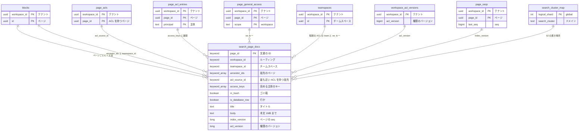

# Data model: 検索の索引（OpenSearch）

ページ単位の検索の文書と、その元になる DB の表。索引は正本ではなく、DB から作り直せる（[ADR-0023](../../decisions/0023-search-engine-and-permission-filtering.md)）。検索の振る舞いは [search.md](../search.md) にある。

- 別名 `pages` の裏に `pages-v{N}` を置く。マッピングを変えるときは、新しい索引を作って別名を切り替える。
- ルーティングは `workspace_id`。`index.routing_partition_size` で大きいワークスペースの偏りを抑える（値は負荷試験で決める）。
- 文書の ID は `page_id`。書き込みは `index_version`（ページの `seq`）を外部バージョンにし、古いバージョンで上書きしない。
- 検索の応答に、索引の `title`・`body` を使わない。`page_id` の一覧を得るためだけに使い、DB で読み直す（[search.md](../search.md) の 5.2 節）。

## ER 図



## 文書のマッピング

```jsonc
{
  "settings": {
    "index.routing_partition_size": 8,          // 仮の値。負荷試験で決める。作成時にしか決められない
    "number_of_replicas": 2,
    "analysis": { "…": "1〜2 文字の N-gram、edge N-gram（1〜20）、Sudachi" }
  },
  "mappings": {
    "_routing": { "required": true },
    "dynamic": "strict",
    "properties": {
      "workspace_id":    { "type": "keyword" },
      "page_id":         { "type": "keyword" },
      "teamspace_id":    { "type": "keyword" },
      "ancestor_ids":    { "type": "keyword" },
      "acl_source_id":   { "type": "keyword" },
      "access_keys":     { "type": "keyword" },
      "created_by":      { "type": "keyword" },
      "created_at":      { "type": "date" },
      "last_edited_at":  { "type": "date" },
      "in_trash":        { "type": "boolean" },
      "is_database_row": { "type": "boolean" },
      "deleted":         { "type": "boolean" },   // 物理削除の tombstone。7 日後に消す
      "title": { "type": "text", "analyzer": "sudachi",
                 "fields": { "gram":   { "type": "text", "analyzer": "ngram_1_2" },
                             "prefix": { "type": "text", "analyzer": "edge_1_20", "search_analyzer": "keyword_lower" } } },
      "body":  { "type": "text", "analyzer": "sudachi",
                 "fields": { "gram": { "type": "text", "analyzer": "ngram_1_2" } } },
      "index_version":   { "type": "long" },
      "acl_version":     { "type": "long" }
    }
  }
}
```

| フィールド | 元の表・列 | 更新のきっかけ |
| --- | --- | --- |
| `title`、`body` | `blocks.properties` のテキスト（`normalizeForSearch` の後。メンションと数式は空。同期ブロックは元のページだけ） | `search-index` のキュー（5 秒の窓でまとめる） |
| `teamspace_id`、`ancestor_ids` | `blocks.parent_id` の鎖 | 移動で部分木を再索引（`search-acl`） |
| `acl_source_id` | 最も近い `page_acls` を持つ祖先（自身を含む）。なければ空（最上位の暗黙の ACL） | ACL の作成・削除、移動 |
| `access_keys` | 下の表 | `search-acl`：`acl_source_id` での `update_by_query` |
| `in_trash` | 祖先の鎖の `trashed_at` | ゴミ箱へ・戻す |
| `index_version` | `page_seqs.last_seq` | 本文の更新ごと |
| `acl_version` | `workspace_acl_versions.acl_version` | 権限キーを計算したとき。1 時間ごとの突き合わせで古い文書を再計算 |

## 権限キー（`access_keys`）

`accessKeysFor(page)` が、判定関数と同じ規則でキーの集合を作る（[search.md](../search.md) の 5.1 節）。

| 元 | キー |
| --- | --- |
| `page_acl_entries.principal`（期限内）が `user:`・`group:`・`bot:` | そのまま |
| `page_general_access`（`scope = workspace`、`hide_from_search = false`） | `ws:{workspace_id}` |
| `page_general_access`（`scope = workspace`、`hide_from_search = true`） | 付けない |
| `page_general_access`（`scope = public`） | 付けない（ワークスペースの外は検索を使えない） |
| 最上位がチームスペース（ACL を持つ祖先がない） | `team:{teamspace_id}`、既定・公開なら `ws:{workspace_id}` |
| 最上位がプライベートの領域（`parent_type = member`） | `user:{member_id}` |
| チームスペースの所有者（ACL を持つページ） | 付けない。所有者は ACL で外れず `full_access` を持つ（ADR-0018）が、`team:` を足すとメンバー全員が条件に当たるため。所有者が自分の入っていない ACL のページを検索で見つけられないのは、安全側の既知の制限にする（[data-model.md](../data-model.md) の 7 節） |

- 拒否はキーで表さない。読める主体だけを並べる。
- `acl_source_id` を持つ文書は、その ACL の項目と一般アクセスだけからキーを作り、チームスペースの暗黙の ACL を足さない（ACL は継承を置き換える）。

## S1 の規模

- 文書 5,000 万（ページの数）、平均 5 KB。主シャードで約 1.2 TB、レプリカ 2 を含めて約 3.7 TB（[search.md](../search.md) の 9.1 節）。
