# Data model: DB の外（Valkey・S3・データレイク・プロセスの中のキャッシュ）

Aurora の外に置くデータの形。どれも正本ではない（S3 のファイルとスナップショットの本体、監査ログのアーカイブを除く）。検索の索引は [search.md](search.md)、端末のローカルの保存は [client.md](client.md) にある。

## ER 図

```mermaid
erDiagram
  blocks ||--o{ valkey_page_channel : "開いているページの配信"
  outbox ||--o{ valkey_page_channel : "Relay が publish"
  members ||--o{ valkey_member_channel : "本人の配信"
  workspace_acl_versions ||--o{ valkey_acl_channel : "acl.changed"
  blocks ||--o{ valkey_page_presence : "在席"
  views ||--o{ valkey_query_cache : "query_id"
  files ||--o{ s3_file_object : "storage_key"
  page_snapshots ||--o{ s3_snapshot_object : "s3_key"
  export_jobs ||--o{ s3_export_object : "result_s3_key"
  import_jobs ||--o{ s3_import_object : "upload_s3_key"
  audit_events ||--o{ s3_audit_archive : "ハッシュの連鎖ごと"

  valkey_page_channel {
    text channel PK "ws:w:pg:page_id"
    json message "page.committed と一時的なイベント"
  }
  valkey_member_channel {
    text channel PK "ws:w:m:member_id"
    json message "権限・失効・受信箱"
  }
  valkey_acl_channel {
    text channel PK "ws:w:acl"
    json message "acl.changed"
  }
  valkey_page_presence {
    text key PK "ws:w:pp:page_id"
    hash fields "接続ごとの member_id と時刻"
  }
  valkey_query_cache {
    text key PK "ws:w:q:query_id"
    blob row_ids "並べ替えた行の ID"
  }
  s3_file_object {
    text key PK "ws/w/files/file_id"
    blob body "利用者のファイル"
  }
  s3_snapshot_object {
    text key PK "ws/w/pages/page_id/snapshots/seq.json.gz"
    blob body "gzip の JSON"
  }
  s3_export_object {
    text key PK "ws/w/exports/job_id.zip"
    blob body "7 日"
  }
  s3_import_object {
    text key PK "ws/w/imports/job_id/name"
    blob body "7 日"
  }
  s3_audit_archive {
    text key PK "audit/ws/w/yyyy/mm/dd/hh.jsonl.gz"
    blob body "Object Lock 2 年"
  }
  blocks {
    uuid id PK "ページ"
  }
  outbox {
    bigint id PK "イベント"
  }
  members {
    uuid id PK "メンバー"
  }
  workspace_acl_versions {
    uuid workspace_id PK "テナント"
  }
  views {
    uuid id PK "ビュー"
  }
  files {
    uuid id PK "ファイル"
  }
  page_snapshots {
    bigint seq PK "バージョン"
  }
  export_jobs {
    uuid id PK "ジョブ"
  }
  import_jobs {
    uuid id PK "ジョブ"
  }
  audit_events {
    uuid id PK "監査"
  }
```



## Valkey（ElastiCache）

配信のバス・在席・一時的なキャッシュ。バックアップしない。失っても outbox と差分の取得で回復する（[infrastructure.md](../infrastructure.md) の 8.1 節）。キーは `ws:{workspace_id}:` で始め、S2 のクラスタモードでも同じ名前のまま sharded pub/sub に載せる。

| キー・チャンネル | 種類 | TTL | 中身 | 書き手 → 読み手 | 正 |
| --- | --- | --- | --- | --- | --- |
| `ws:{w}:pg:{page_id}` | pub/sub | - | `page.committed`（outbox の `payload`）、カーソル・在席の一時的なイベント、`page.head`（閲覧者が多いページ） | Relay・Gateway → Gateway | [collaboration.md](../collaboration.md) の 7.2・9 節 |
| `ws:{w}:m:{member_id}` | pub/sub | - | `member.changed`、セッションの失効、`inbox.created` | Relay → Gateway | 同上の 7.2 節 |
| `ws:{w}:acl` | pub/sub | - | `acl.changed { acl_version, root_page_id? }` | Relay → Gateway（ノードごとに 1 回購読） | 同上の 7.2 節、[permissions-and-sharing.md](../permissions-and-sharing.md) の 5.3 節 |
| `ws:{w}:pp:{page_id}` | hash | 90 秒 | 接続 ID → `{member_id, at}`。30 秒ごとに更新 | Gateway → Gateway | [collaboration.md](../collaboration.md) の 9 節 |
| `ws:{w}:ma:{member_id}` | string | 10 分 | 最後に操作した時刻。メールを送るかの判定（在席していないか）に使う | Gateway → 通知の Worker | [comments-and-notifications.md](../comments-and-notifications.md) の 5.4 節（2026-09-28 に追加） |
| `ws:{w}:q:{query_id}` | string（圧縮した ID の列） | 15 分 | 押し下げられない並べ替えの結果（行の ID の並び、データソースの `version`、ビューの設定のハッシュ、実行した人の `member_id`） | API → API | [databases.md](../databases.md) の 3.2 節（2026-09-28 に置き場所を決めた） |
| レート制限のバケット | string | 窓の長さ | トークンバケット | API → API | [api-and-integrations.md](../api-and-integrations.md) の 5 節（Slack の rate-limiting.md と同じ形） |

- 行のページの `page.committed` は、行のチャンネルに加え、データソースの `page_id`（`database` ブロックを置いたページ）のチャンネルにも送る。ビューを表示している接続は、そのページを購読する（リンクドビューなら元のページも。1 接続 20 ページの上限の中）。これで [databases.md](../databases.md) の 5 節の「ビューを購読している人」への配信を行う（2026-09-28 の決定）。
- `ws:{w}:q:{query_id}` は、別の人・別の `acl_version` の要求には使わない（キャッシュの中に `member_id` と `acl_version` を持ち、違えば問い合わせをやり直す）。
- 本文・タイトルを Valkey に長く置かない。pub/sub は置かないので、残るのは在席とクエリの ID の列だけ。

## S3

キーは、ワークスペースに属するものをすべて `ws/{workspace_id}/` で始める。ワークスペースの削除とリージョンの移動を、プレフィックスの単位で行うため（[infrastructure.md](../infrastructure.md) の 5 節）。2026-09-28 に、スナップショットの `workspaces/{workspace_id}/` をこの形に揃えた。

| バケット（役割） | キー | 中身 | 保持・削除 | 暗号化・保護 |
| --- | --- | --- | --- | --- |
| ファイル | `ws/{w}/files/{file_id}`、`ws/{w}/files/{file_id}/thumb/{size}.webp` | 利用者のファイル、サムネイル | `files` の物理削除で消す。バージョニングで古いバージョンを 30 日 | SSE-KMS（ファイルの鍵）。大阪へ複製。CloudFront の署名付き URL で配る |
| スナップショット | `ws/{w}/pages/{page_id}/snapshots/{seq}.json.gz` | ページのバージョン（下の形） | 履歴の日数を過ぎたら `page_snapshots` と一緒に消す | SSE-KMS。大阪へ複製 |
| インポート | `ws/{w}/imports/{job_id}/{name}` | 上げたファイル | 7 日のライフサイクル | SSE-KMS |
| エクスポート | `ws/{w}/exports/{job_id}.zip` | 成果物 | 7 日のライフサイクル | SSE-KMS。署名付き URL（7 日） |
| 監査のアーカイブ | `audit/ws/{w}/{yyyy}/{mm}/{dd}/{hh}.jsonl.gz`、`audit/platform/{yyyy}/{mm}/{dd}/{hh}.jsonl.gz` | `audit_events`・`platform_audit_events` の行とハッシュ | Object Lock（コンプライアンスモード）2 年 | SSE-KMS（監査の鍵） |
| データレイク | S1：`lake/export/{cluster_id}/{yyyy-mm-dd}/…`（Aurora のエクスポートの Parquet）。S2：`lake/tables/{table}/…`（Hudi か Iceberg） | 分析用の写し | 分析の方針で決める。ワークスペースの削除を伝える | SSE-KMS。利用者に中身を返す機能の元にしない（[ADR-0030](../../decisions/0030-cdc-data-lake.md)） |

スナップショットの本体の形：

```jsonc
{
  "v": 1,
  "workspace_id": "0192…",
  "page_id": "0192…",
  "seq": 3812,
  "created_at": "2026-09-28T01:23:45Z",
  "editors": ["0192…"],
  "blocks": [                      // 子ページの境界までの部分木。子ページは id と type だけ
    { "id": "…", "type": "paragraph", "properties": {}, "format": {},
      "parent_type": "block", "parent_id": "…", "content": [], "synced_from": null, "alive": true }
  ],
  "data_sources": [],              // このページの database ブロックのデータソースの定義
  "views": []
}
```

## プロセスの中のキャッシュ（S1）

| キャッシュ | キー | 無効化 | 正 |
| --- | --- | --- | --- |
| シャードの割り当て | `(region, logical_shard)` | 10 秒ごと、フェンスのエラー | [ADR-0027](../../decisions/0027-shard-router.md) |
| 主体のキー | `(member_id, acl_version)` | `acl_version` が変われば自然に外れる（LRU） | [ADR-0019](../../decisions/0019-workspace-acl-version-cache.md) |
| ページの ACL の元と項目 | `(page_id, acl_version)` | 同上 | 同上 |
| 判定の結果 | `(member_id, page_id, acl_version)` | 同上 | 同上 |
| プランの権利 | `plan_id` | 1 分 | [global.md](global.md) の `plans` |
