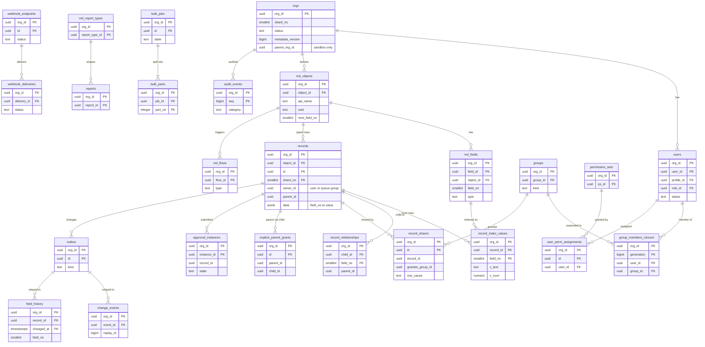
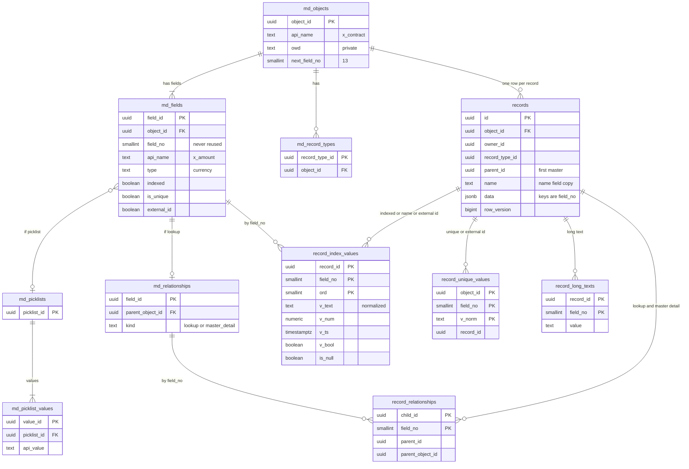

# Data model: Salesforce

データモデルの正本。規約、置き場所、全体の ER 図、組織が定義したオブジェクトの写し方、横断の不変条件を、この文書に置く。領域ごとの表の定義は [data-model/](data-model/) に置く。

- **列・制約・索引の正本は、この文書と `data-model/` の各ファイル**である。領域の文書（[data-storage.md](data-storage.md) など）は振る舞いの正本で、表は要点だけを書く。両者が食い違ったら、このデータモデルに合わせて領域の文書を直す（8 節の決定。起票の時の「索引だけに保つ」を改めた）。
- 開発リポジトリの変更（`changes/`）でマイグレーションを書くときは、同じ PR でここを更新する。
- 方針の元は [ADR-0002](../decisions/0002-custom-object-storage.md)（records と JSONB とピボット）、[ADR-0005](../decisions/0005-tenancy-and-governor-limits.md)（組織と RLS）、[ADR-0006](../decisions/0006-data-dictionary-and-field-lifecycle.md)（`field_id` と `field_no`）、[ADR-0010](../decisions/0010-record-tables-partitioning-and-pivots.md)（`shard_no` の分割）、[ADR-0012](../decisions/0012-derived-copies-consistency-and-projections.md)（写し）、[ADR-0053](../decisions/0053-operator-access-and-data-lifecycle.md)（保持）。
- 行の数と大きさの「S1 の量」は、[capacity.md](capacity.md) の 3 節と各領域の見積もりからの**初期値**である。E3・E12 の計測で置き換える。

## 1. ファイルの構成

| ファイル | 領域 | 表の数 |
| --- | --- | --- |
| [data-model/orgs-users-and-auth.md](data-model/orgs-users-and-auth.md) | 組織、機能とライセンス、利用者、認証（`identity`）、OAuth、組織の解決 | 16 |
| [data-model/metadata.md](data-model/metadata.md) | データ辞書（`md_*`）、バージョンと差分、翻訳、自動採番、型の変換、消去 | 14 |
| [data-model/records-and-storage.md](data-model/records-and-storage.md) | `records`、ピボット、長いテキスト、ごみ箱、outbox、射影、整合の検査、問い合わせの統計 | 16 |
| [data-model/access-and-sharing.md](data-model/access-and-sharing.md) | 権限セット、プロファイル、ロール、グループと閉包、共有ルール、`record_shares`、共有のジョブ | 21 |
| [data-model/sales-objects.md](data-model/sales-objects.md) | 標準オブジェクトの項目、商談の履歴、活動の関係者、リードの変換、重複の規則と照合の鍵、メールの記録 | 15 |
| [data-model/ui-and-list-views.md](data-model/ui-and-list-views.md) | ページレイアウト、リストビュー、最近見たもの | 5 |
| [data-model/automation.md](data-model/automation.md) | フロー、入力規則、積み上げ集計、承認のプロセス | 14 |
| [data-model/reports-and-dashboards.md](data-model/reports-and-dashboards.md) | レポートの型、フォルダ、レポート、実行、ダッシュボード、定期の配信、エクスポート | 10 |
| [data-model/search.md](data-model/search.md) | 検索の索引の状態、作り直し、整合の検査（索引の形は stores） | 3 |
| [data-model/events-and-integrations.md](data-model/events-and-integrations.md) | 変更のイベント、組織が定義するイベント、Webhook、外向きの呼び出し、メールの送信 | 14 |
| [data-model/bulk-and-import.md](data-model/bulk-and-import.md) | 一括のジョブ、部分、見出し、インポートの対応 | 4 |
| [data-model/sandboxes-and-deploy.md](data-model/sandboxes-and-deploy.md) | Sandbox の申し込みとテンプレート、マスキング、書き出し、デプロイ、送ったパッケージ | 6 |
| [data-model/limits-and-usage.md](data-model/limits-and-usage.md) | 割り当てと使用量、Worker の順番（`jobs`・`org_vtime`）、上限に近い自動化、組織ごとの資源の使用量 | 10 |
| [data-model/audit-and-history.md](data-model/audit-and-history.md) | 設定の変更の監査、ログインの履歴、項目の変更の履歴（`history` のクラスタ） | 6 |
| [data-model/extensibility.md](data-model/extensibility.md) | 利用者のコード、名前空間とパッケージ（E13・E14） | 8 |
| [data-model/platform-and-operations.md](data-model/platform-and-operations.md) | 論理シャードと置き場所、クラスタ、組織の移動、組織の DEK、運用者のアクセス、API のバージョン、影の実行 | 9 |
| [data-model/stores.md](data-model/stores.md) | DB 以外：Valkey のキー、S3 の配置、OpenSearch の索引、outbox・イベント・Webhook・SQS の本文、一括のファイル、メタデータのパッケージの形式 | — |

合計 171 表（`proj_<projection_id>` は 1 つの型として数える）。ER 図は、全体 1、組織の定義したオブジェクトの写し方 1、領域ごとに 17（共有は 2 つ）の、合わせて 19。

置き場所ごとの数：

| 置き場所 | 表 | 中身 |
| --- | --- | --- |
| `main`（RLS） | 147 | メタデータ、レコードと写し、共有、自動化、レポート、一括、Sandbox とデプロイ、監査、上限と使用量 |
| `events`（RLS） | 3 | `change_events`、`org_events`、`event_heads` |
| `history`（RLS） | 1 | `field_history` |
| RLS の外（`control` 12、`identity` 6、主のクラスタの `ops` 2） | 20 | 3.3 節 |

## 2. 置き場所

| 置き場所 | 中身 | 分け方 |
| --- | --- | --- |
| 主の Aurora PostgreSQL 18（`main`） | 唯一の正本。メタデータ、レコード、ピボット、共有、自動化、レポート、一括、監査、商談の履歴、outbox | 論理シャード（`shard_no`、256）を物理のクラスタに割り当てる（[ADR-0055](../decisions/0055-shard-placement-and-stage-criteria.md)） |
| `events` の Aurora | 変更のイベントと組織が定義するイベント（3 日）。Relay だけが書く | セルごと。S2 で論理シャードで分ける |
| `history` の Aurora | 項目の変更の履歴（18 か月）。Relay だけが書く | 同上 |
| `control` のスキーマ | 組織の解決と置き場所の表（RLS の外）。S1・S2 は主のクラスタの別のスキーマ、S3 で東京の小さな Aurora に分ける | セルをまたぐ |
| `identity` のスキーマ | Better Auth の表（RLS の外）。主のクラスタの別のスキーマ | 同上（S3 で `control` と一緒に動かすかは S3 の前に決める） |
| Valkey（ElastiCache） | メタデータの部品（L2）、今のバージョン、割り当ての 1 分の桶、長い要求の数、組織と利用者の設定のキャッシュ、レポートの結果のキャッシュ。**正本を置かない** | セルごと |
| OpenSearch | 検索の共有の索引 `rec-v{n}-{00..15}`。`_source` に値を置かない | セルごと |
| S3 | 一括の CSV と結果、レポートの結果、エクスポート、メールの添付と原本、メタデータのパッケージ、監査の外部の保管と錨 | 組織の接頭辞と組織の DEK |
| SQS | Relay から indexer・Worker への通知、prod-egress への署名済みの要求 | キューごと |

- DB 以外の置き場所のキー・パス・本文の形は [data-model/stores.md](data-model/stores.md)。
- 組織の置き場所の決め方（`org_placements` → `shard_map`）は [data-model/platform-and-operations.md](data-model/platform-and-operations.md)。`events`・`history` のクラスタは、主のクラスタと同じセルのものを使う。

## 3. 規約

### 3.1 ID

- DB の ID は `uuid` 型の **UUIDv7**。PostgreSQL 18 の `uuidv7()` で作る（[ADR-0005](../decisions/0005-tenancy-and-governor-limits.md)）。
- **レコードの ID に接頭辞（オブジェクトを示すキーの接頭辞）を持たない。** API の ID も UUID の文字列のまま返す（[query-language-and-api.md](query-language-and-api.md) の 5.2 節）。オブジェクトは URL（`/objects/{object}/records/{id}`）か、多態の参照の値（`{"id", "object"}`）で示す。ID だけで引く経路（`/api/v1/ui/records/{id}`、最近見たもの）は、`records` の `(org_id, id)` の索引でオブジェクトを求める（8 節の決定）。
- ID の**一意の範囲は組織の系統**（本番の組織と、その Sandbox）の中。Sandbox は元の組織の ID をそのまま使う（[ADR-0038](../decisions/0038-sandbox-types-and-masked-copy.md)）。全ての主キーの先頭が `org_id` なので、同じ ID が系統の中の別の組織にあっても衝突しない。別の系統の組織の間では、新しく作る UUIDv7 なので重ならない。
- **`field_id`**：項目の UUIDv7。メタデータ・デプロイ・監査・リストビューとレポートの定義・フローの束縛で項目を指す。一意の範囲は組織の系統の中（ADR-0006 の 2026-09-28 の注記）。組織の間のデプロイは ID でなく API の名前で当てる（[ADR-0039](../decisions/0039-metadata-package-format.md)）。
- **`field_no`**：オブジェクトの中の連番（`smallint`、1〜32,767）。`md_objects.next_field_no` から採り、**再利用しない**。`records.data` の JSONB のキーは `field_no` の 10 進の文字列（`{"12": "..."}`）。ピボット・照合の鍵・履歴・検索の文書も `field_no` で項目を指す。型の変換の間、1 つの `field_id` が 2 つの `field_no` を持つ（[data-model/metadata.md](data-model/metadata.md)）。
- **利用者のグループの ID は利用者の ID と同じ、キューのグループの ID はキューの ID と同じ**（[ADR-0014](../decisions/0014-owd-roles-groups-and-closure.md)）。`records.owner_id` をそのまま閉包の `group_id` と結べる。
- `replay_id` は `bigint`（確定の時刻のミリ秒 48 ビット ｜ 論理シャードの中の連番 16 ビット）。API では 16 進 16 文字で返す（[ADR-0033](../decisions/0033-change-event-log-and-replay.md)）。
- 秘密とトークンだけが接頭辞を持つ：`<brand>_at_`・`<brand>_rt_`（OAuth のトークン）、`<brand>_whsec_`（Webhook の署名の秘密）。DB にはハッシュか暗号文だけを置く（[リポジトリ共通の ADR-0006](../../../../docs/decisions/0006-brand-neutral-identifiers.md)）。
- 内部の連番（`audit_events.seq`、`bulk_parts.part_no`、`md_versions.version`）は、組織・親の中の欠番のない整数。

### 3.2 組織と RLS

- **組織のデータの表は `org_id uuid NOT NULL` を持ち、主キーと全ての索引の先頭に置く**（[ADR-0005](../decisions/0005-tenancy-and-governor-limits.md)）。`shard_no` で分割する表は、主キーの末尾に `shard_no` を置く（PostgreSQL の分割の表の主キーに分割の列が要るため）。
- 全ての組織の表に次の方針を張る。`current_setting` の `missing_ok` を使わないので、コンテキストがなければ問い合わせそのものが失敗する（安全側）。

```sql
ALTER TABLE <t> ENABLE ROW LEVEL SECURITY;
ALTER TABLE <t> FORCE ROW LEVEL SECURITY;
CREATE POLICY org_isolation ON <t>
  USING      (org_id = current_setting('app.org_id')::uuid)
  WITH CHECK (org_id = current_setting('app.org_id')::uuid);
-- shard_no で分割する表（3.4 節）は、両方の式に次を足す
--   AND shard_no = current_setting('app.shard_no')::smallint
```

- データ層は、トランザクションごとに `SET LOCAL app.org_id`・`app.shard_no`・`application_name = 'o:<org_id>:<path>'` を設定する（[observability.md](observability.md) の 4 節）。組織の解決（ホスト名・トークン → `org_id`・`shard_no`）は、DB の組織のデータを読む前に `control` の表とキャッシュで行う。
- **外部キーは組織の中に閉じる。** 外部キーは `org_id` を含む複合キーにし、別の組織の行を指せないようにする。張るのは、メタデータと設定の表（`md_*`、権限、ロール、フロー、レポートの定義など）の間だけ。`records`・ピボット・共有の行・閉包・照合の鍵・ログの表には張らない。書き込みの増幅と、消去の順の制約を避けるため。これらの参照の正しさは、データ層と整合の検査で守る（[ADR-0012](../decisions/0012-derived-copies-consistency-and-projections.md)。8 節の決定）。
- 例外の方針：`name_variant_chars` のシステムの行（`org_id` が nil UUID）だけ、読みの方針 `USING (org_id = '00000000-0000-0000-0000-000000000000' OR org_id = current_setting('app.org_id')::uuid)` を足す。アプリが書けるのは組織の行だけ。

DB のロール：

| ロール | 権限 | 使う処理 |
| --- | --- | --- |
| `migrator` | 所有者。DDL | マイグレーション |
| `app_runtime` | 組織の表の読み書き（RLS の対象、`BYPASSRLS` なし）。`control.orgs`・`control.token_routes` の読みだけ。`statement_timeout` 30 秒 | `runtime`、`metadata`、`bulk` の受付 |
| `app_worker` | `app_runtime` と同じ。`org_vtime` の読み書き。`statement_timeout` 10 分 | `worker`、`indexer` |
| `relay` | `outbox` に役割ごとの方針（`shard_no = current_setting('app.shard_no')` だけで絞る）で `SELECT`・`UPDATE (relayed_at)`・`DELETE`。`events`・`history` のクラスタに `INSERT` と `event_heads` の更新。他の表の権限なし | Relay |
| `identity_service` | `identity` のスキーマの読み書き、`control.token_routes` の読み書き | 認証のサービス |
| `admin_cross_org` | `BYPASSRLS`。組織の作成、Sandbox の複製、組織の移動、組織の消去だけ | `cross-org-worker` |
| `maint` | 分割の作成と `DROP`、射影の表（`proj_*`）の DDL。行の `SELECT` なし | 保守の Worker |

- `BYPASSRLS` を持つのは `admin_cross_org` だけ。`maint` は行を読めない。この一覧は CI のマイグレーションの検査の許可リストと一致させる（[delivery.md](delivery.md) の 2.1 節、[ADR-0054](../decisions/0054-accounts-network-and-service-separation.md)）。
- 監査の表（`audit_events`）は、アプリのロールに `INSERT`・`SELECT` だけを許す（[ADR-0046](../decisions/0046-setup-audit-trail-and-login-history.md)）。

### 3.3 RLS の外の表

RLS をかけない表は次の 20 だけ。**この表が一覧の正本**で、CI のマイグレーションの検査の例外の許可リストと一致させる。足す時は、この文書の更新で決める。

| 表 | スキーマ | 理由 | 書くもの |
| --- | --- | --- | --- |
| `orgs`、`token_routes` | `control` | DB の組織のデータを読む前の組織の解決（ホスト名・トークン → `org_id`） | 管理のサービス、認証のサービス |
| `auth_users`、`auth_accounts`、`auth_sessions`、`passkeys`、`two_factors`、`sso_providers` | `identity` | 組織の解決の前のログイン（`login.<brand>.<domain>` で `username` から組織を決める）。各行は `org_id` を持つ | `identity_service` だけ |
| `org_purge_log` | `control` | 消した組織の記録（組織の ID のハッシュだけ） | `cross-org-worker` |
| `shard_map`、`org_placements`、`clusters`、`org_migrations` | `control` | 組織の置き場所と移動 | 管理のサービス、`cross-org-worker` |
| `org_keys` | `control` | 組織の DEK。組織の消去の最後に消す | 管理のサービス、Worker |
| `org_vtime` | `ops`（主のクラスタ） | Worker の公平な順番（組織をまたいで最小を選ぶ）。`jobs` と同じトランザクションで書くので主のクラスタに置く | Worker |
| `api_versions` | `control` | 本システムの API のバージョン | デプロイ |
| `namespaces`、`package_publisher_keys`、`package_versions` | `control` | 全ての組織で一意の名前空間と配布（E13・E14） | 管理のサービス |
| `shadow_eval_results` | `ops`（主のクラスタ） | 影の実行の結果（値を持たない。30 日） | Runtime（影の実行） |

- RLS の外の表のうち `org_id` を持つもの（`identity.*`、`org_keys`、`org_vtime`、`org_placements`、`org_migrations`、`shadow_eval_results`）は、組織の移動の公開に入れず、移動の道具が個別に扱う（[ADR-0056](../decisions/0056-org-migration-by-row-filtered-logical-replication.md)）。

### 3.4 `shard_no` の分割

- 組織の `shard_no`（0〜255）は、組織の作成時に `org_id` の SHA-256 の先頭 2 バイトから 0〜239 に決め、`orgs.shard_no` に持つ。以後は変えない。240〜255 は大口の組織の予約（[ADR-0010](../decisions/0010-record-tables-partitioning-and-pivots.md)）。
- 次の 13 表を `PARTITION BY LIST (shard_no)` で 256 に分ける（S1 で約 3,300 の分割）。SQL は必ず `shard_no = <定数>` を含める（lint）。

| 表 | ファイル |
| --- | --- |
| `records`、`record_index_values`、`record_unique_values`、`record_relationships`、`record_long_texts`、`outbox` | [records-and-storage](data-model/records-and-storage.md) |
| `record_shares`、`implicit_parent_grants`、`group_members_closure` | [access-and-sharing](data-model/access-and-sharing.md) |
| `record_match_keys`、`activity_relations` | [sales-objects](data-model/sales-objects.md) |
| `flow_scheduled_actions`、`approval_locks` | [automation](data-model/automation.md) |

- 他の表は分割しない（メタデータ、設定、小さな表）か、時間の範囲で分ける（3.9 節）。時間で分ける表は `shard_no` を持たず、`org_id` を主キーの先頭に置く（shard × 時間の 2 段の分割は数が多すぎる。[audit-and-field-history.md](audit-and-field-history.md) の 5.2 節）。

### 3.5 時刻

- 時刻は `timestamptz`、UTC で持つ。API は ISO 8601（ミリ秒、`Z`）で返す。
- `records.data` の中の日付・日時は、文字列（`"2026-09-28"`、`"2026-09-28T01:02:03.456Z"`）で持つ。ピボットは `v_ts`（日付は UTC の 0 時）に写す（[ADR-0002](../decisions/0002-custom-object-storage.md)）。
- 組織の暦（タイムゾーン、会計年度の始まりの月）は `orgs.timezone`・`orgs.fiscal_year_start_month`。日付の関数と日付への切り捨ては、組織のタイムゾーンで行う。
- 作成・更新の時刻は `created_at`・`updated_at`。メタデータの表は、加えて作られたバージョンと最後に変わったバージョン（`created_version`・`updated_version`）を持つ（3.11 節）。
- 1 分の桶の表は `minute timestamptz`（分の頭に切り捨て）、1 時間の桶は `hour`、日の集計は `day date`（UTC）。

### 3.6 論理削除とごみ箱

| 対象 | 持ち方 | 確定と消去 |
| --- | --- | --- |
| レコード | `records.deleted_at`・`delete_batch_id`。束は `recycle_bin_batches` | 15 日で確定し、24 時間以内に全ての表から消す（[ADR-0011](../decisions/0011-recycle-bin-and-purge.md)） |
| 項目・オブジェクト | `md_fields.state = deleted`・`deleted_at`、`md_objects.deleted_at` | 15 日で確定し、7 日以内に値を消す（`purge_jobs`。[ADR-0006](../decisions/0006-data-dictionary-and-field-lifecycle.md)） |
| 利用者 | 消さない。`users.status = deactivated`、匿名化は `anonymized_at` | — |
| 組織 | `orgs.status = deleting`・`purge_after` | 30 日の猶予の後、7 日以内に全て消し、最後に DEK を破棄（[ADR-0043](../decisions/0043-orgs-editions-licenses-and-users.md)、[ADR-0052](../decisions/0052-key-hierarchy-and-per-org-data-keys.md)） |
| その他（設定・ジョブ・ログ） | 物理の削除、または期限で `DROP` | 3.9 節 |

- ごみ箱の間は、`record_index_values`・`record_unique_values`・`record_match_keys` の行を消す（一意の値を放す）。`record_relationships`・`record_long_texts`・`record_shares`・`implicit_parent_grants`・`activity_relations` は残す。戻す時にピボットと照合の鍵を作り直す（[data-storage.md](data-storage.md) の 5 節）。
- 全ての問い合わせは `deleted_at IS NULL` を付ける。`records` の索引は `WHERE deleted_at IS NULL` の部分索引。

### 3.7 命名と型

- 表は英語の複数形の `snake_case`。メタデータ（バージョンを上げる）の表は `md_` の接頭辞。列は `snake_case`。外部キーは `<単数形>_id`、時刻は `_at`、日付は `_on` か `day`、真偽は `is_`・`can_` か状態の形容詞。
- **SQL の予約語を列の名前にしない**（`order`、`unique`、`from`、`to`、`create` など。8 節の決定で直した）。
- 状態・種類は `text` と `CHECK (x IN (...))` で持つ。PostgreSQL の列挙型は使わない（値の追加でロックを取らないため）。
- 数・通貨の値は、`records.data` の中では 10 進の文字列、表の列では `numeric`（精度は項目の `type_params`）。浮動小数で持たない（[ADR-0002](../decisions/0002-custom-object-storage.md)）。
- 定義（レイアウト、リストビュー、フロー、レポート）は `jsonb` の `definition` に持ち、項目は `field_id` で書く（名前の変更で壊れない）。`jsonb` の形は種類ごとの JSON Schema（Zod）で検証してから書く。
- 利用者の顔ぶれの参照（`owner_id`、`created_by`、`user_id` など）は `users.user_id`。キューが所有者になりうる列（`records.owner_id`）はグループの ID。
- 個人データを持つ列は、マイグレーションで `COMMENT ON COLUMN ... IS 'pii:<分類>'` を付ける。本書の列の表では「PII」と書く。

### 3.8 暗号化

| 対象 | 方式 | 鍵 |
| --- | --- | --- |
| Aurora（主・`events`・`history`）、スナップショット | 保存時の暗号化 | `aurora`（[security.md](security.md) の 5 節） |
| 秘密の列：`webhook_endpoints.secret_enc`・`secret_prev_enc`、`outbound_endpoints.auth_secret_enc`、SSO の接続の秘密鍵（`identity.sso_providers` の設定の中） | 列の暗号化（AES-256-GCM）。読みの API は返さない。Sandbox に写さない | 組織の `secrets` の DEK（[ADR-0052](../decisions/0052-key-hierarchy-and-per-org-data-keys.md)） |
| 画面のフローの状態（`flow_interviews.state_enc`） | 列の暗号化 | 組織の `secrets` の DEK |
| S3 の組織のファイル | オブジェクトの暗号化＋SSE-KMS | 組織の `files` の DEK |
| 監査の外部の保管 | オブジェクトの暗号化、Object Lock | 組織の `audit` の DEK（log-archive の鍵で包む） |
| OAuth のトークン、OAuth のクライアントの秘密、メールの記録の宛先の token | SHA-256 のハッシュだけ | — |
| パスワード、TOTP の秘密 | Better Auth の既定（scrypt、サーバーの秘密での暗号化） | — |
| OpenSearch | ドメインの保存時の暗号化。`_source` に値を置かない | ドメインの鍵 |

- 列の暗号文は `bytea` で、`key_version`（1 バイト）‖ nonce ‖ 暗号文 ‖ タグの形にする。AAD は `org_id ‖ purpose ‖ 表.列 ‖ 行の ID`。別の行・別の組織へ写した暗号文は復号できない。
- DEK は `org_keys`（組織 × 用途 × バージョン）に KMS で包んで持つ。1 年ごとに新しいバージョンを作る。組織の消去の最後に `wrapped_dek` を消す。

### 3.9 時間の分割と保持

保持の正本は [security.md](security.md) の 7 節（[ADR-0053](../decisions/0053-operator-access-and-data-lifecycle.md)）。下の表はその写しで、食い違ったら security.md を正とする。値は設定にし、法務の L5・L7 の結論で変えうる。分割は pg_partman で先に作っておく（日 7 個、月 3 個）。

| 表 | 置き場所 | 分割 | 保持 | 消し方 |
| --- | --- | --- | --- | --- |
| `change_events`、`org_events` | `events` | `event_id`（UUIDv7）の日の範囲 | 3 日 | 4 日目の分割を `DROP` |
| `field_history` | `history` | `changed_at` の月 | 18 か月 | 19 か月目の最初の日に `DROP` |
| `opportunity_history` | main | `changed_at` の月 | 18 か月（既定案） | 同上 |
| `audit_events`、`login_events` | main | `at` の月 | 180 日 | 分割の `DROP` |
| `webhook_deliveries`、`outbound_call_log` | main | `at` の日 | 7 日 | 分割の `DROP` |
| `org_usage_minutes` | main | `minute` の日 | 25 時間 | 分割の `DROP` |
| `org_db_time_minutes`、`org_request_minutes`、`org_aas_minutes`、`org_worker_minutes` | main | `minute` の日 | 7 日（1 時間の粒度は `org_usage_hours` に 13 か月） | 分割の `DROP` |
| `org_usage_hours` | main | `hour` の月 | 13 か月 | 分割の `DROP` |
| `outbox` | main | `shard_no` | 送った後 1 時間 | 行の `DELETE` |
| `flow_interviews` | main | なし | 7 日（使われない実行） | ジョブ |
| `flow_async_runs`、`code_async_runs`、`code_debug_logs`、`jobs` の終わった行、`tx_limit_peaks` | main | なし | 7 日 | ジョブ |
| `bulk_jobs` と子の表、S3 の結果 | main・S3 | なし | 7 日（元の CSV は 24 時間） | ジョブと S3 のライフサイクル |
| `report_runs`、`report_exports`、S3 の結果 | main・S3 | なし | 24 時間 | 同上 |
| `inbound_packages` | main・S3 | なし | 30 日 | 同上 |
| `shadow_eval_results` | control | なし | 30 日 | ジョブ |
| 組織の全て | 全て | — | 削除の申し込みから 30 日＋7 日 | [security.md](security.md) の 7.1 節の順 |

- 期限で動く仕事（ごみ箱の消去、項目の値の消去、期限の掃除、整合の検査）は、組織をまたいで表を走査しない。仕事を作る時に `jobs.available_at` で予約し、Worker が組織の公平な順番で取る（[data-model/limits-and-usage.md](data-model/limits-and-usage.md)。8 節の決定）。

### 3.10 クラスタ

| クラスタ | 表 | 書き手 | 読み |
| --- | --- | --- | --- |
| `main` | 3.3 節の外の全て（147） | Runtime・Metadata・Worker（writer） | writer、reader（レポート、一括の問い合わせ、検索の後の確かめ、整合の検査） |
| `events` | `change_events`、`org_events`、`event_heads` | Relay だけ（組織が定義するイベントの `immediate` の API の発行を除く） | reader（SSE、取り出し、Webhook の送り手、イベントで起動するフロー） |
| `history` | `field_history` | Relay だけ。消去の Worker が消す | reader（履歴の関連リスト、履歴のレポート） |
| `control`（S1・S2 は `main` の別のスキーマ） | 3.3 節 | 管理のサービス、`cross-org-worker` | 入口の組織の解決 |

- `events`・`history` への書き込みは、同じトランザクションの `outbox` に書き、確定の後に Relay（論理シャードごとの唯一の書き手）が写す。outbox の行の ID から作る一意の鍵で二重を捨てる（[ADR-0033](../decisions/0033-change-event-log-and-replay.md)、[ADR-0047](../decisions/0047-field-history-tracking-and-retention.md) の注記）。
- クラスタをまたぐ結合は持たない。`history` の行を主のレコードの条件で絞る時は、主の reader で ID の束を作ってから引く（[audit-and-field-history.md](audit-and-field-history.md) の 5.3 節）。

### 3.11 メタデータのバージョン

- メタデータの表（種類 `meta`）の変更は、組織の `orgs.metadata_version` を 1 つ上げる 1 つのトランザクションで行う。排他の `pg_advisory_xact_lock` を取り、`md_changes` に差分、`md_versions` に 1 行を書く（[ADR-0003](../decisions/0003-metadata-driven-runtime.md)、[metadata-and-runtime.md](metadata-and-runtime.md) の 4.1 節）。
- メタデータの行は `created_version`・`updated_version`（`bigint`）を持つ。Setup の同時編集の楽観の鍵は要素の `updated_version`（[ui-layouts-and-list-views.md](ui-layouts-and-list-views.md) の 7.2 節）。
- データを書くトランザクションは、メタデータの鍵の共有のロックを取り、`orgs.metadata_version` が要求の開始時のバージョンと同じかを確かめる。
- 各表の「種類」：`meta`＝メタデータ（バージョンを上げる）、`data`＝データ、`copy`＝正本の写し（純粋な関数で作り、整合の検査で差を 0 に保つ）、`ops`＝運用、`log`＝追記だけで期限で消す。

## 4. 全体の ER 図

領域をまたぐ主な関係だけを描く。列の詳細は各ファイルの図にある。`records` は全てのオブジェクトの行を持ち、ピボット・共有の行・照合の鍵は `records` の写しである。



- `change_events` は `events` のクラスタ、`field_history` は `history` のクラスタにある。`outbox` からの線は Relay の写しで、DB の外部キーではない。
- `records` と写しの表の線も、DB の外部キーではない（3.2 節）。

## 5. 組織が定義したオブジェクトの写し方

管理者が Setup でオブジェクト `x_contract`（契約）と項目を足すと、DDL は走らず、`md_*` の行が増えるだけになる（[ADR-0002](../decisions/0002-custom-object-storage.md)）。レコードは全て `records` の 1 行で、項目の値は `data` の JSONB に `field_no` をキーにして入る。索引・一意・参照・長いテキストの項目は、同じトランザクションで型付きのピボットに写す。



全ての表の主キーの先頭には `org_id` があり、分割の表は末尾に `shard_no` がある（図では省いた）。

例：`x_contract` に 4 つの項目を足した組織。

| `field_no` | `api_name` | 型 | 設定 | 写し先 |
| --- | --- | --- | --- | --- |
| 1 | `name` | `text` | 名前の項目 | `records.name`、`record_index_values`（`v_text`） |
| 10 | `x_amount` | `currency` | `indexed` | `record_index_values`（`v_num`、空なら `is_null`） |
| 11 | `x_account` | `lookup`（取引先） | — | `record_relationships` |
| 12 | `x_erp_no` | `text` | `external_id` | `record_index_values` と `record_unique_values` |
| 13 | `x_terms` | `long_text` | — | `record_long_texts`（`data` に持たない） |

`records.data`（空の項目はキーを書かない。数は 10 進の文字列）：

```json
{ "1": "2026 年度 保守契約", "10": "1200000", "11": "01927c5e-7a10-7c11-9f00-000000000001", "12": "ERP-000123" }
```

- 名前を `x_amount` から `x_contract_amount` に変えても、`field_no` は 10 のままで、`records` もピボットも書き換えない。
- `x_amount` を `text` に変換すると、新しい `field_no`（14）を割り当てて写し、切り替えのバージョンで `md_fields` の指す先を 14 にする。10 のキーは 15 日残してから消す（[data-model/metadata.md](data-model/metadata.md) の `field_conversions`）。10 は再利用しない。
- ピボットの行は `derivePivotRows(objectSegment, record)` で、照合の鍵は `deriveMatchKeys` で、`records` の行とメタデータから決まる。保存では前後の差分の行だけを書く（[data-storage.md](data-storage.md) の 3.4 節）。

## 6. 横断の不変条件

| 不変条件 | 守り方 | 根拠 |
| --- | --- | --- |
| **写しは同じトランザクション**：`records` の変更と、ピボット 4 表・照合の鍵・射影・レコードの条件の共有の行・暗黙の親の行・承認のロックは、同じトランザクションで書く。巻き戻れば写しも残らない | データ層の保存の手順 6・10（[ADR-0008](../decisions/0008-dml-order-of-execution.md)）。純粋な関数 `derivePivotRows`・`deriveMatchKeys`・`applySharingDelta`。整合の検査で差 0（`pivot_drift_repaired_total`） | [ADR-0002](../decisions/0002-custom-object-storage.md)、[ADR-0012](../decisions/0012-derived-copies-consistency-and-projections.md)、[ADR-0015](../decisions/0015-sharing-reasons-and-where-they-live.md)、[ADR-0022](../decisions/0022-duplicate-rules-and-japanese-matching.md) |
| **共有の判定で世代を混ぜない**：1 つの要求は 1 つのメタデータのバージョンに固定され、閉包の世代（`group_members_closure.generation`）と有効なルールの集合（`criteria_rules.state = active` の `rule_id`）も 1 つに固定される | 問い合わせの条件に `generation = $cg` と `rule_id = ANY($rules)` を必ず付ける。切り替えは 1 つのバージョンで行う | [ADR-0016](../decisions/0016-recalculation-rule-versions-and-skew.md)、`PROP-SHR-002` |
| **上限はデータ層で強制**：全ての読み書きは実行基盤のデータ層を通り、トランザクションの計測器が数える。`records` とピボットへの直接の SQL はコンパイラのパッケージの外で書かない | lint、DB の `statement_timeout`（最後の守り）、上限の試験 | [ADR-0003](../decisions/0003-metadata-driven-runtime.md)、[ADR-0005](../decisions/0005-tenancy-and-governor-limits.md)、[ADR-0041](../decisions/0041-limits-registry-and-counting-rules.md) |
| **`field_no` は再利用しない** | `md_objects.next_field_no` は増えるだけ（トリガーで減る更新を拒否）。`md_fields` の `CHECK (field_no < 所属のオブジェクトの next_field_no)` をトリガーで確かめる。定義の行を消した後も番号は欠番のまま | [ADR-0006](../decisions/0006-data-dictionary-and-field-lifecycle.md) |
| **組織の分離** | 3.2 節の RLS（`org_id` と `shard_no`）、`org_id` を先頭に含む主キーと外部キー、キャッシュの鍵への `{o:<org_id>}` の必須化 | [ADR-0005](../decisions/0005-tenancy-and-governor-limits.md) |
| **メタデータの変更はバージョンを 1 つ上げる 1 つのトランザクション**。コンパイル済みの部品はバージョンと内容のハッシュを鍵にして不変 | Metadata のサービスだけが `md_*` を書く。`md_versions` の `(org_id, version)` の一意 | [ADR-0003](../decisions/0003-metadata-driven-runtime.md)、[ADR-0007](../decisions/0007-segmented-metadata-snapshots.md) |
| **別のクラスタへの写しはちょうど 1 回の効果** | 同じトランザクションの outbox。`change_events`・`org_events` は `event_id`（＝outbox の行の ID）の一意、`field_history` は `source_id`（＝outbox の行の ID）を含む主キーで二重を捨てる | [ADR-0033](../decisions/0033-change-event-log-and-replay.md)、[ADR-0047](../decisions/0047-field-history-tracking-and-retention.md) |
| **レコードごとの変更のイベントの順** | 同じレコードの保存は行ロックで順番になり、Relay は論理シャードごとに 1 つで outbox を `id` の順に送る | ADR-0033 |
| **ごみ箱の戻しは束の単位で全部か無しか**。ごみ箱の間は一意の値を放す | `recycle_bin_batches`。戻す時に `derivePivotRows` で作り直し、一意の違反は `DUPLICATE_VALUE` | [ADR-0011](../decisions/0011-recycle-bin-and-purge.md) |
| **1 つのレコードで `pending` の承認は 1 つ** | `approval_instances` の部分一意索引 `(org_id, record_id) WHERE state = 'pending'` | [ADR-0028](../decisions/0028-approval-processes-and-record-locks.md) |
| **監査は追記だけで、組織ごとの鎖** | アプリのロールは `INSERT`・`SELECT` だけ。`seq` は `audit_heads` の行ロックで欠番なく採番。`hash = SHA-256(prev_hash ‖ 行)`。毎日の錨を Object Lock に | [ADR-0046](../decisions/0046-setup-audit-trail-and-login-history.md) |
| **検索の索引は写し**：値を `_source` に持たず、判定に使わない。共有は後で DB で確かめる | 索引の文書は ID・バージョンだけ。検索の後の確かめはデータ層の問い合わせ | [ADR-0031](../decisions/0031-search-index-and-japanese-analysis.md)、[ADR-0032](../decisions/0032-search-permission-post-filter.md) |
| **秘密は組織の DEK で暗号化し、返さない、写さない** | 3.8 節。Sandbox の複製は秘密の列を写さない | [ADR-0052](../decisions/0052-key-hierarchy-and-per-org-data-keys.md) |
| **Sandbox に伏せる前の個人データを書かない** | 複製の経路の中で `md_fields.data_class` に従って伏せてから書く | [ADR-0038](../decisions/0038-sandbox-types-and-masked-copy.md) |
| **組織の `shard_no` は変えない** | `orgs.shard_no` の更新を拒否するトリガー（組織の移動でも変えない） | [ADR-0010](../decisions/0010-record-tables-partitioning-and-pivots.md)、[ADR-0055](../decisions/0055-shard-placement-and-stage-criteria.md) |

## 7. 段階ごとの変化

| 段階 | 変化 |
| --- | --- |
| S1 | 1 つのセル。主のクラスタ 1、`events` 1、`history` 1。`control`・`identity` は主のクラスタの別のスキーマ。全ての論理シャードが 1 つのクラスタ |
| S2 | 主のクラスタを論理シャードの単位で複数に分け、Sandbox と試用を別のクラスタへ。大口の組織を予約の `shard_no`（240〜255）と専用のクラスタへ。射影の表（`proj_*`）と専用の検索の索引。`history` を論理シャードで分ける |
| S3 | セルを増やし、`control` を東京の小さな Aurora に分けて Global Database で大阪へ写す（[infrastructure.md](infrastructure.md) の 13 節）。大口の組織の専用のセル。最大の組織（50 億件）の中の分け方は S3 の前に別の ADR |

## 8. 統合で決めたこと（2026-09-28）

利用者の指示（判断が要るところは推奨の既定案で進める）で、データモデルを完成させる工程で次のとおり決めた。アーキテクチャの決定は変えていない。[README.md](README.md) の「決定」にも写した。

- **この文書を列・制約・索引の正本にする。** 起票の時の「索引だけに保ち、列は各領域の文書を正とする」を改めた。領域の文書は振る舞いの正本で、表は要点だけを書く。食い違いは、この文書に合わせて領域の文書を直す。
- **ID の列の名前**：`permission_sets` の主キーを `ps_id`、`profiles` の主キーを `profile_id` にした（子の表と `users.profile_id` が指す名前に揃えた）。
- **SQL の予約語の列の名前を直した**：`md_fields.unique` → `is_unique`、`permission_set_object_perms` の `read`・`create`・`edit`・`delete`・`view_all`・`modify_all` → `can_*`、`permission_set_field_perms` の `read`・`edit` → `can_read`・`can_edit`、`md_approval_processes.order` → `sort_order`、`md_code_units.order` → `trigger_order`、`audit_exports` の `from`・`to` → `from_at`・`to_at`。
- **レコードの ID に接頭辞を持たない。** ID だけで引く経路のため、`records` に `(org_id, id)` の索引を足した。領域の文書の API の例の `job_...`・`dep_...`・`rtv_...`・`tpl_...` は、接頭辞と読まれないよう `<id>` の形に直した。
- **変更のイベントの分割の鍵**：`change_events`・`org_events` の日ごとの分割を、`event_id`（outbox の行の ID から作る UUIDv7）の範囲にし、主キーを `(org_id, event_id)`、`replay_id` を索引にした。分割の表の一意の制約は分割の鍵を含む必要があり、`event_id` の一意で二重の送信を捨てる ADR-0033 の決定を、この形でだけ守れるため。
- **項目の変更の履歴の二重の防止**：`field_history` の主キーに `source_id`（outbox の行の ID）を足し、`(org_id, record_id, changed_at, source_id, seq)` にした。
- **outbox の ID は UUIDv7**。Relay は送った行に `relayed_at` を入れ、1 時間後に消す。変更のイベントと組織のイベントの `event_id` は outbox の行の ID。
- **期限で動く仕事は `jobs` で予約する。** 組織をまたいで表を走査する役割（`BYPASSRLS` の掃除のロール）を作らない。`org_vtime` に `next_available_at` を足し、Worker の class に `maintenance`（ごみ箱の消去、項目の値の消去、期限の掃除、整合の検査。組織ごとの同時 1）を足した（[governor-limits.md](governor-limits.md) の 8.4 節）。
- **外部キーはメタデータと設定の表の間だけ**（3.2 節）。
- **足りない表・列を最小で定めた**：`sso_mfa_policies`（SSO の接続ごとの MFA の確かめ）、`profile_record_types`（プロファイルの使えるレコードタイプと既定）、`org_sharing_state`（閉包の今の世代と、共有の計算の保留）、`org_usage_hours`（使用量の 1 時間の粒度、13 か月）、`autonumber_counters`（自動採番の次の値）、`stats_parent_counts`（親ごとの子の数。積み上げ集計の同期の集計し直しの判断と親のスキューの検知）。`users` に `phone`・`sso_bypass`、`groups` に `api_name`・`label`・`queue_object_ids`、`approval_instances` に `process_id`、`layout_assignments` に `object_id`、`md_translations` に `attr`、`field_history` に `event`（作成・削除・戻すの行）、`clusters.kind` に `history`・`control` を足した。`flow_interviews.state` は暗号文なので `state_enc` にした。
- **レコードの消去の変更のイベント**：data-storage.md の「確定の後に `purged` を出す」に合わせ、`change_type` に `PURGED`（値なし）を足した。
- **`opportunity_history` の分割は `changed_at` の月**（`shard_no` では分けない）。sales-objects の「分割」の意味を揃えた。
- **使用量の表の保持**：割り当ての `org_usage_minutes` は 25 時間、資源の使用量の `org_*_minutes` は 7 日、1 時間の粒度は `org_usage_hours` に 13 か月（security.md の 7 節の行を分けて書いた）。

## 9. 持ち越し

| 項目 | いつ・どう決めるか |
| --- | --- |
| 行の数・大きさの見積もりと、`fillfactor`・TOAST の設定 | E3・E12 の計測（[capacity.md](capacity.md) の 8 節） |
| ピボットの索引を全項目に張るか、trigram の索引を `org_id` の先頭で張れるか | E3 の PoC（[ADR-0010](../decisions/0010-record-tables-partitioning-and-pivots.md)） |
| `history` のクラスタの Aurora の種類 | E11 で I/O を測る |
| `identity`・`control` を S3 でどこに置くか | S3 の前の ADR |
| 分析用の写し（レポート）の表の形 | S2 の前の ADR |
| 最大の組織（50 億件）の中の分け方 | S3 の前の ADR |
| 保持の期間（L5・L7） | 法務の確認（[intent.md](../intent.md)） |

## 付録 A. 他の領域から足した列（2026-09-28 の統合の記録）

起票の後に、別の領域の依頼で既存の表に足した列と値。全て持ち主の領域の文書と、`data-model/` の表の定義に反映してある。

| 表・列 | 追加 | 依頼した領域 |
| --- | --- | --- |
| `records.parent_id` | 1 本目の主従の親、または活動の主の親 | sales-objects（[ADR-0021](../decisions/0021-lead-conversion-and-activity-parents.md)） |
| `md_fields.data_class` | `none`・`personal`・`sensitive` | sandboxes-and-deploy（[ADR-0038](../decisions/0038-sandbox-types-and-masked-copy.md)） |
| `md_fields.searchable`、`md_fields.track_history` | 真偽（それぞれ 1 オブジェクト 20 まで） | search（[ADR-0031](../decisions/0031-search-index-and-japanese-analysis.md)）、audit-and-field-history（[ADR-0047](../decisions/0047-field-history-tracking-and-retention.md)） |
| `md_fields.state` の `building`、`md_fields.type` の `polymorphic_lookup` | 積み上げ集計の作成中、活動の `who`・`what` | automation-flows（[ADR-0027](../decisions/0027-roll-up-summaries-incremental-with-reconciliation.md)）、sales-objects |
| `md_objects.allow_activities`、`md_picklist_values.attrs` | 活動の `what` になれるか、フェーズなどの属性 | sales-objects |
| `permission_sets.license`、`permission_set_system_perms.perm` の 25 の値 | ライセンス、システムの権限 | orgs-users-and-auth（[ADR-0043](../decisions/0043-orgs-editions-licenses-and-users.md)、[ADR-0045](../decisions/0045-system-permissions-and-delegation.md)） |
| `orgs` の Sandbox の列、`orgs.migrating` | `parent_org_id` など、組織の移動の書き込みの止め | sandboxes-and-deploy、infrastructure（[ADR-0056](../decisions/0056-org-migration-by-row-filtered-logical-replication.md)） |
| `outbox.kind` | 8 種類（[data-model/records-and-storage.md](data-model/records-and-storage.md)） | events-and-integrations、audit-and-field-history |
| `field_history` の置き場所 | `history` のクラスタ（S1 から） | capacity（[ADR-0060](../decisions/0060-load-model-and-sizing-review.md)） |
