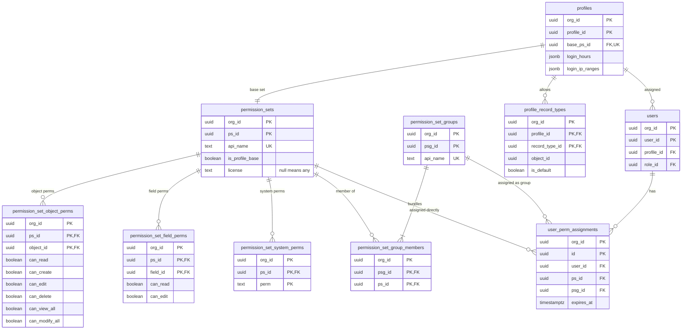
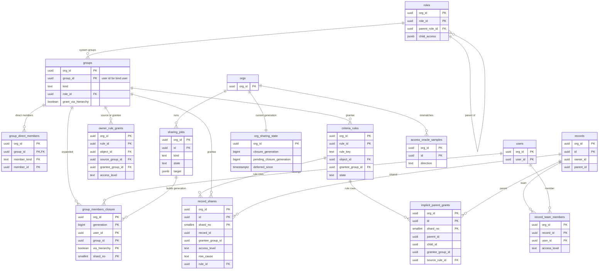

# Data model: 権限と共有

権限セット、プロファイル、割り当て、ロール、グループと閉包、共有ルール、共有の行、チーム、共有のジョブ、標本の照合。振る舞いは [sharing-and-record-access.md](../sharing-and-record-access.md)、決定は [ADR-0004](../../decisions/0004-record-access-model.md)・[ADR-0013](../../decisions/0013-permission-sets-and-field-level-security.md)・[ADR-0014](../../decisions/0014-owd-roles-groups-and-closure.md)・[ADR-0015](../../decisions/0015-sharing-reasons-and-where-they-live.md)・[ADR-0016](../../decisions/0016-recalculation-rule-versions-and-skew.md)・[ADR-0017](../../decisions/0017-reference-access-evaluator.md) にある。規約は [data-model.md](../data-model.md) の 3 節。

所有者と OWD は行に持たない。所有者・階層・所有者の条件の共有ルール・暗黙の子・親に連動は、問い合わせの時に `records.owner_id`・`records.parent_id` と閉包を結んで判定する。行に持つのは、レコードの条件の共有ルール・手動・チーム（`record_shares`）と、暗黙の親（`implicit_parent_grants`）だけ（[sharing-and-record-access.md](../sharing-and-record-access.md) の 5 節）。

## 1. ER 図

### 1.1 権限

### 1.2 共有

- 利用者のグループ（`kind = user`）の `group_id` は利用者の ID、キューの `group_id` はキューの ID と同じ。`records.owner_id` はそのまま閉包の `group_id` と結ぶ。
- `records` との線は DB の外部キーではない。

## 2. 権限の表

### 2.1 `permission_sets`

| 列 | 型 | NULL | 既定 | 説明 |
| --- | --- | --- | --- | --- |
| `org_id` | `uuid` | NOT NULL | — | |
| `ps_id` | `uuid` | NOT NULL | `uuidv7()` | 2026-09-28 に `id` から改名 |
| `api_name`・`label` | `text` | NOT NULL | — | |
| `description` | `text` | NULL | — | |
| `is_profile_base` | `boolean` | NOT NULL | `false` | プロファイルの基本の権限セット |
| `license` | `text` | NULL | — | 割り当てられるライセンス（空なら全て。[ADR-0043](../../decisions/0043-orgs-editions-licenses-and-users.md)） |

- キー：PK `(org_id, ps_id)`。UK `(org_id, api_name)`。種類 `meta`（`permsets` の部品）。上限：組織 1,000。

### 2.2 `permission_set_object_perms`・`permission_set_field_perms`・`permission_set_system_perms`

| 表 | 列 | キー |
| --- | --- | --- |
| `permission_set_object_perms` | `org_id`、`ps_id`、`object_id`（オブジェクト、または組織が定義するイベントの型）、`can_read`・`can_create`・`can_edit`・`can_delete`・`can_view_all`・`can_modify_all`（`boolean`、既定 `false`） | PK `(org_id, ps_id, object_id)`。索引 `(org_id, object_id)` |
| `permission_set_field_perms` | `org_id`、`ps_id`、`field_id`、`can_read`・`can_edit`（`boolean`） | PK `(org_id, ps_id, field_id)`。索引 `(org_id, field_id)`（項目の削除） |
| `permission_set_system_perms` | `org_id`、`ps_id`、`perm`（`text`） | PK `(org_id, ps_id, perm)` |

- 列の名前は 2026-09-28 に `read` などから `can_*` に改めた（SQL の予約語を避ける）。
- CHECK（依存）：`NOT can_create OR can_read`、`NOT can_edit OR can_read`、`NOT can_delete OR can_edit`、`NOT can_view_all OR can_read`、`NOT can_modify_all OR (can_delete AND can_view_all)`、`NOT can_edit OR can_read`（項目）。`perm IN (...)`（25 の権限。正本は [orgs-users-and-auth.md](../orgs-users-and-auth.md) の 7.1 節）。システムの権限の依存と、必須の項目の `can_edit` は保存の時にデータ層で検査する。
- 行のない組み合わせは全て偽。種類 `meta`。

### 2.3 `permission_set_groups`・`permission_set_group_members`

| 表 | 列 | キー |
| --- | --- | --- |
| `permission_set_groups` | `org_id`、`psg_id`、`api_name`、`label` | PK `(org_id, psg_id)`、UK `(org_id, api_name)` |
| `permission_set_group_members` | `org_id`、`psg_id`、`ps_id` | PK `(org_id, psg_id, ps_id)`、索引 `(org_id, ps_id)` |

### 2.4 `profiles`・`profile_record_types`

プロファイルは既定値の入れ物（レイアウトの割り当て、使えるレコードタイプ、ログインの制限）。権限は基本の権限セットで持つ。

| 列 | 型 | NULL | 既定 | 説明 |
| --- | --- | --- | --- | --- |
| `org_id` | `uuid` | NOT NULL | — | |
| `profile_id` | `uuid` | NOT NULL | `uuidv7()` | 2026-09-28 に `id` から改名 |
| `api_name`・`label` | `text` | NOT NULL | — | 標準：`system_admin`・`standard_user`・`read_only`・`integration` |
| `base_ps_id` | `uuid` | NOT NULL | — | 基本の権限セット（`is_profile_base`） |
| `is_standard` | `boolean` | NOT NULL | `false` | |
| `login_hours` | `jsonb` | NULL | — | 曜日ごとの時間帯（組織のタイムゾーン） |
| `login_ip_ranges` | `jsonb` | NULL | — | CIDR の一覧 |

- キー：PK `(org_id, profile_id)`。UK `(org_id, api_name)`、`(org_id, base_ps_id)`。種類 `meta`。
- `profile_record_types`（2026-09-28 に定めた表）：`org_id`、`profile_id`、`record_type_id`、`object_id`、`is_default`。PK `(org_id, profile_id, record_type_id)`、部分一意 `(org_id, profile_id, object_id) WHERE is_default`。種類 `meta`。
- ページレイアウトの割り当ては `layout_assignments`（[ui-and-list-views.md](ui-and-list-views.md)）。

### 2.5 `user_perm_assignments`

権限セットか権限セットのグループの割り当て。データの変更で、バージョンを上げない（利用者の `perm_shape` のキャッシュを消す）。

| 列 | 型 | NULL | 既定 | 説明 |
| --- | --- | --- | --- | --- |
| `org_id` | `uuid` | NOT NULL | — | |
| `id` | `uuid` | NOT NULL | `uuidv7()` | |
| `user_id` | `uuid` | NOT NULL | — | |
| `ps_id` | `uuid` | NULL | — | どちらか一方 |
| `psg_id` | `uuid` | NULL | — | |
| `expires_at` | `timestamptz` | NULL | — | 期限を過ぎたら判定で無視し、1 時間ごとに消す |
| `assigned_by`・`assigned_at` | | NOT NULL | — | 監査（`permission`）にも残す |

- キー：PK `(org_id, id)`。部分一意 `(org_id, user_id, ps_id) WHERE ps_id IS NOT NULL`、`(org_id, user_id, psg_id) WHERE psg_id IS NOT NULL`。索引 `(org_id, user_id)` — 要求の開始時の `perm_shape`。`(org_id, ps_id)`・`(org_id, psg_id)` — 定義の変更の影響。
- CHECK：`num_nonnulls(ps_id, psg_id) = 1`。1 利用者の権限セット（展開の後）100 まで。
- 期限の掃除は、期限のある割り当てを作る時に `jobs`（class `maintenance`）で予約する。種類 `data`。

## 3. 共有の表

### 3.1 `roles`

| 列 | 型 | NULL | 既定 | 説明 |
| --- | --- | --- | --- | --- |
| `org_id` | `uuid` | NOT NULL | — | |
| `role_id` | `uuid` | NOT NULL | `uuidv7()` | |
| `api_name`・`label` | `text` | NOT NULL | — | |
| `parent_role_id` | `uuid` | NULL | — | 木。深さ 20 まで |
| `child_access` | `jsonb` | NOT NULL | `'{}'` | 取引先の所有者が子に与える水準（`{"opportunity": "read", "contact": "edit"}`。値は `none`・`read`・`edit`） |

- キー：PK `(org_id, role_id)`。UK `(org_id, api_name)`。FK `(org_id, parent_role_id)` → `roles`。索引 `(org_id, parent_role_id)`。
- 循環と深さはデータ層で検査する。種類 `meta`（`sharing` の部品）。上限：組織 2,000。

### 3.2 `groups`・`group_direct_members`

全ての種類のグループを 1 つの表に置く。所属の変更はデータの変更で、閉包を直す。

| 列 | 型 | NULL | 既定 | 説明 |
| --- | --- | --- | --- | --- |
| `org_id` | `uuid` | NOT NULL | — | |
| `group_id` | `uuid` | NOT NULL | — | `user` は利用者の ID、`queue` はキューの ID |
| `kind` | `text` | NOT NULL | — | `user`・`queue`・`role`・`role_and_subordinates`・`public` |
| `api_name`・`label` | `text` | NULL | — | `queue`・`public` だけ（2026-09-28 に足した） |
| `role_id` | `uuid` | NULL | — | `role`・`role_and_subordinates` だけ |
| `grant_via_hierarchy` | `boolean` | NOT NULL | `true` | `public`・`queue` のメンバーの上司にも与えるか |
| `queue_object_ids` | `uuid[]` | NULL | — | キューが所有できるオブジェクト（2026-09-28 に足した） |

| `group_direct_members` の列 | 説明 |
| --- | --- |
| `org_id`、`group_id` | |
| `member_kind` | `user`・`role`・`role_and_subordinates`・`group` |
| `member_id` | 利用者・ロール・グループの ID |

- キー：`groups` の PK `(org_id, group_id)`、UK `(org_id, kind, role_id) WHERE role_id IS NOT NULL`、`(org_id, api_name) WHERE api_name IS NOT NULL`。`group_direct_members` の PK `(org_id, group_id, member_kind, member_id)`、索引 `(org_id, member_kind, member_id)`（逆引き）。
- CHECK：`kind IN ('role','role_and_subordinates')` と `role_id IS NOT NULL` が同値。入れ子は 5 段まで（データ層）。種類 `data`。上限：公開グループ・キュー 5,000。

### 3.3 `group_members_closure`

利用者が（入れ子と階層を展開して）属するグループ。ロール階層もこの表で表す（上司は部下の `user` のグループに `via_hierarchy = true` で属する）。定義元：4.4 節。

| 列 | 型 | NULL | 既定 | 説明 |
| --- | --- | --- | --- | --- |
| `shard_no` | `smallint` | NOT NULL | — | |
| `org_id` | `uuid` | NOT NULL | — | |
| `generation` | `bigint` | NOT NULL | — | 閉包の世代（`org_sharing_state.closure_generation`） |
| `user_id` | `uuid` | NOT NULL | — | |
| `group_id` | `uuid` | NOT NULL | — | |
| `via_hierarchy` | `boolean` | NOT NULL | — | 階層の継承だけで属するか |

- キー：PK `(org_id, generation, user_id, group_id, via_hierarchy, shard_no)`（`G_me` の読みは主キーの範囲の読み 1 回）。索引 `(org_id, generation, group_id, user_id)` — 所有者の条件のルールのメンバー、キューのメンバー。
- 1 人の利用者の所属の変更は同じトランザクションで今の世代を直す（1 万行まで）。ロールの木の移動などは新しい世代を作って切り替え、古い世代を後で消す。種類 `copy`。
- S1 の量：55 万行（最大の組織で 10 万）。1 利用者の閉包が 2 万行を超えたら警告。

### 3.4 `owner_rule_grants`

所有者の条件の共有ルール（「グループ A のメンバーが所有するレコードを、グループ B に水準 L で」）。行を書き直さず、問い合わせの時に閉包と結ぶ。

| 列 | 型 | NULL | 既定 | 説明 |
| --- | --- | --- | --- | --- |
| `org_id`、`rule_id` | `uuid` | NOT NULL | — | |
| `api_name` | `text` | NOT NULL | — | |
| `object_id` | `uuid` | NOT NULL | — | |
| `source_group_id`・`grantee_group_id` | `uuid` | NOT NULL | — | ロール、ロールと部下、公開グループ |
| `access_level` | `text` | NOT NULL | — | `read`・`edit` |

- キー：PK `(org_id, rule_id)`。UK `(org_id, object_id, api_name)`。種類 `meta`（`sharing` の部品）。上限：1 オブジェクトの共有ルール 300。

### 3.5 `criteria_rules`

レコードの条件の共有ルール。ルールの変更は新しい `rule_id` を作り、古いものと 1 つのバージョンで入れ替える。

| 列 | 型 | NULL | 既定 | 説明 |
| --- | --- | --- | --- | --- |
| `org_id`、`rule_id` | `uuid` | NOT NULL | — | バージョンごとの ID |
| `rule_key` | `text` | NOT NULL | — | バージョンをまたいで変わらない名前（`api_name`） |
| `object_id` | `uuid` | NOT NULL | — | |
| `condition` | `text` | NOT NULL | — | 数式の言語（分類 A、同じレコードの項目だけ） |
| `grantee_group_id` | `uuid` | NOT NULL | — | |
| `access_level` | `text` | NOT NULL | — | `read`・`edit` |
| `state` | `text` | NOT NULL | `'building'` | `building`・`active`・`retired` |

- キー：PK `(org_id, rule_id)`。部分一意 `(org_id, rule_key) WHERE state = 'active'`、`(org_id, object_id) WHERE state = 'building'`（作成中は 1 オブジェクト 1 つ）。
- 種類 `meta`。有効なルールの集合（`$rules`）は `sharing` の部品に入る。上限：1 オブジェクト 50。

### 3.6 `record_shares`

レコードの条件のルール・手動・チームによる付与。OWD に関わらず常に保つ（OWD の変更で書き直さない）。

| 列 | 型 | NULL | 既定 | 説明 |
| --- | --- | --- | --- | --- |
| `shard_no`・`org_id` | | NOT NULL | — | |
| `id` | `uuid` | NOT NULL | `uuidv7()` | 手動の共有の API の `share_id` |
| `object_id` | `uuid` | NOT NULL | — | |
| `record_id` | `uuid` | NOT NULL | — | |
| `grantee_group_id` | `uuid` | NOT NULL | — | 利用者・ロール・ロールと部下・公開グループ（チームは利用者のグループ） |
| `access_level` | `text` | NOT NULL | — | `read`・`edit` |
| `row_cause` | `text` | NOT NULL | — | `manual`・`team`・`rule` |
| `rule_id` | `uuid` | NULL | — | `rule` の時だけ（バージョンごとの ID） |
| `created_by`・`created_at` | | NOT NULL | — | |

- キー：PK `(org_id, id, shard_no)`。UK `(org_id, record_id, grantee_group_id, row_cause, rule_id, shard_no) NULLS NOT DISTINCT`。
- 索引：`(org_id, record_id, grantee_group_id)` — 判定の `EXISTS`。`(org_id, grantee_group_id, object_id, record_id)` — 計画 P2（共有から進める）。`(org_id, rule_id) WHERE rule_id IS NOT NULL` — `retired` のルールの行の削除。
- CHECK：`(row_cause = 'rule') = (rule_id IS NOT NULL)`、`access_level IN ('read','edit')`。
- 所有者の変更で `manual` の行を消す。ごみ箱の間も残す。1 レコードの手動の共有 500 まで。種類 `data`（`rule` の行は `copy`）。
- S1 の量：9 億行、約 0.11TB。

### 3.7 `implicit_parent_grants`

暗黙の親（子の商談・取引先責任者を見られる人は、親の取引先を `read` で見られる）。子ごとに持ち、親のスキューで同じ行を奪い合わない。

| 列 | 型 | NULL | 既定 | 説明 |
| --- | --- | --- | --- | --- |
| `shard_no`・`org_id` | | NOT NULL | — | |
| `id` | `uuid` | NOT NULL | `uuidv7()` | |
| `parent_object_id` | `uuid` | NOT NULL | — | 取引先 |
| `parent_id` | `uuid` | NOT NULL | — | |
| `child_id` | `uuid` | NOT NULL | — | |
| `grantee_group_id` | `uuid` | NOT NULL | — | 子の所有者の `user` のグループ、子の `record_shares` の相手 |
| `source_rule_id` | `uuid` | NULL | — | 子のルールの行から来た時の `rule_id` |

- キー：PK `(org_id, id, shard_no)`。UK `(org_id, child_id, grantee_group_id, source_rule_id, shard_no) NULLS NOT DISTINCT`。索引 `(org_id, parent_id, grantee_group_id)` — 判定。`(org_id, source_rule_id) WHERE source_rule_id IS NOT NULL`。
- 子の所有者・親・共有の変更で、その子の行を作り直す。種類 `copy`。S1 の量：2.25 億行、約 0.03TB。

### 3.8 `record_team_members`

取引先チームと商談チーム。メンバーごとに `record_shares(row_cause = 'team')` を持つ。

| 列 | 型 | NULL | 既定 | 説明 |
| --- | --- | --- | --- | --- |
| `org_id`、`record_id`、`user_id` | `uuid` | NOT NULL | — | |
| `object_id` | `uuid` | NOT NULL | — | |
| `team_role` | `text` | NULL | — | 選択リストの値 |
| `access_level` | `text` | NOT NULL | — | `read`・`edit` |
| `added_by`・`added_at` | | NOT NULL | — | |

- キー：PK `(org_id, record_id, user_id)`。索引 `(org_id, user_id)`。所有者の変更でもチームを残す。1 レコード 100 人まで。

### 3.9 `org_sharing_state`

閉包の今の世代と、共有の計算の保留（2026-09-28 に定めた表）。世代の番号は `sharing` の部品に入り、要求は 1 つの世代に固定される。

| 列 | 型 | NULL | 既定 | 説明 |
| --- | --- | --- | --- | --- |
| `org_id` | `uuid` | NOT NULL | — | |
| `closure_generation` | `bigint` | NOT NULL | `1` | 今の世代 |
| `pending_closure_generation` | `bigint` | NULL | — | 作っている世代 |
| `deferred_since` | `timestamptz` | NULL | — | `defer_sharing` で保留にした時刻（7 日で警告） |
| `deferred_by` | `uuid` | NULL | — | |

- キー：PK `(org_id)`。世代の切り替えは、メタデータのバージョンを上げる同じトランザクションで `closure_generation` を書き換える。

### 3.10 `sharing_jobs`

レコードの条件のルールのバージョンと、閉包の世代のジョブ。

| 列 | 型 | NULL | 既定 | 説明 |
| --- | --- | --- | --- | --- |
| `org_id`、`id` | `uuid` | NOT NULL | — | |
| `kind` | `text` | NOT NULL | — | `rule`・`closure` |
| `target` | `jsonb` | NOT NULL | — | `rule`：新旧の `rule_id`。`closure`：作る世代と、`pending` の構成の変更（ロールの移動、グループの入れ子の変更） |
| `state` | `text` | NOT NULL | `'queued'` | `queued`・`building`・`verifying`・`switched`・`failed`・`cancelled` |
| `progress` | `jsonb` | NOT NULL | `'{}'` | 済んだ ID の範囲（1 万件）・利用者の範囲 |
| `deferred` | `boolean` | NOT NULL | `false` | 保留の間に作った（切り替えを待つ） |
| `oracle_result` | `jsonb` | NULL | — | 切り替えの前の標本の照合（1,000 件）の結果 |
| `requested_by`・`created_at`・`started_at`・`finished_at` | | | | |

- キー：PK `(org_id, id)`。部分一意 `(org_id) WHERE kind = 'closure' AND state IN ('queued','building','verifying')`（閉包のジョブは組織で 1 つ）。仕事は `jobs`（class `sharing`、組織ごとの同時 2、閉包 1）。保持：終わってから 90 日。

### 3.11 `access_oracle_samples`

本番の標本の照合で、2 回とも食い違ったものだけを残す（[ADR-0017](../../decisions/0017-reference-access-evaluator.md)）。

| 列 | 型 | NULL | 既定 | 説明 |
| --- | --- | --- | --- | --- |
| `org_id`、`id` | `uuid` | NOT NULL | — | |
| `user_id`・`record_id`・`object_id` | `uuid` | NOT NULL | — | |
| `decided`・`oracle` | `text` | NOT NULL | — | 本番の判定と参照の評価器の判定（`none`・`read`・`edit`・`full`） |
| `direction` | `text` | NOT NULL | — | `over`（漏えいの疑い）・`under` |
| `metadata_version`・`closure_generation` | `bigint` | NOT NULL | — | |
| `checked_at` | `timestamptz` | NOT NULL | — | |

- キー：PK `(org_id, id)`。索引 `(org_id, checked_at DESC)`。保持：90 日（既定案）。値は持たない。
