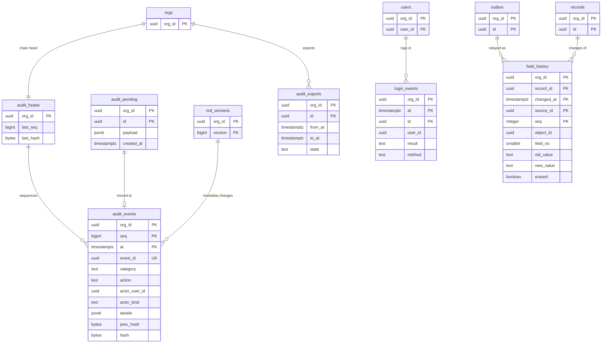

# Data model: 監査と履歴

設定の変更の監査（ハッシュの鎖）、ログインの履歴、項目の変更の履歴（`history` のクラスタ）。商談の履歴は [sales-objects.md](sales-objects.md)。振る舞いは [audit-and-field-history.md](../audit-and-field-history.md)、決定は [ADR-0046](../../decisions/0046-setup-audit-trail-and-login-history.md)・[ADR-0047](../../decisions/0047-field-history-tracking-and-retention.md) にある。規約は [data-model.md](../data-model.md) の 3 節。監査の外部の保管と錨は S3（[stores.md](stores.md) の 2 節）。

## 1. ER 図

- `field_history` は `history` のクラスタにある。`outbox` からの線は Relay の写し。
- 監査の鎖：`hash = SHA-256(prev_hash ‖ 正規化した行)`。

## 2. 監査

### 2.1 `audit_events`

設定の変更と、通常の規則を越える操作の監査。追記だけ。変更と同じトランザクションで書く（保存の経路からのものは `audit_pending` を経る）。

| 列 | 型 | NULL | 既定 | 説明 |
| --- | --- | --- | --- | --- |
| `org_id` | `uuid` | NOT NULL | — | |
| `seq` | `bigint` | NOT NULL | — | 組織の中の連番（1 から、欠番なし） |
| `event_id` | `uuid` | NOT NULL | — | |
| `at` | `timestamptz` | NOT NULL | — | |
| `category` | `text` | NOT NULL | — | `metadata`・`permission`・`user`・`sharing`・`auth`・`integration`・`deploy`・`data_bulk`・`data_override`・`org`・`support` |
| `action` | `text` | NOT NULL | — | 種類ごとの動作（`field.add`、`user.deactivate` など） |
| `actor_user_id` | `uuid` | NULL | — | |
| `actor_kind` | `text` | NOT NULL | — | `user`・`integration`・`system`・`support` |
| `via` | `text` | NOT NULL | — | `setup`・`api`・`deploy`・`flow`・`bulk`・`support` |
| `request_id` | `text` | NULL | — | |
| `ip` | `inet` | NULL | — | PII |
| `target_kind`・`target_id`・`target_label` | `text`・`uuid`・`text` | NULL | — | |
| `summary` | `text` | NOT NULL | — | 人が読む 1 行 |
| `details` | `jsonb` | NOT NULL | `'{}'` | 種類ごとの Zod の許可リストで作る。秘密・レコードの値を入れない。メタデータは `details.version` で `md_versions` を指す |
| `prev_hash`・`hash` | `bytea` | NOT NULL | — | |

- キー：PK `(org_id, seq, at)`。`PARTITION BY RANGE (at)`、月ごと。UK `(org_id, event_id, at)`。索引 `(org_id, at DESC)`、`(org_id, category, at DESC)`、`(org_id, actor_user_id, at DESC)` — Setup の画面と書き出しの絞り。
- 権限：アプリのロールは `INSERT`・`SELECT` だけ。`DROP` は `maint` だけ。読みは `view_audit_trail`。
- `seq` は `audit_heads` の行を `FOR UPDATE` で読んで採番する。
- 保持：180 日（Aurora）。外部の保管（S3、Object Lock）は 1 年。Sandbox へは写さない。S1 の量：1.8 億行（180 日）。

### 2.2 `audit_heads`

| 列 | 型 | NULL | 既定 | 説明 |
| --- | --- | --- | --- | --- |
| `org_id` | `uuid` | NOT NULL | — | |
| `last_seq` | `bigint` | NOT NULL | `0` | |
| `last_hash` | `bytea` | NOT NULL | — | 最初は組織ごとの固定の種 |

- キー：PK `(org_id)`。毎日 0 時（JST）に全ての組織の先頭を錨として S3 に書く。

### 2.3 `audit_pending`

保存の経路（承認のロックを越えた更新など）からのイベント。同じトランザクションで書き、Worker が 1 秒ごとに `audit_events` へ採番して移す（組織の 1 行を奪い合わないため）。

| 列 | 型 | NULL | 既定 | 説明 |
| --- | --- | --- | --- | --- |
| `org_id`・`id` | `uuid` | NOT NULL | — | 移した後の `event_id` |
| `payload` | `jsonb` | NOT NULL | — | `audit_events` の行の `seq`・ハッシュ以外 |
| `created_at` | `timestamptz` | NOT NULL | `now()` | |

- キー：PK `(org_id, id)`。移したら消す（同じトランザクション）。

### 2.4 `audit_exports`

外部の保管からの書き出し（非同期）。書き出しも `data_bulk` として記録する。

| 列 | 型 | NULL | 既定 | 説明 |
| --- | --- | --- | --- | --- |
| `org_id`・`id` | `uuid` | NOT NULL | — | |
| `from_at`・`to_at` | `timestamptz` | NOT NULL | — | 2026-09-28 に `from`・`to` から改名 |
| `category` | `text[]` | NULL | — | |
| `state` | `text` | NOT NULL | `'queued'` | `queued`・`running`・`succeeded`・`failed` |
| `s3_key` | `text` | NULL | — | 結果（API を通して渡す） |
| `requested_by`・`created_at`・`expires_at` | | NOT NULL | — | 24 時間 |

- キー：PK `(org_id, id)`。CHECK：`from_at < to_at`。

## 3. ログインの履歴

### 3.1 `login_events`

画面のログインの全ての試みと、OAuth のトークンの発行。outbox（`login_event`）から Worker がまとめて書く。

| 列 | 型 | NULL | 既定 | 説明 |
| --- | --- | --- | --- | --- |
| `org_id` | `uuid` | NOT NULL | — | 組織が決まる時だけ書く |
| `id` | `uuid` | NOT NULL | — | outbox の行から作る（二重を捨てる） |
| `at` | `timestamptz` | NOT NULL | — | |
| `user_id` | `uuid` | NULL | — | 利用者が決まらない失敗は空 |
| `username_hash` | `bytea` | NULL | — | 組織ごとの鍵の HMAC。打った文字列を残さない |
| `result` | `text` | NOT NULL | — | `success`・`failure`・`mfa_required`・`mfa_failure`・`blocked` |
| `reason` | `text` | NULL | — | `bad_password`・`no_user`・`frozen`・`ip_restricted`・`sso_assertion_invalid` など |
| `method` | `text` | NOT NULL | — | `password`・`passkey`・`sso_saml`・`sso_oidc`・`oauth_code`・`oauth_client_credentials`・`refresh` |
| `mfa_method` | `text` | NULL | — | |
| `sso_provider_id` | `uuid` | NULL | — | |
| `sso_assertion` | `jsonb` | NULL | — | 受け取った `amr`・`AuthnContextClassRef` の値（合否に関わらず） |
| `ip` | `inet` | NULL | — | PII |
| `country` | `text` | NULL | — | |
| `user_agent_short` | `text` | NULL | — | |
| `session_public_id` | `text` | NULL | — | セッションの公開の ID（トークンではない） |
| `client_id` | `text` | NULL | — | OAuth |
| `count` | `integer` | NOT NULL | `1` | 急増の時に 1 秒ごとにまとめた数 |

- キー：PK `(org_id, at, id)`。`PARTITION BY RANGE (at)`、月ごと。索引 `(org_id, user_id, at DESC)` — 本人と管理者の画面。
- 保持：180 日。Sandbox へは写さない。S1 の量：2,700 万行。

## 4. 項目の変更の履歴

### 4.1 `field_history`（`history` のクラスタ）

保存の手順 9 で同じトランザクションの outbox（`field_history`）に書き、Relay が写す。1 つのトランザクションの中の途中の値は残さず、最上位の最後の値と比べて 1 行にまとめる。

| 列 | 型 | NULL | 既定 | 説明 |
| --- | --- | --- | --- | --- |
| `org_id` | `uuid` | NOT NULL | — | |
| `object_id` | `uuid` | NOT NULL | — | |
| `record_id` | `uuid` | NOT NULL | — | |
| `changed_at` | `timestamptz` | NOT NULL | — | 確定の時刻（outbox の本文から。写し直しても同じ値） |
| `source_id` | `uuid` | NOT NULL | — | outbox の行の ID（2026-09-28 に足した。二重の写しを捨てる） |
| `seq` | `integer` | NOT NULL | — | outbox の行の中の順 |
| `field_no` | `smallint` | NULL | — | 作成・削除・戻すの行は空 |
| `event` | `text` | NOT NULL | `'changed'` | `changed`・`created`・`deleted`・`restored` |
| `changed_by` | `uuid` | NOT NULL | — | |
| `tx_id` | `uuid` | NOT NULL | — | |
| `via` | `text` | NOT NULL | — | `ui`・`api`・`bulk`・`flow`・`approval`・`system` |
| `old_value`・`new_value` | `text` | NULL | — | `records.data` と同じ形の文字列（`long_text` は持たない）。PII になりうる |
| `erased` | `boolean` | NOT NULL | `false` | 本人の請求で値を消した |

- キー：PK `(org_id, record_id, changed_at, source_id, seq)`。`PARTITION BY RANGE (changed_at)`、月ごと（`shard_no` では分けない）。索引 `(org_id, object_id, changed_at)` — 履歴のレポート。
- Relay は `INSERT ... ON CONFLICT DO NOTHING` で書く。
- RLS。読みは主のクラスタでレコードの共有と FLS を判定してから `(org_id, record_id)` で引く。
- 保持：18 か月（19 か月目の最初の日に分割を `DROP`）。レコードの消去・項目の値の消去で行を消す。組織の移動で写す。Sandbox へは写さない。
- S1 の量：18 か月で 350 億行・約 3.5TB（1 行 100B）。1 つの月の分割が 500GB を超えたら論理シャードで分ける。
