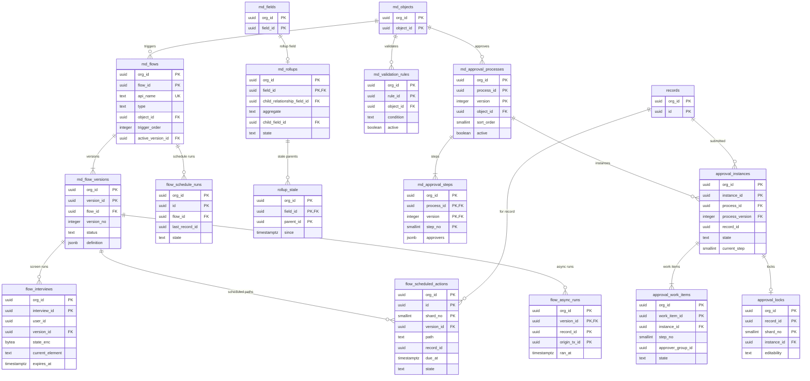

# Data model: 自動化

フローの定義と版、画面のフローの実行、予定の経路、非同期の経路、スケジュールのフロー、入力規則、積み上げ集計、承認のプロセスとロック。振る舞いは [automation-flows.md](../automation-flows.md)、決定は [ADR-0025](../../decisions/0025-flow-definition-and-bulk-engine.md)・[ADR-0026](../../decisions/0026-record-triggered-flow-order-and-recursion.md)・[ADR-0027](../../decisions/0027-roll-up-summaries-incremental-with-reconciliation.md)・[ADR-0028](../../decisions/0028-approval-processes-and-record-locks.md) にある。規約は [data-model.md](../data-model.md) の 3 節。

## 1. ER 図

## 2. フロー

### 2.1 `md_flows`・`md_flow_versions`

| 表 | 列 | キー |
| --- | --- | --- |
| `md_flows` | `org_id`、`flow_id`、`api_name`、`label`、`type`（`record_before_save`・`record_after_save`・`scheduled`・`screen`・`autolaunched`・`event_triggered`）、`object_id`（レコードの変更のフロー）、`event_type_id`（`event_triggered`）、`trigger_order`（1〜2,000）、`active_version_id`、`run_as`（`system`・`system_with_sharing`・`user`）、`run_as_user_id`（予定・スケジュールの実行する利用者）、`schedule`（`jsonb`、`scheduled` だけ） | PK `(org_id, flow_id)`。UK `(org_id, api_name)`。索引 `(org_id, object_id, type, trigger_order) WHERE active_version_id IS NOT NULL`（呼び出しの表） |
| `md_flow_versions` | `org_id`、`version_id`、`flow_id`、`version_no`（`integer`）、`status`（`draft`・`active`・`obsolete`）、`definition`（`jsonb`。要素・変数・起動の条件・予定の経路。項目は `field_id`） | PK `(org_id, version_id)`。UK `(org_id, flow_id, version_no)`。部分一意 `(org_id, flow_id) WHERE status = 'active'` |

- 有効化はメタデータの版を 1 つ上げる。画面のフロー・予定の経路が参照する版は `obsolete` でも消さない。種類 `meta`。
- 上限：1 つの版の要素 500、1 つのフローの版 50、1 オブジェクト・1 手順の有効なフロー 50。

### 2.2 `flow_interviews`

画面のフローの実行の状態。

| 列 | 型 | NULL | 既定 | 説明 |
| --- | --- | --- | --- | --- |
| `org_id`・`interview_id` | `uuid` | NOT NULL | — | |
| `user_id` | `uuid` | NOT NULL | — | 本人だけが続けられる |
| `version_id` | `uuid` | NOT NULL | — | 始めた時の版 |
| `state_enc` | `bytea` | NOT NULL | — | 変数の値。組織の `secrets` の DEK で暗号化（2026-09-28 に `state` から改名） |
| `current_element` | `text` | NOT NULL | — | |
| `last_dml_element` | `text` | NULL | — | 「戻る」の限り |
| `status` | `text` | NOT NULL | `'running'` | `running`・`finished`・`expired` |
| `expires_at` | `timestamptz` | NOT NULL | — | 最後の操作から 7 日 |

- キー：PK `(org_id, interview_id)`。索引 `(org_id, user_id) WHERE status = 'running'`、`(org_id, expires_at) WHERE status = 'running'`。上限：組織の生きている実行 5 万。保持：7 日で `expired` にして状態を消す。Sandbox へは写さない。

### 2.3 `flow_scheduled_actions`

保存の後のフローの予定の経路。手順 7b で同じトランザクションで書く。

| 列 | 型 | NULL | 既定 | 説明 |
| --- | --- | --- | --- | --- |
| `shard_no`・`org_id` | | NOT NULL | — | |
| `id` | `uuid` | NOT NULL | `uuidv7()` | |
| `version_id` | `uuid` | NOT NULL | — | |
| `path` | `text` | NOT NULL | — | 予定の経路の名前 |
| `record_id` | `uuid` | NOT NULL | — | |
| `due_at` | `timestamptz` | NOT NULL | — | 基準の項目が変わる保存で直す |
| `state` | `text` | NOT NULL | `'pending'` | `pending`・`done`・`skipped`・`cancelled` |

- キー：PK `(org_id, id, shard_no)`。UK `(org_id, version_id, path, record_id, shard_no) WHERE state = 'pending'`。索引 `(org_id, state, due_at)` — 期限の来た行の取り出し。`(org_id, record_id) WHERE state = 'pending'` — 基準の項目の変更、削除での `cancelled`。
- 期限の来た仕事は、行を書く時に `jobs`（class `flow_async`、`available_at = due_at`）で予約する。上限：組織の `pending` 1,000 万。保持：`pending` 以外は 7 日で消す。Sandbox へは写さない。

### 2.4 `flow_async_runs`

非同期の経路の二重の実行を防ぐ。実行の変更と同じトランザクションで書く。

| 列 | 型 | NULL | 既定 | 説明 |
| --- | --- | --- | --- | --- |
| `org_id`・`version_id`・`record_id` | `uuid` | NOT NULL | — | |
| `origin_tx_id` | `uuid` | NOT NULL | — | 元の保存のトランザクション |
| `ran_at` | `timestamptz` | NOT NULL | `now()` | |

- キー：PK `(org_id, version_id, record_id, origin_tx_id)`。索引 `(org_id, ran_at)`（掃除）。保持：7 日。種類 `log`。

### 2.5 `flow_schedule_runs`

スケジュールのフローの 1 回の実行の進み。

| 列 | 型 | NULL | 既定 | 説明 |
| --- | --- | --- | --- | --- |
| `org_id`・`id` | `uuid` | NOT NULL | — | |
| `flow_id`・`version_id` | `uuid` | NOT NULL | — | |
| `started_at` | `timestamptz` | NOT NULL | — | |
| `last_record_id` | `uuid` | NULL | — | 最後に確定した塊の最後（再開の位置） |
| `count` | `integer` | NOT NULL | `0` | 実行した件数 |
| `skipped` | `integer` | NOT NULL | `0` | 24 時間の上限で飛ばした件数 |
| `state` | `text` | NOT NULL | `'running'` | `running`・`done`・`failed` |

- キー：PK `(org_id, id)`。索引 `(org_id, flow_id, started_at DESC)`。保持：90 日。

## 3. 入力規則と積み上げ集計

### 3.1 `md_validation_rules`

| 列 | 型 | NULL | 既定 | 説明 |
| --- | --- | --- | --- | --- |
| `org_id`・`rule_id` | `uuid` | NOT NULL | — | |
| `object_id` | `uuid` | NOT NULL | — | |
| `api_name` | `text` | NOT NULL | — | |
| `condition` | `text` | NOT NULL | — | 真ならエラー（数式の言語） |
| `message` | `text` | NOT NULL | — | 項目の名前だけを差し込める |
| `error_field_id` | `uuid` | NULL | — | 空なら画面の上 |
| `active` | `boolean` | NOT NULL | `true` | |

- キー：PK `(org_id, rule_id)`。UK `(org_id, object_id, api_name)`。種類 `meta`（`object:<object_id>` の部品）。上限：1 オブジェクトの有効なもの 100。

### 3.2 `md_rollups`

積み上げ集計の定義（`md_fields.type = rollup_summary` の項目から分けて引く）。

| 列 | 型 | NULL | 既定 | 説明 |
| --- | --- | --- | --- | --- |
| `org_id`・`field_id` | `uuid` | NOT NULL | — | 親の積み上げ集計の項目 |
| `child_relationship_field_id` | `uuid` | NOT NULL | — | 子の主従の項目 |
| `aggregate` | `text` | NOT NULL | — | `count`・`sum`・`min`・`max` |
| `child_field_id` | `uuid` | NULL | — | `count` 以外 |
| `filter` | `text` | NULL | — | 子の項目だけの数式（分類 A） |
| `state` | `text` | NOT NULL | `'building'` | `building`・`active`（`md_fields.state` と揃える） |

- キー：PK `(org_id, field_id)`。索引 `(org_id, child_relationship_field_id)` — 子の保存で関わる積み上げ集計を引く。CHECK：`aggregate = 'count'` と `child_field_id IS NULL` が同値。種類 `meta`。上限：1 オブジェクト 25。

### 3.3 `rollup_stale`

子が 5 万件を超えて同期で集計し直さなかった親。Worker が 1 時間以内に直す。

| 列 | 型 | NULL | 既定 | 説明 |
| --- | --- | --- | --- | --- |
| `org_id`・`field_id`・`parent_id` | `uuid` | NOT NULL | — | |
| `since` | `timestamptz` | NOT NULL | — | |

- キー：PK `(org_id, field_id, parent_id)`。行を書く時に `jobs`（class `metadata_post`）で予約する。直したら消す。

## 4. 承認のプロセス

### 4.1 `md_approval_processes`・`md_approval_steps`

定義は版を持ち、インスタンスは申請した時の版を最後まで使う。

| 表 | 列 | キー |
| --- | --- | --- |
| `md_approval_processes` | `org_id`、`process_id`、`version`（`integer`）、`api_name`、`object_id`、`sort_order`（2026-09-28 に `order` から改名）、`active`、`entry_condition`（数式）、`allowed_submitters`（`jsonb`）、`record_editability`（`admin_only`・`admin_or_current_approver`）、`allow_recall`・`final_approval_lock`・`final_rejection_unlock`（`boolean`）、`actions`（`jsonb`）、`approval_admins`（`uuid[]`） | PK `(org_id, process_id, version)`。UK `(org_id, object_id, api_name, version)`。索引 `(org_id, object_id, sort_order) WHERE active` |
| `md_approval_steps` | `org_id`、`process_id`、`version`、`step_no`（1〜30）、`condition`（数式）、`approvers`（`jsonb`、25 まで：`user`・`queue`・`manager_of_submitter`・`manager_of_owner`・`user_field`）、`when_multiple`（`unanimous`・`first_response`）、`reject_behavior`（`reject_request`・`back_to_previous`）、`actions`（`jsonb`） | PK `(org_id, process_id, version, step_no)`。FK `(org_id, process_id, version)` → `md_approval_processes` |

- CHECK：`step_no = 1` なら `reject_behavior = 'reject_request'`。有効なプロセスは 1 オブジェクト 50、組織 1,000。種類 `meta`。

### 4.2 `approval_instances`

| 列 | 型 | NULL | 既定 | 説明 |
| --- | --- | --- | --- | --- |
| `org_id`・`instance_id` | `uuid` | NOT NULL | — | |
| `process_id` | `uuid` | NOT NULL | — | 2026-09-28 に足した |
| `process_version` | `integer` | NOT NULL | — | |
| `object_id`・`record_id` | `uuid` | NOT NULL | — | |
| `state` | `text` | NOT NULL | `'pending'` | `pending`・`approved`・`rejected`・`recalled`・`error` |
| `current_step` | `smallint` | NULL | — | |
| `submitted_by`・`submitted_at` | | NOT NULL | — | |
| `closed_at` | `timestamptz` | NULL | — | |

- キー：PK `(org_id, instance_id)`。部分一意 `(org_id, record_id) WHERE state = 'pending'`（1 つのレコードで `pending` は 1 つ）。FK `(org_id, process_id, process_version)` → `md_approval_processes`。索引 `(org_id, record_id, submitted_at DESC)` — 承認の履歴。
- 申請・応答・取り消し・付け替えは 1 つのトランザクションで、インスタンスを `FOR UPDATE` で読む。Sandbox へは写さない。保持：レコードに従う。

### 4.3 `approval_work_items`

段 × 承認者の作業の項目。

| 列 | 型 | NULL | 既定 | 説明 |
| --- | --- | --- | --- | --- |
| `org_id`・`work_item_id` | `uuid` | NOT NULL | — | |
| `instance_id` | `uuid` | NOT NULL | — | |
| `step_no` | `smallint` | NOT NULL | — | |
| `approver_group_id` | `uuid` | NOT NULL | — | 利用者のグループかキュー |
| `state` | `text` | NOT NULL | `'pending'` | `pending`・`approved`・`rejected`・`reassigned`・`cancelled` |
| `acted_by`・`acted_at` | | NULL | — | |
| `comment` | `text` | NULL | — | |
| `row_version` | `integer` | NOT NULL | `1` | 2 回目の応答は 409 `WORK_ITEM_ALREADY_DECIDED` |

- キー：PK `(org_id, work_item_id)`。索引 `(org_id, instance_id, step_no)`、`(org_id, approver_group_id) WHERE state = 'pending'` — 「自分の承認待ち」（キューは閉包で展開）。

### 4.4 `approval_locks`

承認のロック。保存の手順 2 で主キーの読み 1 回（塊ごとにまとめる）で確かめる。

| 列 | 型 | NULL | 既定 | 説明 |
| --- | --- | --- | --- | --- |
| `shard_no`・`org_id` | | NOT NULL | — | |
| `record_id` | `uuid` | NOT NULL | — | |
| `instance_id` | `uuid` | NOT NULL | — | |
| `editability` | `text` | NOT NULL | — | `admin_only`・`admin_or_current_approver` |

- キー：PK `(org_id, record_id, shard_no)`。申請で書き、プロセスの規則（承認・却下・取り消し）で消す。Sandbox へは写さない。S1 の量：数十万行。
