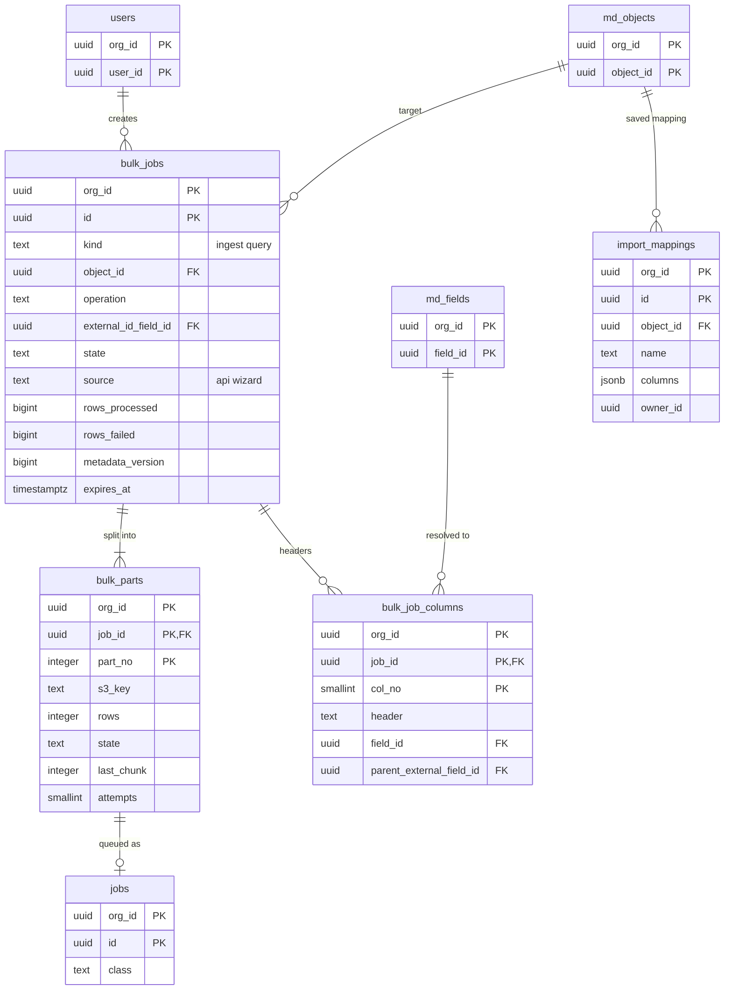

# Data model: 一括とインポート

一括の取り込み・問い合わせのジョブ、部分、見出しの解決、インポートのウィザードの対応。振る舞いは [bulk-and-import.md](../bulk-and-import.md)、決定は [ADR-0036](../../decisions/0036-bulk-jobs-chunking-and-partial-success.md)・[ADR-0037](../../decisions/0037-import-wizard-upsert-and-duplicate-matching.md) にある。規約は [data-model.md](../data-model.md) の 3 節。CSV と結果のファイルの置き場所と形は [stores.md](stores.md) の 2.2 節と 5 節。

## 1. ER 図

## 2. 表

### 2.1 `bulk_jobs`

| 列 | 型 | NULL | 既定 | 説明 |
| --- | --- | --- | --- | --- |
| `org_id`・`id` | `uuid` | NOT NULL | — | API の ID も UUID のまま |
| `kind` | `text` | NOT NULL | — | `ingest`・`query` |
| `object_id` | `uuid` | NOT NULL | — | |
| `operation` | `text` | NULL | — | `insert`・`update`・`upsert`・`delete`・`hard_delete`・`match_update`（`ingest` だけ） |
| `external_id_field_id` | `uuid` | NULL | — | `upsert` の鍵（外部 ID の項目。`id` なら空） |
| `query` | `text` | NULL | — | `query` の問い合わせ（`query_all` を含む） |
| `options` | `jsonb` | NOT NULL | `'{}'` | 区切り、改行、文字コード、`concurrency`、`sort_by_parent`、`allow_duplicates` |
| `state` | `text` | NOT NULL | `'open'` | `open`・`upload_complete`・`in_progress`・`job_complete`・`failed`・`aborted` |
| `source` | `text` | NOT NULL | `'api'` | `api`・`wizard` |
| `created_by` | `uuid` | NOT NULL | — | ジョブはこの利用者の権限で処理する |
| `rows_processed`・`rows_failed` | `bigint` | NOT NULL | `0` | |
| `metadata_version` | `bigint` | NULL | — | 見出しを解決したバージョン |
| `first_range_at`・`last_range_at` | `timestamptz` | NULL | — | `query` の最初と最後の範囲の時刻 |
| `created_at`・`completed_at` | `timestamptz` | | | |
| `expires_at` | `timestamptz` | NOT NULL | — | `open` は 24 時間、終わったら 7 日 |

- キー：PK `(org_id, id)`。索引 `(org_id, created_by, created_at DESC)`、`(org_id, state) WHERE state IN ('open','upload_complete','in_progress')`（同時の数 `conc.bulk_jobs`）、`(org_id, expires_at)`（掃除）。
- CHECK：`kind = 'ingest'` と `operation IS NOT NULL` が同値、`kind = 'query'` と `query IS NOT NULL` が同値。
- `hard_delete` は `bulk_hard_delete` を要し、監査（`data_bulk`）に残す。保持：7 日で行と S3 のファイルを消す。Sandbox へは写さない。

### 2.2 `bulk_parts`

1 万行の部分。部分ごとに `jobs`（class `bulk_ingest`）に入れる。

| 列 | 型 | NULL | 既定 | 説明 |
| --- | --- | --- | --- | --- |
| `org_id`・`job_id` | `uuid` | NOT NULL | — | |
| `part_no` | `integer` | NOT NULL | — | |
| `s3_key` | `text` | NOT NULL | — | 部分の CSV |
| `rows` | `integer` | NOT NULL | — | 10,000 まで |
| `state` | `text` | NOT NULL | `'queued'` | `queued`・`running`・`done`・`failed` |
| `last_chunk` | `integer` | NOT NULL | `-1` | 最後に確定した塊（200 行）の番号。塊のトランザクションの中で書く |
| `attempts` | `smallint` | NOT NULL | `0` | |
| `rows_failed` | `integer` | NOT NULL | `0` | |

- キー：PK `(org_id, job_id, part_no)`。FK `(org_id, job_id)` → `bulk_jobs`（`ON DELETE CASCADE`）。
- 同じ塊を 2 回確定しない（`last_chunk` の更新と塊の保存が同じトランザクション）。

### 2.3 `bulk_job_columns`

CSV の見出しの解決（`upload_complete` の時のバージョンで）。

| 列 | 型 | NULL | 既定 | 説明 |
| --- | --- | --- | --- | --- |
| `org_id`・`job_id` | `uuid` | NOT NULL | — | |
| `col_no` | `smallint` | NOT NULL | — | |
| `header` | `text` | NOT NULL | — | CSV の見出し（API の名前、`<参照の項目>.<親の外部 ID>`） |
| `field_id` | `uuid` | NULL | — | 空は `id` の列 |
| `parent_external_field_id` | `uuid` | NULL | — | 親の外部 ID で指す時 |

- キー：PK `(org_id, job_id, col_no)`。FK `(org_id, job_id)` → `bulk_jobs`（`ON DELETE CASCADE`）。

### 2.4 `import_mappings`

インポートのウィザードで保存した列の対応の型。

| 列 | 型 | NULL | 既定 | 説明 |
| --- | --- | --- | --- | --- |
| `org_id`・`id` | `uuid` | NOT NULL | — | |
| `object_id` | `uuid` | NOT NULL | — | |
| `name` | `text` | NOT NULL | — | |
| `columns` | `jsonb` | NOT NULL | — | 見出し → `field_id`、照合の規則、文字コード |
| `owner_id` | `uuid` | NOT NULL | — | |
| `updated_at` | `timestamptz` | NOT NULL | — | |

- キー：PK `(org_id, id)`。UK `(org_id, owner_id, object_id, name)`。
