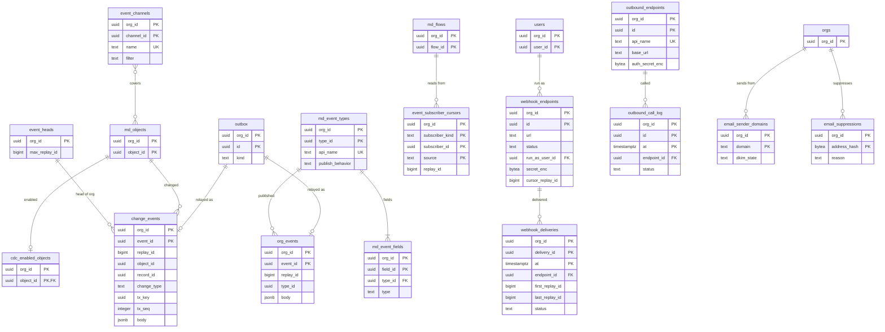

# Data model: イベントと連携

変更のイベント、組織が定義するイベント、購読のカーソル、Webhook、外向きの呼び出し、メールの送信。振る舞いは [events-and-integrations.md](../events-and-integrations.md)、決定は [ADR-0033](../../decisions/0033-change-event-log-and-replay.md)・[ADR-0034](../../decisions/0034-event-subscription-access-and-org-events.md)・[ADR-0035](../../decisions/0035-webhooks-outbound-calls-and-ssrf-guard.md) にある。規約は [data-model.md](../data-model.md) の 3 節。本文の形（変更のイベント、Webhook、SQS）は [stores.md](stores.md) の 4 節。

`change_events`・`org_events`・`event_heads` は `events` のクラスタ、他は主のクラスタにある。

## 1. ER 図

- `outbox` → `change_events`・`org_events` の線は Relay の写し（クラスタをまたぐ）。`event_id` は outbox の行の ID。
- `webhook_endpoints` のカーソルは `events` のクラスタの `replay_id` を指す（DB の外部キーではない）。

## 2. `events` のクラスタ

### 2.1 `change_events`

変更のイベント。1 レコード 1 件。Relay が組織ごとに確定の順の `replay_id` を付けて書く。定義元：[events-and-integrations.md](../events-and-integrations.md) の 3 節。

| 列 | 型 | NULL | 既定 | 説明 |
| --- | --- | --- | --- | --- |
| `org_id` | `uuid` | NOT NULL | — | |
| `event_id` | `uuid` | NOT NULL | — | outbox の行の ID（UUIDv7）。二重の送信を捨てる鍵で、分割の鍵 |
| `replay_id` | `bigint` | NOT NULL | — | 確定の時刻 48 ビット ｜ 論理シャードの中の連番 16 ビット |
| `object_id` | `uuid` | NOT NULL | — | |
| `record_id` | `uuid` | NULL | — | 隙間のイベントで複数の時は空（本文の `record_ids`） |
| `change_type` | `text` | NOT NULL | — | `CREATE`・`UPDATE`・`DELETE`・`UNDELETE`・`GAP_CREATE`・`GAP_UPDATE`・`GAP_DELETE`・`GAP_UNDELETE`・`PURGED` |
| `tx_key` | `uuid` | NOT NULL | — | 最上位のトランザクション |
| `tx_seq` | `integer` | NOT NULL | — | |
| `commit_ts` | `timestamptz` | NOT NULL | — | |
| `body` | `jsonb` | NOT NULL | — | 見出しと項目の値。項目は `field_no` をキーに持ち、配信の時の版で API の名前に直す。256KB まで |

- キー：PK `(org_id, event_id)`。`PARTITION BY RANGE (event_id)`、日ごと（UTC の日の頭の UUIDv7 の下限で区切る）。索引 `(org_id, replay_id)` — 取り出し・SSE・Webhook の読み。`(org_id, object_id, replay_id)` — `/changes/<object>`。`replay_id` の一意は Relay の採番で守る（分割の鍵を含まない一意の制約は張れない）。
- RLS。書くのは `relay` のロールだけ。保持：3 日（4 日目の分割を `DROP`）。組織の削除では分割の `DROP` を待たずに `DELETE`。
- 2026-09-28 の決定：起票の時の「主キー `(org_id, replay_id)`、取り込みの日の分割」を、`event_id` の範囲の分割と主キーに改めた（[data-model.md](../data-model.md) の 8 節）。
- S1 の量：1 日 4,300 万行、3 日で 1.3 億行・約 130GB。

### 2.2 `org_events`

組織が定義するイベント。`after_commit` は outbox から Relay が、`immediate` は API の要求の中で書く。

| 列 | 型 | NULL | 既定 | 説明 |
| --- | --- | --- | --- | --- |
| `org_id`・`event_id` | `uuid` | NOT NULL | — | `after_commit` は outbox の行の ID、`immediate` は新しい UUIDv7 |
| `replay_id` | `bigint` | NOT NULL | — | |
| `type_id` | `uuid` | NOT NULL | — | |
| `publish_behavior` | `text` | NOT NULL | — | `after_commit`・`immediate` |
| `published_by` | `uuid` | NOT NULL | — | 利用者 |
| `tx_key` | `uuid` | NULL | — | `after_commit` の時 |
| `body` | `jsonb` | NOT NULL | — | イベントの項目の値（`field_id` をキー）。64KB まで |

- キー・分割・保持は `change_events` と同じ。索引 `(org_id, replay_id)`、`(org_id, type_id, replay_id)`。

### 2.3 `event_heads`

組織の最新の `replay_id`。Relay がイベントの `INSERT` と同じトランザクションで進め、購読者に Valkey の Pub/Sub で知らせる。

| 列 | 型 | NULL | 既定 | 説明 |
| --- | --- | --- | --- | --- |
| `org_id` | `uuid` | NOT NULL | — | |
| `max_replay_id` | `bigint` | NOT NULL | — | |
| `updated_at` | `timestamptz` | NOT NULL | — | |

- キー：PK `(org_id)`。RLS。

## 3. 主のクラスタ

### 3.1 `cdc_enabled_objects`・`event_channels`

| 表 | 列 | キー |
| --- | --- | --- |
| `cdc_enabled_objects` | `org_id`、`object_id` | PK `(org_id, object_id)`。数は `alloc.cdc_objects`（Enterprise 20） |
| `event_channels` | `org_id`、`channel_id`、`name`（`/changes/custom/<name>` の `<name>`）、`object_ids`（`uuid[]`）、`filter`（数式、分類 A） | PK `(org_id, channel_id)`。UK `(org_id, name)` |

- 種類 `meta`。対象でないオブジェクトは outbox に `change_event` を書かない。

### 3.2 `md_event_types`・`md_event_fields`

| 表 | 列 | キー |
| --- | --- | --- |
| `md_event_types` | `org_id`、`type_id`、`api_name`（`x_` の接頭辞）、`label`、`publish_behavior`（`after_commit`・`immediate`、既定 `after_commit`） | PK `(org_id, type_id)`。UK `(org_id, api_name)` |
| `md_event_fields` | `org_id`、`field_id`、`type_id`、`api_name`、`type`（`text`・`number`・`currency`・`percent`・`date`・`datetime`・`checkbox`・`id`）、`type_params`（`jsonb`）、`required` | PK `(org_id, field_id)`。UK `(org_id, type_id, api_name)` |

- 種類 `meta`。発行・購読の権限は `permission_set_object_perms` の `can_create`・`can_read`（`object_id` にイベントの型の ID）。

### 3.3 `event_subscriber_cursors`

イベントで起動するフローの購読者ごとの続きの位置。フローの実行と同じトランザクションで進め、二重の配信を防ぐ。

| 列 | 型 | NULL | 既定 | 説明 |
| --- | --- | --- | --- | --- |
| `org_id` | `uuid` | NOT NULL | — | |
| `subscriber_kind` | `text` | NOT NULL | `'flow'` | |
| `subscriber_id` | `uuid` | NOT NULL | — | `flow_id` |
| `source` | `text` | NOT NULL | — | イベントの型の `api_name` かチャンネル |
| `replay_id` | `bigint` | NOT NULL | — | 済んだ最後 |
| `updated_at` | `timestamptz` | NOT NULL | — | |

- キー：PK `(org_id, subscriber_kind, subscriber_id, source)`。

### 3.4 `webhook_endpoints`

| 列 | 型 | NULL | 既定 | 説明 |
| --- | --- | --- | --- | --- |
| `org_id`・`id` | `uuid` | NOT NULL | — | |
| `name` | `text` | NOT NULL | — | |
| `url` | `text` | NOT NULL | — | `https://`・443 だけ。送る時にも検査する |
| `status` | `text` | NOT NULL | `'active'` | `active`・`paused_quota`・`disabled` |
| `sources` | `text[]` | NOT NULL | — | チャンネルとイベントの型 |
| `run_as_user_id` | `uuid` | NOT NULL | — | 配信の権限（DT-EVT-001 と FLS）を決める利用者 |
| `secret_enc` | `bytea` | NOT NULL | — | `<brand>_whsec_` の秘密。組織の `secrets` の DEK |
| `secret_prev_enc` | `bytea` | NULL | — | 入れ替えの前の秘密（24 時間まで） |
| `secret_prev_expires_at` | `timestamptz` | NULL | — | |
| `cursor_replay_id` | `bigint` | NULL | — | 2xx を受けた最後 |
| `next_attempt_at` | `timestamptz` | NULL | — | 再試行の予定 |
| `attempt` | `smallint` | NOT NULL | `0` | 同じまとまりの試行の回数 |
| `lease_owner`・`lease_until` | `text`・`timestamptz` | NULL | — | 送り手のリース（30 秒。1 つの宛先は同時に 1 つの送り手） |
| `first_failure_at`・`last_success_at`・`gap_notified_at` | `timestamptz` | NULL | — | 72 時間で `disabled`、欠けの知らせ |
| `created_by`・`created_at` | | NOT NULL | — | |

- キー：PK `(org_id, id)`。索引 `(org_id, status)`。CHECK：`secret_prev_enc IS NULL OR secret_prev_expires_at IS NOT NULL`。
- 送り手の取り出しは `jobs`（class `delivery`、`available_at = next_attempt_at`）で予約する。数は組織 20。Sandbox へは `disabled` で、秘密なしで写す。

### 3.5 `webhook_deliveries`

まとまりごとの配信の記録。本文は持たない。

| 列 | 型 | NULL | 既定 | 説明 |
| --- | --- | --- | --- | --- |
| `org_id` | `uuid` | NOT NULL | — | |
| `delivery_id` | `uuid` | NOT NULL | — | `<Brand>-Delivery-Id` |
| `at` | `timestamptz` | NOT NULL | — | 試行の時刻 |
| `endpoint_id` | `uuid` | NOT NULL | — | |
| `first_replay_id`・`last_replay_id` | `bigint` | NOT NULL | — | |
| `event_count` | `smallint` | NOT NULL | — | 100 まで |
| `status` | `text` | NOT NULL | — | `succeeded`・`failed`・`timeout`・`blocked`（宛先の検査） |
| `http_status` | `smallint` | NULL | — | |
| `duration_ms` | `integer` | NULL | — | |
| `attempt` | `smallint` | NOT NULL | — | |

- キー：PK `(org_id, delivery_id, at)`。`PARTITION BY RANGE (at)`、日ごと。索引 `(org_id, endpoint_id, at DESC)` — Setup の直近の 100 件。保持：7 日。

### 3.6 `outbound_endpoints`・`outbound_call_log`

フローの `call_webhook` の宛先と、送信の記録。任意の URL をフローの式で作らせない。

| 表 | 列 | キー |
| --- | --- | --- |
| `outbound_endpoints` | `org_id`、`id`、`api_name`、`base_url`、`auth_kind`（`none`・`bearer`・`basic`・`hmac`）、`auth_secret_enc`（`bytea`、組織の `secrets` の DEK）、`headers`（`jsonb`、秘密を含めない）、`timeout_ms`（10,000、30,000 まで）、`status`（`active`・`disabled`） | PK `(org_id, id)`。UK `(org_id, api_name)` |
| `outbound_call_log` | `org_id`、`id`（`<Brand>-Delivery-Id`）、`at`、`endpoint_id`、`path`、`status`、`http_status`、`duration_ms`、`attempt` | PK `(org_id, id, at)`。`at` の日ごとの分割。索引 `(org_id, endpoint_id, at DESC)`。保持：7 日 |

- 送信は outbox（`delivery`）から Worker が署名して prod-egress の SQS へ渡す（[stores.md](stores.md) の 4.4 節）。Sandbox へは `disabled` で、秘密なしで写す。

### 3.7 `email_sender_domains`・`email_suppressions`

| 表 | 列 | キー |
| --- | --- | --- |
| `email_sender_domains` | `org_id`、`domain`、`dkim_state`（`pending`・`verified`・`failed`）、`spf_ok`（`boolean`）、`verified_at`、`created_at` | PK `(org_id, domain)` |
| `email_suppressions` | `org_id`、`address_hash`（`bytea`、正規化したアドレスの HMAC）、`reason`（`bounce`・`complaint`）、`created_at` | PK `(org_id, address_hash)` |

- 送信の前に `email_suppressions` と、取引先責任者・リードの `email_opt_out` を確かめる。
