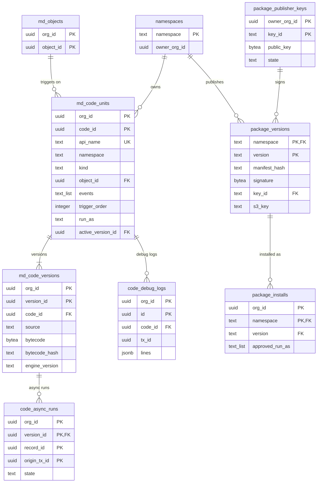

# Data model: 利用者のコードとパッケージ（E13・E14）

利用者のコード（トリガー）の定義とバージョン、非同期の実行、デバッグのログ、名前空間、パッケージの配布とインストール。MVP の後。振る舞いは [extensibility.md](../extensibility.md)、決定は [ADR-0048](../../decisions/0048-user-code-engine-quickjs-ng-on-wasmtime-fuel.md)・[ADR-0049](../../decisions/0049-triggers-in-dml-order-and-platform-api.md)・[ADR-0050](../../decisions/0050-packages-namespaces-and-code-isolation.md) にある。規約は [data-model.md](../data-model.md) の 3 節。

## 1. ER 図

- `namespaces`・`package_publisher_keys`・`package_versions` は `control` のスキーマ（RLS の外。全ての組織で一意）。`text_list` は `text[]` の意味。

## 2. 表

### 2.1 `md_code_units`・`md_code_versions`

| 表 | 列 | キー |
| --- | --- | --- |
| `md_code_units` | `org_id`、`code_id`、`api_name`、`namespace`（空なら組織の中のコード）、`kind`（`trigger`）、`object_id`、`events`（`text[]`：`before_save`・`after_save`・`after_commit`・`before_delete`・`after_delete`）、`trigger_order`（2026-09-28 に `order` から改名）、`run_as`（`user`・`system_with_sharing`）、`active_version_id` | PK `(org_id, code_id)`。UK `(org_id, namespace, api_name) NULLS NOT DISTINCT`。索引 `(org_id, object_id, trigger_order) WHERE active_version_id IS NOT NULL`（有効なトリガーの表） |
| `md_code_versions` | `org_id`、`version_id`、`code_id`、`source`（TypeScript）、`bytecode`（`bytea`）、`bytecode_hash`、`engine_version`、`built_at` | PK `(org_id, version_id)`。索引 `(org_id, code_id, built_at DESC)` |

- 種類 `meta`。有効なトリガーの表は `object:<object_id>` の部品に入る。エンジンのバージョンを上げたら作り直す。パッケージのコードの `source` は、インストールした組織に写すが、`locked` の名前空間では読みの API に返さない。

### 2.2 `code_async_runs`

`after_commit` のトリガーの二重の実行を防ぐ（`flow_async_runs` と同じ考え方）。

| 列 | 型 | NULL | 既定 | 説明 |
| --- | --- | --- | --- | --- |
| `org_id`・`version_id`・`record_id`・`origin_tx_id` | `uuid` | NOT NULL | — | |
| `attempts` | `smallint` | NOT NULL | `1` | |
| `state` | `text` | NOT NULL | — | `succeeded`・`failed` |
| `ran_at` | `timestamptz` | NOT NULL | `now()` | |

- キー：PK `(org_id, version_id, record_id, origin_tx_id)`。保持：7 日。

### 2.3 `code_debug_logs`

| 列 | 型 | NULL | 既定 | 説明 |
| --- | --- | --- | --- | --- |
| `org_id`・`id` | `uuid` | NOT NULL | — | |
| `code_id` | `uuid` | NOT NULL | — | |
| `tx_id`・`user_id` | `uuid` | NOT NULL | — | |
| `lines` | `jsonb` | NOT NULL | — | ログの行（利用者が読めない項目の値を伏せる） |
| `created_at` | `timestamptz` | NOT NULL | `now()` | |

- キー：PK `(org_id, id)`。索引 `(org_id, code_id, created_at DESC)`。保持：7 日。

### 2.4 `namespaces`・`package_publisher_keys`・`package_versions`（`control`）

| 表 | 列 | キー |
| --- | --- | --- |
| `namespaces` | `namespace`（全ての組織で一意）、`owner_org_id`、`registered_at` | PK `(namespace)` |
| `package_publisher_keys` | `owner_org_id`、`key_id`、`public_key`、`state`（`active`・`revoked`）、`created_at`、`revoked_at` | PK `(owner_org_id, key_id)`。UK `(key_id)` |
| `package_versions` | `namespace`、`version`（semver）、`manifest_hash`、`signature`、`key_id`、`min_platform_version`、`s3_key`（`packages` のバケット）、`published_at` | PK `(namespace, version)`。FK `namespace` → `namespaces`、`key_id` → `package_publisher_keys` |

- RLS の外。書くのは管理のサービスだけ。鍵の取り消しで、その鍵のバージョンの新しいインストールを止める。

### 2.5 `package_installs`

| 列 | 型 | NULL | 既定 | 説明 |
| --- | --- | --- | --- | --- |
| `org_id` | `uuid` | NOT NULL | — | |
| `namespace` | `text` | NOT NULL | — | |
| `version` | `text` | NOT NULL | — | 今のバージョン |
| `installed_by`・`installed_at` | | NOT NULL | — | |
| `approved_run_as` | `text[]` | NOT NULL | `'{}'` | 管理者が承認した実行の文脈 |

- キー：PK `(org_id, namespace)`。RLS。インストールとバージョンの上げはメタデータのバージョンを上げ、監査（`deploy`）に残す。
