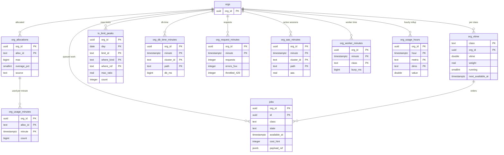

# Data model: 上限と使用量

組織ごとの割り当てと使用量、Worker の公平な順番（`jobs`・`org_vtime`）、上限に近い自動化、組織ごとの資源の使用量。振る舞いは [governor-limits.md](../governor-limits.md) と [observability.md](../observability.md) の 4 節、決定は [ADR-0041](../../decisions/0041-limits-registry-and-counting-rules.md)・[ADR-0042](../../decisions/0042-org-allocations-fair-queuing-and-limit-info.md)・[ADR-0058](../../decisions/0058-slis-and-per-org-resource-metrics.md)・[ADR-0059](../../decisions/0059-noisy-neighbor-detection-two-sources.md) にある。規約は [data-model.md](../data-model.md) の 3 節。

トランザクションの上限の値は、開発リポジトリの上限の登録簿（`packages/limits/registry.ts`）が正本で、DB に持たない。割り当ての今の数は Valkey の 1 分の桶が正で、DB の表はその写しと作り直しの元（[stores.md](stores.md) の 1 節）。

## 1. ER 図

- `org_vtime` は RLS の外（主のクラスタの `ops` のスキーマ。[data-model.md](../data-model.md) の 3.3 節）。他は RLS。

## 2. 割り当て

### 2.1 `org_allocations`

組織ごとの割り当ての値。既定はエディションとライセンスの数から作り、Ops の上書きは監査（`org`）に残す。

| 列 | 型 | NULL | 既定 | 説明 |
| --- | --- | --- | --- | --- |
| `org_id` | `uuid` | NOT NULL | — | |
| `alloc_id` | `text` | NOT NULL | — | `alloc.api_requests`・`alloc.bulk_rows`・`alloc.events_delivered` など（[governor-limits.md](../governor-limits.md) の 8.1 節） |
| `max` | `bigint` | NOT NULL | — | 窓の中の上限 |
| `overage_pct` | `smallint` | NOT NULL | `10` | 有料の本番は 10（110% で 429）、他は 0 |
| `source` | `text` | NOT NULL | `'edition'` | `edition`・`override` |
| `updated_by`・`updated_at` | | NOT NULL | — | |

- キー：PK `(org_id, alloc_id)`。ライセンスの数・エディションの変更で `source = edition` の行を作り直す。

### 2.2 `org_usage_minutes`

割り当ての 1 分の桶の写し（24 時間の移動の窓）。Valkey を失った時・組織の移動の後に Valkey を作り直す元。

| 列 | 型 | NULL | 既定 | 説明 |
| --- | --- | --- | --- | --- |
| `org_id` | `uuid` | NOT NULL | — | |
| `alloc_id` | `text` | NOT NULL | — | |
| `minute` | `timestamptz` | NOT NULL | — | 分の頭 |
| `count` | `bigint` | NOT NULL | — | |

- キー：PK `(org_id, alloc_id, minute)`。`PARTITION BY RANGE (minute)`、日ごと。保持：25 時間（2 日目の分割を `DROP`）。
- 1 時間ごとに Valkey の数と比べ、5% 以上ずれたら警告（`limit-counter-drift`）。S1 の量：1 日 約 1,000 万行。

## 3. Worker の順番

### 3.1 `jobs`

Worker の全ての仕事（class ごと）。SQS は「仕事が来た」の知らせだけで、順番はこの表で決める。

| 列 | 型 | NULL | 既定 | 説明 |
| --- | --- | --- | --- | --- |
| `org_id` | `uuid` | NOT NULL | — | |
| `id` | `uuid` | NOT NULL | `uuidv7()` | |
| `class` | `text` | NOT NULL | — | `bulk_ingest`・`bulk_query`・`report_async`・`sharing`・`flow_async`・`metadata_post`・`search_reindex`・`sandbox_copy`・`delivery`・`maintenance` |
| `state` | `text` | NOT NULL | `'queued'` | `queued`・`running`・`done`・`failed`・`cancelled` |
| `available_at` | `timestamptz` | NOT NULL | `now()` | これより前は取らない（予定の経路、ごみ箱の消去、再試行） |
| `cost_hint` | `integer` | NULL | — | 見込みの費用（DB の時間の秒） |
| `attempts` | `smallint` | NOT NULL | `0` | |
| `payload_ref` | `jsonb` | NOT NULL | — | 仕事の種類と対象の ID（`{"kind": "bulk_part", "job_id": ..., "part_no": 3}`）。値を入れない |
| `dedupe_key` | `text` | NULL | — | 同じ仕事を 2 回入れない（`purge:<batch_id>` など） |
| `locked_by`・`locked_until` | `text`・`timestamptz` | NULL | — | 取った Worker とリース |
| `created_at`・`finished_at` | `timestamptz` | | | |

- キー：PK `(org_id, id)`。部分一意 `(org_id, class, dedupe_key) WHERE state IN ('queued','running') AND dedupe_key IS NOT NULL`。索引 `(org_id, class, available_at) WHERE state = 'queued'` — 組織の最も古い仕事を `FOR UPDATE SKIP LOCKED` で取る。`(org_id, finished_at) WHERE state IN ('done','failed','cancelled')` — 掃除。
- 取り出し：`org_vtime` から組織を選び、`SET LOCAL app.org_id` してからこの表を読む（組織をまたいで読まない）。仕事を入れる・取る・終える時に、同じトランザクションで `org_vtime` を直す。
- **期限で動く仕事は全てここで予約する**（2026-09-28 の決定）：ごみ箱の消去（`available_at = purge_after`）、項目の値の消去、予定の経路（`due_at`）、定期の配信、Webhook の再試行、期限の掃除、整合の検査。組織をまたいで表を走査する役割を持たない。
- RLS。保持：終わった行は 7 日。S1 の量：待ちは平常で数万行。

### 3.2 `org_vtime`

class ごとの組織の仮想時刻（重み付きの公平な順番）。

| 列 | 型 | NULL | 既定 | 説明 |
| --- | --- | --- | --- | --- |
| `class` | `text` | NOT NULL | — | |
| `org_id` | `uuid` | NOT NULL | — | |
| `vtime` | `double precision` | NOT NULL | — | 終えた仕事の費用 / 重み の積み上げ。新しく仕事を持った組織は `max(自分, class の最小)` から |
| `weight` | `real` | NOT NULL | `1` | `1 + log2(ライセンスの数 + 1)`、上限 8。重い組織は半分 |
| `running` | `smallint` | NOT NULL | `0` | 実行中の数（`org_cap` まで） |
| `next_available_at` | `timestamptz` | NULL | — | 待ちの仕事の最も早い `available_at`。空なら仕事なし（2026-09-28 に足した） |

- キー：PK `(class, org_id)`。索引 `(class, vtime) WHERE next_available_at IS NOT NULL` — 取り出しの 1（`running < org_cap` かつ `next_available_at <= now()` の中で `vtime` の最小）。
- RLS の外（`ops`）。書くのは Worker（`app_worker`）だけ。S2 の前に取り出しの数を測り、1,000 件/秒を超える見込みなら Valkey へ移す。

## 4. 上限に近い自動化

### 4.1 `tx_limit_peaks`

トランザクションの上限の 80% を超えたフロー・要素・API の要求の、日ごとの最大と回数。Setup の「上限に近い自動化」の元。値とレコードの ID を持たない。

| 列 | 型 | NULL | 既定 | 説明 |
| --- | --- | --- | --- | --- |
| `org_id` | `uuid` | NOT NULL | — | |
| `day` | `date` | NOT NULL | — | UTC |
| `limit_id` | `text` | NOT NULL | — | `tx.query_rows` など |
| `where_kind` | `text` | NOT NULL | — | `flow`・`flow_element`・`api`・`bulk`・`code` |
| `where_ref` | `text` | NOT NULL | — | フローの `api_name`・要素、API の経路、コードの `api_name` |
| `max_ratio` | `real` | NOT NULL | — | 上限に対する最大の割合 |
| `count` | `integer` | NOT NULL | — | 80% を超えた回数 |

- キー：PK `(org_id, day, limit_id, where_kind, where_ref)`。保持：7 日。

## 5. 組織ごとの資源の使用量

1 分の粒度を 7 日、1 時間の粒度を 13 か月持つ（[ADR-0058](../../decisions/0058-slis-and-per-org-resource-metrics.md)）。1 分の表は `minute` の日ごとの分割で、8 日目の分割を `DROP` する。

| 表 | 列 | キー | 書き手 |
| --- | --- | --- | --- |
| `org_db_time_minutes` | `org_id`、`minute`、`cluster_id`、`path`（`runtime`・`worker`・`reader`）、`db_ms`（`bigint`） | PK `(org_id, minute, cluster_id, path)` | 計測器（Valkey の桶を 1 分ごとに写す） |
| `org_request_minutes` | `org_id`、`minute`、`requests`・`errors_5xx`・`throttled_429`（`integer`）、`latency_buckets`（`integer[]`、固定の桶の分布） | PK `(org_id, minute)` | `runtime` |
| `org_aas_minutes` | `org_id`、`minute`、`cluster_id`、`path`、`aas`（`real`） | PK `(org_id, minute, cluster_id, path)` | 監視の Worker（`pg_stat_activity` の `application_name`） |
| `org_worker_minutes` | `org_id`、`minute`、`class`、`busy_ms`（`bigint`） | PK `(org_id, minute, class)` | `worker` |
| `org_usage_hours` | `org_id`、`hour`、`metric`（`db_ms`・`requests`・`errors_5xx`・`throttled_429`・`aas`・`busy_ms`）、`dims`（`cluster_id`・`path`・`class` をつないだ文字列、なければ空）、`value`（`double precision`） | PK `(org_id, hour, metric, dims)`。`hour` の月ごとの分割 | 1 時間ごとの集計の仕事（2026-09-28 に定めた表） |

- 重い組織の判定（DB の時間の 10%、15 分）と騒がしい隣人の検知は、この表と Valkey の桶から行う（[observability.md](../observability.md) の 5 節）。
- 保持：1 分の表は 7 日、`org_usage_hours` は 13 か月。S1 の量：1 分の表の合計で 1 日 約 3,000 万行（使った組織と分だけ）。
