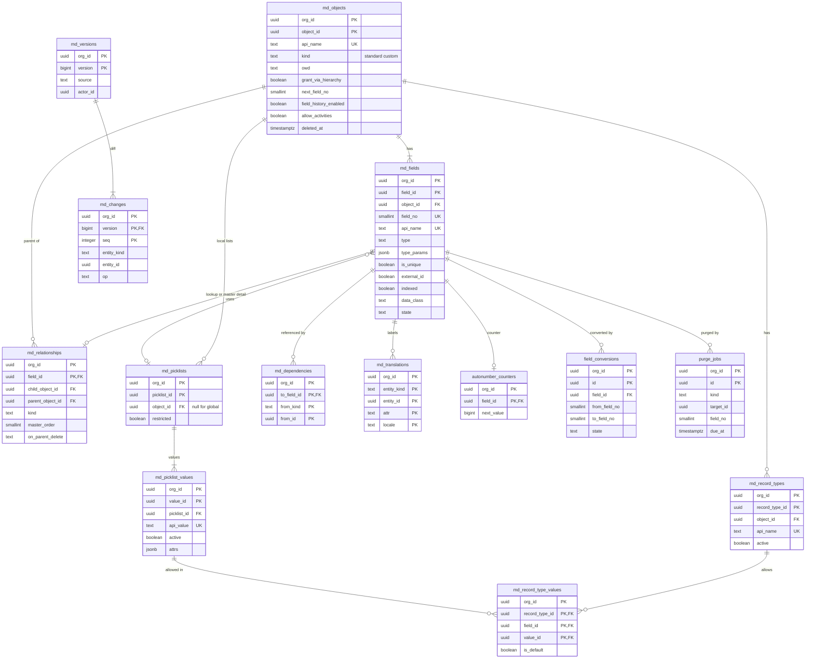

# Data model: メタデータ（データ辞書）

オブジェクト、項目、関係、選択リスト、レコードタイプ、依存、版と差分、翻訳、自動採番、型の変換、消去。振る舞いは [metadata-and-runtime.md](../metadata-and-runtime.md)、決定は [ADR-0003](../../decisions/0003-metadata-driven-runtime.md)・[ADR-0006](../../decisions/0006-data-dictionary-and-field-lifecycle.md)・[ADR-0007](../../decisions/0007-segmented-metadata-snapshots.md) にある。規約は [data-model.md](../data-model.md) の 3 節（特に 3.1 節の `field_id`・`field_no` と 3.11 節の版）。

## 1. ER 図

- 全ての `md_*` の表は種類 `meta`。変更は `orgs.metadata_version` を 1 つ上げる 1 つのトランザクションで行い、行は `created_version`・`updated_version`（`bigint NOT NULL`）を持つ（[data-model.md](../data-model.md) の 3.11 節。下の列の表では省く）。
- `autonumber_counters`・`field_conversions`・`purge_jobs` は種類 `data`（版を上げない）。
- 外部キーは組織の中の複合キー（`(org_id, object_id)` など）で張る。
- 部品（`object:<object_id>` など）への入り方は [metadata-and-runtime.md](../metadata-and-runtime.md) の 4.2 節。

## 2. 表

### 2.1 `md_objects`

オブジェクト（標準・カスタム）。標準オブジェクトも組織の作成時に種から行として入れる。

| 列 | 型 | NULL | 既定 | 説明 |
| --- | --- | --- | --- | --- |
| `org_id` | `uuid` | NOT NULL | — | |
| `object_id` | `uuid` | NOT NULL | `uuidv7()` | |
| `api_name` | `text` | NOT NULL | — | 標準は接頭辞なしの小文字のスネーク、カスタムは `x_` |
| `label`・`plural_label` | `text` | NOT NULL | — | 既定のロケールの表示。他は `md_translations` |
| `kind` | `text` | NOT NULL | — | `standard`・`custom` |
| `owd` | `text` | NOT NULL | `'private'` | `private`・`public_read`・`public_read_write`・`controlled_by_parent` |
| `grant_via_hierarchy` | `boolean` | NOT NULL | `true` | 標準は常に真 |
| `name_kind` | `text` | NOT NULL | `'text'` | `text`・`autonumber` |
| `autonumber_format` | `text` | NULL | — | 名前が自動採番の時（`INV-{0000}`） |
| `next_field_no` | `smallint` | NOT NULL | `1` | 次に割り当てる `field_no`。増えるだけ |
| `field_history_enabled` | `boolean` | NOT NULL | `false` | |
| `allow_activities` | `boolean` | NOT NULL | `false` | 活動の `what` になれるか |
| `deleted_at` | `timestamptz` | NULL | — | 削除中（15 日は戻せる） |

- キー：PK `(org_id, object_id)`。UK `(org_id, lower(api_name))`（削除中を含む。確定まで名前を再利用しない）。
- CHECK：`owd = 'controlled_by_parent'` は主従の従と活動だけ（保存の時にデータ層で検査）。`kind = 'standard'` なら `grant_via_hierarchy`。`next_field_no` の減る更新をトリガーで拒否。
- 上限：カスタムオブジェクト 800（[governor-limits.md](../governor-limits.md) の 6.2 節）。S1 の量：組織あたり数十〜数百、全体で約 50 万行。

### 2.2 `md_fields`

項目。定義元：[metadata-and-runtime.md](../metadata-and-runtime.md) の 3.1〜3.3 節。

| 列 | 型 | NULL | 既定 | 説明 |
| --- | --- | --- | --- | --- |
| `org_id` | `uuid` | NOT NULL | — | |
| `field_id` | `uuid` | NOT NULL | `uuidv7()` | 組織の系統の中で一意 |
| `object_id` | `uuid` | NOT NULL | — | |
| `field_no` | `smallint` | NOT NULL | — | `records.data` のキー。再利用しない |
| `api_name` | `text` | NOT NULL | — | |
| `label`・`help_text` | `text` | NULL | — | `label` は NOT NULL |
| `type` | `text` | NOT NULL | — | 3.3 節の型（`text` … `autonumber`、`polymorphic_lookup`） |
| `type_params` | `jsonb` | NOT NULL | `'{}'` | 長さ、精度、選択リスト、参照先、数式の式、積み上げ集計の定義の要約、変換の `target` |
| `required` | `boolean` | NOT NULL | `false` | |
| `is_unique` | `boolean` | NOT NULL | `false` | 2026-09-28 に `unique` から改名 |
| `unique_case_sensitive` | `boolean` | NOT NULL | `false` | |
| `external_id` | `boolean` | NOT NULL | `false` | 一意を伴う |
| `indexed` | `boolean` | NOT NULL | `false` | `record_index_values` に書く |
| `default_expr` | `text` | NULL | — | 数式の言語 |
| `data_class` | `text` | NOT NULL | `'none'` | `none`・`personal`・`sensitive`（[ADR-0038](../../decisions/0038-sandbox-types-and-masked-copy.md)） |
| `searchable` | `boolean` | NOT NULL | `false` | 1 オブジェクト 20 まで |
| `track_history` | `boolean` | NOT NULL | `false` | 1 オブジェクト 20 まで |
| `state` | `text` | NOT NULL | `'active'` | `active`・`converting`・`building`・`deleted` |
| `deleted_at` | `timestamptz` | NULL | — | |

- キー：PK `(org_id, field_id)`。UK `(org_id, object_id, field_no)`、`(org_id, object_id, lower(api_name))`（削除中を含む）。FK `(org_id, object_id)` → `md_objects`。
- 索引：`(org_id, object_id) WHERE state <> 'deleted'` — 部品のコンパイル。
- CHECK：`field_no BETWEEN 1 AND 32767`、`NOT external_id OR is_unique`、`NOT (is_unique OR external_id) OR type IN ('text','number','email','autonumber')`、`state IN (...)`、`data_class IN (...)`、`(state = 'deleted') = (deleted_at IS NOT NULL)`。`field_no < md_objects.next_field_no` をトリガーで確かめる。`searchable`・`track_history`・`indexed` の数（20・20・50）は保存の時にデータ層で検査する。
- 保持：削除の確定（15 日）で行を消す。`field_no` は欠番のまま。S1 の量：約 1,000 万行。

### 2.3 `md_relationships`

参照・主従・多態の参照の定義。主従の 1 本目は `records.parent_id` に写す。

| 列 | 型 | NULL | 既定 | 説明 |
| --- | --- | --- | --- | --- |
| `org_id` | `uuid` | NOT NULL | — | |
| `field_id` | `uuid` | NOT NULL | — | → `md_fields` |
| `child_object_id` | `uuid` | NOT NULL | — | 項目を持つ側 |
| `parent_object_id` | `uuid` | NULL | — | 多態の参照は空（参照先の一覧は `md_fields.type_params.targets`） |
| `kind` | `text` | NOT NULL | — | `lookup`・`master_detail`・`polymorphic_lookup` |
| `master_order` | `smallint` | NULL | — | 主従の 1・2 |
| `child_relationship_name` | `text` | NOT NULL | — | 親から子をたどる名前（関連リスト、問い合わせ） |
| `on_parent_delete` | `text` | NOT NULL | — | `set_null`・`restrict`・`cascade` |
| `reparentable` | `boolean` | NOT NULL | `true` | 主従の親の付け替えを許すか |

- キー：PK `(org_id, field_id)`。UK `(org_id, parent_object_id, child_relationship_name)`、`(org_id, child_object_id, master_order) WHERE kind = 'master_detail'`。
- CHECK：`kind = 'master_detail'` と `master_order IN (1,2)` と `on_parent_delete = 'cascade'` が揃う。`kind = 'polymorphic_lookup'` と `parent_object_id IS NULL` が同値。
- 上限：1 オブジェクトの関係 40、主従 2、主従の段 3。

### 2.4 `md_picklists`・`md_picklist_values`

選択リストと値。値は `value_id` で持ち、ラベルの変更で `records` を書き換えない。

| 表 | 列 |
| --- | --- |
| `md_picklists` | `org_id`、`picklist_id`（PK）、`object_id`（空なら全体の選択リスト）、`api_name`、`restricted`（`boolean`、既定 `true`）、`is_global`（`boolean`） |
| `md_picklist_values` | `org_id`、`value_id`（PK）、`picklist_id`、`api_value`（`text`）、`label`、`sort`（`integer`）、`active`（`boolean`）、`is_default`（`boolean`）、`attrs`（`jsonb`、既定 `'{}'`。フェーズの `default_probability`・`is_closed`・`is_won`・`forecast_category`、リードの状態の `converted`・`closed_unconverted`、ToDo の状態の `is_closed`） |

- キー：`md_picklists` の PK `(org_id, picklist_id)`、UK `(org_id, object_id, api_name)`。`md_picklist_values` の PK `(org_id, value_id)`、UK `(org_id, picklist_id, api_value)`、索引 `(org_id, picklist_id, sort)`。
- CHECK：`attrs` の形は選択リストの用途ごとの JSON Schema（フェーズなら `is_won → is_closed`）。1 つの選択リストの有効な値は 1,000 まで。

### 2.5 `md_record_types`・`md_record_type_values`

| 表 | 列 |
| --- | --- |
| `md_record_types` | `org_id`、`record_type_id`（PK）、`object_id`、`api_name`、`label`、`active`（`boolean`） |
| `md_record_type_values` | `org_id`、`record_type_id`、`field_id`、`value_id`、`is_default`（`boolean`）。PK `(org_id, record_type_id, field_id, value_id)` |

- キー：`md_record_types` の UK `(org_id, object_id, api_name)`。`md_record_type_values` の部分一意 `(org_id, record_type_id, field_id) WHERE is_default`。
- プロファイルごとの使えるレコードタイプと既定は `profile_record_types`（[access-and-sharing.md](access-and-sharing.md)）。

### 2.6 `md_dependencies`

数式・入力規則・フロー・レイアウト・リストビュー・共有ルール・レポートの型・重複の規則が参照する項目。コンパイルの時に作る（種類 `meta` だが、コンパイラだけが書く）。

| 列 | 型 | NULL | 既定 | 説明 |
| --- | --- | --- | --- | --- |
| `org_id` | `uuid` | NOT NULL | — | |
| `to_field_id` | `uuid` | NOT NULL | — | 参照される項目 |
| `from_kind` | `text` | NOT NULL | — | `formula`・`validation_rule`・`flow_version`・`layout`・`list_view`・`criteria_rule`・`report_type`・`report`・`matching_rule`・`rollup`・`code_version` |
| `from_id` | `uuid` | NOT NULL | — | 参照する要素 |

- キー：PK `(org_id, to_field_id, from_kind, from_id)`。索引 `(org_id, from_kind, from_id)` — 要素の作り直しで古い行を消す。
- 使い方：項目の削除の拒否、部品の作り直しの範囲（[ADR-0007](../../decisions/0007-segmented-metadata-snapshots.md)）、書き出しの `with_dependencies`、変更の下見。

### 2.7 `md_versions`・`md_changes`

版ごとの 1 行と、版の差分。直前の版へ戻すデプロイは、差分を逆に当てた新しい版として作る。

| 表 | 列 |
| --- | --- |
| `md_versions` | `org_id`、`version`（`bigint`）、`created_at`、`actor_id`（`uuid`、利用者か空）、`source`（`setup`・`deploy`・`system`）、`deploy_id`（`uuid`、`source = deploy` の時）、`summary`（`text`） |
| `md_changes` | `org_id`、`version`、`seq`（`integer`、版の中の順）、`entity_kind`（`object`・`field`・`layout`・`flow` など）、`entity_id`、`op`（`add`・`update`・`delete`・`restore`）、`before`・`after`（`jsonb`。秘密を含めない） |

- キー：`md_versions` の PK `(org_id, version)`。`md_changes` の PK `(org_id, version, seq)`、FK `(org_id, version)` → `md_versions`。索引 `(org_id, entity_kind, entity_id, version DESC)` — 要素の履歴、戻しの衝突の確かめ（[sandboxes-and-deploy.md](../sandboxes-and-deploy.md) の 6.5 節）。
- 保持：無期限（設定の変更は少ない）。Sandbox の作成では写さない（今の版を 1 つの版として作る）。監査は `details.version` でここを指す（[audit-and-history.md](audit-and-history.md)）。
- 上限：1 つの版で変える要素 10,000。

### 2.8 `md_translations`

ラベルの翻訳（日本語・英語）。`object`・`layouts` の部品にロケールごとに入れる（[ui-layouts-and-list-views.md](../ui-layouts-and-list-views.md) の 8 節）。

| 列 | 型 | NULL | 既定 | 説明 |
| --- | --- | --- | --- | --- |
| `org_id` | `uuid` | NOT NULL | — | |
| `entity_kind` | `text` | NOT NULL | — | `object`・`field`・`picklist_value`・`record_type`・`layout_section` など |
| `entity_id` | `uuid` | NOT NULL | — | |
| `attr` | `text` | NOT NULL | `'label'` | `label`・`plural_label`・`help_text`（2026-09-28 に足した） |
| `locale` | `text` | NOT NULL | — | `ja_JP`・`en_US` |
| `text` | `text` | NOT NULL | — | |

- キー：PK `(org_id, entity_kind, entity_id, attr, locale)`。

### 2.9 `autonumber_counters`

自動採番の次の値（2026-09-28 に定めた表。値は保存ごとに変わるのでメタデータにしない）。

| 列 | 型 | NULL | 既定 | 説明 |
| --- | --- | --- | --- | --- |
| `org_id` | `uuid` | NOT NULL | — | |
| `field_id` | `uuid` | NOT NULL | — | 自動採番の項目、または名前が自動採番のオブジェクトの名前の項目 |
| `next_value` | `bigint` | NOT NULL | `1` | 保存の手順 2 で `UPDATE ... RETURNING` で採る。巻き戻れば番号も戻る |

- キー：PK `(org_id, field_id)`。種類 `data`。Sandbox の複製では写す。

### 2.10 `field_conversions`

項目の型の変換の進み（[metadata-and-runtime.md](../metadata-and-runtime.md) の 5.2 節）。

| 列 | 型 | NULL | 既定 | 説明 |
| --- | --- | --- | --- | --- |
| `org_id` | `uuid` | NOT NULL | — | |
| `id` | `uuid` | NOT NULL | `uuidv7()` | |
| `field_id` | `uuid` | NOT NULL | — | |
| `from_field_no`・`to_field_no` | `smallint` | NOT NULL | — | |
| `from_type`・`to_type` | `text` | NOT NULL | — | |
| `state` | `text` | NOT NULL | `'previewing'` | `previewing`・`ready`・`converting`・`switched`・`cancelled`・`failed` |
| `policy` | `text` | NULL | — | 変換できない値：`blank`（空にする）・`abort` |
| `preview` | `jsonb` | NULL | — | 変換できない値の件数、例（読める項目だけ、20 件まで）、合わない依存 |
| `progress` | `jsonb` | NOT NULL | `'{}'` | 済んだ ID の範囲の最後 |
| `requested_by` | `uuid` | NOT NULL | — | |
| `started_at`・`switched_at` | `timestamptz` | NULL | — | |
| `old_purge_after` | `timestamptz` | NULL | — | `switched_at` ＋ 15 日。戻しのため古い `field_no` を残す期限 |

- キー：PK `(org_id, id)`。部分一意 `(org_id, field_id) WHERE state IN ('previewing','ready','converting')`（1 つの項目に動いている変換は 1 つ）。
- 保持：終わってから 1 年。

### 2.11 `purge_jobs`

削除を確定した項目・オブジェクト、切り替えの後の古い `field_no` の値の消去（[metadata-and-runtime.md](../metadata-and-runtime.md) の 5.4 節）。

| 列 | 型 | NULL | 既定 | 説明 |
| --- | --- | --- | --- | --- |
| `org_id` | `uuid` | NOT NULL | — | |
| `id` | `uuid` | NOT NULL | `uuidv7()` | |
| `kind` | `text` | NOT NULL | — | `field`・`object`・`old_field_no` |
| `target_id` | `uuid` | NOT NULL | — | `field_id` か `object_id` |
| `object_id` | `uuid` | NOT NULL | — | |
| `field_no` | `smallint` | NULL | — | `field`・`old_field_no` の時 |
| `confirmed_at` | `timestamptz` | NOT NULL | — | 確定の時刻 |
| `due_at` | `timestamptz` | NOT NULL | — | `confirmed_at` ＋ 7 日（消去の期限） |
| `progress` | `jsonb` | NOT NULL | `'{}'` | 済んだ ID の範囲 |
| `finished_at` | `timestamptz` | NULL | — | 終わったら監査に残す |

- キー：PK `(org_id, id)`。索引 `(org_id, due_at) WHERE finished_at IS NULL` — 遅れの計測（`field_purge_overdue`）。仕事は `jobs`（class `maintenance`）で予約する。
- 保持：終わってから 1 年。
