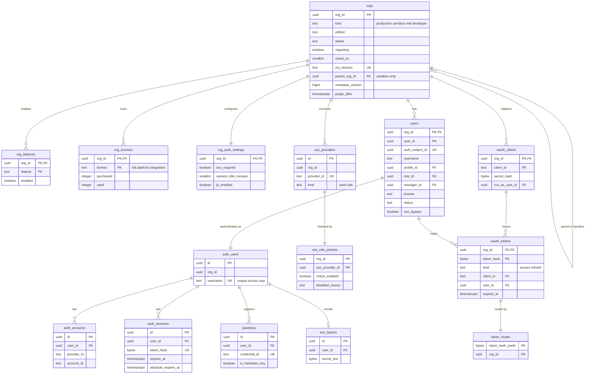

# Data model: 組織・利用者・認証

組織、機能の組とライセンス、利用者、ログイン（Better Auth の `identity` のスキーマ）、SSO の MFA の確かめ、OAuth、組織の解決。振る舞いは [orgs-users-and-auth.md](../orgs-users-and-auth.md)、決定は [ADR-0043](../../decisions/0043-orgs-editions-licenses-and-users.md)・[ADR-0044](../../decisions/0044-authentication-better-auth-sso-and-mfa.md)・[ADR-0045](../../decisions/0045-system-permissions-and-delegation.md) にある。規約は [data-model.md](../data-model.md) の 3 節。

## 1. ER 図

- `orgs`・`token_routes` は `control`、`auth_*`・`passkeys`・`two_factors`・`sso_providers` は `identity` のスキーマにあり、RLS の外（[data-model.md](../data-model.md) の 3.3 節）。図の `auth_users` などは `identity.auth_users` の略。
- `users` と `identity.auth_users` は 1 対 1（`users.auth_subject_id`）。1 人の人が 2 つの組織の利用者なら、認証の主体も 2 つ。
- `org_purge_log` は他の表と結ばない（組織の ID のハッシュだけ）ので、図に描かない。

## 2. 表

### 2.1 `orgs`（`control`）

組織。組織の解決のために RLS の外で読む。書くのは管理のサービスと `cross-org-worker` だけ。定義元：[orgs-users-and-auth.md](../orgs-users-and-auth.md) の 3.1 節。

| 列 | 型 | NULL | 既定 | 説明 |
| --- | --- | --- | --- | --- |
| `org_id` | `uuid` | NOT NULL | `uuidv7()` | |
| `name` | `text` | NOT NULL | — | 組織の表示の名前 |
| `kind` | `text` | NOT NULL | — | `production`・`sandbox`・`trial`・`developer` |
| `edition` | `text` | NOT NULL | — | `starter`・`pro`・`enterprise`・`unlimited`・`developer`（4 節） |
| `status` | `text` | NOT NULL | `'provisioning'` | `provisioning`・`active`・`read_only`・`suspended`・`deleting` |
| `migrating` | `boolean` | NOT NULL | `false` | 組織の移動の書き込みの止めの間だけ真（503 `ORG_MIGRATING`。[ADR-0056](../../decisions/0056-org-migration-by-row-filtered-logical-replication.md)） |
| `shard_no` | `smallint` | NOT NULL | — | 作成時に決め、変えない（[ADR-0010](../../decisions/0010-record-tables-partitioning-and-pivots.md)） |
| `region` | `text` | NOT NULL | `'ap-northeast-1'` | |
| `my_domain` | `text` | NOT NULL | — | `<org>.my.<brand>.<domain>` の `<org>`（3〜40 文字）。Sandbox は `<org>--<sandbox>` |
| `previous_my_domain` | `text` | NULL | — | 変更前の名前（90 日転送、1 年再利用しない） |
| `previous_my_domain_until` | `timestamptz` | NULL | — | 転送の期限 |
| `parent_org_id` | `uuid` | NULL | — | Sandbox の元の本番 |
| `sandbox_name`・`sandbox_kind` | `text` | NULL | — | Sandbox だけ。種類は `developer`・`developer_pro`・`partial`・`full` |
| `copied_at`・`refresh_available_at` | `timestamptz` | NULL | — | Sandbox の複製の時刻、次に再作成できる時刻 |
| `locale`・`timezone`・`currency` | `text` | NOT NULL | `'ja_JP'`・`'Asia/Tokyo'`・`'JPY'` | |
| `fiscal_year_start_month` | `smallint` | NOT NULL | `4` | 1〜12 |
| `metadata_version` | `bigint` | NOT NULL | `1` | 今のメタデータの版（[ADR-0003](../../decisions/0003-metadata-driven-runtime.md)） |
| `trial_ends_at` | `timestamptz` | NULL | — | 試用の終わり |
| `created_at` | `timestamptz` | NOT NULL | `now()` | |
| `deletion_requested_at`・`purge_after` | `timestamptz` | NULL | — | 削除の申し込みと、消去を始める時刻（30 日の猶予） |

- キー：PK `(org_id)`。UK `(my_domain)`、`(previous_my_domain) WHERE previous_my_domain IS NOT NULL`。FK `parent_org_id` → `orgs`。
- 索引：`(parent_org_id) WHERE parent_org_id IS NOT NULL` — Sandbox の一覧、本番の削除での連鎖。`(purge_after) WHERE status = 'deleting'` — 消去の開始（`cross-org-worker`）。
- CHECK：`shard_no BETWEEN 0 AND 255`、`kind = 'sandbox'` と `parent_org_id IS NOT NULL` が同値、`status IN (...)`。`shard_no` の更新はトリガーで拒否する。
- 保持：組織の消去の最後に行を消し、`org_purge_log` に残す。
- S1 の量：5,000 行（Sandbox を含む）。

### 2.2 `org_features`

機能の組（エディションから作る。下げで無効にし、消さない）。定義元：4 節。

| 列 | 型 | NULL | 既定 | 説明 |
| --- | --- | --- | --- | --- |
| `org_id` | `uuid` | NOT NULL | — | |
| `feature` | `text` | NOT NULL | — | `flows_all`、`sharing_rules`、`custom_report_types`、`webhooks`、`api`、`cdc` など |
| `enabled` | `boolean` | NOT NULL | — | |
| `source` | `text` | NOT NULL | `'edition'` | `edition`・`override`（Ops の上書き。監査） |
| `updated_at` | `timestamptz` | NOT NULL | `now()` | |

- キー：PK `(org_id, feature)`。RLS。S1 の量：組織 × 約 20。

### 2.3 `org_licenses`

ライセンスの数と使用の数。定義元：5.1 節。

| 列 | 型 | NULL | 既定 | 説明 |
| --- | --- | --- | --- | --- |
| `org_id` | `uuid` | NOT NULL | — | |
| `license` | `text` | NOT NULL | — | `full`・`platform`・`integration` |
| `purchased` | `integer` | NOT NULL | — | 契約の数 |
| `used` | `integer` | NOT NULL | `0` | 有効な利用者の数。利用者の有効化・無効化と同じトランザクションで直す |

- キー：PK `(org_id, license)`。CHECK：`used BETWEEN 0 AND purchased`（超える作成・有効化は `LICENSE_LIMIT_EXCEEDED`）。RLS。

### 2.4 `org_auth_settings`

組織の認証の設定。定義元：6.3〜6.5 節。

| 列 | 型 | NULL | 既定 | 説明 |
| --- | --- | --- | --- | --- |
| `org_id` | `uuid` | NOT NULL | — | |
| `sso_required` | `boolean` | NOT NULL | `false` | 画面のログインを SSO に限る（`sso_bypass` の利用者を除く） |
| `session_idle_minutes` | `smallint` | NOT NULL | `120` | 15〜720 |
| `password_min_length` | `smallint` | NOT NULL | `12` | 12 以上 |
| `password_expiry_days` | `smallint` | NULL | — | 組織が強める時だけ |
| `jit_enabled` | `boolean` | NOT NULL | `false` | SSO の初回の作成 |
| `jit_defaults` | `jsonb` | NOT NULL | `'{}'` | プロファイル・権限セットの既定と属性の対応 |
| `updated_by`・`updated_at` | `uuid`・`timestamptz` | NOT NULL | — | 監査（`auth`）にも残す |

- キー：PK `(org_id)`。CHECK：`session_idle_minutes BETWEEN 15 AND 720`、`password_min_length >= 12`。RLS。

### 2.5 `users`

組織の利用者。消さない（無効にする）。定義元：5.2 節。

| 列 | 型 | NULL | 既定 | 説明 |
| --- | --- | --- | --- | --- |
| `org_id` | `uuid` | NOT NULL | — | |
| `user_id` | `uuid` | NOT NULL | `uuidv7()` | 利用者の `user` のグループの ID と同じ |
| `auth_subject_id` | `uuid` | NOT NULL | — | → `identity.auth_users.id` |
| `username` | `text` | NOT NULL | — | メールの形。全ての組織で一意（`identity.auth_users.username` の一意で守る） |
| `email` | `text` | NOT NULL | — | PII。組織をまたいで同じでもよい |
| `email_verified_at` | `timestamptz` | NULL | — | |
| `last_name`・`first_name`・`last_name_kana`・`first_name_kana` | `text` | NULL | — | PII。`last_name` は NOT NULL |
| `phone` | `text` | NULL | — | PII（2026-09-28 に足した。匿名化の対象） |
| `profile_id` | `uuid` | NOT NULL | — | → `profiles` |
| `role_id` | `uuid` | NULL | — | → `roles`。空なら階層の外 |
| `manager_id` | `uuid` | NULL | — | → `users`。承認の `manager_of_submitter` |
| `license` | `text` | NOT NULL | — | `full`・`platform`・`integration` |
| `status` | `text` | NOT NULL | `'invited'` | `invited`・`active`・`frozen`・`deactivated` |
| `locale`・`timezone` | `text` | NULL | — | 空なら組織の既定 |
| `federation_id` | `text` | NULL | — | IdP の `NameID`・`sub` |
| `is_integration` | `boolean` | NOT NULL | `false` | 連携の利用者（`license = integration` の時だけ真） |
| `sso_bypass` | `boolean` | NOT NULL | `false` | 非常用の管理者（組織に 2 人まで。ハードウェアのキーを 2 つ登録した時だけ真にできる） |
| `created_at` | `timestamptz` | NOT NULL | `now()` | |
| `deactivated_at`・`anonymized_at` | `timestamptz` | NULL | — | 匿名化で氏名・カナ・メール・電話を置き換える |

- キー：PK `(org_id, user_id)`。UK `(org_id, auth_subject_id)`、`(org_id, username)`、`(org_id, federation_id) WHERE federation_id IS NOT NULL`。FK `(org_id, profile_id)` → `profiles`、`(org_id, role_id)` → `roles`、`(org_id, manager_id)` → `users`。
- 索引：`(org_id, role_id) WHERE status = 'active'` — ロールの利用者（閉包の作成）。`(org_id, manager_id)` — 部下の一覧。`(org_id, lower(email))` — 組織のドメインのメールでのログイン（組織の中で一意の時だけ使う）。
- CHECK：`status IN (...)`、`license IN (...)`、`NOT is_integration OR license = 'integration'`。`sso_bypass` の数（2 まで）とハードウェアのキーの数はトリガーで確かめる。
- RLS。保持：消さない。匿名化は法務の L1。
- S1 の量：約 5 万行（最大の組織 5,000 人）。

### 2.6 `identity.auth_users`・`auth_accounts`・`auth_sessions`・`passkeys`・`two_factors`・`sso_providers`

Better Auth の表（[ADR-0044](../../decisions/0044-authentication-better-auth-sso-and-mfa.md)）。列の形は Better Auth の版に従い、ここには本システムが頼る列と、足した列（`org_id` と下の太字）だけを書く。全ての行が `org_id` を持つ。RLS の外で、`identity_service` だけが読み書きする。

| 表 | 主な列 | キーと索引 |
| --- | --- | --- |
| `auth_users` | `id`、`org_id`、`username`、`email`、`email_verified`、`name`、`created_at`、`updated_at` | PK `id`。UK `username`（全ての組織で一意）。索引 `(org_id)` |
| `auth_accounts` | `id`、`org_id`、`user_id`、`provider_id`（`credential`・SSO の接続）、`account_id`、`password`（scrypt のハッシュ）、`created_at` | PK `id`。UK `(provider_id, account_id)`。索引 `(user_id)` |
| `auth_sessions` | `id`、`org_id`、`user_id`、`token`（ハッシュ）、`expires_at`（無操作の期限）、**`absolute_expires_at`**（24 時間）、`ip_address`、`user_agent`、`created_at` | PK `id`。UK `token`。索引 `(user_id)`、`(expires_at)`（掃除） |
| `passkeys` | `id`、`org_id`、`user_id`、`credential_id`、`public_key`、`counter`、`device_type`、`backed_up`、`transports`、`aaguid`、**`is_hardware_key`**（attestation で確かめた持ち運ぶ認証器）、`created_at` | PK `id`。UK `credential_id`。索引 `(user_id)` |
| `two_factors` | `id`、`org_id`、`user_id`、`secret`、`backup_codes`（Better Auth の暗号化） | PK `id`。UK `user_id` |
| `sso_providers` | `id`、`org_id`、`provider_id`、`kind`（`saml`・`oidc`）、`issuer`、`domain`、`oidc_config`、`saml_config`（秘密鍵は組織の `secrets` の DEK） | PK `id`。UK `provider_id`。索引 `(org_id)` |

- 保持：セッションは期限の後に消す。利用者の無効化・凍結で全てのセッションを消す。組織の消去で組織の行を消す。
- S1 の量：`auth_users` 約 5 万、`auth_sessions` 約 10 万。

### 2.7 `sso_mfa_policies`

SSO の接続ごとの MFA の確かめの設定（2026-09-28 に定めた表。Better Auth の表に独自の列を足さないため分けた）。定義元：6.4 節。

| 列 | 型 | NULL | 既定 | 説明 |
| --- | --- | --- | --- | --- |
| `org_id` | `uuid` | NOT NULL | — | |
| `sso_provider_id` | `uuid` | NOT NULL | — | → `identity.sso_providers.id` |
| `check_enabled` | `boolean` | NOT NULL | `true` | 無効でも特権を持つ利用者には当てる（DT-AUTH-001 の行 8） |
| `disabled_reason` | `text` | NULL | — | 無効にした時の理由（必須） |
| `mfa_values` | `text[]` | NOT NULL | 既定の一覧 | OIDC の `amr`、SAML の `AuthnContextClassRef` で MFA とみなす値 |
| `phishing_resistant_values` | `text[]` | NOT NULL | `'{hwk}'`（OIDC）・空（SAML） | フィッシングに強いとみなす値 |
| `updated_by`・`updated_at` | `uuid`・`timestamptz` | NOT NULL | — | 監査（`auth`）と管理者への知らせ |

- キー：PK `(org_id, sso_provider_id)`。CHECK：`check_enabled OR disabled_reason IS NOT NULL`。RLS（SSO の戻りは組織のホスト名で組織が決まってから読む）。

### 2.8 `oauth_clients`

組織が登録する外部のアプリ（`manage_integrations`）。定義元：6.6 節。

| 列 | 型 | NULL | 既定 | 説明 |
| --- | --- | --- | --- | --- |
| `org_id` | `uuid` | NOT NULL | — | |
| `client_id` | `text` | NOT NULL | — | 公開の識別子（`<brand>_app_` ＋乱数） |
| `name` | `text` | NOT NULL | — | |
| `secret_hash` | `bytea` | NULL | — | 機密のクライアントだけ。SHA-256 |
| `redirect_uris` | `text[]` | NOT NULL | `'{}'` | |
| `grant_types` | `text[]` | NOT NULL | — | `authorization_code`・`client_credentials`・`refresh_token` |
| `scopes` | `text[]` | NOT NULL | — | `api`・`refresh`・`metadata` |
| `run_as_user_id` | `uuid` | NULL | — | クライアントクレデンシャルで動く `integration` の利用者 |
| `status` | `text` | NOT NULL | `'active'` | `active`・`revoked` |
| `created_by`・`created_at`・`revoked_at` | | | | |

- キー：PK `(org_id, client_id)`。FK `(org_id, run_as_user_id)` → `users`。RLS。Sandbox へ写さない。

### 2.9 `oauth_tokens`

アクセストークンとリフレッシュトークン（ハッシュだけ）。

| 列 | 型 | NULL | 既定 | 説明 |
| --- | --- | --- | --- | --- |
| `org_id` | `uuid` | NOT NULL | — | |
| `token_hash` | `bytea` | NOT NULL | — | SHA-256 |
| `kind` | `text` | NOT NULL | — | `access`・`refresh` |
| `client_id` | `text` | NOT NULL | — | |
| `user_id` | `uuid` | NOT NULL | — | |
| `scopes` | `text[]` | NOT NULL | — | |
| `family_id` | `uuid` | NULL | — | 回転するリフレッシュトークンの系列。再利用を見つけたら系列ごと失効 |
| `expires_at` | `timestamptz` | NOT NULL | — | アクセス 2 時間。リフレッシュは 90 日の無操作 |
| `last_used_at`・`revoked_at`・`created_at` | `timestamptz` | | | |

- キー：PK `(org_id, token_hash)`。FK `(org_id, client_id)` → `oauth_clients`、`(org_id, user_id)` → `users`。
- 索引：`(org_id, user_id) WHERE revoked_at IS NULL` — 利用者の無効化での失効。`(org_id, family_id)`。`(org_id, expires_at)` — 掃除（`maintenance` の仕事）。
- RLS。保持：期限か失効の 7 日後に消す。S1 の量：約 20 万行。

### 2.10 `token_routes`（`control`）

トークンのハッシュの先頭から組織を決める（DB の組織のデータを読む前）。

| 列 | 型 | NULL | 既定 | 説明 |
| --- | --- | --- | --- | --- |
| `token_hash_prefix` | `bytea` | NOT NULL | — | SHA-256 の先頭 8 バイト |
| `org_id` | `uuid` | NOT NULL | — | |
| `expires_at` | `timestamptz` | NOT NULL | — | 掃除のため |

- キー：PK `(token_hash_prefix, org_id)`（先頭が衝突しても候補の組織で本体を確かめる）。RLS の外。書くのは `identity_service`。

### 2.11 `org_purge_log`（`control`）

消した組織の記録。組織の ID そのものは残さない。

| 列 | 型 | NULL | 既定 | 説明 |
| --- | --- | --- | --- | --- |
| `org_hash` | `bytea` | NOT NULL | — | `org_id` の HMAC |
| `requested_at`・`purged_at` | `timestamptz` | NOT NULL | — | |

- キー：PK `(org_hash)`。RLS の外。保持：無期限（個人データなし）。
