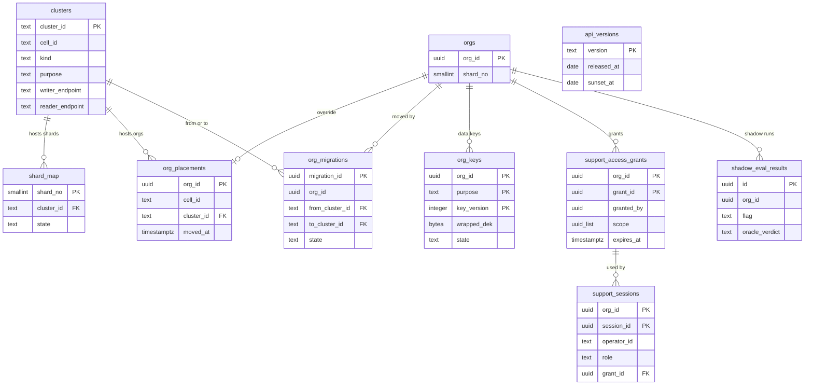

# Data model: 基盤と運用

論理シャードと物理のクラスタ、組織の置き場所の上書き、組織の移動、組織の DEK、運用者のアクセス、API の版、影の実行。振る舞いは [infrastructure.md](../infrastructure.md)・[security.md](../security.md)・[delivery.md](../delivery.md)、決定は [ADR-0052](../../decisions/0052-key-hierarchy-and-per-org-data-keys.md)・[ADR-0053](../../decisions/0053-operator-access-and-data-lifecycle.md)・[ADR-0055](../../decisions/0055-shard-placement-and-stage-criteria.md)・[ADR-0056](../../decisions/0056-org-migration-by-row-filtered-logical-replication.md)・[ADR-0063](../../decisions/0063-org-staged-release-and-shadow-evaluation.md) にある。規約は [data-model.md](../data-model.md) の 3 節。

組織の置き場所の決め方：

```
org_placements[org_id] があれば → (cell_id, cluster_id)
なければ → shard_map[orgs.shard_no] → cluster_id（cell は clusters から）
events・history のクラスタ → 同じ cell の clusters（kind = events・history）
```

## 1. ER 図



- `clusters`・`shard_map`・`org_placements`・`org_migrations`・`org_keys`・`api_versions` は `control`、`shadow_eval_results` は主のクラスタの `ops` のスキーマ（全て RLS の外）。`support_access_grants`・`support_sessions` は RLS。`uuid_list` は `uuid[]` の意味。

## 2. 置き場所と移動

### 2.1 `clusters`

| 列 | 型 | NULL | 既定 | 説明 |
| --- | --- | --- | --- | --- |
| `cluster_id` | `text` | NOT NULL | — | |
| `cell_id` | `text` | NOT NULL | — | |
| `kind` | `text` | NOT NULL | — | `main`・`events`・`history`・`control`（2026-09-28 に `history`・`control` を足した） |
| `purpose` | `text` | NOT NULL | — | `prod`・`nonprod`（Sandbox・試用）・`dedicated` |
| `writer_endpoint`・`reader_endpoint` | `text` | NOT NULL | — | |
| `state` | `text` | NOT NULL | `'active'` | `active`・`draining` |

- キー：PK `(cluster_id)`。UK `(cell_id, kind) WHERE kind IN ('events','history')`（S1・S2 はセルに 1 つ。分けたら外す）。

### 2.2 `shard_map`

| 列 | 型 | NULL | 既定 | 説明 |
| --- | --- | --- | --- | --- |
| `shard_no` | `smallint` | NOT NULL | — | 0〜255 |
| `cluster_id` | `text` | NOT NULL | — | 主のクラスタ |
| `state` | `text` | NOT NULL | `'active'` | `active`・`moving`（論理シャードの単位のクラスタの分割の間） |

- キー：PK `(shard_no)`。FK `cluster_id` → `clusters`。S1 は 256 行が全て 1 つのクラスタ。

### 2.3 `org_placements`

組織ごとの置き場所の上書き（大口の組織、専用のクラスタ・セル、組織の移動の後）。

| 列 | 型 | NULL | 既定 | 説明 |
| --- | --- | --- | --- | --- |
| `org_id` | `uuid` | NOT NULL | — | |
| `cell_id` | `text` | NOT NULL | — | |
| `cluster_id` | `text` | NOT NULL | — | |
| `moved_at` | `timestamptz` | NOT NULL | — | |
| `reason` | `text` | NOT NULL | — | `large_org`・`nonprod`・`migration`・`dedicated` |

- キー：PK `(org_id)`。FK `cluster_id` → `clusters`。組織の `shard_no` は変えない（行をそのまま写す）。

### 2.4 `org_migrations`

| 列 | 型 | NULL | 既定 | 説明 |
| --- | --- | --- | --- | --- |
| `migration_id` | `uuid` | NOT NULL | `uuidv7()` | |
| `org_id` | `uuid` | NOT NULL | — | |
| `from_cluster_id`・`to_cluster_id` | `text` | NOT NULL | — | |
| `state` | `text` | NOT NULL | `'copying'` | `copying`・`catching_up`・`fenced`・`verifying`・`switched`・`aborted` |
| `publication` | `text` | NOT NULL | — | `org_move_<id>` |
| `fence_started_at` | `timestamptz` | NULL | — | 書き込みの止めの始まり |
| `fence_ms` | `integer` | NULL | — | 目標 60 秒以内 |
| `verify_result` | `jsonb` | NULL | — | 表ごとの行の数と ID の範囲ごとのハッシュの比べ |
| `requested_by`・`created_at`・`finished_at` | | | | |

- キー：PK `(migration_id)`。部分一意 `(org_id) WHERE state NOT IN ('switched','aborted')`。監査（`org`）にも写す。公開に入れる表は、`org_id` の列と RLS の方針を持つ表からマイグレーションの定義で機械的に作る。

## 3. 鍵と運用者のアクセス

### 3.1 `org_keys`（`control`）

組織 × 用途 × 版の包んだ DEK。

| 列 | 型 | NULL | 既定 | 説明 |
| --- | --- | --- | --- | --- |
| `org_id` | `uuid` | NOT NULL | — | |
| `purpose` | `text` | NOT NULL | — | `files`・`audit`・`secrets` |
| `key_version` | `integer` | NOT NULL | — | 1 年ごとに新しい版 |
| `wrapped_dek` | `bytea` | NULL | — | KMS で包んだ DEK。組織の消去の最後に消す |
| `kms_key_arn` | `text` | NOT NULL | — | `s3-org`・`app-secrets`・`audit-archive` |
| `state` | `text` | NOT NULL | `'active'` | `active`・`retired`（復号だけ）・`destroyed` |
| `created_at`・`destroyed_at` | `timestamptz` | | | |

- キー：PK `(org_id, purpose, key_version)`。部分一意 `(org_id, purpose) WHERE state = 'active'`。CHECK：`(state = 'destroyed') = (wrapped_dek IS NULL)`。書くのは管理のサービスと Worker。

### 3.2 `support_access_grants`

組織の管理者（`manage_users`）が運用者に許すレコードの読み（1〜7 日、オブジェクトの単位）。

| 列 | 型 | NULL | 既定 | 説明 |
| --- | --- | --- | --- | --- |
| `org_id`・`grant_id` | `uuid` | NOT NULL | — | |
| `granted_by` | `uuid` | NOT NULL | — | |
| `scope` | `uuid[]` | NOT NULL | — | オブジェクトの一覧 |
| `created_at`・`expires_at` | `timestamptz` | NOT NULL | — | 1〜7 日 |
| `revoked_at` | `timestamptz` | NULL | — | |

- キー：PK `(org_id, grant_id)`。索引 `(org_id, expires_at) WHERE revoked_at IS NULL`。RLS。作成と取り消しは監査（`support`）に残す。

### 3.3 `support_sessions`

| 列 | 型 | NULL | 既定 | 説明 |
| --- | --- | --- | --- | --- |
| `org_id`・`session_id` | `uuid` | NOT NULL | — | |
| `operator_id` | `text` | NOT NULL | — | IAM Identity Center の主体 |
| `role` | `text` | NOT NULL | — | `support-read`・`support-data`・`break_glass` |
| `grant_id` | `uuid` | NULL | — | `support-data` の時 |
| `approved_by` | `text[]` | NOT NULL | — | JIT の承認者 |
| `reason` | `text` | NOT NULL | — | |
| `started_at`・`ended_at` | `timestamptz` | | | 4 時間・2 時間・1 時間まで |

- キー：PK `(org_id, session_id)`。索引 `(org_id, started_at DESC)`。RLS。監査にも写し、組織の管理者が見られる。保持：監査と同じ（180 日）。

## 4. リリース

### 4.1 `api_versions`（`control`）

| 列 | 型 | NULL | 既定 | 説明 |
| --- | --- | --- | --- | --- |
| `version` | `text` | NOT NULL | — | `v1` など |
| `released_at` | `date` | NOT NULL | — | |
| `deprecated_at`・`sunset_at` | `date` | NULL | — | |

- キー：PK `(version)`。書くのはデプロイだけ。

### 4.2 `shadow_eval_results`（`ops`）

判定を変える変更の影の実行の結果。値を持たず、ID の集合のハッシュだけ。

| 列 | 型 | NULL | 既定 | 説明 |
| --- | --- | --- | --- | --- |
| `id` | `uuid` | NOT NULL | `uuidv7()` | |
| `org_id` | `uuid` | NOT NULL | — | |
| `flag` | `text` | NOT NULL | — | AppConfig のフラグ |
| `route` | `text` | NOT NULL | — | 経路（問い合わせ、共有の判定など） |
| `old_hash`・`new_hash` | `bytea` | NOT NULL | — | |
| `oracle_verdict` | `text` | NULL | — | `old_correct`・`new_correct`・`both_wrong`（食い違いの時だけ） |
| `at` | `timestamptz` | NOT NULL | — | |

- キー：PK `(id)`。索引 `(flag, at DESC)`、`(org_id, at DESC)`。RLS の外（組織をまたいで集計する）。保持：30 日。
