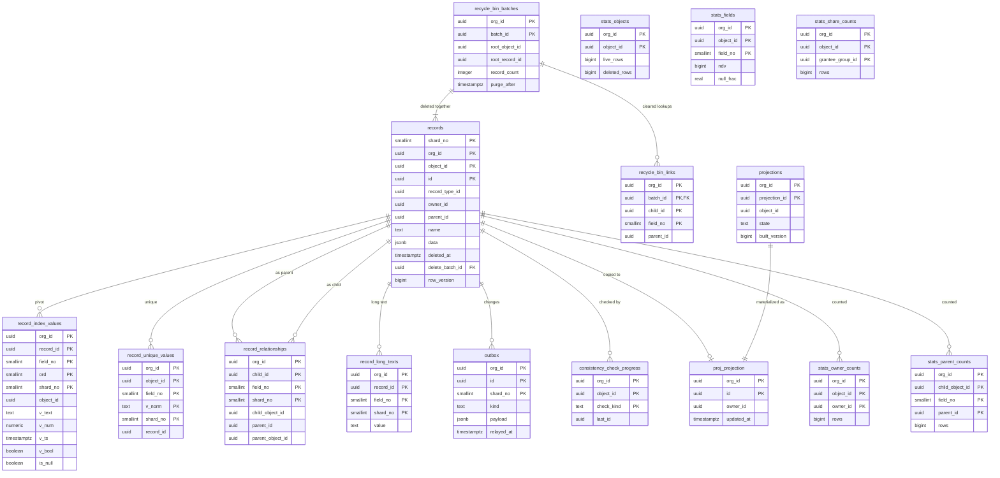

# Data model: レコードと保存

`records`、ピボットの 4 表、ごみ箱、outbox、射影、整合の検査、問い合わせの統計。振る舞いは [data-storage.md](../data-storage.md) と [query-language-and-api.md](../query-language-and-api.md) の 4 節、決定は [ADR-0002](../../decisions/0002-custom-object-storage.md)・[ADR-0010](../../decisions/0010-record-tables-partitioning-and-pivots.md)・[ADR-0011](../../decisions/0011-recycle-bin-and-purge.md)・[ADR-0012](../../decisions/0012-derived-copies-consistency-and-projections.md)・[ADR-0019](../../decisions/0019-selectivity-statistics-and-planning.md) にある。規約は [data-model.md](../data-model.md) の 3 節、組織が定義したオブジェクトの写し方は同じ文書の 5 節。

## 1. ER 図

- `proj_projection` は、射影ごとに作る実テーブル `proj_<projection_id>` の型を表す。
- `records` と写しの表の線は、DB の外部キーではない（[data-model.md](../data-model.md) の 3.2 節）。正しさはデータ層と整合の検査で守る。
- `recycle_bin_batches` → `records` は `records.delete_batch_id` で結ぶ。

## 2. 表

### 2.1 `records`

全組織・全オブジェクト（標準・カスタム）のレコード。定義元：[data-storage.md](../data-storage.md) の 3.1 節。

| 列 | 型 | NULL | 既定 | 説明 |
| --- | --- | --- | --- | --- |
| `shard_no` | `smallint` | NOT NULL | — | 組織の `shard_no` |
| `org_id` | `uuid` | NOT NULL | — | |
| `object_id` | `uuid` | NOT NULL | — | → `md_objects` |
| `id` | `uuid` | NOT NULL | `uuidv7()` | 接頭辞を持たない |
| `record_type_id` | `uuid` | NULL | — | |
| `owner_id` | `uuid` | NOT NULL | — | 利用者の ID か、キューのグループの ID |
| `parent_id` | `uuid` | NULL | — | 1 本目の主従の親、または活動の主の親（`what` があれば `what`、なければ `who`） |
| `name` | `text` | NULL | — | 名前の項目の写し（表示用） |
| `data` | `jsonb` | NOT NULL | `'{}'` | `field_no` の 10 進の文字列 → 値。空の項目はキーを書かない。64KB まで |
| `created_at`・`updated_at` | `timestamptz` | NOT NULL | — | |
| `created_by`・`updated_by` | `uuid` | NOT NULL | — | 利用者 |
| `deleted_at` | `timestamptz` | NULL | — | ごみ箱 |
| `delete_batch_id` | `uuid` | NULL | — | → `recycle_bin_batches` |
| `row_version` | `bigint` | NOT NULL | `1` | 保存ごとに 1 上げる。`If-Match` と索引の外部の版 |

- キー：PK `(org_id, object_id, id, shard_no)`。`PARTITION BY LIST (shard_no)`、`fillfactor = 85`。
- 索引：

| 索引 | 使う問い合わせ |
| --- | --- |
| PK | 1 件の読み、ID の範囲での走査（整合の検査、共有のルールの版、一括の問い合わせ） |
| `(org_id, id)` | ID だけでの読み（`/api/v1/ui/records/{id}`、最近見たもの）。2026-09-28 に足した |
| `(org_id, object_id, owner_id, id) WHERE deleted_at IS NULL` | 所有者での絞り込み、共有の条件（`owner_id IN G_me`）、計画 P2 |
| `(org_id, object_id, updated_at, id) WHERE deleted_at IS NULL` | 更新の時刻での取り出し（連携の同期）、最近の更新の並び |
| `(org_id, object_id, created_at, id) WHERE deleted_at IS NULL` | 作成の時刻での絞り込み、`partial` の Sandbox の標本 |
| `(org_id, parent_id) WHERE parent_id IS NOT NULL` | 親に連動する共有、主従の子の列挙、活動のタイムライン |
| `(org_id, delete_batch_id) WHERE deleted_at IS NOT NULL` | ごみ箱の一覧、戻す、消去 |

- CHECK：`pg_column_size(data) <= 65536`、`(deleted_at IS NULL) = (delete_batch_id IS NULL)`。
- 更新：`SELECT ... FOR UPDATE` で 1 行ずつ取り、`row_version` で楽観の衝突を見る。
- RLS（`org_id` と `shard_no`）。保持：ごみ箱の確定から 24 時間以内に消す。
- S1 の量：5 億行、約 0.7TB（1 行 1.4KB）。1 つの論理シャードは平均約 3GB、最大の組織の入る論理シャードは約 70GB。

### 2.2 `record_index_values`

索引の指定のある項目（`indexed`）、外部 ID、名前、実体化した数式の型付きの写し。空の値も `is_null` の行で書く。定義元：3.2 節。

| 列 | 型 | NULL | 既定 | 説明 |
| --- | --- | --- | --- | --- |
| `shard_no` | `smallint` | NOT NULL | — | |
| `org_id` | `uuid` | NOT NULL | — | |
| `object_id` | `uuid` | NOT NULL | — | |
| `field_no` | `smallint` | NOT NULL | — | 名前の項目も `field_no` で持つ |
| `record_id` | `uuid` | NOT NULL | — | |
| `ord` | `smallint` | NOT NULL | `0` | 複数選択の値ごと（0〜99） |
| `v_text` | `text` | NULL | — | NFKC ＋小文字で正規化した文字列、選択リストの `value_id` の文字列。`COLLATE "C"` |
| `v_num` | `numeric` | NULL | — | 数・通貨・割合 |
| `v_ts` | `timestamptz` | NULL | — | 日付（UTC の 0 時）・日時 |
| `v_bool` | `boolean` | NULL | — | |
| `is_null` | `boolean` | NOT NULL | `false` | 空の印の行 |

- キー：PK `(org_id, record_id, field_no, ord, shard_no)`。
- 索引（型ごとの部分索引）：`(org_id, object_id, field_no, v_text, record_id) WHERE v_text IS NOT NULL` — 等価・範囲・前方一致（参照の候補）。`v_num`・`v_ts`・`v_bool` も同じ形。`(org_id, object_id, field_no, record_id) WHERE is_null` — 空の条件。trigram の GIN（「含む」）は E3 の PoC で決める。
- CHECK：`is_null` なら `v_*` は全て空、でなければちょうど 1 つが空でない。
- 書き方：保存の前後の `derivePivotRows` の差分だけ。ごみ箱の間は行を消す。種類 `copy`。
- S1 の量：15 億行、約 0.3TB。

### 2.3 `record_unique_values`

一意と外部 ID。DB の一意の制約で強制する。

| 列 | 型 | NULL | 既定 | 説明 |
| --- | --- | --- | --- | --- |
| `shard_no`・`org_id`・`object_id` | | NOT NULL | — | |
| `field_no` | `smallint` | NOT NULL | — | |
| `v_norm` | `text` | NOT NULL | — | 正規化した値（`unique_case_sensitive` は小文字にしない） |
| `record_id` | `uuid` | NOT NULL | — | |

- キー：PK（一意）`(org_id, object_id, field_no, v_norm, shard_no)`。索引 `(org_id, record_id)` — レコードの削除・更新での差分。
- 違反は `DUPLICATE_VALUE`。ごみ箱の間は行を消して値を放す。種類 `copy`。S1 の量：1 億行、約 0.05TB。

### 2.4 `record_relationships`

全ての参照・主従・多態の参照。関連リスト、積み上げ集計、削除の連鎖、関係をたどる問い合わせで使う。

| 列 | 型 | NULL | 既定 | 説明 |
| --- | --- | --- | --- | --- |
| `shard_no`・`org_id` | | NOT NULL | — | |
| `child_id` | `uuid` | NOT NULL | — | 項目を持つレコード |
| `field_no` | `smallint` | NOT NULL | — | |
| `child_object_id` | `uuid` | NOT NULL | — | |
| `parent_id` | `uuid` | NOT NULL | — | |
| `parent_object_id` | `uuid` | NOT NULL | — | 多態の参照は参照先のオブジェクト |

- キー：PK `(org_id, child_id, field_no, shard_no)`。索引 `(org_id, parent_id, child_object_id, field_no, child_id)` — 子の列挙（関連リスト、積み上げ集計の集計し直し）。
- ごみ箱の間も残す。種類 `copy`。S1 の量：10 億行、約 0.15TB。

### 2.5 `record_long_texts`

ロングテキスト・リッチテキスト・メールの本文。短い項目の更新で長い値を書き直さないため `data` から分ける。

| 列 | 型 | NULL | 既定 | 説明 |
| --- | --- | --- | --- | --- |
| `shard_no`・`org_id` | | NOT NULL | — | |
| `record_id` | `uuid` | NOT NULL | — | |
| `field_no` | `smallint` | NOT NULL | — | |
| `value` | `text` | NOT NULL | — | 131,072 文字まで（メールの本文は 1MB まで）。TOAST、`lz4` |

- キー：PK `(org_id, record_id, field_no, shard_no)`。種類 `data`（正本）。S1 の量：1 億行、約 0.3TB。

### 2.6 `recycle_bin_batches`・`recycle_bin_links`

削除の束と、`set_null` で空にした参照（戻す時に戻す）。定義元：5 節。

| 表 | 列 |
| --- | --- |
| `recycle_bin_batches` | `org_id`、`batch_id`（`uuid`）、`root_object_id`、`root_record_id`、`deleted_by`、`deleted_at`、`record_count`（`integer`）、`purge_after`（`deleted_at` ＋ 15 日）、`state`（`in_bin`・`restored`・`purging`・`purged`）、`emptied_by`（ごみ箱を空にした人。監査にも残す） |
| `recycle_bin_links` | `org_id`、`batch_id`、`child_id`、`child_object_id`、`field_no`、`parent_id` |

- キー：`recycle_bin_batches` の PK `(org_id, batch_id)`、索引 `(org_id, deleted_by, deleted_at DESC) WHERE state = 'in_bin'`（自分のごみ箱）、`(org_id, deleted_at DESC) WHERE state = 'in_bin'`（管理者のごみ箱）。`recycle_bin_links` の PK `(org_id, batch_id, child_id, field_no)`、FK `(org_id, batch_id)` → `recycle_bin_batches`。
- 消去は束を作る時に `jobs`（class `maintenance`、`available_at = purge_after`）で予約し、24 時間以内に終える。消し終えた束の行は 30 日残してから消す（遅れの計測のため）。
- S1 の量：15 日分で数百万の束。

### 2.7 `outbox`

保存・メタデータの変更と同じトランザクションで書き、確定の後に Relay（論理シャードごとの唯一の書き手）が配る。定義元：3.5 節。

| 列 | 型 | NULL | 既定 | 説明 |
| --- | --- | --- | --- | --- |
| `shard_no` | `smallint` | NOT NULL | — | |
| `org_id` | `uuid` | NOT NULL | — | |
| `id` | `uuid` | NOT NULL | `uuidv7()` | 変更のイベント・組織のイベントの `event_id`、履歴の `source_id` になる |
| `kind` | `text` | NOT NULL | — | 下の表 |
| `tx_id` | `uuid` | NOT NULL | — | 最上位のトランザクション（変更のイベントの `tx_key`） |
| `tx_seq` | `integer` | NOT NULL | — | トランザクションの中の順 |
| `payload` | `jsonb` | NOT NULL | — | 種類ごとの形（[stores.md](stores.md) の 4 節） |
| `priority` | `text` | NOT NULL | `'normal'` | `normal`・`bulk`（一括の分は低い優先の経路へ） |
| `created_at` | `timestamptz` | NOT NULL | `now()` | |
| `relayed_at` | `timestamptz` | NULL | — | Relay が送った印。1 時間後に消す |

| `kind` | 書く所 | 受け手 |
| --- | --- | --- |
| `change_event` | 保存の手順 11、隙間のイベント | Relay → `events.change_events` |
| `org_event` | 組織が定義するイベントの `after_commit` の発行 | Relay → `events.org_events` |
| `field_history` | 保存の手順 9（最上位で 1 回） | Relay → `history.field_history` |
| `search_index` | 保存の手順 11 | Relay → SQS `search-index` → indexer |
| `delivery` | フローの `call_webhook`、トリガーの外向きの呼び出し | Worker（class `delivery`）→ prod-egress |
| `email` | `send_email`、1 通ずつのメール、通知 | Worker → SES |
| `async` | 非同期の経路、after_commit のトリガー、メタデータの後の仕事、`metadata.version_changed` | Worker・Relay |
| `login_event` | ログインとトークンの発行 | Worker → `login_events` |

- キー：PK `(org_id, id, shard_no)`。索引（分割ごと）：`(id) WHERE relayed_at IS NULL` — Relay の読み（`id` の順）。`(relayed_at) WHERE relayed_at IS NOT NULL` — 掃除。
- RLS。Relay は `relay` のロールで、`shard_no` だけの方針で読む（[data-model.md](../data-model.md) の 3.2 節）。
- 最古の未送の行の経過時間を `event-relay-lag` で計測する。S1 の量：平常は数千行。

### 2.8 `projections`・`proj_<projection_id>`（S2 以降）

大口の組織の、よく使うオブジェクトの読みの写し。定義元：7 節。

| 表 | 列 |
| --- | --- |
| `projections` | `org_id`、`projection_id`、`object_id`、`field_nos`（`smallint[]`、100 まで）、`state`（`building`・`active`・`stale`・`dropped`）、`built_version`（`bigint`）、`created_at` |
| `proj_<projection_id>` | `org_id`、`id`、`owner_id`、`record_type_id`、`updated_at`、`f<field_no>`（選んだ項目を型付きの列で。最大 100 列） |

- キー：`projections` の PK `(org_id, projection_id)`、UK `(org_id, object_id) WHERE state <> 'dropped'`。`proj_*` の PK `(org_id, id)`、索引は Ops が選んだ項目に張る。
- `proj_*` は `records` と同じトランザクションで書く（種類 `copy`）。DDL は `maint` のロールだけが許可リストの形で行う。1 つの組織で 3、1 つのクラスタで 500 まで。RLS。

### 2.9 `consistency_check_progress`

整合の検査の進み（[data-storage.md](../data-storage.md) の 6 節）。

| 列 | 型 | NULL | 既定 | 説明 |
| --- | --- | --- | --- | --- |
| `org_id`・`object_id` | `uuid` | NOT NULL | — | |
| `check_kind` | `text` | NOT NULL | — | `pivot`・`relationship`・`owner`・`orphan`・`projection`・`match_keys`・`rollup` |
| `last_id` | `uuid` | NULL | — | 済んだ ID の範囲の最後 |
| `cycle_started_at` | `timestamptz` | NOT NULL | — | 一周の始まり（7 日で一周） |
| `repaired` | `bigint` | NOT NULL | `0` | この一周で直した件数 |

- キー：PK `(org_id, object_id, check_kind)`。仕事は `jobs`（class `maintenance`）。検索の索引の検査は `search_consistency_progress`（[search.md](search.md)）。

### 2.10 問い合わせの統計

選択性の見積もりに使う組織ごとの統計（[query-language-and-api.md](../query-language-and-api.md) の 4.2 節）。種類 `data`。Runtime は Valkey（`st:{o:<org_id>}:<object_id>`）と L1 にも持つ。

| 表 | 列 | キー | 更新 |
| --- | --- | --- | --- |
| `stats_objects` | `org_id`、`object_id`、`live_rows`・`deleted_rows`（`bigint`）、`updated_at` | PK `(org_id, object_id)` | outbox から 1 分ごとに足し引き |
| `stats_fields` | `org_id`、`object_id`、`field_no`、`ndv`（`bigint`）、`null_frac`（`real`）、`mcv`（`jsonb`、上位 100 と頻度）、`histogram`（`jsonb`、100 の区切り）、`sample_rows`（`integer`）、`computed_at` | PK `(org_id, object_id, field_no)` | 毎晩。`live_rows` が 20% 変わったらその日のうちに |
| `stats_owner_counts` | `org_id`、`object_id`、`owner_id`、`rows`（`bigint`） | PK `(org_id, object_id, owner_id)`。索引 `(org_id, object_id, rows DESC)`（所有者のスキューの検知） | outbox から 1 分ごと |
| `stats_share_counts` | `org_id`、`object_id`、`grantee_group_id`、`rows` | PK `(org_id, object_id, grantee_group_id)` | 毎晩 |
| `stats_parent_counts` | `org_id`、`child_object_id`、`field_no`（主従の項目）、`parent_id`、`rows` | PK `(org_id, child_object_id, field_no, parent_id)`。索引 `(org_id, child_object_id, field_no, rows DESC)`（親のスキューの検知） | outbox から 1 分ごと。積み上げ集計が同期で集計し直すか（子 5 万まで）を決める。2026-09-28 に定めた表 |

- `mcv`・`histogram` は組織の全体の値を含むので、`explain`（`customize_application` か `view_all_data`）の外に出さない。
- S1 の量：合わせて数千万行（`stats_parent_counts` は子を持つ親の数だけ）。
