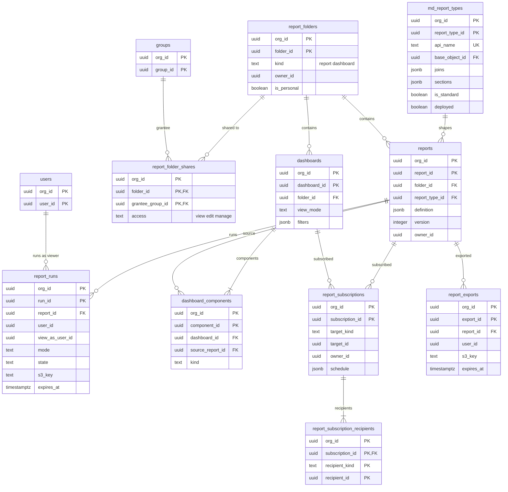

# Data model: レポートとダッシュボード

レポートの型、フォルダと共有、レポート、実行、ダッシュボード、定期の配信、エクスポート。振る舞いは [reports-and-dashboards.md](../reports-and-dashboards.md)、決定は [ADR-0029](../../decisions/0029-report-execution-on-reader-per-viewer.md)・[ADR-0030](../../decisions/0030-dashboards-viewer-intersection-and-subscriptions.md) にある。規約は [data-model.md](../data-model.md) の 3 節。

レポートとダッシュボードは利用者が作るデータで、版を上げない（デプロイの対象にはする）。レポートの型はメタデータ（`report_types` の部品）。集計は常に見る人の権限で行い、事前の集計の表を持たない（[reports-and-dashboards.md](../reports-and-dashboards.md) の 5.6 節）。

## 1. ER 図

- フォルダの権限の判定は、共有の閉包（`group_members_closure`）で行う。

## 2. 表

### 2.1 `md_report_types`

| 列 | 型 | NULL | 既定 | 説明 |
| --- | --- | --- | --- | --- |
| `org_id`・`report_type_id` | `uuid` | NOT NULL | — | |
| `api_name`・`label`・`category` | `text` | NOT NULL | — | |
| `base_object_id` | `uuid` | NOT NULL | — | |
| `joins` | `jsonb` | NOT NULL | `'[]'` | 子の関係（3 まで、合わせて 4 オブジェクト）、`outer` |
| `sections` | `jsonb` | NOT NULL | — | 列の候補（項目、親への参照の項目） |
| `is_standard` | `boolean` | NOT NULL | `false` | 標準のレポートの型（種）、`<object>_field_history` |
| `deployed` | `boolean` | NOT NULL | `false` | 作成中は作った人だけが使える |

- キー：PK `(org_id, report_type_id)`。UK `(org_id, api_name)`。種類 `meta`。外部結合の後に内部結合を置かないことはデータ層で検査する。

### 2.2 `report_folders`・`report_folder_shares`

| 表 | 列 | キー |
| --- | --- | --- |
| `report_folders` | `org_id`、`folder_id`、`kind`（`report`・`dashboard`）、`label`、`owner_id`、`is_personal`（利用者の「自分のフォルダ」） | PK `(org_id, folder_id)`。部分一意 `(org_id, owner_id, kind) WHERE is_personal` |
| `report_folder_shares` | `org_id`、`folder_id`、`grantee_group_id`（利用者・ロール・ロールと部下・公開グループ）、`access`（`view`・`edit`・`manage`） | PK `(org_id, folder_id, grantee_group_id)`。索引 `(org_id, grantee_group_id)` |

- フォルダの共有は定義を見せるだけで、データを見せない。変更は `manage_report_folders` かフォルダの `manage`。

### 2.3 `reports`

| 列 | 型 | NULL | 既定 | 説明 |
| --- | --- | --- | --- | --- |
| `org_id`・`report_id` | `uuid` | NOT NULL | — | |
| `folder_id` | `uuid` | NOT NULL | — | |
| `report_type_id` | `uuid` | NOT NULL | — | |
| `api_name`・`label` | `text` | NOT NULL | — | |
| `definition` | `jsonb` | NOT NULL | — | `format`、`scope`、`date_filter`、`filters`、`logic`、`cross_filters`、`groupings`、`aggregates`、`columns`、`row_limit`、`chart`（項目は `field_id`） |
| `version` | `integer` | NOT NULL | `1` | 保存ごとに上げる（楽観の鍵、結果のキャッシュの鍵） |
| `owner_id` | `uuid` | NOT NULL | — | |
| `updated_at` | `timestamptz` | NOT NULL | — | |

- キー：PK `(org_id, report_id)`。UK `(org_id, folder_id, api_name)`。索引 `(org_id, report_type_id)` — レポートの型の変更の影響。

### 2.4 `report_runs`

レポートの実行（同期の記録と、非同期の結果の置き場所）。

| 列 | 型 | NULL | 既定 | 説明 |
| --- | --- | --- | --- | --- |
| `org_id`・`run_id` | `uuid` | NOT NULL | — | |
| `report_id` | `uuid` | NOT NULL | — | |
| `report_version` | `integer` | NOT NULL | — | |
| `user_id` | `uuid` | NOT NULL | — | 実行した人（結果を取り出せる唯一の人） |
| `view_as_user_id` | `uuid` | NULL | — | ダッシュボードの部下の視点（共通部分） |
| `mode` | `text` | NOT NULL | — | `sync`・`async` |
| `state` | `text` | NOT NULL | — | `queued`・`running`・`succeeded`・`failed`・`truncated` |
| `as_of` | `timestamptz` | NULL | — | reader が反映した時刻 |
| `s3_key` | `text` | NULL | — | 非同期の結果（組織の `files` の DEK） |
| `rows` | `integer` | NULL | — | |
| `db_ms` | `integer` | NULL | — | |
| `created_at`・`expires_at` | `timestamptz` | NOT NULL | — | 結果は 24 時間 |

- キー：PK `(org_id, run_id)`。索引 `(org_id, user_id, created_at DESC)`、`(org_id, expires_at)`（掃除）。保持：結果は 24 時間、行は 7 日。Sandbox へは写さない。

### 2.5 `dashboards`・`dashboard_components`

| 表 | 列 | キー |
| --- | --- | --- |
| `dashboards` | `org_id`、`dashboard_id`、`folder_id`、`api_name`、`label`、`view_mode`（`viewer`・`team_member`）、`filters`（`jsonb`、5 まで・各 50 の値）、`layout`（`jsonb`）、`owner_id`、`version` | PK `(org_id, dashboard_id)`。UK `(org_id, folder_id, api_name)` |
| `dashboard_components` | `org_id`、`component_id`、`dashboard_id`、`source_report_id`、`kind`（`bar`・`column`・`line`・`donut`・`funnel`・`metric`・`gauge`・`table`）、`position`（`smallint`）、`settings`（`jsonb`） | PK `(org_id, component_id)`。索引 `(org_id, dashboard_id, position)`、`(org_id, source_report_id)` |

- 部品は 20 まで。「指定した実行ユーザー」の列は持たない（ADR-0030）。

### 2.6 `report_subscriptions`・`report_subscription_recipients`

定期の配信。受け取る人ごとに、その人の権限で実行する。

| 表 | 列 | キー |
| --- | --- | --- |
| `report_subscriptions` | `org_id`、`subscription_id`、`target_kind`（`report`・`dashboard`）、`target_id`、`owner_id`、`schedule`（`jsonb`：頻度・時刻、30 分の中に散らす位置）、`condition`（`jsonb`、任意）、`active`、`next_run_at` | PK `(org_id, subscription_id)`。索引 `(org_id, owner_id)`（1 人 5 まで）、`(org_id, target_kind, target_id)` |
| `report_subscription_recipients` | `org_id`、`subscription_id`、`recipient_kind`（`user`・`group`・`role`）、`recipient_id` | PK `(org_id, subscription_id, recipient_kind, recipient_id)` |

- 次の実行は `jobs`（class `report_async`、`available_at = next_run_at`）で予約する。組織の外のアドレスには送らない。受け取る人は 50 まで。

### 2.7 `report_exports`

詳細の行のエクスポート（`export_reports`）。監査（`data_bulk`）にも写す。

| 列 | 型 | NULL | 既定 | 説明 |
| --- | --- | --- | --- | --- |
| `org_id`・`export_id` | `uuid` | NOT NULL | — | |
| `report_id` | `uuid` | NOT NULL | — | |
| `user_id` | `uuid` | NOT NULL | — | 本人だけが取り出せる |
| `format` | `text` | NOT NULL | `'csv'` | |
| `state` | `text` | NOT NULL | — | `queued`・`running`・`succeeded`・`failed` |
| `rows` | `integer` | NULL | — | 100 万行まで |
| `s3_key` | `text` | NULL | — | |
| `created_at`・`expires_at` | `timestamptz` | NOT NULL | — | 24 時間 |

- キー：PK `(org_id, export_id)`。索引 `(org_id, user_id, created_at DESC)`。保持：結果は 24 時間、行は 7 日。
