# Data model: 営業のオブジェクト

標準オブジェクト（取引先、取引先責任者、リード、商談、活動、メール）の項目、商談の履歴、活動の関係者、リードの変換、重複の規則と照合の鍵、メールの記録。振る舞いは [sales-objects.md](../sales-objects.md)、決定は [ADR-0021](../../decisions/0021-lead-conversion-and-activity-parents.md)・[ADR-0022](../../decisions/0022-duplicate-rules-and-japanese-matching.md) にある。規約は [data-model.md](../data-model.md) の 3 節。

標準オブジェクトのレコードは、カスタムオブジェクトと同じく `records` の 1 行で、項目は `md_fields` の行（組織の作成時に種から入れる）。この文書の表は、`records` の外に持つ補助の表である。

## 1. ER 図

```mermaid
erDiagram
    records ||--o{ opportunity_history : "opportunity"
    records ||--o{ activity_relations : "activity"
    records ||--o{ activity_relations : "related"
    records ||--o| lead_conversions : "lead"
    lead_convert_mappings }o--|| md_fields : "lead field"
    orgs ||--|| lead_convert_settings : "configures"
    matching_rules ||--|{ matching_rule_items : "items"
    duplicate_rules ||--|{ duplicate_rule_matchers : "uses"
    matching_rules ||--o{ duplicate_rule_matchers : "used by"
    matching_rules ||--o{ record_match_keys : "keys"
    records ||--o{ record_match_keys : "keyed"
    duplicate_rules ||--o{ duplicate_record_sets : "found"
    duplicate_record_sets ||--|{ duplicate_record_items : "members"
    records ||--o{ duplicate_record_items : "member"
    users ||--o{ email_log_addresses : "bcc address"
    records ||--o{ email_attachments : "email message"

    records {
        uuid org_id PK
        uuid id PK
        uuid object_id
    }
    opportunity_history {
        uuid org_id PK
        uuid id PK
        timestamptz changed_at PK
        uuid opportunity_id
        uuid stage
        numeric amount
        date close_date
    }
    activity_relations {
        uuid org_id PK
        uuid activity_id PK
        uuid related_id PK
        smallint shard_no PK
        text kind "who attendee"
        text response
    }
    lead_convert_mappings {
        uuid org_id PK
        uuid lead_field_id PK, FK
        text target_object PK
        uuid target_field_id FK
    }
    lead_convert_settings {
        uuid org_id PK
        text opportunity_creation
    }
    lead_conversions {
        uuid org_id PK
        uuid lead_id PK
        uuid account_id
        uuid contact_id
        uuid opportunity_id
    }
    matching_rules {
        uuid org_id PK
        uuid rule_id PK
        uuid object_id
        text logic
        text state
    }
    matching_rule_items {
        uuid org_id PK
        uuid rule_id PK, FK
        smallint item_no PK
        uuid field_id FK
        text method
    }
    duplicate_rules {
        uuid org_id PK
        uuid id PK
        uuid object_id
        smallint sort_order
        text on_create
        text sharing
    }
    duplicate_rule_matchers {
        uuid org_id PK
        uuid duplicate_rule_id PK, FK
        uuid matching_rule_id PK, FK
    }
    record_match_keys {
        uuid org_id PK
        uuid rule_id PK, FK
        smallint item_no PK
        text block_key PK
        uuid record_id PK
        smallint shard_no PK
    }
    duplicate_record_sets {
        uuid org_id PK
        uuid set_id PK
        uuid duplicate_rule_id FK
        boolean overflow
    }
    duplicate_record_items {
        uuid org_id PK
        uuid set_id PK, FK
        uuid record_id PK
    }
    name_variant_chars {
        uuid org_id PK "nil uuid for system rows"
        text from_char PK
        text to_char
    }
    email_log_addresses {
        uuid org_id PK
        bytea token_hash PK
        uuid user_id FK
        timestamptz expires_at
    }
    email_attachments {
        uuid org_id PK
        uuid email_message_id PK
        smallint attachment_no PK
        text s3_key
    }
    users {
        uuid org_id PK
        uuid user_id PK
    }
    md_fields {
        uuid org_id PK
        uuid field_id PK
    }
    orgs {
        uuid org_id PK
    }
```

- `records` との線は DB の外部キーではない。`opportunity_history.opportunity_id`・`lead_conversions.*_id`・`email_attachments.email_message_id` は `records.id` を指す。

## 2. 標準オブジェクトの項目（`records` の中）

項目の全ての一覧は [sales-objects.md](../sales-objects.md) の 3 節。ここは型と写し先の要点。住所は 6 つの項目（`postal_code`・`prefecture`・`city`・`street`・`building`・`country`）の組。

| オブジェクト | 名前（`records.name`） | 主な項目 | `records.parent_id` | OWD の既定 |
| --- | --- | --- | --- | --- |
| `account` | `name` | `name_kana`、`corporate_number`（一意・外部 ID にできる）、`parent`（`lookup`）、`billing_*`・`shipping_*` | 空 | `private` |
| `contact` | `last_name`＋`first_name` | カナ、`account`（`lookup`）、`email`・`phone`（PII、照合）、`reports_to`、`mailing_*`、`email_opt_out`・`do_not_call` | 空 | `private`（暗黙の共有） |
| `lead` | `last_name`＋`first_name` | `company`・`company_kana`、`status`（選択リスト、`attrs.converted`）、`is_converted`・`converted_*`（システム） | 空 | `private`。キューが所有できる |
| `opportunity` | `name` | `account`、`amount`（`currency`）、`close_date`、`stage`（`attrs`）、`probability`、`forecast_category`・`is_closed`・`is_won`（フェーズから） | 空 | `private`（暗黙の共有） |
| `opportunity_contact_role` | — | `opportunity`（主従）、`contact`（`lookup`）、`role`、`is_primary`（商談ごとに 1 件。一意の写しで守る） | 商談 | `controlled_by_parent` |
| `task` | `subject` | `due_date`、`status`（`attrs.is_closed`）、`priority`、`who`・`what`（`polymorphic_lookup`） | 主の親（`what`、なければ `who`） | `controlled_by_parent` |
| `event` | `subject` | `start_at`・`end_at`、`is_all_day`、`who`・`what` | 同上 | `controlled_by_parent` |
| `email_message` | `subject` | `direction`（`inbound`・`outbound`）、`message_id`（一意・外部 ID）、`from_address`・`to_addresses`・`cc_addresses`（PII）、`sent_at`、本文（`record_long_texts`）、`who`・`what` | 同上 | `controlled_by_parent` |

## 3. 表

### 3.1 `opportunity_history`

商談の `stage`・`amount`・`probability`・`close_date`・`forecast_category` が変わるたびに 1 行。保存の手順 9 で、主のクラスタに同じトランザクションで書く（レポートで商談と結ぶため、`history` のクラスタに置かない）。

| 列 | 型 | NULL | 既定 | 説明 |
| --- | --- | --- | --- | --- |
| `org_id` | `uuid` | NOT NULL | — | |
| `id` | `uuid` | NOT NULL | `uuidv7()` | |
| `opportunity_id` | `uuid` | NOT NULL | — | |
| `changed_at` | `timestamptz` | NOT NULL | — | 保存の時刻 |
| `stage` | `uuid` | NOT NULL | — | フェーズの `value_id` |
| `amount` | `numeric` | NULL | — | |
| `probability` | `numeric(5,2)` | NULL | — | |
| `close_date` | `date` | NULL | — | |
| `forecast_category` | `text` | NOT NULL | — | `pipeline`・`best_case`・`commit`・`closed`・`omitted` |
| `changed_by` | `uuid` | NOT NULL | — | |
| `tx_id` | `uuid` | NOT NULL | — | |

- キー：PK `(org_id, id, changed_at)`。`PARTITION BY RANGE (changed_at)`、月ごと（`shard_no` では分けない）。索引 `(org_id, opportunity_id, changed_at)` — 商談ごとの推移、レポートの結合。
- RLS。読みは商談の共有と FLS に従う。保持：18 か月（既定案）。S1 の量：23 億行、約 0.28TB。

### 3.2 `activity_relations`

活動・メールの追加の関係者（取引先責任者 50 件まで、またはリード 1 件）と、行動の出席者の返事。

| 列 | 型 | NULL | 既定 | 説明 |
| --- | --- | --- | --- | --- |
| `shard_no`・`org_id` | | NOT NULL | — | |
| `activity_id` | `uuid` | NOT NULL | — | `task`・`event`・`email_message` のレコード |
| `related_object_id` | `uuid` | NOT NULL | — | 取引先責任者・リード・利用者 |
| `related_id` | `uuid` | NOT NULL | — | |
| `kind` | `text` | NOT NULL | — | `who`・`attendee` |
| `response` | `text` | NULL | — | `accepted`・`declined`・`tentative`・`none`（行動の出席者だけ） |

- キー：PK `(org_id, activity_id, related_id, shard_no)`。索引 `(org_id, related_id, activity_id)` — 関係者の活動のタイムライン。
- ごみ箱の間も残す。RLS。S1 の量：約 1 億行。

### 3.3 `lead_convert_mappings`・`lead_convert_settings`・`lead_conversions`

| 表 | 列 | キー | 種類 |
| --- | --- | --- | --- |
| `lead_convert_mappings` | `org_id`、`lead_field_id`、`target_object`（`account`・`contact`・`opportunity`）、`target_field_id` | PK `(org_id, lead_field_id, target_object)`、UK `(org_id, target_field_id)`（1 つの先に 2 つの元を向けない） | `meta` |
| `lead_convert_settings` | `org_id`、`opportunity_creation`（`optional`・`required`・`hidden`） | PK `(org_id)` | `meta` |
| `lead_conversions` | `org_id`、`lead_id`、`account_id`、`contact_id`、`opportunity_id`（空可）、`converted_status`（`value_id`）、`converted_by`、`converted_at`、`skipped_fields`（`text[]`、項目の名前だけ） | PK `(org_id, lead_id)`（1 つのリードは 1 回だけ変換）。索引 `(org_id, account_id)` | `data` |

- 型が合うこと（同じ型か、変換できる型）はメタデータの保存の時にデータ層で検査する。

### 3.4 `matching_rules`・`matching_rule_items`

| 表 | 列 | キー |
| --- | --- | --- |
| `matching_rules` | `org_id`、`rule_id`、`api_name`、`object_id`、`logic`（`text`、「(1 AND 2) OR 3」）、`state`（`building`・`active`・`inactive`） | PK `(org_id, rule_id)`、UK `(org_id, object_id, api_name)` |
| `matching_rule_items` | `org_id`、`rule_id`、`item_no`（1〜10）、`field_id`、`method`（`exact`・`person_name`・`company_name`・`phone`・`email`・`postal_code`・`address`）、`blank`（`null_not_allowed`・`match_blanks`）、`threshold`（`numeric(4,3)`、既定 0.92・0.90） | PK `(org_id, rule_id, item_no)` |

- 種類 `meta`。有効にする時に Worker が照合の鍵を作る（`building`）。

### 3.5 `duplicate_rules`・`duplicate_rule_matchers`

| 表 | 列 | キー |
| --- | --- | --- |
| `duplicate_rules` | `org_id`、`id`、`api_name`、`object_id`、`sort_order`（`smallint`）、`active`、`on_create`・`on_update`（`allow_alert`・`allow_report`・`allow_alert_report`・`block`・`off`）、`sharing`（`enforce`・`bypass`）、`condition`（数式、分類 A） | PK `(org_id, id)`、UK `(org_id, object_id, api_name)`、索引 `(org_id, object_id, sort_order) WHERE active` |
| `duplicate_rule_matchers` | `org_id`、`duplicate_rule_id`、`matching_rule_id`、`sort`（1〜3） | PK `(org_id, duplicate_rule_id, matching_rule_id)` |

- `sharing = bypass` は `customize_application` の明示の選択で、監査（`data_override`）に残す。種類 `meta`。

### 3.6 `record_match_keys`

照合の候補を引く鍵。`deriveMatchKeys(ruleSegment, record)` で決め、保存の手順 6 で同じトランザクションで差分を書く。定義元：6.3 節。

| 列 | 型 | NULL | 既定 | 説明 |
| --- | --- | --- | --- | --- |
| `shard_no`・`org_id` | | NOT NULL | — | |
| `object_id` | `uuid` | NOT NULL | — | |
| `rule_id` | `uuid` | NOT NULL | — | 照合の規則 |
| `item_no` | `smallint` | NOT NULL | — | |
| `block_key` | `text` | NOT NULL | — | 正規化した鍵（`normalizeForMatch`） |
| `record_id` | `uuid` | NOT NULL | — | |

- キー：PK `(org_id, rule_id, item_no, block_key, record_id, shard_no)`（候補の引きは主キーの範囲の読み）。索引 `(org_id, record_id)` — 差分と消去。
- ごみ箱の間は消す。整合の検査の対象。種類 `copy`。S1 の量：6 億行、約 0.08TB。

### 3.7 `duplicate_record_sets`・`duplicate_record_items`

`allow_report`・`allow_alert_report` で記録する重複。見る人が見られるレコードの行だけを返す。

| 表 | 列 | キー |
| --- | --- | --- |
| `duplicate_record_sets` | `org_id`、`set_id`、`duplicate_rule_id`、`object_id`、`detected_at`、`overflow`（`boolean`。候補 200 を超えた） | PK `(org_id, set_id)`、索引 `(org_id, duplicate_rule_id, detected_at DESC)` |
| `duplicate_record_items` | `org_id`、`set_id`、`record_id`、`object_id` | PK `(org_id, set_id, record_id)`、索引 `(org_id, record_id)` |

- レコードの消去で行を消す。保持：レコードに従う。

### 3.8 `name_variant_chars`

異体字の表（`髙` → `高` など）。システムの行と、組織が足す行。

| 列 | 型 | NULL | 既定 | 説明 |
| --- | --- | --- | --- | --- |
| `org_id` | `uuid` | NOT NULL | — | システムの行は nil UUID（`00000000-0000-0000-0000-000000000000`） |
| `from_char` | `text` | NOT NULL | — | 1 文字 |
| `to_char` | `text` | NOT NULL | — | |

- キー：PK `(org_id, from_char)`。RLS の読みの方針にシステムの行を足す（[data-model.md](../data-model.md) の 3.2 節）。システムの行はマイグレーションだけが書く。種類 `meta`。

### 3.9 `email_log_addresses`

メールの記録の BCC の宛先（`<token>@log.<org>.<brand>.<domain>`）。token は利用者ごとの 128 ビットの乱数で、ハッシュだけを持つ。

| 列 | 型 | NULL | 既定 | 説明 |
| --- | --- | --- | --- | --- |
| `org_id`・`user_id` | `uuid` | NOT NULL | — | |
| `token_hash` | `bytea` | NOT NULL | — | SHA-256 |
| `created_at` | `timestamptz` | NOT NULL | `now()` | |
| `expires_at` | `timestamptz` | NULL | — | 作り直した古い token は 7 日で無効 |

- キー：PK `(org_id, token_hash)`。索引 `(org_id, user_id)`。

### 3.10 `email_attachments`

メールの添付（1 通 25MB まで）。本体は S3（[stores.md](stores.md) の 2 節）。

| 列 | 型 | NULL | 既定 | 説明 |
| --- | --- | --- | --- | --- |
| `org_id` | `uuid` | NOT NULL | — | |
| `email_message_id` | `uuid` | NOT NULL | — | |
| `attachment_no` | `smallint` | NOT NULL | — | |
| `file_name` | `text` | NOT NULL | — | PII になりうる |
| `s3_key` | `text` | NOT NULL | — | 組織の `files` の DEK で暗号化 |
| `size` | `bigint` | NOT NULL | — | |
| `content_type` | `text` | NOT NULL | — | |

- キー：PK `(org_id, email_message_id, attachment_no)`。メールのレコードの消去で S3 と一緒に消す。Sandbox へは写さない。
