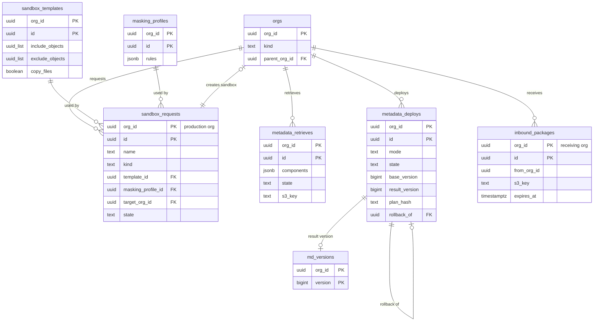

# Data model: Sandbox とデプロイ

Sandbox の申し込み、テンプレート、マスキングの設定、メタデータの書き出しとデプロイ、同じ系統の組織の間で送ったパッケージ。Sandbox の組織そのものは `orgs`（`kind = sandbox`、[orgs-users-and-auth.md](orgs-users-and-auth.md)）。振る舞いは [sandboxes-and-deploy.md](../sandboxes-and-deploy.md)、決定は [ADR-0038](../../decisions/0038-sandbox-types-and-masked-copy.md)・[ADR-0039](../../decisions/0039-metadata-package-format.md)・[ADR-0040](../../decisions/0040-deploy-validation-and-rollback.md) にある。規約は [data-model.md](../data-model.md) の 3 節。パッケージの形式は [stores.md](stores.md) の 6 節。

## 1. ER 図

- `uuid_list` は `uuid[]` の意味（図の型は 1 語で書く）。

## 2. 表

### 2.1 `sandbox_requests`

本番の組織の側に持つ Sandbox の作成・再作成の申し込み（`manage_sandboxes`）。複製は `cross-org-worker`（`admin_cross_org`）が行う。

| 列 | 型 | NULL | 既定 | 説明 |
| --- | --- | --- | --- | --- |
| `org_id` | `uuid` | NOT NULL | — | 本番の組織 |
| `id` | `uuid` | NOT NULL | `uuidv7()` | |
| `name` | `text` | NOT NULL | — | Sandbox の名前（ホスト名の `<sandbox>`） |
| `kind` | `text` | NOT NULL | — | `developer`・`developer_pro`・`partial`・`full` |
| `template_id` | `uuid` | NULL | — | `partial`・`full` |
| `masking_profile_id` | `uuid` | NOT NULL | — | 既定のマスキング |
| `target_org_id` | `uuid` | NULL | — | 作った Sandbox の組織 |
| `replaces_org_id` | `uuid` | NULL | — | 再作成で消す古い Sandbox |
| `state` | `text` | NOT NULL | `'queued'` | `queued`・`copying`・`ready`・`failed`・`cancelled` |
| `progress` | `jsonb` | NOT NULL | `'{}'` | オブジェクトごとの済んだ範囲、落とした参照の数、マスキングの警告 |
| `requested_by`・`requested_at`・`finished_at` | | | | |

- キー：PK `(org_id, id)`。部分一意 `(org_id, name) WHERE state IN ('queued','copying')`。索引 `(org_id, requested_at DESC)`。
- 数は組織のエディションの Sandbox の数まで。仕事は `jobs`（class `sandbox_copy`、組織で 1）。保持：1 年。

### 2.2 `sandbox_templates`・`masking_profiles`

| 表 | 列 | キー |
| --- | --- | --- |
| `sandbox_templates` | `org_id`、`id`、`name`、`include_objects`（`uuid[]`）、`exclude_objects`（`uuid[]`）、`copy_files`（`boolean`、既定 `false`） | PK `(org_id, id)`。UK `(org_id, name)` |
| `masking_profiles` | `org_id`、`id`、`name`、`rules`（`jsonb`：型・分類ごとの偽の値の作り方） | PK `(org_id, id)`。UK `(org_id, name)` |

- `personal` のマスキングを外す設定は持たない（法務の L3 の結論まで）。`rules` は既定より強める方向だけを受け付ける。

### 2.3 `metadata_retrieves`

メタデータの書き出し（`customize_application` か `deploy_metadata`）。

| 列 | 型 | NULL | 既定 | 説明 |
| --- | --- | --- | --- | --- |
| `org_id`・`id` | `uuid` | NOT NULL | — | |
| `components` | `jsonb` | NOT NULL | — | 種類と名前の一覧、`with_dependencies` |
| `metadata_version` | `bigint` | NULL | — | 書き出したバージョン |
| `state` | `text` | NOT NULL | `'queued'` | `queued`・`running`・`succeeded`・`failed` |
| `s3_key` | `text` | NULL | — | `package.zip` |
| `requested_by`・`created_at`・`expires_at` | | NOT NULL | — | 7 日 |

- キー：PK `(org_id, id)`。保持：7 日。

### 2.4 `metadata_deploys`

検証・適用・すばやいデプロイ・戻し。計画は S3 に置く。

| 列 | 型 | NULL | 既定 | 説明 |
| --- | --- | --- | --- | --- |
| `org_id`・`id` | `uuid` | NOT NULL | — | |
| `mode` | `text` | NOT NULL | — | `validate`・`deploy`・`rollback` |
| `state` | `text` | NOT NULL | `'queued'` | `queued`・`validating`・`validated`・`applying`・`succeeded`・`failed`・`cancelled` |
| `options` | `jsonb` | NOT NULL | `'{}'` | `allow_data_loss`・`allow_warnings` |
| `base_version` | `bigint` | NULL | — | 検証した時のバージョン（V0） |
| `result_version` | `bigint` | NULL | — | 適用で作ったバージョン |
| `plan_hash` | `text` | NULL | — | 正規化した計画の SHA-256 |
| `package_s3_key`・`plan_s3_key` | `text` | NULL | — | |
| `validated_at` | `timestamptz` | NULL | — | |
| `quick_until` | `timestamptz` | NULL | — | `validated_at` ＋ 10 日 |
| `rollback_of` | `uuid` | NULL | — | 戻す元のデプロイ |
| `errors`・`warnings` | `jsonb` | NOT NULL | `'[]'` | |
| `post_jobs` | `jsonb` | NOT NULL | `'[]'` | 後の仕事（型の変換、索引、共有、照合の鍵、積み上げ集計、検索）の進み |
| `requested_by`・`created_at`・`finished_at` | | | | |

- キー：PK `(org_id, id)`。部分一意 `(org_id) WHERE state = 'applying'`（適用は組織で 1 つ）。FK `(org_id, rollback_of)` → `metadata_deploys`。索引 `(org_id, created_at DESC)`、`(org_id, result_version)`。
- 検証は組織で 3 つまで（データ層）。監査（`deploy`）に残す。保持：1 年（計画の S3 は 30 日）。

### 2.5 `inbound_packages`

同じ系統（`parent_org_id` が同じ本番）の組織から送られたパッケージ。受ける側の組織に持つ。

| 列 | 型 | NULL | 既定 | 説明 |
| --- | --- | --- | --- | --- |
| `org_id` | `uuid` | NOT NULL | — | 受ける側 |
| `id` | `uuid` | NOT NULL | — | |
| `from_org_id` | `uuid` | NOT NULL | — | 送った組織（同じ系統だけ） |
| `s3_key` | `text` | NOT NULL | — | |
| `components` | `jsonb` | NOT NULL | — | 部品の一覧（画面の表示用） |
| `sent_by`・`sent_at` | | NOT NULL | — | |
| `expires_at` | `timestamptz` | NOT NULL | — | 30 日 |

- キー：PK `(org_id, id)`。行は `cross-org-worker` が受ける側の組織に書く（送る側は受ける側のデータを読まない）。保持：30 日。
