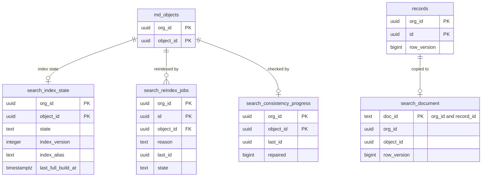

# Data model: 検索

検索の索引の組織ごとの状態、作り直しの仕事、整合の検査の進み。索引そのもの（OpenSearch の `rec-v{n}-{00..15}` の形とマッピング）は [stores.md](stores.md) の 3 節。振る舞いは [search.md](../search.md)、決定は [ADR-0031](../../decisions/0031-search-index-and-japanese-analysis.md)・[ADR-0032](../../decisions/0032-search-permission-post-filter.md) にある。規約は [data-model.md](../data-model.md) の 3 節。

索引は正本の写しで、値を `_source` に持たず、判定に使わない。検索の後の確かめはデータ層の問い合わせで行う。

## 1. ER 図

- `search_document` は OpenSearch の文書（表ではない）。

## 2. 表

### 2.1 `search_index_state`

組織・オブジェクトの索引の状態と置き場所（組織の移動の間は、先の索引ができるまで元を読む）。

| 列 | 型 | NULL | 既定 | 説明 |
| --- | --- | --- | --- | --- |
| `org_id`・`object_id` | `uuid` | NOT NULL | — | |
| `state` | `text` | NOT NULL | `'building'` | `building`・`ready`・`degraded` |
| `index_version` | `integer` | NOT NULL | — | 索引のバージョン（`rec-v{n}`） |
| `index_alias` | `text` | NOT NULL | — | 読む別名（`rec-v{n}-{shard_no % 16}`、大口の組織は専用の索引） |
| `last_full_build_at` | `timestamptz` | NULL | — | |

- キー：PK `(org_id, object_id)`。`building` の間は名前のピボットの前方一致だけで答え、`degraded: true` を返す。

### 2.2 `search_reindex_jobs`

作り直しの仕事（`searchable` の変更、型の変換、項目の削除、マッピングの変更、組織の移動）。

| 列 | 型 | NULL | 既定 | 説明 |
| --- | --- | --- | --- | --- |
| `org_id`・`id` | `uuid` | NOT NULL | — | |
| `object_id` | `uuid` | NOT NULL | — | |
| `reason` | `text` | NOT NULL | — | `field_change`・`conversion`・`mapping`・`migration`・`drift`・`dead_letter` |
| `target_index_version` | `integer` | NOT NULL | — | |
| `last_id` | `uuid` | NULL | — | 済んだ ID の範囲（1 万件）の最後 |
| `state` | `text` | NOT NULL | `'queued'` | `queued`・`running`・`done`・`failed` |
| `started_at`・`finished_at` | `timestamptz` | NULL | — | |

- キー：PK `(org_id, id)`。部分一意 `(org_id, object_id) WHERE state IN ('queued','running')`。仕事は `jobs`（class `search_reindex`、組織ごとの同時 1）。保持：終わってから 30 日。

### 2.3 `search_consistency_progress`

索引の整合の検査（7 日で一周）の進み。

| 列 | 型 | NULL | 既定 | 説明 |
| --- | --- | --- | --- | --- |
| `org_id`・`object_id` | `uuid` | NOT NULL | — | |
| `last_id` | `uuid` | NULL | — | |
| `cycle_started_at` | `timestamptz` | NOT NULL | — | |
| `repaired` | `bigint` | NOT NULL | `0` | 書き直した文書の数（`search_drift_repaired_total`） |

- キー：PK `(org_id, object_id)`。仕事は `jobs`（class `maintenance`）。
