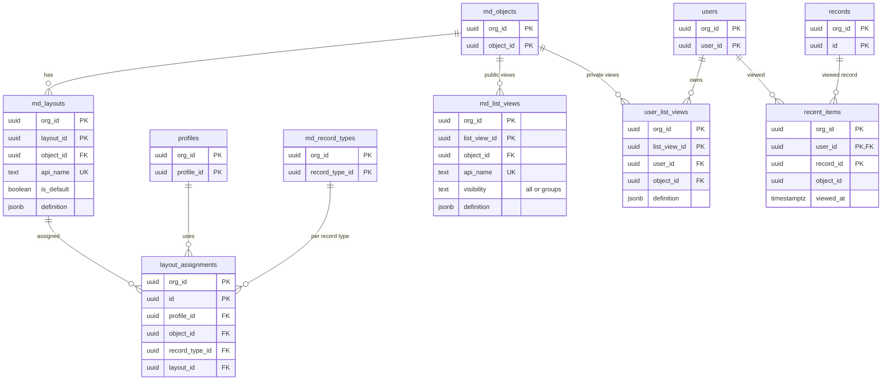

# Data model: 画面とリストビュー

ページレイアウト、レイアウトの割り当て、公開のリストビュー、自分だけのリストビュー、最近見たもの。振る舞いは [ui-layouts-and-list-views.md](../ui-layouts-and-list-views.md)、決定は [ADR-0023](../../decisions/0023-layouts-and-record-page-composition.md)・[ADR-0024](../../decisions/0024-list-views-as-filter-ast.md) にある。規約は [data-model.md](../data-model.md) の 3 節。翻訳は `md_translations`（[metadata.md](metadata.md)）。

## 1. ER 図

- レイアウトは `layouts:<object_id>` の部品、公開のリストビューは `object:<object_id>` の部品に入る（[ADR-0007](../../decisions/0007-segmented-metadata-snapshots.md)）。
- `definition` の中の項目は全て `field_id` で持つ。

## 2. 表

### 2.1 `md_layouts`

| 列 | 型 | NULL | 既定 | 説明 |
| --- | --- | --- | --- | --- |
| `org_id`・`layout_id` | `uuid` | NOT NULL | — | |
| `object_id` | `uuid` | NOT NULL | — | |
| `api_name`・`label` | `text` | NOT NULL | — | |
| `is_default` | `boolean` | NOT NULL | `false` | 割り当てのない時のオブジェクトの既定 |
| `definition` | `jsonb` | NOT NULL | — | `sections[]`（項目・空白・組み込みの部品、`behavior`）、`related_lists[]`、`highlights`、`actions[]`（[ui-layouts-and-list-views.md](../ui-layouts-and-list-views.md) の 3.1 節） |

- キー：PK `(org_id, layout_id)`。UK `(org_id, object_id, api_name)`、部分一意 `(org_id, object_id) WHERE is_default`。種類 `meta`。
- CHECK：項目 200、関連リスト 20 まで（JSON Schema とデータ層）。

### 2.2 `layout_assignments`

プロファイル × レコードタイプ → レイアウト。

| 列 | 型 | NULL | 既定 | 説明 |
| --- | --- | --- | --- | --- |
| `org_id`・`id` | `uuid` | NOT NULL | — | |
| `profile_id` | `uuid` | NOT NULL | — | |
| `object_id` | `uuid` | NOT NULL | — | 2026-09-28 に足した（レコードタイプのないオブジェクトの割り当てを区別するため） |
| `record_type_id` | `uuid` | NULL | — | レコードタイプのないオブジェクトは空 |
| `layout_id` | `uuid` | NOT NULL | — | |

- キー：PK `(org_id, id)`。UK `(org_id, profile_id, object_id, record_type_id) NULLS NOT DISTINCT`。FK `(org_id, layout_id)` → `md_layouts`、`(org_id, profile_id)` → `profiles`。種類 `meta`。

### 2.3 `md_list_views`

組織の全員か、グループに見せる公開のリストビュー（`manage_public_list_views` か `customize_application`）。

| 列 | 型 | NULL | 既定 | 説明 |
| --- | --- | --- | --- | --- |
| `org_id`・`list_view_id` | `uuid` | NOT NULL | — | |
| `object_id` | `uuid` | NOT NULL | — | |
| `api_name`・`label` | `text` | NOT NULL | — | |
| `definition` | `jsonb` | NOT NULL | — | 条件の AST（10 行まで）、`logic`、列（15）、並べ替え（2）、`scope` |
| `visibility` | `text` | NOT NULL | — | `all`・`groups` |
| `visibility_group_ids` | `uuid[]` | NOT NULL | `'{}'` | `groups` の時の公開グループ・ロール・ロールと部下 |

- キー：PK `(org_id, list_view_id)`。UK `(org_id, object_id, api_name)`。CHECK：`visibility = 'groups'` と `cardinality(visibility_group_ids) > 0` が同値。種類 `meta`。

### 2.4 `user_list_views`

作った人だけのリストビュー。データで、バージョンを上げない。

| 列 | 型 | NULL | 既定 | 説明 |
| --- | --- | --- | --- | --- |
| `org_id`・`list_view_id` | `uuid` | NOT NULL | — | |
| `user_id` | `uuid` | NOT NULL | — | |
| `object_id` | `uuid` | NOT NULL | — | |
| `label` | `text` | NOT NULL | — | |
| `definition` | `jsonb` | NOT NULL | — | `md_list_views` と同じ形 |
| `updated_at` | `timestamptz` | NOT NULL | — | |

- キー：PK `(org_id, list_view_id)`。索引 `(org_id, user_id, object_id)`。項目の削除の下見では件数だけを数え、名前を出さない。Sandbox へは作った人の分だけ写す。

### 2.5 `recent_items`

レコードのページの表示で 1 行を足す（確定の後に非同期で）。利用者 × オブジェクトで 100 件まで。

| 列 | 型 | NULL | 既定 | 説明 |
| --- | --- | --- | --- | --- |
| `org_id`・`user_id`・`record_id` | `uuid` | NOT NULL | — | |
| `object_id` | `uuid` | NOT NULL | — | |
| `viewed_at` | `timestamptz` | NOT NULL | — | |

- キー：PK `(org_id, user_id, record_id)`（見直しは `viewed_at` の更新）。索引 `(org_id, user_id, object_id, viewed_at DESC)`。
- 101 件目を足す時に最も古い行を消す。返す時は見る人の権限で問い合わせ直す。レコードの消去で消す。S1 の量：約 3,000 万行。
