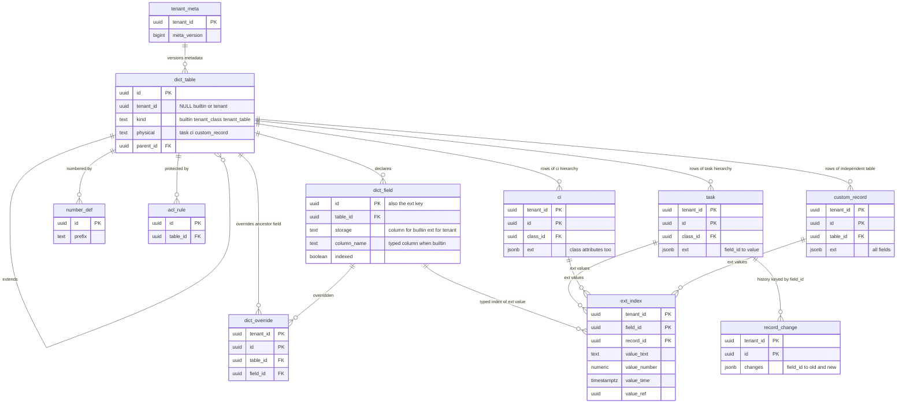

# Data model: ServiceNow

データモデルの正本。置き場所、規約、全体の ER 図、テナントが定義するテーブルの物理の配置、横断の不変条件をここに置き、領域ごとのテーブルの定義（列・制約・索引・保持・量）と ER 図を [data-model/](data-model/) に置く。

- **列・制約・索引の正本は、このファイルと `data-model/` の各ファイル**である。領域の文書（[data-dictionary-and-tables.md](data-dictionary-and-tables.md) など）は振る舞いの正本で、各文書の末尾の「data-model への項目」は提案の記録である。両者が食い違ったら、このデータモデルに合わせて領域の文書を直す。
- 方針の元は [ADR-0002](../decisions/0002-tenancy-and-isolation.md)（テナントとセル）、[ADR-0003](../decisions/0003-table-hierarchy-and-extensible-schema.md)（テーブルの階層と拡張）、[ADR-0007](../decisions/0007-physical-layout-and-extension-index.md)（物理の配置と索引）、[ADR-0010](../decisions/0010-metadata-versions-and-config-packages.md)（メタデータのバージョン）、[ADR-0053](../decisions/0053-data-retention-and-deletion.md)（保持）、[ADR-0054](../decisions/0054-shared-reference-rows-and-cross-tenant-roles.md)（NULL の行とテナントをまたぐロール）。
- 実装の変更（開発リポジトリの `changes/`）でマイグレーションを書くときは、同じ PR でここと `data-model/` を更新する。
- 行数・容量の「S1 の量」は [capacity.md](capacity.md) の 1 節からの**初期見積もり**である。E2 の計測と E12 の負荷試験で置き換える。

## 1. ファイルの構成

| ファイル | 領域 | テーブルの数 |
| --- | --- | --- |
| [data-model/platform-metadata.md](data-model/platform-metadata.md) | テナントの設定、メタデータのバージョン、データ辞書、番号、設定のパッケージ | 13 |
| [data-model/records-and-audit.md](data-model/records-and-audit.md) | `task`（全クラスの列）、`custom_record`、`ext_index`、監査の履歴・作業メモ・ハッシュの鎖、添付 | 7 |
| [data-model/identity-and-access.md](data-model/identity-and-access.md) | 利用者・組織・グループ・ロール、ACL の規則、成り代わり、SSO、パスワード・MFA・セッション | 19 |
| [data-model/workflow-and-approvals.md](data-model/workflow-and-approvals.md) | フローの定義とバージョン、実行、共有のタイマー、承認と代理、レコードのルール、外への呼び出し | 15 |
| [data-model/sla-and-calendars.md](data-model/sla-and-calendars.md) | カレンダー、祝日、SLA の定義とバージョン、計時の行と事象 | 9 |
| [data-model/assignment-and-on-call.md](data-model/assignment-and-on-call.md) | 割り当ての規則、スキル、当番表、エスカレーション、呼び出し | 11 |
| [data-model/itsm-processes.md](data-model/itsm-processes.md) | 優先度、メジャーインシデント、標準の変更、リスク、承認の方針、CAB、予定表と衝突、影響の範囲 | 17 |
| [data-model/catalog-and-requests.md](data-model/catalog-and-requests.md) | カタログ、品目とバージョン、変数のまとまり、`audience`、回答の索引 | 8 |
| [data-model/knowledge.md](data-model/knowledge.md) | ナレッジベース、記事とバージョン、評価と旗、自己解決の計測 | 8 |
| [data-model/notifications-and-email.md](data-model/notifications-and-email.md) | 通知の規則・テンプレート・1 通、Web Push、送信・受信のメール | 13 |
| [data-model/cmdb.md](data-model/cmdb.md) | `ci`、属性と識別の規則、識別の値、取り込み元と調整、取り込み、保留と統合、関係 | 18 |
| [data-model/ui-search-and-reports.md](data-model/ui-search-and-reports.md) | 配置と画面の規則、ポータル、翻訳、検索、レポート、エクスポート、日次の事実 | 18 |
| [data-model/integrations.md](data-model/integrations.md) | API のクライアントとトークン、冪等のキー、取り込み、Webhook、outbox | 14 |
| [data-model/security-and-operations.md](data-model/security-and-operations.md) | テナントの DEK、テナントの監査ログ、サポートの参照、リーガルホールド、正しさの監視、制御の面の DB | 14（セル 5、制御の面 9） |
| [data-model/stores.md](data-model/stores.md) | DB 以外：Valkey のキー、S3 の配置、OpenSearch の索引、outbox の topic と SQS、Webhook の本文、ファイルの形 | — |

合計 184 テーブル（セルの DB 175、制御の面の DB 9）。ER 図は領域ごとに 15 個（`security-and-operations.md` はセルと制御の面の 2 つ）と、下の 4 節の全体図 1 個、5 節の概念図 1 個。

## 2. 置き場所

| 置き場所 | 中身 | 分け方 |
| --- | --- | --- |
| セルの Aurora PostgreSQL 18（東京が主、大阪は Global Database の二次） | セルの唯一の正本。テナントのレコード（`task`・`ci`・`custom_record`・専用の表）、辞書とメタデータ、ACL、フローの実行とタイマー、SLA の計時、監査の履歴、outbox、メール・Webhook・取り込みの記録、セッション | セルごとに 1 つのクラスタ、1 つのデータベース、1 つのスキーマ。writer 1 ＋ reader 2（reader A：画面・API・検索の確かめ直し、reader B：レポート） |
| 制御の面の Aurora（control のアカウント） | テナントの台帳（ホスト名・受信のアドレス → テナント → セル）、顧客、セル、テナントの移動と削除、レート制限の段、選べる変更の日、利用量（[data-model/security-and-operations.md](data-model/security-and-operations.md) の 3 節）。セルの DB にテナントの台帳を置かない | 全セルで 1 つ |
| セルの Valkey | キャッシュと数（コンパイル済みの辞書・ACL・画面のモデル、主体、見える品目、レポートの結果、レート制限、メールの流量の窓、セッションの写し）。失われてもよい | キーの `{t:<tenant_id>}` |
| セルの OpenSearch | 検索の索引（`task`・`ci`・`kb`・`catalog`・`record`）。DB の写しで、作り直せる | `_routing = tenant_id` と必須の絞り込み |
| セルの S3（大阪へレプリケーション） | 添付、受信のメールの原本、エクスポート、取り込みの原本、CMDB のペイロード、祝日の CSV の原本 | `t/<tenant_id>/` の接頭辞 |
| mail-ingress の S3（1 日） | 受信のメールの一時の置き場所。読めるのは `mail-router` だけ（[infrastructure.md](infrastructure.md) の 2.3 節） | — |
| log-archive の S3（Object Lock） | 監査の日次のハッシュの鎖、テナントの監査ログの写し、プラットフォームの監査、CloudTrail、アプリのログ | セル・テナントの接頭辞 |
| CloudFront KeyValueStore | ホスト名 → セル（制御の面の写し） | — |
| SQS | outbox の中継、メールの受信、SES の事象、CMDB の取り込み、Webhook の再試行 | セルごと。メッセージに `tenant_id` |
| コードのバージョン | 組み込みの定義の正本（辞書・ACL の規則・ロール・状態のモデル・配置・文言の辞書・組み込みのレポートなど）。DB の NULL の行へ読み込むもの、コードの中だけに持つもの、テナントの作成の時に行を作るものの 3 つに分ける（3.1 節） | — |

- DB 以外の置き場所のキー・パス・本文の形は [data-model/stores.md](data-model/stores.md) にある。
- **ドメインの分離（1 つのテナントの中で会社ごとにデータを分ける仕組み）は持たない。** 子会社ごとに分けたいときは別のテナント（同じ顧客・同じセル）にするか、`company` と ACL の条件で絞る（[ADR-0002](../decisions/0002-tenancy-and-isolation.md)）。

## 3. 規約

### 3.1 組み込みのデータの置き場所と、`tenant_id` が NULL の行を持つ表

正本は [security.md](security.md) の 10.2 節（[ADR-0054](../decisions/0054-shared-reference-rows-and-cross-tenant-roles.md) と注記、[ADR-0002](../decisions/0002-tenancy-and-isolation.md) の注記）。マイグレーションの CI の許可の一覧と一致させる。

**規則**：組み込みのデータの定義の正本はコードのバージョンにある。そのうち、テナントの行が外部キーで参照するもの、またはテナントの行と同じ一意の空間で照合するものだけを、起動の時に DB の NULL の行へ読み込む（`catalog_loader`）。テナントが自由に変える既定の設定は、テナントの作成の時にテナントの行として作る。それ以外はコードの中だけに持ち、テナントは自分の行で上書き・無効・複製をして、組み込みのものを `stable_key` で指す（外部キーにしない）。

| 組み込みのデータ | 置き場所 | 理由・テナントの変え方 | 定義の場所 |
| --- | --- | --- | --- |
| 辞書（`dict_table`、`dict_field`、`dict_choice_set`、`dict_choice`） | **NULL の行** | テナントの `c_` のフィールド・上書き・子のクラスが参照する | [data-model/platform-metadata.md](data-model/platform-metadata.md) の 3 節 |
| ロール（`role`） | **NULL の行** | `group_role`・`user_role` が参照する | [data-model/identity-and-access.md](data-model/identity-and-access.md) の 3.3 節 |
| ACL の規則（`acl_rule`） | **NULL の行** | テナントの無効の印（`disables_rule_id`）が参照する。組み込みの `deny_unless` は無効にできない | 同上の 4 節 |
| 国民の祝日（`holiday_set`、`holiday_set_version`、`holiday`） | **NULL の行**（運用者 2 人の承認の後に公開） | テナントのカレンダーのバージョンが参照する | [data-model/sla-and-calendars.md](data-model/sla-and-calendars.md) の 3 節 |
| 番号の定義（`number_def`） | **NULL の行** | 組み込みの辞書の `number_def_id` と、テナントの `number_counter` が参照する。接頭辞・桁の変更は、同じテーブルのテナントの行で上書きする | [data-model/platform-metadata.md](data-model/platform-metadata.md) の 4 節 |
| CI の関係の型（`ci_relation_type`） | **NULL の行** | テナントの `ci_relation` が参照する。テナントは型を足せる | [data-model/cmdb.md](data-model/cmdb.md) の 6.1 節 |
| CI の属性と識別の規則（`ci_attribute`、`ci_identification_rule`） | **NULL の行** | テナントの `ci_precedence`・`ci_identifier` が参照する。テナントの同じクラスの規則は組み込みの行に勝つ | 同上の 3 節 |
| 組み込みのフロー（`flow_def`、`flow_version`：`change_approval_policy`、`incident_auto_close`、`kb_publish_approval`、`major_incident_response`、カタログの雛形） | **NULL の行** | テナントの `flow_run` がバージョンを参照する。コードの新しいバージョンは新しい `flow_version` の行にし、前のバージョンを変えない。テナントが変える値（承認者・規則）は、フローの入力となるテナントの行に持つ（`change_approval_policy` は `change_approval_policy_rule`） | [data-model/workflow-and-approvals.md](data-model/workflow-and-approvals.md) の 2 節 |
| 優先度の表の既定（`priority_matrix`） | コードのバージョンだけ | テナントはテーブルごとの行で上書きする。行がなければ親のクラス、最後はコードの既定 | [data-model/itsm-processes.md](data-model/itsm-processes.md) の 2.1 節 |
| 配置と画面の規則の既定（`form_layout`、`list_layout`、`view_rule`、`ui_rule`） | コードのバージョンだけ | テナントは `view` を足すか、既定を上書きする | [data-model/ui-search-and-reports.md](data-model/ui-search-and-reports.md) の 2 節 |
| 状態のモデル、組み込みのレコードのルール | コードのバージョンだけ | テナントは条件と保留の理由だけを足す | [itsm-processes.md](itsm-processes.md) の 3 節、[workflow-engine.md](workflow-engine.md) の 6 節 |
| 通知の規則とテンプレートの既定（`notification_rule`、`notification_template`） | コードのバージョンだけ | テナントは `stable_key` で無効にし（`disables_builtin_key`）、自分の行で規則とテンプレートを足す（組み込みのテンプレートを使うときは複製する） | [data-model/notifications-and-email.md](data-model/notifications-and-email.md) の 2 節 |
| 組み込みのレポートとダッシュボード（`report_def`、`dashboard`） | コードのバージョンだけ | テナントは複製して変える | [data-model/ui-search-and-reports.md](data-model/ui-search-and-reports.md) の 4 節 |
| 画面の文言の辞書（`ja.json`・`en.json`） | コードのバージョンだけ | テナントの文言は `translation` | [portal-and-ui.md](portal-and-ui.md) の 7.2 節 |
| 取り込み元の優先度とデータ源の規則の既定（`ci_precedence`、`ci_source_rule`）、無効の値の一覧、廃止の候補の日数 | コードのバージョンだけ | テナントの行が既定に勝つ（`ci_invalid_value`・`ci_class_policy` はテナントの追加） | [data-model/cmdb.md](data-model/cmdb.md) の 3.4・3.5・4 節 |
| 既定のカレンダー（`calendar`、`calendar_version`） | テナントの作成の時のテナントの行 | テナントが自由に変える | [data-model/sla-and-calendars.md](data-model/sla-and-calendars.md) の 2 節 |
| 組み込みの SLA の定義（インシデントの応答・解決、OLA。`sla_def`・`sla_def_version`） | テナントの作成の時のテナントの行 | テナントが変える。`sla_clock` はテナントのバージョンの行を参照する | 同上の 4 節 |
| 既定のポータルとテーマ（`portal`、`portal_theme`）、既知のエラーのナレッジベース（`kb_base`） | テナントの作成の時のテナントの行 | テナントが変える | [data-model/ui-search-and-reports.md](data-model/ui-search-and-reports.md) の 2.4 節、[data-model/knowledge.md](data-model/knowledge.md) の 2.1 節 |
| 組み込みの取り込み元（`ci_source` の `manual`・`system_group`）、連携の主体（`user` の `email_intake`）、テナントの設定（`tenant_setting`、`tenant_meta`、`tenant_auth_policy`、`tenant_dek`） | テナントの作成の時のテナントの行 | 連携の主体（利用者の行）を持つので、テナントごとに要る | [data-model/cmdb.md](data-model/cmdb.md) の 4.1 節、[data-model/platform-metadata.md](data-model/platform-metadata.md) の 2 節 |

- NULL の行は、アプリのロールから読み取りだけ。書くのは `catalog_loader` だけ。NULL の行はテナントの行を参照しない。
- テナントの作成の時に作る行は、コードの新しいバージョンで書き換えない（既定の変更は新しいテナントにだけ効く）。既存のテナントに効かせたいときは、変更の Story で移行のジョブを作る（[delivery.md](delivery.md) の 4 節）。
- **NULL の行を持つ表の許可の一覧**：`dict_table`、`dict_field`、`dict_choice_set`、`dict_choice`、`role`、`acl_rule`、`holiday_set`、`holiday_set_version`、`holiday`、`number_def`、`ci_relation_type`、`ci_attribute`、`ci_identification_rule`、`flow_def`、`flow_version`。ここにない表の `tenant_id` は NOT NULL。

### 3.2 セルの DB の外に置く表（制御の面）

| 表 | 中身 | 定義の場所 |
| --- | --- | --- |
| `customer`、`cell` | 顧客、セルの一覧（`cells.yaml` と突き合わせる） | [data-model/security-and-operations.md](data-model/security-and-operations.md) の 3.2 節 |
| `tenant_registry` | テナント、ホスト名、環境、セル、状態 | 同上の 3.3 節 |
| `inbound_address` | 受信のアドレス（別名を含む）→ テナント | 同上の 3.4 節 |
| `tenant_move_run`、`tenant_deletion_run` | セル間の移動、テナントの削除（セルの行を消した後も残す） | 同上の 3.5 節 |
| `tenant_rate_limit` | 契約の段のレート制限 | 同上の 3.6 節 |
| `tenant_flag_choice`、`tenant_usage_daily` | 選べる変更の日、課金の集計 | 同上の 3.7・3.8 節 |

- 制御の面の表はテナントの表ではない（`tenant_id` の RLS を掛けない）。制御の面のサービスのロールだけが読み書きする。

### 3.3 テナントと RLS

- **テナントテーブルは先頭の列に `tenant_id uuid` を持ち、主キーとインデックスの先頭に置く**（主キーは `(tenant_id, id)`）。`FORCE ROW LEVEL SECURITY` を掛け、トランザクションごとに `SET LOCAL app.tenant_id` を設定する。`current_setting` の `missing_ok` を使わないので、コンテキストがなければ問い合わせ自体が失敗する（安全側）（[ADR-0002](../decisions/0002-tenancy-and-isolation.md)、[security.md](security.md) の 10.3 節）。
- **外部キーは `tenant_id` を含む複合キーにする**（別のテナントの行を指す行を DB が拒む）。子の表も `tenant_id` を持ち、同じ方針を張る。親を結合しないと絞れない RLS は作らない。
- **NULL の行を持つ表**（3.1 節の許可の一覧）は、主キーを `id` だけにし、UK `(tenant_id, id)` を別に持つ。テナントの行からの参照は `id` の単一の外部キーにし、参照の先が「同じテナントの行か NULL の行」であることを、挿入・更新のトリガー `check_shared_ref()` で確かめる。名前の一意は `UNIQUE NULLS NOT DISTINCT (tenant_id, ...)` とテナントの名前の `c_` の接頭辞で守る。方針は 2 つ：`shared_read`（`tenant_id = 現在のテナント OR tenant_id IS NULL` の `SELECT`）と `tenant_write`（`tenant_id = 現在のテナント` の書き込み。`WITH CHECK` で NULL を拒む）。
- **`ext` の参照は DB の制約が効かない**ので、`ext_index.value_ref` と Record Service で守る（[ADR-0007](../decisions/0007-physical-layout-and-extension-index.md)）。複数の物理の表を指す列（`ext_index.record_id`、`timer.target_id`、`record_change.record_id`、`attachment.record_id`）も外部キーを張らず、Record Service と日次の整合の検査で守る。
- **テナントの解決の前に、テナントテーブルを読まない。** 解決に使う台帳は制御の面にあり、セルの App は写しをメモリーに持つ。

### 3.4 RLS の例外とテナントをまたぐ処理

RLS を外す・テナントをまたいで読むのは次だけ。**この表が一覧の正本**で、[security.md](security.md) の 10.4 節と一致させる。足すときは ADR か本書の更新で決め、`security:sensitive` の承認を受ける。

| 対象 | 何をまたぐか | 守り方 |
| --- | --- | --- |
| `timer` | 期限の来た候補の取得 | `engine_scheduler` の `SECURITY DEFINER` の関数 `claim_due_timers(shards, limit)` が `(timer_id, tenant_id)` だけを返す。本文はテナントのコンテキストで取り直す（[workflow-engine.md](workflow-engine.md) の 8.3 節） |
| `outbox` | 未送信の行の読み取りと送信済みの印 | `relay` のロールに `SELECT` と `published_at` の `UPDATE` だけの方針を張る（本文は SQS へそのまま） |
| 索引の突き合わせの抜き取り | `(tenant_id, id, version)` | `indexer_scan` のロールの関数だけ |
| 課金の集計（`tenant_usage_daily`） | テナントごとの件数 | `platform` のロール（期限付き）の日次のジョブが件数だけを集める |
| テナントの作成・移動・削除、保持のジョブ、リーガルホールドの書き込み | すべて | `platform` のロール（`BYPASSRLS`、期限付き、画面・API から使えない、プラットフォームの監査） |
| 保持の期間を過ぎたパーティション | パーティションの `DETACH`・`DROP` | `maintenance` のロール（行を読まない） |
| 3.1 節の NULL の行 | 読み取り | `shared_read` の方針。書くのは `catalog_loader`（NULL の行の `INSERT`・`UPDATE` だけ） |

- 正しさの監視（`correctness_check_run`）と索引の日次の突き合わせの結果（`search_reconcile_run`）は、テナントのコンテキストで動かし、テナントの行として書く（テナントをまたいで読まない。全体の集計はメトリクス）。
- SQS のメッセージは `tenant_id` を持ち、受け手は処理の始めに `SET LOCAL app.tenant_id` をする。読んだ行の `tenant_id` と違えば止めて SEV2（[security.md](security.md) の 10.1 節）。

### 3.5 ID

- DB の ID は `uuid` 型の **UUIDv7**（PostgreSQL 18 の `uuidv7()`）。API・画面は UUID の文字列をそのまま出す（接頭辞を付けない）。例外：Webhook の配達の ID は `whd_` ＋ base62 で外に出す（[api-and-integrations.md](api-and-integrations.md) の 6.2 節）。
- **人が話す番号は `number`**（`INC0001234`、`KB0001234`）。テナント・番号の定義ごとに一意で増えるが、欠番のないことは約束しない（[ADR-0008](../decisions/0008-record-numbering.md)）。
- 組み込みの行（NULL の行、コードのバージョンの定義）は、コードのバージョンで固定の UUID を持つ（起動の時の読み込みが冪等になる）。
- **設定のパッケージで移したメタデータは、移送先でも同じ `id` を使う**（主キーが `(tenant_id, id)` なので衝突しない。[data-dictionary-and-tables.md](data-dictionary-and-tables.md) の 10.2 節）。
- 秘密・トークンの接頭辞は `<brand>_at_`・`<brand>_cs_`・`<brand>_whsec_`（[リポジトリ共通の ADR-0006](../../../../docs/decisions/0006-brand-neutral-identifiers.md)）。

### 3.6 パーティションと保持

保持の期間の正本は [security.md](security.md) の 9 節（[ADR-0053](../decisions/0053-data-retention-and-deletion.md)）。「監査」は監査の履歴と同じ既定 7 年（延長 10 年、L4 の確認待ち）。**時間で消える大きな表は時間のパーティションで持ち、`DROP` で消す。** パーティションの境目をまたいで一意にしたい表は、一意のキーにパーティションのキーを含め、その値を重複の送り直しでも同じになる値（事象の ID の時刻、SES の受信の時刻）にする。含められないときは `pg_advisory_xact_lock` の下で直近の範囲を引いてから挿入する。

| テーブル | パーティション | 保持 | その後 |
| --- | --- | --- | --- |
| `record_change`、`journal_entry` | `changed_at`・`created_at` の月 | 監査 | `maintenance` が `DETACH`・`DROP` |
| `sla_clock_event`、`page_attempt`、`ci_merge_log`、`tenant_audit_event` | 事象の時刻の月 | 監査（`tenant_audit_event` は DB 1 年、log-archive 7 年） | 同上 |
| `flow_step` | `started_at` の月 | 90 日 | `DROP` |
| `inbound_email`、`email_outbound`、`email_watermark` | 受信・送信・作成の時刻の月 | 1 年・90 日以上・1 年 | `DROP`（原本の S3 はライフサイクル） |
| `task_daily_fact` | `day` の月 | 13 か月 | `DROP` |
| `notification_message`、`webhook_delivery` | `event_at`（事象の ID の時刻）の日 | 30 日・7 日 | `DROP` |
| `portal_event`、`flow_trigger_suppressed`、`report_run`、`ingest_batch`・`ingest_item`、`idempotency_key` | 日 | 90 日・30 日・30 日・30 日・24 時間 | `DROP` |
| `outbox` | `created_at` の時間 | 送信の済んだ時間を 24 時間後 | `DROP` |
| `approval_set`、`approval`、`meta_change`、`page`、`change_risk_assessment`、`change_impact_snapshot`、`cab_*`、`impersonation_session`、`support_access_grant` | なし（部分一意索引・行のロック・量が小さい） | 監査 | 保守のジョブが古い行を消す |
| `flow_run`、`bulk_job`、`webhook_result`、`import_row`、`export_job`、`search_reconcile_run`、`correctness_check_run` | なし | 90 日・90 日・90 日・30 日・30 日・90 日・90 日 | 日次の削除のジョブ（1 万行ずつ） |
| `task`、`ci` | S1 では分けない（[ADR-0007](../decisions/0007-physical-layout-and-extension-index.md)） | テナント | 分け方は E12 の後、S2 の前に決める |

- パーティションは pg_partman で先に作る（日：14 個、月：3 個、時間：48 個）。
- リーガルホールド（`legal_hold`）のある範囲は、保持のジョブと削除のジョブが消さない。

### 3.7 時刻

- 時刻は `timestamptz`、UTC で保存する。API は ISO 8601（`Z`）で返す。表示は見る人のタイムゾーン（`user.time_zone` → `tenant_setting.time_zone`）。
- 日付は `date` 型。どのタイムゾーンの日かを列の説明に書く（`task_daily_fact.day`・`deflection_daily.day` はテナントのタイムゾーン、`audit_digest.day`・`portal_event.day` は UTC、`holiday.date` はタイムゾーンなしの暦の日）。
- 業務時間の長さは秒の `bigint`（`duration`）。SLA の計時は秒に切り捨てる（[ADR-0019](../decisions/0019-business-calendar-and-pure-time-functions.md)）。区間は `tstzrange` の半開区間 `[s, e)`。
- **時刻は DB の時計（`now()`）を使う。** ワーカーのプロセスの時計を使わない（[workflow-engine.md](workflow-engine.md) の 5.3 節）。

### 3.8 命名と型

- テーブルは英語の単数形の `snake_case`（`task`、`user`）。列は `snake_case`。時刻は `_at`、真偽は `is_` を付けない形容詞か名詞（`active`、`breached`）。
- **参照の列は `<name>_id`、辞書のフィールドの名前は `_id` を除いた名前**にする（列 `assigned_to_id` ↔ フィールド `assigned_to`）。API・式の参照のたどり・Webhook の `changed_fields` は辞書の名前を使う（[api-and-integrations.md](api-and-integrations.md) の 4.2 節）。
- **予約語の名前（`user`、`group`、列の `order`）は変えない。** SQL では必ず引用符で書き、クエリビルダーは識別子を常に引用する。
- 状態・種類は `text` と `CHECK (... IN (...))` で持つ。PostgreSQL の列挙型は使わない（値の追加でロックを取らないため）。値は本システムの名前で、本家の内部の名前を写さない（[リポジトリ共通の ADR-0006](../../../../docs/decisions/0006-brand-neutral-identifiers.md)）。
- 検索しない入れ子の値（フローの文書、品目の定義、式の木）は `jsonb` に持ち、形は開発リポジトリの Zod のスキーマで検証してから書く。式の言語の条件は式の木の `jsonb`（辞書の `condition` の型）。
- ID の集合は `uuid[]`（`watchers`、`contains` など）。要素の存在はアプリで確かめる。
- 文字列は NFC に正規化して保存する。大文字・小文字を区別しない一意は `lower()` の式の索引で持つ。
- 個人情報の列には、マイグレーションで `COMMENT ON COLUMN ... IS 'pii:<分類>;retention:<区分>'` を付ける。本書の列の表では「PII」と書く。

### 3.9 共通の列

| まとまり | 列 | 使う表 |
| --- | --- | --- |
| メタデータの共通の列 | `stable_key text NOT NULL`（辞書は `field:<table>.<field>`、ほかは `id` と同じ値）、`rev integer NOT NULL DEFAULT 1`、`content_hash bytea NOT NULL`、`updated_in_version bigint NOT NULL`（変えた時の `meta_version`）、`deleted_at timestamptz NULL`、`created_at`、`created_by`、`updated_at`、`updated_by` | 辞書、ACL の規則、フロー、ルール、SLA、カレンダー、配置、通知の規則、カタログの定義、割り当ての規則など（[ADR-0010](../decisions/0010-metadata-versions-and-config-packages.md)） |
| レコードの共通の列 | `version bigint NOT NULL DEFAULT 1`、`created_at`、`created_by`、`updated_at`、`updated_by` | `task`、`ci`、`custom_record`、専用の表（`user`、`group`、`kb_article` など） |

- **行は `version` を持ち、更新はバージョンの条件付き**（`WHERE version = $expected`）。一致しなければ 409 `record_changed`。API の `ETag`・`If-Match` は `"v<version>"`。
- メタデータの変更は、オブジェクトの行、`tenant_meta.meta_version += 1`、`meta_change`、outbox（`meta.changed`）を 1 つのトランザクションで書く。
- バージョン付きのメタデータは「定義の表 ＋ 不変のバージョンの表」の 2 つにする（`flow_def`・`flow_version`、`sla_def`・`sla_def_version`、`calendar`・`calendar_version`、`catalog_item`・`catalog_item_version`、`transform_map`・`transform_map_version`、`std_change_template`・`std_change_template_version`、`on_call_schedule`・`on_call_schedule_version`、`escalation_policy`・`escalation_policy_version`）。**バージョンの表には `UPDATE` を与えない。** 動いている実行・計時・要求は、開始の時のバージョンを指す。

### 3.10 論理削除と個人情報の除去

- **レコード（`task`、`ci`、`custom_record`）は物理の削除**で、削除の前の全体の値を `record_change.snapshot` に残す（保持の期間の中なら戻せる）。CI は入口から削除せず、`retired` にする。
- メタデータは `deleted_at` の論理削除（パッケージの `delete` と取り消しのため）。テナントのフィールドは 2 段の削除（`hidden_at` → 30 日後に値を消すジョブ）。
- **利用者は消さずに仮名化する**（`pseudonymized_at`。氏名・メール・電話を空に）。追記だけの表の自由記述の中の個人の情報を消すかは、法務の L1・L4 の確認待ち（[security.md](security.md) の 9.2 節）。
- テナントの削除は、停止の 30 日後に表ごとに `tenant_id` の行を消し、テナントの DEK を消す（[security.md](security.md) の 9.1 節）。

### 3.11 暗号化

| 対象 | 方式 | 鍵 |
| --- | --- | --- |
| Aurora・スナップショット・S3・SQS・OpenSearch | 保存時の暗号化 | セルの `<brand>-<cell>-data`（[security.md](security.md) の 5.2 節） |
| テナントの秘密（`tenant_secret.ciphertext`、`webhook_secret.ciphertext`、`idp_config.oidc_client_secret_ciphertext`、`user_mfa_factor.totp_secret_ciphertext`、`push_subscription` の購読の URL と秘密） | テナントの DEK のエンベロープ暗号化（AES-256-GCM、AAD に `tenant_id` と行の ID） | `tenant_dek`（`<brand>-<cell>-tenant-secrets` で包む） |
| 利用者のパスワード（`user_credential.password_hash`） | Argon2id | — |
| API のクライアントシークレット・アクセストークン・リフレッシュトークン、セッションの Cookie | SHA-256 のハッシュだけ | — |
| 設定のパッケージの署名、一覧の `cursor` の HMAC | 署名 | `<brand>-<cell>-signing` |
| 監査のハッシュの鎖、プラットフォームの監査 | Object Lock（compliance） | `<brand>-audit`（log-archive） |

- 暗号文の列は `bytea`、`*_ciphertext` の名前にし、`dek_version` で `tenant_dek` のバージョンを指す。ハッシュの列は `*_hash`。

### 3.12 DB のロール

| ロール | 権限 | 使う処理 |
| --- | --- | --- |
| `migrator` | 所有者。DDL | マイグレーション |
| アプリのロール | テナントテーブルの読み書き（RLS の対象。`BYPASSRLS` なし）。追記だけの表（`record_change`、`journal_entry`、`sla_clock_event`、`meta_change`、`tenant_audit_event`、`ci_merge_log`、`audit_digest`）とバージョンの表は `INSERT`・`SELECT` だけ | App・Engine・Ingest・Notifier・Indexer |
| `catalog_loader` | NULL の行の `INSERT`・`UPDATE` だけ | 起動の時の組み込みの定義の読み込み、祝日の取り込み |
| `engine_scheduler` | `claim_due_timers` の実行だけ | タイマーの候補の取得 |
| `relay` | `outbox` の `SELECT` と `published_at` の `UPDATE` | outbox の中継 |
| `indexer_scan` | `(tenant_id, id, version)` を返す関数だけ | 索引の日次の突き合わせ |
| `platform` | `BYPASSRLS`（期限付き） | テナントの作成・移動・削除、保持のジョブ、課金の集計 |
| `maintenance` | パーティションの操作だけ | 保持の期間を過ぎたパーティションの `DETACH`・`DROP` |

## 4. 全体の ER 図

領域をまたぐ主な関係だけを描く。列の詳細は各領域の図にある。`timer.target_id`・`ext_index.record_id`・`record_change.record_id` は複数の表を指すので線を省く。

```mermaid
erDiagram
    tenant_setting ||--o{ tenant_meta : "versions"
    dict_table ||--o{ dict_field : "declares"
    dict_table ||--o{ task : "class of"
    dict_table ||--o{ ci : "class of"
    dict_table ||--o{ custom_record : "table of"
    user ||--o{ group_member : "joins"
    group ||--o{ group_member : "has"
    role ||--o{ user_role : "granted"
    role ||--o{ acl_rule : "required by"
    group ||--o{ task : "assigned to"
    user ||--o{ task : "requests"
    ci ||--o{ task : "affected"
    ci ||--o{ ci_relation : "related"
    ci ||--o{ ci_identifier : "identified by"
    task ||--o{ record_change : "audited"
    task ||--o{ journal_entry : "notes"
    task ||--o{ attachment : "files"
    flow_version ||--o{ flow_run : "runs"
    flow_run ||--o{ approval_set : "asks"
    approval_set ||--|{ approval : "approvers"
    task ||--o{ flow_run : "triggers"
    sla_def_version ||--o{ sla_clock : "pins"
    calendar_version ||--o{ sla_clock : "pins"
    task ||--o{ sla_clock : "measured"
    task ||--o{ page : "pages"
    catalog_item_version ||--o{ task : "request item of"
    kb_article ||--|{ kb_article_version : "versions"
    task ||--o{ notification_message : "notifies"
    inbound_email }o--o{ task : "threads into"
    webhook_subscription ||--o{ webhook_delivery : "delivers"
    outbox ||--o{ webhook_delivery : "event"
    outbox ||--o{ notification_message : "event"

    tenant_setting {
        uuid tenant_id PK
        text time_zone
    }
    tenant_meta {
        uuid tenant_id PK
        bigint meta_version
        bigint acl_version
    }
    dict_table {
        uuid id PK
        uuid tenant_id "NULL for builtin"
        text name
        text physical
    }
    dict_field {
        uuid id PK
        uuid table_id FK
        text storage "column ext"
    }
    user {
        uuid tenant_id PK
        uuid id PK
        text kind
    }
    group {
        uuid tenant_id PK
        uuid id PK
    }
    group_member {
        uuid tenant_id PK
        uuid group_id PK
        uuid user_id PK
    }
    role {
        uuid id PK
        uuid tenant_id "NULL for builtin"
    }
    user_role {
        uuid tenant_id PK
        uuid user_id PK
        uuid role_id PK
    }
    acl_rule {
        uuid id PK
        text operation
        text effect
    }
    task {
        uuid tenant_id PK
        uuid id PK
        uuid class_id FK
        text number UK
        text state
        bigint version
        jsonb ext
    }
    ci {
        uuid tenant_id PK
        uuid id PK
        uuid class_id FK
        text operational_status
    }
    custom_record {
        uuid tenant_id PK
        uuid id PK
    }
    ci_relation {
        uuid tenant_id PK
        uuid id PK
        boolean present
    }
    ci_identifier {
        uuid tenant_id PK
        bytea value_hash PK
        uuid ci_id FK
    }
    record_change {
        uuid tenant_id PK
        uuid id PK
        jsonb changes
    }
    journal_entry {
        uuid tenant_id PK
        uuid id PK
        text kind
    }
    attachment {
        uuid tenant_id PK
        uuid id PK
        text scan_status
    }
    flow_version {
        uuid id PK
        jsonb compiled
    }
    flow_run {
        uuid tenant_id PK
        uuid id PK
        text state
    }
    approval_set {
        uuid tenant_id PK
        uuid id PK
        text rule
    }
    approval {
        uuid tenant_id PK
        uuid id PK
        text state
    }
    sla_def_version {
        uuid tenant_id PK
        uuid id PK
    }
    calendar_version {
        uuid tenant_id PK
        uuid id PK
    }
    sla_clock {
        uuid tenant_id PK
        uuid id PK
        text stage
        boolean breached
    }
    page {
        uuid tenant_id PK
        uuid id PK
        text state
    }
    catalog_item_version {
        uuid tenant_id PK
        uuid id PK
    }
    kb_article {
        uuid tenant_id PK
        uuid id PK
        text number UK
    }
    kb_article_version {
        uuid tenant_id PK
        uuid id PK
        text state
    }
    notification_message {
        uuid tenant_id PK
        uuid id PK
        text state
    }
    inbound_email {
        uuid tenant_id PK
        uuid id PK
        text ses_message_id UK
    }
    webhook_subscription {
        uuid tenant_id PK
        uuid id PK
    }
    webhook_delivery {
        uuid tenant_id PK
        uuid id PK
        text state
    }
    outbox {
        uuid id PK
        text topic
    }
```



## 5. テナントが定義するテーブルの物理の配置（概念図）

テナントが作るクラスとフィールドは、DDL を発行せずに、辞書の行と既存の物理の表の `ext` で表す（[ADR-0003](../decisions/0003-table-hierarchy-and-extensible-schema.md)、[ADR-0007](../decisions/0007-physical-layout-and-extension-index.md)）。

```
テナントの操作                         辞書（メタデータ）                                  物理の行
─────────────────────────────────────────────────────────────────────────────────────────────────────────
クラス c_facilities_request を作る  → dict_table(kind=tenant_class, parent=task,      → task の行（class_id = このクラス）
                                                  physical=task)
フィールド c_building（string）       → dict_field(storage=ext, indexed=true)          → task.ext["<field_id>"] = "本社 3F"
                                                                                       ＋ ext_index(value_text = "本社 3F")
参照のフィールド c_vendor             → dict_field(type=reference, ref_table=…)        → task.ext["<field_id>"] = "<uuid>"
                                                                                       ＋ ext_index(value_ref)（必ず）
組み込みのフィールドの上書き          → dict_override(table=子のクラス, field=祖先)   → 行は変わらない（実効の辞書だけが変わる）
独立のテーブル c_asset_loan を作る    → dict_table(kind=tenant_table, physical=          → custom_record の行（table_id = このテーブル）
                                                  custom_record)
番号を持たせる                        → number_def（テナントの行）＋ number_counter     → task.number・custom_record.number
すべての変更                          → rev・content_hash・updated_in_version、           → 変えない（DDL なし）
                                        tenant_meta.meta_version += 1、meta_change
```



- **組み込みのクラスの列は型付きの列、テナントのフィールドは `ext`**。値のキーはフィールドの ID なので、ラベルの変更で値を移さない（内部の名前は変えない）。
- 絞り込み・並べ替え・集計に使えるのは、型付きの列と `ext_index` に写したフィールドだけ（索引のない条件は 10,000 行以下に絞った後だけ。422 `unindexed_filter`）。
- 上限：テナントのフィールド 300、索引 20、参照 50、テーブル 500、`ext` 64 KB、深さ 6（[ADR-0007](../decisions/0007-physical-layout-and-extension-index.md)）。

## 6. 横断の不変条件

| 不変条件 | 守り方（DB） | 根拠 |
| --- | --- | --- |
| **テナントの分離**：あるテナントのコンテキストで、別のテナントの行・索引の文書・S3 のオブジェクト・キャッシュのキーに届かない | 3.3 節の FORCE RLS と複合の外部キー、NULL の行の許可の一覧と `check_shared_ref()`、3.4 節の例外の一覧、マイグレーションの CI（`tenant_id` と方針のない表を拒む） | [ADR-0002](../decisions/0002-tenancy-and-isolation.md)、[ADR-0054](../decisions/0054-shared-reference-rows-and-cross-tenant-roles.md) |
| **遷移はちょうど 1 回**：レコード・フローの実行・承認・計時の行・呼び出しの状態の遷移と、タイマーの消化・登録、outbox を 1 つのトランザクションで書く | 行の `version` の条件付きの更新、`FOR UPDATE`、タイマーの `target_version` の照合 | [ADR-0004](../decisions/0004-workflow-and-sla-engine.md)、[ADR-0015](../decisions/0015-flow-execution-and-timers.md) |
| **終わっていない実行は、今すぐのタイマーか待ちのどちらか 1 つをちょうど持つ**（INV-FLOW-001） | 遷移の関数（1 か所）、毎分の回収の検査 | [workflow-engine.md](workflow-engine.md) の 5.2・5.6 節 |
| **承認のまとまりの決着は 1 回**：同じ承認への 2 つの回答は 1 つだけ効く | `approval_set` の行のロックの下での評価、`approval` のバージョンの条件、UK `(set_id, approver_id)` | [ADR-0016](../decisions/0016-approvals.md) |
| **変更は承認なしに実施へ進まない** | 遷移の表（`scheduled` の前に `approved`）、`requires_explicit_approval` のテーブルで `on_due = approve` を拒むトリガー、日次の突き合わせ | [ADR-0024](../decisions/0024-change-models-risk-and-cab.md)、PROP-CHG-001 |
| **監査の履歴の完全**：コミットした保存と `record_change` の行が 1 対 1。追記だけ | 同じトランザクション、アプリのロールに `UPDATE`・`DELETE` なし、日次のハッシュの鎖（S3 Object Lock） | [ADR-0009](../decisions/0009-record-audit-history-and-journal.md)、PROP-DICT-003 |
| **`ext_index` と `ext` は常に一致する** | Record Service が同じトランザクションで書く、`num_nonnulls = 1` の CHECK、日次の抜き取り | [ADR-0007](../decisions/0007-physical-layout-and-extension-index.md)、PROP-DICT-002 |
| **番号は一意で増える**（欠番は許す） | `(tenant_id, number)` の一意、別の短いトランザクションの `UPDATE ... RETURNING`、`next` を減らす更新を拒むトリガー | [ADR-0008](../decisions/0008-record-numbering.md)、PROP-DICT-004 |
| **メタデータのバージョンは単調に増え、変更と同じトランザクションで上がる** | `tenant_meta` の行のロック、減る値を拒むトリガー | [ADR-0010](../decisions/0010-metadata-versions-and-config-packages.md)、[ADR-0011](../decisions/0011-roles-groups-and-acl-evaluation.md) |
| **公開したバージョンは変えない**（フロー・品目・SLA・カレンダー・祝日・変換の対応・当番表・方針・雛形の承認済みのバージョン、記事の `review`・`published` の本文） | バージョンの表に `UPDATE` を与えない、更新を拒むトリガー | [ADR-0014](../decisions/0014-flow-dsl-and-versioning.md)、[ADR-0021](../decisions/0021-sla-definitions-and-timers.md)、[ADR-0031](../decisions/0031-knowledge-articles-versions-and-publishing.md) |
| **1 つのタスク・SLA の定義に動いている計時の行は高々 1 つ。違反の事実は取り消さない** | 部分一意索引、`breached` を偽に戻す更新を拒むトリガー | [ADR-0021](../decisions/0021-sla-definitions-and-timers.md)、[ADR-0047](../decisions/0047-sla-attainment-and-breach-disputed.md) |
| **CI の重複を作らない**：同じ識別の値は 1 つの CI だけが持つ。CI は入口だけが書く | `ci_identifier` の主キー、一意の違反で巻き戻して識別からやり直す | [ADR-0005](../decisions/0005-cmdb-identification-and-reconciliation.md)、[ADR-0037](../decisions/0037-ci-ingest-entry-point-and-ambiguity-hold.md) |
| **調整は到着の順序によらない** | `ci_source_state`・`ci_relation_source_state` の max の結合、`choose` の純粋な関数 | [ADR-0038](../decisions/0038-attribute-reconciliation-per-source-state.md) |
| **通知・配達・受信は 1 回だけ作る** | `notification_message` の UK `(event_id, rule_key, recipient_key, channel)`、`webhook_delivery` の UK `(event_id, subscription_id)`、`inbound_email` の UK `(ses_message_id)`（いずれもパーティションのキーを含む） | [ADR-0033](../decisions/0033-notification-rules-and-outbound-email.md)、[ADR-0034](../decisions/0034-inbound-email-threading-and-sender-trust.md)、[ADR-0050](../decisions/0050-signed-webhooks-and-tenant-rate-limits.md) |
| **事象と Webhook の本文に値を入れない**（ID とバージョンだけ） | outbox の topic ごとの Zod スキーマ、Webhook の本文のスキーマ | [ADR-0012](../decisions/0012-acl-enforcement-at-every-exit.md)、[ADR-0050](../decisions/0050-signed-webhooks-and-tenant-rate-limits.md) |
| **1 つの記事に公開中のバージョン・編集中のバージョンはそれぞれ高々 1 つ** | 部分一意索引 2 つ | [ADR-0031](../decisions/0031-knowledge-articles-versions-and-publishing.md) |
| **開いている呼び出しは (タスク, グループ) に 1 つ** | 部分一意索引 | [ADR-0027](../decisions/0027-on-call-rotations-and-escalation.md) |
| **秘密は平文で持たない** | ハッシュか DEK の暗号文の列だけ（3.11 節）、列の名前の lint | [ADR-0052](../decisions/0052-keys-encryption-and-operator-access.md) |

## 7. 統合で決めたこと（2026-09-28）

各領域の文書を集めて見つかった重なり・食い違い・未確定の点を、次のとおり決めた（[architecture/README.md](README.md) の「決定（2026-09-28、既定案）」）。1〜9 は最初の統合、10 以降はデータモデルを正本にした工程で決めた。

| # | 点 | 決定 | 直した文書 |
| --- | --- | --- | --- |
| 1 | 3.1 節の候補の表（組み込みの行を DB に NULL の行として持つか、コードの中だけにするか） | 3 つに分けた（NULL の行、コードのバージョンだけ、テナントの作成の時の行）。NULL の行はテナントの行が外部キーで参照するか同じ一意の空間で照合するものだけ。`number_def`・`ci_relation_type`・`ci_attribute`・`ci_identification_rule`・`flow_def`・`flow_version` を許可の一覧に足した | この文書の 3.1 節、security の 10.2 節、ADR-0054・ADR-0002 の注記、AGENTS.md |
| 2 | `sla_clock.breach_disputed_at` の列の追加 | 足す。計算し直しのジョブが `breach_disputed` の事象と同じトランザクションで入れる | sla-and-calendars の 6.2・8 節、reports の 8.2 節、ADR-0047 の注記 |
| 3 | `timer` の取得の SQL がテナントをまたいで読む | `engine_scheduler` の関数 `claim_due_timers` に置き換え、識別子だけを返す | workflow-engine の 5.3・8.3 節、security の 10.4 節、ADR-0004・0015・0018 の注記 |
| 4 | 受信のメールの経路と、解決できない受け手のバウンス | infrastructure の形（mail-ingress の共有の入口と `mail-router`）に揃え、バウンスしない（後方散乱を避ける） | notifications-and-email-ingest の 5.1 節、infrastructure の 2.3 節、ADR-0034・0035 の注記 |
| 5 | `dict_table.searchable`・`dict_field.searchable` の列 | 辞書の列に足す | data-dictionary-and-tables の 3.2 節、search の 14 節 |
| 6 | レポートの定義・翻訳・画面の配置をパッケージの対象に入れるか | 配置・`view_rule`・画面の規則・翻訳は入れる。レポートとダッシュボードは `packaged` の印の付いたものだけ | data-dictionary-and-tables の 10.1 節、reports の 3 節 |
| 7 | 監査の保持の案（「（案）」と書いたもの） | security の 9 節の表に一本化した | security の 9 節、この文書の 3.6 節 |
| 8 | 組み込みのロールに `problem_manager`・`major_incident_manager` があるか | 組み込みのロールに足す（どちらも `agent` を含む）。あわせて、`requester` がポータルから自分のインシデントを作る組み込みの規則を足す | access-control の 3.3 節、itsm-processes の 11 節 |
| 9 | 組み込みのフロー `change_approval_policy` のテナントが変える値の置き場所 | テナントの設定の表 `change_approval_policy_rule` に持つ。フローのバージョンには既定だけを持ち、段の数は変えさせない。保存の時の検査は DT-CHG-003 | itsm-processes の 8.5・8.5.1 節、roadmap の `change-approval-policy-flows` |
| 10 | データモデルの正本の置き場所 | この文書と `data-model/` を列・制約・索引の正本にした（索引から昇格）。領域の文書は振る舞いの正本で、末尾の「data-model への項目」は提案の記録 | この文書、architecture/README の 7 節 |
| 11 | バージョン付きのメタデータの表の形（`sla_def`・`escalation_policy`・`transform_map` の「バージョン付き」の意味） | `flow_def`・`flow_version` と同じ「定義の表 ＋ 不変のバージョンの表」にし、`sla_def_version`・`escalation_policy_version`・`transform_map_version` を足した（`sla_clock.sla_def_version_id`・`page.policy_version_id` の参照先） | sla-and-calendars の 6.1・14 節、assignment-and-on-call の 12 節、api-and-integrations の 5.2・13 節 |
| 12 | メタデータの共通の列の論理削除（`deleted` と `deleted_at` の食い違い） | `deleted_at timestamptz` にそろえた | data-dictionary-and-tables の 9.1 節 |
| 13 | 参照の列の名前（`duplicate_of`・`reopened_from` と `_id` の混在） | 列は `<name>_id`、辞書のフィールドの名前は `_id` を除いた名前（3.8 節） | itsm-processes の 15 節 |
| 14 | セッションの正本（Valkey と書いた箇所がある） | Aurora の `user_session` を正本にし、Valkey は写しのキャッシュにする（当番の端末のセッションが 14 日続き、SEC-092 の「Valkey を判定の正本にしない」に合わせる）。パスワード・MFA の表（`user_credential`・`user_mfa_factor`）も定義した | architecture/README の 1.2 節 |
| 15 | `tenant_deletion_run` の置き場所 | 制御の面の DB に置く（セルのテナントの行を消した後も記録を残すため） | security の 17 節 |
| 16 | 監査と同じ保持の表のうち、部分一意索引・行のロックを使う表（`approval_set`・`approval`・`meta_change`・`page` など） | パーティションを持たず、保守のジョブが古い行を消す（3.6 節） | security の 9 節 |
| 17 | 各文書が列を決めていなかった参照の先・置き場所 | 最小の形で定義した：`tenant_setting`、`company`・`department`・`location`、`saml_assertion_seen`、`config_package_source`、`catalog_item_category`、`risk_questionnaire_response`、`ci_invalid_value`・`ci_class_policy`、`tenant_mail_domain`、制御の面の `customer`・`tenant_flag_choice`・`tenant_usage_daily` | この文書と `data-model/` だけ（振る舞いは各文書のとおり） |
| 18 | NULL の行を持つ表の主キーと参照 | 主キーは `id` だけ。参照は単一の外部キーとトリガー `check_shared_ref()`、名前は `UNIQUE NULLS NOT DISTINCT`（3.3 節） | この文書 |
| 19 | 予約語の名前（`user`・`group`・`order`） | 名前を変えず、SQL で常に引用する（3.8 節） | この文書 |
| 20 | 設定のパッケージを移送先へ渡す経路 | 元のテナントで固めた JSON をダウンロードし、移送先でアップロードする（テナントをまたいで DB を読まない）。署名と `config_package_source` で確かめる | data-dictionary-and-tables の 10.3 節 |
| 21 | 監査の履歴の `actor_kind` にメールの主体がない | `email` を足した（メールの返信による再オープン） | data-dictionary-and-tables の 7.1 節 |
| 22 | テナントをまたぐ監視の結果の表（`correctness_check_run`・`search_reconcile_run`） | テナントのコンテキストで動かすテナントの行にし、全体の集計はメトリクスで行う（3.4 節） | この文書 |

## 8. 段階ごとの変化と持ち越し

| 段階 | 変化 |
| --- | --- |
| S1 | 共有のセル 2 つ。セルごとに 1 つの Aurora のクラスタ。`task`・`ci` はパーティションに分けない |
| S2 | `task` のパーティションの分け方（テナントのハッシュか完了の年）を E12 の `task-table-scale-test` の後に決める。レポートの置き場所（別の Aurora か Redshift か）を E11・E12 の計測で決める（[ADR-0045](../decisions/0045-report-execution-on-reader-and-daily-facts.md)）。専用のセルを出す |
| S3 | セルの群ごとに配信と KeyValueStore を分ける。関係のグラフの専用の置き場所を E10 の計測で再評価する（[ADR-0039](../decisions/0039-ci-relations-impact-traversal-and-service-model.md)） |

| 持ち越し | いつ・どう決めるか |
| --- | --- |
| 行数・容量の見積もりと、パーティションの粒度の見直し | E2 の計測、E12 の負荷試験 |
| 法定・契約の保持の期間、削除の請求と追記だけの表の個人の情報 | 法務の確認（[intent.md](../intent.md) の L1・L4・L5） |
| カスタムのフィールドの索引の上限（20）とテナントのフィールドの上限（300） | E2 の計測 |
| `timer` の `fillfactor` と autovacuum の値、取得の窓と取り分 | E4 の `timer-burst-generator` |
| 受け手に届く `Message-ID` の作り方（`email_outbound.message_id`） | E6 の `notifier-outbound-email` |
| CI のクラスの付け替え、統合を戻す操作 | E10 の後（[cmdb-and-reconciliation.md](cmdb-and-reconciliation.md) の 14 節） |
| 通貨・複数選択の辞書の型 | MVP の後 |
