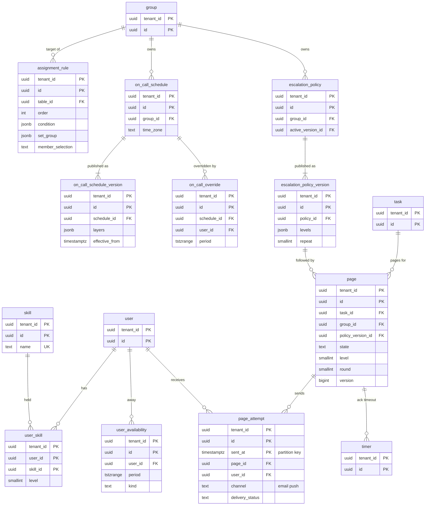

# Data model: 割り当てとオンコール

[data-model.md](../data-model.md) の一部。割り当ての規則、スキルと不在、当番表とバージョン・差し替え、エスカレーションの方針とバージョン、呼び出しと送信の記録を定義する。グループの所属の割り当ての列（`assignable`、`max_open`、`last_assigned_at`）は [identity-and-access.md](identity-and-access.md) の 3.2 節の `group_member` に持つ。振る舞い（DT-ASG-001・002、当番の関数、DT-PAGE-001）は [assignment-and-on-call.md](../assignment-and-on-call.md) を正とする。

## 1. ER 図

## 2. 割り当て

### 2.1 `assignment_rule`

割り当ての規則。保存の流れの 3 段で、テナントの保存の前のルールの後に評価する組み込みの種類のルール。定義元：[assignment-and-on-call.md](../assignment-and-on-call.md) の 3.1 節、[ADR-0026](../../decisions/0026-assignment-rules-and-member-selection.md)。

| 列 | 型 | NULL | 既定 | 説明 |
| --- | --- | --- | --- | --- |
| `tenant_id` | `uuid` | NOT NULL | — | |
| `id` | `uuid` | NOT NULL | `uuidv7()` | |
| `table_id` | `uuid` | NOT NULL | — | 子のクラスにも効く |
| `order` | `integer` | NOT NULL | `100` | |
| `condition` | `jsonb` | NULL | — | 式の木。きっかけのフィールドはコンパイルの時に求める |
| `set_group` | `jsonb` | NOT NULL | — | `{"group_id": ...}` か `{"expr": ...}`（例：`ci.support_group`） |
| `set_fields` | `jsonb` | NOT NULL | `'{}'` | 空のフィールドにだけ入れる既定値 |
| `member_selection` | `text` | NOT NULL | `'none'` | `none`・`round_robin`・`least_loaded`・`skills` |
| `required_skills` | `uuid[]` | NOT NULL | `'{}'` | → `skill` |
| `active` | `boolean` | NOT NULL | `true` | |
| メタデータの共通の列 | | | | |

- キー：PK `(tenant_id, id)`。UK `(tenant_id, stable_key)`。
- 索引：`(tenant_id, table_id, "order") WHERE active` — 評価の順。
- CHECK：`member_selection IN (...)`、`(member_selection = 'skills') = (cardinality(required_skills) > 0)`。テーブルごとに 500 までと、`least_loaded`・`skills` のグループのメンバー 200 人以下は保存の時にアプリで確かめる。
- 一致がないときの既定のグループは `tenant_setting.options.default_assignment_group`（テーブルの ID → グループの ID の対応）に持つ（[platform-metadata.md](platform-metadata.md) の 2.1 節）。
- 保持：メタデータ。S1 の量：1 テナント 数百行。

### 2.2 `skill`・`user_skill`

| 表 | 列 |
| --- | --- |
| `skill` | `tenant_id`、`id`、`name`、`active`（既定 真）、`created_at`、`updated_at` |
| `user_skill` | `tenant_id`、`user_id`、`skill_id`、`level`（`smallint` 1〜5）、`updated_at` |

- キー：`skill` PK `(tenant_id, id)`、UK `(tenant_id, name)`。`user_skill` PK `(tenant_id, user_id, skill_id)`、FK → `user`・`skill`、索引 `(tenant_id, skill_id, level)`（スキルの絞り込み）。
- CHECK：`level BETWEEN 1 AND 5`。
- 保持：テナント。S1 の量：スキル 数千、`user_skill` 数万行。

### 2.3 `user_availability`

不在の予定。定義元：同じ文書の 4.1 節。

| 列 | 型 | NULL | 既定 | 説明 |
| --- | --- | --- | --- | --- |
| `tenant_id` | `uuid` | NOT NULL | — | |
| `id` | `uuid` | NOT NULL | `uuidv7()` | |
| `user_id` | `uuid` | NOT NULL | — | |
| `period` | `tstzrange` | NOT NULL | — | 半開区間 `[s, e)` |
| `kind` | `text` | NOT NULL | `'out_of_office'` | |
| `created_at`・`created_by` | | | | |

- キー：PK `(tenant_id, id)`。FK `(tenant_id, user_id)` → `user`。
- 索引：`USING gist (tenant_id, user_id, period)`（`btree_gist`） — 時刻 `now` の不在の判定。
- CHECK：`lower_inc(period) AND NOT upper_inc(period)`。
- 保持：終わりの後 1 年。S1 の量：数十万行。

## 3. 当番表

### 3.1 `on_call_schedule`・`on_call_schedule_version`

当番表と、公開ごとに不変のバージョン。バージョンは `effective_from` から効く（過去に効かせない）。定義元：同じ文書の 5.1 節、[ADR-0027](../../decisions/0027-on-call-rotations-and-escalation.md)。

| 表 | 列 |
| --- | --- |
| `on_call_schedule` | `tenant_id`、`id`、`group_id`（→ `group`）、`name`、`time_zone`（IANA）、`active`、メタデータの共通の列 |
| `on_call_schedule_version` | `tenant_id`、`id`、`schedule_id`、`version_no`、`layers`（`jsonb`：`[{members, rotation, anchor, restriction}]`。上の層ほど優先）、`effective_from`（`timestamptz`）、`gap_warnings`（`jsonb`。公開の時の 90 日先までの空きの検査の結果）、`content_hash`、`published_at`、`published_by` |

- キー：`on_call_schedule` PK `(tenant_id, id)`、UK `(tenant_id, stable_key)`、索引 `(tenant_id, group_id)`。`on_call_schedule_version` PK `(tenant_id, id)`、UK `(tenant_id, schedule_id, version_no)`、索引 `(tenant_id, schedule_id, effective_from DESC)`（時刻 t に効くバージョン）。
- CHECK：`effective_from >= published_at - interval '5 minutes'`（過去の当番を変えない）。バージョンは `UPDATE` を与えない。
- 保持：バージョンを消さない（誰が当番だったかの記録）。S1 の量：当番表 数千、バージョン 年 数万行。

### 3.2 `on_call_override`

バージョンの外の一時の差し替え。定義元：同じ文書の 5.1 節。

| 列 | 型 | NULL | 既定 | 説明 |
| --- | --- | --- | --- | --- |
| `tenant_id` | `uuid` | NOT NULL | — | |
| `id` | `uuid` | NOT NULL | `uuidv7()` | |
| `schedule_id` | `uuid` | NOT NULL | — | |
| `user_id` | `uuid` | NOT NULL | — | 代わりの当番 |
| `period` | `tstzrange` | NOT NULL | — | `[s, e)` |
| `reason` | `text` | NULL | — | |
| `created_at`・`created_by` | | | | 重なるときは作成の新しいものが勝つ |

- キー：PK `(tenant_id, id)`。FK `(tenant_id, schedule_id)` → `on_call_schedule`、`user_id` → `user`。
- 索引：`USING gist (tenant_id, schedule_id, period)` — 当番の関数の入力（時刻 t を含む差し替え）。
- CHECK：`lower(period) >= created_at - interval '5 minutes'`（過去の区間の差し替えを作らない）。
- 保持：終わりの後 7 年（当番の記録）。S1 の量：年 数万行。

## 4. 呼び出し

### 4.1 `escalation_policy`・`escalation_policy_version`

エスカレーションの方針と不変のバージョン。2026-09-28 の統合で、`page.policy_version_id` の参照先としてバージョンの表に分けた。定義元：同じ文書の 6.1 節。

| 表 | 列 |
| --- | --- |
| `escalation_policy` | `tenant_id`、`id`、`group_id`、`name`、`active_version_id`（→ `escalation_policy_version`）、`active`、メタデータの共通の列 |
| `escalation_policy_version` | `tenant_id`、`id`、`policy_id`、`version_no`、`levels`（`jsonb`：`[{targets: [schedule(id) \| user(id) \| group_manager], ack_timeout_minutes}]`）、`repeat`（`smallint` 0〜3、既定 1）、`catch_all`（`jsonb`：`user(id)` か `group_manager`）、`channels`（`text[]`：`email`・`push`。`sms`・`voice` は後）、`content_hash`、`published_at`、`published_by` |

- キー：`escalation_policy` PK `(tenant_id, id)`、UK `(tenant_id, stable_key)`、索引 `(tenant_id, group_id) WHERE active`。`escalation_policy_version` PK `(tenant_id, id)`、UK `(tenant_id, policy_id, version_no)`。
- CHECK：`repeat BETWEEN 0 AND 3`、`channels <@ ARRAY['email','push','sms','voice']`。各段の `ack_timeout_minutes` 1〜120 は Zod で検証する。
- バージョンは `UPDATE` を与えない。保持：バージョンを消さない。S1 の量：数千行。

### 4.2 `page`

当番の呼び出し。`(task_id, group_id)` ごとに開いているものは 1 つ。定義元：同じ文書の 6.2・6.3 節。

| 列 | 型 | NULL | 既定 | 説明 |
| --- | --- | --- | --- | --- |
| `tenant_id` | `uuid` | NOT NULL | — | |
| `id` | `uuid` | NOT NULL | `uuidv7()` | |
| `task_id` | `uuid` | NOT NULL | — | |
| `group_id` | `uuid` | NOT NULL | — | |
| `policy_version_id` | `uuid` | NOT NULL | — | 開始の時に固定 |
| `trigger` | `text` | NOT NULL | — | `major_incident`・`rule`・`manual` |
| `state` | `text` | NOT NULL | `'notifying'` | `notifying`・`acknowledged`・`resolved`・`exhausted`・`cancelled` |
| `level`・`round` | `smallint` | NOT NULL | `0` | |
| `version` | `bigint` | NOT NULL | `1` | タイマーの `target_version` と比べる |
| `acked_by` | `uuid` | NULL | — | |
| `acked_at` | `timestamptz` | NULL | — | |
| `ack_channel` | `text` | NULL | — | `push`・`email_link`・`ui` |
| `gaps` | `jsonb` | NOT NULL | `'[]'` | 受け手が 0 人だった段の記録 |
| `created_at`・`created_by`・`ended_at` | | | | |

- キー：PK `(tenant_id, id)`。UK `(tenant_id, task_id, group_id) WHERE state = 'notifying'`。FK `(tenant_id, task_id)` → `task`、`group_id` → `group`、`policy_version_id` → `escalation_policy_version`、`acked_by` → `user`。
- 索引：`(tenant_id, task_id)` — タスクの画面の呼び出しの一覧、タスクの解決での `resolved`。
- CHECK：`(state = 'acknowledged') = (acked_at IS NOT NULL)`、`round <= 3`。
- 保持：監査と同じ 7 年。パーティションを持たない（部分一意索引のため）。保持を過ぎた行は保守のジョブが消す。S1 の量：年 数十万行。

### 4.3 `page_attempt`

呼び出しの送信の記録。冪等のキーは行の ID。定義元：同じ文書の 6.3・6.5 節。

| 列 | 型 | NULL | 既定 | 説明 |
| --- | --- | --- | --- | --- |
| `tenant_id` | `uuid` | NOT NULL | — | |
| `id` | `uuid` | NOT NULL | `uuidv7()` | |
| `sent_at` | `timestamptz` | NOT NULL | `now()` | パーティションのキー（月） |
| `page_id` | `uuid` | NOT NULL | — | |
| `level`・`round` | `smallint` | NOT NULL | — | |
| `user_id` | `uuid` | NOT NULL | — | |
| `channel` | `text` | NOT NULL | — | `email`・`push`（`sms`・`voice` は後） |
| `ack_token_hash` | `bytea` | NULL | — | メールのリンクの一度だけのトークン（60 分）。トークンだけでは受け付けない |
| `provider_message_id` | `text` | NULL | — | |
| `delivery_status` | `text` | NOT NULL | `'pending'` | `pending`・`sent`・`delivered`・`failed` |

- キー：PK `(tenant_id, id, sent_at)`。
- 索引：`(tenant_id, page_id, sent_at)` — 呼び出しの画面の時系列。`(tenant_id, ack_token_hash) WHERE ack_token_hash IS NOT NULL` — メールのリンクからの受け付けの画面。
- パーティション：`sent_at` の月。保持：監査と同じ 7 年（パーティションを外して消す）。S1 の量：年 数百万行。
