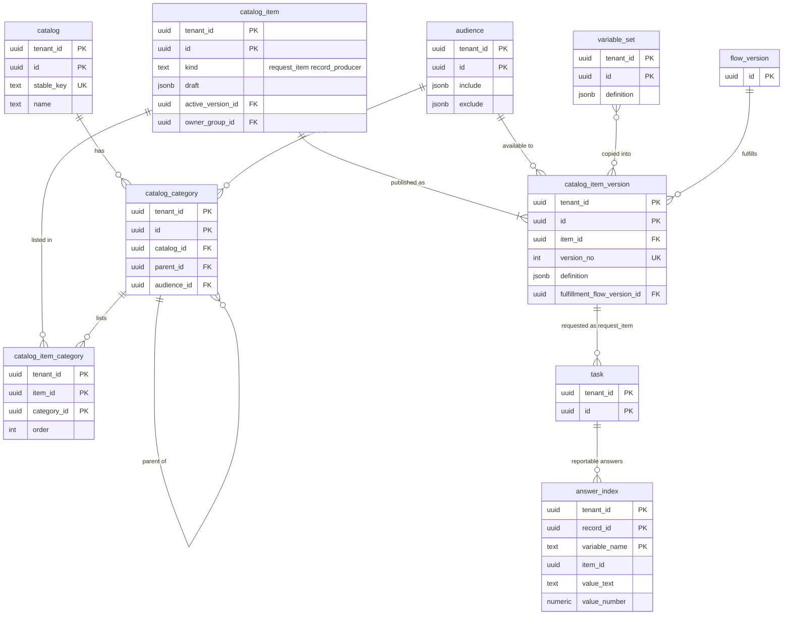

# Data model: サービスカタログと要求

[data-model.md](../data-model.md) の一部。カタログ・カテゴリ・品目と不変のバージョン・変数のまとまり・利用できる人（`audience`）・回答の索引を定義する。要求・要求の品目・実行のタスクは `task` のクラス（[records-and-audit.md](records-and-audit.md) の 2.2 節）。振る舞い（公開の検証 DT-CAT-001、回答の正規化 DT-VAR-001、申請の冪等、依頼者の ACL）は [service-catalog-and-requests.md](../service-catalog-and-requests.md) を正とする。

- **品目は公開で不変のバージョンになる。** 申請は申請の時点のバージョンを要求の品目に固定する（`task.item_version_id`）。変数のまとまりは、品目の公開の時に中身を品目のバージョンへ写す（参照しない）。
- `audience` は、ナレッジベースの読める人・書ける人にも使う（[knowledge.md](knowledge.md)）。

## 1. ER 図

## 2. カタログ

### 2.1 `catalog`・`catalog_category`

定義元：[service-catalog-and-requests.md](../service-catalog-and-requests.md) の 3.1 節。

| 表 | 列 |
| --- | --- |
| `catalog` | `tenant_id`、`id`、`name`、`active`、メタデータの共通の列 |
| `catalog_category` | `tenant_id`、`id`、`catalog_id`、`parent_id`（→ `catalog_category`。深さ 4 まで）、`name`、`order`、`audience_id`（→ `audience`）、`active`、メタデータの共通の列 |

- キー：どちらも PK `(tenant_id, id)`、UK `(tenant_id, stable_key)`。`catalog_category` は索引 `(tenant_id, catalog_id, parent_id, "order")`（ポータルのカテゴリの一覧）。
- 深さ 4 は保存の時にアプリで数える。
- 保持：メタデータ。S1 の量：1 テナント カテゴリ 数百行。

### 2.2 `catalog_item`

品目の同一性と編集中の定義。専用の表。定義元：同じ文書の 3.1・3.2 節。

| 列 | 型 | NULL | 既定 | 説明 |
| --- | --- | --- | --- | --- |
| `tenant_id` | `uuid` | NOT NULL | — | |
| `id` | `uuid` | NOT NULL | `uuidv7()` | |
| `kind` | `text` | NOT NULL | — | `request_item`・`record_producer` |
| `draft` | `jsonb` | NULL | — | 編集中の `ItemDefinition` |
| `active_version_id` | `uuid` | NULL | — | → `catalog_item_version` |
| `owner_group_id` | `uuid` | NULL | — | → `group`。実行の失敗の知らせ先 |
| `active` | `boolean` | NOT NULL | `true` | |
| メタデータの共通の列 | | | | |

- キー：PK `(tenant_id, id)`。UK `(tenant_id, stable_key)`。FK `(tenant_id, active_version_id)` → `catalog_item_version`、`owner_group_id` → `group`。
- 保持：メタデータ。S1 の量：1 テナント 数百〜数千行。

### 2.3 `catalog_item_version`

公開した不変のバージョン。`UPDATE` を与えない。定義元：同じ文書の 3.1〜3.4 節、[ADR-0028](../../decisions/0028-catalog-items-and-variables.md)。

| 列 | 型 | NULL | 既定 | 説明 |
| --- | --- | --- | --- | --- |
| `tenant_id` | `uuid` | NOT NULL | — | |
| `id` | `uuid` | NOT NULL | `uuidv7()` | |
| `item_id` | `uuid` | NOT NULL | — | |
| `version_no` | `integer` | NOT NULL | — | |
| `definition` | `jsonb` | NOT NULL | — | `ItemDefinition`（変数 150、UI の規則 100、選択肢 1,000 まで。変数のまとまりの中身を写したもの） |
| `audience_id` | `uuid` | NOT NULL | — | 定義から写す（見える品目の集合の計算の索引のため） |
| `allow_request_for_others` | `boolean` | NOT NULL | `false` | 定義から写す |
| `fulfillment_flow_version_id` | `uuid` | NULL | — | `request_item` のとき。公開の時に有効なバージョンに固定（→ `flow_version`） |
| `content_hash` | `bytea` | NOT NULL | — | |
| `published_at`・`published_by` | | | | |

- キー：PK `(tenant_id, id)`。UK `(tenant_id, item_id, version_no)`。FK `(tenant_id, item_id)` → `catalog_item`、`(tenant_id, audience_id)` → `audience`、`fulfillment_flow_version_id` → `flow_version(id)`（`check_shared_ref()`。組み込みの雛形は NULL の行）。
- 索引：`(tenant_id, audience_id)` — 主体ごとの見える品目の計算。
- 保持：バージョンを消さない（要求の品目が指すため）。S1 の量：1 テナント 年 数千行、1 バージョン 平均 30 KB。

### 2.4 `catalog_item_category`

品目とカテゴリの対応（`definition.category_ids` から公開の時に作り直す）。2026-09-28 の統合で最小の形で足した（ポータルのカテゴリごとの品目の一覧を索引で引くため）。

| 列 | 型 | NULL | 既定 | 説明 |
| --- | --- | --- | --- | --- |
| `tenant_id` | `uuid` | NOT NULL | — | |
| `item_id` | `uuid` | NOT NULL | — | |
| `category_id` | `uuid` | NOT NULL | — | |
| `order` | `integer` | NOT NULL | `0` | |

- キー：PK `(tenant_id, item_id, category_id)`。索引 `(tenant_id, category_id, "order")`。FK → `catalog_item`・`catalog_category`。
- 保持：品目に従う。S1 の量：1 テナント 数千行。

### 2.5 `variable_set`

複数の品目で使い回す変数のまとまり。バージョンは `rev`（メタデータの共通の列）で数える。直したら、使っている品目を公開し直す。

| 列 | 型 | NULL | 既定 | 説明 |
| --- | --- | --- | --- | --- |
| `tenant_id` | `uuid` | NOT NULL | — | |
| `id` | `uuid` | NOT NULL | `uuidv7()` | |
| `name` | `text` | NOT NULL | — | |
| `definition` | `jsonb` | NOT NULL | — | `{variables: [Variable], ui_rules: [UiRule]}` |
| メタデータの共通の列 | | | | |

- キー：PK `(tenant_id, id)`。UK `(tenant_id, stable_key)`。
- 保持：メタデータ。S1 の量：1 テナント 数十行。

### 2.6 `audience`

利用できる人・読める人の条件（除くほうが勝つ。`include` が空なら誰も使えない）。条件は主体の属性だけで評価できる式に限る。定義元：同じ文書の 6.1 節、[ADR-0030](../../decisions/0030-portal-requester-scope-and-record-producers.md)。

| 列 | 型 | NULL | 既定 | 説明 |
| --- | --- | --- | --- | --- |
| `tenant_id` | `uuid` | NOT NULL | — | |
| `id` | `uuid` | NOT NULL | `uuidv7()` | |
| `name` | `text` | NOT NULL | — | |
| `include`・`exclude` | `jsonb` | NOT NULL | `'[]'` | 条件の一覧（ロール、グループ、会社、部署、場所、利用者の属性の式） |
| メタデータの共通の列 | | | | |

- キー：PK `(tenant_id, id)`。UK `(tenant_id, stable_key)`。
- 主体ごとの見える品目・カテゴリ・`audience_id` の集合は Valkey にキャッシュする（キーに `acl_version` と `meta_version`。[stores.md](stores.md) の 1 節）。
- 保持：メタデータ。S1 の量：1 テナント 数十行。

## 3. `answer_index`

`reportable = true` の変数の回答の索引。要求の品目の保存と同じトランザクションで書く。定義元：同じ文書の 4.3 節。

| 列 | 型 | NULL | 既定 | 説明 |
| --- | --- | --- | --- | --- |
| `tenant_id` | `uuid` | NOT NULL | — | |
| `record_id` | `uuid` | NOT NULL | — | 要求の品目（→ `task`） |
| `variable_name` | `text` | NOT NULL | — | 品目の中で一意、公開の後に変えない |
| `item_id` | `uuid` | NOT NULL | — | |
| `value_text` | `text` | NULL | — | |
| `value_number` | `numeric` | NULL | — | |
| `value_time` | `timestamptz` | NULL | — | |
| `value_ref` | `uuid` | NULL | — | |

- キー：PK `(tenant_id, record_id, variable_name)`。FK `(tenant_id, record_id)` → `task`（`ON DELETE CASCADE`）。
- 索引：`(tenant_id, item_id, variable_name, value_text)`・`value_number`・`value_time`・`value_ref`（それぞれ部分索引） — レポートの絞り込みとグループ化。
- CHECK：`num_nonnulls(value_text, value_number, value_time, value_ref) = 1`。
- 保持：要求の品目に従う。S1 の量：年 数千万行。
