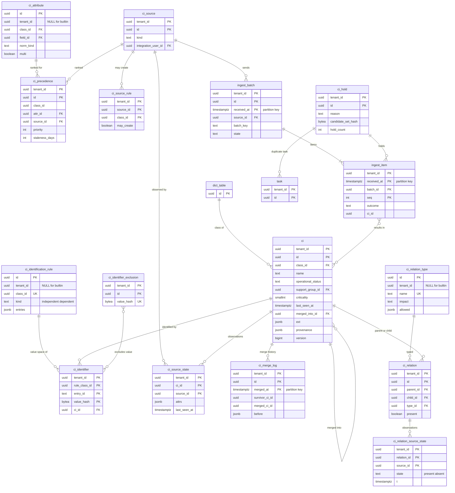

# Data model: CMDB（CI・識別・調整・関係）

[data-model.md](../data-model.md) の一部。CI の物理の表 `ci`、CI の属性と識別の規則（組み込みは NULL の行）、識別の値と除外、取り込み元・データ源の規則・優先度、取り込み元ごとの観測の状態、取り込みのまとまりと項目、保留・統合の記録、関係の型・関係・関係の観測の状態を定義する。振る舞い（1 つの入口、識別の手順 DT-CMDB-001、調整の `merge` と `choose`、関係の検査、影響の走査）は [cmdb-and-reconciliation.md](../cmdb-and-reconciliation.md) を正とする。

- **CI の作成・更新は識別と調整の 1 つの入口だけが行う**（[ADR-0005](../../decisions/0005-cmdb-identification-and-reconciliation.md)、[ADR-0037](../../decisions/0037-ci-ingest-entry-point-and-ambiguity-hold.md)）。取り込みの変換（`import_run`）も CI の表を直接書かない。
- **重複の防止の要は `ci_identifier` の一意の制約**である。並行の取り込みの片方は一意の違反で巻き戻り、識別からやり直す。
- `ci_attribute`・`ci_identification_rule`・`ci_relation_type` は NULL の行（組み込み）を持つ。主キーは `id` だけ（[data-model.md](../data-model.md) の 3.3 節）。

## 1. ER 図

`ci_invalid_value`・`ci_class_policy` は図を省く（テナントの小さな設定の表）。

## 2. `ci`

CI の全クラス（`hardware` の子、`virtual_machine`、`cloud_resource`、`software_instance`、`business_application`、`service` の子、`ci_group`、テナントの子）を 1 つの表に置く。クラスに固有の属性は組み込みも `ext`（[ADR-0003](../../decisions/0003-table-hierarchy-and-extensible-schema.md) の例外）。定義元：[cmdb-and-reconciliation.md](../cmdb-and-reconciliation.md) の 3・5.6・6.3・6.4 節。

| 列 | 型 | NULL | 既定 | 説明 |
| --- | --- | --- | --- | --- |
| `tenant_id` | `uuid` | NOT NULL | — | |
| `id` | `uuid` | NOT NULL | `uuidv7()` | |
| `class_id` | `uuid` | NOT NULL | — | 作成の後に変えない（付け替えは持ち越し） |
| `name` | `text` | NOT NULL | — | NFC |
| `operational_status` | `text` | NOT NULL | `'operational'` | `operational`・`non_operational`・`repair`・`retired`・`stale_candidate` |
| `owner_group_id`・`support_group_id` | `uuid` | NULL | — | → `group` |
| `location_id` | `uuid` | NULL | — | → `location` |
| `environment` | `text` | NULL | — | `production`・`staging`・`development`・`test` |
| `criticality` | `smallint` | NULL | — | 1〜4 |
| `first_seen_at`・`last_seen_at` | `timestamptz` | NULL | — | `last_seen_at = max(ci_source_state.last_seen_at)` |
| `merged_into_id` | `uuid` | NULL | — | 統合の先（→ `ci`） |
| `ext` | `jsonb` | NOT NULL | `'{}'` | `serial_number`・`mac_addresses`（配列）・`fqdn`・`membership_condition`（`ci_group`）など。キーはフィールドの ID |
| `provenance` | `jsonb` | NOT NULL | `'{}'` | 属性ごとの選ばれた取り込み元と時刻 `{attr_id: {source_id, t}}` |
| レコードの共通の列 | | | | |

- キー：PK `(tenant_id, id)`。FK `(tenant_id, owner_group_id)`・`support_group_id` → `group`、`location_id` → `location`、`merged_into_id` → `ci`。`class_id` → `dict_table(id)`（`check_shared_ref()`）。
- 索引：

| 索引 | 支える問い合わせ |
| --- | --- |
| `(tenant_id, class_id, operational_status)` | クラスごとの一覧、影響の走査の結果の絞り込み |
| `(tenant_id, lower(name))` | 参照の候補、`name` の識別（サービスなど） |
| `(tenant_id, support_group_id) WHERE operational_status <> 'retired'` | 割り当ての規則の式、変更の承認者 |
| `(tenant_id, last_seen_at) WHERE operational_status = 'operational'` | 廃止の候補の日次のジョブ |
| `(tenant_id, merged_into_id) WHERE merged_into_id IS NOT NULL` | 統合の鎖のたどり（5 段まで） |

- 絞り込みに使う `ext` の属性（`serial_number`・`fqdn`・`host_name` など）は組み込みで `ext_index` に写す（[records-and-audit.md](records-and-audit.md) の 4 節）。
- CHECK：`criticality BETWEEN 1 AND 4`、`merged_into_id IS NULL OR operational_status = 'retired'`、`merged_into_id <> id`。
- パーティション：S1 では分けない（[ADR-0007](../../decisions/0007-physical-layout-and-extension-index.md)）。
- 保持：テナント（入口からは削除しない。廃止は `retired`）。S1 の量：5,000 万行（最大のテナント 500 万）、1 行 平均 1.5 KB で 約 75 GB。

## 3. 属性と識別の規則

### 3.1 `ci_attribute`

CI の属性の定義（辞書のフィールドに、CMDB の正規化の種類と `multi` の印を足す）。定義元：同じ文書の 3.2・4.2 節、[data-dictionary-and-tables.md](../data-dictionary-and-tables.md) の 3.3 節。

| 列 | 型 | NULL | 既定 | 説明 |
| --- | --- | --- | --- | --- |
| `id` | `uuid` | NOT NULL | `uuidv7()` | |
| `tenant_id` | `uuid` | NULL | — | |
| `class_id` | `uuid` | NOT NULL | — | 属性を持つクラス |
| `field_id` | `uuid` | NOT NULL | — | → `dict_field`（値の型はこのフィールドの型） |
| `name` | `text` | NOT NULL | — | ペイロードの `attributes` のキー |
| `norm_kind` | `text` | NOT NULL | `'generic'` | `serial`・`mac`・`bios_uuid`・`fqdn`・`name`・`cloud_resource_id`・`generic` |
| `multi` | `boolean` | NOT NULL | `false` | 配列を持てる（CMDB の入口だけの例外） |
| `retire_signal` | `boolean` | NOT NULL | `false` | 取り込み元の明示の「廃止」の属性 |
| メタデータの共通の列 | | | | |

- キー：PK `(id)`。UK `NULLS NOT DISTINCT (tenant_id, class_id, name)`。FK `class_id` → `dict_table(id)`、`field_id` → `dict_field(id)`（`check_shared_ref()`）。
- CHECK：`tenant_id IS NULL OR name LIKE 'c\_%'`。
- 保持：メタデータ。S1 の量：組み込み 約 200 行。

### 3.2 `ci_identification_rule`

クラスごとの識別の規則。子は最も近い祖先の規則を使う。テナントの同じクラスの規則は組み込みの行に勝つ。定義元：同じ文書の 4.1 節、[ADR-0036](../../decisions/0036-ci-classes-and-identification-rules.md)。

| 列 | 型 | NULL | 既定 | 説明 |
| --- | --- | --- | --- | --- |
| `id` | `uuid` | NOT NULL | `uuidv7()` | |
| `tenant_id` | `uuid` | NULL | — | |
| `class_id` | `uuid` | NOT NULL | — | 規則を持つクラス（`ci_identifier.rule_class_id` の値） |
| `kind` | `text` | NOT NULL | — | `independent`・`dependent` |
| `depends_on` | `jsonb` | NULL | — | `{relation_type_id, parent_class_id}` |
| `entries` | `jsonb` | NOT NULL | — | `[{id, priority, attributes: [attr_id], allow_partial: false}]`。`native`（取り込み元の固有のキー）は暗黙の最優先の項目 |
| メタデータの共通の列 | | | | |

- キー：PK `(id)`。UK `NULLS NOT DISTINCT (tenant_id, class_id)`。
- CHECK：`(kind = 'dependent') = (depends_on IS NOT NULL)`。項目の ID に `native` を使わない（予約）。
- 規則の項目を消すと、その項目の識別の値が使われなくなる。規則の変更は既存の `ci_identifier` を書き換えない（新しい取り込みから効く）。
- 保持：メタデータ。S1 の量：組み込み 約 10 行。

### 3.3 `ci_identifier`

識別の値。**一意の制約が重複の防止の要**。定義元：同じ文書の 4.3・5.4 節。

| 列 | 型 | NULL | 既定 | 説明 |
| --- | --- | --- | --- | --- |
| `tenant_id` | `uuid` | NOT NULL | — | |
| `rule_class_id` | `uuid` | NOT NULL | — | 識別に使った規則の持ち主のクラス |
| `entry_id` | `text` | NOT NULL | — | 規則の項目の ID、または `native` |
| `value_hash` | `bytea` | NOT NULL | — | `sha256(entry_id, 正規化した値の組の正準の JSON)`。依存の CI は親の CI の ID を含める。`native` は `sha256(source_id, native_key)` |
| `ci_id` | `uuid` | NOT NULL | — | |
| `source_id` | `uuid` | NULL | — | 最初に登録した取り込み元 |
| `created_at` | `timestamptz` | NOT NULL | `now()` | |

- キー：PK `(tenant_id, rule_class_id, entry_id, value_hash)`。FK `(tenant_id, ci_id)` → `ci`。
- 索引：`(tenant_id, ci_id)` — 統合の付け替え、CI の画面の識別の値。
- 値そのもの（シリアル番号など）はハッシュだけで持つ。表示は `ci.ext` から。
- 保持：CI に従う（統合で付け替える）。S1 の量：約 2.5 億行（CI 1 つに平均 5）。

### 3.4 `ci_identifier_exclusion`・`ci_invalid_value`

「別の機器である」と人が決めた識別の値の除外と、識別に使わない無効の値のテナントの追加（組み込みの一覧はコードの版）。`ci_invalid_value` は 2026-09-28 の統合で最小の形で定義した（同じ文書の 4.2 節の「組み込みの一覧 ＋ テナントの追加」）。

| 表 | 列 |
| --- | --- |
| `ci_identifier_exclusion` | `tenant_id`、`id`、`rule_class_id`、`entry_id`、`value_hash`、`hold_id`（→ `ci_hold`）、`reason`、`created_at`、`created_by` |
| `ci_invalid_value` | `tenant_id`、`norm_kind`（`serial`・`mac` など）、`value`（正規化の後の値）、`created_at`、`created_by` |

- キー：`ci_identifier_exclusion` PK `(tenant_id, id)`、UK `(tenant_id, rule_class_id, entry_id, value_hash)`。`ci_invalid_value` PK `(tenant_id, norm_kind, value)`。
- 識別の手順は、除外と無効の値に当たる識別の値を「使える項目」から外す。
- 保持：テナント。S1 の量：どちらも数千行。

### 3.5 `ci_class_policy`

クラスごとの廃止の候補の日数。2026-09-28 の統合で最小の形で定義した（同じ文書の 6.4 節の `retire_after_days`）。行がなければ既定の 90 日（コードの版）。

| 列 | 型 | NULL | 既定 | 説明 |
| --- | --- | --- | --- | --- |
| `tenant_id` | `uuid` | NOT NULL | — | |
| `class_id` | `uuid` | NOT NULL | — | 子のクラスは最も近い祖先の行 |
| `retire_after_days` | `integer` | NOT NULL | `90` | |
| メタデータの共通の列 | | | | |

- キー：PK `(tenant_id, class_id)`。CHECK：`retire_after_days BETWEEN 7 AND 3650`。
- 保持：メタデータ。S1 の量：数百行。

## 4. 取り込み元と調整

### 4.1 `ci_source`・`ci_source_rule`

取り込み元とデータ源の規則（DT-CMDB-003）。組み込みの取り込み元（`manual`・`system_group`）はテナントの作成の時にテナントの行として作る。規則の既定はコードの版。定義元：同じ文書の 5.1 節。

| 表 | 列 |
| --- | --- |
| `ci_source` | `tenant_id`、`id`、`name`、`kind`（`manual`・`csv`・`api`・`asset_mgmt`・`discovery`・`cloud_api`・`system_group`）、`integration_user_id`（→ `user`。`kind = integration`）、`active`、メタデータの共通の列 |
| `ci_source_rule` | `tenant_id`、`source_id`、`class_id`、`may_create`、`may_update`、`may_create_relations`（どれも `boolean`）、メタデータの共通の列 |

- キー：`ci_source` PK `(tenant_id, id)`、UK `(tenant_id, name)`。`ci_source_rule` PK `(tenant_id, source_id, class_id)`、FK `(tenant_id, source_id)` → `ci_source`。規則は最も近い祖先で探す。
- 保持：メタデータ。S1 の量：1 テナント 取り込み元 数十、規則 数百行。

### 4.2 `ci_precedence`

属性 × 取り込み元の優先度と鮮度（子のクラスの規則が親に勝つ）。既定（`asset_mgmt` 10、`manual` 20、`cloud_api` 20、`api` 30、`csv` 40、鮮度 30 日）はコードの版。定義元：同じ文書の 6.2 節。

| 列 | 型 | NULL | 既定 | 説明 |
| --- | --- | --- | --- | --- |
| `tenant_id` | `uuid` | NOT NULL | — | |
| `id` | `uuid` | NOT NULL | `uuidv7()` | |
| `class_id` | `uuid` | NOT NULL | — | |
| `attr_id` | `uuid` | NULL | — | NULL はそのクラスのすべての属性（`*`）（→ `ci_attribute`） |
| `source_id` | `uuid` | NOT NULL | — | |
| `priority` | `integer` | NOT NULL | — | 小さいほど強い |
| `staleness_days` | `integer` | NOT NULL | `30` | その属性の最新の観測の時刻から測る |
| `may_write` | `boolean` | NOT NULL | `true` | |
| メタデータの共通の列 | | | | |

- キー：PK `(tenant_id, id)`。UK `NULLS NOT DISTINCT (tenant_id, class_id, attr_id, source_id)`。FK `attr_id` → `ci_attribute(id)`（`check_shared_ref()`）、`(tenant_id, source_id)` → `ci_source`。
- CHECK：`priority BETWEEN 0 AND 1000`、`staleness_days BETWEEN 1 AND 3650`。
- 保持：メタデータ。S1 の量：1 テナント 数百行。

### 4.3 `ci_source_state`

1 つの CI の 1 つの取り込み元の、属性ごとの最新の観測。更新は属性ごとの max の結合（交換・結合・冪等）。定義元：同じ文書の 6.1 節、[ADR-0038](../../decisions/0038-attribute-reconciliation-per-source-state.md)。

| 列 | 型 | NULL | 既定 | 説明 |
| --- | --- | --- | --- | --- |
| `tenant_id` | `uuid` | NOT NULL | — | |
| `ci_id` | `uuid` | NOT NULL | — | |
| `source_id` | `uuid` | NOT NULL | — | |
| `attrs` | `jsonb` | NOT NULL | `'{}'` | `{attr_id: {v: 正準の値, t: observed_at}}`。明示の「空」は `v = null` |
| `last_seen_at` | `timestamptz` | NOT NULL | — | この取り込み元がこの CI を見た最新の `observed_at`（`may_update` が偽でも進める） |

- キー：PK `(tenant_id, ci_id, source_id)`。FK `(tenant_id, ci_id)` → `ci`、`(tenant_id, source_id)` → `ci_source`。
- 更新は `ci` の行を `FOR UPDATE` した同じトランザクションで行う（属性ごとの行を持たない。NFR-005 の書き込みの量のため）。
- 保持：CI に従う（統合では `s` に結合する）。S1 の量：約 7,500 万行。

### 4.4 `ingest_batch`・`ingest_item`

取り込みのまとまりと、項目ごとの結果。`(tenant_id, source_id, batch_key)` は 7 日の中で一意（同じキーの送り直しは前の結果を返す）。定義元：同じ文書の 5.2・5.4 節、[api-and-integrations.md](../api-and-integrations.md) の 5.5 節。

`ingest_batch`：

| 列 | 型 | NULL | 既定 | 説明 |
| --- | --- | --- | --- | --- |
| `tenant_id` | `uuid` | NOT NULL | — | |
| `id` | `uuid` | NOT NULL | `uuidv7()` | |
| `received_at` | `timestamptz` | NOT NULL | `now()` | パーティションのキー（日） |
| `source_id` | `uuid` | NOT NULL | — | |
| `batch_key` | `text` | NOT NULL | — | 取り込み元が付ける冪等のキー |
| `import_run_id` | `uuid` | NULL | — | CSV の取り込みの変換から来たとき |
| `item_count`・`relation_count` | `integer` | NOT NULL | — | 項目 1,000・関係 5,000 まで |
| `state` | `text` | NOT NULL | `'accepted'` | `accepted`・`processing`・`completed`・`failed` |
| `summary` | `jsonb` | NULL | — | 結果の件数（新規・一致・保留・エラー） |
| `payload_s3_key` | `text` | NOT NULL | — | ペイロードの原本（[stores.md](stores.md) の 2 節） |
| `completed_at` | `timestamptz` | NULL | — | |

- キー：PK `(tenant_id, id, received_at)`。索引 `(tenant_id, source_id, batch_key, received_at)` — 受け付けのとき、`pg_advisory_xact_lock(hash(tenant_id, source_id, batch_key))` の下で 7 日の中の同じキーを探す（パーティションをまたぐ一意を索引で張れないため）。
- CHECK：`item_count <= 1000`、`relation_count <= 5000`。

`ingest_item`：

| 列 | 型 | NULL | 既定 | 説明 |
| --- | --- | --- | --- | --- |
| `tenant_id` | `uuid` | NOT NULL | — | |
| `received_at` | `timestamptz` | NOT NULL | — | まとまりの値の写し（パーティションのキー） |
| `batch_id` | `uuid` | NOT NULL | — | |
| `seq` | `integer` | NOT NULL | — | ペイロードの中の順 |
| `ref` | `text` | NULL | — | |
| `class_id` | `uuid` | NULL | — | |
| `native_key` | `text` | NULL | — | |
| `observed_at` | `timestamptz` | NULL | — | |
| `outcome` | `text` | NOT NULL | — | `created`・`matched`・`seen_only`（`may_update` が偽）・`held`・`error` |
| `ci_id` | `uuid` | NULL | — | |
| `hold_id` | `uuid` | NULL | — | |
| `error_code` | `text` | NULL | — | `no_identifier`・`parent_unresolved`・`create_not_allowed`・`observed_at_in_future`・`contention`・`relation_not_allowed` など |
| `warnings` | `text[]` | NOT NULL | `'{}'` | `class_mismatch` など |
| `processed_at` | `timestamptz` | NOT NULL | `now()` | |

- キー：PK `(tenant_id, received_at, batch_id, seq)`。項目は 1 つのトランザクションで CI・識別の値・観測の状態と一緒に書く。
- 索引：`(tenant_id, ci_id, processed_at)` — CI の画面の「最近の取り込み」。
- パーティション：両方とも `received_at` の日。保持：30 日（`DROP`）。S1 の量：`ingest_item` 1 日 約 250 万行（夜間の差分）。

## 5. 保留と統合

### 5.1 `ci_hold`

あいまいな一致（`ambiguous`）とクラスの食い違い（`class_conflict`）の保留。同じ候補の集合の保留は 1 つにまとめる。定義元：同じ文書の 5.5 節。

| 列 | 型 | NULL | 既定 | 説明 |
| --- | --- | --- | --- | --- |
| `tenant_id` | `uuid` | NOT NULL | — | |
| `id` | `uuid` | NOT NULL | `uuidv7()` | |
| `reason` | `text` | NOT NULL | — | `ambiguous`・`class_conflict` |
| `candidate_set_hash` | `bytea` | NOT NULL | — | 候補の CI の ID を並べた集合のハッシュ |
| `candidate_ci_ids` | `uuid[]` | NOT NULL | — | |
| `task_id` | `uuid` | NULL | — | `ci_duplicate_task`（→ `task`） |
| `state` | `text` | NOT NULL | `'open'` | `open`・`resolved` |
| `resolution` | `text` | NULL | — | `merged`・`distinct`・`source_error` |
| `first_held_at`・`last_held_at` | `timestamptz` | NOT NULL | — | |
| `hold_count` | `integer` | NOT NULL | `1` | |
| `sample_items` | `jsonb` | NOT NULL | — | 最新の 5 件のペイロードの項目の写し（PII を含みうる） |
| `resolved_by`・`resolved_at` | | NULL | — | |
| `version` | `bigint` | NOT NULL | `1` | |

- キー：PK `(tenant_id, id)`。UK `(tenant_id, reason, candidate_set_hash) WHERE state = 'open'`。FK `(tenant_id, task_id)` → `task`。
- CHECK：`cardinality(candidate_ci_ids) >= 1`、`(state = 'resolved') = (resolution IS NOT NULL)`。
- 保持：テナント（閉じた保留は 1 年で消す）。S1 の量：開いている保留 数万行。

### 5.2 `ci_merge_log`

統合の前の状態（統合を戻す操作は MVP に持たず、人が手で直す材料）。定義元：同じ文書の 5.6 節。

| 列 | 型 | NULL | 既定 | 説明 |
| --- | --- | --- | --- | --- |
| `tenant_id` | `uuid` | NOT NULL | — | |
| `id` | `uuid` | NOT NULL | `uuidv7()` | |
| `merged_at` | `timestamptz` | NOT NULL | `now()` | パーティションのキー（月） |
| `survivor_ci_id` | `uuid` | NOT NULL | — | 統合の先 `s` |
| `merged_ci_id` | `uuid` | NOT NULL | — | 統合される側 `d` |
| `hold_id` | `uuid` | NULL | — | |
| `reason` | `text` | NOT NULL | — | 必須 |
| `actor_id` | `uuid` | NOT NULL | — | `cmdb_admin` |
| `before` | `jsonb` | NOT NULL | — | `s` と `d` の `ci` の行、識別の値、観測の状態、関係の統合の前の写し |

- キー：PK `(tenant_id, id, merged_at)`。索引 `(tenant_id, merged_ci_id)`・`(tenant_id, survivor_ci_id)`。
- 追記だけ。パーティション：`merged_at` の月。保持：監査と同じ 7 年（パーティションを外して消す）。S1 の量：年 数万行。

## 6. 関係

### 6.1 `ci_relation_type`

関係の型。組み込み（`depends_on`・`runs_on`・`hosted_on`・`contains`・`connected_to`・`member_of`）は NULL の行。テナントは型を足せる。定義元：同じ文書の 7.1 節。

| 列 | 型 | NULL | 既定 | 説明 |
| --- | --- | --- | --- | --- |
| `id` | `uuid` | NOT NULL | `uuidv7()` | |
| `tenant_id` | `uuid` | NULL | — | |
| `name` | `text` | NOT NULL | — | |
| `parent_label`・`child_label` | `text` | NOT NULL | — | |
| `impact` | `text` | NOT NULL | — | `child_to_parent`・`parent_to_child`・`none` |
| `allowed` | `jsonb` | NOT NULL | `'[]'` | `[[親のクラスの ID, 子のクラスの ID]]`（祖先で合えばよい） |
| メタデータの共通の列 | | | | |

- キー：PK `(id)`。UK `NULLS NOT DISTINCT (tenant_id, name)`。
- CHECK：`tenant_id IS NULL OR name LIKE 'c\_%'`、`impact IN (...)`。
- 保持：メタデータ。S1 の量：組み込み 6 行。

### 6.2 `ci_relation`

関係。有無（`present`）は取り込み元ごとの最新の状態から決め、行は消さない。定義元：同じ文書の 7.2 節、[ADR-0039](../../decisions/0039-ci-relations-impact-traversal-and-service-model.md)。

| 列 | 型 | NULL | 既定 | 説明 |
| --- | --- | --- | --- | --- |
| `tenant_id` | `uuid` | NOT NULL | — | |
| `id` | `uuid` | NOT NULL | `uuidv7()` | |
| `parent_id`・`child_id` | `uuid` | NOT NULL | — | → `ci` |
| `type_id` | `uuid` | NOT NULL | — | → `ci_relation_type` |
| `present` | `boolean` | NOT NULL | — | どれかの取り込み元の最新の状態が `present` なら真 |
| `first_seen_at` | `timestamptz` | NOT NULL | — | |
| `last_changed_at` | `timestamptz` | NOT NULL | — | |
| `version` | `bigint` | NOT NULL | `1` | |

- キー：PK `(tenant_id, id)`。UK `(tenant_id, parent_id, child_id, type_id)`。FK `(tenant_id, parent_id)`・`child_id` → `ci`、`type_id` → `ci_relation_type(id)`（`check_shared_ref()`）。
- 索引：`(tenant_id, child_id, type_id) WHERE present`・`(tenant_id, parent_id, type_id) WHERE present` — 影響の走査（再帰の問い合わせの結合）、関連の一覧。
- CHECK：`parent_id <> child_id`（循環は禁止しない）。1 つの CI の関係 10,000 まで、テナントの関係は CI の数の 10 倍までは入口で数える。
- 保持：CI に従う。S1 の量：約 1.5 億行（最大のテナント 5,000 万まで）。

### 6.3 `ci_relation_source_state`

関係の取り込み元ごとの最新の状態（`t` の大きいほう。同じなら `present`）。定義元：同じ文書の 7.2 節。

| 列 | 型 | NULL | 既定 | 説明 |
| --- | --- | --- | --- | --- |
| `tenant_id` | `uuid` | NOT NULL | — | |
| `relation_id` | `uuid` | NOT NULL | — | |
| `source_id` | `uuid` | NOT NULL | — | |
| `state` | `text` | NOT NULL | — | `present`・`absent` |
| `t` | `timestamptz` | NOT NULL | — | 観測の時刻（`relation_snapshot` の `absent` は項目の `observed_at`） |

- キー：PK `(tenant_id, relation_id, source_id)`。FK `(tenant_id, relation_id)` → `ci_relation`、`source_id` → `ci_source`。
- 保持：関係に従う。S1 の量：約 2 億行。
