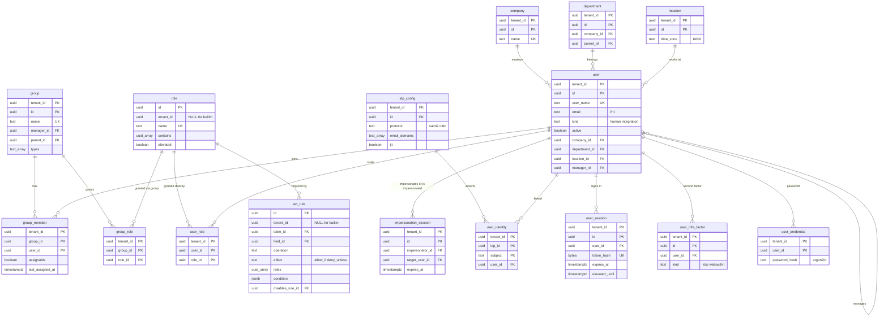

# Data model: 主体とアクセス制御

[data-model.md](../data-model.md) の一部。利用者・組織（会社・部署・場所）・グループ・ロール、ACL の規則、成り代わり、テナントの SSO、パスワード・MFA・セッションの表を定義する。振る舞い（主体の解決、評価の順序、出口ごとの規則、成り代わりの制限、SSO の対応付け）は [access-control.md](../access-control.md) を正とする。秘密の扱いは [security.md](../security.md) の 5・7 節。

- 利用者はテナントの中に持つ。同じ人が本番と開発のテナントに居れば、別の行になる（[access-control.md](../access-control.md) の 3.1 節）。テナントの外のアカウントの表は持たない。
- **ドメインの分離（1 つのテナントの中で会社ごとにデータを分ける仕組み）は持たない。** 子会社ごとに分けたいときは別のテナントにするか、`company` と ACL の条件（`me.company`）で絞る（[ADR-0002](../../decisions/0002-tenancy-and-isolation.md)）。
- `acl_version` を上げる変更（ロール・所属・利用者の属性・ACL）は、同じトランザクションで `tenant_meta.acl_version` を 1 上げる（[platform-metadata.md](platform-metadata.md) の 2.2 節）。

## 1. ER 図

`tenant_auth_policy`・`domain_verification`・`saml_assertion_seen` は図を省く（テナントに 1 行、またはほかの表を参照しない）。

## 2. 利用者と組織

### 2.1 `user`

利用者（人と連携の主体）。専用の表で、型付きの列 ＋ `ext`（テナントのフィールド）。予約語なので SQL では `"user"` と書く（[data-model.md](../data-model.md) の 3.8 節）。定義元：[access-control.md](../access-control.md) の 3.1 節、[assignment-and-on-call.md](../assignment-and-on-call.md) の 3.3・6.5 節、[security.md](../security.md) の 9.2 節。

| 列 | 型 | NULL | 既定 | 説明 |
| --- | --- | --- | --- | --- |
| `tenant_id` | `uuid` | NOT NULL | — | |
| `id` | `uuid` | NOT NULL | `uuidv7()` | |
| `user_name` | `text` | NOT NULL | — | テナントの中で一意、変えられる |
| `email` | `text` | NULL | — | PII。小文字で保存する（メールの差出人の照合は完全一致） |
| `name` | `text` | NOT NULL | — | PII |
| `kind` | `text` | NOT NULL | `'human'` | `human`・`integration`（連携のクライアント、`email_intake`） |
| `active` | `boolean` | NOT NULL | `true` | 偽ならすべての判定で拒否 |
| `locked_out` | `boolean` | NOT NULL | `false` | |
| `company_id`・`department_id`・`location_id` | `uuid` | NULL | — | → `company`・`department`・`location` |
| `manager_id` | `uuid` | NULL | — | → `user` |
| `default_group_id` | `uuid` | NULL | — | → `group`。担当者を入れてグループが空のときに使う |
| `time_zone` | `text` | NULL | — | IANA。NULL はテナントの既定 |
| `language` | `text` | NULL | — | `ja`・`en`。NULL はテナントの既定 |
| `mobile_phone` | `text` | NULL | — | PII。MVP では持つだけ（SMS・音声の呼び出しは後） |
| `source` | `text` | NOT NULL | `'manual'` | `manual`・`hr_import`・`sso_jit`・`system` |
| `break_glass` | `boolean` | NOT NULL | `false` | 非常用の管理者（テナントに 2 人まで） |
| `pseudonymized_at` | `timestamptz` | NULL | — | 個人の削除の請求で仮名化した時刻（[security.md](../security.md) の 9.2 節） |
| `ext` | `jsonb` | NOT NULL | `'{}'` | |
| レコードの共通の列 | | | | |

- キー：PK `(tenant_id, id)`。UK `(tenant_id, lower(user_name))`。FK `(tenant_id, company_id)` → `company`、`department_id` → `department`、`location_id` → `location`、`manager_id` → `user`、`default_group_id` → `group`。
- 索引：`(tenant_id, lower(email)) WHERE active` — メールの差出人の照合（同じアドレスが 2 人なら照合しない）、SSO の対応付け。`(tenant_id, manager_id)` — 上長の 3 段のたどり（他人のための申請）、`escalate` の承認。`(tenant_id, department_id)`・`(tenant_id, company_id)` — `audience` とレポート。
- CHECK：`kind IN ('human','integration')`、`NOT break_glass OR kind = 'human'`、`language IN ('ja','en')`。`break_glass` の人数（2 人まで）は保存の時にアプリで数える。
- 保持：テナント。削除の請求では行を消さず仮名化する（参照を残す）。S1 の量：約 100 万行（1 行 1 KB）。

### 2.2 `company`・`department`・`location`

利用者の組織の属性の参照先（人事のシステムから取り込む）。2026-09-28 の統合で最小の形で定義した（[access-control.md](../access-control.md) の 3.1 節の `company_id`・`department_id`・`location_id` の参照先）。どれも専用の表で、`ext` を持つ。

| 表 | 列 |
| --- | --- |
| `company` | `tenant_id`、`id`、`name`（NOT NULL）、`code`（NULL。人事のコード）、`active`（既定 真）、`ext`、レコードの共通の列 |
| `department` | `tenant_id`、`id`、`company_id`（NULL → `company`）、`parent_id`（NULL → `department`）、`name`、`code`、`head_id`（NULL → `user`）、`active`、`ext`、レコードの共通の列 |
| `location` | `tenant_id`、`id`、`name`、`parent_id`（NULL → `location`）、`time_zone`（NULL。SLA の `tz_source = ci_location・task_location・requester_location` で使う）、`country`（ISO 3166-1 alpha-2）、`address`（NULL）、`active`、`ext`、レコードの共通の列 |

- キー：どれも PK `(tenant_id, id)`。UK `(tenant_id, code) WHERE code IS NOT NULL`（人事の取り込みの一致のキー）。`company` は UK `(tenant_id, name)`。
- 索引：`department (tenant_id, parent_id)`、`location (tenant_id, parent_id)`。
- 保持：テナント。S1 の量：会社 数百、部署 数万、場所 数万行。

## 3. グループとロール

### 3.1 `group`

担当・承認のグループ。予約語なので SQL では `"group"`。定義元：[access-control.md](../access-control.md) の 3.2 節。

| 列 | 型 | NULL | 既定 | 説明 |
| --- | --- | --- | --- | --- |
| `tenant_id` | `uuid` | NOT NULL | — | |
| `id` | `uuid` | NOT NULL | `uuidv7()` | |
| `name` | `text` | NOT NULL | — | 一意。パッケージの `stable_key` の解決にも使う |
| `manager_id` | `uuid` | NULL | — | → `user` |
| `parent_id` | `uuid` | NULL | — | → `group`。レポートと割り当ての規則の階層だけ（ロールを継承しない） |
| `types` | `text[]` | NOT NULL | `'{assignment}'` | `assignment`・`approval`・`other` の組 |
| `email` | `text` | NULL | — | グループの宛先 |
| `active` | `boolean` | NOT NULL | `true` | 無効にすると `acl_version` を上げる |
| `ext` | `jsonb` | NOT NULL | `'{}'` | |
| レコードの共通の列 | | | | |

- キー：PK `(tenant_id, id)`。UK `(tenant_id, name)`。FK `(tenant_id, manager_id)` → `user`、`(tenant_id, parent_id)` → `group`。
- CHECK：`types <@ ARRAY['assignment','approval','other']`。
- 保持：テナント。S1 の量：約 3 万行。

### 3.2 `group_member`

所属。割り当ての選び方の列を持つ。定義元：[access-control.md](../access-control.md) の 3.2 節、[assignment-and-on-call.md](../assignment-and-on-call.md) の 4.1 節。

| 列 | 型 | NULL | 既定 | 説明 |
| --- | --- | --- | --- | --- |
| `tenant_id` | `uuid` | NOT NULL | — | |
| `group_id` | `uuid` | NOT NULL | — | |
| `user_id` | `uuid` | NOT NULL | — | |
| `assignable` | `boolean` | NOT NULL | `true` | 休暇などで割り当てから外す |
| `max_open` | `integer` | NULL | — | 受け持ちの上限。NULL は上限なし |
| `last_assigned_at` | `timestamptz` | NULL | — | `round_robin` の順 |
| `created_at`・`created_by` | | | | |

- キー：PK `(tenant_id, group_id, user_id)`。FK `(tenant_id, group_id)` → `group`、`(tenant_id, user_id)` → `user`。
- 索引：`(tenant_id, user_id)` — 主体の解決（所属のグループ）。`(tenant_id, group_id, assignable, last_assigned_at)` — 担当者の選び方（DT-ASG-002）。
- CHECK：`max_open IS NULL OR max_open >= 0`。
- 保持：テナント。S1 の量：約 20 万行。

### 3.3 `role`

ロール。組み込みは NULL の行。定義元：[access-control.md](../access-control.md) の 3.3 節。

| 列 | 型 | NULL | 既定 | 説明 |
| --- | --- | --- | --- | --- |
| `id` | `uuid` | NOT NULL | `uuidv7()` | |
| `tenant_id` | `uuid` | NULL | — | |
| `name` | `text` | NOT NULL | — | 組み込み：`requester`・`agent`・`agent_admin`・`change_manager`・`approver`・`knowledge_admin`・`catalog_admin`・`cmdb_admin`・`sla_admin`・`auditor`・`impersonator`・`acl_admin`・`tenant_admin`・`major_incident_manager`・`problem_manager`。テナントは `c_` で始める |
| `description` | `text` | NULL | — | |
| `contains` | `uuid[]` | NOT NULL | `'{}'` | 含むロール（→ `role`）。深さ 5 まで、循環なし（保存の時に検査） |
| `elevated` | `boolean` | NOT NULL | `false` | 昇格が要る（`acl_admin`・`impersonator`） |
| `assignable_by` | `uuid[]` | NOT NULL | `'{}'` | 付けられるロール。空は `acl_admin` だけ |
| メタデータの共通の列 | | | | |

- キー：PK `(id)`。UK `NULLS NOT DISTINCT (tenant_id, name)`。UK `(tenant_id, id)`。
- CHECK：`tenant_id IS NULL OR name LIKE 'c\_%'`、`cardinality(contains) <= 50`。
- 保持：メタデータ。S1 の量：組み込み 15 行、テナントの行は数千行。

### 3.4 `user_role`・`group_role`

ロールの付与（直接とグループ経由）。付け外しは `acl_admin` だけ（[access-control.md](../access-control.md) の 3.3 節）。

| 表 | 列 |
| --- | --- |
| `user_role` | `tenant_id`、`user_id`、`role_id`、`granted_by`（`uuid` → `user`）、`granted_at` |
| `group_role` | `tenant_id`、`group_id`、`role_id`、`granted_by`、`granted_at` |

- キー：`user_role` PK `(tenant_id, user_id, role_id)`、`group_role` PK `(tenant_id, group_id, role_id)`。`role_id` → `role(id)`（`check_shared_ref()`）。
- 索引：`(tenant_id, role_id)` — ロールを持つ人の一覧（承認者の候補、通知）。
- 保持：テナント。付け外しの履歴は `record_change`（組み込みのテーブルとして監査の対象）と `tenant_audit_event`。S1 の量：`user_role` 約 5 万行、`group_role` 約 5 万行（担当者は主にグループで付ける）。

## 4. `acl_rule`

ACL の規則。組み込みは NULL の行（`deny_unless` の組み込みは無効にできない）。テナントの行は、追加の規則か、組み込みの規則の無効の印（`disables_rule_id`）。定義元：[access-control.md](../access-control.md) の 4.1 節。

| 列 | 型 | NULL | 既定 | 説明 |
| --- | --- | --- | --- | --- |
| `id` | `uuid` | NOT NULL | `uuidv7()` | |
| `tenant_id` | `uuid` | NULL | — | |
| `table_id` | `uuid` | NULL | — | 対象のクラス（→ `dict_table`）。NULL は `*`（全テーブル。組み込みだけ） |
| `field_scope` | `text` | NOT NULL | `'row'` | `row`（行の規則）・`field`・`all_fields`（`*`） |
| `field_id` | `uuid` | NULL | — | `field_scope = field` のとき（→ `dict_field`） |
| `operation` | `text` | NOT NULL | — | `create`・`read`・`write`・`delete` |
| `effect` | `text` | NOT NULL | — | `allow_if`・`deny_unless` |
| `roles` | `uuid[]` | NOT NULL | `'{}'` | どれか 1 つを持てば満たす。空はロールを問わない |
| `condition` | `jsonb` | NULL | — | 式の木。SQL の述語にコンパイルできる形だけ（保存の時に検査） |
| `admin_override` | `boolean` | NOT NULL | — | 既定は `allow_if` で真、`deny_unless` で偽 |
| `disables_rule_id` | `uuid` | NULL | — | 無効の印の行のとき、無効にする組み込みの規則（→ `acl_rule`） |
| `active` | `boolean` | NOT NULL | `true` | |
| メタデータの共通の列 | | | | |

- キー：PK `(id)`。UK `(tenant_id, disables_rule_id) WHERE disables_rule_id IS NOT NULL`。FK `table_id` → `dict_table(id)`、`field_id` → `dict_field(id)`、`disables_rule_id` → `acl_rule(id)`（`check_shared_ref()`。無効の先は NULL の行）。
- 索引：`(tenant_id, table_id, operation) WHERE active` — コンパイル済みの規則の組み立て（`(tenant_id, meta_version, table_id, op)` のキャッシュの元）。
- CHECK：`(field_scope = 'field') = (field_id IS NOT NULL)`、`table_id IS NOT NULL OR tenant_id IS NULL`、`disables_rule_id IS NULL OR tenant_id IS NOT NULL`。組み込みの `deny_unless` を指す無効の印は、トリガーで拒む。
- 上限：1 テーブル・操作ごとに 50 の規則（仮。E3 の計測）。
- 保持：メタデータ。S1 の量：組み込み 約 400 行、テナントの行は全体で数万行。

## 5. 成り代わり

### 5.1 `impersonation_session`

テナントの中の成り代わり（運用者は使わない）。定義元：[access-control.md](../access-control.md) の 8 節。

| 列 | 型 | NULL | 既定 | 説明 |
| --- | --- | --- | --- | --- |
| `tenant_id` | `uuid` | NOT NULL | — | |
| `id` | `uuid` | NOT NULL | `uuidv7()` | |
| `impersonator_id` | `uuid` | NOT NULL | — | 本人（→ `user`） |
| `target_user_id` | `uuid` | NOT NULL | — | 相手（→ `user`） |
| `session_id` | `uuid` | NOT NULL | — | 本人のセッション（→ `user_session`） |
| `reason` | `text` | NOT NULL | — | |
| `started_at` | `timestamptz` | NOT NULL | `now()` | |
| `expires_at` | `timestamptz` | NOT NULL | — | 開始 ＋ 60 分 |
| `ended_at` | `timestamptz` | NULL | — | |
| `end_reason` | `text` | NULL | — | `user`・`expired`・`session_revoked` |

- キー：PK `(tenant_id, id)`。UK `(tenant_id, session_id) WHERE ended_at IS NULL`（入れ子を禁止）。
- 索引：`(tenant_id, target_user_id, started_at DESC)` — 相手のプロフィールの「最近の成り代わり」。
- CHECK：`impersonator_id <> target_user_id`、`expires_at <= started_at + interval '60 minutes'`。
- 保持：監査と同じ 7 年。S1 の量：年 数万行。

## 6. テナントの SSO とログイン

### 6.1 `idp_config`

テナントの IdP（1 テナント 10 まで）。定義元：[access-control.md](../access-control.md) の 9.1 節。

| 列 | 型 | NULL | 既定 | 説明 |
| --- | --- | --- | --- | --- |
| `tenant_id` | `uuid` | NOT NULL | — | |
| `id` | `uuid` | NOT NULL | `uuidv7()` | |
| `protocol` | `text` | NOT NULL | — | `saml2`・`oidc` |
| `name` | `text` | NOT NULL | — | |
| `saml_entity_id`・`saml_sso_url` | `text` | NULL | — | |
| `saml_certificates` | `jsonb` | NULL | — | 署名の証明書の配列（切り替えのため複数） |
| `oidc_issuer`・`oidc_client_id`・`oidc_jwks_url` | `text` | NULL | — | |
| `oidc_client_secret_ciphertext` | `bytea` | NULL | — | テナントの DEK で暗号化（[security.md](../security.md) の 5.2 節） |
| `email_domains` | `text[]` | NOT NULL | `'{}'` | ログインの画面の IdP の選択とメールの一致の条件 |
| `jit` | `boolean` | NOT NULL | `false` | 自動の作成 |
| `attribute_map`・`group_map` | `jsonb` | NOT NULL | `'{}'` | ロールは直接付けない（グループを通す） |
| `idp_initiated_allowed` | `boolean` | NOT NULL | `false` | IdP 起点を受けるか |
| `enabled` | `boolean` | NOT NULL | `true` | |
| レコードの共通の列 | | | | |

- キー：PK `(tenant_id, id)`。
- CHECK：`protocol IN ('saml2','oidc')`、`protocol <> 'oidc' OR (oidc_issuer IS NOT NULL AND oidc_client_id IS NOT NULL)`、`protocol <> 'saml2' OR saml_entity_id IS NOT NULL`。
- 保持：テナント。S1 の量：数百行。

### 6.2 `user_identity`

IdP の主体と利用者の対応。定義元：同じ文書の 9.1・9.2 節。

| 列 | 型 | NULL | 既定 | 説明 |
| --- | --- | --- | --- | --- |
| `tenant_id` | `uuid` | NOT NULL | — | |
| `idp_id` | `uuid` | NOT NULL | — | → `idp_config` |
| `subject` | `text` | NOT NULL | — | SAML の NameID か OIDC の `sub` |
| `user_id` | `uuid` | NOT NULL | — | → `user` |
| `created_at`・`last_login_at` | `timestamptz` | | | |

- キー：PK `(tenant_id, idp_id, subject)`。FK `(tenant_id, idp_id)` → `idp_config`、`(tenant_id, user_id)` → `user`。
- 索引：`(tenant_id, user_id)` — 利用者の画面の紐付けの一覧。
- 保持：テナント。S1 の量：約 100 万行。

### 6.3 `tenant_auth_policy`

ログインの方針（1 テナント 1 行）。定義元：同じ文書の 9.1・9.3 節。

| 列 | 型 | NULL | 既定 | 説明 |
| --- | --- | --- | --- | --- |
| `tenant_id` | `uuid` | NOT NULL | — | |
| `sso_required` | `boolean` | NOT NULL | `false` | `break_glass` の人はパスワードと MFA で入れる |
| `password_allowed` | `boolean` | NOT NULL | `true` | |
| `mfa_required` | `boolean` | NOT NULL | `true` | パスワードでログインする人 |
| `session_idle_minutes` | `integer` | NOT NULL | `60` | |
| `session_max_hours` | `integer` | NOT NULL | `12` | |
| `impersonation_in_production` | `boolean` | NOT NULL | `true` | 偽なら本番で成り代わりを許さない |
| `version`・`updated_at`・`updated_by` | | | | |

- キー：PK `(tenant_id)`。変更は `acl_admin` と昇格が要り、`tenant_audit_event` に残す。
- CHECK：`session_idle_minutes BETWEEN 5 AND 1440`、`session_max_hours BETWEEN 1 AND 720`。
- 保持：テナント。S1 の量：300 行。

### 6.4 `domain_verification`

SSO の対応付けに使うメールのドメインの確認（DNS の TXT）。定義元：同じ文書の 9.2 節。

| 列 | 型 | NULL | 既定 | 説明 |
| --- | --- | --- | --- | --- |
| `tenant_id` | `uuid` | NOT NULL | — | |
| `id` | `uuid` | NOT NULL | `uuidv7()` | |
| `domain` | `text` | NOT NULL | — | 小文字、A ラベル |
| `txt_token` | `text` | NOT NULL | — | 置いてもらう TXT の値（乱数） |
| `state` | `text` | NOT NULL | `'pending'` | `pending`・`verified`・`failed`・`revoked` |
| `verified_at`・`last_checked_at` | `timestamptz` | NULL | — | 確認済みのドメインは毎日確かめ直す |
| `created_at`・`created_by` | | | | |

- キー：PK `(tenant_id, id)`。UK `(tenant_id, domain)`。
- 保持：テナント。S1 の量：数百行。

### 6.5 `saml_assertion_seen`

SAML のアサーションの ID の再利用の検出（Valkey と二重に持つ）。2026-09-28 の統合で最小の形で定義した（[access-control.md](../access-control.md) の 9.1 節の「ID は有効期間まで Valkey と DB に持つ」）。

| 列 | 型 | NULL | 既定 | 説明 |
| --- | --- | --- | --- | --- |
| `tenant_id` | `uuid` | NOT NULL | — | |
| `idp_id` | `uuid` | NOT NULL | — | |
| `assertion_id` | `text` | NOT NULL | — | |
| `expires_at` | `timestamptz` | NOT NULL | — | `NotOnOrAfter` ＋ 時計のずれ 3 分 |

- キー：PK `(tenant_id, idp_id, assertion_id)`。挿入の一意の違反を再利用として拒む。
- 保持：`expires_at` まで。1 時間ごとのジョブで消す。S1 の量：同時に数万行。

### 6.6 `user_credential`・`user_mfa_factor`

パスワードと MFA（`break_glass` の人と、SSO のないテナントの人）。2026-09-28 の統合で最小の形で定義した（[security.md](../security.md) の 7 節）。

| 表 | 列 |
| --- | --- |
| `user_credential` | `tenant_id`、`user_id`（PK の一部）、`password_hash`（`text`。Argon2id の PHC 文字列）、`password_changed_at`、`failed_attempts`（`integer`、既定 0）、`locked_until`（`timestamptz` NULL） |
| `user_mfa_factor` | `tenant_id`、`id`、`user_id`、`kind`（`totp`・`webauthn`）、`name`、`totp_secret_ciphertext`（`bytea`。テナントの DEK で暗号化）、`webauthn_credential_id`（`bytea`）、`webauthn_public_key`（`bytea`）、`sign_count`（`bigint`）、`created_at`、`last_used_at` |

- キー：`user_credential` PK `(tenant_id, user_id)`、FK → `user`。`user_mfa_factor` PK `(tenant_id, id)`、UK `(tenant_id, webauthn_credential_id) WHERE kind = 'webauthn'`、索引 `(tenant_id, user_id)`。
- CHECK：`(kind = 'totp') = (totp_secret_ciphertext IS NOT NULL)`。
- 保持：利用者の行に従う（仮名化のときに消す）。S1 の量：どちらも数万行（多くのテナントは SSO）。

### 6.7 `user_session`

ログインのセッション。**正本は Aurora に置き、Valkey は写しのキャッシュにする**（2026-09-28 の統合で決めた。当番の端末のセッションは 14 日続くので、失われてもよい Valkey に正本を置かない）。定義元：[access-control.md](../access-control.md) の 3.5・9.1 節、[portal-and-ui.md](../portal-and-ui.md) の 6.4 節。

| 列 | 型 | NULL | 既定 | 説明 |
| --- | --- | --- | --- | --- |
| `tenant_id` | `uuid` | NOT NULL | — | |
| `id` | `uuid` | NOT NULL | `uuidv7()` | |
| `user_id` | `uuid` | NOT NULL | — | |
| `token_hash` | `bytea` | NOT NULL | — | Cookie の値の SHA-256 |
| `auth_method` | `text` | NOT NULL | — | `password`・`saml2`・`oidc` |
| `idp_id` | `uuid` | NULL | — | |
| `device_session` | `boolean` | NOT NULL | `false` | 当番の端末のセッション（最大 14 日、無操作 7 日） |
| `created_at` | `timestamptz` | NOT NULL | `now()` | |
| `last_seen_at` | `timestamptz` | NOT NULL | `now()` | 1 分より細かくは書かない |
| `idle_expires_at`・`expires_at` | `timestamptz` | NOT NULL | — | `tenant_auth_policy` から |
| `elevated_until` | `timestamptz` | NULL | — | 昇格（MFA・IdP の再認証）の後 15 分 |
| `ip`・`user_agent` | `inet`・`text` | NULL | — | PII |
| `revoked_at` | `timestamptz` | NULL | — | |

- キー：PK `(tenant_id, id)`。UK `(token_hash)`（テナントの解決の後に、そのテナントのコンテキストで引く）。FK `(tenant_id, user_id)` → `user`。
- 索引：`(tenant_id, user_id) WHERE revoked_at IS NULL` — 利用者の無効化・ロックでの一括の取り消し。`(expires_at)` — 期限切れの掃除。
- 保持：期限切れ・取り消しの後 30 日で消す。S1 の量：同時に約 10 万行。
