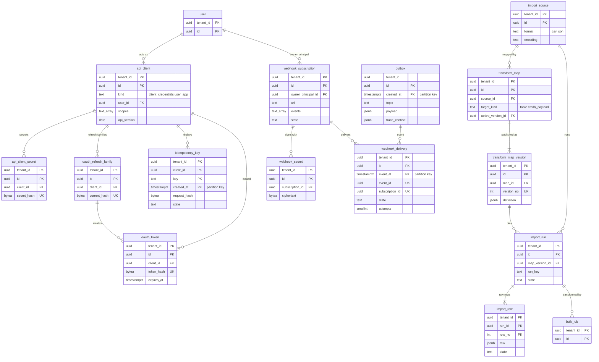

# Data model: API・取り込み・Webhook・outbox

[data-model.md](../data-model.md) の一部。API のクライアントと秘密・トークン、API の冪等のキー、取り込み（取り込み元・変換の対応と版・実行・原本の行）、Webhook の購読・署名の秘密・配達、outbox を定義する。振る舞い（クライアントの種類とスコープ、テーブルの API、DT-IMP-001、Webhook の本文と署名と配達、レート制限）は [api-and-integrations.md](../api-and-integrations.md) を正とする。本文と外に出すファイルの形は [stores.md](stores.md) の 4〜6 節。

- **秘密とトークンは SHA-256 のハッシュだけを持つ**（クライアントシークレット `<brand>_cs_`、アクセストークン `<brand>_at_`）。Webhook の署名の秘密だけは送るときに要るので、テナントの DEK で暗号化して持つ（[security.md](../security.md) の 7 節）。
- API のクライアントの主体は `kind = integration` の利用者。スコープは主体の ACL を広げない。

## 1. ER 図

## 2. API のクライアント

### 2.1 `api_client`

定義元：[api-and-integrations.md](../api-and-integrations.md) の 3.1・4.8 節。

| 列 | 型 | NULL | 既定 | 説明 |
| --- | --- | --- | --- | --- |
| `tenant_id` | `uuid` | NOT NULL | — | |
| `id` | `uuid` | NOT NULL | `uuidv7()` | OAuth の `client_id` |
| `name` | `text` | NOT NULL | — | |
| `kind` | `text` | NOT NULL | — | `client_credentials`（連携）・`user_app`（認可コード ＋ PKCE） |
| `user_id` | `uuid` | NULL | — | `client_credentials` の主体（`kind = integration` の利用者） |
| `auth_method` | `text` | NOT NULL | — | `client_secret_basic`・`private_key_jwt`・`none`（`user_app` の PKCE） |
| `jwks` | `jsonb` | NULL | — | `private_key_jwt` の公開鍵 |
| `redirect_uris` | `text[]` | NOT NULL | `'{}'` | `user_app` |
| `scopes` | `text[]` | NOT NULL | — | `records:read`・`records:write`・`imports:write`・`cmdb:ingest`・`webhooks:manage` |
| `table_allowlist` | `uuid[]` | NULL | — | 使えるテーブル。NULL は全テーブル |
| `api_version` | `date` | NOT NULL | — | 固定した振る舞いの版（`<Brand>-Api-Version`） |
| `rate_share` | `integer` | NULL | — | テナントの中の取り分の上書き（NULL は既定の 1 秒 50） |
| `active` | `boolean` | NOT NULL | `true` | |
| レコードの共通の列 | | | | |

- キー：PK `(tenant_id, id)`。FK `(tenant_id, user_id)` → `user`。
- CHECK：`(kind = 'client_credentials') = (user_id IS NOT NULL)`、`scopes <@ ARRAY[...]`、`kind <> 'user_app' OR cardinality(redirect_uris) > 0`。
- 作成と秘密の発行は `tenant_admin`。発行・失効は `tenant_audit_event` に残す。
- 保持：テナント。S1 の量：数千行。

### 2.2 `api_client_secret`

クライアントシークレット（作成の時に 1 回だけ見せる）。

| 列 | 型 | NULL | 既定 | 説明 |
| --- | --- | --- | --- | --- |
| `tenant_id` | `uuid` | NOT NULL | — | |
| `id` | `uuid` | NOT NULL | `uuidv7()` | |
| `client_id` | `uuid` | NOT NULL | — | |
| `secret_hash` | `bytea` | NOT NULL | — | SHA-256 |
| `last4` | `text` | NOT NULL | — | 画面の見分け用 |
| `created_at`・`created_by` | | | | |
| `expires_at` | `timestamptz` | NULL | — | |
| `revoked_at` | `timestamptz` | NULL | — | |

- キー：PK `(tenant_id, id)`。UK `(secret_hash)`。FK `(tenant_id, client_id)` → `api_client`。
- 索引：`(tenant_id, client_id) WHERE revoked_at IS NULL`（入れ替えの間は 2 つ）。
- 保持：失効・期限切れの後 30 日。S1 の量：数千行。

### 2.3 `oauth_token`・`oauth_refresh_family`

アクセストークン（不透明な値、1 時間）とリフレッシュトークンの系列（使うたびに入れ替え、再利用を見つけたら系列を失効）。

| 表 | 列 |
| --- | --- |
| `oauth_token` | `tenant_id`、`id`、`client_id`、`user_id`（主体）、`token_hash`（`bytea`）、`scopes`（`text[]`）、`family_id`（NULL。`user_app` のとき）、`issued_at`、`expires_at`、`revoked_at` |
| `oauth_refresh_family` | `tenant_id`、`id`、`client_id`、`user_id`、`current_hash`（`bytea`。今のリフレッシュトークン）、`previous_hashes`（`bytea[]`。再利用の検出、直近 10）、`issued_at`、`rotated_at`、`expires_at`、`revoked_at`、`revoke_reason`（`reuse_detected`・`user`・`admin`・`user_disabled`） |

- キー：どちらも PK `(tenant_id, id)`。`oauth_token` UK `(token_hash)`、`oauth_refresh_family` UK `(current_hash)`。トークンは要求のホスト名でテナントを解決した後に、そのテナントのコンテキストで引く。
- 索引：`oauth_token (expires_at)` — 掃除。`(tenant_id, user_id) WHERE revoked_at IS NULL` — 利用者の無効化での一括の失効。
- 保持：失効・期限切れの後 30 日。S1 の量：`oauth_token` 同時に数十万行。

### 2.4 `idempotency_key`

`POST` の冪等のキー（24 時間）。作成と同じトランザクションで書く。定義元：同じ文書の 4.5 節。

| 列 | 型 | NULL | 既定 | 説明 |
| --- | --- | --- | --- | --- |
| `tenant_id` | `uuid` | NOT NULL | — | |
| `client_id` | `uuid` | NOT NULL | — | 画面の要求は利用者の ID を入れる |
| `key` | `text` | NOT NULL | — | 255 文字まで |
| `created_at` | `timestamptz` | NOT NULL | `now()` | パーティションのキー（日） |
| `request_hash` | `bytea` | NOT NULL | — | 本文のハッシュ（違えば 422 `idempotency_key_reused`） |
| `state` | `text` | NOT NULL | `'in_progress'` | `in_progress`（409 `idempotency_in_progress`）・`completed` |
| `response_status` | `smallint` | NULL | — | |
| `response_head` | `bytea` | NULL | — | 応答の本文の先頭 64 KB |
| `created_record_id` | `uuid` | NULL | — | |
| `completed_at` | `timestamptz` | NULL | — | |

- キー：PK `(tenant_id, client_id, key, created_at)`。パーティションをまたぐ一意は、`pg_advisory_xact_lock(hashtextextended(tenant_id::text || client_id::text || key, 0))` で直列にし、直近 24 時間を引いてから挿入する。
- パーティション：`created_at` の日。保持：24 時間（2 日分を持ち、古い日を `DROP`）。S1 の量：1 日 約 500 万行。

## 3. 取り込み

### 3.1 `import_source`

定義元：同じ文書の 5.2 節、[ADR-0049](../../decisions/0049-import-sets-and-transform-maps.md)。

| 列 | 型 | NULL | 既定 | 説明 |
| --- | --- | --- | --- | --- |
| `tenant_id` | `uuid` | NOT NULL | — | |
| `id` | `uuid` | NOT NULL | `uuidv7()` | |
| `name` | `text` | NOT NULL | — | API の `source` |
| `format` | `text` | NOT NULL | — | `csv`・`json` |
| `encoding` | `text` | NOT NULL | `'auto'` | `auto`・`utf-8`・`shift_jis` |
| `csv_options` | `jsonb` | NOT NULL | `'{}'` | 区切り、見出しの行 |
| `default_map_id` | `uuid` | NULL | — | → `transform_map` |
| メタデータの共通の列 | | | | |

- キー：PK `(tenant_id, id)`。UK `(tenant_id, name)`、UK `(tenant_id, stable_key)`。
- 保持：メタデータ。S1 の量：1 テナント 数十行。

### 3.2 `transform_map`・`transform_map_version`

変換の対応と、公開で不変の版。実行は開始の時の版に固定する。2026-09-28 の統合で、版を別の表に分けた（`flow_def`・`flow_version` と同じ形）。定義元：同じ文書の 5.2・5.3・5.5 節。

| 表 | 列 |
| --- | --- |
| `transform_map` | `tenant_id`、`id`、`name`、`source_id`、`target_kind`（`table`・`cmdb_payload`）、`target_table_id`（`table` のとき。CI のクラスは不可）、`draft`（`jsonb`）、`active_version_id`、メタデータの共通の列 |
| `transform_map_version` | `tenant_id`、`id`、`map_id`、`version_no`、`definition`（`jsonb`：フィールドの対応（対象 ← 式）、一致のキー、`on_match`（`update`・`skip`）、`on_no_match`（`insert`・`skip`）、選択肢の値の対応、`run_as`、空の値の扱い（`ignore`・`clear`））、`coalesce_field_ids`（`uuid[]`。索引のあるフィールドだけ）、`run_as_user_id`、`content_hash`、`published_at`、`published_by` |

- キー：どちらも PK `(tenant_id, id)`。`transform_map` UK `(tenant_id, stable_key)`。`transform_map_version` UK `(tenant_id, map_id, version_no)`。
- CHECK：`(target_kind = 'table') = (target_table_id IS NOT NULL)`。対象のクラスが `ci` の階層なら公開で拒否する（アプリ）。一致のキーの索引の有無も公開の時に確かめる。
- 版は `UPDATE` を与えない。保持：版を消さない（実行が指すため。実行の保持の後は消せる）。S1 の量：1 テナント 数十行。

### 3.3 `import_run`

定義元：同じ文書の 5.1・5.2 節。

| 列 | 型 | NULL | 既定 | 説明 |
| --- | --- | --- | --- | --- |
| `tenant_id` | `uuid` | NOT NULL | — | |
| `id` | `uuid` | NOT NULL | `uuidv7()` | |
| `source_id` | `uuid` | NOT NULL | — | |
| `map_version_id` | `uuid` | NOT NULL | — | 開始の時に固定 |
| `run_key` | `text` | NOT NULL | — | 7 日の中で一意（`pg_advisory_xact_lock` の下で 7 日を引く） |
| `state` | `text` | NOT NULL | `'loading'` | `loading`・`ready`・`transforming`・`completed`・`failed`・`cancelled` |
| `file_s3_key` | `text` | NULL | — | CSV の原本 |
| `detected_encoding` | `text` | NULL | — | |
| `rows_total`・`inserted`・`updated`・`skipped`・`errors` | `integer` | NOT NULL | `0` | |
| `fail_reason` | `text` | NULL | — | `undecodable`・`error_rate`・`too_large` |
| `created_by`・`created_at`・`started_at`・`finished_at` | | | | |

- キー：PK `(tenant_id, id)`。索引 `(tenant_id, source_id, run_key, created_at)`、`(tenant_id, state) WHERE state IN ('loading','ready','transforming')`（同時の変換の実行 2 の数え方）。
- 保持：13 か月（原本の行と S3 のファイルは 30 日）。S1 の量：1 日 数千行。

### 3.4 `import_row`

原本の 1 行の写しと、行ごとの結果。定義元：同じ文書の 5.2・5.3 節。

| 列 | 型 | NULL | 既定 | 説明 |
| --- | --- | --- | --- | --- |
| `tenant_id` | `uuid` | NOT NULL | — | |
| `run_id` | `uuid` | NOT NULL | — | |
| `row_no` | `integer` | NOT NULL | — | ファイルの順 |
| `raw` | `jsonb` | NOT NULL | — | 原本の 1 行（64 KB まで。PII を含みうる） |
| `lane` | `smallint` | NOT NULL | — | 一致のキーのハッシュの区画（区画の中は `row_no` の順に 1 行ずつ） |
| `state` | `text` | NOT NULL | `'pending'` | `pending`・`inserted`・`updated`・`skipped`・`error` |
| `target_id` | `uuid` | NULL | — | 作った・更新したレコード（CMDB の変換では CI） |
| `error_code` | `text` | NULL | — | `empty_coalesce_key`・`ambiguous_coalesce`・`coalesce_target_not_readable`・Record Service のコード |
| `error_detail` | `jsonb` | NULL | — | 値を含めない |
| `processed_at` | `timestamptz` | NULL | — | |

- キー：PK `(tenant_id, run_id, row_no)`。FK `(tenant_id, run_id)` → `import_run`。
- 索引：`(tenant_id, run_id, lane, row_no) WHERE state = 'pending'` — 区画ごとの続きの処理（途中の停止の再開）。
- 保持：30 日。日次の削除のジョブが実行ごとに 1 万行ずつ消す（パーティションを持たない。実行の単位で消すため）。S1 の量：1 日 数百万行（4 月は 1 テナントで数万〜数十万行）。

## 4. Webhook

### 4.1 `webhook_subscription`・`webhook_secret`

購読（1 テナント 100 まで）と署名の秘密（入れ替えの間は 2 つ）。定義元：同じ文書の 6.1・6.3 節、[ADR-0050](../../decisions/0050-signed-webhooks-and-tenant-rate-limits.md)。

| 表 | 列 |
| --- | --- |
| `webhook_subscription` | `tenant_id`、`id`、`name`、`owner_principal_id`（→ `user`。送る時点の ACL の主体）、`url`（`https:` だけ。ホストは `webhook_allowlist`）、`events`（`text[]`）、`table_ids`（`uuid[]`）、`condition`（`jsonb`）、`state`（`active`・`paused`・`disabled`）、`failing_since`（`timestamptz`。72 時間で `disabled`）、`created_by`、レコードの共通の列 |
| `webhook_secret` | `tenant_id`、`id`、`subscription_id`、`ciphertext`（`bytea`。`<brand>_whsec_` ＋ 32 バイト、テナントの DEK で暗号化）、`dek_version`、`created_at`、`retire_at`（入れ替えの期間の終わり。既定 24 時間）、`revoked_at` |

- キー：どちらも PK `(tenant_id, id)`。`webhook_secret` FK `(tenant_id, subscription_id)` → `webhook_subscription`、`(tenant_id, dek_version)` → `tenant_dek`。
- 索引：`webhook_subscription (tenant_id, state) WHERE state = 'active'`、`USING gin (tenant_id, events)` — 事象に合う購読の選択。
- CHECK：`url LIKE 'https://%'`、`events <@ ARRAY['record.created','record.updated','record.deleted','sla.warning','sla.breached','approval.requested','approval.decided','ci.held','import.completed']`。有効な秘密が 2 つを超えないことはアプリで確かめる。
- 保持：テナント。S1 の量：購読 数千行。

### 4.2 `webhook_delivery`

配達（事象 × 購読で 1 つ）。少なくとも 1 回、順序は約束しない。再試行は SQS の遅延を重ねて待つ（`next_attempt_at` は表示と再開の判断に使う）。定義元：同じ文書の 6.2・6.4 節。

| 列 | 型 | NULL | 既定 | 説明 |
| --- | --- | --- | --- | --- |
| `tenant_id` | `uuid` | NOT NULL | — | |
| `id` | `uuid` | NOT NULL | `uuidv7()` | 配達の ID（`whd_` ＋ base62 で外に出す。送り直しでも同じ） |
| `event_id` | `uuid` | NOT NULL | — | outbox の事象の ID |
| `event_at` | `timestamptz` | NOT NULL | — | `event_id` の時刻。パーティションのキー（日） |
| `subscription_id` | `uuid` | NOT NULL | — | |
| `event_type` | `text` | NOT NULL | — | |
| `record_id` | `uuid` | NULL | — | |
| `record_version` | `bigint` | NULL | — | |
| `payload` | `jsonb` | NOT NULL | — | 送る本文（薄い事象。値を入れない） |
| `state` | `text` | NOT NULL | `'pending'` | `pending`・`delivered`・`failed_permanent`・`expired`（24 時間）・`suppressed` |
| `suppress_reason` | `text` | NULL | — | `no_read_access`・`no_readable_change`・`condition_false` |
| `attempts` | `smallint` | NOT NULL | `0` | |
| `last_status_code` | `smallint` | NULL | — | |
| `last_error` | `text` | NULL | — | |
| `next_attempt_at` | `timestamptz` | NULL | — | |
| `delivered_at` | `timestamptz` | NULL | — | |

- キー：PK `(tenant_id, id, event_at)`。UK `(tenant_id, event_id, subscription_id, event_at)`。
- 索引：`(tenant_id, subscription_id, event_at DESC)` — 購読の画面と、再開の時の手での送り直し。
- パーティション：`event_at` の日。保持：7 日（`DROP`）。S1 の量：1 日 約 100 万行。

## 5. `outbox`

保存・遷移と同じトランザクションで書く事象（transactional outbox）。`relay` が SQS へ送る。topic と本文の形は [stores.md](stores.md) の 4 節。定義元：[architecture/README.md](../README.md) の 1.2 節、[observability.md](../observability.md) の 2.1 節。

| 列 | 型 | NULL | 既定 | 説明 |
| --- | --- | --- | --- | --- |
| `id` | `uuid` | NOT NULL | `uuidv7()` | 事象の ID（`event_id`）。通知・配達の一意のキーに使う |
| `created_at` | `timestamptz` | NOT NULL | `now()` | パーティションのキー（時間） |
| `tenant_id` | `uuid` | NOT NULL | — | |
| `topic` | `text` | NOT NULL | — | `record.changed`・`meta.changed`・`sla.warning` など |
| `payload` | `jsonb` | NOT NULL | — | ID と版だけ（値を入れない） |
| `trace_context` | `jsonb` | NULL | — | W3C の `traceparent`・`tracestate` |
| `published_at` | `timestamptz` | NULL | — | `relay` の送信済みの印 |

- キー：PK `(id, created_at)`。
- 索引：`(created_at) WHERE published_at IS NULL` — `relay` の未送信の読み取り（古い順）。
- RLS：アプリのロールは自分のテナントの行の `INSERT` だけ（`tenant_id` の `WITH CHECK`）。`relay` のロールは全行の `SELECT` と `published_at` の `UPDATE` だけを持つ方針を別に張る（[security.md](../security.md) の 10.4 節）。
- パーティション：`created_at` の時間。送信の済んだ時間のパーティションを 24 時間後に `DROP`（`maintenance`）。S1 の量：1 時間 約 50 万行（9 時の山）。
