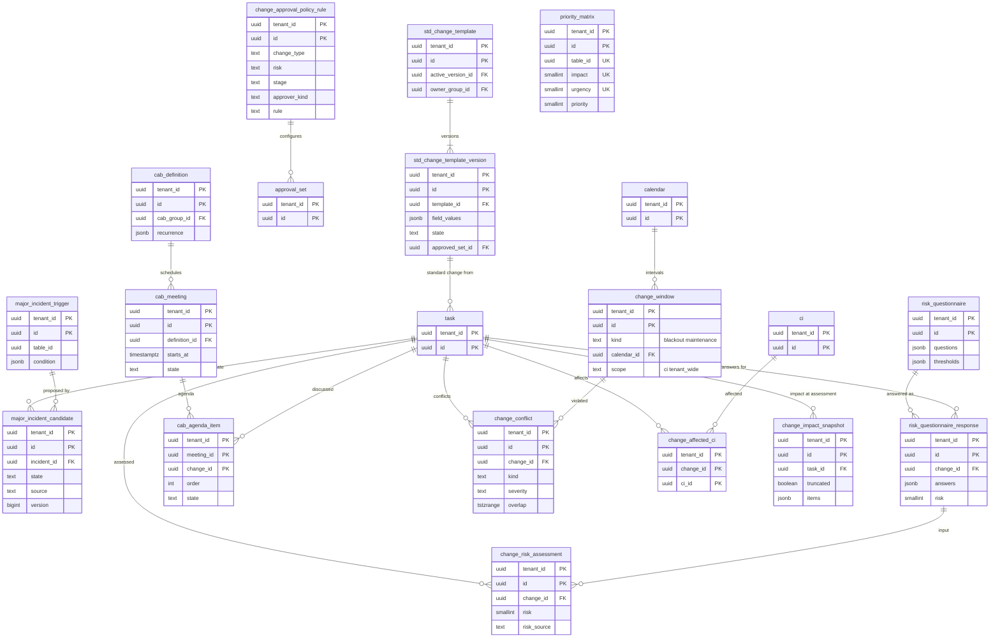

# Data model: ITSM のプロセス（優先度・メジャーインシデント・変更）

[data-model.md](../data-model.md) の一部。優先度の表、メジャーインシデントの候補、標準の変更の雛形、リスクの評価、変更の承認の方針、CAB、変更の予定表・衝突・影響を受ける CI・影響の範囲の写しを定義する。インシデント・問題・変更の本体は `task` の型付きの列（[records-and-audit.md](records-and-audit.md) の 2.2 節）。状態のモデル（`incident`、`problem`、`change.*`、`generic_task`）はコードの版だけに持ち、表を持たない。振る舞いは [itsm-processes.md](../itsm-processes.md) を正とする。

## 1. ER 図

## 2. 優先度とメジャーインシデント

### 2.1 `priority_matrix`

影響度 × 緊急度 → 優先度（テーブルごと）。既定（DT-PRIO-001）はコードの版だけに持ち、テナントは行で上書きする。定義元：[itsm-processes.md](../itsm-processes.md) の 5.1 節、[ADR-0023](../../decisions/0023-priority-matrix-and-major-incident.md)。

| 列 | 型 | NULL | 既定 | 説明 |
| --- | --- | --- | --- | --- |
| `tenant_id` | `uuid` | NOT NULL | — | |
| `id` | `uuid` | NOT NULL | `uuidv7()` | |
| `table_id` | `uuid` | NOT NULL | — | 子のクラスは自分の表がなければ親の表 |
| `impact`・`urgency` | `smallint` | NOT NULL | — | 1〜3 |
| `priority` | `smallint` | NOT NULL | — | 1〜4（5 は上書きだけ） |
| メタデータの共通の列 | | | | |

- キー：PK `(tenant_id, id)`。UK `(tenant_id, table_id, impact, urgency) WHERE deleted_at IS NULL`。
- CHECK：`impact BETWEEN 1 AND 3`、`urgency BETWEEN 1 AND 3`、`priority BETWEEN 1 AND 4`。1 テーブルで 9 行すべてを持つことは、保存のトランザクションの終わりの遅延制約のトリガーで確かめる。
- 保持：メタデータ。S1 の量：1 テナント 数十行。

### 2.2 `major_incident_trigger`

メジャーインシデントの候補を作るトリガーの規則（自動では昇格しない）。定義元：同じ文書の 6.1 節。

| 列 | 型 | NULL | 既定 | 説明 |
| --- | --- | --- | --- | --- |
| `tenant_id` | `uuid` | NOT NULL | — | |
| `id` | `uuid` | NOT NULL | `uuidv7()` | |
| `table_id` | `uuid` | NOT NULL | — | |
| `condition` | `jsonb` | NOT NULL | — | 偽 → 真で候補を作る |
| `active` | `boolean` | NOT NULL | `true` | |
| メタデータの共通の列 | | | | |

- キー：PK `(tenant_id, id)`。索引 `(tenant_id, table_id) WHERE active`。
- 保持：メタデータ。S1 の量：1 テナント 数行。

### 2.3 `major_incident_candidate`

定義元：同じ文書の 6.1・6.2 節。

| 列 | 型 | NULL | 既定 | 説明 |
| --- | --- | --- | --- | --- |
| `tenant_id` | `uuid` | NOT NULL | — | |
| `id` | `uuid` | NOT NULL | `uuidv7()` | |
| `incident_id` | `uuid` | NOT NULL | — | → `task` |
| `state` | `text` | NOT NULL | `'proposed'` | `proposed`・`promoted`・`rejected`・`withdrawn` |
| `source` | `text` | NOT NULL | — | `trigger_rule`・`proposal` |
| `rule_id` | `uuid` | NULL | — | → `major_incident_trigger` |
| `proposed_by` | `uuid` | NULL | — | 規則のときは NULL |
| `reason`・`business_impact` | `text` | NULL | — | |
| `decided_by` | `uuid` | NULL | — | `major_incident_manager` |
| `decided_at` | `timestamptz` | NULL | — | |
| `decision_note` | `text` | NULL | — | 却下で必須 |
| `version` | `bigint` | NOT NULL | `1` | |
| `created_at` | `timestamptz` | NOT NULL | `now()` | |

- キー：PK `(tenant_id, id)`。UK `(tenant_id, incident_id) WHERE state IN ('proposed','promoted')`（DT-MIM-001 の 2 行）。FK `(tenant_id, incident_id)` → `task`、`rule_id` → `major_incident_trigger`。
- 索引：`(tenant_id, state, created_at) WHERE state = 'proposed'` — `major_incident_manager` の判断の一覧。
- CHECK：`source <> 'trigger_rule' OR rule_id IS NOT NULL`、`state <> 'rejected' OR decision_note IS NOT NULL`。
- 保持：テナント。S1 の量：年 数万行。

## 3. 変更

### 3.1 `std_change_template`・`std_change_template_version`

標準の変更の雛形と版。版の承認が、個々の標準の変更の承認の証跡になる。定義元：同じ文書の 8.2 節。

| 表 | 列 |
| --- | --- |
| `std_change_template` | `tenant_id`、`id`、`name`、`category`、`active_version_id`（→ 版）、`owner_group_id`（→ `group`）、メタデータの共通の列 |
| `std_change_template_version` | `tenant_id`、`id`、`template_id`、`version_no`、`field_values`（`jsonb`：作る変更の既定値）、`allowed_ci_condition`（`jsonb`）、`max_duration`（`bigint` 秒）、`state`（`proposed`・`approved`・`rejected`・`retired`）、`approved_set_id`（→ `approval_set`）、`content_hash`、`created_at`、`created_by`、`approved_at` |

- キー：`std_change_template` PK `(tenant_id, id)`、UK `(tenant_id, stable_key)`。版 PK `(tenant_id, id)`、UK `(tenant_id, template_id, version_no)`、FK `(tenant_id, approved_set_id)` → `approval_set`。
- CHECK：`(state = 'approved') = (approved_set_id IS NOT NULL AND approved_at IS NOT NULL)`、`max_duration > 0`。`approved` の版の内容の列は更新のトリガーで変えさせない（`retired` への変更だけ許す）。
- 保持：版を消さない。S1 の量：1 テナント 数百行。

### 3.2 `risk_condition`・`risk_questionnaire`・`risk_questionnaire_response`

リスクの規則と質問票。高いほう（数値の小さいほう）を採る（DT-RISK-001）。質問票の回答の表は、2026-09-28 の統合で最小の形で足した（`request_assessment` の前に回答を置く場所）。定義元：同じ文書の 8.3 節。

| 表 | 列 |
| --- | --- |
| `risk_condition` | `tenant_id`、`id`、`condition`（`jsonb`。CI の重要度、影響を受けるサービスの数、過去 90 日の `unsuccessful` の件数、禁止期間への近さを使える）、`risk`（`smallint` 1〜4）、`order`、`active`、メタデータの共通の列 |
| `risk_questionnaire` | `tenant_id`、`id`、`name`、`questions`（`jsonb`：`[{id, text, choices: [{value, score}], weight}]`）、`thresholds`（`jsonb`：得点 → リスク）、`active`、メタデータの共通の列 |
| `risk_questionnaire_response` | `tenant_id`、`id`、`change_id`（→ `task`）、`questionnaire_id`、`questionnaire_rev`（`integer`。回答の時の `rev`）、`answers`（`jsonb`）、`score`（`integer`）、`risk`（`smallint`）、`answered_by`、`answered_at` |

- キー：どれも PK `(tenant_id, id)`。`risk_condition`・`risk_questionnaire` は UK `(tenant_id, stable_key)`。`risk_questionnaire_response` は UK `(tenant_id, change_id, questionnaire_id)`（回答し直しは同じ行の更新で、履歴は `record_change`）。
- CHECK：`risk BETWEEN 1 AND 4`。
- 保持：規則と質問票はメタデータ。回答は変更に従う。S1 の量：回答 年 数十万行。

### 3.3 `change_risk_assessment`

評価の入力と結果の写し（評価の後に入力が変わっても、評価の根拠を残す）。定義元：同じ文書の 8.3 節。

| 列 | 型 | NULL | 既定 | 説明 |
| --- | --- | --- | --- | --- |
| `tenant_id` | `uuid` | NOT NULL | — | |
| `id` | `uuid` | NOT NULL | `uuidv7()` | |
| `change_id` | `uuid` | NOT NULL | — | |
| `change_version` | `bigint` | NOT NULL | — | 評価の時の変更の `version` |
| `rule_results` | `jsonb` | NOT NULL | — | 一致した規則の `id`・`rev`・`risk` |
| `rule_risk` | `smallint` | NULL | — | |
| `questionnaire_response_id` | `uuid` | NULL | — | |
| `questionnaire_risk` | `smallint` | NULL | — | |
| `impact_count` | `integer` | NULL | — | 影響を受けるサービスの数（影響の範囲の写しから） |
| `risk` | `smallint` | NOT NULL | — | |
| `risk_source` | `text` | NOT NULL | — | `rule`・`questionnaire`・`default` |
| `assessed_at` | `timestamptz` | NOT NULL | `now()` | |

- キー：PK `(tenant_id, id)`。FK `(tenant_id, change_id)` → `task`、`(tenant_id, questionnaire_response_id)` → `risk_questionnaire_response`。
- 索引：`(tenant_id, change_id, assessed_at DESC)`。
- 追記だけ（`reschedule` の評価し直しは新しい行）。保持：監査と同じ 7 年（変更が残る間は残す）。S1 の量：年 数十万行。

### 3.4 `change_approval_policy_rule`

組み込みのフロー `change_approval_policy` の、テナントが変える値（段ごとの承認者・規則・期限・期限切れの動作）。NULL の行を持たない。定義元：同じ文書の 8.5.1 節（列の定義はここを正とし、振る舞いはあちらを正とする）。

| 列 | 型 | NULL | 既定 | 説明 |
| --- | --- | --- | --- | --- |
| `tenant_id` | `uuid` | NOT NULL | — | |
| `id` | `uuid` | NOT NULL | `uuidv7()` | |
| `change_type` | `text` | NOT NULL | — | `normal`・`standard`・`emergency` |
| `risk` | `text` | NOT NULL | — | `1`〜`4` か `*` |
| `stage` | `text` | NOT NULL | — | `assess`・`authorize`・`post_review` |
| `approver_kind` | `text` | NOT NULL | — | `ci_support_group_manager`・`group`・`cab`・`ecab`・`business_service_owners`・`user`・`none` |
| `approver_group_id`・`approver_user_id` | `uuid` | NULL | — | `group`・`user` のとき |
| `rule` | `text` | NOT NULL | — | `any`・`all`・`all_responded_any_approves`・`percent`・`count` |
| `rule_param` | `integer` | NULL | — | |
| `due_after` | `interval` | NOT NULL | — | 既定：通常 3 日、緊急 4 時間（暦の時間） |
| `on_due` | `text` | NOT NULL | — | `escalate`・`reject` |
| `escalate_to_group_id` | `uuid` | NULL | — | |
| `active` | `boolean` | NOT NULL | `true` | |
| `version` | `bigint` | NOT NULL | `1` | 承認のまとまりに使った版を残す |
| メタデータの共通の列 | | | | |

- キー：PK `(tenant_id, id)`。UK `(tenant_id, change_type, risk, stage) WHERE active AND deleted_at IS NULL`。FK `approver_group_id`・`escalate_to_group_id` → `group`、`approver_user_id` → `user`。
- CHECK（DT-CHG-003）：`approver_kind <> 'none' OR change_type = 'standard'`、`change_type <> 'emergency' OR (stage IN ('authorize','post_review') AND risk = '*')`、`on_due IN ('escalate','reject')`、`approver_kind NOT IN ('group','user') OR coalesce(approver_group_id, approver_user_id) IS NOT NULL`、`rule <> 'percent' OR rule_param BETWEEN 1 AND 100`、`rule <> 'count' OR rule_param >= 1`、`risk IN ('1','2','3','4','*')`。相手が無効かどうかは保存の時にアプリで確かめる。
- 書けるのは `change_manager` だけ。パッケージで移送できる。
- 保持：メタデータ。S1 の量：1 テナント 十数行。

### 3.5 `cab_definition`・`cab_meeting`・`cab_agenda_item`

CAB の定義・会議・議題。会議の決定は各承認者の回答として反映する（議題の `decision_summary` は議事の記録）。定義元：同じ文書の 8.6 節。

| 表 | 列 |
| --- | --- |
| `cab_definition` | `tenant_id`、`id`、`name`、`kind`（`cab`・`ecab`・`post_review`）、`cab_group_id`（→ `group`）、`recurrence`（`jsonb`：曜日と時刻、テナントのタイムゾーン）、`duration`（`interval`）、`agenda_condition`（`jsonb`。既定 `cab_required AND state = authorize`）、`agenda_window`（`jsonb`：会議の前後の日数）、`active`、メタデータの共通の列 |
| `cab_meeting` | `tenant_id`、`id`、`definition_id`、`starts_at`、`ends_at`、`state`（`planned`・`in_progress`・`completed`・`cancelled`）、`notes`（`text`）、`version`、`created_at` |
| `cab_agenda_item` | `tenant_id`、`meeting_id`、`change_id`（→ `task`）、`order`、`allotted_minutes`（`smallint`）、`state`（`pending`・`in_discussion`・`decided`・`skipped`・`deferred`）、`decision_summary`（`text`）、`updated_at` |

- キー：`cab_definition` PK `(tenant_id, id)`。`cab_meeting` PK `(tenant_id, id)`、UK `(tenant_id, definition_id, starts_at)`（議題を作るジョブの冪等）、索引 `(tenant_id, starts_at)`。`cab_agenda_item` PK `(tenant_id, meeting_id, change_id)`、索引 `(tenant_id, change_id)`（変更の画面の議題の履歴）。
- CHECK：`starts_at < ends_at`、`allotted_minutes BETWEEN 1 AND 240`。
- 保持：監査と同じ 7 年。S1 の量：会議 年 数万行、議題 年 数十万行。

## 4. 変更の予定表と衝突

### 4.1 `change_window`

禁止期間・保守の時間帯・凍結期間。区間はカレンダーの版で表す（[sla-and-calendars.md](sla-and-calendars.md) の 2 節の `calendar`。`purpose = change_window`）。定義元：同じ文書の 9.1 節、[ADR-0025](../../decisions/0025-change-schedule-and-conflict-detection.md)。

| 列 | 型 | NULL | 既定 | 説明 |
| --- | --- | --- | --- | --- |
| `tenant_id` | `uuid` | NOT NULL | — | |
| `id` | `uuid` | NOT NULL | `uuidv7()` | |
| `kind` | `text` | NOT NULL | — | `blackout`・`maintenance` |
| `name` | `text` | NOT NULL | — | |
| `calendar_id` | `uuid` | NOT NULL | — | 区間の定義 |
| `scope` | `text` | NOT NULL | `'ci'` | `ci`・`tenant_wide`（凍結期間） |
| `ci_condition` | `jsonb` | NULL | — | `scope = ci` のとき |
| `applies_to_types` | `text[]` | NOT NULL | `'{normal,standard}'` | |
| `active` | `boolean` | NOT NULL | `true` | |
| メタデータの共通の列 | | | | |

- キー：PK `(tenant_id, id)`。UK `(tenant_id, stable_key)`。FK `(tenant_id, calendar_id)` → `calendar`。
- CHECK：`(scope = 'ci') = (ci_condition IS NOT NULL)`、`kind <> 'maintenance' OR scope = 'ci'`。
- 保持：メタデータ。S1 の量：1 テナント 数十行。

### 4.2 `change_conflict`

変更ごとの衝突の行（`recompute_conflicts` で書き直す）。定義元：同じ文書の 9.2・9.3 節。

| 列 | 型 | NULL | 既定 | 説明 |
| --- | --- | --- | --- | --- |
| `tenant_id` | `uuid` | NOT NULL | — | |
| `id` | `uuid` | NOT NULL | `uuidv7()` | |
| `change_id` | `uuid` | NOT NULL | — | |
| `kind` | `text` | NOT NULL | — | DT-CONF-001 の 8 種 |
| `severity` | `text` | NOT NULL | — | `blocking`・`warning` |
| `ci_id` | `uuid` | NULL | — | |
| `other_change_id` | `uuid` | NULL | — | |
| `window_id` | `uuid` | NULL | — | |
| `overlap` | `tstzrange` | NOT NULL | — | 半開区間 |
| `exception_set_id` | `uuid` | NULL | — | 禁止期間の例外の承認（→ `approval_set`）。`approved` なら `warning` に下げる |
| `computed_at` | `timestamptz` | NOT NULL | `now()` | |

- キー：PK `(tenant_id, id)`。FK `(tenant_id, change_id)` → `task`（`ON DELETE CASCADE`）、`window_id` → `change_window`。
- 索引：`(tenant_id, change_id)` — 変更の画面、`conflict_status` の計算。`USING gist (tenant_id, ci_id, overlap)` — 他の変更の予定の変更での、影響を受ける変更の非同期の計算し直し。
- CHECK：`kind IN (...)`、`severity IN ('blocking','warning')`。1 つの変更で 1,000 件まで（超えたら切り、`task.conflict_truncated` を立てる）。
- 保持：変更に従う。S1 の量：年 数百万行。

### 4.3 `change_affected_ci`

影響を受ける CI（変更 × CI）。2026-09-28 の統合で列を定義した。

| 列 | 型 | NULL | 既定 | 説明 |
| --- | --- | --- | --- | --- |
| `tenant_id` | `uuid` | NOT NULL | — | |
| `change_id` | `uuid` | NOT NULL | — | |
| `ci_id` | `uuid` | NOT NULL | — | |
| `source` | `text` | NOT NULL | `'manual'` | `manual`・`impact_snapshot` |
| `added_at`・`added_by` | | | | |

- キー：PK `(tenant_id, change_id, ci_id)`。FK → `task`・`ci`。
- 索引：`(tenant_id, ci_id)` — 衝突の `ctx`（同じ CI の他の変更）、CI の統合の付け替え（進行中の変更だけ）。
- 保持：変更に従う。S1 の量：年 数百万行。

### 4.4 `change_impact_snapshot`

影響の範囲の写し（変更の `request_assessment`、メジャーインシデント）。システムの主体で全体を走査して写し、見るときに見る人の ACL で各項目を絞る。定義元：同じ文書の 9.4 節、[cmdb-and-reconciliation.md](../cmdb-and-reconciliation.md) の 8.2 節。

| 列 | 型 | NULL | 既定 | 説明 |
| --- | --- | --- | --- | --- |
| `tenant_id` | `uuid` | NOT NULL | — | |
| `id` | `uuid` | NOT NULL | `uuidv7()` | |
| `task_id` | `uuid` | NOT NULL | — | 変更かインシデント |
| `purpose` | `text` | NOT NULL | — | `change_assessment`・`major_incident` |
| `start_ci_ids` | `uuid[]` | NOT NULL | — | |
| `items` | `jsonb` | NOT NULL | — | `[{ci_id, class_id, depth}]`（10,000 まで） |
| `service_count` | `integer` | NOT NULL | — | |
| `truncated` | `boolean` | NOT NULL | `false` | 深さ 6・節 10,000・2 秒で打ち切った |
| `taken_at` | `timestamptz` | NOT NULL | `now()` | |

- キー：PK `(tenant_id, id)`。FK `(tenant_id, task_id)` → `task`。索引 `(tenant_id, task_id, taken_at DESC)`。
- 追記だけ（後で CMDB が変わっても、承認の根拠を変えない）。保持：監査と同じ 7 年（変更が残る間は残す）。S1 の量：年 数十万行、1 行 平均 50 KB。
