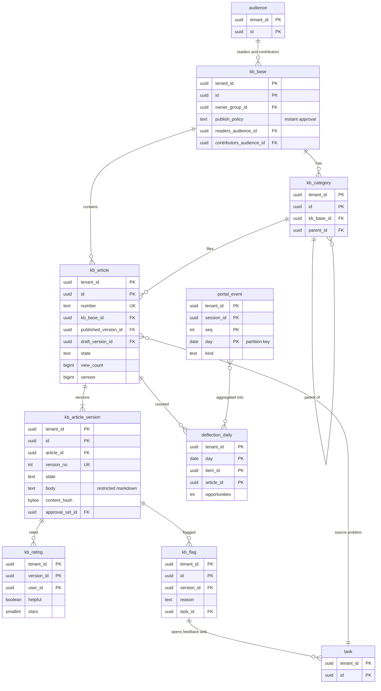

# Data model: ナレッジと自己解決の計測

[data-model.md](../data-model.md) の一部。ナレッジベース・カテゴリ・記事と版・評価と旗・ポータルの事象・自己解決の日次の集計を定義する。見直しのタスク（`kb_feedback_task`）は `task` のクラス（[records-and-audit.md](records-and-audit.md) の 2.2 節）。振る舞い（版の状態 DT-KB-001、公開の流れ、自己解決の数え方 DT-KB-003）は [knowledge.md](../knowledge.md) を正とする。

- **1 つの記事に、公開中の版は高々 1 つ、編集中の版も高々 1 つ**（部分一意索引。[ADR-0031](../../decisions/0031-knowledge-articles-versions-and-publishing.md)）。
- **自己解決の事象に利用者の ID と検索の語を入れない**（[ADR-0032](../../decisions/0032-knowledge-feedback-and-deflection.md)）。

## 1. ER 図

## 2. ナレッジベースと記事

### 2.1 `kb_base`・`kb_category`

定義元：[knowledge.md](../knowledge.md) の 3.1・6 節。既知のエラーのナレッジベースはテナントの作成の時にテナントの行として作る（`publish_policy = approval`、持ち主は `problem_manager` のグループ）。

| 表 | 列 |
| --- | --- |
| `kb_base` | `tenant_id`、`id`、`name`、`owner_group_id`（→ `group`）、`publish_policy`（`instant`・`approval`）、`retire_policy`（`instant`・`approval`）、`readers_audience_id`・`contributors_audience_id`（→ `audience`）、`self_approval_allowed`（既定 偽）、`review_interval_days`（既定 365）、`purpose`（`general`・`known_error`）、`active`、メタデータの共通の列 |
| `kb_category` | `tenant_id`、`id`、`kb_base_id`、`parent_id`（深さ 4）、`name`、`order`、メタデータの共通の列 |

- キー：どちらも PK `(tenant_id, id)`、UK `(tenant_id, stable_key)`。`kb_category` は索引 `(tenant_id, kb_base_id, parent_id, "order")`。
- CHECK：`review_interval_days BETWEEN 30 AND 1825`。
- 保持：メタデータ。S1 の量：1 テナント ナレッジベース 数十、カテゴリ 数百行。

### 2.2 `kb_article`

記事の同一性（番号、評価の合計、ナレッジベース）。本文は版に持つ。専用の表。定義元：同じ文書の 3.1・3.4・7.1・7.2 節。

| 列 | 型 | NULL | 既定 | 説明 |
| --- | --- | --- | --- | --- |
| `tenant_id` | `uuid` | NOT NULL | — | |
| `id` | `uuid` | NOT NULL | `uuidv7()` | |
| `number` | `text` | NOT NULL | — | `KB0001234`。版で変えない |
| `kb_base_id` | `uuid` | NOT NULL | — | |
| `category_id` | `uuid` | NULL | — | |
| `owner_group_id` | `uuid` | NULL | — | NULL はナレッジベースの持ち主 |
| `author_id` | `uuid` | NOT NULL | — | |
| `kind` | `text` | NOT NULL | `'general'` | `general`・`known_error`・`how_to` |
| `audience_id` | `uuid` | NULL | — | ナレッジベースより狭くするだけ |
| `source_task_id` | `uuid` | NULL | — | 既知のエラーの元の問題（→ `task`） |
| `published_version_id`・`draft_version_id` | `uuid` | NULL | — | → `kb_article_version` |
| `state` | `text` | NOT NULL | `'draft'` | 導出：`draft`・`published`・`retired` |
| `valid_to` | `timestamptz` | NULL | — | 廃止のタイマー |
| `next_review_at` | `timestamptz` | NULL | — | `published_at + review_interval_days` |
| `view_count` | `bigint` | NOT NULL | `0` | 非同期の集計で足す |
| `helpful_yes`・`helpful_no`・`rating_sum`・`rating_count` | `integer` | NOT NULL | `0` | |
| `ext` | `jsonb` | NOT NULL | `'{}'` | |
| レコードの共通の列 | | | | |

- キー：PK `(tenant_id, id)`。UK `(tenant_id, number)`。FK `(tenant_id, kb_base_id)` → `kb_base`、`category_id` → `kb_category`、`audience_id` → `audience`、`source_task_id` → `task`、`published_version_id`・`draft_version_id` → `kb_article_version`（遅延制約）。
- 索引：`(tenant_id, kb_base_id, category_id) WHERE state = 'published'` — ポータルのナレッジの一覧。`(tenant_id, next_review_at) WHERE state = 'published'` — 日次の見直しのジョブ。`(tenant_id, source_task_id) WHERE source_task_id IS NOT NULL` — 問題の変化の知らせ。
- CHECK：`(state = 'published') = (published_version_id IS NOT NULL)`。
- 保持：テナント（監査の対象）。S1 の量：全体で約 10 万行。

### 2.3 `kb_article_version`

記事の版。`review` と `published` の版の本文は変えない。定義元：同じ文書の 3.1〜3.3・3.5 節。

| 列 | 型 | NULL | 既定 | 説明 |
| --- | --- | --- | --- | --- |
| `tenant_id` | `uuid` | NOT NULL | — | |
| `id` | `uuid` | NOT NULL | `uuidv7()` | |
| `article_id` | `uuid` | NOT NULL | — | |
| `version_no` | `integer` | NOT NULL | — | 1, 2, 3 …（下書きの保存ごとに上げない） |
| `state` | `text` | NOT NULL | `'draft'` | `draft`・`review`・`published`・`pending_retirement`・`outdated`・`retired`・`cancelled` |
| `title` | `text` | NOT NULL | — | |
| `body` | `text` | NOT NULL | — | 制限付きの Markdown。256 KB まで |
| `keywords` | `text[]` | NOT NULL | `'{}'` | |
| `language` | `text` | NOT NULL | `'ja'` | `ja`・`en` |
| `content_hash` | `bytea` | NULL | — | `submit` で固定。承認の依頼の時と公開の時で比べる |
| `checked_out_by`・`checked_out_at` | | NULL | — | 編集中の人 |
| `submitted_at`・`published_at`・`published_by`・`retired_at` | | NULL | — | |
| `approval_set_id` | `uuid` | NULL | — | 公開・廃止の承認 |
| `change_note` | `text` | NULL | — | |
| `based_on_version_id` | `uuid` | NULL | — | `checkout` の元の版 |
| `created_at`・`created_by`・`updated_at` | | | | |

- キー：PK `(tenant_id, id)`。UK `(tenant_id, article_id, version_no)`。UK `(tenant_id, article_id) WHERE state = 'published'`。UK `(tenant_id, article_id) WHERE state IN ('draft','review')`。FK `(tenant_id, article_id)` → `kb_article`、`approval_set_id` → `approval_set`。
- CHECK：`octet_length(body) <= 262144`、`state NOT IN ('review','published') OR content_hash IS NOT NULL`。`review`・`published` の本文・題名は更新のトリガーで変えさせない。
- 保持：監査と同じ 7 年（記事が残る間は残す）。S1 の量：全体で約 30 万行、1 版 平均 8 KB。

## 3. 評価・旗

### 3.1 `kb_rating`

利用者 × 版の評価（1 人 1 行、変えられる）。定義元：同じ文書の 7.1 節。

| 列 | 型 | NULL | 既定 | 説明 |
| --- | --- | --- | --- | --- |
| `tenant_id` | `uuid` | NOT NULL | — | |
| `version_id` | `uuid` | NOT NULL | — | |
| `user_id` | `uuid` | NOT NULL | — | |
| `article_id` | `uuid` | NOT NULL | — | 版から写す（記事の合計の更新のため） |
| `helpful` | `boolean` | NULL | — | |
| `stars` | `smallint` | NULL | — | 1〜5 |
| `updated_at` | `timestamptz` | NOT NULL | `now()` | |

- キー：PK `(tenant_id, version_id, user_id)`。FK → `kb_article_version`・`user`。
- 索引：`(tenant_id, article_id, updated_at)` — 低い評価の割合の見直しのジョブ。
- CHECK：`stars IS NULL OR stars BETWEEN 1 AND 5`、`num_nonnulls(helpful, stars) >= 1`。
- 保持：テナント（利用者の仮名化の後も行は残る）。S1 の量：年 数百万行。

### 3.2 `kb_flag`

旗（理由が必須。1 件でタスクにする）。同じ利用者の同じ版への旗は 1 日 1 件まで。定義元：同じ文書の 7.1 節。

| 列 | 型 | NULL | 既定 | 説明 |
| --- | --- | --- | --- | --- |
| `tenant_id` | `uuid` | NOT NULL | — | |
| `id` | `uuid` | NOT NULL | `uuidv7()` | |
| `article_id`・`version_id` | `uuid` | NOT NULL | — | |
| `user_id` | `uuid` | NOT NULL | — | |
| `reason` | `text` | NOT NULL | — | `outdated`・`incorrect`・`unclear`・`broken_link`・`other` |
| `comment` | `text` | NOT NULL | — | 2,000 文字まで |
| `flagged_on` | `date` | NOT NULL | — | テナントのタイムゾーンの日（1 日 1 件の一意のため） |
| `task_id` | `uuid` | NULL | — | 作った（または足した）`kb_feedback_task` |
| `created_at` | `timestamptz` | NOT NULL | `now()` | |

- キー：PK `(tenant_id, id)`。UK `(tenant_id, version_id, user_id, flagged_on)`。FK → `kb_article_version`・`user`・`task`。
- CHECK：`char_length(comment) BETWEEN 1 AND 2000`。
- 保持：テナント。S1 の量：年 数万行。

## 4. 自己解決の計測

### 4.1 `portal_event`

ポータルの事象（仮名のセッション）。画面から一括で送り、`(session_id, seq)` で重複を捨てる。定義元：同じ文書の 7.3 節。

| 列 | 型 | NULL | 既定 | 説明 |
| --- | --- | --- | --- | --- |
| `tenant_id` | `uuid` | NOT NULL | — | |
| `day` | `date` | NOT NULL | — | パーティションのキー。セッションの開始の日（UTC）で、同じセッションの事象は同じ日に入る |
| `session_id` | `uuid` | NOT NULL | — | ポータルのセッションごとの乱数。利用者の ID ではない |
| `seq` | `integer` | NOT NULL | — | |
| `kind` | `text` | NOT NULL | — | `portal.search`・`kb.suggested`・`kb.viewed`・`kb.resolved`・`form.started`・`form.submitted` |
| `item_id` | `uuid` | NULL | — | カタログの品目 |
| `article_id` | `uuid` | NULL | — | |
| `data` | `jsonb` | NOT NULL | `'{}'` | 事象ごとの小さな値（検索の語の長さと件数、候補の記事の ID の一覧、どこから、作ったレコードの ID）。語そのものは入れない |
| `at` | `timestamptz` | NOT NULL | — | |

- キー：PK `(tenant_id, day, session_id, seq)`。
- 索引：`(tenant_id, day, kind)` — 日次の判定のジョブ（`form.started` の機会を起点にセッションの事象を集める）。
- パーティション：`day` の日。保持：90 日（`DROP`）。S1 の量：1 日 約 20 万行。

### 4.2 `deflection_daily`

品目・記事・日ごとの自己解決の判定の集計（DT-KB-003）。日次のジョブが前日までの機会を判定して書く。定義元：同じ文書の 7.4 節。

| 列 | 型 | NULL | 既定 | 説明 |
| --- | --- | --- | --- | --- |
| `tenant_id` | `uuid` | NOT NULL | — | |
| `day` | `date` | NOT NULL | — | テナントのタイムゾーンの日 |
| `item_id` | `uuid` | NOT NULL | — | 機会の品目 |
| `article_id` | `uuid` | NOT NULL | — | 見た記事。記事なしの機会は `00000000-0000-0000-0000-000000000000` |
| `opportunities` | `integer` | NOT NULL | — | |
| `explicit`・`implied`・`submitted`・`abandoned` | `integer` | NOT NULL | `0` | |

- キー：PK `(tenant_id, day, item_id, article_id)`（日次のジョブは同じキーを上書きする。冪等）。
- 保持：テナント（個人を含まない集計）。S1 の量：1 日 数万行。
