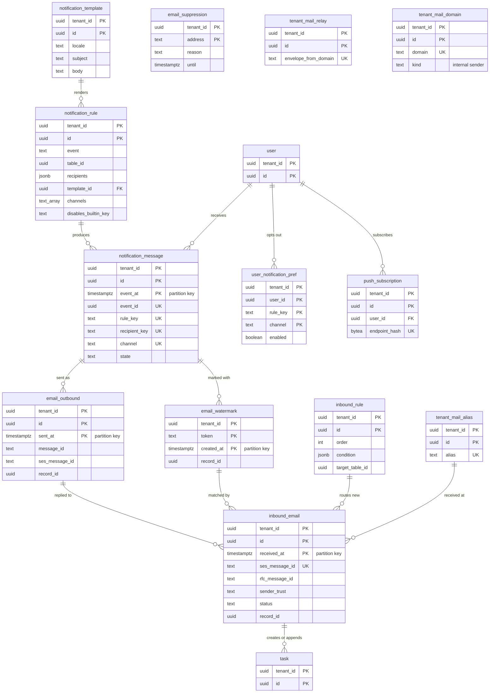

# Data model: 通知とメール

[data-model.md](../data-model.md) の一部。通知の規則とテンプレート、通知（受け手 × 経路の 1 通）、利用者の通知の設定と Web Push の購読、送ったメール・参照の印・抑止のリスト、受けたメール・受信の規則・転送の元・別名・ドメインを定義する。振る舞い（通知の流れ、DT-MAIL-001〜005、ループの防止、流量の上限）は [notifications-and-email-ingest.md](../notifications-and-email-ingest.md) を正とする。受信のアドレス → テナント → セルの対応は制御の面の `inbound_address`（[security-and-operations.md](security-and-operations.md) の 3 節）。

- **通知は `(event_id, rule, recipient, channel)` で 1 回だけ作る**（[ADR-0033](../../decisions/0033-notification-rules-and-outbound-email.md)）。**受けたメールは `(tenant_id, ses_message_id)` で 1 回だけ処理する**（[ADR-0034](../../decisions/0034-inbound-email-threading-and-sender-trust.md)）。
- 組み込みの通知の規則とテンプレートはコードのバージョンだけに持つ。テナントは `stable_key` で無効にし、自分の行で足す（[data-model.md](../data-model.md) の 3.1 節）。

## 1. ER 図

## 2. 通知

### 2.1 `notification_rule`

テナントの通知の規則。組み込みの規則の無効の印も同じ表の行（`disables_builtin_key`）。定義元：[notifications-and-email-ingest.md](../notifications-and-email-ingest.md) の 3.1 節。

| 列 | 型 | NULL | 既定 | 説明 |
| --- | --- | --- | --- | --- |
| `tenant_id` | `uuid` | NOT NULL | — | |
| `id` | `uuid` | NOT NULL | `uuidv7()` | |
| `event` | `text` | NULL | — | `record.inserted`・`record.updated`・`sla.warning`・`sla.breached`・`approval.requested`・`approval.decided`・`page.notify`・`flow.notify`・`kb.feedback`。無効の印の行は NULL |
| `table_id` | `uuid` | NULL | — | |
| `condition` | `jsonb` | NULL | — | 保存の後の値と `changes.<field>` を読める |
| `recipients` | `jsonb` | NOT NULL | `'[]'` | `field:`・`group_members:`・`group_manager`・`watchers`・`users:`・`groups:`・`emails:`（外の宛先 10 まで） |
| `exclude_actor` | `boolean` | NOT NULL | `true` | |
| `template_id` | `uuid` | NULL | — | → `notification_template` |
| `channels` | `text[]` | NOT NULL | `'{email}'` | `email`・`push`・`in_app` |
| `mandatory` | `boolean` | NOT NULL | `false` | 利用者の設定で止められない |
| `disables_builtin_key` | `text` | NULL | — | 組み込みの規則の `stable_key`（この行は無効の印） |
| `active` | `boolean` | NOT NULL | `true` | |
| メタデータの共通の列 | | | | |

- キー：PK `(tenant_id, id)`。UK `(tenant_id, stable_key)`。UK `(tenant_id, disables_builtin_key) WHERE disables_builtin_key IS NOT NULL`。FK `(tenant_id, template_id)` → `notification_template`。
- 索引：`(tenant_id, event, table_id) WHERE active` — Notifier の規則の選択（キャッシュの元）。
- CHECK：`(disables_builtin_key IS NULL) = (event IS NOT NULL AND template_id IS NOT NULL)`、`channels <@ ARRAY['email','push','in_app']`。
- 保持：メタデータ。S1 の量：1 テナント 数十〜数百行。

### 2.2 `notification_template`

件名と本文（制限付きの Markdown）。作成の言語の文言をこの行に持ち、ほかの言語は `translation`（[ui-search-and-reports.md](ui-search-and-reports.md) の 2.6 節）に持つ。組み込みのテンプレートを使うときは複製する。定義元：同じ文書の 4 節。

| 列 | 型 | NULL | 既定 | 説明 |
| --- | --- | --- | --- | --- |
| `tenant_id` | `uuid` | NOT NULL | — | |
| `id` | `uuid` | NOT NULL | `uuidv7()` | |
| `name` | `text` | NOT NULL | — | |
| `locale` | `text` | NOT NULL | — | この行の文言の言語（`ja`・`en`） |
| `subject` | `text` | NOT NULL | — | 差し込み `{{record.number}}` など |
| `body` | `text` | NOT NULL | — | 64 KB まで |
| メタデータの共通の列 | | | | |

- キー：PK `(tenant_id, id)`。UK `(tenant_id, stable_key)`。
- 差し込みの式は保存の時に型検査する（参照のたどりは 2 段まで）。
- 保持：メタデータ。S1 の量：1 テナント 数十〜数百行。

### 2.3 `notification_message`

受け手 × 経路の 1 通。定期のレポートの配信（`rule_key = report_schedule:<id>`）と `in_app` の通知の一覧もこの表。定義元：同じ文書の 3.2・3.6 節、[reports.md](../reports.md) の 10 節。

| 列 | 型 | NULL | 既定 | 説明 |
| --- | --- | --- | --- | --- |
| `tenant_id` | `uuid` | NOT NULL | — | |
| `id` | `uuid` | NOT NULL | `uuidv7()` | SES の再試行の冪等のキーとして記録する |
| `event_id` | `uuid` | NOT NULL | — | outbox の事象の ID（UUIDv7） |
| `event_at` | `timestamptz` | NOT NULL | — | `event_id` の時刻。パーティションのキー（日）。配送の重複でも同じ値 |
| `rule_key` | `text` | NOT NULL | — | 規則の `stable_key`（組み込みもテナントも）、または `report_schedule:<id>` |
| `recipient_key` | `text` | NOT NULL | — | `user:<id>` か `email:<sha256(小文字のアドレス)>` |
| `recipient_user_id` | `uuid` | NULL | — | |
| `recipient_email` | `text` | NULL | — | 外の宛先のとき。PII |
| `channel` | `text` | NOT NULL | — | `email`・`push`・`in_app` |
| `table_id`・`record_id` | `uuid` | NULL | — | |
| `record_version` | `bigint` | NULL | — | 事象の時点のバージョン（本文はこのバージョンの値で作る） |
| `state` | `text` | NOT NULL | `'pending'` | `pending`・`sending`・`sent`・`failed`・`suppressed` |
| `suppress_reason` | `text` | NULL | — | `no_read_access`・`address_suppressed`・`user_pref`・`auto_sender`・`rate_limited_digest` |
| `attempts` | `smallint` | NOT NULL | `0` | |
| `sent_at` | `timestamptz` | NULL | — | |
| `read_at` | `timestamptz` | NULL | — | `in_app` の既読 |
| `version` | `bigint` | NOT NULL | `1` | 状態をバージョンの条件で進める |

- キー：PK `(tenant_id, id, event_at)`。UK `(tenant_id, event_id, rule_key, recipient_key, channel, event_at)`。
- 索引：`(tenant_id, state, event_at) WHERE state IN ('pending','sending')` — 送信の再開（`sending` は 1 回だけ再送）。`(tenant_id, recipient_user_id, event_at DESC) WHERE channel = 'in_app'` — 画面の通知の一覧。
- CHECK：`num_nonnulls(recipient_user_id, recipient_email) = 1`、`state <> 'suppressed' OR suppress_reason IS NOT NULL`。
- パーティション：`event_at` の日。保持：30 日（`DROP`）。S1 の量：1 日 約 150 万行。

### 2.4 `user_notification_pref`

利用者が止めた通知（`mandatory` でない規則だけ）。定義元：同じ文書の 3.2 節。

| 列 | 型 | NULL | 既定 | 説明 |
| --- | --- | --- | --- | --- |
| `tenant_id` | `uuid` | NOT NULL | — | |
| `user_id` | `uuid` | NOT NULL | — | |
| `rule_key` | `text` | NOT NULL | — | 規則の `stable_key` |
| `channel` | `text` | NOT NULL | — | |
| `enabled` | `boolean` | NOT NULL | — | |
| `updated_at` | `timestamptz` | NOT NULL | `now()` | |

- キー：PK `(tenant_id, user_id, rule_key, channel)`。成り代わりの間は書けない。
- 保持：利用者に従う。S1 の量：数十万行。

### 2.5 `push_subscription`

Web Push の購読。本文にレコードの値を入れない。定義元：[portal-and-ui.md](../portal-and-ui.md) の 6.4 節。

| 列 | 型 | NULL | 既定 | 説明 |
| --- | --- | --- | --- | --- |
| `tenant_id` | `uuid` | NOT NULL | — | |
| `id` | `uuid` | NOT NULL | `uuidv7()` | |
| `user_id` | `uuid` | NOT NULL | — | |
| `endpoint_hash` | `bytea` | NOT NULL | — | 購読の URL の SHA-256 |
| `endpoint_ciphertext` | `bytea` | NOT NULL | — | 購読の URL（推測できない値なので暗号化する。テナントの DEK） |
| `p256dh` | `bytea` | NOT NULL | — | 端末の公開鍵 |
| `auth_ciphertext` | `bytea` | NOT NULL | — | 認証の秘密（テナントの DEK） |
| `user_agent` | `text` | NULL | — | |
| `created_at`・`last_success_at` | | | | |
| `expired_at` | `timestamptz` | NULL | — | 404・410 の応答で入れる |

- キー：PK `(tenant_id, id)`。UK `(tenant_id, user_id, endpoint_hash)`。索引 `(tenant_id, user_id) WHERE expired_at IS NULL`。
- 保持：失効の後 7 日で消す。S1 の量：数十万行。

## 3. 送信のメール

### 3.1 `email_outbound`

送ったメールの ID の記録（返信の紐付けの `In-Reply-To`・`References` の照合）。定義元：同じ文書の 3.5 節。

| 列 | 型 | NULL | 既定 | 説明 |
| --- | --- | --- | --- | --- |
| `tenant_id` | `uuid` | NOT NULL | — | |
| `id` | `uuid` | NOT NULL | `uuidv7()` | |
| `sent_at` | `timestamptz` | NOT NULL | `now()` | パーティションのキー（月） |
| `message_id` | `text` | NOT NULL | — | 受け手に届く `Message-ID`（SES の ID から作る。作り方は E6 で固定する） |
| `ses_message_id` | `text` | NOT NULL | — | |
| `notification_message_id` | `uuid` | NOT NULL | — | |
| `table_id`・`record_id` | `uuid` | NOT NULL | — | |
| `recipient_user_id` | `uuid` | NULL | — | |

- キー：PK `(tenant_id, id, sent_at)`。
- 索引：`(tenant_id, message_id)` — 返信の照合（DT-MAIL-001 の 3 行）。`(tenant_id, ses_message_id)` — SES の配信の事象の反映。`(tenant_id, record_id, recipient_user_id, sent_at DESC)` — 次の通知の `In-Reply-To` の値。
- パーティション：`sent_at` の月。保持：90 日以上（月のパーティションを 4 か月分持ち、それより古いものを `DROP`）。S1 の量：1 日 約 100 万行。

### 3.2 `email_watermark`

参照の印（`<Brand>-Ref:` ＋ 20 文字の乱数）。紐付けの手がかりで、権限ではない。定義元：同じ文書の 5.4 節。

| 列 | 型 | NULL | 既定 | 説明 |
| --- | --- | --- | --- | --- |
| `tenant_id` | `uuid` | NOT NULL | — | |
| `token` | `text` | NOT NULL | — | base32 の 20 文字（100 ビット） |
| `created_at` | `timestamptz` | NOT NULL | `now()` | パーティションのキー（月） |
| `notification_message_id` | `uuid` | NOT NULL | — | |
| `table_id`・`record_id` | `uuid` | NOT NULL | — | |
| `recipient_user_id` | `uuid` | NULL | — | |

- キー：PK `(tenant_id, token, created_at)`。索引 `(tenant_id, token)`（全パーティションで引く。乱数なので衝突しない）。
- CHECK：`token ~ '^[A-Z2-7]{20}$'`。
- パーティション：`created_at` の月。保持：1 年（`DROP`）。S1 の量：1 日 約 100 万行。

### 3.3 `email_suppression`

テナントの抑止のリスト（恒久のバウンス・苦情、一時のバウンスが 3 回続いた宛先）。定義元：同じ文書の 3.6 節。

| 列 | 型 | NULL | 既定 | 説明 |
| --- | --- | --- | --- | --- |
| `tenant_id` | `uuid` | NOT NULL | — | |
| `address` | `text` | NOT NULL | — | 小文字。PII |
| `reason` | `text` | NOT NULL | — | `hard_bounce`・`complaint`・`soft_bounce` |
| `soft_bounce_count` | `smallint` | NOT NULL | `0` | |
| `until` | `timestamptz` | NULL | — | NULL は解除まで。一時のバウンスは 7 日 |
| `created_at`・`updated_at` | | | | |

- キー：PK `(tenant_id, address)`。
- 保持：テナント（管理者が解除できる）。S1 の量：数万行。

### 3.4 `tenant_mail_domain`

テナントのメールのドメイン：社内のドメイン（差出人の信頼 DT-MAIL-003 の「登録済みの社内のドメイン」）と、独自のドメインからの送信（DKIM と `MAIL FROM` の確認）。2026-09-28 の統合で最小の形で定義した（同じ文書の 3.3・5.7 節）。

| 列 | 型 | NULL | 既定 | 説明 |
| --- | --- | --- | --- | --- |
| `tenant_id` | `uuid` | NOT NULL | — | |
| `id` | `uuid` | NOT NULL | `uuidv7()` | |
| `domain` | `text` | NOT NULL | — | 小文字、A ラベル |
| `kind` | `text` | NOT NULL | — | `internal`・`sender` |
| `sender_state` | `text` | NULL | — | `sender` のとき：`pending_dns`・`verified`・`failed`（DKIM・SPF・DMARC の揃いを満たすまで有効にしない） |
| `mail_from_subdomain` | `text` | NULL | — | |
| `verified_at` | `timestamptz` | NULL | — | |
| `created_at`・`created_by` | | | | |

- キー：PK `(tenant_id, id)`。UK `(tenant_id, domain, kind)`。
- CHECK：`(kind = 'sender') = (sender_state IS NOT NULL)`。
- 保持：テナント。S1 の量：数百行。

## 4. 受信のメール

### 4.1 `inbound_email`

受けたメール。`mail-router` がセルへ振り分けた後に Ingest が作る。原本はセルの S3（1 年）。定義元：同じ文書の 5.2〜5.8・6・7 節。

| 列 | 型 | NULL | 既定 | 説明 |
| --- | --- | --- | --- | --- |
| `tenant_id` | `uuid` | NOT NULL | — | |
| `id` | `uuid` | NOT NULL | `uuidv7()` | |
| `received_at` | `timestamptz` | NOT NULL | — | SES の受信の時刻（再配送でも同じ）。パーティションのキー（月） |
| `ses_message_id` | `text` | NOT NULL | — | |
| `rfc_message_id` | `text` | NULL | — | |
| `envelope_to` | `text` | NOT NULL | — | 封筒の受け手（テナントの決定に使った値） |
| `alias_id` | `uuid` | NULL | — | → `tenant_mail_alias` |
| `from_address` | `text` | NOT NULL | — | 小文字。PII |
| `envelope_from` | `text` | NULL | — | 空（`<>`）は NULL |
| `subject` | `text` | NULL | — | 復号・NFC の後。PII を含みうる |
| `s3_key` | `text` | NOT NULL | — | 原本 |
| `raw_sha256` | `bytea` | NOT NULL | — | |
| `auto_kind` | `text` | NOT NULL | — | DT-MAIL-004：`own_loop`・`bounce`・`auto_reply`・`auto_generated`・`human` |
| `classification` | `text` | NULL | — | DT-MAIL-001：`auto_reply`・`forward`・`reply`・`new` |
| `sender_trust` | `text` | NULL | — | DT-MAIL-003：`trusted`・`trusted_via_relay`・`untrusted`・`unverified` |
| `virus_verdict` | `text` | NULL | — | SES の判定 |
| `decode_lossy` | `boolean` | NOT NULL | `false` | 置き換えの文字を許して復号した |
| `status` | `text` | NOT NULL | `'received'` | `received`・`processed`・`quarantined`・`duplicate`・`discarded`・`failed` |
| `record_table_id`・`record_id` | `uuid` | NULL | — | 作った・追記したレコード |
| `mismatch` | `jsonb` | NULL | — | 3 行と 4 行が別のレコードを指したときの記録 |
| `error` | `jsonb` | NULL | — | |
| `processed_at` | `timestamptz` | NULL | — | |

- キー：PK `(tenant_id, id, received_at)`。UK `(tenant_id, ses_message_id, received_at)`。
- 索引：`(tenant_id, rfc_message_id, received_at)` — 二重の転送の検出（7 日の中で `raw_sha256` の先頭も同じなら `duplicate`）。`(tenant_id, status, received_at) WHERE status = 'quarantined'` — 担当者の保留の一覧。`(tenant_id, from_address, received_at)` — 流量の上限（Valkey が落ちたときの数え方）。`(tenant_id, record_id, received_at)` — レコードの画面の原本へのリンク。
- CHECK：`status <> 'processed' OR processed_at IS NOT NULL`。
- 取り込みの効果（レコードの作成・コメントの追記・添付）と `status = processed` を 1 つのトランザクションで書く。
- パーティション：`received_at` の月。保持：1 年（`DROP`。L2・L4 の確認待ち）。S1 の量：1 日 約 15 万行。

### 4.2 `inbound_rule`

新しいレコードの作成の受信の規則（最初に一致したもの）。定義元：同じ文書の 5.6 節。

| 列 | 型 | NULL | 既定 | 説明 |
| --- | --- | --- | --- | --- |
| `tenant_id` | `uuid` | NOT NULL | — | |
| `id` | `uuid` | NOT NULL | `uuidv7()` | |
| `order` | `integer` | NOT NULL | `100` | |
| `condition` | `jsonb` | NULL | — | 受け手の別名、差出人のドメイン、件名、信頼の段階 |
| `target_kind` | `text` | NOT NULL | `'table'` | `table`・`record_producer` |
| `target_table_id` | `uuid` | NULL | — | 既定はインシデント |
| `target_item_id` | `uuid` | NULL | — | `record_producer` の品目 |
| `field_map` | `jsonb` | NOT NULL | — | 件名 → `title`、本文 → `description`、差出人 → `requester` など |
| `allow_auto_generated` | `boolean` | NOT NULL | `true` | 監視の道具からのメールなどで作ってよいか |
| `active` | `boolean` | NOT NULL | `true` | |
| メタデータの共通の列 | | | | |

- キー：PK `(tenant_id, id)`。UK `(tenant_id, stable_key)`。索引 `(tenant_id, "order") WHERE active`。
- CHECK：`(target_kind = 'table') = (target_table_id IS NOT NULL)`、`(target_kind = 'record_producer') = (target_item_id IS NOT NULL)`。
- 保持：メタデータ。S1 の量：1 テナント 数十行。

### 4.3 `tenant_mail_relay`・`tenant_mail_alias`

登録した転送の元（`trusted_via_relay` の判定）と、部署ごとの窓口の別名（`<tenant>+<alias>@in.<brand>.<domain>`）。別名は制御の面の `inbound_address` にも写す。定義元：同じ文書の 5.1・5.7 節。

| 表 | 列 |
| --- | --- |
| `tenant_mail_relay` | `tenant_id`、`id`、`envelope_from_domain`（小文字）、`note`、`active`、メタデータの共通の列 |
| `tenant_mail_alias` | `tenant_id`、`id`、`alias`（`[a-z0-9-]{1,32}`）、`default_category`（NULL）、`active`、メタデータの共通の列 |

- キー：どちらも PK `(tenant_id, id)`。`tenant_mail_relay` UK `(tenant_id, envelope_from_domain)`、`tenant_mail_alias` UK `(tenant_id, alias)`。
- `tenant_mail_alias` の追加・削除は、同じ操作で制御の面の `inbound_address` を更新する（制御の面の API。失敗したらセルの行を作らない）。
- 保持：メタデータ。S1 の量：数千行。
