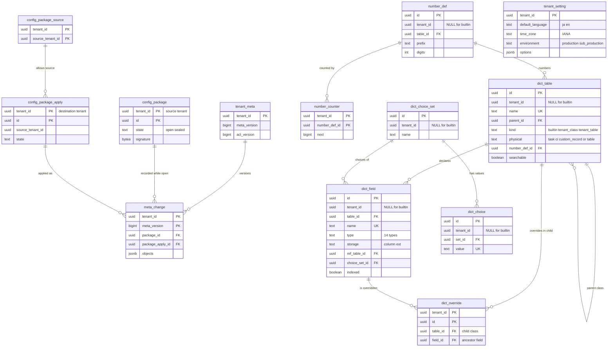

# Data model: 辞書とメタデータの基盤

[data-model.md](../data-model.md) の一部。テナントの設定、データ辞書（テーブル・フィールド・上書き・選択肢）、番号、メタデータの版、設定のパッケージの表を定義する。振る舞い（保存の流れ、型の検証、2 段の削除、パッケージのプレビュー）は [data-dictionary-and-tables.md](../data-dictionary-and-tables.md) を正とする。規約（ID、RLS、NULL の行、共通の列）は [data-model.md](../data-model.md) の 3 節にある。

- 「メタデータの共通の列」は `stable_key`、`rev`、`content_hash`、`updated_in_version`、`deleted_at`、`created_at`、`created_by`、`updated_at`、`updated_by` の 9 列（[data-model.md](../data-model.md) の 3.9 節）。表では 1 行にまとめて書く。
- NULL の行を持つ表（`dict_table`、`dict_field`、`dict_choice_set`、`dict_choice`、`number_def`）は、主キーを `id` だけにし、参照の先が同じテナントか NULL の行であることをトリガー `check_shared_ref()` で確かめる（[data-model.md](../data-model.md) の 3.3 節）。

## 1. ER 図

## 2. テナントの設定と版

### 2.1 `tenant_setting`

テナントの既定の値（言語、タイムゾーン、環境、業務の既定）。1 テナント 1 行。テナントの作成の時に作る。2026-09-28 の統合で足した（各文書の「テナントの設定」の置き場所）。

| 列 | 型 | NULL | 既定 | 説明 |
| --- | --- | --- | --- | --- |
| `tenant_id` | `uuid` | NOT NULL | — | |
| `default_language` | `text` | NOT NULL | `'ja'` | `ja`・`en`（[portal-and-ui.md](../portal-and-ui.md) の 7.1 節） |
| `time_zone` | `text` | NOT NULL | `'Asia/Tokyo'` | IANA の名前。表示と日次のジョブの境目 |
| `environment` | `text` | NOT NULL | — | `production`・`sub_production`。制御の面の台帳の写し（[ADR-0002](../../decisions/0002-tenancy-and-isolation.md)） |
| `options` | `jsonb` | NOT NULL | `'{}'` | 小さな業務の既定。キーは Zod で検証する：`reopen_window_days`（14）、`auto_close_days`（7、0〜30）、`accept_unregistered_sender`（偽）、`treat_unverified_as_untrusted`（偽）、`show_unreadable_changes_on_schedule`（偽）、`assignee_overlap_check`（真）、`prod_package_apply_requires_approval`（真）、`default_assignment_group`（テーブルの ID → グループの ID。割り当ての規則に一致がないとき）。ログインと成り代わりの方針は `tenant_auth_policy`（[identity-and-access.md](identity-and-access.md) の 6.3 節）に持つ |
| `version` | `bigint` | NOT NULL | `1` | |
| `updated_at`・`updated_by` | `timestamptz`・`uuid` | NOT NULL・NULL | — | |

- キー：PK `(tenant_id)`。
- CHECK：`default_language IN ('ja','en')`、`environment IN ('production','sub_production')`。
- 設定の変更はメタデータの変更として `meta_version` を上げる（[ADR-0010](../../decisions/0010-metadata-versions-and-config-packages.md)）。パッケージでは移さない（テナントごとの値）。
- 保持：テナント。S1 の量：300 行。

### 2.2 `tenant_meta`

メタデータの版と ACL の版。要求・ステップの始めに同じ往復で読む。定義元：[data-dictionary-and-tables.md](../data-dictionary-and-tables.md) の 9.1 節、[access-control.md](../access-control.md) の 7 節。

| 列 | 型 | NULL | 既定 | 説明 |
| --- | --- | --- | --- | --- |
| `tenant_id` | `uuid` | NOT NULL | — | |
| `meta_version` | `bigint` | NOT NULL | `1` | 単調に増える。メタデータの変更のトランザクションで 1 上げる |
| `acl_version` | `bigint` | NOT NULL | `1` | ロール・所属・利用者の属性・ACL の変更で 1 上げる |
| `updated_at` | `timestamptz` | NOT NULL | `now()` | |

- キー：PK `(tenant_id)`。
- CHECK：`meta_version > 0`、`acl_version > 0`。更新のトリガーで減る値を拒む。
- 同じテナントのメタデータの変更は、この行の `FOR UPDATE` で直列になる。
- 保持：テナント。S1 の量：300 行。

### 2.3 `meta_change`

メタデータの変更の記録（追記だけ）。定義元：[data-dictionary-and-tables.md](../data-dictionary-and-tables.md) の 9.1 節。

| 列 | 型 | NULL | 既定 | 説明 |
| --- | --- | --- | --- | --- |
| `tenant_id` | `uuid` | NOT NULL | — | |
| `meta_version` | `bigint` | NOT NULL | — | この変更で上がった後の版 |
| `committed_at` | `timestamptz` | NOT NULL | `now()` | |
| `actor_id` | `uuid` | NOT NULL | — | → `user` |
| `real_actor_id` | `uuid` | NULL | — | 成り代わりのときの本人 |
| `package_id` | `uuid` | NULL | — | 作業のパッケージを開いている間の変更（→ `config_package`） |
| `package_apply_id` | `uuid` | NULL | — | パッケージの適用のとき（→ `config_package_apply`） |
| `objects` | `jsonb` | NOT NULL | — | `[{kind, stable_key, id, op, before_hash, after_hash}]` |

- キー：PK `(tenant_id, meta_version)`。FK `(tenant_id, package_id)` → `config_package`、`(tenant_id, package_apply_id)` → `config_package_apply`。
- 索引：`(tenant_id, package_id) WHERE package_id IS NOT NULL` — パッケージを固めるときに変更を集める。`(tenant_id, committed_at DESC)` — 管理の画面の変更の履歴。
- アプリのロールは `INSERT`・`SELECT` だけ（追記だけ）。
- 保持：監査と同じ 7 年（[security.md](../security.md) の 9 節）。パーティションを持たない（量が小さい）ので、保守のジョブが古い行を消す。S1 の量：1 テナント 1 日 数百行、全体で年 1,000 万行。

## 3. 辞書

### 3.1 `dict_table`

テーブル（クラス）の定義。組み込みは NULL の行。定義元：[data-dictionary-and-tables.md](../data-dictionary-and-tables.md) の 3.2 節。

| 列 | 型 | NULL | 既定 | 説明 |
| --- | --- | --- | --- | --- |
| `id` | `uuid` | NOT NULL | `uuidv7()` | 組み込みはコードの版で固定の値 |
| `tenant_id` | `uuid` | NULL | — | 組み込みは NULL |
| `name` | `text` | NOT NULL | — | 内部の名前。作成の後に変えない。テナントは `c_` で始める |
| `label` | `text` | NOT NULL | — | 作成の時の言語の文言。訳は `translation` |
| `parent_id` | `uuid` | NULL | — | 親のクラス（→ `dict_table`）。独立のテーブルは NULL |
| `kind` | `text` | NOT NULL | — | `builtin`・`tenant_class`・`tenant_table` |
| `physical` | `text` | NOT NULL | — | 置く物理の表：`task`・`ci`・`custom_record`・専用の表の名前（`user`、`kb_article` など） |
| `depth` | `smallint` | NOT NULL | — | ルートからの段（0 始まり）。保存の時に計算する |
| `audited` | `boolean` | NOT NULL | `true` | 組み込みは常に真（止められない） |
| `requires_explicit_approval` | `boolean` | NOT NULL | `false` | 承認の期限切れの自動の承認を禁止する（[ADR-0016](../../decisions/0016-approvals.md)）。`change` は組み込みで真 |
| `number_def_id` | `uuid` | NULL | — | → `number_def` |
| `display_field_id` | `uuid` | NULL | — | 参照の表示の値に使うフィールド（→ `dict_field`） |
| `searchable` | `boolean` | NOT NULL | `false` | 検索の索引 `record` に入れるか（[search.md](../search.md) の 3 節） |
| メタデータの共通の列 | | | | `deleted_at` はテナントのテーブルの削除（行が 0 件のときだけ） |

- キー：PK `(id)`。FK `parent_id` → `dict_table(id)`、`number_def_id` → `number_def(id)`、`display_field_id` → `dict_field(id)`（どれも `check_shared_ref()` で同じテナントか NULL の行）。UK `NULLS NOT DISTINCT (tenant_id, name)`。UK `(tenant_id, id)`（テナントの行からの複合の参照のため）。
- 索引：`(tenant_id, parent_id)` — 子のクラスの一覧と継承のたどり。
- CHECK：`tenant_id IS NULL OR name LIKE 'c\_%'`、`(kind = 'builtin') = (tenant_id IS NULL)`、`depth BETWEEN 0 AND 5`（6 段まで）、`kind <> 'tenant_table' OR parent_id IS NULL`。
- 保持：メタデータ。S1 の量：組み込み 約 80 行、テナントの行は 1 テナント 500 まで（全体で数万行）。

### 3.2 `dict_field`

フィールドの定義。組み込みは NULL の行。定義元：同じ文書の 3.2・3.3・4.3・6 節。

| 列 | 型 | NULL | 既定 | 説明 |
| --- | --- | --- | --- | --- |
| `id` | `uuid` | NOT NULL | `uuidv7()` | `ext` のキー（短い形）にも使う |
| `tenant_id` | `uuid` | NULL | — | |
| `table_id` | `uuid` | NOT NULL | — | 宣言したクラス（→ `dict_table`） |
| `name` | `text` | NOT NULL | — | 内部の名前。参照のフィールドは `_id` を付けない名前（`assignment_group`）。作成の後に変えない |
| `label` | `text` | NOT NULL | — | |
| `type` | `text` | NOT NULL | — | 14 種：`string`・`text`・`integer`・`decimal`・`boolean`・`date`・`datetime`・`duration`・`choice`・`reference`・`email`・`url`・`journal`・`condition` |
| `storage` | `text` | NOT NULL | — | `column`（型付きの列）・`ext`・`none`（`journal`） |
| `column_name` | `text` | NULL | — | `storage = column` のとき。参照は `<name>_id` |
| `max_length` | `integer` | NULL | — | `string`（既定 255、上限 4,000） |
| `precision`・`scale` | `smallint` | NULL | — | `decimal` |
| `ref_table_id` | `uuid` | NULL | — | `reference` の参照先（→ `dict_table`） |
| `ref_condition` | `jsonb` | NULL | — | 参照の絞り込みの式の木 |
| `on_delete` | `text` | NULL | `'clear'` | `reference`：`restrict`・`clear`・`cascade` |
| `choice_set_id` | `uuid` | NULL | — | `choice`（→ `dict_choice_set`） |
| `mandatory`・`read_only` | `boolean` | NOT NULL | `false` | |
| `default_expr` | `jsonb` | NULL | — | 既定値の式 |
| `indexed` | `boolean` | NOT NULL | `false` | `ext_index` に写すか。`reference` は常に真 |
| `index_state` | `text` | NOT NULL | `'none'` | `none`・`building`（写すジョブの途中。「索引の準備中」）・`ready` |
| `searchable` | `boolean` | NOT NULL | `false` | 検索の入れ子の枠に入れるか。`string`・`text` だけ、1 テーブル 20 まで |
| `audited` | `boolean` | NOT NULL | `true` | 外せるのはテナントのフィールドだけ |
| `help` | `text` | NULL | — | |
| `hidden_at` | `timestamptz` | NULL | — | 2 段の削除の 1 段目 |
| `purge_after` | `timestamptz` | NULL | — | `hidden_at + 30 日`。値を消すジョブの時刻 |
| メタデータの共通の列 | | | | `stable_key` は `field:<table>.<field>` |

- キー：PK `(id)`。FK `table_id`・`ref_table_id` → `dict_table(id)`、`choice_set_id` → `dict_choice_set(id)`（`check_shared_ref()`）。UK `NULLS NOT DISTINCT (tenant_id, table_id, name)`。UK `(tenant_id, id)`。
- 索引：`(table_id, tenant_id)` — 実効の辞書のコンパイル（組み込み ＋ テナント）。`(purge_after) WHERE purge_after IS NOT NULL` — 値を消すジョブ。`(tenant_id, ref_table_id) WHERE type = 'reference'` — 参照先の削除の逆引き。
- CHECK：`tenant_id IS NULL OR name LIKE 'c\_%'`、`(storage = 'column') = (column_name IS NOT NULL)`、`type <> 'reference' OR (ref_table_id IS NOT NULL AND indexed)`、`type <> 'choice' OR choice_set_id IS NOT NULL`、`NOT searchable OR type IN ('string','text')`、`tenant_id IS NULL OR storage <> 'column'`（テナントのフィールドは `ext` だけ）。
- 上限（1 クラスと祖先のテナントのフィールド 300、索引 20、参照 50）は保存の時にアプリで数える（[ADR-0007](../../decisions/0007-physical-layout-and-extension-index.md)）。
- 保持：メタデータ。S1 の量：組み込み 約 1,500 行、テナントの行は全体で数十万行。

### 3.3 `dict_override`

子のクラスでの、祖先のフィールドの属性の上書き。テナントの行だけ（組み込みの上書きはコードの版の中で解いてから `dict_field` に入れる）。定義元：同じ文書の 3.2 節。

| 列 | 型 | NULL | 既定 | 説明 |
| --- | --- | --- | --- | --- |
| `tenant_id` | `uuid` | NOT NULL | — | |
| `id` | `uuid` | NOT NULL | `uuidv7()` | |
| `table_id` | `uuid` | NOT NULL | — | 上書きするクラス（→ `dict_table`） |
| `field_id` | `uuid` | NOT NULL | — | 祖先のフィールド（→ `dict_field`） |
| `label`・`help` | `text` | NULL | — | NULL は上書きしない |
| `default_expr`・`ref_condition` | `jsonb` | NULL | — | |
| `mandatory`・`read_only`・`hidden` | `boolean` | NULL | — | `hidden` は組み込みのフィールドを画面から隠す |
| `choice_set_id` | `uuid` | NULL | — | 選択肢の集合の差し替え（値の追加は `dict_choice` のテナントの行） |
| メタデータの共通の列 | | | | |

- キー：PK `(tenant_id, id)`。UK `(tenant_id, table_id, field_id) WHERE deleted_at IS NULL`。FK `table_id`・`field_id`・`choice_set_id` は `check_shared_ref()`。
- 型・保存の場所・参照先の表は上書きできない（列を持たない）。
- 保持：メタデータ。S1 の量：全体で数万行。

### 3.4 `dict_choice_set`・`dict_choice`

選択肢の集合と値。定義元：同じ文書の 3.2 節。

`dict_choice_set`：

| 列 | 型 | NULL | 既定 | 説明 |
| --- | --- | --- | --- | --- |
| `id` | `uuid` | NOT NULL | `uuidv7()` | |
| `tenant_id` | `uuid` | NULL | — | |
| `name` | `text` | NOT NULL | — | `incident_state`、`hold_reason` など |
| メタデータの共通の列 | | | | |

`dict_choice`：

| 列 | 型 | NULL | 既定 | 説明 |
| --- | --- | --- | --- | --- |
| `id` | `uuid` | NOT NULL | `uuidv7()` | |
| `tenant_id` | `uuid` | NULL | — | 組み込みの集合へのテナントの値の追加はテナントの行 |
| `set_id` | `uuid` | NOT NULL | — | → `dict_choice_set` |
| `value` | `text` | NOT NULL | — | 保存する値 |
| `label` | `text` | NOT NULL | — | |
| `order` | `integer` | NOT NULL | `0` | 予約語（[data-model.md](../data-model.md) の 3.8 節） |
| `inactive` | `boolean` | NOT NULL | `false` | 既存の値のままなら保存を許す |
| `dependent_value` | `text` | NULL | — | 依存する選択肢の親の値 |
| メタデータの共通の列 | | | | |

- キー：両方 PK `(id)`。`dict_choice_set` UK `NULLS NOT DISTINCT (tenant_id, name)`。`dict_choice` UK `NULLS NOT DISTINCT (tenant_id, set_id, value)`、FK `set_id` は `check_shared_ref()`。
- CHECK：集合の値の数 1,000 まではアプリで数える。
- 保持：メタデータ。S1 の量：組み込み 約 800 値。

## 4. 番号

### 4.1 `number_def`

番号の定義。組み込みは NULL の行。テナントの接頭辞・桁の変更は、同じ `table_id` のテナントの行で上書きする。定義元：同じ文書の 8 節。

| 列 | 型 | NULL | 既定 | 説明 |
| --- | --- | --- | --- | --- |
| `id` | `uuid` | NOT NULL | `uuidv7()` | |
| `tenant_id` | `uuid` | NULL | — | |
| `table_id` | `uuid` | NOT NULL | — | → `dict_table` |
| `prefix` | `text` | NOT NULL | — | `INC`・`PRB`・`CHG`・`REQ`・`RQI`・`FTK`・`PRT`・`CHT`・`KB` |
| `digits` | `smallint` | NOT NULL | `7` | 超えたら桁を増やして続ける |
| `start` | `bigint` | NOT NULL | `1` | |
| メタデータの共通の列 | | | | |

- キー：PK `(id)`。UK `NULLS NOT DISTINCT (tenant_id, table_id)`。
- CHECK：`prefix ~ '^[A-Z]{2,8}$'`、`digits BETWEEN 4 AND 12`、`start >= 1`。
- 保持：メタデータ。S1 の量：組み込み 9 行。

### 4.2 `number_counter`

テナント・番号の定義ごとの数。保存とは別の短いトランザクションで `UPDATE ... RETURNING` する（[ADR-0008](../../decisions/0008-record-numbering.md)）。

| 列 | 型 | NULL | 既定 | 説明 |
| --- | --- | --- | --- | --- |
| `tenant_id` | `uuid` | NOT NULL | — | |
| `number_def_id` | `uuid` | NOT NULL | — | 使っている定義（組み込みの行かテナントの行） |
| `next` | `bigint` | NOT NULL | — | 次に払い出す数 |

- キー：PK `(tenant_id, number_def_id)`。FK `number_def_id` は `check_shared_ref()`。
- CHECK：`next >= 1`。減らす更新はトリガーで拒む（巻き戻しの誤りを防ぐ。runbook `number-counter-exhausted-or-reset.md`）。
- テナントの移動では、そのまま写す（[infrastructure.md](../infrastructure.md) の 4.2 節）。
- 保持：テナント。S1 の量：1 テナント 10 行ほど。

## 5. 設定のパッケージ

### 5.1 `config_package`

元のテナントで作るパッケージ。開いている間は `meta_change.package_id` で変更を集め、閉じると固めて署名する。定義元：同じ文書の 10.3 節。

| 列 | 型 | NULL | 既定 | 説明 |
| --- | --- | --- | --- | --- |
| `tenant_id` | `uuid` | NOT NULL | — | 元のテナント |
| `id` | `uuid` | NOT NULL | `uuidv7()` | |
| `name` | `text` | NOT NULL | — | |
| `state` | `text` | NOT NULL | `'open'` | `open`・`sealed`・`discarded` |
| `body` | `jsonb` | NULL | — | 固めた後の JSON（形は [stores.md](stores.md) の 6.1 節）。5,000 項目まで |
| `body_sha256` | `bytea` | NULL | — | |
| `signature` | `bytea` | NULL | — | セルの `signing` の鍵での署名 |
| `item_count` | `integer` | NULL | — | |
| `created_at`・`created_by`・`sealed_at`・`sealed_by` | | | | |

- キー：PK `(tenant_id, id)`。UK `(tenant_id, created_by) WHERE state = 'open'`（1 人が「今のパッケージ」にできるのは 1 つ）。
- CHECK：`(state = 'sealed') = (body IS NOT NULL AND signature IS NOT NULL)`、`item_count <= 5000`。固めた行は更新のトリガーで変えさせない。
- 保持：テナント（`tenant_admin` が消すまで）。S1 の量：1 テナント 年 数百行。

### 5.2 `config_package_apply`

移送先での、パッケージのプレビューと適用の記録。パッケージの JSON は、元のテナントでダウンロードしたものを移送先にアップロードして受ける（テナントをまたいで DB を読まない。署名と `config_package_source` で確かめる）。定義元：同じ文書の 10.4・10.5 節。

| 列 | 型 | NULL | 既定 | 説明 |
| --- | --- | --- | --- | --- |
| `tenant_id` | `uuid` | NOT NULL | — | 移送先のテナント |
| `id` | `uuid` | NOT NULL | `uuidv7()` | |
| `source_tenant_id` | `uuid` | NOT NULL | — | |
| `source_package_id` | `uuid` | NOT NULL | — | 元のテナントの `config_package.id`（外部キーなし） |
| `package` | `jsonb` | NOT NULL | — | 受けたパッケージの本文と署名 |
| `package_sha256` | `bytea` | NOT NULL | — | |
| `state` | `text` | NOT NULL | `'previewed'` | `previewed`・`awaiting_approval`・`applied`・`failed`・`cancelled` |
| `preview` | `jsonb` | NOT NULL | — | 項目ごとの DT-PKG-001 の判定 |
| `resolutions` | `jsonb` | NOT NULL | `'{}'` | 衝突ごとの人の選択（`take_package`・`keep_target`） |
| `before_content` | `jsonb` | NULL | — | 適用の前の各項目の内容（取り消しの逆のパッケージの元） |
| `approval_set_id` | `uuid` | NULL | — | 本番への適用の別の人の承認（→ `approval_set`） |
| `reverses_apply_id` | `uuid` | NULL | — | 取り消しの適用のとき、元の適用 |
| `applied_meta_version` | `bigint` | NULL | — | |
| `error` | `jsonb` | NULL | — | `failed` の理由 |
| `created_at`・`created_by`・`applied_at`・`applied_by` | | | | |

- キー：PK `(tenant_id, id)`。FK `(tenant_id, source_tenant_id)` → `config_package_source`、`(tenant_id, approval_set_id)` → `approval_set`、`(tenant_id, reverses_apply_id)` → `config_package_apply`。
- 索引：`(tenant_id, source_package_id, state)` — 同じパッケージの 2 回目の適用の検出（PROP-PKG-001 では 2 回目はすべて「飛ばす」）。
- CHECK：`(state = 'applied') = (applied_meta_version IS NOT NULL)`。
- 保持：監査と同じ 7 年。S1 の量：1 テナント 年 数百行。

### 5.3 `config_package_source`

移送の元として受けてよいテナントの組（顧客の設定）。2026-09-28 の統合で足した（同じ文書の 10.1 節の「移送の元と先の組を登録する」の置き場所）。

| 列 | 型 | NULL | 既定 | 説明 |
| --- | --- | --- | --- | --- |
| `tenant_id` | `uuid` | NOT NULL | — | 移送先 |
| `source_tenant_id` | `uuid` | NOT NULL | — | 元。同じ顧客・同じセルのテナント |
| `created_at`・`created_by` | | | | |

- キー：PK `(tenant_id, source_tenant_id)`。
- 同じ顧客・同じセルであることは、登録の時に制御の面の台帳の写しで確かめる（[ADR-0002](../../decisions/0002-tenancy-and-isolation.md)）。
- 保持：テナント。S1 の量：数百行。
