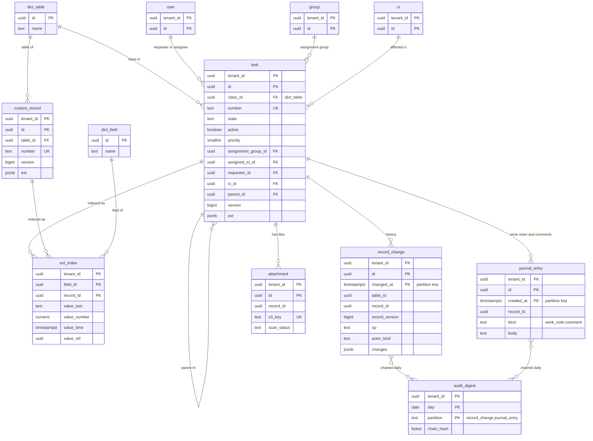

# Data model: レコードと監査の履歴

[data-model.md](../data-model.md) の一部。タスクの階層の物理の表 `task`、テナントの独立のテーブルの `custom_record`、テナントのフィールドの索引 `ext_index`、監査の履歴・作業メモ・日次のハッシュの鎖、添付ファイルを定義する。CI の物理の表 `ci` は [cmdb.md](cmdb.md) にある。振る舞いは [data-dictionary-and-tables.md](../data-dictionary-and-tables.md) の 4・5・7 節、[itsm-processes.md](../itsm-processes.md)、[service-catalog-and-requests.md](../service-catalog-and-requests.md) を正とする。

- **テナントテーブルの読み書きは Record Service だけが行う**（[ADR-0001](../../decisions/0001-platform-and-stack.md)）。行の `version` の条件付きの更新、`ext` と `ext_index` の同じトランザクションの書き込み、`record_change` の追記を、保存の流れ（同じ文書の 5 節）で守る。
- 「レコードの共通の列」は `version`、`created_at`、`created_by`、`updated_at`、`updated_by` の 5 列（[data-model.md](../data-model.md) の 3.9 節）。

## 1. ER 図

## 2. `task`

タスクの階層のすべてのクラス（`task`、`incident`、`problem`、`change`、`request`、`request_item`、`catalog_task`、`problem_task`、`change_task`、`incident_task`、`kb_feedback_task`、`ci_duplicate_task`、テナントの子のクラス）を 1 つの表に置く（[ADR-0003](../../decisions/0003-table-hierarchy-and-extensible-schema.md)、[ADR-0007](../../decisions/0007-physical-layout-and-extension-index.md)）。組み込みの子のクラスの列は型付きの列で持ち、そのクラスの行だけが値を持つ（ほかは NULL）。テナントのフィールドは `ext`。

### 2.1 列（全クラス共通）

定義元：[data-dictionary-and-tables.md](../data-dictionary-and-tables.md) の 4.1 節、[cmdb-and-reconciliation.md](../cmdb-and-reconciliation.md) の 9 節、[assignment-and-on-call.md](../assignment-and-on-call.md) の 12 節。

| 列 | 型 | NULL | 既定 | 説明 |
| --- | --- | --- | --- | --- |
| `tenant_id` | `uuid` | NOT NULL | — | |
| `id` | `uuid` | NOT NULL | `uuidv7()` | |
| `class_id` | `uuid` | NOT NULL | — | → `dict_table`。作成の後に変えない |
| `number` | `text` | NOT NULL | — | `INC0001234`。番号の定義の接頭辞を含む |
| `state` | `text` | NOT NULL | — | 状態のモデル（クラスごと。[itsm-processes.md](../itsm-processes.md) の 3 節）の値 |
| `active` | `boolean` | NOT NULL | `true` | 状態のカテゴリが `closed`・`cancelled` で偽 |
| `priority` | `smallint` | NULL | — | 1（緊急）〜5（計画） |
| `impact`・`urgency` | `smallint` | NULL | — | 1（高）〜3（低） |
| `assignment_group_id` | `uuid` | NULL | — | → `group` |
| `assigned_to_id` | `uuid` | NULL | — | → `user` |
| `opened_by_id` | `uuid` | NOT NULL | — | → `user`（システムが入れる） |
| `requester_id` | `uuid` | NULL | — | → `user` |
| `ci_id` | `uuid` | NULL | — | → `ci` |
| `service_offering_id` | `uuid` | NULL | — | → `ci`（`service_offering` のクラス） |
| `category` | `text` | NULL | — | 選択肢（クラスごとの集合） |
| `title` | `text` | NOT NULL | — | 短い説明。255 文字まで |
| `description` | `text` | NULL | — | 64 KB まで |
| `channel` | `text` | NOT NULL | `'ui'` | 起票の経路：`ui`・`portal`・`email`・`api`・`import`・`flow`・`agent_on_behalf` |
| `watchers` | `uuid[]` | NOT NULL | `'{}'` | → `user` の ID の配列（見守り）。100 人まで |
| `parent_id` | `uuid` | NULL | — | 親のタスク（→ `task`）。要求の品目は要求、実行のタスクは要求の品目 |
| `opened_at` | `timestamptz` | NOT NULL | `now()` | |
| `due_at` | `timestamptz` | NULL | — | |
| `resolved_at`・`resolved_by_id` | `timestamptz`・`uuid` | NULL | — | 効果 `set_resolved` が入れる |
| `closed_at` | `timestamptz` | NULL | — | 効果 `set_closed` が入れる |
| `reassignment_count` | `integer` | NOT NULL | `0` | 担当のグループの付け替えの回数 |
| `ext` | `jsonb` | NOT NULL | `'{}'` | テナントのフィールド。キーはフィールドの ID。64 KB まで |
| レコードの共通の列 | | | | `version` は保存ごとに 1 上げる |

### 2.2 列（クラスに固有）

| クラス | 列（型） | 定義元 |
| --- | --- | --- |
| `incident` | `hold_reason`（`text`：`awaiting_requester`・`awaiting_vendor`・`awaiting_problem`・`awaiting_change` ＋ テナントの値）、`resolution_code`（`text`）、`resolution_notes`（`text`）、`reopen_count`（`integer`、既定 0）、`auto_close_at`（`timestamptz`）、`priority_computed`（`smallint`）、`priority_override`（`boolean`、既定 偽）、`priority_override_reason`（`text`）、`major`（`boolean`、既定 偽）、`major_manager_id`（`uuid` → `user`）、`problem_id`（`uuid` → `task`）、`duplicate_of_id`（`uuid` → `task`）、`reopened_from_id`（`uuid` → `task`）、`cancel_reason`（`text`）、`problem_waiver_reason`（`text`）、`external_requester_email`（`text`、PII） | [itsm-processes.md](../itsm-processes.md) の 4〜6 節、[notifications-and-email-ingest.md](../notifications-and-email-ingest.md) の 5.6 節 |
| `problem` | `known_error`（`boolean`、既定 偽）、`workaround`・`cause_notes`・`fix_notes`（`text`）。`resolution_code`・`cancel_reason`・`duplicate_of_id` はインシデントと同じ列 | 同上の 7 節 |
| `change` | `change_type`（`text`：`normal`・`standard`・`emergency`）、`risk`（`smallint` 1〜4）、`risk_source`（`text`：`rule`・`questionnaire`・`default`）、`planned_start`・`planned_end`・`actual_start`・`actual_end`（`timestamptz`）、`implementation_plan`・`backout_plan`・`test_plan`・`justification`・`review_notes`（`text`）、`std_template_version_id`（`uuid` → `std_change_template_version`）、`conflict_status`（`text`：`none`・`warning`・`blocking`・`not_checked`、既定 `not_checked`）、`conflict_checked_at`（`timestamptz`）、`conflict_truncated`（`boolean`、既定 偽。衝突が 1,000 件を超えた）、`cab_required`（`boolean`）、`cab_meeting_id`（`uuid` → `cab_meeting`）、`emergency_post_review_required`（`boolean`）、`backout_performed`（`boolean`）。`resolution_code`・`resolution_notes`・`cancel_reason` は共有 | 同上の 8 節 |
| `problem_task`・`change_task`・`incident_task`・`catalog_task`・テナントの子 | `task_kind`（`text`。クラスごとの選択肢：実施・テスト・切り戻し、調査・回避策の検証、`fulfillment`・`approval_prep` など）、`required`（`boolean`。変更のタスクの完了の条件）、`planned_start`・`planned_end`（変更のタスク） | 同上の 7.3・8.4 節、[service-catalog-and-requests.md](../service-catalog-and-requests.md) の 5.1 節 |
| `request` | `requested_by_id`・`requested_for_id`（`uuid` → `user`）、`submission_key`（`uuid`。24 時間の後に NULL にする）、`approval_state`（`text`：`requested`・`approved`・`rejected`）、`stage`（`text`：`waiting_approval`・`fulfillment`・`attention`・`completed`・`closed_rejected`・`cancelled`） | [service-catalog-and-requests.md](../service-catalog-and-requests.md) の 5 節 |
| `request_item` | `item_id`（`uuid` → `catalog_item`）、`item_version_id`（`uuid` → `catalog_item_version`）、`quantity`（`integer`、既定 1）、`answers`（`jsonb`：`{variable_id: 値}`）、`fulfillment_run_id`（`uuid` → `flow_run`）、`stage`（`text`：`waiting_approval`・`approved`・`fulfillment`・`completed`・`rejected`・`cancelled`・`fulfillment_failed`）、`approval_state`。`requested_by_id`・`requested_for_id` は要求の写し（ACL の述語を 1 表で書くため） | 同上 |
| `kb_feedback_task` | `kb_article_id`（`uuid` → `kb_article`）、`feedback_reason`（`text`：`flag`・`low_rating`・`periodic_review`・`source_changed`）、`flag_count`（`integer`） | [knowledge.md](../knowledge.md) の 7.1 節 |
| `ci_duplicate_task` | `ci_hold_id`（`uuid` → `ci_hold`）、`candidate_ci_ids`（`uuid[]`） | [cmdb-and-reconciliation.md](../cmdb-and-reconciliation.md) の 5.5 節 |

- 参照の列は `<name>_id`、辞書のフィールドの名前は `_id` を除いた名前（`assigned_to`、`duplicate_of`）にする（[data-model.md](../data-model.md) の 3.8 節）。
- `answers` を `ext` に入れないのは、品目ごとに変数が違い、フィールドの上限と辞書の管理に合わないためである（[service-catalog-and-requests.md](../service-catalog-and-requests.md) の 4.3 節）。

### 2.3 キー・索引・CHECK

- キー：PK `(tenant_id, id)`。UK `(tenant_id, number)`。UK `(tenant_id, requested_by_id, submission_key) WHERE submission_key IS NOT NULL`（申請の冪等。24 時間）。
- FK（組み込みの型付きの列どうし。すべて `tenant_id` を含む複合）：`(tenant_id, assignment_group_id)` → `group`、`(tenant_id, assigned_to_id)`・`opened_by_id`・`requester_id`・`resolved_by_id`・`major_manager_id`・`requested_by_id`・`requested_for_id` → `user`、`(tenant_id, ci_id)`・`service_offering_id` → `ci`、`(tenant_id, parent_id)`・`problem_id`・`duplicate_of_id`・`reopened_from_id` → `task`、`(tenant_id, std_template_version_id)` → `std_change_template_version`、`(tenant_id, cab_meeting_id)` → `cab_meeting`、`(tenant_id, item_version_id)` → `catalog_item_version`、`(tenant_id, fulfillment_run_id)` → `flow_run`、`(tenant_id, kb_article_id)` → `kb_article`、`(tenant_id, ci_hold_id)` → `ci_hold`。`class_id` → `dict_table(id)`（`check_shared_ref()`）。`watchers` の要素は Record Service が確かめる（配列に外部キーを張れない）。
- 索引（すべて `tenant_id` を先頭に置く）：

| 索引 | 支える問い合わせ |
| --- | --- |
| `(tenant_id, assignment_group_id, active, updated_at)` | グループのキュー（担当の画面の主なリスト） |
| `(tenant_id, assigned_to_id) WHERE active` | 自分の担当 |
| `(tenant_id, class_id, state) WHERE active` | クラス・状態ごとの進行中の一覧、件数 |
| `(tenant_id, requester_id, opened_at)` | ポータルの自分のチケット、依頼者の ACL の述語 |
| `(tenant_id, requested_for_id, opened_at) WHERE requested_for_id IS NOT NULL` | 自分のための要求 |
| `(tenant_id, ci_id) WHERE active` | CI の画面の進行中のタスク、影響の範囲 |
| `(tenant_id, parent_id)` | 子のインシデント、要求の品目、実行のタスク（`cascade_children`、要求の状態の導出） |
| `(tenant_id, problem_id) WHERE problem_id IS NOT NULL` | 問題の解決の伝播（`awaiting_problem` の保留） |
| `(tenant_id, planned_start, planned_end) WHERE change_type IS NOT NULL AND state IN ('authorize','scheduled','implement')` | 変更の予定表と衝突の `ctx` |
| `(tenant_id, auto_close_at) WHERE state = 'resolved'` | 自動の完了の見落としの検査 |
| `USING gin (tenant_id, watchers)`（`btree_gin`） | 見守りの条件の ACL の述語（`me ∈ watchers`） |
| `(tenant_id, kb_article_id) WHERE kb_article_id IS NOT NULL AND active` | 記事ごとの開いている見直しのタスク（1 件だけ作る） |
| `(tenant_id, ci_hold_id) WHERE ci_hold_id IS NOT NULL` | 保留とタスクの対応 |

- CHECK：`priority BETWEEN 1 AND 5`、`impact BETWEEN 1 AND 3`、`urgency BETWEEN 1 AND 3`、`risk BETWEEN 1 AND 4`、`change_type IN ('normal','standard','emergency')`、`conflict_status IN (...)`、`quantity BETWEEN 1 AND 999`、`octet_length(ext::text) <= 65536`、`cardinality(watchers) <= 100`、`NOT priority_override OR priority_override_reason IS NOT NULL`、`state <> 'on_hold' OR hold_reason IS NOT NULL`（インシデント）。
- 状態の遷移の正しさ（遷移の表）は DB の CHECK ではなく保存の流れで守る（[ADR-0022](../../decisions/0022-process-state-machines.md)）。

### 2.4 保持・量

- パーティション：S1 では分けない（[ADR-0007](../../decisions/0007-physical-layout-and-extension-index.md)）。分け方は E12 の `task-table-scale-test` の後、S2 の前に決める。
- 保持：テナントが消すまで。削除は物理の削除で、削除の前の全体の値を `record_change.snapshot` に残す（保持の期間の中なら戻せる）。
- S1 の量：年 7,000 万行（作成 20 万件/日 ＋ 子のタスク）。1 行 平均 2 KB で 年 140 GB。

## 3. `custom_record`

テナントの独立のテーブル（`dict_table.kind = tenant_table`）のレコード。定義元：[data-dictionary-and-tables.md](../data-dictionary-and-tables.md) の 4.1 節。

| 列 | 型 | NULL | 既定 | 説明 |
| --- | --- | --- | --- | --- |
| `tenant_id` | `uuid` | NOT NULL | — | |
| `id` | `uuid` | NOT NULL | `uuidv7()` | |
| `table_id` | `uuid` | NOT NULL | — | → `dict_table` |
| `number` | `text` | NULL | — | 番号を持つと選んだテーブルだけ |
| `ext` | `jsonb` | NOT NULL | `'{}'` | すべてのフィールド |
| レコードの共通の列 | | | | |

- キー：PK `(tenant_id, id)`。UK `(tenant_id, number) WHERE number IS NOT NULL`。FK `(tenant_id, table_id)` → `dict_table(tenant_id, id)`。
- 索引：`(tenant_id, table_id, updated_at DESC)` — テーブルごとの一覧。
- 保持：テナント。S1 の量：全体で数百万行。

## 4. `ext_index`

テナントのフィールド（と CMDB の組み込みの `ext` の属性）の型付きの索引。`ext` と同じトランザクションで Record Service が書く（PROP-DICT-002）。定義元：同じ文書の 4.2 節。

| 列 | 型 | NULL | 既定 | 説明 |
| --- | --- | --- | --- | --- |
| `tenant_id` | `uuid` | NOT NULL | — | |
| `field_id` | `uuid` | NOT NULL | — | → `dict_field` |
| `record_id` | `uuid` | NOT NULL | — | `task`・`ci`・`custom_record`・専用の表の行の ID |
| `value_text` | `text` | NULL | — | `string`・`choice`・`email`・`url` |
| `value_number` | `numeric` | NULL | — | `integer`・`decimal`・`boolean`（0/1）・`duration` |
| `value_time` | `timestamptz` | NULL | — | `date`（UTC の 0 時）・`datetime` |
| `value_ref` | `uuid` | NULL | — | `reference`（必ず写す） |

- キー：PK `(tenant_id, field_id, record_id)`。値が空のフィールドは行を持たない。
- 索引：`(tenant_id, field_id, value_text) WHERE value_text IS NOT NULL`、`(tenant_id, field_id, value_number) WHERE ...`、`(tenant_id, field_id, value_time) WHERE ...` — リスト・API・レポートの絞り込みと並べ替え。`(tenant_id, field_id, value_ref) WHERE value_ref IS NOT NULL` — 参照先の削除の `on_delete` の逆引き、関連のリスト。
- CHECK：`num_nonnulls(value_text, value_number, value_time, value_ref) = 1`。
- `record_id` に外部キーを張らない（複数の物理の表を指すため）。行の削除のとき Record Service が同じトランザクションで消す。日次の整合の検査で食い違いを数える（0 件が正常）。
- 保持：行に従う。S1 の量：保存 1 回に 2 行（[capacity.md](../capacity.md) の 2.1 節）。全体で 3 億行。

## 5. 監査の履歴と作業メモ

### 5.1 `record_change`

保存ごとに 1 行の監査の履歴（追記だけ）。定義元：同じ文書の 7.1 節、[ADR-0009](../../decisions/0009-record-audit-history-and-journal.md)。

| 列 | 型 | NULL | 既定 | 説明 |
| --- | --- | --- | --- | --- |
| `tenant_id` | `uuid` | NOT NULL | — | |
| `id` | `uuid` | NOT NULL | `uuidv7()` | |
| `changed_at` | `timestamptz` | NOT NULL | `now()` | パーティションのキー（月） |
| `table_id` | `uuid` | NOT NULL | — | 行のクラス |
| `record_id` | `uuid` | NOT NULL | — | |
| `record_version` | `bigint` | NOT NULL | — | 保存の後の `version` |
| `op` | `text` | NOT NULL | — | `insert`・`update`・`delete` |
| `tx_id` | `xid8` | NOT NULL | `pg_current_xact_id()` | |
| `actor_kind` | `text` | NOT NULL | — | `user`・`flow`・`rule`・`integration`・`system`・`email` |
| `actor_id` | `uuid` | NULL | — | 利用者、フローの定義、ルール |
| `real_actor_id` | `uuid` | NULL | — | 成り代わりのときの本人 |
| `channel` | `text` | NOT NULL | — | `ui`・`api`・`email`・`flow`・`import`・`package`（CMDB の取り込みは経路に合わせて `api`・`import`・`ui`） |
| `cause_id` | `uuid` | NULL | — | フローの実行・ルール・取り込みの行・`ingest_item` の ID |
| `changes` | `jsonb` | NOT NULL | — | `{field_id: [old, new]}`。`version`・`updated_at`・`updated_by` を除く。作業メモは「1 件追加」の印だけ |
| `snapshot` | `jsonb` | NULL | — | `delete` のときだけ、削除の前の全体の値 |

- キー：PK `(tenant_id, id, changed_at)`。
- 索引：`(tenant_id, table_id, record_id, changed_at)` — フィールドの履歴の画面、通知の「事象の時点のバージョン」の組み立て、SLA のさかのぼりの一時停止（1,000 件まで読む）。`(tenant_id, record_id, record_version)` — バージョンの値の組み立て。
- CHECK：`op IN (...)`、`(op = 'delete') = (snapshot IS NOT NULL)`。
- アプリのロールは `INSERT`・`SELECT` だけ。保守のロールがパーティションを `DETACH`・`DROP` する（行を消さない）。
- パーティション：`changed_at` の月。pg_partman で 3 か月先まで作る。
- 保持：7 年（延長 10 年まで。L4 の確認待ち）。S1 の量：保存 240 万回/日 → 年 8.8 億行、1 行 平均 0.6 KB で 年 約 530 GB。

### 5.2 `journal_entry`

作業メモとコメント（追記だけ。編集・削除しない）。定義元：同じ文書の 7.1 節。

| 列 | 型 | NULL | 既定 | 説明 |
| --- | --- | --- | --- | --- |
| `tenant_id` | `uuid` | NOT NULL | — | |
| `id` | `uuid` | NOT NULL | `uuidv7()` | |
| `created_at` | `timestamptz` | NOT NULL | `now()` | パーティションのキー（月） |
| `table_id` | `uuid` | NOT NULL | — | |
| `record_id` | `uuid` | NOT NULL | — | |
| `kind` | `text` | NOT NULL | — | `work_note`・`comment` |
| `body` | `text` | NOT NULL | — | 64 KB まで。PII を含みうる |
| `created_by` | `uuid` | NOT NULL | — | → `user`（`email_intake` を含む） |
| `real_actor_id` | `uuid` | NULL | — | |
| `channel` | `text` | NOT NULL | — | `ui`・`portal`・`api`・`email`・`flow` |
| `source_message_id` | `uuid` | NULL | — | メールから：`inbound_email.id` |

- キー：PK `(tenant_id, id, created_at)`。
- 索引：`(tenant_id, record_id, created_at)` — レコードの画面の作業メモの時系列、通知の `{{comment.latest}}`、検索の索引の最新 50 件。
- CHECK：`kind IN ('work_note','comment')`、`octet_length(body) <= 65536`。
- 権限・パーティション・保持は `record_change` と同じ。S1 の量：年 4.4 億行、1 行 平均 0.8 KB で 年 約 350 GB。

### 5.3 `audit_digest`

テナント・日・表ごとのハッシュの鎖。同じ値を log-archive の S3 Object Lock にも置く（[stores.md](stores.md) の 2 節）。定義元：同じ文書の 7.2 節。

| 列 | 型 | NULL | 既定 | 説明 |
| --- | --- | --- | --- | --- |
| `tenant_id` | `uuid` | NOT NULL | — | |
| `day` | `date` | NOT NULL | — | テナントのタイムゾーンではなく UTC の日 |
| `partition` | `text` | NOT NULL | — | `record_change`・`journal_entry`・`meta_change` |
| `row_count` | `bigint` | NOT NULL | — | |
| `chain_hash` | `bytea` | NOT NULL | — | `sha256(前日の chain_hash ‖ 行のハッシュを id の順に連ねたもの)` |
| `s3_key` | `text` | NOT NULL | — | Object Lock の置き場所 |
| `computed_at` | `timestamptz` | NOT NULL | `now()` | |

- キー：PK `(tenant_id, day, partition)`。
- 日次のジョブが、テナントのコンテキストでアプリのロールで `INSERT` する。アプリのロールに `UPDATE`・`DELETE` を与えない。
- 保持：7 年。S1 の量：300 テナント × 3 × 365 ＝ 年 33 万行。

## 6. `attachment`

レコード・カタログの変数・メール・ナレッジの画像の添付ファイル。本体は S3（[stores.md](stores.md) の 2 節）。定義元：[security.md](../security.md) の 5.3 節。

| 列 | 型 | NULL | 既定 | 説明 |
| --- | --- | --- | --- | --- |
| `tenant_id` | `uuid` | NOT NULL | — | |
| `id` | `uuid` | NOT NULL | `uuidv7()` | |
| `table_id`・`record_id` | `uuid` | NOT NULL | — | 親のレコード（ACL は親の `read` に従う） |
| `source` | `text` | NOT NULL | — | `upload`・`email`・`catalog_variable`・`kb_image`・`portal_asset` |
| `variable_id` | `uuid` | NULL | — | カタログの添付の変数のとき |
| `file_name` | `text` | NOT NULL | — | NFC。PII を含みうる |
| `content_type` | `text` | NOT NULL | — | |
| `size_bytes` | `bigint` | NOT NULL | — | 50 MB まで（メールは 25 MB） |
| `sha256` | `bytea` | NOT NULL | — | 署名の画像の除外、重複の検出 |
| `s3_key` | `text` | NOT NULL | — | `t/<tenant_id>/att/<id>` |
| `scan_status` | `text` | NOT NULL | `'pending'` | `pending`・`no_threats_found`・`threats_found`・`unsupported`・`failed` |
| `quarantined_at` | `timestamptz` | NULL | — | 隔離の接頭辞へ移した時刻 |
| `created_at`・`created_by` | | | | |

- キー：PK `(tenant_id, id)`。UK `(tenant_id, s3_key)`。
- 索引：`(tenant_id, record_id, created_at)` — レコードの添付の一覧。`(tenant_id, scan_status) WHERE scan_status = 'pending'` — 検査の結果の待ち。
- CHECK：`size_bytes <= 52428800`、`scan_status IN (...)`。
- 署名付き URL は `scan_status = 'no_threats_found'` の行だけに出す（5 分）。
- 保持：親のレコードに従う（親の削除で同じトランザクションで消し、S3 はライフサイクルの削除の印を付ける）。S1 の量：年 2,000 万行、S3 で 年 20 TB（1 件 平均 1 MB）。
