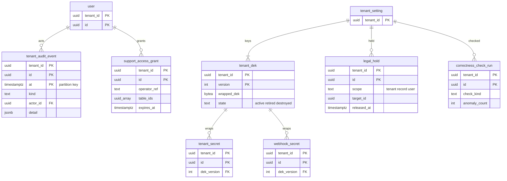
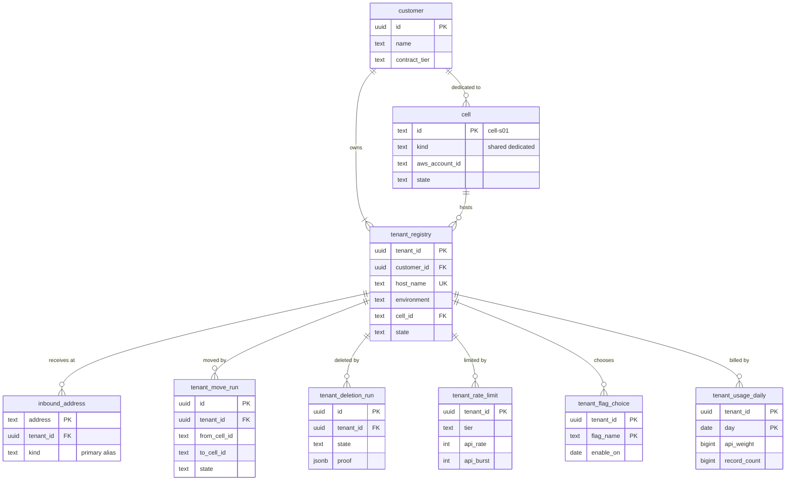

# Data model: 鍵・監査・運用と制御の面

[data-model.md](../data-model.md) の一部。セルの DB のテナントの DEK・テナントの監査ログ・サポートの参照の許可・リーガルホールド・正しさの監視の結果と、制御の面の DB（顧客・テナントの台帳・受信のアドレス・セル・テナントの移動と削除・レート制限の段・選べる変更の日・利用量）を定義する。プラットフォームの監査は log-archive の S3 だけに置く（形は [stores.md](stores.md) の 2 節）。振る舞いは [security.md](../security.md)、[infrastructure.md](../infrastructure.md)、[observability.md](../observability.md)、[delivery.md](../delivery.md) を正とする。

## 1. ER 図（セルの DB）

## 2. セルの DB

### 2.1 `tenant_dek`

テナントの DEK の暗号文（セルの `tenant-secrets` の KMS の鍵で包む）。テナントの削除で消す（暗号文の秘密を読めなくする）。定義元：[security.md](../security.md) の 5.2 節。

| 列 | 型 | NULL | 既定 | 説明 |
| --- | --- | --- | --- | --- |
| `tenant_id` | `uuid` | NOT NULL | — | |
| `version` | `integer` | NOT NULL | — | 1 から。入れ替えで増やす |
| `wrapped_dek` | `bytea` | NOT NULL | — | KMS の `GenerateDataKey` の暗号文 |
| `kms_key_arn` | `text` | NOT NULL | — | |
| `state` | `text` | NOT NULL | `'active'` | `active`・`retired`（読むだけ）・`destroyed` |
| `created_at`・`retired_at` | | | | |

- キー：PK `(tenant_id, version)`。UK `(tenant_id) WHERE state = 'active'`。
- 平文の DEK は DB・ログに書かない。プロセスの中に短く（5 分）キャッシュする。
- 保持：テナント。S1 の量：数百行。

### 2.2 `tenant_audit_event`

テナントの監査ログ（ログイン、SSO の失敗、`break_glass`、成り代わり、ロールの付け外し、API のクライアントと秘密の発行・失効、エクスポート、パッケージの適用、サポートの参照の許可）。定義元：同じ文書の 6 節。

| 列 | 型 | NULL | 既定 | 説明 |
| --- | --- | --- | --- | --- |
| `tenant_id` | `uuid` | NOT NULL | — | |
| `id` | `uuid` | NOT NULL | `uuidv7()` | |
| `at` | `timestamptz` | NOT NULL | `now()` | パーティションのキー（月） |
| `kind` | `text` | NOT NULL | — | `login.succeeded`・`login.failed`・`break_glass.login`・`impersonation.started`・`role.granted`・`api_secret.issued`・`export.requested`・`package.applied`・`support_access.granted` など |
| `actor_id` | `uuid` | NULL | — | |
| `real_actor_id` | `uuid` | NULL | — | |
| `ip` | `inet` | NULL | — | PII |
| `user_agent` | `text` | NULL | — | |
| `request_id` | `text` | NULL | — | `<Brand>-Request-Id` |
| `target` | `jsonb` | NULL | — | 対象の ID（値を入れない） |
| `detail` | `jsonb` | NOT NULL | `'{}'` | 秘密・パスワード・トークンを入れない |

- キー：PK `(tenant_id, id, at)`。索引 `(tenant_id, kind, at DESC)`、`(tenant_id, actor_id, at DESC)`。
- アプリのロールは `INSERT`・`SELECT` だけ。日次のジョブが前日の分を log-archive の S3 へ写す（[stores.md](stores.md) の 2 節）。
- パーティション：`at` の月。保持：DB に 1 年（`DROP`）、log-archive に 7 年。S1 の量：1 日 約 200 万行（ログインが主）。

### 2.3 `support_access_grant`

テナントの管理者が出す、運用者のサポートの参照の許可（読み取りだけ、最長 72 時間）。定義元：同じ文書の 8 節、[ADR-0052](../../decisions/0052-keys-encryption-and-operator-access.md)。

| 列 | 型 | NULL | 既定 | 説明 |
| --- | --- | --- | --- | --- |
| `tenant_id` | `uuid` | NOT NULL | — | |
| `id` | `uuid` | NOT NULL | `uuidv7()` | |
| `granted_by` | `uuid` | NOT NULL | — | `tenant_admin` |
| `operator_ref` | `text` | NULL | — | 対象の運用者（社内の ID。NULL は当番の誰でも） |
| `ticket_ref` | `text` | NOT NULL | — | サポートの問い合わせの番号 |
| `table_ids` | `uuid[]` | NULL | — | NULL は全体 |
| `reason` | `text` | NOT NULL | — | |
| `starts_at`・`expires_at` | `timestamptz` | NOT NULL | — | |
| `revoked_at`・`revoked_by` | | NULL | — | |

- キー：PK `(tenant_id, id)`。索引 `(tenant_id, expires_at) WHERE revoked_at IS NULL`。
- CHECK：`expires_at <= starts_at + interval '72 hours'`。
- 運用者は主体 `support:<operator_id>` で Record Service の読み取り専用の経路から読み、参照したレコードの ID はプラットフォームの監査に残す。
- 保持：監査と同じ 7 年。S1 の量：年 数千行。

### 2.4 `legal_hold`

リーガルホールド（テナント・レコード・利用者の単位）。保持の期限と削除のジョブに優先する。掛け外しは `platform` のロールだけが書き、アプリのロールは読むだけ。定義元：同じ文書の 9.3 節。

| 列 | 型 | NULL | 既定 | 説明 |
| --- | --- | --- | --- | --- |
| `tenant_id` | `uuid` | NOT NULL | — | |
| `id` | `uuid` | NOT NULL | `uuidv7()` | |
| `scope` | `text` | NOT NULL | — | `tenant`・`record`・`user` |
| `target_id` | `uuid` | NULL | — | `record`・`user` のとき |
| `reason` | `text` | NOT NULL | — | |
| `requested_by` | `text` | NOT NULL | — | テナントの依頼、または法的な求めの参照 |
| `placed_by`・`placed_at` | | NOT NULL | — | 運用者 |
| `released_by`・`released_at` | | NULL | — | |

- キー：PK `(tenant_id, id)`。索引 `(tenant_id, scope, target_id) WHERE released_at IS NULL` — 削除のジョブと保持のジョブの確かめ。
- CHECK：`(scope = 'tenant') = (target_id IS NULL)`。
- テナントの単位のホールドがある間、テナントの削除のジョブは始まらない（制御の面の `tenant_deletion_run` がセルに問い合わせる）。
- 保持：解除の後 7 年。S1 の量：数十行。

### 2.5 `correctness_check_run`

正しさの監視の結果（テナントのコンテキストで reader で動かす）。本文は持たず、件数と識別子だけ。定義元：[observability.md](../observability.md) の 5 節、[ADR-0059](../../decisions/0059-slis-timer-lag-and-correctness-monitors.md)。

| 列 | 型 | NULL | 既定 | 説明 |
| --- | --- | --- | --- | --- |
| `tenant_id` | `uuid` | NOT NULL | — | |
| `id` | `uuid` | NOT NULL | `uuidv7()` | |
| `check_kind` | `text` | NOT NULL | — | `overdue_breach`・`stuck_flow_run`・`implement_without_approval`・`audit_chain`・`duplicate_ci`・`dangling_reference`・`ext_index_mismatch`・`sla_recompute_sample` |
| `started_at`・`finished_at` | `timestamptz` | | | |
| `checked_count` | `integer` | NOT NULL | `0` | |
| `anomaly_count` | `integer` | NOT NULL | `0` | |
| `sample_ids` | `uuid[]` | NOT NULL | `'{}'` | 異常の行の ID（最大 20） |
| `state` | `text` | NOT NULL | `'running'` | `running`・`completed`・`failed` |

- キー：PK `(tenant_id, id)`。索引 `(tenant_id, check_kind, started_at DESC)`。
- 全テナントの集計はメトリクス（AMP）で行い、この表をテナントをまたいで読まない。
- 保持：90 日（日次の削除のジョブ）。S1 の量：1 日 数万行。

## 3. 制御の面の DB

制御の面の Aurora（control のアカウント）に置く。**テナントの表ではない**ので `tenant_id` の RLS を掛けず、制御の面のサービスのロールだけが読み書きする。セルの DB にはテナントの台帳を置かず、セルの App は台帳の写し（ホスト名・受信のアドレス → テナント → セル）をメモリーに持つ（[infrastructure.md](../infrastructure.md) の 3.1 節）。

### 3.1 ER 図（制御の面）

### 3.2 `customer`・`cell`

| 表 | 列 |
| --- | --- |
| `customer` | `id`（`uuid`）、`name`、`contract_tier`（`standard`・`enterprise`・`dedicated`）、`created_at`、`updated_at` |
| `cell` | `id`（`text`：`cell-s01` など。`infra/cells.yaml` と一致させる）、`kind`（`shared`・`dedicated`）、`customer_id`（専用のセルのとき）、`size`、`aws_account_id`、`primary_region`、`dr_region`、`cloudfront_origin_id`、`inbound_subdomain`（専用のセルの `<cell>.in.<brand>.<domain>`）、`state`（`provisioning`・`active`・`draining`・`retired`）、`accepts_new_tenants`（`boolean`）、`created_at` |

- キー：`customer` PK `(id)`。`cell` PK `(id)`、FK `customer_id` → `customer`。CI で `cells.yaml` と突き合わせる（[infrastructure.md](../infrastructure.md) の 7.2 節）。
- CHECK：`(kind = 'dedicated') = (customer_id IS NOT NULL)`。
- 保持：消さない。S1 の量：顧客 約 100、セル 2。

### 3.3 `tenant_registry`

テナントの台帳（ホスト名 → テナント → セル）。変更は KeyValueStore（ホスト名 → セル）と、セルの App への SNS の事象に写す。定義元：[infrastructure.md](../infrastructure.md) の 3.1・4.2 節、[ADR-0002](../../decisions/0002-tenancy-and-isolation.md)、[ADR-0055](../../decisions/0055-accounts-cells-and-edge-router.md)。

| 列 | 型 | NULL | 既定 | 説明 |
| --- | --- | --- | --- | --- |
| `tenant_id` | `uuid` | NOT NULL | `uuidv7()` | |
| `customer_id` | `uuid` | NOT NULL | — | 同じ顧客のテナントは同じセル |
| `host_name` | `text` | NOT NULL | — | `<tenant>.<brand>.<domain>`（小文字） |
| `slug` | `text` | NOT NULL | — | `<tenant>` の部分。受信のアドレスの既定にも使う |
| `environment` | `text` | NOT NULL | — | `production`・`sub_production` |
| `cell_id` | `text` | NOT NULL | — | |
| `region` | `text` | NOT NULL | `'ap-northeast-1'` | テナントはリージョンに固定 |
| `state` | `text` | NOT NULL | `'provisioning'` | `provisioning`・`active`・`moving`・`suspended`・`deleting`・`deleted` |
| `version` | `bigint` | NOT NULL | `1` | 台帳の写しの差分の反映 |
| `created_at`・`suspended_at`・`deleted_at` | | | | |

- キー：PK `(tenant_id)`。UK `(host_name)`、UK `(slug)`。FK `customer_id` → `customer`、`cell_id` → `cell`。
- 索引：`(cell_id, state)` — セルの App の起動の時の全件の読み込み（5 分ごとの読み直しも）。
- CHECK：`host_name = slug || '.<brand>.<domain>'` は設定の値で確かめる。同じ顧客のテナントが同じセルにあることは、作成と移動の手順で守る（トリガーでも確かめる）。
- 保持：削除の後も行を残す（`deleted`。ホスト名の再利用を 90 日禁止）。S1 の量：300 行。

### 3.4 `inbound_address`

受信のアドレス → テナント（`mail-router` が写しで引く）。定義元：[notifications-and-email-ingest.md](../notifications-and-email-ingest.md) の 5.1 節、[infrastructure.md](../infrastructure.md) の 2.3 節。

| 列 | 型 | NULL | 既定 | 説明 |
| --- | --- | --- | --- | --- |
| `address` | `text` | NOT NULL | — | 小文字の完全なアドレス（`<tenant>@in.<brand>.<domain>`、`<tenant>+<alias>@...`） |
| `tenant_id` | `uuid` | NOT NULL | — | |
| `kind` | `text` | NOT NULL | — | `primary`・`alias` |
| `created_at` | `timestamptz` | NOT NULL | `now()` | |

- キー：PK `(address)`。FK `tenant_id` → `tenant_registry`。索引 `(tenant_id)`。
- 保持：テナントの削除で消す。S1 の量：数千行。

### 3.5 `tenant_move_run`・`tenant_deletion_run`

セル間の移動と、テナントの削除の実行の記録。削除の記録は、セルのテナントの行を消した後も残るように制御の面に置く（2026-09-28 の統合で決めた）。定義元：[infrastructure.md](../infrastructure.md) の 4.2 節、[security.md](../security.md) の 9.1 節。

| 表 | 列 |
| --- | --- |
| `tenant_move_run` | `id`、`tenant_id`、`from_cell_id`、`to_cell_id`、`state`（`preparing`・`copying`・`catching_up`・`frozen`・`verifying`・`switched`・`reindexing`・`cleanup_pending`・`completed`・`failed`・`rolled_back`）、`frozen_at`、`switched_at`、`verification`（`jsonb`：表ごとの件数とハッシュ）、`cleanup_after`（切り替え ＋ 7 日）、`started_by`、`started_at`、`completed_at`、`error` |
| `tenant_deletion_run` | `id`、`tenant_id`、`state`（`suspended`・`waiting`・`blocked_by_hold`・`deleting`・`completed`・`failed`）、`requested_by`、`requested_at`、`delete_after`（停止 ＋ 30 日）、`started_at`、`completed_at`、`proof`（`jsonb`：表ごと・S3・索引・Valkey の消した件数、DEK の破棄）、`error` |

- キー：どちらも PK `(id)`。FK `tenant_id` → `tenant_registry`。UK `(tenant_id) WHERE state NOT IN ('completed','failed','rolled_back')`（同時に 1 つ）。
- 操作はすべてプラットフォームの監査に残す。
- 保持：7 年（L4・L5 の確認待ち）。S1 の量：数十行。

### 3.6 `tenant_rate_limit`

契約の段のレート制限（セルに配る）。定義元：[api-and-integrations.md](../api-and-integrations.md) の 7.1 節。

| 列 | 型 | NULL | 既定 | 説明 |
| --- | --- | --- | --- | --- |
| `tenant_id` | `uuid` | NOT NULL | — | |
| `tier` | `text` | NOT NULL | `'standard'` | |
| `api_rate`・`api_burst` | `integer` | NOT NULL | — | 本番の既定 1 秒 100・1,000、サブプロダクション 20・200 |
| `client_rate`・`client_burst` | `integer` | NOT NULL | — | 既定 50・500 |
| `user_rate`・`user_burst` | `integer` | NOT NULL | — | 既定 20・100 |
| `export_concurrency`・`import_concurrency`・`capped_count_concurrency` | `smallint` | NOT NULL | — | 既定 2・2・10 |
| `updated_at`・`updated_by` | | | | |

- キー：PK `(tenant_id)`。保持：台帳に従う。S1 の量：300 行。

### 3.7 `tenant_flag_choice`

選べる変更の、テナントが選んだ有効にする日（最大 60 日の中）。AppConfig のフラグの条件に写す。2026-09-28 の統合で最小の形で定義した（[delivery.md](../delivery.md) の 6.2 節）。

| 列 | 型 | NULL | 既定 | 説明 |
| --- | --- | --- | --- | --- |
| `tenant_id` | `uuid` | NOT NULL | — | |
| `flag_name` | `text` | NOT NULL | — | |
| `enable_on` | `date` | NOT NULL | — | テナントのタイムゾーンの日 |
| `chosen_by`・`chosen_at` | | | | テナントの管理者 |

- キー：PK `(tenant_id, flag_name)`。CHECK は 60 日の範囲を制御の面の API で確かめる。
- 保持：フラグを消すまで。S1 の量：数千行。

### 3.8 `tenant_usage_daily`

課金の集計（セルの費用を要求の重みとレコードの数で按分する材料）。2026-09-28 の統合で最小の形で定義した（[infrastructure.md](../infrastructure.md) の 10 節）。

| 列 | 型 | NULL | 既定 | 説明 |
| --- | --- | --- | --- | --- |
| `tenant_id` | `uuid` | NOT NULL | — | |
| `day` | `date` | NOT NULL | — | |
| `api_weight` | `bigint` | NOT NULL | — | 要求の重みの合計 |
| `record_count` | `bigint` | NOT NULL | — | `task`・`ci`・`custom_record` の行の数 |
| `storage_bytes` | `bigint` | NOT NULL | — | S3 の添付・原本 |
| `active_users` | `integer` | NOT NULL | — | |

- キー：PK `(tenant_id, day)`。セルの `platform` のロールの日次のジョブが件数だけを集めて送る（本文を読まない）。
- 保持：7 年。S1 の量：年 約 11 万行。
