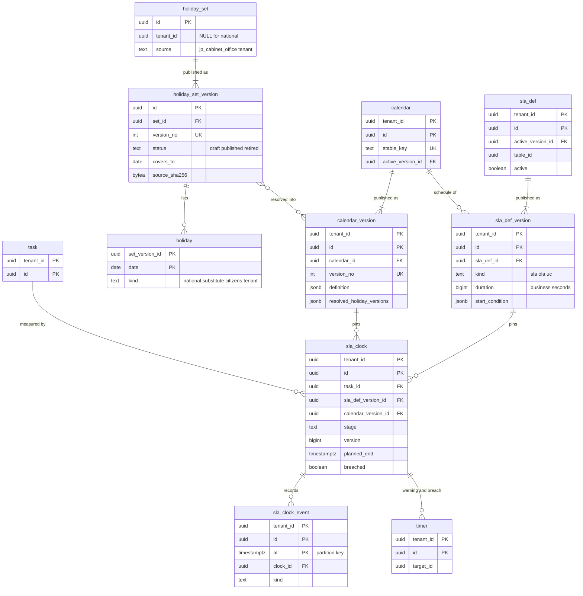

# Data model: カレンダー・祝日・SLA

[data-model.md](../data-model.md) の一部。業務カレンダーと版、祝日の集合と版（国民の祝日は NULL の行）、SLA の定義と版、計時の行と事象を定義する。振る舞い（業務時間の区間、計時の関数、保存の時の評価 DT-SLA-001、警告と違反、計算し直し）は [sla-and-calendars.md](../sla-and-calendars.md) を正とする。

- 計時の行は、定義の版・カレンダーの版・タイムゾーンを開始の時に固定する（[ADR-0021](../../decisions/0021-sla-definitions-and-timers.md)）。カレンダー・祝日の新しい版は、計算し直しのジョブで明示的に反映する。
- `holiday_set`・`holiday_set_version`・`holiday` は NULL の行（国民の祝日）を持つ。主キーは `id`（`holiday` は `(set_version_id, date)`）。
- **祝日の日付をコードに埋め込まない。** 内閣府の CSV の原本を S3 に置き、版の `source_sha256` で対応させる（[stores.md](stores.md) の 2 節）。

## 1. ER 図

## 2. カレンダー

### 2.1 `calendar`

業務カレンダー。既定のカレンダー（平日 9:00〜18:00、Asia/Tokyo、国民の祝日 `latest`、会社の休日 12/29〜1/3）はテナントの作成の時にテナントの行として作る。変更の予定表の時間帯（`change_window`）も区間の定義にこの表を使う。定義元：[sla-and-calendars.md](../sla-and-calendars.md) の 3.1 節。

| 列 | 型 | NULL | 既定 | 説明 |
| --- | --- | --- | --- | --- |
| `tenant_id` | `uuid` | NOT NULL | — | |
| `id` | `uuid` | NOT NULL | `uuidv7()` | |
| `name` | `text` | NOT NULL | — | |
| `purpose` | `text` | NOT NULL | `'business_hours'` | `business_hours`・`change_window`（区間の意味だけが違う） |
| `active_version_id` | `uuid` | NULL | — | → `calendar_version` |
| メタデータの共通の列 | | | | |

- キー：PK `(tenant_id, id)`。UK `(tenant_id, stable_key)`。FK `(tenant_id, active_version_id)` → `calendar_version`。
- 保持：メタデータ。S1 の量：1 テナント 数十行。

### 2.2 `calendar_version`

公開ごとに不変の版。`latest` の祝日の集合は公開の時点の具体的な版に解いて持つ。定義元：同じ文書の 3.1・8 節。

| 列 | 型 | NULL | 既定 | 説明 |
| --- | --- | --- | --- | --- |
| `tenant_id` | `uuid` | NOT NULL | — | |
| `id` | `uuid` | NOT NULL | `uuidv7()` | |
| `calendar_id` | `uuid` | NOT NULL | — | |
| `version_no` | `integer` | NOT NULL | — | |
| `definition` | `jsonb` | NOT NULL | — | `Calendar { time_zone, weekly, holiday_sets, company_holidays, exceptions }` |
| `resolved_holiday_versions` | `jsonb` | NOT NULL | — | `[{set_id, set_version_id}]`（`latest` を解いたもの） |
| `content_hash` | `bytea` | NOT NULL | — | |
| `published_at`・`published_by` | | | | 祝日の新しい版による自動の作成は `published_by` が NULL |

- キー：PK `(tenant_id, id)`。UK `(tenant_id, calendar_id, version_no)`。FK `(tenant_id, calendar_id)` → `calendar`。
- 索引：`USING gin (resolved_holiday_versions jsonb_path_ops)` — 祝日の新しい版の公開で、`latest` を参照するカレンダーを探す。
- CHECK：`definition` の形は Zod で検証する（保存の時の検証は同じ文書の 4.4 節）。
- `UPDATE` を与えない。保持：版を消さない（固定の版を指す計時の行があるため）。S1 の量：1 テナント 年 数十行。

## 3. 祝日

### 3.1 `holiday_set`

祝日の集合。国民の祝日は NULL の行（全テナント共通）。定義元：同じ文書の 3.1・5 節、[ADR-0020](../../decisions/0020-japanese-holiday-data.md)。

| 列 | 型 | NULL | 既定 | 説明 |
| --- | --- | --- | --- | --- |
| `id` | `uuid` | NOT NULL | `uuidv7()` | |
| `tenant_id` | `uuid` | NULL | — | |
| `source` | `text` | NOT NULL | — | `jp_cabinet_office`・`tenant` |
| `name` | `text` | NOT NULL | — | |
| `created_at`・`updated_at` | | | | |

- キー：PK `(id)`。UK `NULLS NOT DISTINCT (tenant_id, name)`。
- CHECK：`(source = 'jp_cabinet_office') = (tenant_id IS NULL)`。
- 保持：消さない。S1 の量：NULL の行 1、テナントの行 数百。

### 3.2 `holiday_set_version`

祝日の集合の版。国民の祝日は取り込みのジョブが草案を作り、運用者 2 人の承認で公開する。テナントの集合はテナントの `sla_admin` が承認する。定義元：同じ文書の 5.1〜5.4 節。

| 列 | 型 | NULL | 既定 | 説明 |
| --- | --- | --- | --- | --- |
| `id` | `uuid` | NOT NULL | `uuidv7()` | |
| `tenant_id` | `uuid` | NULL | — | 集合と同じ |
| `set_id` | `uuid` | NOT NULL | — | |
| `version_no` | `integer` | NOT NULL | — | |
| `status` | `text` | NOT NULL | `'draft'` | `draft`・`published`・`retired` |
| `covers_from`・`covers_to` | `date` | NOT NULL | — | 収録の範囲（CSV の最初の年の 1/1 〜 最後の年の 12/31） |
| `source_sha256` | `bytea` | NULL | — | CSV の原本（S3）のハッシュ |
| `fetched_at` | `timestamptz` | NULL | — | |
| `validation` | `jsonb` | NOT NULL | `'{}'` | DT-HOL-001 の結果（`rule_mismatch`、`past_changed` など） |
| `diff_summary` | `jsonb` | NULL | — | 前の版との差分 |
| `approved_by` | `uuid[]` | NOT NULL | `'{}'` | 承認した人（国民の祝日は運用者、`past_changed` は 2 人目が要る） |
| `published_at` | `timestamptz` | NULL | — | |

- キー：PK `(id)`。UK `(set_id, version_no)`。UK `(set_id) WHERE status = 'draft'`（草案は 1 つ）。FK `set_id` → `holiday_set(id)`。
- CHECK：`(status = 'published') = (published_at IS NOT NULL)`、`covers_from <= covers_to`。
- 公開した版は変えない（前の版も `retired` にしない）。承認と公開はプラットフォームの監査に残す。
- 保持：版を消さない。S1 の量：年 数十行。

### 3.3 `holiday`

版ごとの祝日の日付。定義元：同じ文書の 3.1・5.2 節。

| 列 | 型 | NULL | 既定 | 説明 |
| --- | --- | --- | --- | --- |
| `set_version_id` | `uuid` | NOT NULL | — | |
| `date` | `date` | NOT NULL | — | 暦の日（タイムゾーンなし） |
| `tenant_id` | `uuid` | NULL | — | 版と同じ |
| `name` | `text` | NOT NULL | — | |
| `kind` | `text` | NOT NULL | — | `national`・`substitute`・`citizens`・`tenant`（計時は使わない。表示とテストの生成のため） |

- キー：PK `(set_version_id, date)`。FK `set_version_id` → `holiday_set_version(id)`。
- 版の公開の後は変えない（`draft` の間だけ書ける）。
- 保持：版に従う。S1 の量：国民の祝日は 1 版 約 1,050 日（1955 年から）。

## 4. SLA の定義

### 4.1 `sla_def`

SLA・OLA・UC の定義の同一性。組み込みの定義（インシデントの応答・解決、担当のグループの OLA）はテナントの作成の時にテナントの行として作る。定義元：同じ文書の 6.1 節、[itsm-processes.md](../itsm-processes.md) の 4.4 節。

| 列 | 型 | NULL | 既定 | 説明 |
| --- | --- | --- | --- | --- |
| `tenant_id` | `uuid` | NOT NULL | — | |
| `id` | `uuid` | NOT NULL | `uuidv7()` | |
| `name` | `text` | NOT NULL | — | |
| `table_id` | `uuid` | NOT NULL | — | 対象のクラス（有効な版から写す。子のクラスにも効く） |
| `active_version_id` | `uuid` | NULL | — | → `sla_def_version` |
| `active` | `boolean` | NOT NULL | `true` | 無効にしたら動いている行を `cancelled`（`definition_deactivated`。管理者が選べば続ける） |
| メタデータの共通の列 | | | | |

- キー：PK `(tenant_id, id)`。UK `(tenant_id, stable_key)`。FK `(tenant_id, active_version_id)` → `sla_def_version`。
- 索引：`(tenant_id, table_id) WHERE active` — 保存の流れの 8 段の評価（コンパイルしてキャッシュする元）。
- 保持：メタデータ。S1 の量：1 テナント 数十行。

### 4.2 `sla_def_version`

定義の不変の版。2026-09-28 の統合で、`flow_def`・`flow_version` と同じ形に分けた（計時の行の `sla_def_version_id` の参照先）。定義元：同じ文書の 6.1 節。

| 列 | 型 | NULL | 既定 | 説明 |
| --- | --- | --- | --- | --- |
| `tenant_id` | `uuid` | NOT NULL | — | |
| `id` | `uuid` | NOT NULL | `uuidv7()` | |
| `sla_def_id` | `uuid` | NOT NULL | — | |
| `version_no` | `integer` | NOT NULL | — | |
| `kind` | `text` | NOT NULL | — | `sla`・`ola`・`uc` |
| `target` | `text` | NOT NULL | `'none'` | `none`・`response`・`resolution` |
| `table_id` | `uuid` | NOT NULL | — | |
| `duration` | `bigint` | NOT NULL | — | 業務時間の秒 |
| `schedule_source` | `text` | NOT NULL | — | `none`・`definition`・`task_field` |
| `calendar_id` | `uuid` | NULL | — | `definition`、または `task_field` の空のときの既定 |
| `schedule_field_id` | `uuid` | NULL | — | `task_field` のとき |
| `tz_source` | `text` | NOT NULL | `'definition'` | `requester`・`definition`・`ci_location`・`task_location`・`requester_location` |
| `start_condition`・`pause_condition`・`stop_condition`・`reset_condition`・`cancel_condition`・`resume_condition` | `jsonb` | NULL | — | 式の木（保存の後の値で評価） |
| `cancel_when` | `text` | NOT NULL | `'start_not_met'` | `start_not_met`・`cancel_condition`・`never` |
| `resume_when` | `text` | NOT NULL | `'pause_not_met'` | `pause_not_met`・`resume_condition` |
| `retroactive_start_field_id` | `uuid` | NULL | — | 日時のフィールド |
| `retroactive_pause` | `boolean` | NOT NULL | `false` | |
| `warn_at` | `smallint[]` | NOT NULL | `'{50,75}'` | 警告の割合 |
| `notify` | `jsonb` | NOT NULL | — | 受け手とテンプレート |
| `content_hash` | `bytea` | NOT NULL | — | |
| `published_at`・`published_by` | | | | |

- キー：PK `(tenant_id, id)`。UK `(tenant_id, sla_def_id, version_no)`。FK `(tenant_id, sla_def_id)` → `sla_def`、`(tenant_id, calendar_id)` → `calendar`。
- CHECK：`duration > 0`、`warn_at <@ ARRAY[1..99]`（1〜99 の値だけ）、`(cancel_when = 'cancel_condition') = (cancel_condition IS NOT NULL)`、`(resume_when = 'resume_condition') = (resume_condition IS NOT NULL)`、`schedule_source <> 'definition' OR calendar_id IS NOT NULL`。一時停止の条件が監査から外したフィールドを使い `retroactive_pause` のときは、保存の時に 422。
- `UPDATE` を与えない。保持：版を消さない（計時の行が指すため）。S1 の量：1 テナント 年 数百行。

## 5. 計時

### 5.1 `sla_clock`

タスク × SLA の定義の計時の行。定義元：同じ文書の 6.2〜8 節、[reports.md](../reports.md) の 8.2 節。

| 列 | 型 | NULL | 既定 | 説明 |
| --- | --- | --- | --- | --- |
| `tenant_id` | `uuid` | NOT NULL | — | |
| `id` | `uuid` | NOT NULL | `uuidv7()` | |
| `task_id` | `uuid` | NOT NULL | — | |
| `sla_def_id` | `uuid` | NOT NULL | — | 版の定義の写し（部分一意索引のため） |
| `sla_def_version_id` | `uuid` | NOT NULL | — | 開始の時に固定 |
| `stage` | `text` | NOT NULL | — | `in_progress`・`paused`・`completed`・`cancelled` |
| `version` | `bigint` | NOT NULL | `1` | タイマーの `target_version` と比べる |
| `calendar_version_id` | `uuid` | NULL | — | NULL は 24 時間 365 日。開始の時に固定（計算し直しで替わる） |
| `time_zone` | `text` | NOT NULL | — | 開始の時に解いて固定 |
| `start_at` | `timestamptz` | NOT NULL | — | 秒に切り捨て |
| `duration` | `bigint` | NOT NULL | — | 版の値の写し（秒） |
| `pause_since` | `timestamptz` | NULL | — | `paused` のとき |
| `paused_business`・`paused_wall` | `bigint` | NOT NULL | `0` | 一時停止の累計（秒） |
| `planned_end` | `timestamptz` | NULL | — | 期限。`paused` のときは NULL |
| `stop_at` | `timestamptz` | NULL | — | |
| `breached` | `boolean` | NOT NULL | `false` | 段階とは別の印。取り消さない |
| `breached_at` | `timestamptz` | NULL | — | 期限の時刻（発火の時刻ではない） |
| `breach_disputed_at` | `timestamptz` | NULL | — | 計算し直しで違反の行の新しい期限がまだ来ていないと分かった時刻 |
| `warned_pct` | `smallint` | NOT NULL | `0` | 送った警告の最大の割合 |
| `calendar_coverage_exceeded` | `boolean` | NOT NULL | `false` | 期限が祝日の収録の範囲を越える |
| `cancel_reason` | `text` | NULL | — | `start_not_met`・`cancel_condition`・`reset`・`definition_deactivated`・`task_deleted` |
| `created_at`・`updated_at` | `timestamptz` | NOT NULL | `now()` | |

- キー：PK `(tenant_id, id)`。UK `(tenant_id, task_id, sla_def_id) WHERE stage IN ('in_progress','paused')`。FK `(tenant_id, task_id)` → `task`（`ON DELETE` は Record Service が先に `cancelled`（`task_deleted`）にしてから消す）、`(tenant_id, sla_def_version_id)` → `sla_def_version`、`(tenant_id, calendar_version_id)` → `calendar_version`。
- 索引：`(tenant_id, task_id)` — タスクの画面の計時の一覧。`(tenant_id, calendar_version_id) WHERE stage IN ('in_progress','paused')` — 計算し直しのジョブ（500 件ずつ）。`(tenant_id, planned_end) WHERE stage = 'in_progress' AND NOT breached` — 期限を過ぎた未発火の違反の監視（毎分）。`(tenant_id, sla_def_id, start_at)` — 達成率のレポート（`source = sla`）。
- CHECK：`stage IN (...)`、`(stage = 'paused') = (pause_since IS NOT NULL)`、`stage <> 'paused' OR planned_end IS NULL`、`breached = (breached_at IS NOT NULL)`、`breach_disputed_at IS NULL OR breached`、`warned_pct BETWEEN 0 AND 100`。
- 保持：タスクに従う。S1 の量：動いている約 200 万行、年 約 1.5 億行。

### 5.2 `sla_clock_event`

計時の行の変化の追記だけの記録。監査の対象。定義元：同じ文書の 6.2・6.5.1・8 節。

| 列 | 型 | NULL | 既定 | 説明 |
| --- | --- | --- | --- | --- |
| `tenant_id` | `uuid` | NOT NULL | — | |
| `id` | `uuid` | NOT NULL | `uuidv7()` | |
| `at` | `timestamptz` | NOT NULL | `now()` | パーティションのキー（月） |
| `clock_id` | `uuid` | NOT NULL | — | |
| `task_id` | `uuid` | NOT NULL | — | |
| `kind` | `text` | NOT NULL | — | `started`・`start_and_stop_same_save`・`paused`・`resumed`・`completed`・`cancelled`・`reset`・`warning`・`breached`・`recalculated`・`breach_disputed`・`retro_pause_truncated` |
| `before`・`after` | `jsonb` | NULL | — | 変わった列の前後（`planned_end`、`calendar_version_id` など） |
| `cause_kind` | `text` | NOT NULL | — | `save`・`timer`・`recalculation`・`definition_change` |
| `cause_id` | `uuid` | NULL | — | 保存の `record_change.id`、タイマー、計算し直しのジョブ |

- キー：PK `(tenant_id, id, at)`。
- 索引：`(tenant_id, clock_id, at)` — 計時の画面の履歴、監査の再現。`(tenant_id, at) WHERE kind = 'breach_disputed'` — レポートの別の集計。
- アプリのロールは `INSERT`・`SELECT` だけ。パーティション：`at` の月。
- 保持：監査と同じ 7 年。S1 の量：保存 1 回に約 1 行 → 年 約 5 億行。
